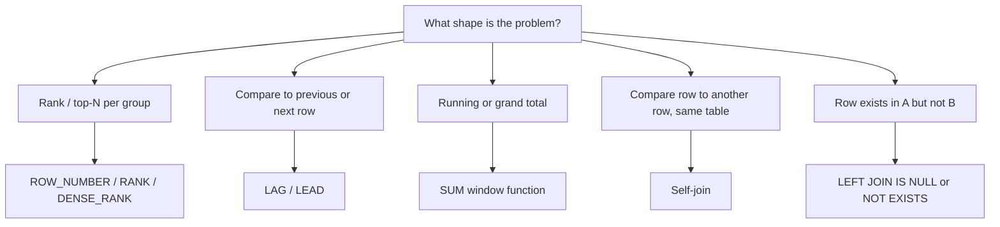

This page is a practice reference, not a tutorial — it assumes you know `SELECT`/`JOIN`/`GROUP BY` and drills the specific problem shapes that show up repeatedly in SQL interview rounds. Work through the technique column before looking at the solution.

## The classic problem list

| # | Problem | Technique |
|---|---|---|
| 1 | Second highest salary | `OFFSET`/`LIMIT` or `DENSE_RANK` |
| 2 | Nth highest value per group | `DENSE_RANK() OVER (PARTITION BY ...)` |
| 3 | Top N per group | `ROW_NUMBER() OVER (PARTITION BY ...)` |
| 4 | Running total | `SUM(...) OVER (ORDER BY ...)` |
| 5 | Gaps in a sequence | `LEAD`/self-join to find missing numbers |
| 6 | Islands of consecutive values | Row number difference trick |
| 7 | Consecutive rows matching a condition | Self-join or `LAG`/`LEAD` chain |
| 8 | Find duplicate rows | `GROUP BY ... HAVING COUNT(*) > 1` |
| 9 | Delete duplicate rows, keep one | `ROW_NUMBER()` + `DELETE` on rn > 1 |
| 10 | Employees earning more than their manager | Self-join `Employee` to itself |
| 11 | Top earner per department | `RANK()`/`ROW_NUMBER() PARTITION BY dept` |
| 12 | Second-most-recent order per customer | `ROW_NUMBER() PARTITION BY customer ORDER BY date DESC` |
| 13 | Month-over-month growth | `LAG() OVER (ORDER BY month)` |
| 14 | Percentage of total | Window `SUM` as denominator |
| 15 | Median value | `PERCENTILE_CONT(0.5)` or paired row-number trick |
| 16 | Pivot rows to columns | `CASE WHEN` inside `SUM`/`MAX`, grouped |
| 17 | Unpivot columns to rows | `UNION ALL` or `CROSS APPLY (VALUES ...)` |
| 18 | Customers with no orders | `LEFT JOIN ... WHERE right side IS NULL` |
| 19 | Customers with orders in every month | `GROUP BY` + `HAVING COUNT(DISTINCT month) = 12` |
| 20 | Rank with ties | `RANK()` vs `DENSE_RANK()` vs `ROW_NUMBER()` |
| 21 | Date bucketing (weekly/monthly) | `DATE_TRUNC`/`DATEADD(DATEDIFF(...))` |
| 22 | Cumulative distinct count | Window `COUNT(DISTINCT ...)` workaround or subquery |
| 23 | First purchase date per customer | `MIN(date)` grouped, or `ROW_NUMBER()` |
| 24 | Retention: active this month and last | Self-join on month offset |
| 25 | Average order value per customer segment | `JOIN` + `GROUP BY` + `AVG` |
| 26 | Products never ordered | `LEFT JOIN` / `NOT EXISTS` |
| 27 | Longest streak of daily activity | Islands technique on date differences |
| 28 | Deduplicate on insert | `INSERT ... WHERE NOT EXISTS` or unique constraint |
| 29 | Find the Nth row without `LIMIT`/`OFFSET` support | Correlated subquery counting rows `<=` |
| 30 | Employees with no direct reports | `LEFT JOIN Employee e2 ON e2.managerId = e1.id WHERE e2.id IS NULL` |

> [!KEY]
> Nearly every "advanced" SQL question is a window function in disguise. If you can fluently reach for `ROW_NUMBER`, `RANK`, `DENSE_RANK`, `LAG`/`LEAD`, and a windowed `SUM`, you can solve most of this list from first principles rather than memorising each one.



## Second highest / Nth highest value

```sql
-- Second highest salary (NULL if it doesn't exist)
SELECT MAX(salary) AS second_highest
FROM employees
WHERE salary < (SELECT MAX(salary) FROM employees);

-- Nth highest, robust to ties, via DENSE_RANK
SELECT salary FROM (
    SELECT salary, DENSE_RANK() OVER (ORDER BY salary DESC) AS rnk
    FROM employees
) t WHERE rnk = @N;
```
`MAX` with a subquery is the classic answer for N=2; `DENSE_RANK` generalises to any N and correctly treats tied salaries as the same rank.

## Top N per group

```sql
-- Top 3 highest-paid employees per department
SELECT * FROM (
    SELECT e.*, ROW_NUMBER() OVER (PARTITION BY department_id ORDER BY salary DESC) AS rn
    FROM employees e
) t WHERE rn <= 3;
```
`ROW_NUMBER` restarts per partition; filtering `rn <= 3` is the general "top N per group" pattern — swap in `RANK` if ties should share a position and both count toward N.

## Running totals and month-over-month growth

```sql
-- Running total of daily revenue
SELECT order_date, daily_total,
       SUM(daily_total) OVER (ORDER BY order_date) AS running_total
FROM daily_revenue;

-- Month-over-month growth percentage
SELECT month, revenue,
       LAG(revenue) OVER (ORDER BY month) AS prev_revenue,
       ROUND(100.0 * (revenue - LAG(revenue) OVER (ORDER BY month))
             / LAG(revenue) OVER (ORDER BY month), 2) AS pct_growth
FROM monthly_revenue;
```
A window `SUM` with no `PARTITION BY` accumulates over the whole ordered set; `LAG` reaches back one row within the same ordering to compute a delta.

## Gaps and islands

```sql
-- Gaps: find missing IDs in a sequence
SELECT id + 1 AS gap_start
FROM sequence_table s
WHERE NOT EXISTS (SELECT 1 FROM sequence_table WHERE id = s.id + 1)
  AND id <> (SELECT MAX(id) FROM sequence_table);

-- Islands: group consecutive dates of activity into runs
SELECT user_id, MIN(activity_date) AS run_start, MAX(activity_date) AS run_end
FROM (
    SELECT user_id, activity_date,
           DATEDIFF(day, ROW_NUMBER() OVER (PARTITION BY user_id ORDER BY activity_date), activity_date) AS grp
    FROM daily_activity
) t
GROUP BY user_id, grp;
```
The islands trick works because subtracting a strictly-increasing row number from a consecutive date sequence produces the **same constant** for every row in one unbroken run — that constant becomes the group key.

## Consecutive rows matching a condition

```sql
-- Find 3+ consecutive days where a sensor reading exceeded a threshold
SELECT DISTINCT a.sensor_id, a.reading_date
FROM readings a
JOIN readings b ON b.sensor_id = a.sensor_id AND b.reading_date = DATEADD(day, 1, a.reading_date)
JOIN readings c ON c.sensor_id = a.sensor_id AND c.reading_date = DATEADD(day, 2, a.reading_date)
WHERE a.value > @threshold AND b.value > @threshold AND c.value > @threshold;
```
A fixed-size consecutive-match (e.g., "exactly 3 in a row") is often clearest as a self-join chain; a variable-length streak should use the islands technique instead.

## Duplicate detection and removal

```sql
-- Find duplicate rows by (email)
SELECT email, COUNT(*) AS cnt
FROM users
GROUP BY email
HAVING COUNT(*) > 1;

-- Delete duplicates, keeping the lowest id
WITH ranked AS (
    SELECT id, ROW_NUMBER() OVER (PARTITION BY email ORDER BY id) AS rn
    FROM users
)
DELETE FROM users WHERE id IN (SELECT id FROM ranked WHERE rn > 1);
```
`GROUP BY ... HAVING` finds duplicates; `ROW_NUMBER` partitioned by the duplicate-defining columns is the standard way to keep exactly one row and delete the rest.

> [!TIP]
> Always decide *which* duplicate to keep (lowest ID, most recent timestamp) before writing the delete — `ORDER BY` inside the window function is where that decision lives, and getting it backwards silently deletes the wrong row.

## Employees earning more than their manager

```sql
SELECT e.name AS employee, e.salary, m.name AS manager, m.salary AS manager_salary
FROM employees e
JOIN employees m ON e.manager_id = m.id
WHERE e.salary > m.salary;
```
A **self-join**: the same table plays two roles (employee and manager) via two aliases, joined on the foreign key that references the table's own primary key.

## Department top earners and rank with ties

```sql
-- Highest earner(s) per department, correctly including ties
SELECT * FROM (
    SELECT e.*, RANK() OVER (PARTITION BY department_id ORDER BY salary DESC) AS rnk
    FROM employees e
) t WHERE rnk = 1;
```

| Function | Ties | Gaps after a tie |
|---|---|---|
| `ROW_NUMBER()` | Breaks ties arbitrarily (needs a deterministic `ORDER BY` to be safe) — never repeats a number | — |
| `RANK()` | Ties share the same rank | Yes — next rank skips (1, 1, 3) |
| `DENSE_RANK()` | Ties share the same rank | No gap (1, 1, 2) |

## Pivoting and unpivoting

```sql
-- Pivot: one row per product, one column per quarter
SELECT product_id,
       SUM(CASE WHEN quarter = 'Q1' THEN revenue ELSE 0 END) AS q1,
       SUM(CASE WHEN quarter = 'Q2' THEN revenue ELSE 0 END) AS q2
FROM quarterly_sales
GROUP BY product_id;

-- Unpivot: columns back to rows
SELECT product_id, 'q1' AS quarter, q1 AS revenue FROM sales_wide
UNION ALL
SELECT product_id, 'q2', q2 FROM sales_wide;
```
`CASE` inside an aggregate is the portable pivot pattern across engines that lack a native `PIVOT` keyword; `UNION ALL` is the equally portable way back.

## Median and percentage of total

```sql
-- Median (engines with PERCENTILE_CONT)
SELECT PERCENTILE_CONT(0.5) WITHIN GROUP (ORDER BY salary) AS median_salary
FROM employees;

-- Percentage each department contributes to total headcount
SELECT department_id, COUNT(*) AS headcount,
       ROUND(100.0 * COUNT(*) / SUM(COUNT(*)) OVER (), 2) AS pct_of_total
FROM employees
GROUP BY department_id;
```
`SUM(...) OVER ()` with no `PARTITION BY`/`ORDER BY` computes a single grand total alongside every grouped row — exactly what a "percentage of total" needs as its denominator.

## Customers with no orders, and gaps by month

```sql
-- Customers who have never placed an order
SELECT c.id, c.name
FROM customers c
LEFT JOIN orders o ON o.customer_id = c.id
WHERE o.id IS NULL;

-- Customers active in every one of the last 12 months
SELECT customer_id
FROM orders
WHERE order_date >= DATEADD(month, -12, GETDATE())
GROUP BY customer_id
HAVING COUNT(DISTINCT DATEPART(month, order_date)) = 12;
```
`LEFT JOIN ... WHERE right.id IS NULL` is the canonical "exists in A but not B" pattern — prefer it or `NOT EXISTS` over `NOT IN`, since `NOT IN` silently returns no rows if the subquery contains a single `NULL`.

## Syntax quick reference

| Need | Syntax |
|---|---|
| Row order within a group | `ROW_NUMBER() OVER (PARTITION BY g ORDER BY c)` |
| Rank with tie handling | `RANK()` / `DENSE_RANK() OVER (...)` |
| Previous/next row's value | `LAG(col, 1) OVER (...)` / `LEAD(col, 1) OVER (...)` |
| Running/grand total | `SUM(col) OVER (ORDER BY ...)` / `SUM(col) OVER ()` |
| First/last value in a window | `FIRST_VALUE(col) OVER (...)` / `LAST_VALUE(col) OVER (...)` |
| Percentile / median | `PERCENTILE_CONT(0.5) WITHIN GROUP (ORDER BY col)` |
| Conditional aggregation | `SUM(CASE WHEN cond THEN val ELSE 0 END)` |
| Existence check (safe with NULLs) | `WHERE EXISTS (...)` / `WHERE NOT EXISTS (...)` |
| Set difference | `EXCEPT` (or `NOT IN`/`NOT EXISTS` against a subquery) |
| Date truncation | `DATE_TRUNC('month', col)` (Postgres) / `DATEADD(month, DATEDIFF(month, 0, col), 0)` (SQL Server) |

> [!WARNING]
> `NOT IN (subquery)` silently returns zero rows for *every* row if the subquery produces even one `NULL` — a frequent, hard-to-spot bug. Prefer `NOT EXISTS` or filter `NULL`s out of the subquery explicitly.

> [!NOTE]
> Syntax for percentile, date truncation and pivoting varies meaningfully across Postgres, SQL Server, and MySQL — state the engine you're assuming out loud in an interview if it isn't given, since interviewers care more about the pattern than the exact dialect.

## Scalar, string, and date function reference

The window-function patterns above solve the "shape" questions; these are the scalar functions that show up inside almost every one of them, and the names that differ most between engines.

| Function | Purpose | Example |
|---|---|---|
| `ABS(n)` | Absolute value | `ABS(-25)` → `25` |
| `ROUND(n, d)` | Round to `d` decimal places | `ROUND(85.476, 2)` → `85.48` |
| `CEILING(n)` / `FLOOR(n)` | Round up / down to the nearest integer | `CEILING(8.2)` → `9`, `FLOOR(8.9)` → `8` |
| `COALESCE(a, b, ...)` | First non-`NULL` value | `COALESCE(email, 'n/a')` |
| `CAST(value AS type)` | Portable type conversion | `CAST(salary AS DECIMAL(10,2))` |

| String function | Purpose | Notes |
|---|---|---|
| `CONCAT(a, b, ...)` | Joins strings | Portable; `+` also works in T-SQL but breaks on `NULL` |
| `UPPER(s)` / `LOWER(s)` | Case conversion | Portable |
| `LEN(s)` (T-SQL) / `LENGTH(s)` (Postgres, MySQL) | Character count | Name differs by engine — a common trip-up |
| `SUBSTRING(s, start, length)` | Extracts part of a string | Portable, 1-indexed |
| `TRIM(s)` | Removes leading/trailing spaces | Portable |
| `REPLACE(s, old, new)` | Replaces all occurrences | Portable |

| Date function | Purpose | Notes |
|---|---|---|
| `GETDATE()` (T-SQL) / `CURRENT_TIMESTAMP` (portable) | Current date and time | Prefer `CURRENT_TIMESTAMP` when portability matters |
| `DATEADD(unit, n, date)` | Adds an interval to a date | T-SQL; Postgres uses `date + INTERVAL 'n unit'` |
| `DATEDIFF(unit, start, end)` | Difference between two dates in a unit | T-SQL; Postgres/MySQL use `AGE()`/`DATEDIFF` with different signatures |
| `DATEPART(unit, date)` / `EXTRACT(unit FROM date)` | Pulls out a date component (year, month, ...) | `DATEPART` is T-SQL; `EXTRACT` is ANSI/Postgres |

> [!TIP]
> `LEN`/`LENGTH` and `DATEPART`/`EXTRACT` naming mismatches are a cheap, common way to look inexperienced in a live-coding round — say the T-SQL name and note the portable equivalent in the same breath if you're not sure which engine the interviewer means.

## DELETE, TRUNCATE, and DROP

A frequent quick-fire question on its own, and relevant any time a "remove duplicates"/"clear a table" problem needs a specific removal command rather than just a `SELECT`.

| | `DELETE` | `TRUNCATE` | `DROP` |
|---|---|---|---|
| Removes | Selected or all rows | All rows | The table/object itself |
| `WHERE` support | Yes | No | No |
| Table structure survives | Yes | Yes | No — the object is gone |
| Command type | DML | DDL | DDL |
| Typical speed on all rows | Slower — logged row by row | Faster — deallocates pages | Fast — drops the object outright |

```sql
DELETE FROM employees WHERE status = 'Inactive';   -- selective, logged per row
TRUNCATE TABLE staging_import;                     -- clears everything, keeps the table
DROP TABLE staging_import;                          -- table no longer exists at all
```

> [!WARNING]
> Exact rollback behaviour, identity-column reset, and trigger firing for `TRUNCATE` vary by database — don't assume it always skips triggers or always resets identity columns; verify against the specific engine rather than reciting a blanket rule.

## Cheat sheet

- Second/Nth highest: `MAX` with a subquery for N=2, `DENSE_RANK` for general N with correct tie handling.
- Top N per group: `ROW_NUMBER() OVER (PARTITION BY group ORDER BY metric)`, filter `<= N`.
- Running total / grand total: windowed `SUM`, with or without `PARTITION BY`.
- Month-over-month or any "compare to previous row": `LAG`/`LEAD`.
- Islands of consecutive values: subtract a row number from a date/sequence to get a constant group key.
- Self-joins solve "compare a row to another row in the same table" (manager/employee, previous order).
- `RANK` leaves gaps after ties; `DENSE_RANK` doesn't; `ROW_NUMBER` never ties at all.
- `LEFT JOIN ... WHERE right IS NULL` (or `NOT EXISTS`) is the safe pattern for "in A but not B" — avoid `NOT IN` with nullable subqueries.
- Conditional aggregation (`SUM(CASE WHEN ...)`) is the portable pivot when your engine lacks `PIVOT`.
- `LEN`/`DATEPART` are T-SQL; `LENGTH`/`EXTRACT` are the more portable ANSI/Postgres names for the same thing.
- `DELETE` is selective and logged per row; `TRUNCATE` clears a whole table fast but keeps its structure; `DROP` removes the object entirely.

## Common mistakes

| Mistake | Fix |
|---|---|
| Using `LIMIT 1 OFFSET 1` for "second highest" and getting wrong results with ties | Use `DENSE_RANK` if ties should be treated as the same value |
| Using `NOT IN` against a subquery that can contain `NULL` | Use `NOT EXISTS` or filter `NULL`s from the subquery |
| Forgetting `PARTITION BY` and getting one running total across all groups | Add `PARTITION BY` inside the `OVER` clause |
| Using `ROW_NUMBER` when ties should share a rank | Use `RANK` or `DENSE_RANK` instead |
| Writing a self-join without aliasing both sides clearly | Alias both instances (`e`, `m`) and reference columns unambiguously |
| Deleting duplicates without deciding which row to keep first | Put the correct `ORDER BY` inside the `ROW_NUMBER()` window before filtering `rn > 1` |
| Reaching for `TRUNCATE` when only some rows should go | `TRUNCATE` has no `WHERE` — use `DELETE` for a selective removal |
| Assuming `LENGTH`/`EXTRACT` work unmodified in SQL Server | Use `LEN`/`DATEPART` in T-SQL, and note the portable name alongside it |

## Summary

The overwhelming majority of "hard" SQL interview questions reduce to a small set of techniques — windowed ranking functions, `LAG`/`LEAD` for row-to-row comparison, a windowed `SUM` for running/grand totals, self-joins for row-to-row-in-the-same-table comparisons, and `LEFT JOIN`/`NOT EXISTS` for "missing" relationships. Once those five patterns are fluent, almost every problem on this list is a matter of recognising which one applies, not inventing new SQL. Practice recognising the shape of the problem before reaching for the keyboard.

## Top Interview Questions

### Q1. How do you find the second-highest salary, and why might `LIMIT 1 OFFSET 1` give a wrong answer?

The simplest correct approach is `SELECT MAX(salary) FROM employees WHERE salary < (SELECT MAX(salary) FROM employees)`, which naturally returns `NULL` if there's no second distinct value. `ORDER BY salary DESC LIMIT 1 OFFSET 1` looks equivalent but breaks the moment there are duplicate top salaries: if two employees tie for the highest salary, offsetting by one row just returns the *second row with the same top salary*, not the second-highest distinct value. `DENSE_RANK() OVER (ORDER BY salary DESC)` filtered to rank 2 is the most robust and generalises cleanly to "Nth highest" for any N.

### Q2. Explain the difference between `ROW_NUMBER`, `RANK`, and `DENSE_RANK` with an example.

All three assign a position within an ordered (optionally partitioned) set, but they handle ties differently. Given salaries 100, 90, 90, 80: `ROW_NUMBER()` assigns 1, 2, 3, 4 — always distinct, even for ties, so it needs a fully deterministic `ORDER BY` to be reproducible. `RANK()` assigns 1, 2, 2, 4 — ties share a rank, but the next rank skips ahead by the number of tied rows. `DENSE_RANK()` assigns 1, 2, 2, 3 — ties share a rank with no gap afterward. Use `ROW_NUMBER` when you need exactly one row per position (e.g., top-N with an arbitrary tiebreak), `RANK` when ties should count toward "how many are ahead," and `DENSE_RANK` when you want a clean, gap-free ranking of distinct values.

### Q3. How would you get the top 3 highest-paid employees in each department?

Wrap the table in a subquery that computes `ROW_NUMBER() OVER (PARTITION BY department_id ORDER BY salary DESC)`, then filter the outer query to `rn <= 3`. The `PARTITION BY` is what makes this "per group" — the row number restarts at 1 for every new department instead of counting across the whole table. If ties at the boundary should all be included (e.g., two people tied for 3rd place should both appear), use `RANK()` instead of `ROW_NUMBER()` so tied rows share a position and both pass the `<= 3` filter.

### Q4. What's the "islands" problem, and how do you solve it in SQL?

The islands problem is finding maximal runs of consecutive values (dates, IDs) grouped together — for example, grouping a user's consecutive days of activity into distinct streaks. The standard trick: compute `ROW_NUMBER() OVER (PARTITION BY user_id ORDER BY activity_date)` and subtract it (as a day interval) from the actual date. Within one unbroken consecutive run, the date increases by exactly 1 each row while the row number also increases by exactly 1, so the difference is constant for the whole run — any gap breaks that constant, starting a new group. Grouping by that computed constant and taking `MIN`/`MAX` of the date gives each island's start and end.

### Q5. Write a query to find employees who earn more than their direct manager, using a self-join.

```sql
SELECT e.name, e.salary, m.name AS manager_name, m.salary AS manager_salary
FROM employees e
JOIN employees m ON e.manager_id = m.id
WHERE e.salary > m.salary;
```
This is a self-join: the same `employees` table is referenced twice with different aliases (`e` for the employee row, `m` for their manager's row), joined on the foreign key `manager_id` that points back into the same table's primary key. Any "compare a row to a related row in the same table" problem — an employee to their manager, an order to the customer's previous order — follows this same shape.

### Q6. How do you compute a running total and a month-over-month growth percentage?

A running total is a windowed `SUM` ordered by the column you're accumulating over, with no `PARTITION BY` if it should run across the whole result set: `SUM(daily_total) OVER (ORDER BY order_date)`. Month-over-month growth needs the *previous* row's value first, via `LAG(revenue) OVER (ORDER BY month)`, then a straightforward `(current - previous) / previous * 100` calculation. Both patterns rely on the same underlying idea — window functions let you reference other rows relative to the current one without a self-join or a correlated subquery, which is both clearer to read and typically much faster.

### Q7. Why is `NOT IN` risky for a "customers with no orders" style query, and what should you use instead?

`WHERE customer_id NOT IN (SELECT customer_id FROM orders)` silently returns **zero rows total** — not just for affected customers, but for the entire query — if the subquery's result set contains even a single `NULL` customer_id, because SQL's three-valued logic means "x NOT IN (1, 2, NULL)" evaluates to unknown rather than true or false for every comparison. The safe alternatives are `NOT EXISTS (SELECT 1 FROM orders o WHERE o.customer_id = c.id)`, which is unaffected by `NULL`s in the subquery, or a `LEFT JOIN` with `WHERE orders.id IS NULL` to find customers with no matching row at all. I'd default to `NOT EXISTS` for both correctness and, in most engines, comparable or better performance.

### Q8. How would you calculate the median salary in SQL, and how does that differ across database engines?

In engines that support it (Postgres, SQL Server, Oracle), `PERCENTILE_CONT(0.5) WITHIN GROUP (ORDER BY salary)` computes the median directly, interpolating between the two middle values for an even-count dataset. In engines without native percentile support, the manual equivalent counts rows and picks the middle one(s) by ordering: assign `ROW_NUMBER()` twice (ascending and descending), and select the row(s) where the two numbers are equal or adjacent, averaging if there are two middle rows. I'd always check the target engine first — this is one of the areas where SQL dialects diverge the most, and I'd say so explicitly rather than assume a syntax that might not exist.

### Q9. How would you find and safely delete duplicate rows, keeping only one copy of each?

First identify duplicates with `GROUP BY <duplicate-defining columns> HAVING COUNT(*) > 1` to confirm scope and decide which copy to keep (usually the lowest ID or most recent timestamp). Then use a CTE with `ROW_NUMBER() OVER (PARTITION BY <duplicate-defining columns> ORDER BY <tiebreak, e.g. id>)` and delete every row where that row number is greater than 1 — this keeps exactly one row per duplicate group, chosen deterministically by the `ORDER BY` inside the window. I'd always run the `SELECT` version of the CTE first to eyeball exactly which rows would be deleted before running the actual `DELETE`, since this kind of statement is not easily reversible without a backup.

### Q10. Explain how you'd pivot rows into columns without a native `PIVOT` operator, and how you'd reverse it.

Conditional aggregation is the portable pattern: `SUM(CASE WHEN quarter = 'Q1' THEN revenue ELSE 0 END) AS q1`, repeated once per target column, grouped by whatever should remain as rows (e.g., product_id). Each `CASE` expression zeroes out rows that don't match the target column's condition, so the surrounding `SUM` effectively "picks" only the matching value per group. To reverse it (unpivot columns back to rows), `UNION ALL` a separate `SELECT` per original column, each one aliasing that column to a common name and adding a literal label for which column it came from — this works in every SQL engine, unlike vendor-specific `UNPIVOT` syntax.

### Q11. A report needs "percentage of total" per row — for example, each department's share of total headcount. How do you compute that without a second query for the grand total?

`SUM(COUNT(*)) OVER ()` — an aggregate window function with an empty `OVER ()` — computes the grand total across the entire result set and repeats it on every row, so you can divide each group's count by it in the same query: `100.0 * COUNT(*) / SUM(COUNT(*)) OVER ()`. This avoids a separate subquery or a second round trip to fetch the total independently, and it stays consistent with whatever filtering the main query already applied (the grand total only reflects rows that passed the `WHERE` clause, not the whole table).

### Q12. How would you find the Nth highest value in a SQL dialect that doesn't support `LIMIT`/`OFFSET` or window functions?

A correlated subquery counting how many *distinct* values are greater than each candidate row works everywhere: `SELECT DISTINCT salary FROM employees e1 WHERE N - 1 = (SELECT COUNT(DISTINCT salary) FROM employees e2 WHERE e2.salary > e1.salary)`. For each candidate salary, the inner query counts how many strictly higher distinct salaries exist; when that count equals N-1, the candidate is the Nth highest. This is less efficient than a window function (it's effectively O(n²) without a supporting index) but is portable to older SQL dialects and is worth knowing as a fallback, and as proof you understand what the window-function version is doing under the hood rather than just memorising the modern syntax.

### Q13. What's the difference between DELETE, TRUNCATE, and DROP, and when would you use each?

`DELETE` removes rows one at a time, logged individually, and supports a `WHERE` clause, so it's the only one of the three suited to removing a subset of rows — `DELETE FROM employees WHERE status = 'Inactive'`. `TRUNCATE` clears every row in a table in one fast operation by deallocating pages rather than logging row-by-row, but takes no `WHERE` — it's all rows or none. `DROP` removes the table (or other object) entirely, structure and all; there's nothing left to query afterward. I'd reach for `DELETE` for selective cleanup, `TRUNCATE` for wiping a staging table between loads, and `DROP` only when the object itself is no longer needed — and I wouldn't assume identity-reset or trigger-firing behaviour for `TRUNCATE` without checking the specific engine, since that detail varies.

### Q14. A query works fine in Postgres but fails in SQL Server with "'LENGTH' is not a recognized built-in function name." What's going on, and how do you fix it?

Postgres (and MySQL, and ANSI SQL generally) use `LENGTH(string)` to get a character count; SQL Server's equivalent function is named `LEN(string)` instead — same behaviour, different name, and T-SQL simply doesn't recognise `LENGTH` at all. The fix is just to swap the function name for the target engine (`LEN` in T-SQL), but the broader habit worth having is checking function-name portability before assuming a query written against one engine will run unmodified on another — `EXTRACT`/`DATEPART`, `LENGTH`/`LEN`, and `||`/`CONCAT` for string concatenation are the most common places this bites in an interview live-coding round.
