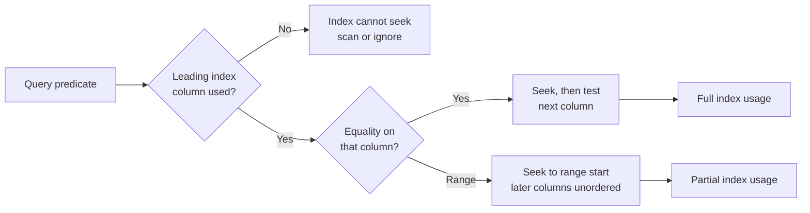
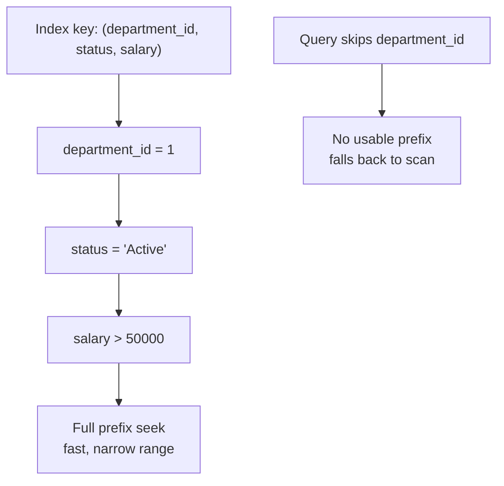

A single-column index is the easy case; composite (multi-column) indexes are where most real-world query tuning actually happens, and where interviewers probe whether you understand column order rather than just "add an index." This page works through the leftmost-prefix rule, column ordering, and a full before/after query rewrite.

## The leftmost-prefix rule



A composite index on `(a, b, c)` is one sorted structure keyed first by `a`, then `b` within each `a`, then `c` within each `b` — like a phone book sorted by last name, then first name, then city. The index can only be **seeked** using a contiguous prefix of its columns, starting from the left.

```sql
CREATE NONCLUSTERED INDEX IX_employees_dept_status_salary
ON employees(department_id, status, salary);
```

| Query predicate | Uses the index as a seek? | Why |
|---|---|---|
| `WHERE department_id = 1` | ✅ Yes | Leftmost column alone — valid prefix |
| `WHERE department_id = 1 AND status = 'Active'` | ✅ Yes | First two columns — valid prefix |
| `WHERE department_id = 1 AND status = 'Active' AND salary > 50000` | ✅ Yes, seek + residual range | Full prefix; `salary` range narrows within the seek |
| `WHERE status = 'Active'` | ❌ No (scan) | Skips `department_id`, the leftmost column |
| `WHERE department_id = 1 AND salary > 50000` | ⚠️ Partial | Seeks on `department_id`, then must scan/filter `salary` since `status` was skipped |
| `WHERE salary > 50000` | ❌ No | Doesn't touch the leftmost column at all |

> [!KEY]
> The index is only as useful as the **longest prefix your query's equality/range predicates actually match, left to right**. Skipping a leading column, or only filtering a later column, drops you back to a scan (or a much less efficient partial seek).



## Column order: equality, then range, then sort

When designing a composite index, order columns by **how they're used**, not alphabetically or by "importance":

1. **Equality predicates first** (`department_id = 1`) — these narrow the seek to a single contiguous range in the tree.
2. **Range predicate next** (`salary > 50000`, `hire_date BETWEEN ...`) — at most one range column can be usefully seeked; anything after a range column in the key can no longer be seeked, only scanned within that range.
3. **Columns needed for `ORDER BY`/`GROUP BY` last** — if they follow immediately in key order (after equality and range columns), the index already delivers rows sorted, avoiding a separate `Sort` operator.

```sql
-- Query: WHERE department_id = 1 AND status = 'Active' ORDER BY hire_date DESC
CREATE NONCLUSTERED INDEX IX_dept_status_hiredate
ON employees(department_id, status, hire_date DESC);
```

Because `department_id` and `status` are equality predicates and `hire_date DESC` matches the `ORDER BY`, this index lets the engine seek directly to the matching rows **already in the required order** — no separate sort step.

## Index support for ORDER BY and GROUP BY

An index whose key order matches `ORDER BY`/`GROUP BY` lets the engine avoid a sort entirely, which matters because sorting is `O(n log n)` and can spill to disk (tempdb) for large row counts.

| Scenario | Index needed |
|---|---|
| `ORDER BY department_id, salary` | `(department_id, salary)` — matches directly |
| `ORDER BY salary DESC` | `(salary DESC)` — direction must match, or the whole thing reversed |
| `GROUP BY department_id` | `(department_id, ...)` — lets the engine stream pre-sorted groups instead of hashing |
| `WHERE department_id = 1 ORDER BY salary` | `(department_id, salary)` — equality column first, sort column second |

> [!TIP]
> A senior answer names the mechanism: *"If the index already delivers rows in the order GROUP BY/ORDER BY needs, the optimizer can stream-aggregate or stream the sort for free instead of adding a Sort or Hash Match operator — that's often the biggest single win in a query plan."*

## Sargable predicates and avoiding SELECT *

A predicate is **sargable** (Search ARGument ABLE) when the engine can use an index seek to evaluate it directly, without transforming the column. Covered in depth in the indexing page — the practical design implication here is: write predicates so composite index columns appear bare and in the same order/type as the index, and avoid `SELECT *`.

`SELECT *` defeats even a well-designed composite index if any single unindexed column is requested, because it forces a key lookup for every row (or a scan) even when the `WHERE`/`ORDER BY` columns are perfectly covered. Selecting only the columns you need lets you make the index **covering** with a small `INCLUDE` list instead.

```sql
-- Forces a key lookup for every matched row, however good the index is
SELECT * FROM employees WHERE department_id = 1 AND status = 'Active';

-- Covered entirely by the index below — no key lookup
SELECT employee_name, salary FROM employees WHERE department_id = 1 AND status = 'Active';

CREATE NONCLUSTERED INDEX IX_dept_status_covering
ON employees(department_id, status) INCLUDE (employee_name, salary);
```

## Pagination and index support

Naive `OFFSET`/`FETCH` pagination gets progressively slower on later pages, because the engine must still walk past all skipped rows even though it discards them.

```sql
-- Page 500 at 20 rows/page: engine walks ~10,000 rows to discard 9,980 of them
SELECT employee_id, employee_name
FROM employees
ORDER BY employee_id
OFFSET 9980 ROWS FETCH NEXT 20 ROWS ONLY;

-- Keyset ("seek") pagination: O(page size), regardless of page number
SELECT TOP 20 employee_id, employee_name
FROM employees
WHERE employee_id > @last_seen_id
ORDER BY employee_id;
```

Keyset pagination requires an index on the ordering column (here the clustered PK already provides it) and only works cleanly for "next page" navigation, not arbitrary jump-to-page-N — a reasonable trade-off to name explicitly when proposing it.

## Index intersection and having too many indexes

The optimizer can sometimes combine two **separate** single-column indexes for one query (an "index intersection") rather than needing one perfect composite index, but this is generally less efficient than a purpose-built composite index and isn't always chosen. Meanwhile, every additional index is pure overhead on every write (see the indexing page) — a table with a dozen overlapping single-column indexes on the same base columns is usually a sign no one has consolidated them into a smaller number of well-designed composites.

| Symptom | Likely cause | Fix |
|---|---|---|
| Many single-column indexes on the same table | Indexes added reactively, one per slow query | Audit and consolidate into fewer composite/covering indexes |
| Duplicate or near-duplicate indexes `(a,b)` and `(a,b,c)` | The narrower one is now redundant | Drop the narrower one — the wider one serves the same seeks |
| High write latency, healthy read latency | Too many indexes maintained per write | Drop unused indexes (check usage DMVs) |

## Identifying missing indexes safely

SQL Server exposes `sys.dm_db_missing_index_details` and related DMVs, and the estimated execution plan surfaces a "Missing Index" suggestion — both are useful **hints**, not commands to blindly execute. They don't account for write cost, don't consolidate overlapping suggestions, and are based on the specific queries that have run since the last restart.

> [!WARNING]
> Never apply a missing-index suggestion verbatim in production without reviewing column order against actual query patterns and checking for an existing near-duplicate index it could extend instead. Blindly accepting every DMV suggestion is how tables end up with a dozen overlapping single-purpose indexes.

## Rewriting a slow query step by step

**Problem query**: find active employees in department 1 hired in 2023, sorted by salary descending, only needing name and salary.

```sql
SELECT * FROM employees
WHERE department_id = 1 AND status = 'Active' AND YEAR(hire_date) = 2023
ORDER BY salary DESC;
```

**Before plan (described)**: `YEAR(hire_date)` is non-sargable, so the engine can't seek on `hire_date` at all; with no useful composite index, it does a **clustered index scan** reading every row, filters in memory, then a separate **Sort** operator for `ORDER BY salary DESC`. `SELECT *` also means any index that *did* exist would still need key lookups.

**Step 1 — make the predicate sargable:**

```sql
WHERE department_id = 1 AND status = 'Active'
  AND hire_date >= '2023-01-01' AND hire_date < '2024-01-01'
```

**Step 2 — select only needed columns:**

```sql
SELECT employee_name, salary FROM employees WHERE ...
```

**Step 3 — build a composite index matching equality → range → sort:**

```sql
CREATE NONCLUSTERED INDEX IX_dept_status_hiredate_salary
ON employees(department_id, status, hire_date)
INCLUDE (employee_name, salary);
```

**After plan (described)**: an **Index Seek** on `IX_dept_status_hiredate_salary` using `department_id` and `status` as equality seeks and `hire_date` as a range seek, with `employee_name`/`salary` satisfied from `INCLUDE` — no key lookup. Because `salary` isn't part of the seek's sort order (`hire_date` is last in the key), a `Sort` operator for `ORDER BY salary DESC` likely remains, but it now sorts a small, already-filtered row set instead of the whole table — the dominant cost has moved from "scan everything" to "sort what matched", a large win in practice even though it isn't a fully sort-free plan.

## Design checklist

| Question | Why it matters |
|---|---|
| Does a query's WHERE start with the index's leftmost column? | Leftmost-prefix rule — otherwise no seek |
| Are equality columns before range columns in the key? | Only one range column can be usefully seeked; order after it can't |
| Does the trailing key order match ORDER BY/GROUP BY? | Avoids a separate Sort/Hash operator |
| Is SELECT * used where a covering index could apply? | Selecting only needed columns enables INCLUDE-based covering |
| Are there near-duplicate single-column indexes already? | Consolidate instead of adding another |
| Is the table write-heavy? | Weigh every new index against write amplification |
| Is pagination using OFFSET on a large, late page? | Consider keyset/seek pagination instead |

## Cheat sheet

- Composite index `(a, b, c)` seeks only on a **contiguous leftmost prefix** — skipping `a` loses the seek entirely.
- Column order: **equality predicates, then one range predicate, then ORDER BY/GROUP BY columns.**
- Only one range predicate in the key can be usefully seeked; everything after it degrades to scan-within-range.
- Matching the trailing key order to `ORDER BY` avoids a separate `Sort` operator — often the single biggest win.
- `SELECT *` defeats covering indexes; select only what you need and use `INCLUDE` for the rest.
- Keyset (seek) pagination is `O(page size)` regardless of page number; `OFFSET`/`FETCH` degrades on later pages.
- Index intersection exists but a purpose-built composite index usually beats relying on it.
- Missing-index DMV suggestions are hints, not commands — check for near-duplicates before adding.
- Every index is write overhead; consolidate overlapping single-column indexes into fewer composites.

## Common mistakes

| Mistake | Fix |
|---|---|
| Ordering composite index columns by "importance" instead of usage pattern | Order equality → range → sort |
| Putting a range column before other equality columns in the key | Move all equality columns first |
| Using `SELECT *` against a table with a well-designed covering index | Select only needed columns, or extend `INCLUDE` |
| Adding a new single-column index every time a query is slow | Check for an existing composite/near-duplicate index to extend instead |
| Applying every DMV "missing index" suggestion verbatim | Review column order and check for consolidation opportunities first |
| Using OFFSET pagination for deep pages on a large table | Switch to keyset pagination on an indexed, unique ordering column |

## Summary

Composite indexes only pay off when column order matches how a query actually filters, ranges, and sorts — leftmost-prefix determines whether a seek is even possible, and equality-before-range-before-sort determines how much of the query the seek can satisfy without extra scanning or sorting. Combine that with covering (`INCLUDE`) to eliminate key lookups, and keyset pagination to avoid `OFFSET` blowing up on deep pages, and most "just add an index" tickets become deliberate, explainable design decisions rather than guesswork.

## Top Interview Questions

### Q1. What is the leftmost-prefix rule for composite indexes?

A composite index `(a, b, c)` is a single structure sorted first by `a`, then by `b` within each `a`, then by `c` within each `b`. The engine can only perform an index seek using a **contiguous prefix starting from the leftmost column** — `a` alone, or `a, b` together, or `a, b, c` together all work as seeks, but filtering only on `b`, or only on `c`, or on `b` and `c` without `a`, cannot seek and falls back to a scan of the whole index. This is why column order in a composite index must match the actual filter patterns of the queries it's meant to serve.

### Q2. How should you decide the column order in a composite index?

Equality predicates go first, because they narrow the seek to an exact position in the tree and can be freely reordered/combined. After that, at most one range predicate (`>`, `<`, `BETWEEN`) can usefully be part of the seek — put it next. Any column after a range column in the key can no longer be used for seeking, only scanned within the range already established, so columns needed purely for `ORDER BY`/`GROUP BY` go last, ideally directly after the seek columns so the index already returns rows in the required order and avoids a separate sort.

### Q3. Given an index on (department_id, status, salary), which of these queries can seek, and which can't: (a) WHERE status = 'Active', (b) WHERE department_id = 1, (c) WHERE department_id = 1 AND salary > 50000?

(a) cannot seek — it skips the leftmost column `department_id`, so the engine must scan the whole index. (b) can seek — it uses the leftmost column alone, a valid prefix. (c) can partially seek — it uses `department_id` as an equality seek, but since `status` is skipped, `salary` cannot be used as part of the seek key; the engine seeks on `department_id` and then scans/filters all matching rows for `salary > 50000`, which is better than a full table scan but worse than seeking on all three columns together.

### Q4. Why does matching an index's key order to ORDER BY avoid a Sort operator, and why does that matter?

If an index's key order already produces rows in the sequence `ORDER BY` requires (accounting for ascending/descending direction), the engine can simply read leaf pages in that order and stream them out, with no separate step needed. Without such an index, the engine must materialise all qualifying rows and run an explicit `Sort` operator, which is `O(n log n)` in the row count and can spill to tempdb (disk) if the row set is large enough to exceed the memory grant — a `Sort` spill is one of the more expensive and diagnosable causes of a slow query, visible in the actual execution plan as a warning icon.

### Q5. Why is SELECT * a problem even when a good index exists on the filtered columns?

`SELECT *` requires every column of the row, so unless the index happens to be the clustered index (which stores the whole row) or has every remaining column added via `INCLUDE`, the engine must perform a key lookup back to the base table for each matched row to fetch the columns the index doesn't carry. That extra per-row lookup can dominate the query's cost once more than a small number of rows match, even though the initial seek on the filter columns was fast. Selecting only the columns actually needed lets a much smaller, cheaper `INCLUDE` list make the index fully covering.

### Q6. Why does OFFSET/FETCH pagination get slower on later pages, and what's the alternative?

`OFFSET n ROWS FETCH NEXT m ROWS` still requires the engine to walk through and discard the first `n` rows in sorted order before it can return the next `m` — so page 500 at 20 rows/page must process roughly 10,000 rows to return 20, even though an index provides the sort order. The alternative is keyset (seek) pagination: instead of counting from the start, filter on the last seen key from the previous page (`WHERE employee_id > @last_seen_id ORDER BY employee_id`) — with a supporting index, this seeks directly to the right spot regardless of how deep the page is, giving consistent `O(page size)` cost. The trade-off is that keyset pagination naturally supports "next/previous" navigation but not arbitrary jump-to-page-N without extra bookkeeping.

### Q7. What is index intersection, and why wouldn't you rely on it instead of building a composite index?

Index intersection is when the optimizer combines two or more separate single-column (or narrower composite) indexes to satisfy one query's multiple predicates, effectively joining their row-id/key results internally. It's a useful fallback the optimizer *can* do, but it typically costs more than a single purpose-built composite index seeking directly on all relevant columns at once, and the optimizer doesn't always choose it even when it's theoretically possible. In practice, if you notice the same set of columns being filtered together repeatedly, building one composite index for that exact pattern is more reliable and usually faster than hoping the optimizer intersects several narrower ones.

### Q8. A table has 8 single-column indexes and write latency is high — how would you investigate and fix this?

I'd first check `sys.dm_db_index_usage_stats` for each index's seeks/scans/lookups versus updates — indexes with near-zero reads but high update counts are pure overhead and safe to drop. Then I'd look at which columns are commonly filtered/sorted together in the workload's actual queries (via query store or plan cache) and design a smaller number of composite, possibly covering indexes that replace several of the single-column ones — e.g. two single-column indexes on `department_id` and `status` that are almost always queried together can usually be replaced by one composite `(department_id, status)` index. I'd validate the change by comparing write latency and confirming read query plans still seek rather than scan afterward.

### Q9. Why can only one range predicate in a composite index key be usefully seeked?

The B+ tree is sorted lexicographically by its key columns in order — think of it like sorting a list of tuples. Once you allow a range on one column (e.g. `salary > 50000`), the remaining rows that satisfy it are no longer contiguous with respect to any *later* key column, because rows are grouped by the earlier columns' exact values first and only sub-sorted by later columns within a fixed value of the range column — but the range column itself doesn't have a fixed value, so nothing after it in the key stays sorted in a way the engine can seek against. That's why the ordering rule places the (single) range predicate last among the "seekable" columns, with any further columns usable only for a residual scan/filter within the matched range, or for satisfying `ORDER BY` if they happen to align.

### Q10. How would you rewrite `WHERE YEAR(hire_date) = 2023` to make it sargable, and why does the rewrite matter for a composite index?

Rewrite it as a half-open date range: `WHERE hire_date >= '2023-01-01' AND hire_date < '2024-01-01'`. The original wraps the column in `YEAR()`, which the engine must evaluate per row since the function's output isn't what the index is sorted by, forcing a scan; the range form compares the raw column directly, which the B+ tree's sort order supports as a seek. For a composite index, this also matters because `hire_date` needs to be a genuinely seekable range predicate to sit correctly in the equality-then-range-then-sort column order — a non-sargable form on that column effectively removes it from the seek entirely, regardless of its position in the key.

### Q11. What's the difference between a "missing index" DMV suggestion and a well-designed index, and why can blindly applying suggestions hurt?

The missing-index DMVs (`sys.dm_db_missing_index_details`/`_group_stats`) report column combinations the optimizer noticed it could have used, based on queries executed since the last restart — but they don't consider write cost, don't merge overlapping suggestions across similar queries, and often suggest key/include splits that aren't optimal (e.g. putting everything in `INCLUDE` rather than choosing a better key order). Applying every suggestion verbatim commonly results in redundant, overlapping indexes — for instance one suggestion for `(a, b)` and another for `(a, c)` when a single `(a, b, c)` composite (with the right one made the key and the other made an include, per actual usage) would have served both while costing one write penalty instead of two. Treat them as leads to investigate, not a checklist to execute.

### Q12. How do you decide whether a workload is over-indexed?

Compare the read benefit against the write cost across all indexes on a table: if `user_seeks + user_scans + user_lookups` from `sys.dm_db_index_usage_stats` is low relative to `user_updates` for several indexes, and especially if multiple indexes share a heavily overlapping leading column set, the table is likely over-indexed. The practical fix is consolidation — replace several narrow, overlapping indexes with fewer, well-ordered composite (and where useful, covering) indexes that serve the same queries — followed by measuring write latency and read plan quality before and after to confirm the change actually helped rather than assuming it did.
