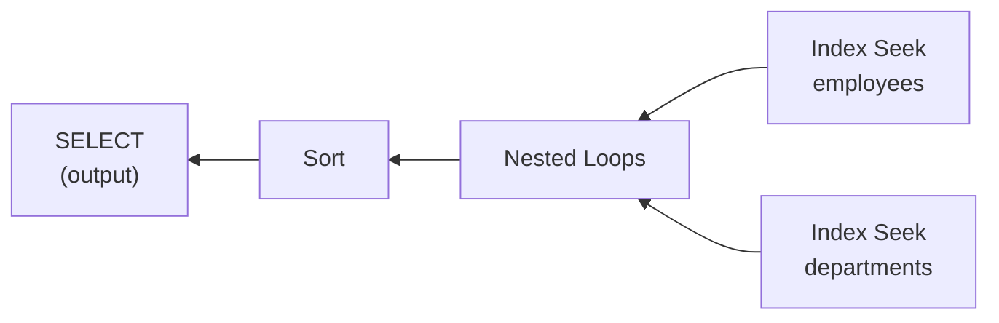
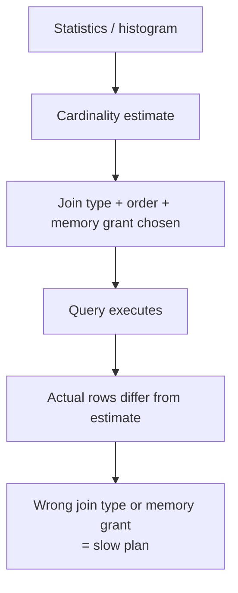
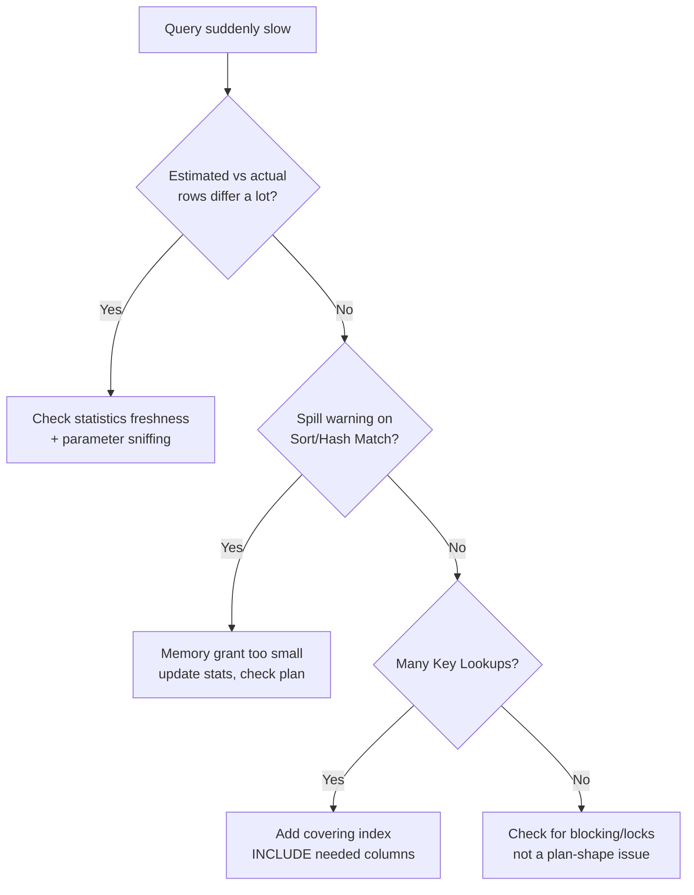

An execution plan is the optimizer's chosen strategy for running a query, and reading one is the skill that separates "I added an index and it got faster" from "I know exactly why it got faster." This page covers plan reading, the operators worth memorising, parameter sniffing, and a worked diagnosis. All examples use SQL Server terminology.

## Estimated vs actual plans

| | Estimated plan | Actual plan |
|---|---|---|
| When it runs | Compiled without executing the query | Query actually executes |
| Row counts shown | Estimates from statistics | Actual rows that flowed through each operator |
| Cost | Never touches real data | Real I/O, CPU, duration available |
| Best use | Quick check of the chosen strategy, cheap on a huge/slow query | Diagnosing why a specific run was slow, comparing estimate vs actual |

The single most useful diagnostic signal is the **gap between estimated and actual row counts** on the same operator — a large gap means the optimizer's statistics-based guess was wrong, and everything downstream (join type, memory grant, operator order) was chosen based on a bad assumption.

> [!KEY]
> Always look at the **actual** plan when diagnosing a real slow query. The estimated plan tells you what the optimizer *thought* would happen; the actual plan tells you what *did* happen, including where the estimate was wrong.

## Reading operator order

Execution plans are drawn right-to-left, top-to-bottom, but the **data flow** — and the order operators actually execute in — runs the opposite way: the rightmost, deepest leaf operators run first, feeding their output as input into the operator immediately to their left.

Read this as: seek `employees`, seek `departments`, join them row by row (Nested Loops), sort the combined result, return it. The percentage shown on each operator is that operator's **estimated cost relative to the whole plan** — a useful pointer to where to look first, but not a guarantee of where the real time went (see actual vs estimated above).

## Operators that matter

| Operator | What it means | What it implies |
|---|---|---|
| Clustered Index Seek | Direct navigation to specific rows via the clustered key | Ideal — cheapest way to find known rows |
| Clustered Index Scan | Reads the entire table in clustered key order | Fine for small tables; a red flag on large ones without a filter reason |
| Index Seek (non-clustered) | Direct navigation using a non-clustered index | Good, but check for a following Key Lookup |
| Index Scan (non-clustered) | Reads an entire non-clustered index | Often means the leading column of the index wasn't used in a seekable way |
| Key Lookup / RID Lookup | Extra fetch from clustered index/heap per matched row | Cheap for few rows; a dominant cost once row count is large — sign of a missing covering index |
| Nested Loops | For each outer row, probe the inner input | Great when the outer input is small and the inner is indexed |
| Merge Join | Two already-sorted inputs merged in one pass | Efficient, but requires both sides pre-sorted (often via an index) |
| Hash Match | Builds a hash table from one input, probes with the other | Common for large, unsorted inputs; needs memory, can spill to tempdb |
| Sort | Explicit sort, `O(n log n)` | Can spill to tempdb if the memory grant is too small — a common hidden cost |
| Spool (Table/Index) | Temporarily stashes rows for reuse within the plan | Often appears with correlated subqueries or certain recursive patterns; can hide repeated work |
| Parallelism (Gather/Distribute/Repartition Streams) | Query split across multiple CPU threads | Faster wall-clock time for large scans, but higher total CPU and coordination overhead |

> [!WARNING]
> A `Hash Match` or `Sort` with a yellow warning triangle in the graphical plan usually means it spilled to tempdb (disk) because the memory grant was too small — a strong sign that cardinality estimates were wrong, which is often caused by stale statistics or parameter sniffing.

## Cardinality estimation and why bad estimates cause bad plans

The optimizer chooses join order, join type (nested loops vs hash vs merge), and memory grant size based on **estimated row counts** at each step, derived from column/index statistics (histograms). If the estimate is wrong — say, expecting 10 rows but actually getting 500,000 — the optimizer may pick Nested Loops (great for 10 rows, terrible for 500,000) or under-allocate memory for a sort/hash, causing a disk spill.

## Parameter sniffing

SQL Server compiles and **caches** a plan the first time a parameterised query/stored procedure runs, using the parameter values from that first call to estimate cardinality. If a later call passes very different parameter values, the cached plan — optimised for the first, unrepresentative values — may be badly suited to the new ones.

**Symptom**: a stored procedure is fast for most callers but occasionally extremely slow (or vice versa), with no code change — often correlated with which parameter value happened to trigger the most recent recompilation.

| Fix | How it works | Trade-off |
|---|---|---|
| `OPTION (RECOMPILE)` | Forces a fresh plan (and fresh estimate) every execution | No caching benefit; extra compile cost per call |
| `OPTION (OPTIMIZE FOR (@param = value))` | Always compiles as if a specific representative value were passed | Good if one value is genuinely typical; wrong if not |
| `OPTION (OPTIMIZE FOR UNKNOWN)` | Uses average/general statistics instead of sniffed literal values | Balanced but not tailored to any specific case |
| Split into multiple procedures by parameter shape | Each variant gets its own cached plan | More code to maintain |
| Local variables instead of parameters | Forces the optimizer to guess generically (density-based) rather than sniff | Loses the benefit of accurate sniffing for the common case |

> [!DANGER]
> Parameter sniffing is not a bug — it's the *intended* behaviour of a parameterised, cached execution plan. It becomes a problem specifically when the distribution of parameter values is highly skewed (a `status` filter with wildly different row counts per value is the classic case), so identify that shape before reaching for `RECOMPILE` everywhere, which trades away all caching benefit.

## Statistics: what they are and when they go stale

Statistics are histograms the optimizer uses to estimate how many rows a predicate will match, built automatically by default (`AUTO_CREATE_STATISTICS`/`AUTO_UPDATE_STATISTICS`). They go stale after enough rows change relative to the table's size — a large bulk load or delete without a subsequent stats update is the classic cause of suddenly bad plans. `UPDATE STATISTICS table_name` (or `sp_updatestats`) refreshes them; SQL Server's auto-update threshold is roughly 20% of rows changed (with newer trace-flag/database-scoped-config behaviour making it more proportional for large tables).

## Plan cache and plan reuse

Compiling a plan has real CPU cost, so SQL Server caches compiled plans keyed by the query text (or parameterised template) and reuses them for identical subsequent calls, avoiding recompilation. Plans are evicted under memory pressure, invalidated by schema changes, or explicitly cleared (`DBCC FREEPROCCACHE` — use with care, it's instance/database-wide by default unless scoped to a plan handle). Ad-hoc, non-parameterised queries with inline literals (`WHERE id = 5` vs `WHERE id = @id`) pollute the cache with a near-duplicate plan per distinct literal value, wasting cache space and compile time — parameterising queries (or enabling forced parameterisation) avoids this.

## Spotting the real bottleneck

- Sort by **actual** operator cost, not the percentages on the estimated plan, when actual stats are available.
- Look for the largest **estimated-vs-actual row count gap** first — it's the most likely root cause of everything downstream.
- Check for **spills** (Sort/Hash Match warning icons) — these indicate under-estimated memory grants.
- Count **Key Lookups** feeding a Nested Loops — a strong, specific signal for a missing covering index.
- Check whether the plan is using an index you expect at all — its absence usually traces back to sargability, statistics, or a genuinely low-selectivity predicate.

## Worked example: diagnosing a slow query

**Symptom**: a report query "orders per customer with total amount" takes 8 seconds; it used to take under 200ms.

Walking the actual plan: the `Customers` seek estimated 50 rows but actual was 50,000 (a recent bulk import skewed the data); that bad estimate fed a Nested Loops join expecting a small outer input, which is catastrophic at 50,000 iterations. The fix here was `UPDATE STATISTICS Customers WITH FULLSCAN`, after which the optimizer correctly chose a Hash Match instead of Nested Loops, and duration dropped back to under 300ms. This is the general diagnostic shape: find the estimate/actual mismatch, find what fed it a bad number, fix the input (usually statistics), re-verify the plan actually changed.

> [!TIP]
> Say the diagnostic loop out loud in an interview: *"Check estimated vs actual first — if they diverge a lot, that's the root cause to chase; if they match and it's still slow, look at spills and key lookups instead."* That sentence alone tells the interviewer you have a repeatable process, not a list of memorised fixes.

## Cheat sheet

- Estimated plan = optimizer's guess before running; actual plan = what really happened — always prefer actual for real diagnosis.
- Operators execute right-to-left / bottom-up in the graphical plan; read data flow that direction.
- Seeks are good, scans deserve scrutiny, Key Lookups in bulk mean a missing covering index.
- Nested Loops favours a small outer input; Hash Match handles large unsorted inputs; Merge Join needs pre-sorted inputs.
- A yellow warning triangle on Sort/Hash Match usually means a tempdb spill from an under-sized memory grant.
- Parameter sniffing: first call's parameter values shape the cached plan for everyone — great until values are skewed.
- `OPTION (RECOMPILE)` trades caching for accuracy; `OPTIMIZE FOR` picks a representative value; local variables force generic estimates.
- Stale statistics after large data changes are a top cause of sudden plan regressions — `UPDATE STATISTICS` is often the fix.
- Diagnose in order: estimate-vs-actual gap → spills → key lookup count → then consider blocking/locking as a non-plan-shape cause.

## Common mistakes

| Mistake | Fix |
|---|---|
| Only ever looking at the estimated plan | Capture the actual plan for real diagnosis — it reveals estimate-vs-actual gaps |
| Assuming a scan is always bad or a seek always good | Judge relative to table size and selectivity, not the operator name alone |
| Jumping straight to `OPTION (RECOMPILE)` for any inconsistent-performance report | Confirm it's genuinely parameter sniffing (skewed value distribution) first |
| Ignoring spill warnings on Sort/Hash Match | They point directly at bad cardinality estimates / stale statistics |
| Clearing the whole plan cache (`DBCC FREEPROCCACHE`) to "fix" one query | Target a specific plan handle, or fix the root cause instead |
| Treating a high cost % on one operator as the definite bottleneck | Cross-check against actual row counts and duration, not just estimated cost % |

## Summary

Execution plans are read right-to-left/bottom-up, and the fastest path to a real diagnosis is comparing estimated to actual row counts, since almost every bad plan traces back to the optimizer being fed a wrong cardinality estimate — from stale statistics, parameter sniffing, or a non-sargable predicate. Learn the dozen operators that actually matter (seeks, scans, key lookups, the three join strategies, sort, spool, parallelism) and what each implies, and you can diagnose most production slow-query tickets from the plan alone without guessing at indexes to add.

## Top Interview Questions

### Q1. What is the difference between an estimated and an actual execution plan?

An estimated plan is generated by compiling the query without running it, showing the optimizer's predicted row counts and chosen strategy based purely on statistics. An actual plan requires the query to actually execute, and additionally shows the real row counts that flowed through each operator alongside the estimates, plus real timing/I/O data. The most valuable diagnostic technique is comparing the two on the same plan: a large gap between estimated and actual rows at some operator is usually the root cause of everything that went wrong downstream, because the optimizer's join order, join type, and memory grant were all chosen based on the (wrong) estimate.

### Q2. In what order do operators in a graphical execution plan actually execute?

Graphical plans are conventionally drawn with the final output on the left and the deepest data sources on the right, but execution flows the opposite way: the rightmost, deepest leaf operators (typically seeks/scans against base tables or indexes) execute first, and their output feeds leftward into join, sort, and filter operators, until the leftmost operator produces the final result set. So reading a plan is a right-to-left, then top-to-bottom-within-a-level exercise — the two seeks feeding a join both run before the join can produce output, and the join's output runs before a sort on top of it.

### Q3. What does a Key Lookup operator indicate, and when does it become a real performance problem?

A Key Lookup means the query used a non-clustered index to find matching rows but needed at least one additional column not stored in that index, forcing a second, separate lookup into the clustered index (or a RID Lookup into a heap) for every matched row. For a handful of matches this is cheap and not worth worrying about; but its cost is linear in the number of matches, so once the index seek returns thousands of rows, the cumulative cost of thousands of individual lookups can exceed the cost of simply scanning the table — at which point the optimizer often abandons the seek+lookup plan entirely in favor of a scan. The fix is a covering index: add the missing columns via `INCLUDE` so the lookup is eliminated.

### Q4. What's the difference between Nested Loops, Merge Join, and Hash Match, and how does the optimizer choose?

Nested Loops iterates the outer input and, for each row, probes the inner input (ideally via an index seek) — efficient when the outer input is small. Merge Join requires both inputs already sorted on the join key and merges them in a single synchronized pass — very efficient, but only applicable when that sort order is available (often from an index) or cheap to produce. Hash Match builds an in-memory hash table from one (usually the smaller) input and probes it with the other — the default choice for joining two large, unsorted inputs, at the cost of a memory grant that can spill to tempdb if under-estimated. The optimizer picks based on estimated input sizes and available sort order/indexes, which is exactly why a bad cardinality estimate can lead it to choose the wrong one.

### Q5. What is parameter sniffing, and what are the symptoms in production?

When a parameterised query or stored procedure is first compiled, SQL Server "sniffs" the actual parameter values passed on that call to estimate cardinality and build a plan, then caches that plan for reuse by subsequent calls with different parameter values. If the data distribution for that parameter is skewed — e.g. a `status` column where one value matches 5 rows and another matches 5 million — the cached plan, tuned for whichever value triggered compilation, can be badly wrong for the other. The classic symptom is a stored procedure that's usually fast but occasionally very slow (or the reverse) with no code or data schema change, often correlating with server restarts or plan cache evictions that force a recompile against a new, unrepresentative parameter value.

### Q6. How would you fix a parameter-sniffing problem, and what's the trade-off of each option?

`OPTION (RECOMPILE)` forces a fresh, accurately-estimated plan on every execution — correct but pays a compilation cost every single call, so it's best for infrequent/expensive queries rather than a hot path. `OPTION (OPTIMIZE FOR (@param = value))` pins the compiled plan to a chosen representative value — good if one value dominates typical calls, but still wrong for outliers. `OPTION (OPTIMIZE FOR UNKNOWN)` uses the column's average density rather than any specific sniffed value, giving a more "average case" plan that's never perfectly tuned to any one value but also never catastrophically wrong for an outlier. In genuinely bimodal workloads, splitting into separate stored procedures per parameter shape (each caching its own appropriate plan) is often the cleanest long-term fix.

### Q7. Why can stale statistics cause a query that used to be fast to suddenly become slow?

The optimizer relies on statistics (histograms of column value distribution) to estimate how many rows a predicate will match; those estimates drive join order, join type, and memory grant size. If the underlying data has changed significantly since statistics were last updated — a large bulk load, bulk delete, or a data skew shift — the cached statistics no longer reflect reality, and the optimizer's estimates (and therefore its chosen plan) can be badly wrong even though the query text and schema haven't changed at all. `UPDATE STATISTICS` (or ensuring auto-update statistics has fired, which by default triggers after roughly 20% of rows change) is often the single fix that restores a good plan without any query rewrite.

### Q8. What does a "spill to tempdb" warning on a Sort or Hash Match operator mean, and what causes it?

SQL Server pre-allocates a memory grant for Sort and Hash Match operators based on the estimated number and size of rows involved; if the actual data significantly exceeds that estimate, the operator runs out of allotted memory and must spill intermediate data to tempdb on disk, which is drastically slower than staying in memory. This is almost always downstream of a bad cardinality estimate — the same root cause as many parameter-sniffing and stale-statistics problems — so the fix is rarely "give it more memory" directly, and usually "fix the estimate" (update statistics, address parameter sniffing, or make the predicate sargable so the estimate is accurate in the first place).

### Q9. A report query runs fine in the query editor but times out when called from the application through a stored procedure with parameters — how would you investigate?

This pattern strongly suggests parameter sniffing: the query editor likely runs with literal values (or `OPTION (RECOMPILE)`-like fresh compilation), while the stored procedure's cached plan was compiled against whatever parameter values first triggered it in the application's usage pattern. I'd capture the actual execution plan for the slow application call specifically (not the editor's version), compare estimated vs actual row counts, and check `sys.dm_exec_query_stats`/query store for multiple different runtimes against the same plan handle — a wide variance there confirms sniffing. From there I'd choose between `OPTIMIZE FOR`, `RECOMPILE`, or splitting the procedure based on whether the workload's parameter distribution is skewed toward one dominant case or genuinely bimodal.

### Q10. What is plan cache pollution and how would a lot of ad-hoc, non-parameterised SQL cause it?

Every distinct query text SQL Server compiles gets its own cached plan entry; if application code builds SQL with literal values inlined directly (`WHERE customer_id = 12345`) instead of using parameters (`WHERE customer_id = @id`), each distinct literal produces a technically-different query string, and therefore a separate cached plan — even though the shape of the query is identical every time. Over time this fills the plan cache with thousands of near-duplicate single-use plans, wasting memory and increasing compilation overhead system-wide, since none of them get reused. The fix is parameterising queries at the application layer (or enabling `forced parameterization` at the database level as a stopgap) so semantically identical queries share one cached, reusable plan.

### Q11. How do you tell from a plan whether the optimizer used the index you expected, and what would you check if it didn't?

Look at the specific operator against that table — an `Index Seek` naming your index confirms it was used as a seek; an `Index Scan` on the same index, or a `Clustered Index Scan`/`Table Scan` instead, tells you it either wasn't used at all or was used inefficiently. If it wasn't used as expected, I'd check, in order: whether the predicate is sargable (no function/implicit conversion wrapping the column), whether the query's filter actually matches the index's leftmost prefix, whether statistics on the table are current, and whether the predicate's selectivity is simply too low for the optimizer to prefer a seek over a scan — each of these has a different, specific fix rather than "just add another index."

### Q12. What's the difference between a query being slow because of a bad plan versus being slow because of blocking/locking, and how would you distinguish them?

A bad-plan slowdown shows up as high CPU/logical reads within the query's own execution — the actual plan itself will show expensive scans, spills, or excessive key lookups, and the query runs the whole time it's "slow." A blocking/locking slowdown instead shows the query spending most of its wall-clock time **waiting**, not executing — the plan itself may look perfectly efficient, but the session is blocked behind another transaction holding a conflicting lock. The distinguishing check is looking at wait statistics/wait types for the session (e.g. `sys.dm_exec_requests.wait_type` showing `LCK_M_*` wait types) rather than only the plan — a fast, efficient plan with a huge `LCK_M_X` wait time points squarely at blocking, not query design, and the fix is entirely different (shorten the blocking transaction, change isolation level, add appropriate indexes to reduce lock scope) rather than anything about the plan shape itself.
