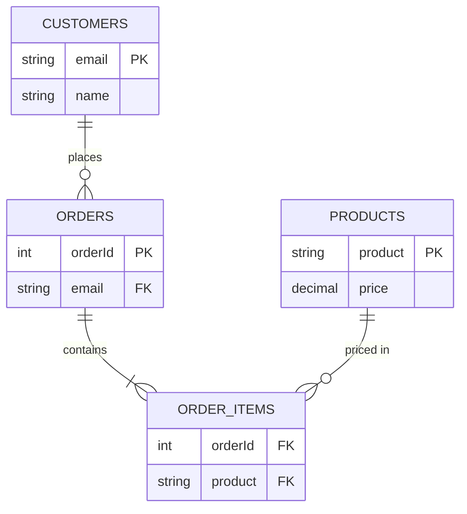

Normalization is a set of rules for organising columns and tables to minimise data duplication and the anomalies it causes. Interviewers use it to see whether you can reason about functional dependencies, not just recite "1NF, 2NF, 3NF" — and whether you know when breaking those rules on purpose is the right call.

## The relational model in three terms

A relational database maps directly onto three simple terms, each with an everyday synonym worth knowing for interviews that phrase the question either way:

- **Relation** = table — a named collection of rows sharing the same structure.
- **Tuple** = row = record — one complete set of related values about a single entity.
- **Attribute** = column = field — one named property every tuple in the relation has a value for.


## Keys: from super keys to surrogate keys

Before functional dependencies and normal forms make sense, it helps to be precise about what a "key" actually is — the term covers several related but distinct ideas.

| Key | Meaning |
|---|---|
| Super key | Any set of columns that uniquely identifies a row — can include redundant extra columns. |
| Candidate key | A *minimal* super key — remove any column and it stops being unique. |
| Primary key | The candidate key a designer chooses as the table's main identifier. |
| Alternate key | Any candidate key that exists but wasn't chosen as primary. |
| Composite key | A key made of more than one column together. |
| Surrogate key | An artificial identifier (an `IDENTITY`/auto-increment value, or a UUID) with no business meaning, used purely to identify a row. |

A table can have several candidate keys (e.g. both `EmployeeId` and `Email` uniquely identify an employee) but only one is chosen as primary; the rest remain alternate keys, usually still enforced with a `UNIQUE` constraint so the guarantee isn't lost.

| | Primary key | Foreign key | Candidate key |
|---|---|---|---|
| Role | Uniquely identifies each row in its own table | References a primary/unique key in another table | A key that *could* have been chosen as primary |
| Duplicates | Never allowed | Allowed — many child rows can reference one parent | Never allowed |
| `NULL` | Never allowed | Allowed, unless the column is also `NOT NULL` | Never allowed |
| Count per table | Exactly one | Zero or more | Zero or more |

### Primary key vs UNIQUE constraint

Both enforce uniqueness, but they aren't interchangeable:

| Aspect | `PRIMARY KEY` | `UNIQUE` |
|---|---|---|
| Purpose | The table's main row identifier | Prevents duplicate values in a column that isn't the main identifier |
| Per table | Exactly one (possibly composite) | Multiple `UNIQUE` constraints allowed |
| `NULL` | Never allowed | Allowed — most engines permit one or more `NULL`s depending on dialect |
| Typical foreign-key target | Yes, the common case | Yes, but less common |

### Foreign keys and cascading actions

A foreign key's `ON UPDATE`/`ON DELETE` clause decides what happens to child rows when the referenced parent row changes or disappears:

```sql
CONSTRAINT fk_employee_department
    FOREIGN KEY (department_id) REFERENCES departments(department_id)
    ON UPDATE CASCADE
    ON DELETE SET NULL
```

| Action | Effect |
|---|---|
| `CASCADE` | Automatically updates or deletes the matching child rows too. |
| `SET NULL` | Sets the child's foreign key column to `NULL` — the column must allow nulls. |
| `SET DEFAULT` | Sets the child's foreign key column to its default value, where supported. |
| `RESTRICT` / `NO ACTION` | Rejects the parent update/delete outright while matching child rows still exist. |

> [!WARNING]
> `ON DELETE CASCADE` deletes child rows with no further confirmation — appropriate when those rows have no independent value (e.g. order line items belonging only to their order), dangerous when they do (e.g. deleting a department should almost never silently delete its employees). Default to `RESTRICT`/`NO ACTION` unless cascading is a deliberate design decision, not a convenience.

## Functional dependencies, in plain English


A **functional dependency** `A → B` means "if you know the value of A, you know the value of B" — B is fully determined by A. `EmployeeId → EmployeeName` is a functional dependency; `EmployeeName → EmployeeId` usually isn't (names repeat). Every normal form beyond 1NF is really just a rule about which functional dependencies are allowed to exist in a table.

> [!KEY]
> Normalization is the mechanical process of making sure every non-key column depends on **the key, the whole key, and nothing but the key**. Each normal form closes one loophole in that sentence.

## A running example, normalised step by step

Start with a single denormalised orders table:

| OrderId | CustomerName | CustomerEmail | Products | ProductPrice |
|---|---|---|---|---|
| 1 | Alice | alice@x.com | "Mouse, Keyboard" | "20, 45" |

**1NF — atomic values, no repeating groups.** Split the comma-packed `Products`/`ProductPrice` into one row per product:

| OrderId | CustomerName | CustomerEmail | Product | ProductPrice |
|---|---|---|---|---|
| 1 | Alice | alice@x.com | Mouse | 20 |
| 1 | Alice | alice@x.com | Keyboard | 45 |

**2NF — no partial dependency on part of a composite key.** The key is now (OrderId, Product), but `CustomerName`/`CustomerEmail` depend only on `OrderId`, not on `Product`. Split them out:

`Orders(OrderId, CustomerName, CustomerEmail)` and `OrderItems(OrderId, Product, ProductPrice)`.

**3NF — no transitive dependency through a non-key column.** `CustomerEmail` determines `CustomerName` (or vice versa) — a non-key column determining another non-key column. Split further: `Customers(CustomerEmail, CustomerName)`, `Orders(OrderId, CustomerEmail)`.

**BCNF — every determinant is a candidate key.** If `ProductPrice` actually depends only on `Product` (price is per-product, not per-order-line), then `Product → ProductPrice` is a dependency where `Product` isn't the key of `OrderItems` — move it to a `Products(Product, ProductPrice)` table.



## The anomalies normalisation prevents

| Anomaly | What goes wrong in the unnormalised table | Fixed by |
|---|---|---|
| Insert anomaly | Can't add a new product without an order to attach it to | Separate `Products` table |
| Update anomaly | Customer changes email → must update every order row for them | Email lives once, in `Customers` |
| Delete anomaly | Deleting the only order for a customer deletes their contact info entirely | Customer row is independent of orders |

> [!TIP]
> "Would you normalise this?" is really asking whether you can spot a functional dependency that's currently duplicated. Name the dependency out loud (`CustomerEmail → CustomerName`) — that's the signal interviewers are listening for.

## When to denormalise on purpose

In practice, the call is driven by the same three inputs any schema design decision comes down to: data volume (does it fit on one machine, or does distribution make joins expensive), access pattern (read-heavy or write-heavy), and consistency requirements (can this specific field tolerate being briefly stale). Normalisation optimises for **write integrity**; denormalisation trades some of that for **read speed**. It's the right call when:

- **Read-heavy workloads** — a product page read 10,000 times per write doesn't need a join every time; store the denormalised fields (e.g., `ProductName` copied onto an `OrderItem`) at write time.
- **Reporting/analytics** — star schemas deliberately duplicate dimension attributes into fact rows to avoid multi-way joins over billions of rows.
- **Distributed/NoSQL systems** — joins across partitions or services are expensive or impossible, so data is duplicated per access pattern (see the NoSQL modeling pages).
- **Avoiding joins at scale** — once a join spans a sharded table or a cross-service boundary, a duplicated column is often cheaper than a distributed join.

None of this means "skip normalisation" — you normalise first to understand the true dependencies, then denormalise deliberately and selectively, usually on a small number of specific fields rather than the whole schema. The difference between a deliberate denormalisation and an accidental one is whether you can name, out loud, which query it serves and how the duplicate stays in sync.

> [!KEY]
> A handy rule of thumb that captures most of the above in one sentence: data at rest in the database is usually normalised, while data at rest in a cache is usually denormalised. The database is optimised for write integrity; the cache exists purely to optimise read speed for one specific access pattern, which is exactly why it's allowed to hold a denormalised, duplicated copy.

Applying the three factors to a couple of concrete cases makes the checklist less abstract:

| Case | Data volume | Access pattern | Consistency need | Call |
|---|---|---|---|---|
| Product catalog page | Large, but fits comfortably on one database with replicas | Read thousands of times per write | Tolerates a few seconds of staleness | Denormalise the product name and price onto the display path; refresh on write |
| Payment ledger balance | Modest volume, but every row matters | Written and read roughly equally, each transaction is high-stakes | Must reflect the latest write immediately | Keep normalised; compute the balance from the transaction log rather than caching a stale copy |

## Keeping denormalised data consistent

Duplication only works if you have a plan for keeping copies in sync:

| Strategy | How | Trade-off |
|---|---|---|
| Update in the same transaction | Write the source and the copy together | Simple, but couples the writers |
| Trigger/CDC | Database trigger or change-data-capture pushes updates to copies | Decoupled, but eventual consistency window |
| Scheduled reconciliation job | Batch job recomputes denormalised fields periodically | Cheap, but staleness can last minutes/hours |
| Accept staleness | Document that the field is "as of last order" | Fine for names/labels, wrong for prices/balances |

> [!WARNING]
> Never denormalise a value that changes meaning retroactively (like a current balance) without a clear consistency plan — copied prices that silently drift from the source of truth are a classic production bug.

## Star vs snowflake schema

| | Star schema | Snowflake schema |
|---|---|---|
| Dimension tables | Denormalised (flat, wide) | Normalised into sub-dimensions |
| Joins per query | Fewer, simpler | More, deeper |
| Storage | More redundant | Less redundant |
| Query performance | Usually faster for BI tools | Slower, but easier to maintain |
| Typical use | Data warehouses, dashboards | Very large dimensions with shared hierarchies |

## OLTP vs OLAP

| | OLTP | OLAP |
|---|---|---|
| Workload | Many small reads/writes | Few large scans/aggregations |
| Schema | Normalised (3NF) | Denormalised (star/snowflake) |
| Optimises for | Transaction integrity, low latency | Query throughput over huge volumes |
| Example | Order-processing database | Data warehouse, BI reporting |

## Cheat sheet

- Relation = table, tuple = row, attribute = column — the vocabulary a functional dependency is stated in.
- Super key: any uniquely-identifying column set. Candidate key: a minimal super key. Primary key: the chosen candidate key. Alternate key: a candidate key not chosen. Surrogate key: an artificial identifier with no business meaning.
- A primary key never allows `NULL` and there's exactly one per table; a `UNIQUE` constraint allows several per table and, in most engines, one or more `NULL`s.
- `ON DELETE`/`ON UPDATE` `CASCADE`, `SET NULL`, `SET DEFAULT`, and `RESTRICT`/`NO ACTION` decide what happens to child rows — default to `RESTRICT` unless cascading is a deliberate choice.
- 1NF: atomic values, no repeating groups. 2NF: no partial dependency on part of a composite key. 3NF: no transitive dependency between non-key columns. BCNF: every determinant is a candidate key.
- Every normal form is a rule about which functional dependencies are allowed.
- Normalisation prevents insert, update and delete anomalies by storing each fact once.
- Denormalise deliberately for read-heavy paths, reporting, and distributed systems where joins are expensive or impossible.
- Star schema = fast, redundant dimensions; snowflake = normalised, slower joins, less redundancy.
- OLTP schemas lean normalised; OLAP schemas lean denormalised.
- Always pair denormalisation with an explicit consistency strategy — same transaction, CDC, or accepted staleness.
- "Would you normalise this?" in an interview means "can you name the functional dependency that's duplicated?"

## Common mistakes

| Mistake | Fix |
|---|---|
| Normalising everything "because it's correct" without considering read patterns | Ask what the dominant access pattern is before designing |
| Denormalising without a plan to keep copies in sync | Pick same-transaction, CDC, or a documented staleness window |
| Confusing 2NF and 3NF in an interview | 2NF is about *composite keys*; 3NF is about *non-key-to-non-key* dependencies |
| Treating BCNF as always necessary | Most production schemas stop at 3NF; BCNF matters mainly for rare non-key candidate-key overlaps |
| Copying mutable values (like a live price or balance) into other tables blindly | Only denormalise values that are safe to be slightly stale, or update transactionally |
| Reaching for `ON DELETE CASCADE` as a default | Default to `RESTRICT`/`NO ACTION`; cascade only where child rows genuinely have no independent value |
| Treating `PRIMARY KEY` and `UNIQUE` as interchangeable | A table has exactly one primary key; `UNIQUE` constraints are additional and usually still allow `NULL` |

## Summary

Normalisation is about making sure every column depends on the key, the whole key, and nothing but the key — doing that removes insert, update and delete anomalies by storing each fact exactly once. Getting there starts with being precise about keys themselves: a super key, its minimal candidate keys, the one chosen as primary, and how foreign keys and their cascading actions enforce referential integrity between tables. Denormalisation is the deliberate, informed reversal of the normalisation goal for speed: fewer joins on hot read paths, star schemas for analytics, and duplicated data across service or partition boundaries. The interview signal is knowing both directions and being able to name the specific functional dependency, key, or access pattern that justifies your choice.

## Top Interview Questions

### Q1. What is a functional dependency, and how does it relate to normal forms?

A functional dependency `A → B` means the value of A uniquely determines the value of B — given the same A, B is always the same. Every normal form is a constraint on which functional dependencies a table is allowed to contain: 2NF forbids a non-key column depending on only *part* of a composite key; 3NF forbids a non-key column depending on *another non-key column*; BCNF requires every determinant (the left side of any dependency) to be a candidate key. Understanding functional dependencies is what lets you normalise a new schema instead of memorising the rules by rote.

### Q2. Walk through the difference between 2NF and 3NF with an example.

2NF is only relevant when a table has a composite primary key: it says every non-key column must depend on the *entire* key, not just part of it. In an `OrderItems(OrderId, Product, CustomerName)` table with key (OrderId, Product), `CustomerName` depends only on `OrderId` — a partial dependency, violating 2NF. 3NF applies even to single-column keys: it forbids a non-key column depending on another non-key column. If `Orders(OrderId, CustomerEmail, CustomerName)` has `CustomerEmail → CustomerName`, that's a transitive dependency through a non-key column, violating 3NF even though 2NF is satisfied. The fix for both is the same mechanism — extract the dependent columns into their own table.

### Q3. What anomalies does normalisation prevent, and why do they matter to a business?

Insert anomalies (you can't record a fact, like a new product, without an unrelated fact, like an order, existing yet), update anomalies (a single logical fact like a customer's email is duplicated across many rows, so updating it requires touching all of them and risks partial updates), and delete anomalies (removing one fact, like the last order, accidentally deletes another, like the customer's contact details). These aren't academic — update anomalies in particular cause silent data drift in production, where two rows that should agree slowly diverge because an update touched one copy and missed another.

### Q4. When would you deliberately denormalise a schema, and how do you keep it consistent?

I'd denormalise when a field is read far more often than it changes and a join to fetch it is a measurable cost — e.g., copying a product name onto an order-line row so displaying order history never joins to the products table. It's also standard in analytics: star schemas duplicate dimension attributes into fact tables so BI queries avoid deep joins over billions of rows. Consistency is the price: I'd update the copy in the same transaction as the source when both are in the same database, use change-data-capture or a trigger when they're not, or explicitly document the staleness window if eventual consistency is acceptable (fine for a display name, not for a price or balance).

### Q5. What's the difference between a star schema and a snowflake schema?

A star schema has a central fact table surrounded by fully denormalised dimension tables — e.g., a `Dim_Product` table with flat, repeated category/brand text. A snowflake schema normalises those dimensions further into sub-tables (`Dim_Product → Dim_Category → Dim_Department`). Star schemas trade storage for query speed and simplicity — BI tools generate simpler SQL with fewer joins. Snowflake schemas reduce redundancy and ease maintenance of shared hierarchies but cost extra joins per query. Most modern data warehouses default to star schemas because storage is cheap and query latency is the thing users notice.

### Q6. How do OLTP and OLAP schema designs differ, and why?

OLTP (online transaction processing) schemas are normalised, typically to 3NF, because the workload is many small, concurrent reads and writes where write integrity and low per-transaction latency matter most — a normalised schema avoids anomalies and keeps individual writes cheap. OLAP (online analytical processing) schemas are deliberately denormalised into star or snowflake shapes because the workload is the opposite: few queries, but each scans or aggregates huge volumes, so minimising joins matters more than avoiding redundancy. This is also why OLTP and OLAP data usually live in physically different systems, connected by an ETL/ELT pipeline that denormalises on the way out.

### Q7. A junior engineer wants to store a customer's full address as a single text column instead of separate street/city/postcode columns. What's your response?

That violates 1NF if the application ever needs to query, filter, or validate parts of the address independently — 1NF requires atomic values, and a packed address string isn't atomic from the database's point of view even though it's a single "thing" conceptually. I'd ask what the access patterns are: if the address is only ever displayed as a whole and never filtered by city or validated by postcode, a single column is a reasonable, pragmatic choice and not truly a normalisation violation — atomicity is about *the smallest unit your queries need*, not about splitting everything to its logical limit. If there's any need to search or aggregate by city/region, split it.

### Q8. You inherited a reporting query that joins six normalised tables and takes 30 seconds. What would you consider before denormalising?

First, I'd check indexing — missing indexes on the join columns are a far more common cause of a slow six-table join than the normalisation itself, and fixing that is non-invasive. If the schema is genuinely well-indexed and the query is still slow because of the *volume* scanned, I'd look at whether this is really an OLTP table being asked to do OLAP work, and consider a materialized view, a denormalised reporting table refreshed on a schedule, or moving analytics to a proper warehouse rather than denormalising the live transactional schema itself. I'd avoid denormalising the source-of-truth tables just to speed up one report — that couples write-side integrity to a read-side performance problem.

### Q9. How would you decide whether a schema needs to go all the way to BCNF?

In practice, most production schemas stop at 3NF because BCNF only matters in the specific case of overlapping composite candidate keys — a non-key determinant that isn't itself a candidate key, but where the table has more than one candidate key already. This is rare enough that I'd only push for BCNF if I found an actual anomaly caused by exactly this shape, rather than normalising further "for correctness" with no anomaly to show for it. I'd say this directly in an interview: normalisation is a means to remove anomalies, not a target to maximise for its own sake.

### Q10. What's an example of an update anomaly you might see in a real codebase, and how would you spot it during a code review?

A common one: an `Orders` table storing `ShippingAddress` as denormalised text copied at order time (correct — it should be a point-in-time snapshot), but a `Customers` table *also* duplicating `PreferredWarehouse` across every row that references a customer, updated inconsistently by different code paths. I'd spot it in review by looking for the same logical fact (a customer attribute, not an order-time snapshot) written to in more than one place, and by asking "if this customer's warehouse changes, how many rows need to change, and does every write path know that?" If the answer isn't "one row, always," it's a normalisation gap, not a deliberate, documented denormalisation.

### Q11. Is duplicating a foreign key's descriptive column (like storing both CustomerId and CustomerName on an order) always wrong?

Not always — it depends on whether the copy is a point-in-time snapshot or expected to track the source live. Storing the customer's name *as it was at order time* on an invoice is correct and arguably required — invoices shouldn't retroactively change if the customer renames their account. Storing it as a "live mirror" that's supposed to always match `Customers.Name` but isn't updated transactionally is the anomaly — it will drift. The determining question is: "if the source value changes, should every existing reference to it change too?" If yes, don't duplicate it; if no (it's historical), duplicating it is actually the *correct* design, not a violation.

### Q12. How do access patterns change your answer to "should this be normalised" in a NoSQL context versus a relational one?

In a relational database, normalisation is close to a default because joins are cheap and the engine optimises them; you denormalise only when you have evidence a join is a bottleneck. In most NoSQL stores, joins across partitions are expensive or unsupported entirely, so the default flips: you model data around the read access patterns first and duplicate whatever is needed to answer each pattern in a single request, accepting the write-side duplication cost up front rather than as an optimisation later. The interview answer is to name that inversion explicitly — "in Dynamo-style stores I'd design for the query, which usually means denormalising by default" — rather than mechanically applying 3NF thinking everywhere.

### Q13. What's the difference between a candidate key, a super key, and a surrogate key?

A super key is any set of columns — possibly with redundant extras — that uniquely identifies a row; a candidate key is a *minimal* super key, meaning every column in it is actually needed for uniqueness. A table can have multiple candidate keys (e.g. `EmployeeId` and `Email` might both be unique), and the designer picks one to be the primary key, leaving the others as alternate keys. A surrogate key is a different axis entirely — it's an artificial identifier (an auto-increment `IDENTITY` or a UUID) chosen specifically because it carries no business meaning, as opposed to a "natural" key like an email or a national ID number that comes from the real-world data itself and can occasionally need to change.

### Q14. Why would you choose `RESTRICT` over `CASCADE` for a foreign key's `ON DELETE` action, given that `CASCADE` seems more convenient?

`ON DELETE CASCADE` silently deletes every child row the moment a parent row is deleted, with no further confirmation — convenient when child rows have no meaning without the parent (an order's line items, say), but dangerous when they represent independent facts (an employee record shouldn't vanish because someone deleted their department). `RESTRICT`/`NO ACTION` instead rejects the delete outright while matching child rows exist, forcing an explicit decision — reassign the employees first, or delete them deliberately — rather than letting a single delete statement cascade into an unintended, hard-to-reverse mass deletion. I'd default new foreign keys to `RESTRICT` and only add `CASCADE` where the parent-child relationship is genuinely one of ownership, not just reference.
