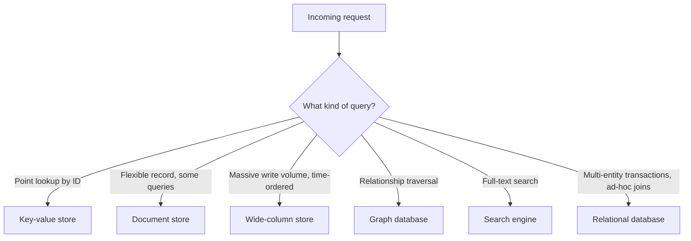

"NoSQL" is not one technology — it's a label for databases that gave up something a relational engine guarantees (usually joins, fixed schema, or strict transactional consistency) in exchange for horizontal scale, flexible schema, or a data model that matches one specific access pattern better. Interviewers use this topic to see if you can match a workload to a family instead of reaching for whatever is trendy.

## Why NoSQL exists

Relational databases hit real limits at scale: a single writer node caps write throughput, joins across a sharded table are expensive or impossible, and a rigid schema slows down teams iterating quickly on evolving data. NoSQL databases trade some of SQL's guarantees for one or more of:

- **Horizontal scale** — data and load spread across many commodity nodes instead of scaling one machine up.
- **Flexible schema** — records don't need a predefined, uniform shape; fields can vary or evolve without a migration.
- **Access-pattern-first modeling** — the data is shaped around how it's queried, not around normalised entities.

> [!KEY]
> Every NoSQL choice is a trade: you give up something (joins, ad-hoc queries, strong consistency) to get something else (scale, throughput, schema agility). Name the trade explicitly rather than saying "NoSQL is faster."

## The families, compared

| Family | Data model | Query capability | Scaling model | Consistency | Best fit | Examples |
|---|---|---|---|---|---|---|
| Key-value | Opaque value per key | Get/put/delete by key only | Near-linear horizontal (hash partitioning) | Tunable, often eventual | Sessions, caching, feature flags | Redis, DynamoDB, Memcached |
| Document | Nested JSON/BSON documents | Rich queries on fields, secondary indexes | Horizontal via sharding | Tunable per-operation | Catalogs, content, semi-structured records | MongoDB, Couchbase, DynamoDB |
| Wide-column | Rows with dynamic, sparse columns grouped in column families | Query by partition key + clustering key range | Massive horizontal, LSM-tree writes | Tunable (quorum reads/writes) | Time-series-like writes, huge write volume | Cassandra, HBase, Bigtable |
| Graph | Nodes and typed, directed edges with properties | Traversals, pattern matching (Cypher/Gremlin) | Harder to shard — traversals cross partitions | Usually strong within a node | Social graphs, fraud detection, recommendations | Neo4j, Amazon Neptune |
| Time-series | Timestamped points per metric/tag series | Range scans, downsampling, aggregation windows | Horizontal by time + series key | Eventual, high write throughput | Metrics, IoT sensor data, monitoring | InfluxDB, TimescaleDB, Prometheus |
| Search | Inverted index over documents | Full-text, fuzzy, relevance-ranked queries | Horizontal via shards/replicas | Near-real-time, eventual | Full-text search, log analytics | Elasticsearch, OpenSearch |

A wide-column store groups related columns into families so a row can have thousands of sparse columns without wasting space on the ones a given row doesn't use:

## BASE vs ACID

| | ACID (typical RDBMS) | BASE (typical NoSQL) |
|---|---|---|
| Atomicity/Consistency | Strong, transaction-scoped | Best-effort, often single-item only |
| Isolation | Serializable to read-committed | Usually none across items |
| Availability under partition | May refuse writes (CP) | Usually stays available (AP) |
| Consistency model | Immediate | **B**asically **A**vailable, **S**oft state, **E**ventually consistent |
| Trade-off | Correctness first | Availability and partition tolerance first |

This maps directly onto the **CAP theorem**: during a network partition you must choose consistency or availability, and most NoSQL stores default to availability (AP), while most relational deployments default to consistency (CP) — though many modern stores (DynamoDB, Cassandra, Cosmos DB) let you tune this per-operation.

> [!TIP]
> Say "tunable consistency" rather than "eventually consistent" when it applies — DynamoDB and Cassandra both offer strongly-consistent reads at a latency/availability cost, and knowing that shows you've used these systems, not just read about them.

## Schema-on-read vs schema-on-write

Relational databases are **schema-on-write**: the schema is enforced at insert time, so every row is guaranteed to match it. Most document and wide-column stores are **schema-on-read**: any shape can be written, and the *application* interprets and validates the shape when reading. This gives huge agility during early development — add a field without a migration — but pushes validation responsibility onto every consumer of the data, and makes "what shape is this collection today" a much harder question to answer without scanning it.

> [!WARNING]
> Schema-on-read doesn't mean "no schema" — it means the schema lives in application code instead of the database. Skipping validation there is how you get a collection with five silently incompatible document shapes after a year of feature changes.

## When NoSQL is the wrong answer

- You need **ad-hoc queries** across many attributes that weren't planned for up front — relational engines and their query planners handle this far better than access-pattern-first NoSQL models.
- You need **multi-record transactions** with strong consistency across different entities (e.g., moving money between two accounts) — some NoSQL stores support this now, but it's a bolt-on, not the default design point.
- Your data is genuinely **relational and normalised** with many evolving join patterns — forcing it into a single-table NoSQL design adds modeling cost without a corresponding scale need you actually have.
- Your team's query patterns are still **unknown or changing rapidly** — NoSQL access-pattern-first modeling requires knowing the patterns up front; if you don't, you'll be re-modeling constantly.

## Polyglot persistence and migration

Most real systems at scale use **polyglot persistence** — the right store per workload, not one database for everything: Postgres for the transactional core, Redis for caching/sessions, Elasticsearch for full-text search, a wide-column store for time-series metrics. The cost is operational: more systems to run, secure, and keep consistent, and a change-data-capture or event pipeline to keep them in sync.

Migrating *into* NoSQL from a relational system is not a lift-and-shift: it requires enumerating access patterns first, then designing keys and duplication around them (see the access-pattern-driven modeling page) — migrating the other way means re-normalising data that was deliberately duplicated, which is usually the harder direction.

## Cheat sheet

- NoSQL is a family of trade-offs, not a single technology — always name what you're trading (joins, schema rigidity, strong consistency) for what you're gaining (scale, flexibility, throughput).
- Key-value: fastest, simplest, get/put only. Document: flexible records with rich per-field queries. Wide-column: extreme write throughput, sparse columns. Graph: relationship traversals. Time-series: timestamped metrics at scale. Search: full-text and relevance ranking.
- BASE trades ACID's strong consistency for availability under partition — map it to CAP explicitly.
- Schema-on-read pushes validation into application code; it doesn't remove the need for a schema.
- NoSQL is the wrong choice for ad-hoc queries, multi-entity ACID transactions, and unstable/unknown access patterns.
- Polyglot persistence — multiple purpose-built stores — is normal at scale; the cost is operational complexity and sync pipelines.
- Migrating relational-to-NoSQL requires modeling from access patterns first; the reverse requires re-normalising duplicated data.

## Common mistakes

| Mistake | Fix |
|---|---|
| Choosing NoSQL because "it scales better" without a scale problem | Justify with an actual throughput/latency/schema-agility need |
| Modeling a document store like a normalised relational schema | Duplicate data to match access patterns instead of joining at query time |
| Assuming "eventually consistent" means "wrong most of the time" | It usually converges quickly under healthy conditions, but the system does not promise immediate visibility; design around the documented consistency model |
| Using a graph database for a workload that's mostly point lookups | Graph databases only pay off when traversal depth/complexity is the bottleneck |
| Forgetting that schema-on-read still needs validation | Enforce shape in application code or with a schema library at the write boundary |
| Running one NoSQL store for every workload "for consistency of tooling" | Polyglot persistence is normal; pick the store per workload, not per project |

## Summary

NoSQL databases exist because a single relational engine can't cheaply give every workload horizontal scale, flexible schema, and access-pattern-optimised queries at once — each family (key-value, document, wide-column, graph, time-series, search) picks a different point on that trade-off curve. The interview skill is matching workload to family with the trade named explicitly, recognising BASE and schema-on-read as consequences of that trade rather than defects, and knowing that relational databases remain the right default when queries are ad-hoc, transactions span multiple entities, or access patterns aren't yet known.

## Top Interview Questions

### Q1. What problem does NoSQL solve that relational databases don't?

Relational databases scale vertically well but hit real limits distributing writes and joins horizontally, and they enforce a fixed schema at write time. NoSQL databases target one or more of three problems: horizontal write/read scale across commodity nodes (key-value, wide-column), schema flexibility for evolving or semi-structured data (document), and data models that don't map naturally to tables and joins at all (graph, time-series). None of this is "better" in absolute terms — it's a trade of consistency guarantees, join capability, or ad-hoc query power for scale and flexibility, and the right answer depends entirely on the workload.

### Q2. Compare a document store and a wide-column store — when would you pick one over the other?

A document store (MongoDB) holds nested, self-describing JSON-like records and supports secondary indexes and rich per-field queries, making it a good fit for content catalogs or records with a flexible, evolving shape. A wide-column store (Cassandra) organizes data by partition key and clustering key, is optimised for extremely high write throughput via LSM-tree storage, but query flexibility is limited to the partition/clustering key you designed for — you can't easily query by an arbitrary field. I'd pick document for a product catalog with varied attributes queried many ways, and wide-column for something like event/metric ingestion where writes vastly outnumber ad-hoc reads and the query shape is known upfront.

### Q3. Explain BASE and how it relates to the CAP theorem.

BASE stands for Basically Available, Soft state, Eventually consistent — it describes systems that prioritise staying available and responsive over guaranteeing every reader sees the latest write immediately. It's the practical consequence of choosing availability over consistency under the CAP theorem, which says that during a network partition you can only guarantee one of consistency or availability, not both. Most NoSQL stores default to AP (available, eventually consistent) so they keep serving traffic during a partition, accepting that some reads may be briefly stale, whereas most relational deployments default to CP, refusing or blocking writes rather than risk inconsistency.

### Q4. What is schema-on-read, and what's the hidden cost of it?

Schema-on-read means the database doesn't enforce a record shape at write time — any document or row shape can be stored, and it's the reading application's responsibility to interpret and validate the fields it expects. The benefit is agility: adding a new field is just a code change, no migration. The hidden cost is that the schema still exists, just implicitly, spread across every consumer's code instead of enforced in one place — over time a collection can accumulate several silently incompatible shapes as features evolve, and there's no single query to answer "what does a record look like today" without scanning real data or maintaining separate documentation/versioning discipline.

### Q5. A team wants to move their transactional order-processing system from Postgres to a document database "for scale." What would you push back on?

I'd ask what specific scale problem they're hitting — write throughput, read latency, or storage growth — because order processing usually involves multi-entity transactions (an order, its line items, inventory decrement, payment record) that need atomicity across entities, which relational databases give for free and most document databases only support with caveats or bolt-on transaction APIs at a performance cost. If the actual bottleneck is read scaling for order history, a read replica, caching layer, or CQRS-style read model would solve it without giving up transactional integrity on the write path. I'd only agree to the move if there's a concrete, measured scaling ceiling in Postgres that a document database's model actually removes, not "NoSQL scales better" as an unexamined assumption.

### Q6. When is a graph database clearly the right choice, and when is it overkill?

A graph database earns its keep when the *queries* are fundamentally about traversal depth and relationship patterns that are expensive to express in SQL — "friends of friends who also follow X," fraud rings via shared attributes, or shortest-path/recommendation queries several hops deep. It's overkill when the dominant queries are simple lookups or one-hop joins; a normal relational join or a document store with a duplicated adjacency list handles that fine at a fraction of the operational cost. The tell in an interview is naming the traversal depth: one or two hops, use SQL joins; open-ended multi-hop pattern matching, consider a graph database.

### Q7. What is tunable consistency, and why is "NoSQL means eventual consistency" incomplete?

Tunable consistency means the database lets you choose the read/write quorum or consistency level per operation or per request path, rather than forcing one global behaviour. Cassandra, Dynamo-style systems and Cosmos DB all expose this idea in different forms: a write can be acknowledged after one replica, a quorum, or all replicas; a read can prefer low latency or require a stronger replica agreement. That makes "NoSQL is eventually consistent" too simplistic. Many NoSQL stores default to an availability-oriented setting because that is why they were chosen, but they often support stronger reads or quorum writes when a specific operation needs them. The trade-off is always latency and availability under partition: stronger consistency costs more coordination and can reject work that an eventual path would accept.

### Q8. Why is migrating from NoSQL back to a normalised relational schema usually harder than the other direction?

Moving relational to NoSQL means duplicating data deliberately to match known access patterns — a mechanical, if labour-intensive, process once the patterns are enumerated. Moving NoSQL back to relational means the opposite: you have to discover which of the duplicated copies is authoritative, reconcile any that have drifted out of sync (because eventual consistency or partial updates let copies diverge), and re-derive the functional dependencies and normal form the data should have had — essentially reverse-engineering a schema from denormalised, inconsistent instances. That reconciliation step, not the schema design itself, is what makes the reverse migration expensive and risky.

### Q9. Give an example of a workload where you'd deliberately choose eventual consistency, and one where you wouldn't.

I'd accept eventual consistency for a social media like-count or view-count — a few seconds of staleness is invisible to users and the write volume is far too high for a strongly-consistent counter to keep up cheaply. I would not accept it for a payment or inventory-decrement operation, where reading a stale "in stock" flag could sell an item twice, or where a financial balance shown to a user must reflect their last write immediately. The distinguishing question is: does a stale read cause a user-visible correctness problem (double-spend, overselling) or just a cosmetic delay (a counter a few seconds behind)?

### Q10. How would you decide between a key-value store and a document store for a session-storage use case?

If the session is a single opaque blob you always fetch whole by session ID and never query by its internal fields, a key-value store (Redis) is simpler, faster, and cheaper — you get O(1) get/set and built-in TTL for expiry. If you need to query sessions by an internal attribute (e.g., "find all active sessions for user X" without a secondary index maintained elsewhere, or you need partial updates to specific fields), a document store's secondary indexing and field-level operations become worth the extra latency and operational surface. In practice, most session stores are key-value because the access pattern really is just "get by ID," with any secondary lookups handled by a separate, purpose-built index.

### Q11. What's the risk of choosing a NoSQL database before your access patterns are well understood?

Most NoSQL data models — especially single-table document or wide-column designs — bake the query shape into the physical key and duplication design at modeling time; changing the dominant access pattern later often means a full data migration, not just a new index. In an RDBMS, an unanticipated query is usually solvable with a new index or a join, at some cost but without redesigning the schema. So choosing NoSQL before access patterns stabilise trades a known, moderate cost (schema migrations in SQL) for an unknown, potentially large one (re-modeling and re-migrating denormalised data) — a trade I'd only make once the patterns are genuinely stable or the scale need is already proven.
