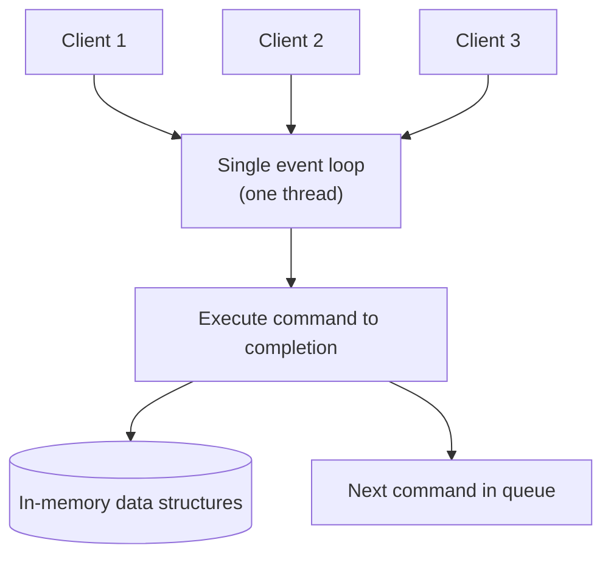

Redis is often described as "a data structure server" rather than a cache — the reason it fits so many roles (cache, queue, leaderboard, session store, rate limiter) is that it exposes rich, purpose-built data types with predictable complexity, all served from memory by a single-threaded event loop.

## Single-threaded event loop, and why it's fast

Redis executes commands on a **single thread** using an event loop (epoll/kqueue) that multiplexes thousands of client connections without context-switching between them for each command. This sounds like it should be slow, but it removes lock contention entirely — no command needs to coordinate with another running "at the same time," because none ever do. Combined with in-memory storage and O(1)/O(log n) data structures, this is why Redis routinely does hundreds of thousands of ops/sec on a single core. Newer versions add I/O threads for network read/write, but command *execution* stays single-threaded.

> [!KEY]
> Every Redis command runs to completion before the next one starts. This is what makes operations like `INCR` or `SET ... NX` atomic **for free** — no locking code required in your application.

> [!WARNING]
> Because it's single-threaded, one slow command (an unbounded `KEYS *`, a huge `SORT`, or a giant `SMEMBERS` on a million-member set) blocks every other client until it finishes. Always prefer `SCAN` over `KEYS`, and check `O(n)` commands against realistic collection sizes.



## The core data types

Redis is a flat keyspace: every key is a binary-safe string, and each key points at a **typed** value. The type is a property of the value, not the key, so `LPUSH` against a key holding a string fails with `WRONGTYPE` rather than coercing.


| Type | Key commands | Complexity | Realistic use case |
|---|---|---|---|
| String | `SET`, `GET`, `INCR`, `EXPIRE` | O(1) | Counters, cached blobs, feature flags |
| List | `LPUSH`, `RPOP`, `LRANGE`, `BLPOP` | O(1) push/pop ends, O(n) range | Task queues, recent-activity lists |
| Set | `SADD`, `SISMEMBER`, `SINTER` | O(1) add/check, O(n) set ops | Tags, unique visitor tracking, dedup |
| Sorted set | `ZADD`, `ZRANGE`, `ZINCRBY`, `ZRANK` | O(log n) add/remove, O(log n + m) range | Leaderboards, priority queues, rate windows |
| Hash | `HSET`, `HGET`, `HGETALL`, `HINCRBY` | O(1) per field | Objects/sessions, avoiding N string keys |
| Bitmap | `SETBIT`, `GETBIT`, `BITCOUNT` | O(1) bit ops, O(n) count | Daily-active-user tracking, feature toggles per ID |
| HyperLogLog | `PFADD`, `PFCOUNT`, `PFMERGE` | O(1) add, approximate count | Unique count at huge scale (~0.81% error, 12KB fixed) |
| Stream | `XADD`, `XREAD`, `XREADGROUP`, `XACK` | O(log n) append | Event log, lightweight queue with consumer groups |
| Geo | `GEOADD`, `GEOSEARCH`, `GEODIST` | O(log n) add (backed by sorted set) | "Nearby drivers/stores" queries |

## Leaderboard with sorted sets

A sorted set keeps members ordered by a floating-point **score**, with O(log n) insert and O(log n + m) range reads — exactly the shape of a leaderboard.

```text
ZADD leaderboard 1500 "alice"
ZADD leaderboard 2200 "bob"
ZINCRBY leaderboard 50 "alice"        # alice's score is now 1550
ZREVRANGE leaderboard 0 2 WITHSCORES  # top 3, highest first
ZRANK leaderboard "alice"             # alice's 0-based rank, ascending
```

> [!TIP]
> `ZREVRANK` gives rank in a "highest score = rank 0" leaderboard directly — no need to fetch the whole set and compute a position in application code.

## Rate limiting with counters

A fixed-window rate limiter is a single `INCR` plus an `EXPIRE`, made race-free with `SET ... NX ... EX` or a small Lua script:

```text
SET rate:user:42 0 EX 60 NX     # only sets if the key doesn't exist yet — starts the window
INCR rate:user:42               # atomic increment
GET rate:user:42                # compare against the limit in application code
```

For smoother limiting, a sorted set holding one entry per request timestamp implements a **sliding window**: `ZADD` the current timestamp, `ZREMRANGEBYSCORE` to drop anything older than the window, `ZCARD` to get the current count.

## Session store with hashes

A hash stores an object's fields under one key without needing one Redis key per field:

```text
HSET session:abc123 userId 42 role "admin" lastSeen 1718000000
HGET session:abc123 role
HINCRBY session:abc123 requestCount 1
EXPIRE session:abc123 1800       # 30-minute sliding session TTL
```

This is more memory-efficient than one string key per field (Redis internally uses a compact `listpack` encoding for small hashes) and lets you update one field with `HSET`/`HINCRBY` without reading and rewriting the whole object.

## Expiry, TTL and atomic operations

Every key can carry a TTL (`EXPIRE key seconds`, `PEXPIRE` for milliseconds, `TTL`/`PTTL` to check). Expired keys are removed lazily on access and by a periodic background sweep — you don't pay for a strict global timer. **Atomicity** matters because Redis commands (and Lua scripts, and `MULTI`/`EXEC` transactions) run without interleaving from other clients: `INCR`, `SET ... NX`, and `HINCRBY` are all safe to call concurrently from many clients without a race, which is the property that makes Redis useful for locks and counters, not just caching.

## Pipelining vs transactions vs Lua

| Mechanism | What it does | Atomicity | Round trips |
|---|---|---|---|
| Pipelining | Batches multiple commands into one network write | None — each command still executes independently | 1 (for N commands) |
| `MULTI`/`EXEC` | Queues commands, executes all together | Yes — no other client's commands interleave | 1 |
| Lua script (`EVAL`) | Runs a script server-side as one atomic unit | Yes — plus can read a value and act on it in the same step | 1 |

Pipelining is purely a network optimisation (fewer round trips); transactions guarantee no interleaving but can't branch on a value read mid-transaction; Lua scripts are the only option when the logic needs to read a value and conditionally act on it atomically (e.g., "delete this key only if its value matches").

## Keyspace design and memory efficiency

Use a consistent `noun:id:field` naming convention (`user:42:profile`, `order:9001:items`) so patterns are predictable and `SCAN MATCH "user:42:*"` works. Prefer hashes over many separate string keys for related fields — Redis's per-key overhead (roughly 50–90 bytes for metadata) adds up fast across millions of keys, while a hash amortises that overhead across all its fields.

> [!DANGER]
> `KEYS *` (and unbounded pattern scans) walk the entire keyspace on the single command thread, blocking every other client for the duration. Always use `SCAN` with a cursor in production code, never `KEYS`.

## Cheat sheet

- Single-threaded execution means every command is atomic by default — no client-side locking needed for `INCR`, `SET NX`, `HINCRBY`.
- Choose the type by access pattern: string (counter/blob), list (queue), set (membership/dedup), sorted set (ranking/ordering), hash (object), bitmap (per-bit flags), HyperLogLog (approximate distinct count), stream (event log with consumer groups), geo (proximity).
- Sorted sets are the leaderboard/priority-queue tool: O(log n) insert, O(log n + m) ranged reads.
- Rate limiting: `INCR` + `EXPIRE` for fixed windows; a sorted set of timestamps for sliding windows.
- Hashes beat N separate string keys for objects — lower per-key overhead, atomic per-field updates.
- Pipelining saves round trips; `MULTI`/`EXEC` guarantees no interleaving; Lua scripts add conditional logic atomically.
- Never run `KEYS *` in production — use `SCAN` with a cursor.
- HyperLogLog trades exactness (~0.81% error) for a fixed ~12KB footprint regardless of cardinality.

## Common mistakes

| Mistake | Fix |
|---|---|
| Using `KEYS *` to find keys in production | Use `SCAN` with `MATCH` and a cursor |
| Storing an object as N separate string keys | Use a hash — atomic field updates, lower overhead |
| Assuming `EXPIRE` fires exactly on schedule | Expiry is lazy + periodic sweep; a key can briefly outlive its TTL under load |
| Treating `INCR` as needing external locking | It's already atomic — no lock required |
| Using a plain counter for a sliding-window rate limit | Use a sorted set of timestamps for accurate sliding windows |
| Running a large `SMEMBERS`/`ZRANGE 0 -1` on a huge collection | Paginate with `SSCAN`/`ZSCAN` or bounded ranges |

## Summary

Redis's speed comes from serving simple, well-chosen data structures out of memory on a single-threaded event loop, which makes most individual commands atomic without any client-side coordination. Picking the right type — sorted sets for ranking, hashes for objects, streams for event logs, HyperLogLog for approximate counts — turns what would be application-level logic into a single fast command. The operational discipline that goes with this: never run unbounded O(n) commands like `KEYS *` against production traffic, and reach for Lua or `MULTI`/`EXEC` the moment you need more than one atomic step.

## Top Interview Questions

### Q1. Why is Redis fast despite being single-threaded?

Because it serves everything from memory, uses efficient O(1)/O(log n) data structures, and runs command execution on a single thread via an event loop, it avoids all the overhead multi-threaded systems pay for locking and context-switching between commands. Every command runs to completion before the next starts, so there's no contention to manage. The trade-off is that the single execution thread means one long-running command (an unbounded `KEYS *`, or a `SORT` on a huge collection) blocks every other client for its duration — Redis's speed model assumes commands stay cheap, and the operational discipline is making sure they do.

### Q2. When would you use a sorted set instead of a list or a plain hash?

A sorted set is the right choice whenever you need elements ordered by a score with efficient range queries — leaderboards (score = points), priority queues (score = priority or due time), and rate-limiting windows (score = timestamp) are the classic cases. A list only maintains insertion order and is O(n) to search or reorder; a hash has no ordering at all. The sorted set gives O(log n) insert/update/remove and O(log n + m) range reads by score or rank, which is exactly the complexity profile "give me the top 10" or "give me everything in this time window" needs.

### Q3. How would you implement a leaderboard with the top 10 players and a specific player's rank?

Use a sorted set keyed by the leaderboard name, with each member's score being their points: `ZADD leaderboard <score> <playerId>` to add or update a score (re-adding a member updates it), `ZREVRANGE leaderboard 0 9 WITHSCORES` for the top 10 in descending order, and `ZREVRANK leaderboard <playerId>` for that player's 0-based rank among all players. Updating a score after each game is a single `ZINCRBY leaderboard <delta> <playerId>` call, and all of this is O(log n), so it stays fast even with millions of players.

### Q4. Design a rate limiter using Redis. What are the trade-offs between a fixed window and a sliding window?

A fixed window uses a single counter per time bucket: `INCR rate:user:42:2024-01-01T10:00` with an `EXPIRE` matching the window length; simple and cheap, but it allows up to 2x the limit right at the window boundary (a burst at the end of one window plus a burst at the start of the next). A sliding window uses a sorted set of request timestamps per user: `ZADD` the current timestamp, `ZREMRANGEBYSCORE` to evict anything older than the window, `ZCARD` to get the current count and compare to the limit. The sliding window is accurate but costs more memory (one entry per request in the window) and more commands per check; the fixed window is nearly free but has the boundary-burst weakness. I'd default to fixed-window counters unless the boundary burst is a real problem for the use case.

### Q5. Why are Redis commands like `INCR` and `SET ... NX` considered atomic, and why does that matter?

Because Redis executes one command to completion on its single thread before starting the next, there's no window in which two clients' operations can interleave within a single command — `INCR` reads and increments a value as one indivisible step, and `SET key value NX` checks for the key's absence and sets it as one indivisible step. This matters because it lets you build locks, unique-registration checks, and counters without any client-side locking code: the classic "only one client should win" pattern is just `SET lock:resource token NX EX 30` and checking the return value, rather than a compare-and-swap loop with retries.

### Q6. Why would you choose a Redis hash over storing each field as a separate string key?

A hash groups related fields under one key, which is both more memory-efficient (Redis's per-key metadata overhead, roughly 50–90 bytes, is paid once per hash instead of once per field, and small hashes use a compact `listpack` encoding) and lets you update or read individual fields atomically (`HSET`, `HINCRBY`, `HGET`) without touching the rest of the object. Separate string keys also make expiry and cleanup harder — you'd need to `EXPIRE` and delete N keys instead of one. The only reason to prefer separate keys is if different fields genuinely need independent TTLs, which a hash's fields don't support individually.

### Q7. What's the difference between pipelining, `MULTI`/`EXEC` transactions, and Lua scripts, and when would you use each?

Pipelining is purely a network optimisation: it batches several independent commands into one round trip, but each command still executes on its own with no atomicity guarantee between them — another client's command could interleave between two pipelined commands. `MULTI`/`EXEC` queues a batch of commands and guarantees the whole batch executes with no interleaving from other clients, but you can't branch on a value read mid-transaction — the commands are fixed when queued. A Lua script (`EVAL`) runs entirely server-side as one atomic step and *can* read a value and conditionally act on it (e.g., "delete this key only if its value equals X") — the only one of the three that supports conditional logic atomically. I'd use pipelining for bulk, independent writes; transactions for "these N commands must not interleave"; Lua when the logic itself needs a read-then-conditionally-write step.

### Q8. Your team wants to count unique daily visitors across millions of users cheaply. What Redis structure would you use?

HyperLogLog (`PFADD`, `PFCOUNT`) is built exactly for this: it estimates set cardinality with about 0.81% standard error using a fixed ~12KB of memory regardless of how many elements are added — compare that to a `Set` of actual user IDs, which would grow linearly and could be gigabytes at that scale. I'd `PFADD` a visitor's ID to a per-day key on each visit and `PFCOUNT` to read the daily estimate, using `PFMERGE` to combine several days into a weekly/monthly estimate without re-scanning raw data. The trade-off to state clearly: you get an approximate count, not an exact one, and you lose the ability to answer "was this specific user counted" since individual members aren't retrievable.

### Q9. A production incident report says Redis latency spiked to seconds during a specific batch job. What would you investigate?

Given the single-threaded execution model, my first suspicion is a slow O(n) command blocking the event loop — I'd check for `KEYS *`, an unbounded `SMEMBERS`/`ZRANGE 0 -1` on a large collection, a `SORT` on a big list, or a Lua script doing heavy computation, all of which run to completion before anything else is served. I'd use `SLOWLOG GET` to see exactly which commands crossed the slow-query threshold and how long they took, and `MONITOR` briefly (never in steady-state production, since it itself has overhead) to correlate the batch job's commands with the latency window. The fix is almost always replacing the offending O(n) command with a cursor-based equivalent (`SCAN`, `SSCAN`, `ZSCAN`) or moving the heavy computation out of Redis entirely.

### Q10. How does Redis handle key expiry internally, and what does that mean for exact TTL guarantees?

Redis doesn't run a precise per-key timer; instead it removes expired keys **lazily** (checked when the key is accessed and found to be past its TTL) and via a **periodic active sweep** that samples a portion of keys with a TTL set and evicts any it finds expired, adjusting its sampling rate based on how many it finds. This means a key can technically still exist in memory slightly after its TTL under load, and won't be returned to a client (the lazy check catches it on read), but a `DBSIZE` count or a memory-usage figure might briefly overcount already-expired keys. For anything relying on precise expiry timing for correctness (rather than eventual cleanup), don't rely on TTL alone — build the time check into your application logic too.

### Q11. What's a scenario where you'd choose a Redis list over a stream or a sorted set for a queue-like use case?

A list with `LPUSH`/`BRPOP` is the right choice for a simple, single-consumer-group FIFO queue where you don't need replay, multiple independent consumer groups, or acknowledgement tracking — it's the cheapest and simplest option, and `BRPOP` gives you blocking pop for free instead of polling. A stream is the better choice when you need multiple consumer groups each processing the same events independently, message replay from an offset, or an acknowledgement/pending-entries model for at-least-once processing — essentially a lightweight Kafka. A sorted set is for delayed/scheduled work, where the score is a "process-after" timestamp and a worker polls for anything with a score less than or equal to now. I'd pick based on whether replay and multiple independent consumers matter — if not, a list is simpler and cheaper.
