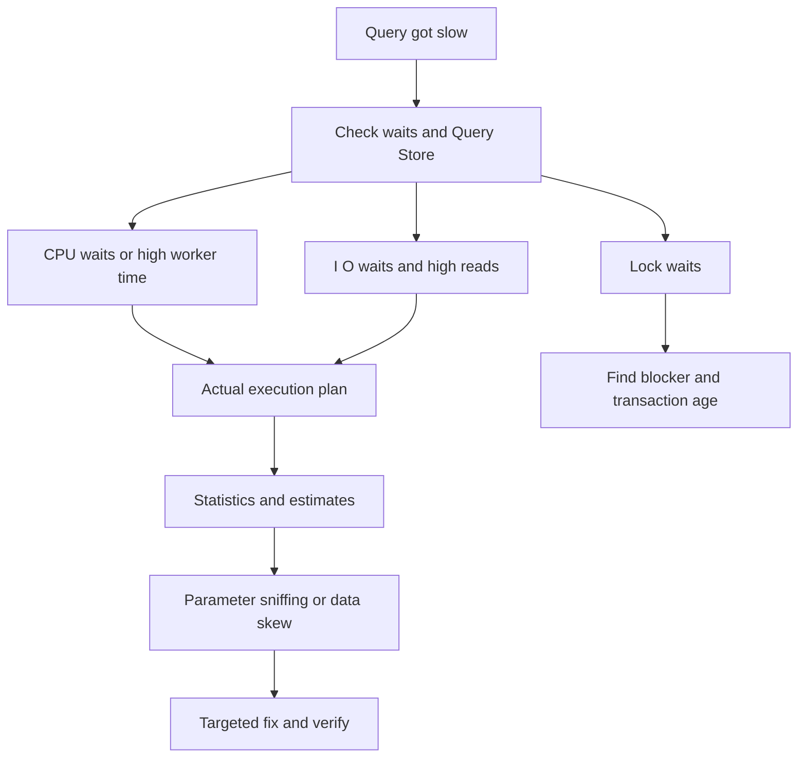

A slow query in production is rarely solved by guessing at an index. The strong interview answer is an ordered playbook: identify the wait, inspect the actual plan, verify statistics and data shape, check blocking, then choose the smallest safe fix.

## Triage in the right order

Start with the symptom the database is reporting, not with the query text you happen to suspect. Wait statistics tell you whether sessions are burning CPU, waiting on I/O, blocked on locks, waiting for memory, or stalled by parallelism. That narrows the search before you open a plan.



| Signal | Likely root cause | First action |
|---|---|---|
| High CPU, low reads | Bad join choice, scalar function, large sort or hash | Capture actual plan and top CPU queries |
| High logical reads | Scan, key lookup flood, non-sargable predicate | Check `SET STATISTICS IO` and seek versus scan |
| `PAGEIOLATCH` waits | Storage read latency or cold cache | Compare physical reads and storage metrics |
| `LCK_M_*` waits | Blocking transaction, lock escalation | Find blocking chain before changing indexes |
| Sudden regression after restart | New cached plan | Compare Query Store plans |
| App timeouts with low DB CPU | Connection pool exhaustion or blocking | Check active sessions and app dependency telemetry |

```sql
SELECT TOP (20)
    qs.execution_count,
    qs.total_worker_time / NULLIF(qs.execution_count, 0) AS avg_cpu_us,
    qs.total_logical_reads / NULLIF(qs.execution_count, 0) AS avg_reads,
    SUBSTRING(st.text, 1, 200) AS query_text
FROM sys.dm_exec_query_stats AS qs
CROSS APPLY sys.dm_exec_sql_text(qs.sql_handle) AS st
ORDER BY avg_cpu_us DESC;
```

> [!KEY]
> The order matters. Waits tell you the class of problem; the actual plan tells you why that class of problem happened.

Query Store is ideal when available because it records plan history and runtime statistics. The fastest regression diagnosis is often a before and after comparison: same query hash, different plan id, worse duration or reads.

## Reading IO and plans

`SET STATISTICS IO, TIME ON` is a simple way to distinguish a plan that is logically expensive from one that is blocked or waiting on storage. Logical reads are pages read from buffer pool, whether already in memory or fetched from disk. Physical reads show disk misses. CPU time versus elapsed time hints at parallelism, blocking or waiting.

```sql
SET STATISTICS IO, TIME ON;

EXEC dbo.GetOrdersByCustomer
    @CustomerId = 42,
    @FromDate = '2026-01-01';

SET STATISTICS IO, TIME OFF;
```

| Output field | Meaning | How to use it |
|---|---|---|
| Scan count | Number of index or table access starts | High values can reveal loops or repeated seeks |
| Logical reads | 8 KB pages read from cache | Main cost signal for query shape |
| Physical reads | Pages fetched from storage | Cold cache or memory pressure signal |
| Read ahead reads | Pages prefetched by the engine | Often appears with scans |
| CPU time | Worker CPU consumed | High CPU means work, not waiting |
| Elapsed time | Wall-clock duration | Big gap from CPU suggests waits or parallelism |

In the actual plan, first compare estimated rows with actual rows. A 10 row estimate that becomes 1,000,000 actual rows can make the optimizer choose Nested Loops, underestimate a memory grant, spill a hash to tempdb, or perform millions of key lookups. Operator names matter, but estimate quality explains why the operator was chosen.

> [!TIP]
> A scan is not automatically wrong and a seek is not automatically good. A scan over a 500 row table is fine; a seek plus 500,000 key lookups may be worse than a scan.

## Statistics, skew and sniffing

Statistics are histograms that estimate how many rows a predicate will match. They go stale after large inserts, deletes or skew changes. A nightly import, tenant growth spike, or deleted archive can invalidate yesterday's estimates without any code change.

Parameter sniffing is different: the first parameter value used to compile a stored procedure shapes the cached plan for later values. It is beneficial when values are representative and painful when data is skewed.

| Fix | Use when | Trade-off |
|---|---|---|
| Update statistics | Estimates are wrong after large data change | Extra I/O and compile churn during update |
| `OPTION (RECOMPILE)` | Infrequent query needs per-execution accuracy | Adds compile CPU every execution |
| `OPTIMIZE FOR UNKNOWN` | Need stable average plan | Not ideal for any extreme value |
| `OPTIMIZE FOR (@p = value)` | One value is representative | Brittle if distribution changes |
| Split procedure paths | Workload is clearly bimodal | More code, often cleanest long-term |
| Query Store force plan | Emergency regression rollback | Can hide future data shape changes |

```sql
SELECT TOP (10)
    s.name AS stat_name,
    sp.last_updated,
    sp.rows,
    sp.rows_sampled,
    sp.modification_counter
FROM sys.stats AS s
CROSS APPLY sys.dm_db_stats_properties(s.object_id, s.stats_id) AS sp
WHERE s.object_id = OBJECT_ID('dbo.Orders')
ORDER BY sp.modification_counter DESC;
```

The interview answer should say how you prove sniffing. Run the slow procedure with `OPTION (RECOMPILE)` or a local test variant, compare plans for a small tenant and a large tenant, and inspect estimate versus actual row gaps. Do not add `RECOMPILE` everywhere; at high call rates, compile CPU can become the outage.

## Plan cache and recompilation

The plan cache saves CPU by reusing compiled plans, but it can be polluted. Ad hoc queries with literal values can create thousands of near-duplicate plans. Dynamic SQL that embeds user values instead of parameterising has the same problem and can also be unsafe. Cache pressure then evicts useful plans, causing recompilation storms.

```sql
SELECT TOP (20)
    cp.objtype,
    cp.usecounts,
    cp.size_in_bytes / 1024 AS size_kb,
    SUBSTRING(st.text, 1, 200) AS sample_text
FROM sys.dm_exec_cached_plans AS cp
CROSS APPLY sys.dm_exec_sql_text(cp.plan_handle) AS st
WHERE cp.objtype = 'Adhoc'
ORDER BY cp.usecounts ASC, cp.size_in_bytes DESC;
```

| Pattern | Consequence | Safer alternative |
|---|---|---|
| One literal query per value | Cache bloat and repeated compilation | Parameterised query or stored procedure |
| Clearing whole plan cache | CPU spike from mass recompilation | Target one plan handle or use Query Store |
| `RECOMPILE` on hot path | Accurate plan but constant compile CPU | Split query or optimise for typical value |
| Forced plan forever | Stable today, stale tomorrow | Monitor after forcing and revisit |

> [!WARNING]
> `DBCC FREEPROCCACHE` is not a normal fix. It can turn one slow query into an instance-wide compile storm.

A production-safe answer includes rollback. If Query Store shows a known good plan, force it to stop bleeding, then investigate statistics, skew or code changes. The emergency mitigation and the root-cause fix are not always the same step.

## Blocking, pools and bulk work

If the plan has not changed and the query is waiting, check blocking. A report can be fast in isolation and slow in production because a long transaction holds locks. Find the head blocker, its open transaction age and the statement it is running.

```sql
SELECT
    r.session_id,
    r.blocking_session_id,
    r.wait_type,
    r.wait_time,
    r.status,
    SUBSTRING(t.text, 1, 200) AS running_sql
FROM sys.dm_exec_requests AS r
CROSS APPLY sys.dm_exec_sql_text(r.sql_handle) AS t
WHERE r.blocking_session_id <> 0
   OR r.session_id IN (
        SELECT blocking_session_id
        FROM sys.dm_exec_requests
        WHERE blocking_session_id <> 0
   );
```

Connection-pool exhaustion often masquerades as a database problem. Application requests time out while waiting for a pooled connection, even though SQL CPU is low. Causes include leaked connections, long transactions, N+1 query patterns, pool size too small for request concurrency, or every request blocked behind one slow dependency. Check app dependency counts, open connection metrics and database sessions together.

Bulk operations need batching. One unbounded delete can lock a hot table, fill the log, delay replicas and starve the app.

```sql
WHILE 1 = 1
BEGIN
    DELETE TOP (5000)
    FROM dbo.Events
    WHERE CreatedAt < @Cutoff;

    IF @@ROWCOUNT = 0 BREAK;
    WAITFOR DELAY '00:00:00.050';
END;
```

Batch sizes around 1,000 to 10,000 rows with small sleeps are a good starting point. Make the job resumable, track progress and run it under an explicit operational plan.

## Change control and verification

A production fix is incomplete until it is verified and made safe to repeat. For a slow query, capture the baseline plan, duration, logical reads, CPU, row counts and wait profile before changing anything. After the fix, compare the same measurements under similar parameters. If the incident was parameter-sensitive, test both the small and large parameter shapes; many fixes improve one and harm the other.

| Change | Pre-check | Post-check |
|---|---|---|
| Update statistics | Which stats are stale and which table is affected | Estimates improve and plan shape changes as expected |
| Add index | Write overhead, size, duplicate index risk | Logical reads drop and write latency stays acceptable |
| Force plan | Known good plan id and regression window | Runtime stable and no new spill or memory issue |
| Add `RECOMPILE` | Execution frequency and compile CPU budget | CPU does not rise under normal traffic |
| Batch job change | Batch size, log headroom and replica lag | Locks, log usage and lag remain within limits |

Emergency mitigations should have expiry dates. A forced plan might be correct for today's data distribution and wrong after the next import. A new covering index might save one report and slow five write paths. A temporary `RECOMPILE` hint might be safe during an incident and too expensive at steady state. Record why the mitigation was chosen and what signal will trigger removal or redesign.

Roll out query fixes with the same discipline as application changes. In systems with Query Store, compare plan and runtime history after deployment. In application telemetry, watch dependency duration, timeout rate and connection pool waits. In database metrics, watch CPU, logical reads, waits, tempdb spills and log growth. If the fix changes schema or indexes, schedule it with the operations team because index creation itself can block or consume I/O depending on edition and options.

The senior interview close is: I do not declare victory when the query is fast once in SSMS. I declare victory when production telemetry shows the bad percentile recovered, no adjacent workload regressed, and the mitigation is documented with a follow-up owner.

Keep an incident notebook or ticket with exact evidence. Record the slow query hash, plan id, parameters used, wait types, before and after logical reads, and the reason the chosen fix was safe. This avoids folklore six months later when the same query appears in a different form. It also helps separate causation from coincidence: a query that improved after an index was created might actually have improved because blocking ended at the same time.

The best teams turn repeated incidents into guardrails. If plan regressions recur, enable Query Store alerts. If connection pools exhaust, add pool wait metrics to dashboards. If bulk jobs cause lag, require batch-size configuration and dry-run estimates. Troubleshooting is not only restoring service; it is removing the next surprise.

Also distinguish a query fix from a workload fix. If one endpoint issues the same cheap query 500 times, the plan may be fine and the application pattern is broken. In that case batching, eager loading, caching or API redesign beats another index. Production troubleshooting crosses the database and application boundary.
## Cheat sheet

- Start with waits, Query Store and runtime metrics before touching indexes.
- Use the actual plan for a real incident because it shows actual rows and warnings.
- `SET STATISTICS IO` exposes logical reads, scan count and physical reads.
- Large estimated versus actual row gaps usually mean stale statistics, bad predicates or parameter sniffing.
- Parameter sniffing is plan reuse on skewed values, not a database bug.
- `OPTION (RECOMPILE)` is a diagnostic and selective fix, not a blanket solution.
- Plan cache pollution comes from many literal ad hoc queries and excessive recompilation.
- Blocking and connection-pool exhaustion can make a good plan look slow.
- Batch large deletes and updates to control locks, log growth and replica lag.

## Common mistakes

| Mistake | Fix |
|---|---|
| Adding an index before reading waits or the actual plan | Diagnose the class of slowness first |
| Treating any scan as a bug | Compare table size, selectivity and logical reads |
| Running `UPDATE STATISTICS` blindly during peak load | Confirm bad estimates and schedule or scope the update |
| Clearing the entire plan cache | Target a bad plan or force a known good one temporarily |
| Using `RECOMPILE` on every hot query | Use it only where compile cost is acceptable |
| Running one giant delete or update | Batch DML and make it resumable |
| Ignoring app connection metrics | Correlate pool waits with database sessions and blockers |

## Summary

Production query troubleshooting is a controlled narrowing process. Waits identify whether the problem is CPU, I/O, locks, memory or the application waiting for a connection. Actual plans and `STATISTICS IO` explain the work being done, while statistics, parameter sniffing and plan cache behaviour explain why yesterday's good query changed overnight. Safe fixes are targeted, measurable and reversible.

## Top Interview Questions

### Q1. A query got slow overnight with no code change. Walk me through it.

I would first verify the symptom and time window in Query Store or monitoring, then check waits to classify the problem. High CPU points toward plan shape; high reads toward scan or lookup volume; lock waits toward blocking; low database load with app timeouts points toward connection pooling or an upstream issue. Next I would compare the actual execution plan with the previous good plan, focusing on estimated versus actual rows, spills and key lookup counts. Then I would check statistics freshness, data volume changes and whether a plan was recompiled for an unusual parameter. Only after that would I choose a fix, such as updating stats, forcing a previous plan temporarily, addressing sniffing or removing a blocker.

### Q2. How do you use `SET STATISTICS IO` in a diagnosis?

`SET STATISTICS IO ON` prints table-level read information for a query. Logical reads are the main signal because they show how many 8 KB pages the query touched, regardless of whether pages were already in memory. Physical reads show cache misses or storage pressure. Scan count can reveal repeated access, especially when a Nested Loops plan probes the same table many times. I compare these numbers before and after a change to prove whether the query does less work, not just whether it happened to run faster once. If logical reads remain huge, a faster run may simply be warm cache or less blocking rather than a real plan improvement.

### Q3. What is parameter sniffing and when is it a problem?

Parameter sniffing is SQL Server compiling a parameterised query or stored procedure using the first parameter values it sees, then caching that plan for later executions. That is normally beneficial because the optimizer can use real values to estimate row counts. It becomes a problem when data is skewed: one tenant has 10 rows, another has 10 million, and the plan compiled for one shape is reused for the other. Symptoms include a procedure that is fast most of the time but randomly slow after restart, deployment or cache eviction. I prove it by comparing plans for representative small and large parameters and by testing whether recompilation produces the expected plan.

### Q4. How would you fix a parameter sniffing issue?

The fix depends on frequency and data shape. For an infrequent reporting query, `OPTION (RECOMPILE)` may be acceptable because compile cost is small compared with execution cost. For a hot path, constant recompilation can burn CPU, so I prefer a stable plan through `OPTIMIZE FOR UNKNOWN`, `OPTIMIZE FOR` a representative value, or splitting procedures into separate branches for small and large parameter shapes. Query Store plan forcing can stop a production regression quickly, but I treat it as mitigation and keep monitoring. The best long-term fix often combines better statistics, a more appropriate index and code paths that reflect genuinely different access patterns.

### Q5. What is plan cache pollution?

Plan cache pollution happens when the cache fills with many low-use plans, usually from ad hoc SQL with literal values or dynamically constructed statements. For example, thousands of queries differing only by `CustomerId = 1`, `CustomerId = 2` and so on can each compile separately. That wastes cache memory, increases compilation CPU and evicts useful reusable plans. The fix is parameterisation through prepared statements, stored procedures or safe dynamic SQL with parameters. I would inspect `sys.dm_exec_cached_plans` for many `Adhoc` plans with `usecounts = 1`, then fix the application query shape rather than repeatedly clearing the cache, which only creates another compilation spike.

### Q6. How do blocking and deadlocks differ from a slow plan?

A slow plan consumes resources because the optimizer chose or was forced into expensive work. Blocking means the query may be ready to run but is waiting for locks held by another transaction. The execution plan can look fine because the cost is not the work, it is the wait. Deadlocks are a cycle of sessions waiting on each other; SQL Server chooses a victim and rolls it back. For blocking, I find the head blocker, its statement and transaction age, then decide whether to let it finish, kill it or change the transaction pattern. For deadlocks, retries are only recovery; the permanent fix is consistent lock order, shorter transactions or better indexing to reduce lock footprint.

### Q7. Why can connection-pool exhaustion look like a database problem?

From the user's perspective, the request times out while trying to do database work, so it is reported as a database issue. But the database may be mostly idle if application threads are waiting for a connection from the pool. Causes include connections not disposed, long transactions holding connections, sudden request concurrency beyond pool size, N+1 query patterns or a blocked query tying up every pooled connection. I would correlate application dependency telemetry with database sessions: high pool wait time, many open connections and low SQL CPU point away from query tuning. Fixes include disposing connections correctly, reducing query count, shortening transactions and sizing pool limits intentionally.

### Q8. How do you run a large delete or backfill safely in production?

I avoid one huge transaction. Instead I process rows in batches, commonly 1,000 to 10,000 rows, commit each batch and sleep briefly between batches to reduce lock pressure, log growth and replica lag. The job should be resumable, with progress recorded by key range or a migration status table. I run it during a lower-traffic window, monitor waits, log usage and replica lag, and keep a rollback or stop plan. For deletes, I ensure the predicate is indexed so each batch finds rows efficiently. For backfills, I deploy application compatibility first so new writes are already correct while old rows are being filled gradually.


