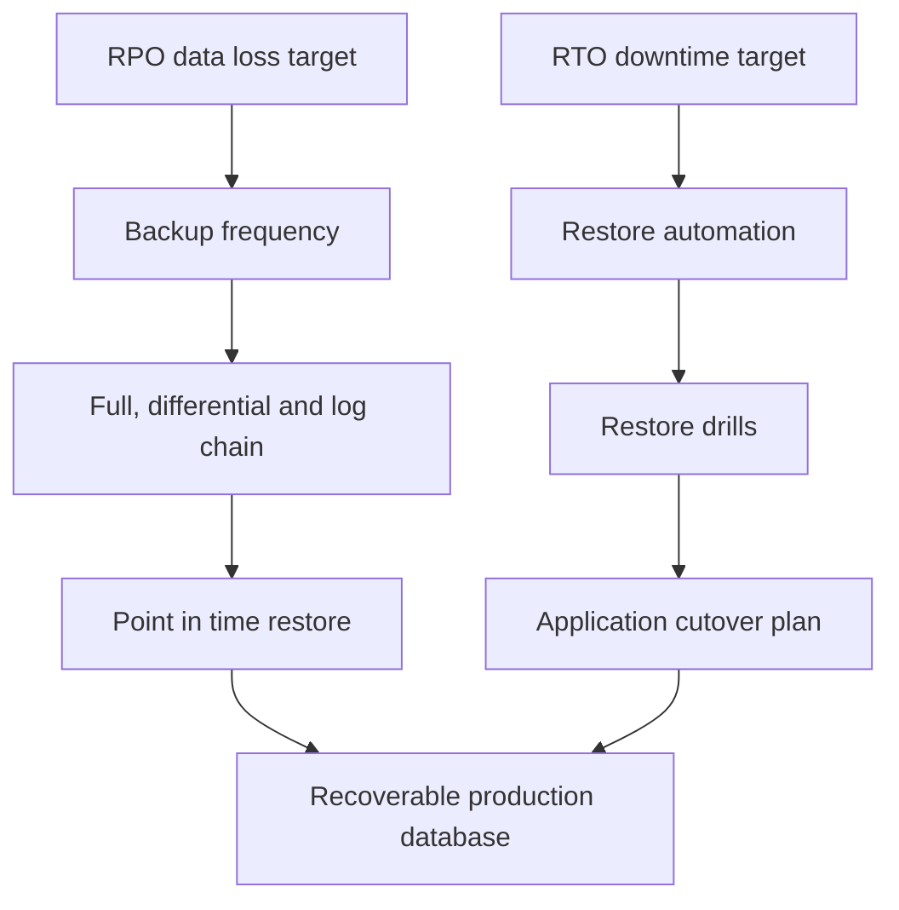
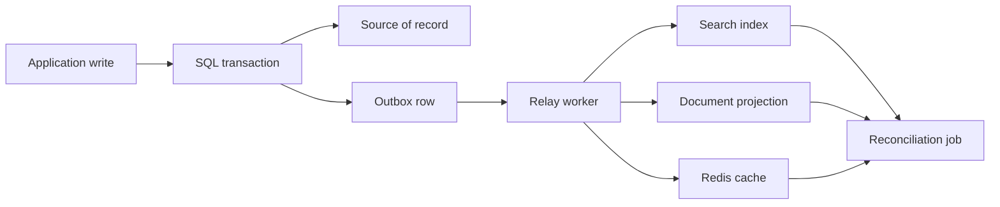

Operating a database in production is about recoverability, correctness and isolation under failure. The interview signal is knowing what each operational feature costs: lower data loss, faster recovery, safer migrations and stronger tenant isolation all consume money, complexity or latency.

## Recovery objectives and backups

Backups should be designed from explicit objectives. Recovery Point Objective is how much committed data the business can lose. Recovery Time Objective is how long the service can be unavailable or degraded while you restore. A low RPO usually means frequent log backups or managed point-in-time restore; a low RTO usually means pre-provisioned capacity, automation and practiced cutover.



| Backup type | Restores to | RPO effect | Operational note |
|---|---|---|---|
| Full | A complete point in time | Baseline only | Longest to create and restore |
| Differential | Last full plus changed extents | Shortens restore chain | Grows until next full backup |
| Transaction log | Any point between log backups | Drives low RPO | Requires full recovery model in SQL Server |
| Copy-only | Ad hoc safety copy | Does not break normal chain | Useful before risky migrations |
| Managed PITR | Provider reconstructs target time | Often minutes of data loss | Restore usually creates a new database |

> [!KEY]
> A backup that has never been restored is an assumption, not an operational guarantee.

Cost follows the objective. Daily full backups may satisfy a reporting database with RPO of 24 hours. Payment data with RPO of minutes needs log backups or managed PITR, plus monitoring that proves the backup chain is healthy.

## Point in time restore and drills

Point-in-time restore is the common recovery path for accidental deletes, bad deployments and data corruption caught within the retention window. Azure SQL, for example, keeps automated backups and transaction logs so a database can be restored to a chosen timestamp within the configured retention range. The restore normally creates a new database, then you reconcile or cut over.

| Drill step | What to record | Why it matters |
|---|---|---|
| Restore latest backup | Start and finish time | Proves real RTO, not guessed RTO |
| Run integrity checks | `DBCC CHECKDB` or engine equivalent | Detects corrupted backup or storage issue |
| Run app smoke tests | Login, read, write, critical reports | Backup may restore but app may not work |
| Practice cutover | DNS, connection string or failover group step | Avoids improvising during outage |
| Document gaps | Missing roles, jobs, secrets, firewall rules | Recovery includes more than data files |

```sql
DBCC CHECKDB (N'Orders_RestoreTest') WITH NO_INFOMSGS;

SELECT TOP (1) OrderId, CreatedAt
FROM dbo.Orders
ORDER BY CreatedAt DESC;
```

> [!TIP]
> Run restore drills on a schedule and after major schema changes. Record the measured restore time, not just whether the command succeeded.

Restore testing often uncovers non-database dependencies: SQL Agent jobs, logins, encryption keys, linked servers, application settings and firewall rules. A runbook should list them because the outage clock includes every missing dependency.

## Replication and read replicas

Replication is not a backup. A replica is usually a near-real-time copy for availability or read scaling; it can faithfully replicate accidental deletes and corruption. A backup is a historical recovery point. Both are needed for serious production systems.


The Redis deployment topology shows the same operational pattern databases use: a single node is simple, primary and secondary replication adds failover and read capacity, and clustering adds partitioned scale with more routing complexity.

| Scenario | Use replica reads? | Reason |
|---|---|---|
| Analytics dashboard | Yes | Slight staleness is acceptable |
| User reads immediately after write | Usually no | Replica lag can hide the user's own change |
| Login or permission check | No | Stale auth data creates correctness bugs |
| Long-running report | Yes | Protects primary workload if staleness is documented |
| Background aggregation | Yes | Eventual consistency is normally acceptable |

Replica lag is a correctness problem, not just a metric. If a user updates their profile and the next page reads from a lagging replica, the application appears to lose data. Fixes include routing reads to primary for a short window after writes, tracking commit timestamps and comparing with replica lag, or communicating eventual consistency in the UI for safe domains.

## Zero downtime schema migration

A safe schema migration is usually expand and contract. First expand the schema in a backward-compatible way, then backfill, deploy code that writes both shapes, switch reads, and only later remove the old shape. The pattern keeps rollback possible between steps.

```sql
ALTER TABLE dbo.Customer
    ADD NormalizedEmail NVARCHAR(320) NULL;

WHILE 1 = 1
BEGIN
    UPDATE TOP (5000) dbo.Customer
    SET NormalizedEmail = LOWER(Email)
    WHERE NormalizedEmail IS NULL;

    IF @@ROWCOUNT = 0 BREAK;
    WAITFOR DELAY '00:00:00.050';
END;

ALTER TABLE dbo.Customer
    ALTER COLUMN NormalizedEmail NVARCHAR(320) NOT NULL;
```

| Step | Production goal | Rollback posture |
|---|---|---|
| Expand | Add nullable column or new table | Old code ignores it |
| Backfill | Populate historical rows in chunks | Job can pause and resume |
| Dual-write | New code writes old and new | Roll back reads safely |
| Switch reads | Application trusts new shape | Old data still maintained temporarily |
| Contract | Drop old column or table | Only after confidence window |

> [!WARNING]
> Adding a `NOT NULL` column with a default to a huge hot table can become a table-lock incident on some engines or versions. Add nullable, backfill, then enforce.

Large migrations should be load-tested against production-sized data. A script that is instant on a developer database may run for hours, fill the transaction log or block writers on a 500 million row table.

## Deletes, audits and temporal history

Production systems often need both deletion semantics and history semantics. Soft deletes mark a row as inactive, audit trails record who changed what, and temporal tables keep system-managed row versions. The right choice depends on query overhead, compliance and restore expectations.

| Approach | Strength | Cost |
|---|---|---|
| Soft delete | Simple restore of accidentally hidden rows | Every active query must filter deleted rows |
| Audit table or trigger | Explicit who, what and when | Trigger complexity and write amplification |
| Temporal table | Built-in point-in-time row history | Storage growth and retention management |
| Hard delete plus backup | Simple active schema | Slow recovery for one row or customer |

```sql
CREATE TABLE dbo.Product (
    ProductId INT NOT NULL PRIMARY KEY,
    Name NVARCHAR(200) NOT NULL,
    Price DECIMAL(10, 2) NOT NULL,
    ValidFrom DATETIME2 GENERATED ALWAYS AS ROW START NOT NULL,
    ValidTo DATETIME2 GENERATED ALWAYS AS ROW END NOT NULL,
    PERIOD FOR SYSTEM_TIME (ValidFrom, ValidTo)
) WITH (SYSTEM_VERSIONING = ON (
    HISTORY_TABLE = dbo.ProductHistory
));

SELECT *
FROM dbo.Product
FOR SYSTEM_TIME AS OF '2026-09-01T12:00:00';
```

Soft deletes need filtered indexes and unique constraints that ignore deleted rows where the engine supports them. Without that, active-row queries gradually scan a graveyard of old data.

## Multi-tenancy and polyglot stores

A multi-tenant SaaS database model sets isolation, blast radius and cost. Start with the simplest model that meets compliance and noisy-neighbour requirements, but design exports so large tenants can move later.

| Model | Isolation | Cost | Operational trade-off |
|---|---|---|---|
| Shared schema with `TenantId` | Lowest | Cheapest | Missing tenant filter is catastrophic |
| Schema per tenant | Medium | Medium | Migrations across hundreds of schemas become hard |
| Database per tenant | Highest | Highest without pooling | Best backup, restore and compliance boundary |
| Hybrid | Tiered | Controlled | Large tenants move out as they grow |

Row-level security can be a safety net for shared schema, but application queries still need tenant predicates for performance. Database-per-tenant makes restore and legal hold easier because one tenant can be restored or moved independently, especially when elastic pools amortise small-tenant cost.

Polyglot persistence adds another operational surface. SQL might be the system of record, Redis the cache, Cosmos or a document store the read projection, and search the query surface. Never let two stores both own the same fact. Use an outbox event written in the same transaction as the source change, then let idempotent consumers update projections.



## Choosing recovery investments

Recovery design is a business decision translated into database architecture. A low-value internal reporting system may accept hours of downtime and a day of data loss. A customer-facing ordering system may need minutes of RTO and near-zero RPO. The mistake is applying the same expensive recovery posture to everything, or worse, applying a cheap posture to the one system that cannot tolerate loss.

| Requirement | Lower-cost posture | Higher-cost posture |
|---|---|---|
| Data loss tolerance | Daily full backups | Log backups or managed PITR every few minutes |
| Downtime tolerance | Manual restore from runbook | Automated failover and pre-provisioned capacity |
| Regional outage | Restore to paired region when needed | Warm standby or active-active deployment |
| Tenant isolation | Shared schema restore and reconciliation | Database-per-tenant restore or legal hold |
| Corruption recovery | Backup restore to side database | Temporal history plus backup plus audit trail |

Tenant requirements can change the recovery answer. A large regulated tenant may require its own backup retention, restore test evidence, encryption key, failover group or deletion workflow. That does not mean every small tenant must start with a dedicated database. A hybrid model lets the platform keep shared economics while moving high-value tenants to stronger isolation when the contract or load justifies it.

The same thinking applies to history. Soft delete solves accidental user deletion quickly, but does not reconstruct every previous value. Temporal tables reconstruct row state but increase storage and retention work. Backups recover whole databases or side copies, not usually one field in one row without reconciliation. Audit tables answer who changed a value and why. Interviewers like hearing that these tools complement each other rather than compete.

The operational proof is evidence: last restore time, last failover drill, last reconciliation report and last tenant export test. A recovery design that cannot produce evidence is not production-ready, even if every checkbox exists on an architecture diagram.

Recovery plans should also define authority during an incident. Someone must decide whether to restore to a side database and reconcile, fail over to a replica, or keep the primary online and repair forward. That choice depends on data loss, customer impact and corruption scope. If a single tenant is corrupted in a shared schema, restoring the whole database may harm every other tenant, so export and reconciliation tooling becomes valuable. If each tenant has a separate database, the restore is cleaner but the platform pays higher operational cost every day.

For interviews, state the trade-off explicitly: stronger isolation makes recovery and compliance easier, while shared models make unit economics better. Mature platforms usually support movement between tiers because tenant size and contract requirements change.
## Cheat sheet

- RPO is acceptable data loss; RTO is acceptable recovery time.
- Backups and replicas solve different problems; replication copies mistakes too.
- Restore drills must include integrity checks, smoke tests and cutover steps.
- Replica lag breaks read-your-own-writes unless reads are routed carefully.
- Expand and contract keeps schema migrations backward-compatible.
- Large backfills and deletes should run in resumable batches.
- Soft deletes need filtered indexes and disciplined active-row predicates.
- Temporal tables are strong for point-in-time row history but need retention management.
- Tenancy models trade cost against isolation and blast radius.
- Polyglot stores need one system of record, outbox publishing and reconciliation.

## Common mistakes

| Mistake | Fix |
|---|---|
| Treating replicas as backups | Keep historical backups and test restore separately |
| Defining RPO and RTO after the outage starts | Agree objectives during design and budget review |
| Restoring a database but forgetting logins or jobs | Include all dependencies in the runbook |
| Routing all reads to replicas | Route read-after-write paths to primary or lag-aware routing |
| Combining schema change and code cutover in one release | Use expand and contract over multiple deploys |
| Soft deleting without indexes or retention | Add filtered indexes and archival jobs from day one |
| Starting database-per-tenant for every tiny customer | Use shared or pooled models until isolation justifies cost |
| Writing to SQL and search directly in the same request | Use outbox and idempotent consumers |

## Summary

Production database operations are a set of trade-offs between recoverability, availability, correctness and cost. Backups define how far back you can recover, replicas define how much traffic or failure you can absorb, and migration patterns define whether change can happen while users are online. Tenancy and polyglot persistence add blast-radius and consistency questions that must be designed deliberately rather than discovered during an incident.

## Top Interview Questions

### Q1. Explain RPO and RTO with an example.

RPO is the maximum amount of data loss the business accepts. If RPO is 10 minutes, the recovery design must ensure that after a disaster the restored system is missing at most 10 minutes of committed writes. RTO is the maximum time the service can be down or materially degraded. If RTO is 30 minutes, the restore, validation and cutover must complete within 30 minutes. These objectives drive cost. A daily backup gives poor RPO but may be cheap enough for a reporting system. A payment system may need log backups every few minutes, automated restore runbooks, pre-created infrastructure and regular drills to prove the target is achievable.

### Q2. Why is replication not a backup?

Replication keeps another copy close to current state so you can fail over or serve read traffic. That is useful for availability and scaling, but it also replicates mistakes: accidental deletes, bad updates and many forms of logical corruption can be copied to the replica quickly. A backup is a historical recovery point that lets you return to a prior time before the mistake happened. Replicas also usually have lag and may not contain every committed write during failover. A complete design uses both: replicas for availability and read scaling, backups or managed point-in-time restore for corruption, deletion and disaster recovery.

### Q3. How do read replicas create correctness bugs?

Most read replicas apply changes asynchronously, so they can lag behind the primary. If the application routes a user's read to a replica immediately after that user writes, the replica may not have the write yet. The user sees stale data and may believe the save failed. This is called a read-your-own-writes violation. It is especially dangerous for authentication, permissions, payments and inventory. Fixes include routing all reads for a session to primary for a short period after a write, tracking commit timestamps and comparing them with replica lag, or allowing eventual reads only in domains where staleness is explicitly acceptable, such as analytics dashboards.

### Q4. What is the expand and contract migration pattern?

Expand and contract is a zero-downtime schema change pattern. In the expand phase, add the new schema shape in a backward-compatible way, such as a nullable column or new table. Backfill existing data in small resumable batches. Deploy application code that writes both old and new shapes while reads still use the old path. Then switch reads to the new path once backfill is complete and verified. Keep dual-write for a release as a rollback window. Finally, contract by dropping the old column or table after confidence is high. This avoids one risky deploy where old code, new code and schema all change at once.

### Q5. How would you add a `NOT NULL` column to a huge hot table?

I would not add it as `NOT NULL DEFAULT` in one statement on a hot production table. The safe pattern is to add the column as nullable, which is usually metadata-only and quick. Then deploy code that supplies the column for new writes, and backfill existing rows in chunks of perhaps 1,000 to 10,000 with short pauses. I would monitor locks, log growth and replica lag during the job. After verifying no nulls remain, I would alter the column to `NOT NULL` and add the default for future inserts if needed. The exact locking behaviour depends on engine and version, so I would test against production-sized data.

### Q6. Compare soft deletes, audit tables and temporal tables.

Soft deletes add flags such as `IsDeleted` and `DeletedAt`, making accidental restore easy and keeping row identity stable. The cost is that every active query must filter deleted rows, indexes must account for active rows, and storage grows forever unless archived. Audit tables or triggers can record who changed what and when, which is useful for compliance, but they add write overhead and trigger complexity. Temporal tables let the database maintain historical row versions and support point-in-time queries with less application code. Their cost is history storage, retention policy and understanding how deletes and updates appear in history. The right choice depends on whether the requirement is undo, compliance audit or point-in-time reconstruction.

### Q7. How do you choose a multi-tenancy data model?

I start with isolation, compliance, noisy-neighbour risk and cost. Shared schema with a `TenantId` column is cheapest and simplest early, but one missing tenant predicate can leak data, so row-level security and strong tests are important. Schema-per-tenant gives a DDL boundary but makes migrations across hundreds of schemas operationally harder. Database-per-tenant gives the best isolation, backup, restore and compliance story, but is most expensive unless elastic pools or similar pooling are used. Many SaaS systems use a hybrid: shared schema for small tenants, then move the largest or regulated tenants to dedicated databases when load or contract terms justify it.

### Q8. How do you keep SQL, cache and search indexes consistent?

Pick one system of record, usually SQL for transactional data, and treat every other store as a projection. Do not write SQL, Redis and search independently in the request and hope all succeed; a crash between writes creates permanent divergence. Instead, write the domain change and an outbox event in the same SQL transaction. A relay publishes events to consumers that update Redis, document projections or search indexes. Consumers must be idempotent because retries and duplicate deliveries happen. Finally, run reconciliation jobs that compare counts, keys or versions between the source and projections so you detect bugs in the sync pipeline before users do.


