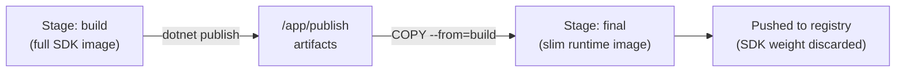

Anyone can write a Dockerfile that works. Interviewers care about whether you can write one that builds fast, produces a small image, doesn't leak secrets, and doesn't run as root — because that is the difference between a Dockerfile from a tutorial and one that survives a security review.

## Instruction reference

| Instruction | Purpose | Notes |
|---|---|---|
| `FROM` | Sets the base image | First instruction (or after `ARG` used in it); can appear multiple times for multi-stage builds |
| `RUN` | Executes a command, commits a new layer | Chain with `&&` to avoid extra layers |
| `COPY` | Copies files from build context into the image | Prefer over `ADD` — explicit and predictable |
| `ADD` | Like `COPY`, plus tar auto-extraction and remote URL fetch | Avoid unless you need those extras — surprising behaviour |
| `WORKDIR` | Sets the working directory for subsequent instructions | Creates the directory if missing; avoid `cd` in `RUN` |
| `ENV` | Sets an environment variable **baked into the image** | Persists at runtime; visible via `docker inspect` |
| `ARG` | Build-time-only variable | Not available at runtime; must be re-declared per stage |
| `EXPOSE` | Documents listening ports | Metadata only — does not publish the port |
| `ENTRYPOINT` | Fixed executable for the container | Use exec form `["..."]` so it's PID 1 |
| `CMD` | Default arguments, or default command if no `ENTRYPOINT` | Overridable at `docker run` |
| `USER` | Sets the user (and group) subsequent instructions/runtime run as | Use for non-root runtime |
| `HEALTHCHECK` | Defines a command Docker runs periodically to judge container health | Surfaces in `docker ps` as healthy/unhealthy |

> [!KEY]
> `COPY` vs `ADD`: always reach for `COPY` first. `ADD`'s "helpful" behaviour (auto-extracting tarballs, fetching URLs) is a source of surprises and has even been a vector for build-time supply-chain issues. Use `ADD` only for the one thing `COPY` truly cannot do.

### ENTRYPOINT vs CMD

```dockerfile
# ENTRYPOINT fixed, CMD supplies default args — overridable at `docker run image --port 9000`
ENTRYPOINT ["dotnet", "MyApp.dll"]
CMD ["--port", "8080"]
```

If only `CMD` is set, the whole thing is replaced by any arguments passed to `docker run`. If only `ENTRYPOINT` is set, arguments passed to `docker run` are appended to it. Using both gives you a fixed executable with an overridable default.

## Layer caching and instruction ordering

Docker caches each layer and reuses it if the instruction and its inputs are unchanged. **Order instructions from least to most frequently changing** so a source code edit doesn't invalidate the expensive dependency-install layer.

```dockerfile
# Bad: any source change invalidates the restore/install layer below it
COPY . .
RUN dotnet restore

# Good: restore only re-runs when the project file changes
COPY *.csproj .
RUN dotnet restore
COPY . .
RUN dotnet build
```

Say this in an interview: "I copy just the manifest files first (`package.json`, `*.csproj`, `requirements.txt`), install dependencies, then copy the rest of the source." That single sentence demonstrates you understand the cache mechanism, not just Dockerfile syntax.

## Multi-stage builds

A multi-stage build uses more than one `FROM` in a single Dockerfile. Earlier stages can hold the full SDK, compilers, and build tools; the final stage copies out only the compiled artifacts, so none of the build-time weight ships to production.



```dockerfile
# --- Stage 1: build ---
FROM mcr.microsoft.com/dotnet/sdk:8.0 AS build
WORKDIR /src
COPY *.csproj .
RUN dotnet restore
COPY . .
RUN dotnet publish -c Release -o /app/publish --no-restore

# --- Stage 2: runtime ---
FROM mcr.microsoft.com/dotnet/aspnet:8.0 AS final
WORKDIR /app
RUN adduser --disabled-password --gecos "" appuser
COPY --from=build /app/publish .
USER appuser
EXPOSE 8080
ENTRYPOINT ["dotnet", "MyApp.dll"]
```

The SDK image (~800 MB) never reaches the registry — only the ASP.NET runtime image (~220 MB) plus the published DLLs does. This pattern is the single biggest lever for shrinking image size and attack surface.

## Choosing a base image

| Base type | Approx. size | Compatibility | Trade-off |
|---|---|---|---|
| Full OS (`debian`, `ubuntu`) | 70–200+ MB | Highest — full package manager, glibc | Larger, more CVEs to patch |
| `-slim` variants | 30–80 MB | High — trimmed packages, still glibc/apt | Good default for most services |
| `alpine` | 5–8 MB base | Lower — uses musl libc, not glibc | Smallest, but native deps may misbehave |
| Distroless (Google) | 2–20 MB | Runtime-only, no shell, no package manager | No shell for `exec`/debugging, smallest attack surface |

> [!WARNING]
> Alpine's musl libc is not a drop-in replacement for glibc. .NET, in particular, historically had rough edges on Alpine (globalization, some native interop); test thoroughly before switching a glibc-targeted app to Alpine rather than assuming it "just works" because the tag exists.

Distroless and `scratch`-based images remove the shell entirely, which is great for security (no shell for an attacker to `exec` into) but means you lose `docker exec -it ... sh` for debugging — plan your observability (logs, metrics) accordingly before adopting them.

## Running as non-root

Most official images run as `root` by default, purely for convenience. In production this means a container compromise gives the attacker root inside the (already weaker) container boundary.

```dockerfile
RUN addgroup -S app && adduser -S app -G app
USER app
```

> [!DANGER]
> An image that never sets `USER` runs as root by default. Combine a non-root `USER`, a read-only root filesystem (`--read-only` at run time), and dropped Linux capabilities as your baseline hardening — not just one of them.

## .dockerignore

Anything not excluded from the build context is sent to the Docker daemon and is copy-able via `COPY . .` — including `.git`, local `node_modules`, secrets files, and build output.

```text
.git
bin/
obj/
node_modules/
*.env
**/*.user
appsettings.Development.json
```

A missing `.dockerignore` is one of the most common causes of slow builds (huge context upload) and accidental secret leakage into layers.

## Build args and secrets

`ARG` values are build-time only, but **anything written into a layer is permanently part of the image history** — even if a later layer deletes the file, the secret still exists in the earlier layer and can be extracted with `docker history` or by inspecting layer tarballs.

```dockerfile
# WRONG — the token ends up baked into a layer, extractable forever
ARG NPM_TOKEN
RUN echo "//registry.npmjs.org/:_authToken=${NPM_TOKEN}" > .npmrc && npm install

# RIGHT — BuildKit secret mount, never written to a layer
RUN --mount=type=secret,id=npmtoken \
    NPM_TOKEN=$(cat /run/secrets/npmtoken) npm install
```

```bash
DOCKER_BUILDKIT=1 docker build --secret id=npmtoken,src=./npm_token.txt -t myapp .
```

> [!DANGER]
> Never bake credentials into `ENV`, `ARG` defaults, or a `RUN` command's visible output — all of these persist in image layers or metadata and are trivially recoverable. Use BuildKit `--mount=type=secret`, or fetch secrets at container start time from a secret manager instead.

## Image scanning

Every base image and every installed package is a potential CVE. Scanning tools (`docker scout`, Trivy, Grype, Snyk) diff an image's installed packages against known-vulnerability databases as part of CI.

```bash
trivy image --severity HIGH,CRITICAL myapp:1.2.0
```

A senior answer names the trade-off: scanning gates the pipeline (fails builds on critical CVEs) but needs an allow-list process for false positives or CVEs with no available fix yet, or teams will route around it.

## Reproducible builds

A reproducible build produces byte-identical (or at least behaviourally identical) images from the same inputs, every time.

- Pin base image by digest, not just tag: `FROM node@sha256:...`.
- Pin dependency versions exactly (lockfiles: `package-lock.json`, `packages.lock.json`).
- Avoid instructions that hit the network for "whatever is newest" (`apt-get update` without pinned versions, `npm install` without a lockfile).
- Set `SOURCE_DATE_EPOCH` or equivalent if you need byte-identical layer timestamps.

Full bit-for-bit reproducibility is rarely achieved end-to-end (compilers and package managers embed timestamps), but "same inputs, same dependency versions, same behaviour" is the practical bar most teams target and is what interviewers are actually checking for.

## A complete annotated Dockerfile

```dockerfile
# syntax=docker/dockerfile:1
FROM mcr.microsoft.com/dotnet/sdk:8.0 AS build
WORKDIR /src

# Copy only the project file first so dependency restore is cached
# independently of source code changes.
COPY *.csproj .
RUN dotnet restore

COPY . .
RUN dotnet publish -c Release -o /app/publish --no-restore

FROM mcr.microsoft.com/dotnet/aspnet:8.0 AS final
WORKDIR /app

# Non-root user for the runtime stage.
RUN adduser --disabled-password --gecos "" appuser
COPY --from=build /app/publish .
USER appuser

EXPOSE 8080
HEALTHCHECK --interval=30s --timeout=3s CMD curl -f http://localhost:8080/health || exit 1
ENTRYPOINT ["dotnet", "MyApp.dll"]
```

## Cheat sheet

- Order Dockerfile instructions **least → most frequently changing** to maximise cache hits.
- Prefer `COPY` over `ADD`; only use `ADD` for its tar-extraction/URL behaviour intentionally.
- Multi-stage builds: full SDK in the build stage, only artifacts in the runtime stage.
- `ENV` persists into the running container; `ARG` is build-time only and per-stage.
- Never bake secrets into `ENV`/`ARG`/`RUN` output — use BuildKit `--mount=type=secret`.
- Always set a non-root `USER` in the final stage.
- `.dockerignore` keeps build context small and prevents accidental secret inclusion.
- Alpine ≠ free size win — musl libc can break native dependencies; test before adopting.
- Distroless/`scratch` removes the shell — plan debugging and observability differently.
- Scan images in CI (Trivy/Grype/Scout) and gate on high/critical severities.
- Pin base images by digest and dependencies by lockfile for reproducibility.

## Common mistakes

| Mistake | Fix |
|---|---|
| `COPY . .` before installing dependencies | Copy manifest files first, install, then copy source |
| Using `ADD` out of habit | Use `COPY` unless you need tar-extraction or URL fetch |
| Baking secrets into `ARG`/`ENV`/`RUN echo` | Use BuildKit secret mounts or fetch at runtime |
| No `.dockerignore` | Add one — smaller context, no leaked `.git`/`node_modules`/secrets |
| Shipping the SDK image to production | Multi-stage build, copy only published output |
| Never setting `USER` | Default is root — add a non-root user in the final stage |
| Trusting `alpine` blindly for compatibility | Test native dependencies; consider `-slim` instead |
| No image scanning in CI | Add Trivy/Grype/Scout as a pipeline gate |

## Summary

A production-grade Dockerfile is judged on four things: cache-friendly instruction ordering, a multi-stage build that ships only runtime artifacts, a non-root user with no baked-in secrets, and a base image chosen deliberately rather than by habit. Getting the caching order right makes CI builds fast; multi-stage builds and careful base-image choice make images small and patchable; secret mounts and scanning keep the supply chain honest. Once you can explain *why* each instruction is ordered and chosen the way it is, you've demonstrated the difference between copying a Dockerfile and engineering one.

## Top Interview Questions

### Q1. Why does instruction order matter in a Dockerfile, and how would you restructure a slow build?

Docker caches each layer keyed on the instruction and its inputs; if an earlier instruction's inputs change, every layer after it is rebuilt from scratch, cache or not. A common anti-pattern is `COPY . .` followed by `RUN npm install` (or `dotnet restore`) — because the entire source tree is copied first, any source file change invalidates the dependency-install layer too, forcing a full reinstall on every build. The fix is to copy only the dependency manifest (`package.json`/`package-lock.json`, `*.csproj`) first, run the install/restore step so it is cached independently, and only then copy the rest of the source code — turning a multi-minute reinstall on every commit into a cached no-op unless dependencies actually changed.

### Q2. What is a multi-stage build and what problem does it solve?

A multi-stage build declares more than one `FROM` in a single Dockerfile, where each `FROM` starts a new, independent build stage that can selectively copy artifacts from previous stages using `COPY --from=<stage>`. It solves the problem of build tooling bloating the runtime image: a compiled language needs a full SDK, compiler, and often dev dependencies to build, but none of that is needed to *run* the compiled output. By building in one stage (with the full SDK) and copying only the published binaries into a second, minimal runtime-only base image, you get a final image that is a fraction of the size and has a much smaller attack surface, without maintaining two separate Dockerfiles.

### Q3. What's the difference between `ENV` and `ARG`, and where do people get this wrong?

`ARG` defines a build-time-only variable, available while the image is being built (usable in `RUN`, other `ARG`/`FROM` lines) but not present in the running container unless explicitly copied into an `ENV`. `ENV` sets a variable that is baked into the image and persists into every container started from it, visible via `docker inspect` and inheritable by child processes at runtime. The common mistake is trying to pass a secret via `ARG` assuming it disappears after the build — it does not disappear from the image history or intermediate layers, only from the final container's environment, so it is still extractable by anyone with access to the image. Another common mistake is forgetting that `ARG` must be re-declared in each stage of a multi-stage build; it does not automatically carry over from one `FROM` to the next.

### Q4. How would you shrink an image that has grown to several hundred MB unnecessarily?

Start by running `docker history <image>` to see which layer is responsible for the bulk of the size, then check whether the image is a single-stage build carrying full build tooling — if so, convert it to a multi-stage build and copy out only the runtime artifacts. Next check the base image: swapping a full `ubuntu`/`debian` base for a `-slim` variant or a distroless/Alpine base (after verifying compatibility) can save tens to hundreds of MB. Also check for large layers from unnecessary cached package manager files (`apt-get clean`/`rm -rf /var/lib/apt/lists/*` in the same `RUN` as the install, so it doesn't persist in an earlier layer), and confirm `.dockerignore` isn't letting `node_modules`, `.git`, or build output leak into the context and get copied in.

### Q5. Why is baking a secret into an `ARG` or `RUN echo` command dangerous even if you delete the file afterward?

Every instruction that modifies the filesystem creates a new, immutable layer, and Docker images are the union of all their layers stacked together — deleting a file in a later layer does not remove it from the earlier layer where it was written; it only hides it from the final merged filesystem view. Anyone with the image (via `docker save`, a registry pull, or `docker history --no-trunc`) can extract the intermediate layer tarballs and recover the secret. The correct approach is BuildKit's `--mount=type=secret`, which mounts the secret into the build context for a single `RUN` step without ever writing it to a layer, or better, injecting secrets at container start time from a secret manager rather than baking them into the image at all.

### Q6. When would you choose Alpine vs a `-slim` variant vs distroless as a base image?

Alpine gives the smallest base size (a few MB) but uses musl libc instead of glibc, which can cause subtle incompatibilities with native dependencies, DNS resolution behaviour, or globalization/locale handling in some runtimes — it needs real compatibility testing, not just "it built successfully." A `-slim` variant (Debian-based, trimmed) keeps glibc and apt while dropping unnecessary packages, making it a safer default when you need broad compatibility with a meaningfully smaller size than the full image. Distroless removes the package manager and shell entirely, giving the smallest attack surface and no shell for an attacker (or you) to `exec` into — appropriate for mature services with solid external logging/metrics, less appropriate if your team still needs to `exec` in for debugging.

### Q7. Walk through what happens when you run `docker build` from the interviewer's perspective — what determines whether a layer is rebuilt?

The Docker daemon reads the Dockerfile top to bottom; for each instruction it computes a cache key from the instruction text and, for `COPY`/`ADD`, a hash of the referenced files' contents. If an equivalent layer already exists in the local cache with a matching key, it is reused verbatim and the instruction is skipped; if not, the instruction executes and produces a new layer, and — crucially — every instruction *after* that point is also rebuilt even if its own inputs haven't changed, because it now depends on a different parent layer. This cascading invalidation is exactly why ordering instructions from least-to-most-frequently-changing is the single highest-leverage optimization for build speed.

### Q8. What is the difference between `ENTRYPOINT` and `CMD`, and why would you use both together?

`ENTRYPOINT` defines the fixed executable that always runs when the container starts; `CMD` supplies default arguments to that executable (or, if `ENTRYPOINT` is unset, defines the default command entirely). Arguments passed to `docker run image arg1 arg2` replace `CMD` but are appended after `ENTRYPOINT`, so `ENTRYPOINT ["dotnet", "MyApp.dll"]` with `CMD ["--port", "8080"]` runs `dotnet MyApp.dll --port 8080` by default, but `docker run image --port 9000` overrides just the port. Using both gives you a container that behaves like a proper CLI tool — a fixed program with sensible, easily overridable defaults — rather than one where the entire command must be retyped to change a single flag.

### Q9. How would you add a health check to a Dockerfile, and what does it actually change at runtime?

`HEALTHCHECK CMD <command>` tells Docker to periodically run `<command>` inside the running container and interpret its exit code (0 = healthy, 1 = unhealthy) to set the container's health status, visible in `docker ps` as `(healthy)`/`(unhealthy)`. It does not restart the container by itself under plain Docker — that logic is left to whatever is orchestrating restarts (Compose's `restart` policies, or in Kubernetes, a separate `livenessProbe` construct entirely, since Kubernetes ignores the Dockerfile's `HEALTHCHECK`). A common production use is `CMD curl -f http://localhost:8080/health || exit 1` with tuned `--interval`, `--timeout`, `--retries` so transient blips don't flap the health status, paired with an orchestrator that actually acts on it.

### Q10. Your CI pipeline flags a Trivy scan failure on a critical CVE in a base image. What do you do?

First check whether the CVE is actually reachable/exploitable in this image's context — some scanners report CVEs in packages that are present but never invoked. If the CVE is real and a patched version of the base image or package exists, bump the base image tag (or run `apt-get upgrade` / equivalent for the specific package) and re-scan; this is the common case and should be the default fix. If no patch exists yet, the decision is whether to accept the risk with a documented, time-boxed suppression (most scanners support an ignore-list with a justification and expiry) or to switch base images entirely to avoid the vulnerable package. What you should not do is disable scanning to unblock the pipeline — that just defers the same decision to an unmonitored future incident.

### Q11. Why might `docker build` produce a different image today than it did last month even with an unchanged Dockerfile?

If the Dockerfile uses a floating base image tag (`FROM node:20` rather than a pinned patch version or digest), the underlying bytes for that tag can change whenever the maintainer pushes an update, silently altering your build's starting point. Similarly, `RUN apt-get install -y somepkg` without a pinned version installs whatever is currently in the package repository, and `npm install`/`pip install` without a committed lockfile resolves to whatever versions currently satisfy the ranges in `package.json`/`requirements.txt`. To make builds reproducible, pin the base image by digest, commit and use dependency lockfiles, and avoid any instruction that reaches out to "get the latest" without a pinned version.

### Q12. How do you handle configuration that differs between environments (dev, staging, prod) without baking it into the image?

Configuration should never be baked into the image via `ENV` defaults for environment-specific values (connection strings, feature flags, API endpoints) — that forces a rebuild per environment and risks leaking values meant for one environment into another. Instead, keep the image environment-agnostic and inject configuration at container start time: environment variables passed via `docker run -e` or the orchestrator's env/configMap mechanism, mounted config files (`-v config.json:/app/config.json`), or a runtime fetch from a config service/secret manager on startup. This means the exact same image artifact is promoted unchanged from dev through staging to production, which is also what makes a deployment reproducible and auditable — you know the code didn't change between environments, only its configuration.
