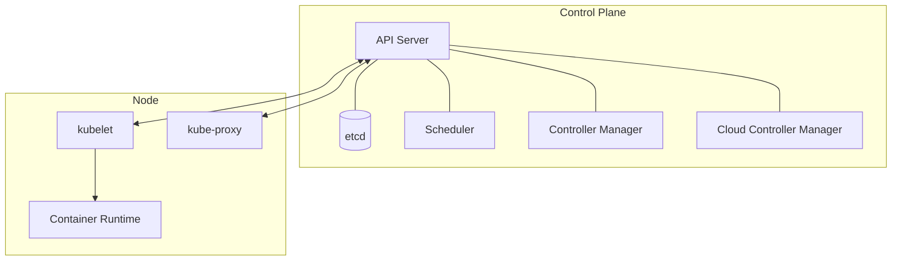
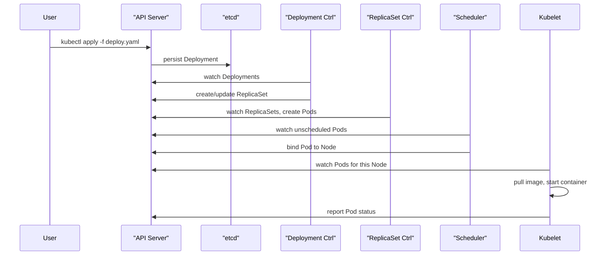

Kubernetes interviews rarely test whether you can recite object names — they test whether you understand the **reconciliation loop**, because that single idea explains why a Deployment self-heals, why `kubectl apply` is safe to re-run, and why a misbehaving controller can quietly fight your changes forever.

## Control plane vs node components

The control plane makes cluster-wide decisions; nodes run the actual workloads.



| Component | Location | Responsibility |
|---|---|---|
| API server | Control plane | Front door — validates and persists all requests, the only component that talks to etcd directly |
| etcd | Control plane | Distributed, consistent key-value store — the single source of truth for cluster state |
| Scheduler | Control plane | Watches for unbound Pods, decides which node they should run on |
| Controller manager | Control plane | Runs core reconciliation loops (Deployment, ReplicaSet, Node, etc.) |
| Cloud controller manager | Control plane | Talks to the cloud provider API (load balancers, volumes, node lifecycle) |
| kubelet | Node | Agent that ensures containers described in assigned Pod specs are actually running |
| kube-proxy | Node | Programs iptables/IPVS rules implementing Service virtual IPs |
| Container runtime | Node | Actually pulls images and runs containers (containerd, CRI-O) via the CRI |

> [!KEY]
> The API server is the **only** component allowed to read or write etcd directly. Every other component — scheduler, controllers, kubelet — interacts with cluster state exclusively through the API server's watch/list/update API. This is why the API server is the single point of truth for "is the cluster healthy right now."

## The declarative model and reconciliation loops

Kubernetes is built around a single repeating pattern: **desired state** (what you declared in YAML) vs **observed state** (what's actually running), continuously reconciled by controllers.

```
loop forever:
    desired  := read spec from etcd (via API server)
    observed := read current status (via API server)
    if desired != observed:
        take action to move observed towards desired
    sleep / wait for next watch event
```

Every controller — Deployment, ReplicaSet, Node, Job — runs this exact loop independently, watching only the object types it cares about. This is why Kubernetes is self-healing: if a Pod is deleted out-of-band, the ReplicaSet controller's next reconciliation notices `observed replicas < desired replicas` and creates a new one, with no human or external trigger required.

A senior answer to "how does Kubernetes self-heal" is not "it just does" — it's "every controller runs a reconcile loop comparing desired vs observed state in etcd, and converges the cluster towards the desired state on every watch event or resync period." That is the actual mechanism, not a black box.

## What happens when you `kubectl apply` a Deployment

This is one of the most common Kubernetes interview questions — walk through it step by step:

1. `kubectl` reads the YAML, converts it to JSON, and sends an HTTP request to the **API server** (authenticated via your kubeconfig credentials).
2. The API server runs **authentication**, then **authorization** (RBAC — does this identity have permission to create/update Deployments in this namespace), then **admission control** (mutating webhooks may inject defaults/sidecars, validating webhooks may reject the object).
3. The API server **persists** the Deployment object to **etcd** and returns success to `kubectl` — nothing has actually been scheduled yet.
4. The **Deployment controller** (in controller manager), watching for Deployment changes, notices the new/changed object and creates or updates a **ReplicaSet** with the desired replica count and pod template.
5. The **ReplicaSet controller** notices its actual Pod count is below desired, and creates the missing **Pod objects** in etcd (again via the API server) — still unscheduled, with no `nodeName` set.
6. The **scheduler** watches for Pods with no assigned node, runs its filtering (does the node have enough resources, taints/tolerations, affinity) and scoring algorithm, and writes the chosen `nodeName` back onto the Pod via the API server.
7. The **kubelet** on that node, watching for Pods assigned to it, sees the new Pod and instructs the **container runtime** (via the CRI) to pull the image and start the containers.
8. The kubelet continuously reports Pod status (Running, container restarts, readiness) back to the API server, which updates the Deployment/ReplicaSet status fields — closing the loop that lets `kubectl get deployment` show live progress.



> [!WARNING]
> Nothing in this chain happens synchronously from `kubectl`'s point of view — `kubectl apply` returning success only means the object was **persisted**, not that it is **running**. Candidates who say "apply creates the pods" are missing the Deployment → ReplicaSet → Pod → scheduler → kubelet chain, which is exactly what this question is testing.

## Objects and controllers

An **object** is a persisted record of desired state (a Deployment, Service, ConfigMap). A **controller** is the active process that watches a specific object type and drives reality towards it. Almost every built-in Kubernetes behaviour is "an object plus a controller that reconciles it" — there is no separate special-cased logic for Deployments vs Jobs vs Services; they all follow the same watch-reconcile pattern.

| You write | A controller reconciles it into |
|---|---|
| Deployment | ReplicaSets (which reconcile into Pods) |
| Service | Endpoints/EndpointSlices (which kube-proxy reconciles into iptables/IPVS rules) |
| PersistentVolumeClaim | A bound PersistentVolume (via a provisioner controller) |
| Job | Pods run to completion, tracked until success count is met |

## Namespaces

Namespaces are a **logical partition** within a single cluster — not a security or resource boundary by themselves. They scope names (two Pods can both be called `api` in different namespaces) and are the attachment point for RBAC rules and ResourceQuotas, but nodes, PersistentVolumes, and the network itself are cluster-wide by default and cross namespace boundaries unless a NetworkPolicy restricts it.

| Namespace feature | Scoped? | Notes |
|---|---|---|
| Object names | ✅ Per-namespace | Same name allowed in different namespaces |
| RBAC Role bindings | ✅ Per-namespace | ClusterRole/ClusterRoleBinding are cluster-wide |
| ResourceQuota | ✅ Per-namespace | Caps aggregate CPU/memory/object counts |
| Network reachability | ❌ Cluster-wide by default | Needs a NetworkPolicy to restrict |
| Nodes, PVs, StorageClasses | ❌ Cluster-scoped objects | Not namespaced at all |

## Labels and selectors: the glue

Kubernetes has almost no built-in "parent-child" object references — instead, controllers find the objects they manage by matching **labels** via a **selector**. This loose coupling is deliberate: it's what lets a Service route to Pods created by a totally different controller, or a NetworkPolicy apply to Pods across multiple Deployments.

```yaml
# Deployment's selector must match its own Pod template's labels
apiVersion: apps/v1
kind: Deployment
metadata:
  name: web
spec:
  selector:
    matchLabels:
      app: web
  template:
    metadata:
      labels:
        app: web
    spec:
      containers:
        - name: web
          image: myweb:1.0
```

> [!DANGER]
> A Deployment's `spec.selector` is **immutable after creation** and must match `spec.template.metadata.labels`. A mismatched or overly broad selector (e.g. matching `app: web` when another Deployment's Pods also carry that label) causes two Deployments to fight over the same Pods — a real, painful production incident, not a hypothetical.

## The API and CRDs/operators

Every object type — built-in or custom — is served the same way: as a resource under a versioned API group (`apps/v1`, `batch/v1`). A **CustomResourceDefinition (CRD)** registers a new object type with the API server, letting `kubectl` and clients treat it exactly like a built-in object (validated, stored in etcd, watchable). An **operator** is a custom controller you deploy that reconciles that custom object type — the same watch/reconcile pattern as every built-in controller, just for domain-specific state (e.g. a `PostgresCluster` CRD reconciled by an operator that manages primary/replica Postgres Pods, failover, and backups).

> [!NOTE]
> The operator pattern is popular precisely because it requires no new mechanism — you're reusing the exact same reconciliation model the entire platform is built on, just pointed at a domain-specific object type.

## Cheat sheet

- API server is the **only** component that talks to etcd directly; everything else goes through it.
- etcd is the single source of truth; losing etcd without a backup means losing the cluster's state.
- Every controller runs the same loop: **watch → compare desired vs observed → act → repeat**.
- `kubectl apply` returning success means "persisted to etcd", not "running" — scheduling and kubelet action happen afterward, asynchronously.
- Deployment → ReplicaSet → Pod is a chain of controllers, each reconciling the layer below it.
- The scheduler only assigns `nodeName`; it never itself starts a container — that's the kubelet's job.
- Namespaces scope names and RBAC/quota, but not network reachability or cluster-scoped objects (nodes, PVs).
- Labels + selectors are the loose-coupling mechanism connecting almost every pair of related objects.
- CRDs extend the API; operators are just controllers reconciling those custom objects the normal way.

## Common mistakes

| Mistake | Fix |
|---|---|
| Saying "kubectl apply creates the pods" | It persists the Deployment; the Deployment/ReplicaSet controllers and scheduler create and place Pods afterward |
| Believing namespaces isolate network traffic | Add a NetworkPolicy — namespaces don't restrict reachability by default |
| Assuming the scheduler starts containers | The scheduler only assigns a node; the kubelet on that node starts the container |
| Editing a Deployment's `selector` after creation | It's immutable — plan labels carefully up front |
| Treating etcd as just "a database" | It's the cluster's single source of truth — its availability and backups are critical |
| Forgetting controllers reconcile continuously | Manual out-of-band changes (deleting a Pod, editing a live object) get overwritten on the next reconcile |

## Summary

Kubernetes architecture is best understood as one mechanism applied repeatedly: an API server that is the sole gateway to etcd, and a set of independent controllers that each watch specific object types and drive observed state towards desired state. Walking through what actually happens on `kubectl apply` — persist, then Deployment controller, then ReplicaSet controller, then scheduler, then kubelet, then runtime — demonstrates this mechanism concretely and is one of the most reliable ways to show real Kubernetes depth in an interview. Namespaces, labels/selectors, and CRDs are all built on top of that same loop, which is why learning the reconciliation model pays off across the entire platform rather than being topic-specific trivia.

## Top Interview Questions

### Q1. Walk me through exactly what happens when you run `kubectl apply -f deployment.yaml`.

`kubectl` converts the YAML to a request against the API server, which authenticates and authorizes it via RBAC, runs it through admission control (mutating/validating webhooks), and persists the Deployment object to etcd — at this point the request returns successfully, but nothing is running yet. The Deployment controller, watching for such changes, creates or updates a ReplicaSet with the desired replica count; the ReplicaSet controller then creates the actual Pod objects in etcd, still unscheduled. The scheduler watches for Pods with no assigned node, runs filtering and scoring to pick one, and writes the node assignment back through the API server. Finally, the kubelet on that node notices the Pod assigned to it and instructs the container runtime to pull the image and start the containers, continuously reporting status back up the same chain.

### Q2. What is the only component that talks directly to etcd, and why does that matter?

The API server is the only component with direct read/write access to etcd; every other component — scheduler, controller manager, kubelet, kube-proxy, and any client like `kubectl` — interacts with cluster state exclusively through the API server's REST/watch interface. This matters because it centralizes authentication, authorization, admission control, and validation in one place: no component can bypass RBAC or webhooks by talking to etcd directly, and etcd's data format and consistency guarantees are an internal implementation detail the rest of the system never needs to know about. It also means the API server's availability is a hard dependency for the entire control plane — if it's down, nothing can read or change cluster state even if etcd itself is healthy.

### Q3. Explain the reconciliation loop and why it makes Kubernetes self-healing.

Every controller runs the same pattern: read the desired state of the objects it manages (from etcd, via the API server), compare it to the observed/actual state, and if they differ, take action to move the observed state towards the desired one — then repeat, either on a resync interval or triggered by a watch event. This is why deleting a Pod managed by a ReplicaSet doesn't "stay deleted" — the ReplicaSet controller's next reconciliation notices the actual replica count is below the desired count and creates a replacement, with no external trigger needed. The self-healing property isn't a special feature bolted onto Kubernetes; it's an emergent property of every object type being managed by this same continuously-running comparison loop.

### Q4. What's the difference between the roles of the scheduler and the kubelet?

The scheduler's job ends the moment it writes a `nodeName` onto a Pod object — it decides *where* a Pod should run by filtering nodes (enough CPU/memory, satisfies taints/tolerations and affinity rules) and scoring the remaining candidates, but it never itself creates a container or talks to a container runtime. The kubelet runs on every node and is responsible for actually making Pods assigned to its node exist as real, running containers — it watches for Pods bound to its node, instructs the local container runtime (via the CRI) to pull images and start containers, and continuously reports the Pod's actual status back to the API server. A useful way to phrase it: the scheduler decides, the kubelet executes and reports.

### Q5. Are Kubernetes namespaces a security boundary? What do they actually isolate?

Not by default. Namespaces are primarily a naming and organizational scope: they let two objects share the same name in different namespaces, and they're the attachment point for RBAC RoleBindings and ResourceQuotas, letting you apply different permissions or resource caps per team or environment within one cluster. But network traffic between Pods in different namespaces is allowed by default — nothing stops a Pod in namespace `dev` from making a request to a Pod in namespace `prod` unless a NetworkPolicy explicitly restricts it — and cluster-scoped objects like Nodes, PersistentVolumes, and StorageClasses aren't namespaced at all, so they aren't isolated by namespace boundaries in any sense. True isolation requires layering NetworkPolicies, RBAC, and potentially separate clusters on top of namespaces, not relying on namespaces alone.

### Q6. How do a Deployment, a ReplicaSet, and a Pod relate to each other, and why does Kubernetes use three layers instead of one?

A Deployment describes the desired rollout state (image version, replica count, update strategy) and is reconciled by the Deployment controller into one or more ReplicaSets — one ReplicaSet per distinct Pod template version. Each ReplicaSet is reconciled by its own controller into the actual number of Pods matching its selector. The layering exists specifically to support rolling updates and rollback: when you change a Deployment's image, it creates a *new* ReplicaSet at the new version and scales it up while scaling the old ReplicaSet down, so the old ReplicaSet (and its Pod template) still exists and can be scaled back up instantly for a rollback, without Kubernetes needing to "remember" the previous state some other way.

### Q7. What are labels and selectors, and why does Kubernetes rely on them instead of direct object references?

Labels are arbitrary key-value metadata attached to objects (like `app: web`, `tier: backend`); selectors are queries (`matchLabels`, `matchExpressions`) that other objects use to find the set of objects they care about, rather than referencing them by name or ID directly. Kubernetes uses this loose-coupling mechanism because it lets relationships be redefined dynamically and lets one object (a Service, a NetworkPolicy) apply to Pods owned by entirely different controllers without either side needing to know about the other's existence at creation time. The trade-off is that selector mistakes are silent and dangerous: an overly broad or duplicated selector across two Deployments causes both to "own" and fight over the same Pods, since neither validates against the other.

### Q8. What is a CustomResourceDefinition (CRD) and how does an operator use it?

A CRD registers a new object type with the Kubernetes API server, so instances of that type get full first-class treatment — schema validation, storage in etcd, `kubectl get/describe` support, and a watchable API — exactly like built-in types such as Deployment or Service. An operator is simply a custom controller, deployed as a regular workload in the cluster, that watches instances of that CRD and runs the same reconcile-loop pattern every built-in controller uses, but implementing domain-specific logic (for example, a `PostgresCluster` CRD reconciled by an operator that provisions primary/replica Pods, handles failover, and manages backups). The key interview point is that CRDs/operators don't introduce a new mechanism — they reuse the existing declarative, watch-and-reconcile model the whole platform already runs on.

### Q9. Your Deployment shows "2/3 replicas ready" and stays that way. How would you debug it, tracing through the architecture?

Start at the top of the chain: check the Deployment's ReplicaSet (`kubectl get rs`) to confirm it also shows 2/3, ruling out a Deployment-vs-ReplicaSet mismatch. Then check Pods (`kubectl get pods -o wide`) for the missing one — if it's stuck `Pending`, that points to the scheduler being unable to place it (`kubectl describe pod` shows scheduling failure reasons like insufficient resources or unsatisfied node affinity/taints). If it's scheduled but not `Running` or not `Ready`, the problem has moved to the kubelet/container runtime on that node — check `kubectl describe pod` events for image pull failures, and check container logs and the readiness probe configuration, since a container can be "Running" but still fail readiness and never count towards the ready replica total. This traces the exact same chain as `kubectl apply`, just diagnosing where it stalled.

### Q10. Why is admission control (mutating and validating webhooks) part of the request path, and what's a real use for each?

Admission control runs inside the API server's request handling, after authentication and authorization but before the object is persisted to etcd, giving cluster operators a programmable point to intercept and modify or reject requests based on custom policy. A mutating admission webhook can inject defaults or side effects transparently — for example, automatically injecting a sidecar container (a service mesh proxy) into every Pod spec in a namespace without every team needing to add it manually. A validating admission webhook enforces policy that RBAC can't express — for example, rejecting any Deployment that doesn't set resource requests/limits, or blocking images from untrusted registries. Both run synchronously in the request path, so a slow or unavailable webhook can block all API requests it's configured to intercept — a real operational risk worth naming.

### Q11. What's the difference between the controller manager and the cloud controller manager?

The (core) controller manager runs the built-in reconciliation loops that are cloud-agnostic — Deployment, ReplicaSet, Node lifecycle, Job, and others — logic that's identical whether the cluster runs on bare metal, AWS, or a laptop. The cloud controller manager is a separate component specifically responsible for integrating with a cloud provider's API: provisioning a cloud load balancer when a `LoadBalancer`-type Service is created, attaching cloud block storage volumes for PersistentVolumeClaims, and updating Node objects with cloud-specific metadata (instance type, availability zone) or removing them when the underlying cloud instance is terminated. Splitting these out lets the core Kubernetes codebase stay cloud-agnostic while cloud providers maintain their own integration code independently, which is also why running Kubernetes on bare metal means some of these cloud-specific behaviors (like automatic LoadBalancer provisioning) simply don't exist unless you install an equivalent (e.g. MetalLB).

### Q12. If etcd becomes unavailable, what actually breaks in the cluster, and what keeps working?

Since the API server can't read or write cluster state without etcd, any operation that needs the current source of truth — `kubectl get/apply/delete`, new scheduling decisions, controllers reconciling changes — fails or stalls, and the control plane is effectively unable to make or record any new decisions. However, already-running workloads keep running: kubelets that already have their assigned Pod specs continue running and restarting containers locally based on their last-known state, and kube-proxy's already-programmed iptables/IPVS rules keep routing Service traffic, because neither depends on a live connection to etcd for data-plane traffic — only for control-plane changes. This split between control plane (needs etcd) and data plane (keeps running independently) is why a short etcd outage is serious but not usually catastrophic for already-running production traffic, and why etcd backups and quorum (odd number of members, typically 3 or 5) are treated as critical operational concerns.
