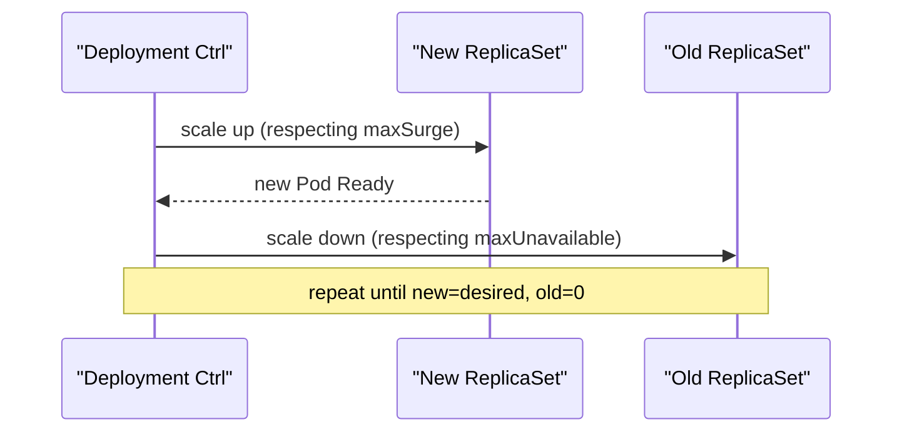

Workload questions test whether you know *which* controller fits a given shape of problem and *how* Kubernetes actually rolls out and schedules Pods — not just whether you can name Deployment, StatefulSet, and DaemonSet. The mechanics of rolling updates and scheduling are where most real interview depth lives.

## The Pod: the unit of scheduling

A Pod is the smallest deployable unit in Kubernetes — never a single container. It groups one or more containers that are always scheduled together on the same node, share a network namespace (same IP, can reach each other via `localhost`), and can share volumes.

- **Init containers** run to completion, in order, before any main container starts — used for setup work (waiting for a dependency, running a migration, populating a shared volume).
- **Sidecar containers** run alongside the main container for the Pod's whole lifetime — a log shipper, a service mesh proxy, a config reloader.

```yaml
apiVersion: v1
kind: Pod
metadata:
  name: app-with-sidecar
spec:
  initContainers:
    - name: wait-for-db
      image: busybox
      command: ["sh", "-c", "until nc -z db 5432; do sleep 1; done"]
  containers:
    - name: app
      image: myapp:1.0
    - name: log-shipper
      image: fluent-bit
```

> [!KEY]
> You never schedule a container directly — you always schedule a Pod. Multi-container Pods exist specifically for containers that must share a lifecycle, network namespace, and node — if two components scale independently or fail independently, they belong in separate Pods (and usually separate Deployments), not the same Pod.

## Workload controllers compared

| Controller | Identity per replica | Ordering | Use case |
|---|---|---|---|
| Deployment | Interchangeable (no stable identity) | No ordering guarantees | Stateless services, web APIs |
| StatefulSet | Stable, ordinal identity (`pod-0`, `pod-1`) + stable storage | Ordered create/scale/delete | Databases, anything needing stable network identity or per-replica storage |
| DaemonSet | One Pod per (matching) node | N/A | Node-level agents — log collectors, monitoring agents, CNI plugins |
| Job | Runs to completion | Optional parallelism/completions count | Batch/one-off tasks |
| CronJob | Job run on a schedule | Cron schedule | Scheduled batch tasks (nightly reports, cleanup) |

The fast way to pick: "does each replica need a stable name and its own persistent storage that follows it across rescheduling?" — yes means StatefulSet, no means Deployment. "Does this need to run on every node?" — DaemonSet. "Does this need to run once (or on a schedule) and finish?" — Job/CronJob.

## ReplicaSets and how a Deployment manages them

A Deployment never manages Pods directly — it manages ReplicaSets, and each ReplicaSet manages Pods via a label selector. When you update a Deployment's Pod template (say, a new image), the Deployment controller creates a **new** ReplicaSet at the new version rather than mutating the existing one, then orchestrates scaling the new ReplicaSet up and the old one down according to the update strategy. The old ReplicaSet is kept around (scaled to zero) specifically so a rollback can scale it back up instantly instead of rebuilding it.

```bash
kubectl rollout history deployment/web        # see revision history (backed by old ReplicaSets)
kubectl rollout undo deployment/web           # scale the previous ReplicaSet back up
kubectl rollout status deployment/web         # watch a rollout to completion
```

## Rolling update mechanics

```yaml
spec:
  strategy:
    type: RollingUpdate
    rollingUpdate:
      maxSurge: 1        # extra Pods allowed above desired count during rollout
      maxUnavailable: 0  # Pods allowed to be unavailable during rollout
```

- **`maxSurge`** caps how many *extra* Pods beyond the desired replica count can exist during the rollout — higher values mean faster rollouts but more resource usage.
- **`maxUnavailable`** caps how many Pods can be *unavailable* (not Ready) at once during the rollout — `0` guarantees full capacity throughout, at the cost of a slower rollout (since surge must fully come up before old Pods are torn down).



> [!WARNING]
> Rolling updates only look at **readiness**, not application-level correctness. A new version that starts, passes its readiness probe, but has a subtle bug will roll out fully and the *old*, working ReplicaSet gets scaled to zero — nothing about the default rolling update mechanism detects a "bad" release by itself. That's what canary/blue-green strategies and automated rollback on metrics (e.g. via a service mesh or Argo Rollouts) are for.

`kubectl rollout undo` works because the old ReplicaSet's Pod template is still stored, unscaled, in etcd — rollback is just "scale the old ReplicaSet back up, scale the current one down," the same rolling mechanics run in reverse.

## Pod lifecycle and phases

| Phase | Meaning |
|---|---|
| `Pending` | Accepted by the API server, not yet fully scheduled or images not yet pulled |
| `Running` | Bound to a node, at least one container running |
| `Succeeded` | All containers terminated successfully (0 exit code) — Job Pods |
| `Failed` | At least one container terminated with a non-zero exit code and was not restarted |
| `Unknown` | Node unreachable — kubelet hasn't reported status (not a real "state", a blind spot) |

Within `Running`, container-level `Ready` conditions (driven by readiness probes) determine whether the Pod is actually added to Service endpoints — a Pod can be `Running` and still not `Ready`.

## Scheduling: how the scheduler decides

| Mechanism | Purpose | Example |
|---|---|---|
| Requests & limits | Guarantee/cap CPU and memory per container | `requests.cpu: 250m`, `limits.memory: 512Mi` |
| Node selector | Simple node label match | `nodeSelector: {disktype: ssd}` |
| Node affinity | Richer node-matching rules, required or preferred | Prefer nodes in a specific zone |
| Pod affinity/anti-affinity | Co-locate or spread Pods relative to other Pods | Spread replicas across zones for availability |
| Taints & tolerations | Node **repels** Pods unless they explicitly tolerate the taint | Dedicate GPU nodes to GPU workloads only |
| Topology spread constraints | Even distribution across a topology domain | Spread Pods evenly across zones/nodes |

```yaml
resources:
  requests:
    cpu: "250m"
    memory: "256Mi"
  limits:
    cpu: "500m"
    memory: "512Mi"
affinity:
  podAntiAffinity:
    requiredDuringSchedulingIgnoredDuringExecution:
      - labelSelector:
          matchLabels:
            app: web
        topologyKey: "kubernetes.io/hostname"
tolerations:
  - key: "dedicated"
    operator: "Equal"
    value: "gpu"
    effect: "NoSchedule"
```

`requests` are what the scheduler uses to decide if a node has room (sum of requests on a node must not exceed its allocatable capacity); `limits` are enforced by the kubelet/cgroups at runtime — a container hitting its memory limit is OOM-killed, hitting its CPU limit is throttled, not killed.

> [!DANGER]
> Taints repel; tolerations only *permit* — a toleration does not attract a Pod to a tainted node, it merely allows scheduling there if other criteria (affinity, resources) also select it. Confusing tolerations with affinity is a very common mistake: to actually *prefer* the tainted nodes, you need affinity/node selector too, not just a toleration.

## QoS classes and eviction order

Kubernetes derives a Quality of Service class from requests/limits, which determines eviction priority when a node runs low on resources.

| QoS class | Condition | Eviction priority |
|---|---|---|
| `Guaranteed` | All containers specify equal CPU and memory request/limit values | Evicted last |
| `Burstable` | Some CPU or memory request/limit exists, but the Guaranteed rules are not met | Evicted before Guaranteed |
| `BestEffort` | No CPU or memory requests or limits set on any container | Evicted first |

> [!TIP]
> Saying "I'd set requests equal to limits for latency-sensitive workloads to get Guaranteed QoS" is a concrete, senior-sounding answer to "how do you protect a critical workload from eviction under node pressure."

## Priority and preemption

A `PriorityClass` gives Pods a numeric priority. When a higher-priority Pod can't be scheduled due to insufficient resources, the scheduler may **preempt** (evict) lower-priority Pods on a node to make room, provided doing so would actually let the higher-priority Pod fit. This is separate from QoS — QoS governs eviction under *resource pressure on a running node*; priority/preemption governs *scheduling-time* decisions when a node lacks room to place a pending Pod at all.

## Cheat sheet

- Pods are the scheduling unit — never schedule a container directly.
- Init containers run to completion before the app starts; sidecars run alongside it for the Pod's life.
- Deployment (stateless) vs StatefulSet (stable identity/storage) vs DaemonSet (per-node) vs Job/CronJob (run-to-completion) — pick by identity and lifecycle needs, not familiarity.
- A Deployment update creates a **new** ReplicaSet; the old one is kept, scaled to zero, enabling instant rollback.
- `maxSurge` controls extra capacity during rollout; `maxUnavailable` controls how much capacity can dip — both are about **speed vs safety**, not correctness.
- Rolling updates check readiness, not correctness — a "successfully started but broken" release will roll out fully.
- `requests` drive scheduling placement; `limits` are enforced at runtime (OOM kill for memory, throttling for CPU).
- Taints repel, tolerations merely permit — they don't attract. Use affinity to actually prefer a node.
- QoS class (`Guaranteed` > `Burstable` > `BestEffort`) determines eviction order under node resource pressure.
- Priority/preemption is a scheduling-time decision, distinct from QoS's runtime eviction behaviour.

## Common mistakes

| Mistake | Fix |
|---|---|
| Putting independently-scaling components in one Pod | Use separate Pods/Deployments; share a Pod only for truly coupled lifecycle |
| Choosing Deployment for a database | Use StatefulSet for stable identity and per-replica storage |
| Assuming a toleration schedules a Pod onto tainted nodes preferentially | Add affinity/node selector too — toleration only permits, doesn't attract |
| Setting `maxUnavailable: 0` and `maxSurge: 0` simultaneously | At least one must allow movement, or the rollout cannot proceed at all |
| Leaving requests/limits unset | Results in `BestEffort` QoS — first to be evicted under pressure |
| Assuming a successful rollout means the new version is correct | Add canary analysis / automated rollback on metrics, not just readiness |
| Confusing `Running` phase with `Ready` condition | A Pod can be Running but not Ready and won't receive Service traffic |

## Summary

Kubernetes workload questions reward knowing the mechanics, not just the vocabulary: a Deployment manages ReplicaSets which manage Pods, rolling updates are governed by `maxSurge`/`maxUnavailable` trading rollout speed for safety, and readiness — not correctness — is what gates traffic during a rollout. Scheduling decisions are driven by requests (placement) and limits (runtime enforcement), with taints/tolerations, affinity, and topology spread refining *where*, while QoS class and priority/preemption separately govern *what gets evicted or preempted* under pressure. Once you can explain why StatefulSet exists (stable identity and storage) instead of just naming it, you've demonstrated the depth these questions are actually probing for.

## Top Interview Questions

### Q1. Why does Kubernetes schedule Pods instead of individual containers?

A Pod groups one or more containers that need to share a lifecycle, a network namespace (same IP and port space, reachable via `localhost` between containers), and optionally storage volumes — properties that only make sense for tightly coupled processes, like an application and a sidecar that must always co-locate and start/stop together. Scheduling at the container level would lose this guarantee: there would be no atomic unit to ensure a log shipper and its application land on the same node with a shared filesystem. If two components scale independently, have different resource profiles, or can fail independently without affecting each other, that's a signal they belong in separate Pods rather than being crammed into one — multi-container Pods are for genuinely coupled lifecycles, not general "things that work together."

### Q2. When would you use a StatefulSet instead of a Deployment?

Use a StatefulSet when replicas need a stable, predictable identity that survives rescheduling — a stable network hostname (`pod-0`, `pod-1`, ...) and, typically, a dedicated PersistentVolumeClaim that follows that specific ordinal even if the Pod is rescheduled to a different node. This matters for stateful systems like databases or distributed consensus stores where replicas have specific roles (primary/replica, leader/follower) tied to identity, and where losing that identity on restart would break clustering logic or require expensive re-synchronization. A Deployment's Pods are interchangeable by design — any replica can be replaced by any other with no assumption about identity — which is exactly wrong for a workload where "which specific replica this is" matters.

### Q3. What actually happens inside Kubernetes when you change the image in a Deployment's Pod template?

The Deployment controller detects the template change and creates a **new** ReplicaSet with the updated Pod template and a replica count starting at zero, rather than modifying the existing ReplicaSet in place. It then drives the rollout according to the `RollingUpdate` strategy: scaling the new ReplicaSet up (bounded by `maxSurge` above the desired total) and the old ReplicaSet down (bounded by `maxUnavailable` below the desired total), waiting for new Pods to become Ready between steps, until the new ReplicaSet reaches full desired count and the old one reaches zero. Crucially, the old ReplicaSet is not deleted — it's kept at zero replicas so that `kubectl rollout undo` can scale it back up immediately as a rollback, without needing to recreate anything from scratch.

### Q4. Explain `maxSurge` and `maxUnavailable` and how you'd tune them for a latency-critical service versus a batch-tolerant one.

`maxSurge` bounds how many Pods beyond the desired replica count can exist simultaneously during a rollout (extra capacity, faster rollout, more resource usage); `maxUnavailable` bounds how many Pods can be below Ready/unavailable at once (less capacity dip, slower rollout since it must wait for surge Pods to be Ready before removing old ones). For a latency-critical, capacity-sensitive service, you'd set `maxUnavailable: 0` to guarantee full serving capacity throughout the rollout, accepting a slightly slower rollout and needing spare cluster capacity for the surge. For a workload that tolerates brief capacity dips and wants the fastest possible rollout with minimal extra resource usage, you might set `maxSurge: 0, maxUnavailable: 1` (or a percentage), trading some availability for lower peak resource usage during deploys.

### Q5. A rolling update completed successfully but the new version is actually broken (returning errors). Why didn't Kubernetes catch this, and how would you prevent it next time?

The rolling update mechanism only gates on the Pod's **readiness probe** passing — if the new version starts and its readiness endpoint returns healthy (which it can, even if business logic elsewhere is broken), Kubernetes considers the rollout successful and proceeds to scale down the old, working ReplicaSet, with no built-in concept of "correctness" beyond that probe. To prevent this, you need something beyond plain rolling updates: a readiness probe that actually exercises meaningful application logic (not just "process is up"), a canary or blue-green deployment strategy that shifts a small percentage of real traffic first and monitors error rates/latency before continuing, and/or a progressive delivery tool (Argo Rollouts, Flagger) that automates rollback based on live metrics rather than relying on a human noticing.

### Q6. What's the difference between a Pod's `requests` and `limits`, and what happens when each is exceeded?

`requests` are what the scheduler uses at placement time — it only schedules a Pod onto a node if the sum of all requests (existing plus this Pod's) doesn't exceed that node's allocatable capacity, making requests a *reservation* guarantee, not an enforced ceiling by themselves. `limits` are enforced at runtime by the kubelet and the underlying cgroups: exceeding a memory limit gets the container OOM-killed (and typically restarted, if within the Pod's restart policy), while exceeding a CPU limit results in throttling — the container is not killed, just given less CPU time, since CPU is a compressible resource and memory is not. A container can run above its requests happily as long as the node has spare capacity — requests are a floor for guaranteed placement, limits are a ceiling for guaranteed control.

### Q7. What's the difference between a taint/toleration and node affinity, and why do people mix them up?

A taint is applied to a **node** and repels Pods by default — a Pod can only be scheduled there if it carries a matching toleration, but a toleration only grants *permission*, it does not make the scheduler prefer or attract the Pod to that node over any other eligible one. Node affinity is applied to the **Pod** and actively expresses a preference or requirement about which nodes to schedule onto, based on node labels — it can express "must" (`requiredDuringScheduling`) or "should if possible" (`preferredDuringScheduling`) constraints. People mix them up because both involve node labels and both affect scheduling outcomes, but the correct mental model is: taints/tolerations are for *exclusion* (reserving nodes for specific workloads, like GPU nodes), while affinity is for *inclusion/preference* — to dedicate a node exclusively to certain Pods, you typically need both a taint (keep others out) and matching affinity or a node selector (actually place the intended Pods there).

### Q8. How do QoS classes affect what gets evicted when a node runs out of memory?

Kubernetes assigns each Pod a QoS class derived automatically from its requests/limits: `Guaranteed` if every container has requests equal to limits for both CPU and memory, `BestEffort` if no requests or limits are set at all, and `Burstable` for everything in between. Under node memory pressure, the kubelet evicts `BestEffort` Pods first, then `Burstable` Pods (generally those furthest over their requested usage first), and evicts `Guaranteed` Pods only as an absolute last resort, since they're only allowed to use exactly what they reserved. In production, this means setting requests equal to limits for your most critical workloads is a deliberate, cheap way to protect them from being the first casualty when a node comes under memory pressure — at the cost of losing the ability to "burst" above the request.

### Q9. What's the difference between priority/preemption and QoS-based eviction?

QoS-based eviction happens on an already-running node that's under active resource pressure (e.g., low on memory) — the kubelet decides which already-scheduled Pods to kill to relieve that pressure, based on QoS class. Priority and preemption operate at scheduling time, before a Pod is even placed: if a higher-`PriorityClass` Pod can't fit on any node as-is, the scheduler may evict (preempt) lower-priority Pods on a candidate node specifically to free up enough room for the higher-priority Pod, but only if doing so would actually make the pending Pod schedulable. They're complementary but distinct mechanisms — one reacts to resource pressure on running Pods, the other proactively makes room for pending Pods based on declared importance, and a Pod's QoS class and its PriorityClass are independent settings that can be combined.

### Q10. Why would you choose a Job or CronJob over a Deployment for a task, and what happens if a Job's Pod fails partway through?

Deployments are designed for long-running, continuously-serving workloads that should always have N replicas up; Jobs are designed for work that should run to completion and then stop — a data migration, a batch export, a one-off script — where "success" means the process exits 0, not that it keeps running. A CronJob simply wraps a Job template with a cron schedule, for recurring batch work like nightly cleanups or scheduled reports. If a Job's Pod fails (non-zero exit), the Job controller creates a replacement Pod according to its `backoffLimit` (capping retries) and `restartPolicy` (`OnFailure` or `Never`), continuing until either the required number of successful completions is reached or the backoff limit is exhausted, at which point the Job is marked failed rather than retrying forever.

### Q11. How would you spread replicas of a Deployment evenly across availability zones to survive a zone outage?

The direct tool for this is a `topologySpreadConstraints` entry on the Pod template specifying `topologyKey: topology.kubernetes.io/zone` with a `maxSkew` bounding how unevenly Pods can be distributed across zones, and a `whenUnsatisfiable` policy (`DoNotSchedule` to hard-enforce it, `ScheduleAnyway` to prefer it but not block scheduling). An older but related approach is Pod anti-affinity with `topologyKey` set to the zone label, using `preferredDuringSchedulingIgnoredDuringExecution` for a soft preference, or `required...` for a hard requirement — though anti-affinity is coarser (essentially "don't co-locate matching Pods") compared to topology spread's explicit skew control. In production you'd combine this with the cluster actually having nodes in multiple zones and enough replicas (at least as many as zones) for the spread to be meaningful — three replicas across two zones with a hard constraint will fail to schedule the third.

### Q12. A Pod is stuck in `Pending`. Walk through how you'd diagnose why the scheduler hasn't placed it.

Start with `kubectl describe pod <name>` and read the Events section — the scheduler records human-readable reasons for scheduling failures there, such as "Insufficient cpu" (no node has enough allocatable resources to satisfy requests), "node(s) had taints that the pod didn't tolerate" (missing a needed toleration), or "didn't match Pod's node affinity/selector" (an affinity or nodeSelector rule that no current node satisfies). Cross-check requested resources against actual cluster capacity (`kubectl describe nodes` for allocatable vs. already-requested resources) to distinguish "genuinely no room" from "requests are set unreasonably high." If the events show no clear reason at all, check whether the scheduler itself is running and healthy, or whether an admission webhook is blocking the Pod before it even reaches scheduling — a Pending Pod with no scheduling events at all often means it never got that far.
