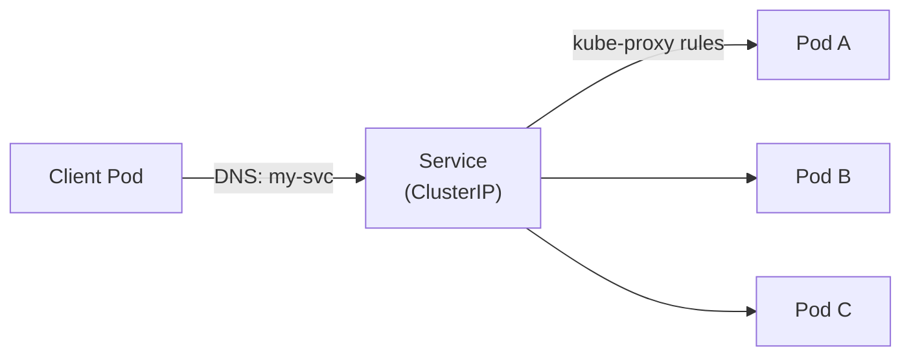

Services and probes are where Kubernetes networking interviews concentrate, because the failure modes are subtle: a Service with zero endpoints looks identical to a working one until you check, and a misconfigured probe causes restart loops that look like application bugs. This also covers securing configuration correctly, since "Secrets are just base64" is one of the most commonly missed nuances.

## Service types

A Service is a stable virtual IP and DNS name that load-balances traffic to a dynamic set of Pods, selected by label selector.

| Type | Behaviour | Typical use |
|---|---|---|
| `ClusterIP` (default) | Stable virtual IP, reachable only inside the cluster | Internal service-to-service traffic |
| `NodePort` | Opens the same static port on every node, forwarding to the Service | Simple external access without a cloud LB, dev/test |
| `LoadBalancer` | Provisions a cloud load balancer pointing at the Service (via cloud controller manager) | Production external access on a cloud provider |
| `ExternalName` | Pure DNS CNAME to an external name, no proxying | Referencing an external service (e.g. a managed DB) by an in-cluster name |
| Headless (`clusterIP: None`) | No virtual IP — DNS returns Pod IPs directly | StatefulSets, clients that need direct per-Pod addressing |



## How kube-proxy implements Services

kube-proxy runs on every node and watches Services/Endpoints via the API server, then programs the node's packet-forwarding rules — historically `iptables`, increasingly `IPVS` for better performance at scale — so that traffic to a Service's virtual IP is transparently DNAT'd to one of the backing Pod IPs. This means a Service isn't a running process or a proxy server in the traffic path at all; it's a set of kernel-level rules on every node, which is why a Service with no Pods still "exists" but any connection to it simply has no rule to match and fails.

> [!KEY]
> A Service is a rule set, not a running server. `kube-proxy` translates Service + Endpoints into iptables/IPVS DNAT rules on every node — that's the entire runtime mechanism, and it's why Service traffic keeps flowing even if kube-proxy itself later crashes (the rules it already programmed stay in the kernel until changed).

## Endpoints and EndpointSlices

The **Endpoints** object (one per Service) lists the IP:port pairs of all currently-Ready Pods matching the Service's selector — this is the object kube-proxy actually watches to build its rules. **EndpointSlices** are the newer, scalable replacement: instead of one giant Endpoints object holding every backend IP (which gets expensive to update at scale — one change means rewriting the whole object), backends are split into multiple smaller slice objects, each updated independently.

"A Service with a selector but zero matching Ready Pods has an empty Endpoints object, and traffic to it will simply hang or connection-refuse" is exactly the kind of debugging fact interviewers want to hear. Check `kubectl get endpoints <svc>` before anything else when a Service "isn't working."

## DNS naming

Every Service gets a predictable DNS name via cluster DNS (CoreDNS): `<service>.<namespace>.svc.cluster.local`. Within the same namespace, `<service>` alone resolves; cross-namespace requires at least `<service>.<namespace>`.

```bash
curl http://my-svc.default.svc.cluster.local
curl http://my-svc                # works only from within the 'default' namespace
```

## Ingress vs Gateway API

An Ingress object is a declarative set of HTTP(S) routing rules (host/path → backend Service); an **Ingress controller** (nginx-ingress, ALB controller, Traefik, etc.) is the actual proxy/process that reads Ingress objects and configures itself accordingly — Kubernetes ships the Ingress *API*, but no built-in controller implements it.

| Aspect | Ingress | Gateway API |
|---|---|---|
| Scope | HTTP/HTTPS routing only | HTTP, TCP, gRPC, and more; multi-protocol by design |
| Extensibility | Controller-specific annotations (non-portable) | Structured, portable fields across implementations |
| Role separation | Single object mixes infra and routing concerns | Separate `GatewayClass`/`Gateway` (infra) from `HTTPRoute` (routing) roles |
| Maturity | Long-standing, widely supported | Newer, positioned as Ingress's eventual successor |

```yaml
apiVersion: networking.k8s.io/v1
kind: Ingress
metadata:
  name: web-ingress
  annotations:
    nginx.ingress.kubernetes.io/ssl-redirect: "true"
spec:
  tls:
    - hosts: ["app.example.com"]
      secretName: app-tls
  rules:
    - host: app.example.com
      http:
        paths:
          - path: /
            pathType: Prefix
            backend:
              service:
                name: web-svc
                port:
                  number: 80
```

## TLS termination

TLS is typically terminated **at the Ingress controller** (it holds the certificate, referenced via a Secret of type `kubernetes.io/tls`), decrypting external HTTPS traffic and forwarding plain HTTP internally to the backend Service — simplest and most common. For end-to-end encryption requirements (zero-trust, compliance), TLS is re-encrypted from the Ingress to the backend too, or a service mesh handles mutual TLS between Pods transparently.

## ConfigMaps and Secrets

Both store configuration as key-value data and can be consumed as environment variables or mounted files. The only structural difference: **Secrets are stored base64-encoded, not encrypted, by default.**

> [!DANGER]
> Base64 is an *encoding*, not encryption — anyone with API read access to a Secret (or etcd access) can trivially decode it. By default, Secrets in etcd are also stored in plaintext (just base64 inside), unless you explicitly enable **encryption at rest** for the API server. Treat "we use Kubernetes Secrets" alone as *not* a security control — it's a convention with slightly better access-control defaults than a ConfigMap, not encryption.

To actually secure secrets: enable etcd encryption at rest, tighten RBAC so only specific ServiceAccounts/users can `get`/`list` Secrets, and for real secret management use an external secret store (Vault, AWS/GCP/Azure secret managers) with an operator (External Secrets Operator, Vault Agent injector) that syncs values into the cluster, or fetches them at runtime without ever persisting them as a plain Kubernetes Secret at all.

| Storage | Encrypted by default? | Notes |
|---|---|---|
| ConfigMap | No (plaintext) | Never put sensitive data here |
| Secret (no encryption at rest configured) | No — base64 only | Default in most clusters unless configured otherwise |
| Secret + etcd encryption at rest | Yes, at rest in etcd | Still visible to anyone with RBAC access via the API |
| External secret manager (Vault, cloud KMS-backed) | Yes, dedicated encryption + audit + rotation | Best practice for genuinely sensitive values |

## Mounting config as env vars vs files

```yaml
envFrom:
  - configMapRef:
      name: app-config          # every key becomes an env var
volumeMounts:
  - name: config-vol
    mountPath: /etc/app/config  # keys become files in this directory
volumes:
  - name: config-vol
    configMap:
      name: app-config
```

Environment variables are **only read once at container start** — updating a ConfigMap consumed as env vars requires a Pod restart to take effect. A ConfigMap mounted as a **volume** is updated in place on the filesystem (with a short propagation delay, generally under a minute) without restarting the Pod — but the application itself must watch the file and reload; Kubernetes doesn't restart the process for you either way.

## Probes: liveness, readiness, and startup

| Probe | Question it answers | On failure |
|---|---|---|
| `livenessProbe` | Is the process healthy enough to keep running? | kubelet **restarts** the container |
| `readinessProbe` | Is the container ready to receive traffic right now? | Pod removed from Service **Endpoints** (not restarted) |
| `startupProbe` | Has the (slow-starting) app finished initializing? | Blocks liveness/readiness checks until it passes; failure eventually kills the container |

```yaml
livenessProbe:
  httpGet:
    path: /healthz
    port: 8080
  initialDelaySeconds: 10
  periodSeconds: 10
  failureThreshold: 3
readinessProbe:
  httpGet:
    path: /ready
    port: 8080
  periodSeconds: 5
  failureThreshold: 2
startupProbe:
  httpGet:
    path: /healthz
    port: 8080
  failureThreshold: 30
  periodSeconds: 5
```

> [!DANGER]
> The classic misconfiguration causing restart loops: pointing `livenessProbe` at the same slow-starting `/healthz` endpoint with too short an `initialDelaySeconds`, or omitting a `startupProbe` for a slow-starting app. The liveness probe starts failing before the app has even finished booting, the kubelet restarts the container, it never finishes starting, and it restarts forever — a **CrashLoopBackOff** that has nothing to do with an actual application bug. The fix is a `startupProbe` sized generously for worst-case startup time, which suppresses liveness checks until the app is actually up.

## Graceful shutdown

```yaml
spec:
  terminationGracePeriodSeconds: 30
  containers:
    - name: app
      lifecycle:
        preStop:
          exec:
            command: ["sh", "-c", "sleep 5"]
```

When a Pod is deleted, Kubernetes: removes it from Service Endpoints (stopping new traffic) **in parallel with** sending `SIGTERM` and running `preStop` — these are not strictly sequential, which is exactly why a short `preStop sleep` is a common pattern to bridge the gap while endpoint removal propagates across the cluster. After `terminationGracePeriodSeconds` (default 30s) the kubelet sends `SIGKILL` if the process hasn't exited.

> [!WARNING]
> Because Endpoint removal and SIGTERM delivery race each other, a Pod can receive a request *after* SIGTERM but *before* it's fully removed from every node's kube-proxy rules. A `preStop` hook with a short sleep (long enough to cover Endpoint propagation, often a few seconds) is the standard mitigation, alongside the application handling in-flight requests gracefully on SIGTERM rather than dying immediately.

## Cheat sheet

- A Service is DNAT rules programmed by kube-proxy, not a running proxy process in the data path.
- Check `kubectl get endpoints <svc>` first — a selector matching zero Ready Pods is the #1 "Service isn't working" cause.
- `ClusterIP` (internal) → `NodePort`/`LoadBalancer` (external) → `ExternalName` (DNS alias) → headless (direct Pod DNS, for StatefulSets).
- Ingress is an API; an Ingress controller (nginx, ALB, etc.) actually implements it — nothing ships built-in.
- Secrets are base64, **not encrypted**, by default — enable etcd encryption at rest and use RBAC/external secret managers for real protection.
- Env vars from config require a Pod restart to update; mounted config files update in place (app must watch/reload).
- `livenessProbe` failure restarts the container; `readinessProbe` failure only removes it from Endpoints.
- Missing a `startupProbe` on a slow-starting app is the classic cause of liveness-triggered CrashLoopBackOff.
- Endpoint removal and SIGTERM race on Pod termination — use `preStop` sleep to bridge the gap.

## Common mistakes

| Mistake | Fix |
|---|---|
| Assuming a Service "not working" means DNS is broken | Check `kubectl get endpoints` first — usually zero Ready backends |
| Treating base64 Secrets as encrypted | Enable etcd encryption at rest; use an external secret manager for real secrets |
| Expecting env-var config to update live | Restart the Pod, or mount config as a file and have the app watch it |
| Liveness probe hitting the same slow endpoint with no startup probe | Add a `startupProbe` sized for worst-case startup time |
| No `preStop` hook on Services behind a load balancer | Add a short `preStop` sleep to bridge Endpoint propagation |
| Assuming Ingress works without installing a controller | Deploy an Ingress controller — the API alone does nothing |
| Confusing readiness failure with a crash | Readiness failure only pulls a Pod from Endpoints; it does not restart it |

## Summary

Services are implemented as kernel-level DNAT rules programmed by kube-proxy from Endpoints/EndpointSlices, which is why checking Endpoints is the first diagnostic step for "Service isn't working," and why Ingress needs a separately-installed controller to actually do anything with the routing rules you declare. Config and Secrets share a storage model, but Secrets being merely base64-encoded by default is a frequently-missed nuance — real protection needs etcd encryption at rest and RBAC, or an external secret manager. Probes gate two different things — liveness gates restarts, readiness gates traffic — and the classic CrashLoopBackOff-from-slow-startup bug is solved by adding a properly-sized `startupProbe`, not by loosening liveness thresholds blindly.

## Top Interview Questions

### Q1. What is a Kubernetes Service, mechanically — is it a running process?

No — a Service is a stable virtual IP and DNS name backed by a set of forwarding rules, not a process sitting in the traffic path. kube-proxy on every node watches the Service and its Endpoints/EndpointSlices via the API server and programs kernel-level rules (traditionally iptables DNAT rules, or IPVS for better performance at scale) so that any packet sent to the Service's virtual IP is rewritten to one of the backing Pod IPs directly at the kernel level. This is why Service traffic keeps working even if the kube-proxy process itself crashes afterward — the rules it already installed remain active in the kernel until something changes them — and why a Service with a selector matching zero Ready Pods has an empty rule set and simply fails to connect rather than returning any kind of clear "no backend" error.

### Q2. Your Service isn't routing traffic to any Pods. What's your diagnostic sequence?

First, `kubectl get endpoints <service-name>` (or `endpointslices`) — if it's empty, the Service's label selector doesn't match any currently-Ready Pod, which is by far the most common cause; check the Service's `selector` against the actual Pod labels (`kubectl get pods --show-labels`) and check whether matching Pods are actually passing their readiness probe, since a Running-but-not-Ready Pod is excluded from Endpoints. If Endpoints does list Pod IPs, next check whether the Pods themselves are reachable directly (`kubectl exec` into another Pod and curl a Pod IP:port), which isolates whether the problem is at the Service/kube-proxy layer or the application itself. Only after confirming both the selector and direct Pod reachability would you look at kube-proxy's mode/health or a NetworkPolicy that might be blocking the traffic.

### Q3. What's the difference between `ClusterIP`, `NodePort`, and `LoadBalancer` Service types?

`ClusterIP` (the default) allocates a virtual IP reachable only from within the cluster — the base building block every other type builds on top of. `NodePort` additionally opens the same static port (from a reserved range, typically 30000–32767) on every node in the cluster, forwarding to the ClusterIP, so external traffic can reach the Service via `<any-node-IP>:<nodePort>` without needing a cloud load balancer — useful for bare-metal or simple setups but exposes a node-level port directly. `LoadBalancer` builds on `NodePort` and additionally asks the cloud controller manager to provision an actual cloud load balancer (an ELB/ALB on AWS, for example) that targets the NodePort, giving a single stable external IP/DNS name — the standard production choice on a cloud provider, but it does nothing on bare-metal without an equivalent like MetalLB installed.

### Q4. Explain the difference between an Ingress object and an Ingress controller.

An Ingress is just a Kubernetes API object — a declarative description of HTTP(S) routing rules (which host/path should route to which backend Service, optional TLS configuration) — persisted in etcd like any other object, with no behavior of its own. An Ingress controller is a separately-deployed piece of software (nginx-ingress, the AWS ALB controller, Traefik, and others) that watches Ingress objects and actually configures a real proxy or cloud load balancer to implement those rules; Kubernetes does not ship a default one. This is a common point of confusion for people new to Kubernetes: creating an Ingress object with no controller installed in the cluster does absolutely nothing — routing simply never happens because nothing is watching and acting on that object.

### Q5. Why is "we store it as a Kubernetes Secret" not sufficient as a security claim?

By default, Secret data is only base64-encoded, not encrypted — base64 is a reversible encoding scheme with no key, so anyone who can read the Secret object via the API (or read etcd's data files directly, if they have access) can trivially recover the original value; it provides no confidentiality on its own. Additionally, unless the cluster operator has explicitly enabled encryption at rest for the API server, the Secret's base64 blob is stored as plain text inside etcd, meaning an etcd backup or snapshot leak exposes every Secret in the cluster in a trivially decodable form. Real protection requires layering: enabling etcd encryption at rest, tightly scoping RBAC so only the specific ServiceAccounts that need a Secret can read it, and for genuinely sensitive values, using an external secret manager (Vault, cloud KMS-backed secret stores) instead of relying on a raw Kubernetes Secret as the source of truth.

### Q6. What's the difference between mounting a ConfigMap as environment variables versus as a volume, and why does it matter for config updates?

Environment variables are injected into a container's process environment exactly once, at container start — the kubelet doesn't re-inject them, so updating the underlying ConfigMap has zero effect on an already-running container until it's restarted (which happens on the next Pod recreation, e.g. from a rollout). Mounting the same ConfigMap as a volume instead creates files in the container's filesystem that the kubelet does update in place when the ConfigMap changes, typically within about a minute due to the kubelet's sync period — but this only helps if the application itself is written to detect the file change and reload its configuration; Kubernetes does not restart or signal the process automatically either way. In practice, if you need config to be updatable without a full redeploy, mount it as a file and implement a file-watcher/reload in the app; if the app only reads config at startup anyway, either approach requires a restart and env vars are simpler.

### Q7. What's the difference between a liveness probe and a readiness probe, and what happens on failure for each?

A liveness probe answers "is this container's process still healthy, or should it be restarted" — if it fails repeatedly (past `failureThreshold`), the kubelet kills and restarts the container, treating it as stuck or deadlocked. A readiness probe answers a different question — "is this specific container instance currently able to serve traffic right now" — and on failure, the kubelet simply removes the Pod from the Service's Endpoints so it stops receiving new traffic, without restarting anything; it can rejoin Endpoints automatically the moment readiness passes again. Confusing the two is a common bug: using only a liveness probe for something that's a temporary, self-recovering condition (like a brief downstream dependency blip) causes unnecessary restarts, when a readiness probe would have handled it correctly by just pausing traffic.

### Q8. A Pod keeps entering CrashLoopBackOff right after deployment, but the application logs show it was still initializing when it got killed. What's the likely cause and fix?

This is the classic liveness-probe-vs-slow-startup misconfiguration: the `livenessProbe` began checking (after `initialDelaySeconds`) before the application had actually finished its startup work, failed enough times to hit `failureThreshold`, and the kubelet restarted the container — which then repeats the same slow startup, fails the same too-early liveness check, and loops forever, producing CrashLoopBackOff that looks like an application crash but is actually a probe timing problem. The fix is to add a `startupProbe` configured generously for the worst-case startup time (high `failureThreshold` × `periodSeconds`); while the startup probe hasn't yet succeeded, the liveness and readiness probes are not evaluated at all, so the app gets the time it needs to boot without being killed mid-initialization, and once startup succeeds, liveness takes over with its normally-tight thresholds for genuine post-startup health checks.

### Q9. Why can a Pod receive a request after it starts terminating, and how do you prevent dropped requests during shutdown?

When a Pod is deleted, Kubernetes does two things concurrently rather than strictly sequentially: it starts removing the Pod from the Service's Endpoints (so kube-proxy rules on every node eventually stop routing new traffic to it) and it sends `SIGTERM` (after running any `preStop` hook) to begin terminating the process. Because Endpoint removal has to propagate across every node's kube-proxy asynchronously, there's a real window where some node might still route a new connection to a Pod that has already received SIGTERM or even exited. The standard mitigation is a `preStop` hook that sleeps for a few seconds before actually letting SIGTERM proceed to the application (or before the container exits), giving Endpoint propagation time to catch up, combined with the application handling SIGTERM by finishing in-flight requests rather than terminating instantly, and setting `terminationGracePeriodSeconds` generously enough to cover both.

### Q10. When would you choose the Gateway API over Ingress for a new project?

Ingress is well-established and universally supported, but its API is deliberately minimal (host/path routing for HTTP/HTTPS only) and relies heavily on controller-specific annotations for anything beyond that — meaning routing configuration is often not portable between different Ingress controller implementations. The Gateway API is a newer, more expressive standard that natively supports multiple protocols (HTTP, TCP, gRPC), splits responsibilities more cleanly between infrastructure roles (a `GatewayClass`/`Gateway` managed by platform teams) and application routing roles (`HTTPRoute` managed by app teams), and expresses what used to require vendor-specific annotations as structured, portable fields. You'd choose Gateway API for a new project needing multi-protocol routing, clearer separation between platform and application teams, or portability across controller implementations — you'd stick with Ingress for simplicity, broader current tooling support, or when the target controller's Gateway API support is still immature.

### Q11. What's the difference between a headless Service and a normal ClusterIP Service, and when would you use one?

A normal `ClusterIP` Service allocates a single stable virtual IP, and DNS lookups for its name resolve to that one virtual IP, which kube-proxy then load-balances across backend Pods transparently — clients never see individual Pod IPs. A headless Service (`clusterIP: None`) skips the virtual IP entirely; a DNS lookup for its name returns the IP addresses of all matching Ready Pods directly, letting the client see and choose (or connect to all of) the individual backends itself. This is used when a client needs direct addressability to specific Pods rather than an anonymous load-balanced pool — most notably with StatefulSets, where each Pod also gets its own stable DNS record (`pod-0.svc-name...`), letting clients or the Pods themselves address a specific replica by name, which is essential for stateful systems with primary/replica or shard-aware routing logic.

### Q12. How would you design TLS termination for an application that also needs to satisfy a strict "encrypt everything in transit" compliance requirement?

The common simple pattern — terminating TLS at the Ingress controller and forwarding plain HTTP to the backend Service inside the cluster — satisfies encrypting external traffic but leaves internal, cluster-network traffic between the Ingress controller and the Pod unencrypted, which fails a strict end-to-end encryption requirement even though the traffic never technically leaves the cluster's network boundary. To satisfy that stricter bar, you'd either configure the Ingress controller for TLS passthrough or re-encryption (terminating external TLS, then opening a *new* TLS connection to the backend using a certificate the backend also validates), or adopt a service mesh (Istio, Linkerd) that transparently establishes mutual TLS between every Pod-to-Pod connection in the cluster via sidecar proxies, without requiring each application to implement TLS itself. The trade-off to name explicitly: mesh mTLS is more operationally complex (managing certificate rotation, mesh control plane) but scales the requirement across every service automatically, versus per-service re-encryption which is simpler for a small number of services but doesn't scale as cleanly.
