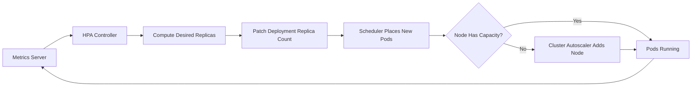

Every container in Kubernetes carries two numbers — requests and limits — and misunderstanding what each one actually does is the single biggest source of both wasted spend and mysterious production incidents. This page covers how the scheduler and kubelet use those numbers, the asymmetry between CPU throttling and memory OOMKill, and the four autoscalers you are expected to reason about: HPA, VPA, KEDA and the cluster autoscaler.

## Requests and limits do different jobs

A **request** is a promise used only at scheduling time: the scheduler will not place a pod on a node unless the node has that much allocatable capacity free. A **limit** is a runtime ceiling enforced by the kubelet and container runtime through cgroups, long after the pod is already running somewhere.

| Field | Enforced by | When | Effect |
|---|---|---|---|
| CPU request | kube-scheduler | Pod placement | Guarantees a CFS share; unused share can be borrowed by others |
| CPU limit | kubelet / cgroups (CFS quota) | Continuously at runtime | Throttles the process once quota for the period is used |
| Memory request | kube-scheduler | Pod placement | Reserved against node allocatable memory |
| Memory limit | kubelet / cgroups (OOM killer) | Continuously at runtime | Kills the process (SIGKILL) on breach |

> [!KEY]
> Requests decide **where** a pod runs. Limits decide **what happens to it** once it's already there. They are not two ends of the same knob.

## CPU throttling vs memory OOMKill — the crucial asymmetry

CPU is a **compressible** resource: exceeding your CPU limit does not crash anything, it just slows you down. The kernel's CFS bandwidth controller lets you burn your quota within a 100ms period, then parks the process until the next period — visible as tail-latency spikes, not errors. Memory is **incompressible**: there is no "wait and retry" for a page fault, so exceeding the memory limit gets the container SIGKILLed by the OOM killer and restarted.

This means a bad CPU limit degrades quietly (p99 latency creeps up, nobody pages) while a bad memory limit is a loud crash loop. Interviewers use this to check whether you've actually operated a cluster, not just read the docs.

| QoS class | Condition | Eviction priority under node pressure |
|---|---|---|
| Guaranteed | requests == limits for CPU and memory on every container | Evicted last |
| Burstable | at least one request set, request < limit | Evicted after BestEffort |
| BestEffort | no requests or limits set | Evicted first |

> [!WARNING]
> Throttling is invisible unless you scrape `container_cpu_cfs_throttled_periods_total`. Teams routinely ship a CPU limit, see nothing in error dashboards, and only find the throttling months later when someone plots p99 latency against it.

## Choosing values from observed usage

Never guess requests and limits from a spec sheet — derive them from real traffic. Pull two to four weeks of history, including at least one peak (deploy, batch job, traffic spike), then set:

- **CPU/memory request** near the p50–p70 usage — enough headroom for normal variance without wasting bin-packing capacity.
- **Memory limit** near p99 usage plus a safety margin, because breaching it kills the pod.
- **CPU limit** — often omitted entirely for latency-sensitive services, so bursts borrow idle CPU instead of throttling.

```bash
# p99 memory usage per pod over 14 days, from Prometheus/VictoriaMetrics
promtool query instant http://localhost:9090 \
  'quantile_over_time(0.99, container_memory_working_set_bytes{pod=~"checkout-.*"}[14d])'
```

The VPA recommender (run in "Off" mode) is a good source of these numbers even if you never let it act automatically.

## HPA mechanics and the scaling formula

The Horizontal Pod Autoscaler polls metrics every sync period (default 15s) and computes:

```
desiredReplicas = ceil( currentReplicas × ( currentMetricValue / desiredMetricValue ) )
```

It ignores changes within a 10% tolerance band to avoid thrashing on noise, and applies **stabilisation windows** separately for scale-up and scale-down — by default scale-down looks back 300s and picks the *largest* recommendation in that window, so a brief dip in load doesn't immediately shed pods.

```yaml
apiVersion: autoscaling/v2
kind: HorizontalPodAutoscaler
metadata:
  name: checkout-hpa
spec:
  scaleTargetRef:
    apiVersion: apps/v1
    kind: Deployment
    name: checkout
  minReplicas: 3
  maxReplicas: 30
  metrics:
    - type: Resource
      resource:
        name: cpu
        target:
          type: Utilization
          averageUtilization: 60
  behavior:
    scaleDown:
      stabilizationWindowSeconds: 300
      policies:
        - type: Pods
          value: 2
          periodSeconds: 60
```



## VPA, and why HPA plus VPA on CPU conflict

The Vertical Pod Autoscaler adjusts requests/limits instead of replica count, in three modes: `Off` (recommendation only), `Initial` (set at pod creation), and `Auto` (evicts and recreates pods with new values). The trap: **HPA on CPU utilization and VPA on CPU requests fight each other.** Utilization is `usage / request`. If VPA raises the request because usage was high, the *percentage* drops even though real load hasn't — HPA sees a signal it didn't cause and may scale down while the service is genuinely busy, or oscillate as the two controllers chase each other's output.

> [!DANGER]
> Never point HPA and VPA at CPU on the same workload. Either use VPA in `Off` mode purely for sizing advice, or split responsibility — HPA on a custom/external metric (RPS, queue depth) and VPA managing memory only.

## KEDA for event-driven scaling

KEDA extends HPA to scale on external event sources — queue depth, Kafka consumer lag, Service Bus message count — including scaling **to zero**, which vanilla HPA cannot do cleanly. A `ScaledObject` creates a metrics adapter and an HPA under the hood.

```yaml
apiVersion: keda.sh/v1alpha1
kind: ScaledObject
metadata:
  name: order-worker-scaler
spec:
  scaleTargetRef:
    name: order-worker
  minReplicaCount: 0
  maxReplicaCount: 50
  cooldownPeriod: 120
  triggers:
    - type: kafka
      metadata:
        bootstrapServers: kafka:9092
        consumerGroup: order-worker
        topic: orders
        lagThreshold: "50"
```

## Cluster autoscaler and pod scheduling

The Cluster Autoscaler doesn't watch metrics — it watches for **Pending** pods the scheduler couldn't place, and adds nodes to fit them; it removes nodes when utilization is low enough that everything on them can be rescheduled elsewhere without violating PodDisruptionBudgets. This is why accurate requests matter twice over: wrong requests mislead both the scheduler's bin-packing and the cluster autoscaler's decision to buy more nodes.

| Autoscaler | Scales | Signal | Can hit zero | Typical conflict |
|---|---|---|---|---|
| HPA | Pod replica count | Resource or custom metric | No (min 1 usually) | VPA on the same metric |
| VPA | Pod requests/limits | Historical usage | N/A | HPA on CPU |
| KEDA | Pod replica count | External event source | Yes | Same as HPA (it wraps HPA) |
| Cluster Autoscaler | Node count | Pending pods / low utilisation | Yes (empty node groups) | Bad requests skew both decisions |

## Scale-to-zero, cold starts, and over-provisioning

Scale-to-zero saves cost on bursty or scheduled workloads, but the first request after idle pays for image pull, JVM/CLR warmup, connection pool init and TLS handshakes to dependencies — often 2-10 seconds. For latency-sensitive paths, keep `minReplicaCount` at 1+ and use KEDA's `cooldownPeriod` to avoid scaling down mid-burst.

The opposite failure is over-provisioning: padding replicas and requests "just in case" removes cold starts and scaling lag entirely, at the direct cost of idle spend. Most teams land in the middle — a small warm floor plus headroom in `maxReplicas`, sized from the observed traffic curve rather than fear.

> [!NOTE]
> Over-provisioning is a legitimate SRE decision, not a failure of autoscaling discipline — state the cost/latency trade-off explicitly rather than treating "just add more replicas" as sloppy.

## Cheat sheet

- Requests → scheduling. Limits → runtime enforcement. Different mechanisms, different failure modes.
- CPU limit breach throttles (slow, silent). Memory limit breach kills (loud, visible).
- Size requests from p50–p70 usage, memory limits from p99 + margin, over 2+ weeks of real traffic including peak.
- HPA: `desired = ceil(current × (actual / target))`, 15s sync, 10% tolerance, separate stabilisation windows for up/down.
- Never run HPA and VPA on the same metric for the same workload.
- KEDA = HPA + external event triggers + scale-to-zero.
- Cluster autoscaler reacts to Pending pods, not dashboards — bad requests break its decisions too.
- Scale-to-zero trades cost for cold-start latency; keep a warm floor where latency matters.

## Common mistakes

| Mistake | Fix |
|---|---|
| Setting CPU limit == CPU request "to be safe" | Often causes needless throttling under burst; consider no CPU limit for Burstable workloads |
| No memory limit at all | Node runs out of memory and the kernel OOM-kills something unrelated (kubelet, other pods) |
| Running HPA and VPA on CPU together | Feedback loop and oscillation; separate the metrics or run VPA in `Off` mode |
| Sizing requests from a spec sheet, not usage | Chronic over- or under-provisioning; use observed p50/p99 |
| Assuming HPA can scale to zero | It cannot below `minReplicas: 1` in general; use KEDA for zero |
| Ignoring PodDisruptionBudgets when relying on cluster autoscaler scale-down | Scale-down stalls or violates availability guarantees |

## Summary

Requests and limits solve two different problems — placement and runtime enforcement — and conflating them causes both wasted capacity and OOMKill incidents. CPU throttles quietly while memory kills loudly, so size each from observed p50–p99 usage rather than guesswork. HPA reacts to metrics with a defined formula and stabilisation windows, VPA reacts to historical usage, KEDA extends both to external events and true scale-to-zero, and the cluster autoscaler reacts to Pending pods rather than dashboards. Knowing which controller owns which signal — and never letting two of them fight over the same one — is what separates "we have autoscaling configured" from "autoscaling actually works."

## Top Interview Questions

### Q1. What is the difference between a resource request and a resource limit?

A request is used by the scheduler at pod placement time — it's a reservation that guarantees the node has that much allocatable CPU/memory available, and the sum of requests on a node can never exceed its allocatable capacity. A limit is enforced continuously at runtime by the kubelet via cgroups: it's a ceiling on what the container is allowed to consume once it's already running. A pod can be scheduled fine (request satisfied) and still misbehave badly at runtime (limit too low), because the two mechanisms operate at completely different times and layers.

### Q2. Why does exceeding a CPU limit behave differently from exceeding a memory limit?

CPU is compressible — the kernel's CFS bandwidth controller simply throttles the process, pausing it until the next accounting period, so it runs slower but never crashes. Memory is incompressible — there's no way to "pause" a page fault, so once a container exceeds its memory limit the kernel's OOM killer sends SIGKILL, and the pod restarts. This asymmetry means a misconfigured CPU limit shows up as a silent p99 latency regression that's easy to miss without CFS throttling metrics, while a misconfigured memory limit shows up immediately as visible crash loops.

### Q3. How would you decide what CPU and memory requests to set for a new service?

Pull at least two weeks of real usage data, ideally spanning a peak event (deploy, sale, batch run), from metrics-server or Prometheus. Set the request near the p50–p70 usage line — enough to cover typical load without wasting bin-packing capacity across the cluster — and set the memory limit near p99 plus a safety margin since breaching it kills the pod. I'd avoid a tight CPU limit unless there's a hard multi-tenant reason to cap bursts, since throttling a burstable workload just adds latency for no safety benefit. The VPA recommender in `Off` mode is a convenient way to generate these numbers without letting it act.

### Q4. Explain the HPA scaling formula and why stabilisation windows exist.

HPA computes `desiredReplicas = ceil(currentReplicas × (currentMetricValue / desiredMetricValue))`, polling on a sync period (15s by default) and ignoring changes inside a 10% tolerance band. Stabilisation windows exist to prevent flapping: scale-down uses a window (300s default) and picks the largest recommended replica count seen in that window, so a brief dip in traffic doesn't immediately shed pods that are needed again seconds later. Scale-up typically has little or no stabilisation, because under-provisioning is usually more painful than a slightly premature extra pod.

### Q5. Why shouldn't you run HPA and VPA on the same CPU metric for the same workload?

Because they'd be reading and writing the same signal. HPA's utilization metric is `usage / request`. If VPA raises the CPU request in response to sustained high usage, the utilization percentage drops even though real load hasn't changed, which can make HPA scale down a genuinely busy service — or the two controllers can chase each other's changes into an oscillation. The fix is to separate responsibilities: run VPA in recommendation-only mode, or have HPA scale on a different signal (RPS, queue depth, a custom metric) while VPA owns memory sizing.

### Q6. How does KEDA differ from the standard HPA, and when would you reach for it?

KEDA is a layer on top of HPA that adds external event-source triggers — queue depth, Kafka consumer lag, cloud message counts — and, crucially, the ability to scale all the way to zero replicas, which vanilla HPA cannot do cleanly. Under the hood a `ScaledObject` provisions a custom metrics adapter and a standard HPA object. I'd reach for KEDA for asynchronous, event-driven workers (queue consumers, batch jobs) where load isn't well represented by CPU/memory and where idling at zero replicas between bursts is a real cost saving.

### Q7. What triggers the cluster autoscaler, and how does it interact with the pod scheduler?

The cluster autoscaler watches for pods stuck in `Pending` because the scheduler couldn't find a node with enough allocatable capacity, and responds by adding nodes (or node groups) that would fit them. It scales nodes down when their pods could be rescheduled elsewhere without breaking PodDisruptionBudgets, then cordons and drains. Because it reasons entirely from requests — not actual usage — bad requests cascade: over-requesting causes needless node scale-up, under-requesting lets the scheduler over-pack a node and starve pods at runtime even though the cluster autoscaler saw no problem.

### Q8. A service's p99 latency spikes intermittently under load, but you see no errors or restarts. How would you debug it?

I'd suspect CPU throttling first, since it produces exactly this signature — no crashes, just slowness — because CPU is compressible and limits are enforced by pausing the process rather than killing it. I'd check `container_cpu_cfs_throttled_periods_total` against `container_cpu_usage_seconds_total` for the pod; a high throttled-to-total-periods ratio confirms it. The fix is usually to raise or remove the CPU limit (keeping the request accurate for scheduling), or to reduce per-pod concurrency so bursts fit inside the existing quota. I'd also check if HPA and VPA are both acting on CPU, which can produce a similar oscillating-latency symptom.

### Q9. Your team wants to enable scale-to-zero for a customer-facing API to cut cost. What would you push back on?

Scale-to-zero is fine for internal or asynchronous workloads, but for a customer-facing API the first request after idle pays a cold-start tax — image pull, runtime warmup, connection pool and TLS setup to databases/caches — which can be several seconds and directly hits user-facing latency SLOs. I'd propose keeping a small warm floor (`minReplicaCount` ≥ 1) instead of true zero, using KEDA to scale the rest of the range on real traffic, and measuring actual cold-start time before committing. If the cost saving still matters, I'd combine a warm floor during business hours with scale-to-zero only in known-quiet windows.

### Q10. What Quality of Service (QoS) class does Kubernetes assign a pod, and why does it matter?

Kubernetes derives QoS from requests/limits without any explicit field: `Guaranteed` if every container's requests equal its limits for both CPU and memory, `Burstable` if at least one request is set but requests and limits differ, and `BestEffort` if neither is set. This matters because QoS class drives eviction order under node memory pressure — BestEffort pods are evicted first, then Burstable, and Guaranteed last. A production-critical pod with no requests/limits set is BestEffort and will be the first thing killed when a node is under memory pressure, regardless of how important the workload actually is.

### Q11. How would you right-size a fleet of services that were all launched with copy-pasted, guessed resource requests?

I'd start with the VPA recommender in `Off` mode across the fleet to gather non-disruptive per-service recommendations over a couple of weeks, cross-checked against Prometheus p50/p99 usage to catch anything the recommender missed (like seasonal spikes it hasn't seen yet). I'd roll changes out gradually, service by service, watching for increased throttling or OOMKills after each change, rather than applying a fleet-wide bulk edit. I'd also flag any service running Guaranteed QoS with generous limits "just in case" — that's usually wasted reserved capacity that the cluster autoscaler is paying for every day.

### Q12. Why can HPA scaling and cluster autoscaler node scaling look like they're fighting each other, and how do you fix it?

If HPA scales up quickly (short sync period, tight tolerance) but new nodes take minutes to join the cluster, you get a window where pods sit Pending, HPA sees load isn't dropping and keeps requesting more replicas, and the cluster autoscaler is racing to catch up — it can look like both are "stuck." The fix isn't to slow HPA down; it's to reduce node join latency (smaller node pools with pre-warmed capacity, or a small buffer of over-provisioned pause pods that get evicted to make room) and to make sure requests are accurate so each new node actually fits the pods that need it.
