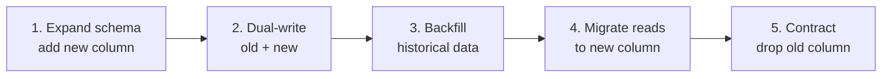
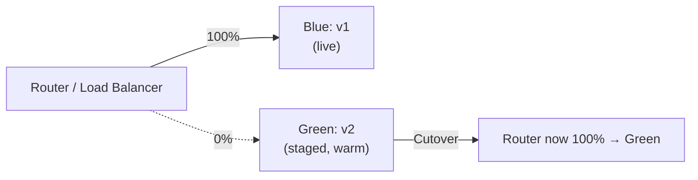

"Deployment" and "release" are not the same thing, and the strategy you pick determines how much blast radius a bad change gets before anyone notices. The useful comparison is across the axes interviewers actually probe — downtime, rollback speed, cost, risk — plus the two questions that separate a mid-level answer from a senior one: how to migrate a database safely mid-rollout, and how feature flags let you deploy without releasing.

## Comparing the strategies

| Strategy | Downtime | Rollback speed | Infra cost | Risk | Complexity | Traffic split |
|---|---|---|---|---|---|---|
| Recreate | Yes (full outage) | Slow (redeploy old) | Lowest | High (all-or-nothing) | Lowest | None — old stopped, new started |
| Rolling | None (if healthy) | Slow (reverse rollout) | Low | Medium | Low | By pod, gradually replaced |
| Blue-green | None | Instant (flip router) | High (2x capacity) | Medium (all traffic at once) | Medium | All-or-nothing, atomic cutover |
| Canary | None | Fast (shift back to 0%) | Medium | Low | High | Percentage-based, gradual |
| A/B | None | Fast | Medium | Low (business risk, not availability) | High | Split by user segment, not %random |
| Shadow / dark launch | None | N/A (no user impact) | Medium-high (duplicate load) | Lowest (real traffic, no real responses) | High | Mirrored, response discarded |

> [!KEY]
> Rolling, blue-green and canary are about **infrastructure risk**. A/B is about **business risk**. Shadow is about **validating behaviour with zero user-facing risk**. Conflating them in an interview answer is a tell.

## Progressive delivery with automated analysis

Progressive delivery automates the canary judgment call: instead of a human watching a dashboard, a tool (Argo Rollouts, Flagger) shifts a small percentage of traffic, queries metrics (error rate, latency, custom business metrics) against a defined threshold, and either promotes to the next step or automatically rolls back — no human in the loop for the common case.

```yaml
# Argo Rollouts canary step with automated analysis
strategy:
  canary:
    steps:
      - setWeight: 10
      - pause: { duration: 5m }
      - analysis:
          templates:
            - templateName: success-rate
          args:
            - name: service-name
              value: checkout
      - setWeight: 50
      - pause: { duration: 10m }
```

> [!TIP]
> Say "automated analysis, not just automated rollout" — the differentiator senior interviewers listen for is that the *decision* to proceed is metric-driven, not just the traffic shift.

## Feature flags decouple deploy from release

A deploy puts new code on machines; a release exposes it to users. Feature flags let you do the first without the second: ship code dark behind a flag, verify it in production with internal or synthetic traffic, then flip the flag for a percentage of real users — completely independent of any deployment. This turns a risky "deploy = release" event into two separate, cheap, reversible decisions, and lets you decouple release timing from engineering timing (e.g. a marketing launch date) entirely.

> [!TIP]
> "We deploy continuously but release deliberately" is the sentence that signals you understand this distinction.

## Database migrations during a rolling deploy — expand-contract

The hardest part of a rolling or canary deploy is that **old and new code run against the same database simultaneously**. If a migration renames or drops a column the old code still reads, the deploy breaks itself mid-rollout. The **expand-contract** pattern (also called parallel change) solves this in safe, backward-compatible steps:

1. **Expand** — add the new column/table alongside the old one; old code is unaffected, new code doesn't use it yet. Deploy this migration alone, first.
2. **Dual-write** — deploy application code that writes to *both* old and new schema on every write, while still reading from the old one.
3. **Backfill** — migrate historical data into the new column/table in the background (batched, throttled, idempotent).
4. **Migrate reads** — deploy application code that reads from the new schema, with the old one as a fallback if needed.
5. **Contract** — once every instance is on the new code and you're confident, stop writing to the old schema, then drop it in a final, separate migration.

Each step is independently deployable and independently reversible — nothing in the sequence requires old and new code to disagree about the schema at the same instant.



> [!DANGER]
> A single "rename column and deploy" migration is the classic outage trigger: half the rolling fleet is still running old code expecting the old name the instant the migration commits. Expand-contract exists specifically to prevent this.

## Backward compatibility requirements

Any strategy other than Recreate requires **N and N+1 compatibility**: the new version's API/schema/message format must tolerate calls from the previous version, and vice versa, for the entire overlap window. This applies to database schemas (above), internal APIs between services, message queue payloads, and config formats. The practical rule: additive changes (new optional field, new endpoint) are safe; changes that remove or repurpose something a live version still uses are not, until that version is fully retired.

## Rollback vs roll-forward

| | Rollback | Roll-forward |
|---|---|---|
| What it means | Redeploy the previous known-good version | Deploy a new version that fixes the issue |
| Speed | Fast if the artefact is still available | Slower — needs a fix, build, test |
| Safe with a bad migration? | Only if migrations are backward-compatible | Yes, if the fix itself is compatible |
| When preferred | Clear regression, no forward fix ready | Issue is subtle, or rollback would itself be risky (e.g. after a contract-phase migration) |

The trap: once you've run the "contract" step of an expand-contract migration, rolling back the *application* to a version that expects the old schema is no longer safe — this is why the contract step should always be the very last, and only after you're certain no rollback is coming.

## Release gates and approvals

Progressive delivery still usually keeps a **manual gate** before production for regulated or high-risk changes — a person or a change-advisory process approves promotion from staging to prod even if the pipeline is otherwise automated. Gates should be cheap for the common case (a single click, an automated policy check) and reserved for genuinely risky changes, or they become the bottleneck teams route around.



## Cheat sheet

- Deploy ≠ release. Deploy puts code on machines; release exposes it to users. Feature flags separate them.
- Recreate = full outage, simplest. Rolling = no outage, slow rollback. Blue-green = instant rollback, double cost. Canary = lowest risk, highest operational complexity.
- A/B tests business outcomes on user segments; canary tests infrastructure risk on a traffic percentage — different purposes, don't conflate them.
- Shadow/dark launch mirrors real traffic without returning results to users — zero risk, used to validate behaviour or load.
- Expand-contract: add → dual-write → backfill → migrate reads → drop. Never rename/drop in one step during a rolling deploy.
- N and N+1 compatibility is required for any strategy except Recreate.
- Rollback is only safe until you've run an irreversible contract-phase migration — after that, roll forward.
- Progressive delivery = automated metric-gated promotion, not just automated traffic shifting.

## Common mistakes

| Mistake | Fix |
|---|---|
| Renaming/dropping a DB column in the same deploy as the code change | Use expand-contract: separate, backward-compatible steps |
| Treating canary and A/B as the same thing | Canary = infra risk on a %; A/B = business outcome on a segment |
| Assuming rollback is always safe | It isn't once a contract-phase migration has run — roll forward instead |
| Shipping a feature flag with no removal plan | Stale flags accumulate as permanent branching complexity; schedule flag cleanup |
| Blue-green with no automated health check before cutover | You've just made the outage instant instead of preventing it |
| Skipping gates entirely "to move fast" | Fine for low-risk changes; keep a lightweight gate for anything touching money, auth or data |

## Summary

Deployment strategy is a knob you tune per-service based on acceptable downtime, rollback speed and cost — recreate for simplicity, rolling for the default no-downtime case, blue-green for instant rollback at double cost, canary for the lowest blast radius, A/B for business experiments, and shadow traffic for zero-risk validation. Feature flags decouple *deploying* code from *releasing* it to users, which is what makes continuous deployment safe. The hardest recurring problem is the database: expand-contract migrations keep old and new application versions compatible with the same schema throughout a rolling or canary rollout, and knowing exactly when rollback stops being safe — the moment you contract — is a strong senior signal.

## Top Interview Questions

### Q1. What's the difference between a deployment and a release?

A deployment is a technical act — putting a new version of code onto infrastructure. A release is a business/product act — exposing that new code's behaviour to users. They're often conflated because the simplest pipelines do both at once (deploy = release), but decoupling them with feature flags is powerful: you can deploy code continuously, verify it silently in production, and then release it to 1% of users, then 100%, entirely independent of any further deployment. This lets engineering and product operate on different timelines and makes rollback of a *release* (flip the flag off) much cheaper than rollback of a *deployment*.

### Q2. Compare rolling deployment and blue-green deployment. When would you choose each?

Rolling deployment replaces old pods/instances with new ones gradually, using only the existing capacity, so it's cheap but rollback means running the rollout in reverse — not instant. Blue-green runs two full parallel environments and flips a router atomically, so rollback is instant (flip back) but you pay for double capacity during the cutover window. I'd choose rolling as the default for most stateless services where a slower rollback is acceptable; I'd choose blue-green when instant rollback matters more than cost — for example a payments service where even a few minutes of a bad rolling rollback is unacceptable.

### Q3. How is a canary deployment different from an A/B test?

Canary is about de-risking infrastructure changes: route a small percentage of traffic to the new version, watch error rate and latency, and promote or roll back based on system health. A/B testing is about measuring a business outcome: route defined user segments to different variants and compare a business metric like conversion rate, usually over a longer, statistically significant window. They can share the same traffic-splitting mechanism, but canary answers "is this safe?" while A/B answers "which is better?" — mixing them up means you'd roll back a statistically-losing-but-perfectly-stable A/B variant, or ship a canary that's "winning" a business metric on too small a sample to mean anything.

### Q4. Walk me through the expand-contract pattern for a database migration during a rolling deploy.

The core problem is that old and new application code run against the same database simultaneously during a rolling deploy, so a single-step schema change that either version can't tolerate will break something. Expand-contract splits it into five independently-deployable steps: (1) expand — add the new column/table without touching the old one; (2) deploy code that dual-writes to both old and new; (3) backfill historical rows into the new schema in the background; (4) deploy code that reads from the new schema; (5) contract — once everything is confirmed on the new path, drop the old column in its own migration. Every intermediate state is valid for both old and new code, so the rollout can pause or roll back at any point except after the final contract step.

### Q5. Why can't you just rename a column and deploy the code change that uses the new name at the same time?

Because a rolling or canary deploy has old and new code running concurrently against the same database for the duration of the rollout — it's never an instant cutover at the database layer even if it feels atomic at the code layer. The instant the rename migration commits, every pod still running old code (which is most of them, early in a rolling rollout) starts failing every query that references the old column name. This is the single most common cause of "the deploy broke prod for two minutes" incidents, and it's exactly what expand-contract is designed to prevent by never requiring old and new code to disagree about the schema at the same moment.

### Q6. When does rollback stop being a safe option, and what do you do instead?

Rollback stops being safe once you've run an irreversible step — most commonly the "contract" phase of an expand-contract migration, where the old column or table is dropped. At that point, redeploying the previous application version means running code that expects a schema element which no longer exists, which is worse than the original bug. In that situation you roll forward instead: ship a new version that fixes the actual issue, compatible with the current (post-contract) schema. This is why the contract step should always be scheduled well after you're confident there's no reason to roll back, and ideally gated behind its own deploy, separate from the read-migration step.

### Q7. What is a shadow deployment (dark launch) and why would you use one?

A shadow deployment mirrors real production traffic to a new version in parallel with the live version, but discards the new version's responses — users only ever see the response from the current live path. This validates the new version's behaviour, performance and error rate under genuine production load and data patterns with literally zero user-facing risk, because nothing it returns is ever used. It's expensive (you're running duplicate infrastructure and load) and adds complexity (you need to safely discard side effects like writes or external calls, or the shadow itself causes damage), which is why it's reserved for high-risk rewrites — a new recommendation engine, a rewritten pricing service — rather than routine releases.

### Q8. Your canary is showing a slightly elevated error rate at 10% traffic, but it's within your alert threshold. What would you do?

I wouldn't just wait for the automated gate to decide; I'd look at whether the elevated rate is flat, trending up, or noisy — a flat, small increase from a genuinely low-traffic canary slice can just be small-sample variance, while a rising trend at the same 10% is a real signal. I'd check if the errors are correlated with a specific endpoint, region or dependency rather than being uniform. If it's ambiguous, I'd hold the canary at its current weight rather than promoting further, giving it more time and traffic to get a statistically meaningful read before deciding to promote or roll back — promoting on an ambiguous signal defeats the purpose of the canary step.

### Q9. How do feature flags interact with rollback, and what's a downside of relying on them heavily?

Feature flags give you a rollback mechanism that's faster than any deployment strategy — flipping a flag off is typically milliseconds versus the minutes a rolling rollback or blue-green cutover takes, and it doesn't require redeploying anything. The downside is flag accumulation: every flag is a permanent branch in the code (`if flag: new_path else: old_path`) until someone removes it, and teams that lean on flags heavily without a cleanup discipline end up with dozens of stale, half-forgotten conditionals that make the codebase harder to reason about and occasionally interact with each other in untested combinations. A mature process treats "remove the flag once fully rolled out" as part of the definition of done, not an optional cleanup task.

### Q10. What would you push back on if a team wanted to skip deployment gates entirely to "move faster"?

I'd ask what the gate is actually protecting against, rather than defending gates in the abstract — a lot of gates exist out of habit rather than real risk, and removing those is a legitimate speed win. But I'd distinguish by blast radius: for a low-risk internal tool, automated tests plus a canary with automated rollback is probably sufficient without a human gate. For anything touching money movement, authentication, or irreversible data changes, I'd keep at least a lightweight human approval, because the cost of a bad change in those areas (fraud, compliance, data loss) is asymmetrically higher than the cost of a short approval delay. The goal is gates proportional to risk, not gates everywhere or gates nowhere.

### Q11. How would you design a rollout for a change that touches both application code and a database schema, using a canary strategy?

I'd separate the change into the expand-contract steps and run each through the canary independently, rather than canarying the whole change as one unit. First, deploy the expand migration alone (safe for all existing code, no canary needed since nothing reads/writes the new column yet). Then canary the dual-write code change, watching for write errors on the new path. Once fully rolled out and backfilled, canary the read-migration code change, watching for read correctness and latency. Only after that's fully promoted and stable would I schedule the contract migration to drop the old column, as its own final step with no further rollback expected. Canarying the whole bundle at once would conflate schema risk with application risk and make failures much harder to diagnose.

### Q12. What's the practical cost trade-off of blue-green deployment, and how do teams reduce it?

Blue-green requires running a full second environment — double the compute, and often double the connections to shared dependencies like databases or caches — for the duration of the cutover, purely so rollback can be an instant router flip. Teams reduce this cost by keeping the "green" environment scaled down or even absent until a deploy is imminent, spinning it up just before cutover and tearing down "blue" shortly after the new version is confirmed healthy, rather than running both permanently at full scale. Some teams also reserve blue-green for a subset of critical, low-frequency-deploy services and use cheaper rolling or canary strategies elsewhere, rather than applying it uniformly.
