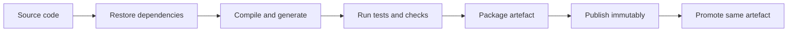

A build is the controlled transformation from source code into a tested artefact that can be promoted through environments. Dependency management is the discipline that makes the same source keep resolving to the same inputs tomorrow, without silently importing broken, vulnerable, or malicious code.

## What Build Tools Actually Do

Build tools are more than command runners. They restore dependencies, compile source, generate code, run tests, package artefacts, publish outputs, and expose enough metadata for CI, IDEs, and release tooling to agree on what happened. A good build is repeatable, fast enough for developers, deterministic enough for releases, and boring enough that failures mean something.



| Responsibility | Examples | Failure if ignored |
|---|---|---|
| Dependency restore | Maven, NuGet, npm, Gradle | Builds depend on a developer machine cache |
| Compilation | Java compiler, TypeScript, MSBuild | CI and local builds disagree |
| Test orchestration | Surefire, Gradle Test, `dotnet test`, npm scripts | Test results are inconsistent or skipped |
| Packaging | JAR, NuGet package, container image, tarball | Deployment receives loose untracked files |
| Publication | Maven repository, npm feed, NuGet feed, container registry | Rollback cannot find the tested artefact |

> [!KEY]
> The senior rule is build once, publish immutably, then promote the same artefact. Rebuilding later in the pipeline makes staging evidence weaker because production may receive different bytes.

## Maven Gradle and Java Builds

Maven standardizes Java builds through conventions and a lifecycle. Running a later phase runs earlier phases: `package` implies validate, compile, and test; `deploy` publishes to a remote repository. Plugins do the actual work, and dependency scopes control where a library appears.

```xml
<project>
  <modelVersion>4.0.0</modelVersion>
  <groupId>com.example</groupId>
  <artifactId>billing-service</artifactId>
  <version>2.4.1</version>
  <properties>
    <maven.compiler.release>21</maven.compiler.release>
  </properties>
  <dependencies>
    <dependency>
      <groupId>org.postgresql</groupId>
      <artifactId>postgresql</artifactId>
      <version>42.7.3</version>
      <scope>runtime</scope>
    </dependency>
  </dependencies>
</project>
```

| Maven scope | Available at compile | Packaged or transitive | Typical use |
|---|---|---|---|
| `compile` | Yes | Yes | normal application libraries |
| `provided` | Yes | No | servlet APIs supplied by runtime |
| `runtime` | No for main compile | Yes at runtime | JDBC drivers |
| `test` | No for main compile | No | JUnit, Mockito, test helpers |

The Maven reactor handles multi-module builds. A parent project with packaging `pom` declares modules; Maven sorts them by dependency order and builds upstream modules first. This is vital in monorepos or layered Java services because a change in a shared module can rebuild and test affected modules consistently.

Gradle uses Groovy or Kotlin DSLs, a task graph, incremental builds, and build cache support. It is more flexible and often faster for complex builds, but that flexibility can turn into custom logic only one expert understands. The Gradle Wrapper and Maven Wrapper pin the build tool version so CI and developers run the same tool.
## NuGet MSBuild and npm Comparisons

Different ecosystems package the same ideas differently. MSBuild evaluates project files, targets, properties, and item groups; `dotnet restore`, `dotnet build`, `dotnet test`, and `dotnet pack` are the common .NET path. NuGet packages carry assemblies and metadata, and `PackageReference` expresses dependencies. npm uses `package.json` scripts, semantic version ranges, and a lockfile to pin the full resolved tree.

```bash
./mvnw -q clean verify
./gradlew test build
dotnet restore --locked-mode
dotnet test --configuration Release
npm ci
npm test
```

| Ecosystem | Build file | Lock or restore control | Package output |
|---|---|---|---|
| Maven | `pom.xml` | explicit versions, repository metadata | JAR, WAR, published Maven artefact |
| Gradle | `build.gradle` or `build.gradle.kts` | dependency locking and version catalogs | JAR, distribution, plugin artefact |
| .NET | `.csproj` and solution files | `packages.lock.json` with locked restore | DLL, NuGet package, publish directory |
| npm | `package.json` | `package-lock.json`, `npm ci` | package tarball or bundled app |

> [!TIP]
> Prefer wrapper scripts such as `mvnw` and `gradlew`, locked restores, and clean CI commands. They remove a whole class of local machine differences.

## Dependency Resolution and Reproducibility

Most dependency risk comes through transitive dependencies: packages your direct dependencies bring with them. Conflict mediation differs by ecosystem. Maven's nearest definition usually wins when two versions conflict, with dependency management used to force alignment. Gradle has rich conflict resolution and often selects newer versions unless constrained. NuGet resolves within target frameworks and can warn on downgrades. npm builds a nested tree and deduplicates where possible, so two versions may coexist.

Version ranges are convenient but risky. `^1.4.0` or `[1.4,2.0)` says future compatible versions are allowed, but compatibility is a promise made by package authors, not physics. Lockfiles record the exact resolved graph so installs can reproduce the same dependency tree.

```bash
mvn dependency:tree
./gradlew dependencies --configuration runtimeClasspath
dotnet list package --include-transitive
npm ls --all
npm ci
```

| Practice | Why it matters |
|---|---|
| Commit lockfiles | Prevents surprise transitive upgrades during a later build |
| Use locked restore in CI | Fails if manifest and lockfile drift |
| Review dependency diffs | Shows new licenses, maintainers, and transitive graph changes |
| Pin critical build plugins | Build behavior changes can be as dangerous as runtime library changes |
| Remove unused dependencies | Shrinks attack surface and conflict space |

> [!WARNING]
> Semantic versioning reduces risk but does not eliminate it. A patch version can still introduce a regression, a compromised package, or a behavior change your tests did not cover.

## Registries Artefacts and Promotion

Private artefact registries provide a controlled boundary between the internet and production. They cache public packages, host internal packages, enforce retention, attach vulnerability results, and keep builds working when an upstream registry has an outage. Mature teams promote artefacts between repositories or stages: snapshot or dev, candidate, staging, production-approved. Promotion changes metadata or registry location; it does not rebuild the artefact.

An immutable tag should include both a human version and traceability, such as `2.4.1-9f3a2c1`, or a content digest for containers. Avoid mutable tags for deployment because they break auditability.

```yaml
build:
  artefact: billing-service
  version: 2.4.1
  commit: 9f3a2c1
  publish:
    repository: candidate
    immutable: true
scan:
  sbom: true
  vulnerabilities:
    fail_on:
      - critical
      - high
promote:
  from: candidate
  to: production-approved
  rebuild: false
```

Secrets do not belong in builds. Do not pass credentials through Docker build args, write them into generated files, or echo masked variables for debugging. Prefer short-lived federated credentials for publishing to registries, and fetch runtime secrets at deployment or startup from a secret manager rather than baking them into artefacts.
## Caching Monorepos and Supply Chain

Build caching saves work by reusing outputs when inputs have not changed. Incremental builds skip unaffected tasks locally; remote caches share results across CI workers. The hard part is the cache key: it must include source files, lockfiles, compiler versions, environment-sensitive flags, and generated inputs. A bad cache is worse than no cache because it returns stale artefacts confidently.

Monorepos make cross-project changes atomic and enable affected-project builds, but they need strong tooling to avoid rebuilding everything. Polyrepos give independent lifecycles and smaller clones, but cross-repository changes require versioning and sequencing discipline.

Supply-chain controls make dependency trust explicit. SBOMs list what is inside the artefact. Provenance records who built it, from which commit, with which workflow. Vulnerability scanning belongs early enough to block known bad packages and late enough to scan the packaged artefact. Dependency confusion is prevented by scoping private package names and forcing internal packages to resolve only from private feeds. Typosquatting is reduced by review, allowlists, and automated dependency policies.

| Concern | Control |
|---|---|
| Vulnerable transitive package | Dependency and artefact scanning with blocking thresholds |
| Dependency confusion | Private scopes, registry pinning, no fallback for internal names |
| Typosquatting | Human review of new package names and publisher reputation |
| Unknown contents | SBOM generated at build and stored with artefact |
| Untrusted build | Provenance attestation tied to commit and workflow identity |
| Stale caches | Lockfile and compiler inputs included in cache keys |

> [!DANGER]
> Never let a production deploy depend on resolving a new package version from the public internet. CI should resolve, lock, scan, publish, and promote controlled artefacts before deployment.

Secrets are part of the build boundary because build systems often have permission to fetch private packages and publish artefacts. Use short-lived identity for those actions and scope tokens to one repository or feed where possible. A secret that appears in a build log, generated config file, layer history, or published package must be treated as exposed and rotated. Masking helps with accidental display, but it is not a security boundary if a script can transform and print the value.

Vulnerability scanning should be policy-driven rather than noisy. A useful policy names severities that block, severities that create tickets, allowed exception duration, and the owner responsible for accepting residual risk. Otherwise scanners become background noise and teams learn to ignore them. The point is not to reach zero findings forever; it is to prevent known, fixable, high-impact issues from entering promoted artefacts unnoticed.

Reproducibility also includes the build environment itself. Compiler versions, base images, operating system packages, locale, timezone-sensitive tests, and generated files can all change outputs. Containerized builders, pinned toolchains, and explicit environment variables reduce that drift. If two builds from the same commit differ, the team should be able to explain whether the difference is expected metadata or a real reproducibility bug.

## Cheat sheet

- A build tool restores, compiles, tests, packages, and publishes; it is not just a script launcher.
- Maven lifecycle phases run in order, and plugins do the actual work bound to phases.
- Maven scopes decide compile, test, runtime, and transitive visibility.
- The Maven reactor builds multi-module projects in dependency order.
- Gradle is flexible and cache-friendly; the wrapper pins the tool version.
- NuGet, MSBuild, and npm solve the same lifecycle and dependency problems with ecosystem-specific files.
- Lockfiles and locked restore make tomorrow's dependency graph match today's tested graph.
- Transitive dependency conflicts require explicit mediation, not hope.
- Publish immutable artefacts and promote them; do not rebuild per environment.
- Private registries reduce upstream outage, dependency confusion, and governance risk.
- Build caching must be keyed on all real inputs or it returns stale outputs.
- SBOM, provenance, and vulnerability scanning are supply-chain controls, not paperwork.

## Common mistakes

| Mistake | Fix |
|---|---|
| Rebuilding separately for staging and production | Build once, publish immutably, promote the same artefact |
| Ignoring transitive dependencies | Inspect dependency trees and scan the packaged artefact |
| Using version ranges without lockfiles | Commit lockfiles and use locked restore in CI |
| Treating Maven and Gradle wrappers as optional | Use wrappers so everyone runs the same build tool version |
| Publishing internal packages only to public registries | Use private feeds and scoped names |
| Passing secrets as build arguments | Use federated publish credentials and runtime secret lookup |
| Trusting cache hits without correct keys | Include lockfiles, tool versions, source, flags, and generated inputs |

## Summary

Build and dependency management create the supply chain for your software. The core habits are stable tool versions, locked dependency graphs, explicit conflict resolution, immutable artefacts, private registries, and promotion without rebuilding. Once those are in place, caching, monorepo tooling, SBOMs, provenance, and vulnerability scanning improve speed and safety without weakening reproducibility.

## Top Interview Questions

### Q1. What does a build tool actually do beyond compiling code?

A build tool coordinates the whole transformation from source to deliverable artefact. It restores dependencies, invokes compilers and code generators, runs tests and static checks, packages outputs, publishes artefacts, and exposes a repeatable lifecycle for local development and CI. In larger systems it also understands module dependencies, incremental work, and cacheability. The senior point is that the build becomes part of the product's reliability story. If the build is nondeterministic, depends on a developer laptop, or silently skips tests, every downstream deployment practice is weaker because nobody can prove what bytes were produced or why.

### Q2. Explain the Maven lifecycle and what happens when you run `mvn package`.

Maven has ordered lifecycle phases such as validate, compile, test, package, verify, install, and deploy. Plugins bind goals to those phases, so Maven itself provides the structure while plugins do the work. When you run `mvn package`, Maven runs all earlier phases needed to package the project: it validates the project, compiles source, compiles and runs tests by default, then creates the configured artefact such as a JAR or WAR. In a multi-module build, the reactor determines module order so dependencies are built before dependents. Running `deploy` goes further and publishes the artefact to a remote repository.

### Q3. What are Maven dependency scopes, and why do they matter?

Scopes define where a dependency is visible. `compile` is the default and is available to main code, tests, runtime, and consumers. `provided` is needed at compile time but supplied by the runtime, such as a servlet API in a container, so it should not be packaged. `runtime` is not needed to compile main code but is needed when running, like a JDBC driver. `test` is only for test compilation and execution. Scope mistakes often pass locally because IDEs are generous, then fail in CI or production when a class is missing or a test library accidentally ships in a runtime artefact.

### Q4. How does dependency conflict resolution differ across ecosystems?

Maven commonly uses nearest-wins mediation: the version closest to the project in the dependency tree wins, with `dependencyManagement` used to force versions across modules. Gradle has richer resolution rules and often selects newer versions unless constraints or platforms specify otherwise. NuGet resolves by target framework and package rules and can warn about downgrades. npm can install nested copies, so multiple versions may coexist, then deduplicate when possible. The practical answer is to inspect the resolved graph with ecosystem tools, enforce constraints for critical libraries, and avoid assuming that declaring a direct dependency automatically controls every transitive path.

### Q5. Why are lockfiles important for reproducible builds?

Manifests describe allowed dependencies, while lockfiles record the exact resolved dependency graph, including transitive versions and integrity metadata. Without a lockfile, a build tomorrow can resolve a newer transitive version even when source code did not change. That creates the classic failure where yesterday's green commit breaks during a release because the dependency universe moved. Lockfiles make CI fail when the manifest and lock disagree, and they let reviewers see exactly what dependency changes are entering the system. They are not a substitute for scanning or tests, but they make those checks apply to a stable input set.

### Q6. What is semantic versioning, and what are the risks of version ranges?

Semantic versioning uses `MAJOR.MINOR.PATCH`: patch for backward-compatible fixes, minor for backward-compatible features, and major for breaking changes. Version ranges let a project accept future versions believed to be compatible, such as all minor updates within a major version. The risk is that compatibility is a convention, not a guarantee. A patch can regress behavior, include a vulnerable transitive dependency, or be compromised. Ranges are acceptable when paired with lockfiles, tests, and review of dependency updates. For production releases, deploy the resolved, locked, scanned graph rather than resolving fresh during deployment.

### Q7. How do private artefact registries improve reliability and security?

Private registries cache public dependencies, host internal packages, enforce access control, keep retention history, and attach metadata such as scan results. They improve reliability because builds do not depend directly on public registry availability at deploy time. They improve security because internal package names can be scoped to private feeds, reducing dependency confusion, and because organizations can block known vulnerable or unapproved packages centrally. They also support promotion workflows: publish once to a candidate repository, scan and test it, then promote the same artefact to a production-approved repository without rebuilding. That gives auditability and rollback options.

### Q8. What is the difference between build caching and incremental builds?

Incremental builds skip work within a workspace when inputs for a task have not changed, such as not recompiling an unchanged module. Build caching stores task outputs and reuses them later, possibly across machines in a remote cache, when the cache key says inputs match. Both speed feedback, but both depend on correct input tracking. If compiler flags, generated sources, environment variables, lockfiles, or tool versions are missing from the key, the build can reuse stale outputs and produce incorrect artefacts. A senior answer treats cache correctness as more important than cache hit rate.

### Q9. How do monorepos and polyrepos change build strategy?

A monorepo enables atomic cross-project changes and shared tooling, but without affected-project analysis it can become painfully slow because every change appears to require rebuilding everything. Good monorepo builds understand dependency graphs, cache aggressively, and test only affected projects plus their dependents. Polyrepos give teams independent release cadence and smaller repository scope, but cross-service changes require versioning, sequencing, and compatibility discipline. The build strategy follows the repository shape: monorepos need graph-aware tooling and remote caching, while polyrepos need strong package versioning, contract tests, and promotion across repositories.

### Q10. Where do SBOMs, provenance, and vulnerability scanning fit in the pipeline?

They belong around the build artefact, not as an afterthought during manual deployment. The build should restore a locked dependency graph, compile and test, create the package or image, generate an SBOM listing included components, record provenance tying the artefact to commit, builder, and workflow identity, then scan dependencies and the final artefact for known vulnerabilities. Policy can fail the build on high severity issues or require an exception with an owner and expiry. This gives security teams evidence about what shipped and gives operators a fast way to answer whether a newly disclosed vulnerability affects a deployed artefact.