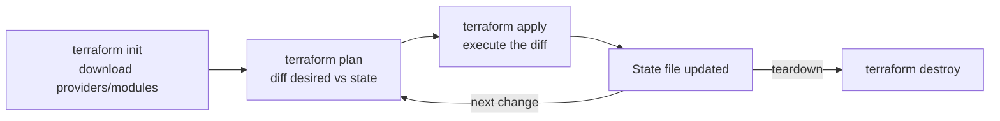

Terraform's entire value proposition rests on one idea — you declare the state you want, and a plan/apply cycle figures out the diff — so most interview questions are really testing whether you understand *how that diff is computed* and what can go wrong when it's wrong. This page covers the desired-state model, the HCL building blocks, and the plan-reading skill that separates someone who's used Terraform from someone who trusts it in production.

## Declarative IaC and the desired-state model

Terraform is **declarative**: you describe the end state you want (a VM, a subnet, three replicas of a queue), not the steps to get there. Terraform compares that desired state against the last-known **state file** and the real infrastructure, computes a diff, and executes only the operations needed to close the gap. This is fundamentally different from an imperative script that runs the same commands every time regardless of current reality.

> [!KEY]
> The state file is Terraform's memory of "what I last created." Without it (or with a stale one), Terraform cannot correctly compute a diff — this is why state management, covered on the next page, is not optional plumbing.

## Providers and provider versioning

A **provider** is a plugin that translates HCL resource blocks into API calls for a specific platform (AWS, Azure, GitHub, Datadog). Providers ship independently of Terraform core and evolve their own resource schemas, so pinning versions matters — an unpinned provider can silently change a resource's default behaviour between runs.

```hcl
terraform {
  required_version = ">= 1.7.0"
  required_providers {
    azurerm = {
      source  = "hashicorp/azurerm"
      version = "~> 3.90"
    }
  }
}

provider "azurerm" {
  features {}
}
```

> [!WARNING]
> `version = ">= 3.0"` with no upper bound means a future major version bump can silently change resource behaviour on your next `apply`. Use `~>` (pessimistic constraint) to allow patch/minor upgrades only.

## Resources vs data sources

| | Resource | Data source |
|---|---|---|
| Keyword | `resource` | `data` |
| Owns the object? | Yes — Terraform creates/updates/destroys it | No — read-only reference to something that already exists |
| Appears in plan as | create/update/destroy | Always "read" |
| Typical use | A VM, a database, a subnet you manage | An existing VPC, an AMI lookup, a shared resource another team owns |

```hcl
# Data source: read an existing resource, don't manage it
data "azurerm_resource_group" "shared" {
  name = "shared-network-rg"
}

# Resource: Terraform owns this and will create/update/destroy it
resource "azurerm_subnet" "app" {
  name                 = "app-subnet"
  resource_group_name  = data.azurerm_resource_group.shared.name
  virtual_network_name = "shared-vnet"
  address_prefixes     = ["10.0.1.0/24"]
}
```

## Variables, locals, outputs, and expressions

**Variables** are inputs (parameterise a module without editing it). **Locals** are computed values used to avoid repetition. **Outputs** expose values to the caller (a parent module, or a human running `terraform output`).

```hcl
variable "environment" {
  type    = string
  default = "staging"
}

locals {
  name_prefix = "checkout-${var.environment}"
  common_tags = {
    environment = var.environment
    managed_by  = "terraform"
  }
}

output "app_url" {
  value = "https://${local.name_prefix}.internal"
}
```

HCL has a small functional expression language — string interpolation, conditionals, and built-in functions (`length()`, `lookup()`, `coalesce()`, `jsonencode()`) — evaluated at plan time, not a general-purpose language.

## count vs for_each — and why for_each is usually right

Both create multiple instances of a resource from one block, but they index differently, and that difference has real consequences when the list changes.

| | `count` | `for_each` |
|---|---|---|
| Indexed by | Position (0, 1, 2…) | A stable key (map key or set element) |
| Removing item #2 of 5 | Everything after index 2 shifts and gets recreated | Only the removed key is destroyed; others untouched |
| Good for | A fixed number of identical resources | A named, order-independent set of resources |
| Reference syntax | `aws_instance.web[0]` | `aws_instance.web["primary"]` |

```hcl
# for_each: removing "eu-west" from this map destroys only that one resource
variable "regions" {
  default = {
    "us-east" = "10.0.1.0/24"
    "eu-west" = "10.0.2.0/24"
  }
}

resource "aws_subnet" "regional" {
  for_each   = var.regions
  cidr_block = each.value
  tags       = { region = each.key }
}
```

> [!TIP]
> Say it exactly like this in an interview: "`count` indexes by position, so removing an item from the middle of a list shifts every subsequent index and recreates it. `for_each` indexes by key, so removing one item only touches that one." That's the whole answer.

## Dependencies — implicit and explicit

Terraform builds a dependency graph automatically whenever one resource's argument references another's attribute (**implicit dependency**) — no extra syntax needed, and this is the preferred form because it's self-documenting and lets Terraform parallelise unrelated resources. Occasionally a dependency exists that isn't visible in any argument (an IAM policy that must exist before an app can start, even though no argument references it) — that requires an explicit `depends_on`.

```hcl
resource "aws_iam_role_policy" "app" {
  # ...
}

resource "aws_instance" "app" {
  # No argument references the policy, but the app needs it at boot
  depends_on = [aws_iam_role_policy.app]
  # ...
}
```

## The init / plan / apply / destroy lifecycle



`init` downloads providers and modules and sets up the backend. `plan` computes and displays the diff without touching real infrastructure. `apply` executes exactly that diff and updates state. `destroy` computes and executes the diff toward "nothing exists."

## Reading a plan diff safely

Every planned change falls into one of four categories, shown with a `+`/`-`/`~` symbol:

| Symbol | Meaning | Risk |
|---|---|---|
| `+` create | New resource, nothing existing touched | Low |
| `~` update in place | Existing resource modified without replacement | Usually low — check what field |
| `-/+` destroy and recreate | Existing resource destroyed, then a new one created in its place | High — data loss for stateful resources |
| `-` destroy | Resource removed entirely | High — confirm it's intentional |

> [!DANGER]
> The plan line to read twice, every time: `-/+ destroy and recreate`. This happens when you change an argument that Terraform (or the provider schema) considers force-new — for example changing a database's `identifier` or an EC2 instance's `availability_zone`. For anything stateful, this means data loss unless you've planned a migration. Never `apply` a plan with an unexpected recreate without reading exactly which argument triggered it (`# forces replacement` is printed next to it).

## Lifecycle meta-arguments

```hcl
resource "aws_db_instance" "primary" {
  # ...
  lifecycle {
    prevent_destroy       = true   # refuse to destroy, even via `terraform destroy`
    create_before_destroy = true   # for stateless resources: stand up the new one first
    ignore_changes         = [tags["last_modified_by"]]  # ignore drift on this one field
  }
}
```

- `prevent_destroy` — a safety rail on irreplaceable resources (production databases); Terraform refuses the destroy and errors out.
- `create_before_destroy` — flips the default destroy-then-create order to create-then-destroy, avoiding downtime on a forced replacement (only safe if the old and new can coexist, e.g. behind a load balancer).
- `ignore_changes` — tells Terraform to stop reporting drift on specific attributes that are legitimately changed outside Terraform (e.g. an autoscaler adjusting a replica count).

## Worked example

```hcl
resource "azurerm_resource_group" "app" {
  name     = "${local.name_prefix}-rg"
  location = "westeurope"
  tags     = local.common_tags
}

resource "azurerm_service_plan" "app" {
  name                = "${local.name_prefix}-plan"
  resource_group_name = azurerm_resource_group.app.name   # implicit dependency
  location            = azurerm_resource_group.app.location
  os_type             = "Linux"
  sku_name            = "P1v3"
}

resource "azurerm_linux_web_app" "app" {
  name                = local.name_prefix
  resource_group_name = azurerm_resource_group.app.name
  location            = azurerm_service_plan.app.location
  service_plan_id     = azurerm_service_plan.app.id

  site_config {}

  lifecycle {
    ignore_changes = [tags["deployed_at"]]
  }
}
```

## Cheat sheet

- Terraform is declarative: you state desired end-state, it computes the diff against the state file.
- `resource` blocks are owned and managed; `data` blocks are read-only references to things you don't manage.
- Pin provider versions with `~>` — unbounded constraints let a future major version change behaviour silently.
- Prefer `for_each` (keyed) over `count` (positional) whenever the collection can shrink or reorder — it avoids cascading recreates.
- Implicit dependencies (via attribute references) are preferred; use `depends_on` only when no argument expresses the real dependency.
- `plan` never touches infrastructure; always read it before `apply`, especially any `-/+ destroy and recreate`.
- `prevent_destroy` on irreplaceable resources; `create_before_destroy` to avoid downtime on forced replacement; `ignore_changes` for legitimate external drift.
- The state file is not optional context — it is how Terraform knows what it already created.

## Common mistakes

| Mistake | Fix |
|---|---|
| Using `count` for a named, order-independent set of resources | Use `for_each` with a map/set to avoid cascading recreates on removal |
| Applying without reading the plan | Always review, especially `-/+` lines and what "forces replacement" |
| No version constraint on providers | Pin with `~>` so upgrades are intentional, not silent |
| Using `depends_on` everywhere "to be safe" | Prefer implicit dependencies via attribute references; they're clearer and parallelise better |
| No `prevent_destroy` on production data stores | Add it as a safety rail against an accidental `destroy` or forced replacement |
| Fighting `ignore_changes` needed for autoscaler-managed fields | Ignore only the specific field drifting, not the whole resource |

## Summary

Terraform's declarative model means you describe desired state and let plan/apply compute and execute the diff against the state file — which makes the state file itself a first-class thing to protect, not an implementation detail. `for_each` over `count` avoids cascading recreates when a collection shrinks, implicit dependencies should be preferred over `depends_on`, and reading a plan diff — especially spotting an unexpected `-/+ destroy and recreate` on a stateful resource — is the single most practically important Terraform skill. Lifecycle meta-arguments (`prevent_destroy`, `create_before_destroy`, `ignore_changes`) exist specifically to prevent the most common ways this all goes wrong in production.

## Top Interview Questions

### Q1. What does it mean that Terraform is "declarative", and how is that different from a script?

Declarative means you describe the end state you want — this VM should exist, with this size, in this subnet — and Terraform figures out what operations are needed to get from the current state to that end state. An imperative script instead describes the steps to take, and typically has to be written defensively to handle "already exists" cases if run twice. Terraform's plan step is what makes this concrete: it diffs your declared configuration against the last-known state file and the real infrastructure, then shows you exactly what it intends to create, change or destroy before doing anything — a script has no equivalent dry-run by default.

### Q2. What's the difference between a `resource` block and a `data` block?

A `resource` block is something Terraform owns end-to-end — it will create it, update it in place when the config changes, and destroy it if the block is removed. A `data` block is a read-only lookup of something that already exists, which Terraform never creates or destroys — it's how you reference infrastructure managed elsewhere (a shared VPC another team owns, an AMI ID, an existing DNS zone) without taking ownership of it. In the plan output, a resource can show create/update/destroy; a data source only ever shows as a read.

### Q3. Explain the difference between `count` and `for_each`, and why is `for_each` usually preferred?

`count` creates N copies of a resource indexed by numeric position (0, 1, 2…), while `for_each` creates one copy per key in a map or set, indexed by that stable key. The practical difference shows up when the collection changes: with `count`, removing the third item out of five shifts every subsequent index down by one, and Terraform sees that as destroying and recreating every shifted resource, not just the one you removed. With `for_each`, removing one key only affects that one resource — everything else is untouched, because the key, not the position, defines identity. `for_each` is the better default any time the set of resources could change size or order; `count` is fine only for a genuinely fixed number of identical, order-independent resources.

### Q4. What's the difference between an implicit and an explicit dependency in Terraform?

An implicit dependency is created automatically whenever one resource's configuration references another resource's attribute — Terraform parses that reference and knows resource B must be created after resource A. This is the preferred, default mechanism because it's self-documenting and lets Terraform parallelise everything that isn't actually dependent. An explicit dependency, declared with `depends_on`, is needed only when a real ordering requirement exists that isn't visible in any argument — for example, an application needing an IAM policy to exist before it boots, even though no argument in the compute resource references the policy. Overusing `depends_on` when an implicit dependency would do makes the configuration harder to read and can unnecessarily serialise resources that could have run in parallel.

### Q5. Walk me through what `terraform plan` and `terraform apply` each actually do.

`terraform plan` reads the current configuration, the state file (Terraform's record of what it last created), and optionally refreshes against real infrastructure, then computes and displays the exact set of creates, updates and destroys needed to reconcile desired state with current state — without making any real change. `terraform apply` executes precisely that plan (or recomputes an equivalent one if none was saved) against the real infrastructure via the provider's API, then updates the state file to reflect the new reality. The critical property is that `plan` is a pure, side-effect-free preview — it's always safe to run, which is why "did you read the plan" is a reasonable production gate before every `apply`.

### Q6. You run `terraform plan` and see `-/+ destroy and recreate` on a production database. What does that mean and what would you do?

It means the change you made to that resource's configuration touches an argument the provider considers "force-new" — one that can't be updated in place, so Terraform's only way to apply it is to destroy the existing resource and create a new one with the new configuration. For a stateful resource like a database, this means data loss unless there's a migration plan, so I would not apply it as-is. I'd look at exactly which argument triggered it (Terraform prints `# forces replacement` next to that line), check if there's an alternative way to express the change that updates in place, and if replacement is genuinely unavoidable, plan an explicit backup/restore or blue-green migration rather than letting `apply` silently destroy the live database.

### Q7. What do `prevent_destroy`, `create_before_destroy`, and `ignore_changes` each do, and when would you use them?

`prevent_destroy = true` makes Terraform refuse to destroy that resource under any circumstance, including a plan that would otherwise recreate it — I'd put this on production databases or anything irreplaceable, as a safety rail against both accidental `terraform destroy` and an unnoticed forced replacement. `create_before_destroy = true` flips the default order for a forced replacement so the new resource is created before the old one is torn down, which avoids downtime — but it only works if old and new can coexist briefly (unique names, no hard resource limits) which isn't always true. `ignore_changes` tells Terraform to stop treating specific attributes as drift, which I'd use for fields legitimately modified outside Terraform, like a replica count an autoscaler adjusts — without it, every plan would show a spurious "revert this back" change.

### Q8. Why does provider version pinning matter, and what's wrong with `version = ">= 3.0"`?

Providers evolve independently of Terraform core and can change resource schemas, default values, or even required arguments between major versions. `version = ">= 3.0"` has no upper bound, so the next time someone runs `terraform init` without a lock file (or updates it), they could silently pull in a new major version whose behaviour differs from what was tested — a default that changed, an argument that became required, a resource that got renamed. I'd use a pessimistic constraint like `~> 3.90` to allow patch and minor upgrades (which should be backward compatible per semver) while requiring a deliberate, reviewed change to adopt a new major version, combined with committing the `.terraform.lock.hcl` file so everyone resolves to the exact same provider build.

### Q9. What's the difference between a variable, a local, and an output?

A variable is an input to the configuration — a parameter the caller (a human, a CI pipeline, or a parent module) supplies to customise behaviour without editing the code, often with a type and default. A local is a computed, internal value used to avoid repeating an expression multiple times in the same configuration — it's not settable from outside and exists purely for readability and DRY-ness. An output exposes a value from this configuration to whoever calls it — a parent module reading a child module's output, or a human running `terraform output` after apply — and is the only way information flows back out of a module boundary.

### Q10. A colleague wants to add ten near-identical S3 buckets using `count` with an index like `count.index`. What would you suggest instead, and why?

I'd suggest `for_each` over a map or set of bucket names instead of `count`, because `count` ties each resource's identity to its position in the list. If someone later needs to remove the third bucket from that list of ten, `count` will see every bucket after index 3 shift down by one position and plan to destroy and recreate all seven of them — even though logically only one bucket should be removed. With `for_each` keyed by bucket name, removing one entry from the map only destroys that specific bucket; the rest are entirely unaffected by the plan. The only real reason to still reach for `count` is a genuinely fixed, order-independent quantity where you'll never selectively add or remove from the middle.

### Q11. How would you safely roll out a change that Terraform reports will force-replace a resource with real user traffic on it, like a compute instance behind a load balancer?

I'd add `create_before_destroy = true` in the resource's `lifecycle` block so Terraform provisions the replacement instance before tearing down the old one, avoiding the default destroy-then-create gap that would otherwise drop capacity. This only works if the two can coexist — unique naming, no hard quota or uniqueness constraint blocking a duplicate — and if the load balancer or service registry picks up the new instance and drains the old one gracefully, so I'd confirm the resource's associated health-check/registration logic handles both being briefly present together. If the resource genuinely can't coexist with itself (a fixed IP, a singleton), I'd treat it as a manual, carefully sequenced migration outside a single `apply`, rather than trusting `create_before_destroy` to paper over a hard constraint.

### Q12. Why is `terraform plan` considered safe to run at any time, but `terraform apply` is not?

`plan` is read-only by design — it reads the current configuration, refreshes its view of real infrastructure via the provider's read APIs, and computes a diff against the state file, but it never calls a create/update/delete API and never writes to the state file. That makes it safe to run repeatedly, in CI on every pull request, or by anyone investigating drift, with zero risk of changing anything. `apply` executes real create/update/delete calls against live infrastructure and then writes the new state — which is why production pipelines gate `apply` behind a review of the corresponding `plan` output, and why `prevent_destroy` and careful handling of `-/+` lines matter specifically at the `apply` step, not the `plan` step.
