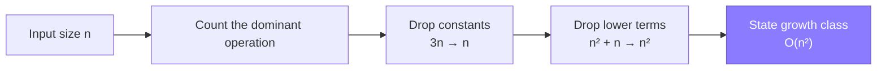
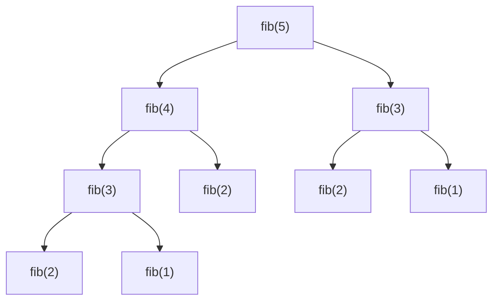

Complexity analysis is the language interviewers use to decide whether your solution is "good". You will be asked for the complexity of *every* solution you write, so it needs to be automatic — not something you derive nervously at the end.

## Why interviewers ask this

Stating complexity proves three things at once:

1. You understand what your own code actually does.
2. You can compare two designs without running them.
3. You know when to stop optimising — a senior signal.

> [!KEY]
> The phrase interviewers wait for is: *"This is O(n log n) time and O(n) space because …"* — the **because** matters more than the letters.

## The mental model

Big-O describes how cost **grows** as input grows. It ignores constants and lower-order terms, because those stop mattering as `n` gets large.



### The three notations

| Notation | Means | Interview usage |
|---|---|---|
| `O(f)` | Upper bound — "grows no faster than" | What you almost always state |
| `Ω(f)` | Lower bound — "grows at least as fast as" | Rare; useful for proving a problem is hard |
| `Θ(f)` | Tight bound — both | Say this when the bound is exact |

In practice, say **O(...)** and mean **Θ(...)**. Nobody will correct you.

Formally, `T(n) = O(f(n))` means there exist constants `c > 0` and `n₀ > 0` such that `T(n) ≤ c · f(n)` for all `n ≥ n₀` — i.e. beyond some point, `f` dominates `T` up to a constant factor. Visually, the algorithm's actual cost curve stays under a scaled copy of `f(n)` once `n` is large enough:


The same three letters are often mapped onto the three "cases" of an algorithm's behaviour: **best case** is usually expressed as `Ω`, **worst case** as `O`, and **average case** as `Θ`. Insertion sort, for example, is `Ω(n)` best case (already sorted), `O(n²)` worst case (reverse sorted), and `Θ(n²)` on average over random inputs.

## The growth hierarchy

From cheapest to most expensive:

```text
O(1) < O(log n) < O(√n) < O(n) < O(n log n) < O(n²) < O(n³) < O(2ⁿ) < O(n!)
```

| Complexity | n = 10 | n = 1,000 | n = 1,000,000 | Typical source |
|---|---|---|---|---|
| `O(1)` | 1 | 1 | 1 | Hash lookup, array index |
| `O(log n)` | 3 | 10 | 20 | Binary search, balanced tree |
| `O(n)` | 10 | 10³ | 10⁶ | Single pass, hash build |
| `O(n log n)` | 33 | 10⁴ | 2×10⁷ | Sorting, heap of n items |
| `O(n²)` | 100 | 10⁶ | 10¹² ❌ | Nested loops, naive pair check |
| `O(2ⁿ)` | 1,024 | 💀 | 💀 | Subsets, naive recursion |
| `O(n!)` | 3.6M | 💀 | 💀 | Permutations |

## Reading constraints as hints

This is the single highest-leverage trick in a coding round. The constraint tells you the target complexity **before you start thinking**.

| Constraint on n | Target complexity | What to reach for |
|---|---|---|
| n ≤ 10 | `O(n!)` | Permutations, full backtracking |
| n ≤ 20–25 | `O(2ⁿ)` | Subsets, bitmask DP |
| n ≤ 400–500 | `O(n³)` | Floyd–Warshall, interval DP |
| n ≤ 5,000 | `O(n²)` | 2-D DP, all-pairs loops |
| n ≤ 10⁵–10⁶ | `O(n log n)` or `O(n)` | Sort, heap, sliding window, hashing |
| n ≤ 10⁹ | `O(log n)` or `O(1)` | Binary search on answer, maths |

> [!TIP]
> Say this out loud: *"n is up to 10⁵, so an O(n²) solution is about 10¹⁰ operations — too slow. I need O(n log n) or better."* That sentence alone signals seniority.

Rule of thumb: a modern machine does roughly **10⁸ simple operations per second** in an interview-grade language.

## How to analyse code quickly

### 1. Loops multiply, sequences add

```java
// O(n) + O(m)  →  O(n + m)      — sequential
for (int i = 0; i < n; i++) { /* ... */ }
for (int j = 0; j < m; j++) { /* ... */ }

// O(n) * O(m)  →  O(n * m)      — nested
for (int i = 0; i < n; i++)
    for (int j = 0; j < m; j++) { /* ... */ }
```

### 2. Halving means log

```java
// Each step halves the search space → O(log n)
while (lo < hi) {
    int mid = lo + (hi - lo) / 2;
    if (check(mid)) hi = mid; else lo = mid + 1;
}
```

### 3. Watch hidden costs inside loops

```java
// Looks O(n). Actually O(n²) — contains on a List is O(n).
for (int x : items)
    if (list.contains(x)) count++;

// O(n) — HashSet lookup is O(1)
Set<Integer> set = new HashSet<>(list);
for (int x : items)
    if (set.contains(x)) count++;
```

> [!DANGER]
> The classic interview trap: `String` concatenation in a loop. In Java, strings are immutable, so `s += c` inside a loop is **O(n²)**. Use `StringBuilder`.

### 4. Recursion: count nodes in the call tree

Cost = **(number of calls) × (work per call)**.



Branching factor 2, depth n → `O(2ⁿ)` calls. Memoising collapses this to `O(n)` because each distinct subproblem is computed once.

### The Master Theorem (light version)

For `T(n) = a·T(n/b) + O(n^d)`:

| Condition | Result | Example |
|---|---|---|
| `d > log_b(a)` | `O(n^d)` | Binary tree with O(n) merge per level... |
| `d = log_b(a)` | `O(n^d log n)` | Merge sort: `2T(n/2) + O(n)` → `O(n log n)` |
| `d < log_b(a)` | `O(n^log_b(a))` | Naive `2T(n/2) + O(1)` → `O(n)` |

You rarely need this formally — but knowing merge sort is `O(n log n)` *because each of log n levels does O(n) work* is a great explanation.

Quick recognitions for `T(n) = a·T(n/b) + f(n)`: merge sort (`a=2, b=2, f=Θ(n)`) lands on the middle case → `Θ(n log n)`; binary search (`a=1, b=2, f=Θ(1)`) also lands on the middle case with `log_b a = 0` → `Θ(log n)`; Strassen's matrix multiplication (`a=7, b=2, f=Θ(n²)`) falls in the first case → `Θ(n^2.81)`, beating the naive `Θ(n³)`.

## Space complexity

Count **extra** memory you allocate, not the input.

| Source | Space |
|---|---|
| Few variables | `O(1)` |
| Hash map / set of all items | `O(n)` |
| 2-D DP table | `O(n·m)` |
| Recursion on a balanced tree | `O(log n)` stack |
| Recursion on a skewed tree / linked list | `O(n)` stack |
| Output array (often excluded) | `O(n)` — say "excluding output" |

> [!WARNING]
> Recursion stack depth counts as space. A recursive DFS on a 10⁶-node linked list is `O(n)` space **and will stack-overflow**. Mention this; it is a senior-level observation.

## Amortised complexity

Some operations are occasionally expensive but cheap on average.

| Operation | Occasional / worst cost | Common bound | Why |
|---|---|---|---|
| `ArrayList.add` / dynamic array push | `O(n)` (resize) | `O(1)` amortised | Growth by ~1.5x means resizes are rare |
| Hash map insert | `O(n)` (resize or all collide) | `O(1)` average, amortised over resizes | Average depends on hash distribution; resize cost is spread over many inserts |
| Hash map lookup | `O(n)` (all collide) | `O(1)` average, not amortised | There is no resize to smooth out — the bound depends on a well-distributed hash |
| Union-Find find/union (path compression + rank) | — | `O(α(n))` amortised ≈ `O(1)` | Inverse Ackermann |

Saying *"amortised O(1), worst case O(n) on resize"* is a strong differentiator — and so is distinguishing amortised bounds (cost smoothed over a sequence) from average-case bounds (cost averaged over input/hash distributions).

## Worked example: optimise a brute force

**Problem:** given an array, does any pair sum to a target?

| Approach | Time | Space | Notes |
|---|---|---|---|
| Check every pair | `O(n²)` | `O(1)` | Fine for n ≤ 5,000 |
| Sort + two pointers | `O(n log n)` | `O(1)` | Destroys original order |
| Hash set of complements | `O(n)` | `O(n)` | Best if extra space is allowed |

```java
// O(n) time, O(n) space
public boolean hasPairWithSum(int[] nums, int target) {
    Set<Integer> seen = new HashSet<>();
    for (int x : nums) {
        if (seen.contains(target - x)) return true;
        seen.add(x);
    }
    return false;
}
```

The narration that earns points: *"Brute force is O(n²). I can trade space for time — one pass with a hash set of complements gives O(n) time and O(n) space. If memory were constrained, I'd sort and use two pointers for O(n log n) time and O(1) space."*

## Complexity of common operations

| Structure | Access | Search | Insert | Delete | Notes |
|---|---|---|---|---|---|
| Array | `O(1)` | `O(n)` | `O(n)` | `O(n)` | `O(log n)` search if sorted |
| Dynamic array | `O(1)` | `O(n)` | `O(1)`* | `O(n)` | *amortised at the end |
| Linked list | `O(n)` | `O(n)` | `O(1)`† | `O(1)`† | †given the node |
| Hash map | — | `O(1)`* | `O(1)`* | `O(1)`* | *average; `O(n)` worst |
| Balanced BST | `O(log n)` | `O(log n)` | `O(log n)` | `O(log n)` | Sorted order for free |
| Heap | `O(1)` peek | `O(n)` | `O(log n)` | `O(log n)` | Build from array is `O(n)` |
| Trie | — | `O(L)` | `O(L)` | `O(L)` | L = key length |

## Edge cases and invariants

Complexity is only half of "is this solution correct and fast" — the other half is a habit of checking the same handful of edge cases and invariants before you call the code done.

**Input edge cases to check every time:**

- Empty collection or `null` input
- Single element
- All elements identical
- Already sorted, ascending and descending
- Integer overflow — switch to `long` once `n` and the values multiplied can exceed ~2×10⁹
- Negative numbers where the algorithm implicitly assumed only positives

**Loop invariant checklist**, useful for convincing yourself (and the interviewer) that a loop is correct rather than "probably correct":

1. What is true immediately before the first iteration?
2. Is that same statement still true after each iteration (does the loop *maintain* it)?
3. Does it still hold at termination, and does that give you the answer?

> [!TIP]
> This three-step checklist is literally how you prove a binary search or a two-pointer sweep correct on a whiteboard — state the invariant once, then show it survives one iteration.

## Cheat sheet

- **Always state time *and* space**, and say *why*.
- **Read the constraints first** — they hand you the target complexity.
- **Drop constants and lower-order terms**: `O(3n² + 5n + 100)` → `O(n²)`.
- **Loops nest → multiply. Loops in sequence → add.**
- **Halving → `log n`. Branching by 2 to depth n → `2ⁿ`.**
- **Recursion stack is space.** Balanced tree `O(log n)`, skewed `O(n)`.
- **Hash map = O(1) average, O(n) worst.** Say "average".
- **Building a heap from an array is O(n)**, not `O(n log n)`.
- **Sorting is `O(n log n)`** for comparison sorts; counting/radix can be `O(n + k)`.
- **≈10⁸ operations/second** is the budget to reason against.

## Common mistakes

| Mistake | Fix |
|---|---|
| Saying "O(n) because there's one loop" when the loop body is `O(n)` | Multiply loop count by body cost |
| Forgetting the recursion stack in space complexity | Count max depth |
| Calling hash map lookup "O(1) worst case" | It is `O(1)` *average* |
| Ignoring the cost of `.contains()` on a list | `List.contains` is `O(n)` |
| Analysing only after being asked | Volunteer it as you finish coding |
| Over-optimising a constant factor | `O(n)` with 3 passes still beats `O(n log n)` |
| Off-by-one in binary search bounds | Decide once whether you use `lo <= hi` or `lo < hi`, and whether you return `lo` or `lo - 1` |
| `best`/`max` initialised to `0` | Use `Integer.MIN_VALUE` when values can be negative |
| Deep uncontrolled recursion | A recursive walk over 10⁵+ linked elements can stack-overflow — consider an explicit stack or iterative form |

## Summary

Complexity analysis is a **communication tool** as much as a maths tool. Read the constraints to pick your target, count the dominant operation, drop the noise, and narrate the trade-off between time and space. If you can say "brute force is X, the bottleneck is Y, and I can remove it by trading Z", you have already demonstrated most of what the coding round is testing.

## Top Interview Questions

### Q1. What is Big-O notation and why do we ignore constants?

Big-O describes the **growth rate** of an algorithm's cost as input size increases, giving an upper bound on that growth. We drop constants and lower-order terms because they become insignificant as `n` grows: for `n = 1,000,000`, the difference between `n²` and `n² + 1000n` is under 0.1%, but the difference between `n²` and `n log n` is five orders of magnitude. Constants also depend on hardware, language and compiler — factors that are not properties of the *algorithm*. That said, in production constants matter: an `O(n)` algorithm with a huge constant can lose to `O(n log n)` at realistic sizes, which is worth mentioning to show you are not dogmatic.

### Q2. What's the difference between O, Ω and Θ?

`O(f)` is an **upper bound** (grows no faster than f), `Ω(f)` is a **lower bound** (grows at least as fast as f), and `Θ(f)` is a **tight bound** (both). Insertion sort is `O(n²)` and `Ω(n)` — its best case on a sorted array is linear — so it has no single Θ across all inputs, but its *worst case* is `Θ(n²)`. In interviews people say "O" while meaning "Θ"; that is accepted, but knowing the distinction lets you correctly say "best case O(n), worst case O(n²), average O(n²)".

### Q3. Given n ≤ 10⁵, what complexity should you target and why?

Roughly `O(n log n)` or better. At `n = 10⁵`, `O(n²)` is 10¹⁰ operations — far beyond the ~10⁸ ops/second budget of a typical judge or interview machine, so it would time out. `O(n log n)` is about 1.7×10⁶ operations, which is trivially fast. Reading the constraint this way is the fastest route to the intended solution: it tells you to think "sort, heap, two pointers, sliding window, or hashing" rather than "nested loops".

### Q4. What is amortised complexity? Give an example.

Amortised complexity is the **average cost per operation over a sequence of operations**, even when individual operations vary wildly. The canonical example is a dynamic array (Java's `ArrayList`, C++'s `vector`). Appending is usually `O(1)`, but when capacity is exhausted the array grows — by roughly 1.5x for `ArrayList` — and copies everything into a new backing array, an `O(n)` operation. Because that growth means a resize happens only after another `O(n)` cheap appends, the total cost of `n` appends is `O(n)`, so each append is **amortised O(1)**. Union-Find with path compression and union by rank is another: `O(α(n))` amortised, effectively constant. Contrast with *average case*, which is about a probability distribution over inputs; amortised is a worst-case guarantee over a sequence.

### Q5. Why is building a heap from an array O(n) and not O(n log n)?

The naive analysis says "n insertions × O(log n) each = O(n log n)". But the standard `heapify` builds bottom-up: it sift-downs each non-leaf node starting from the last. Crucially, **most nodes are near the bottom and have very little distance to sift**. Half the nodes are leaves (0 work), a quarter are one level up (≤1 swap), an eighth are two levels up (≤2 swaps), and so on. The sum `Σ (n / 2^(h+1)) × h` converges to `O(n)`. Inserting one at a time really is `O(n log n)`; heapify-in-place is `O(n)`.

### Q6. Does space complexity include the input and the output?

By convention, space complexity measures **auxiliary space** — extra memory your algorithm allocates beyond the input. The input is given, so it is not counted. The output is a grey area: if you must return an array of n results, that `O(n)` is unavoidable and usually excluded, but you should say so explicitly ("O(1) auxiliary space, excluding the output array"). The recursion call stack **is** counted: a recursive in-order traversal of a balanced BST is `O(log n)` space, and `O(n)` on a degenerate (linked-list-shaped) tree.

### Q7. How do you analyse the complexity of a recursive function?

Multiply the **number of calls** by the **work per call**, or write a recurrence and solve it. For `T(n) = 2T(n/2) + O(n)` (merge sort): each of the `log n` levels does `O(n)` total work, so `O(n log n)`. For naive recursive Fibonacci, the call tree branches by 2 to depth n with `O(1)` work per node, giving `O(2ⁿ)`. For memoised DP, the count of **distinct states** times the work per state is the answer — memoised Fibonacci has n states and `O(1)` work each, so `O(n)`. Always also state stack depth for space.

### Q8. Can an O(n log n) algorithm ever beat an O(n) one?

Yes, for small or realistic inputs. Big-O hides constants, and an `O(n)` algorithm with a large constant factor or poor cache locality (say, a hash map causing random memory access) can lose to a cache-friendly `O(n log n)` sort. This is why real sorting libraries switch to insertion sort for small subarrays, and why counting sort's theoretical `O(n + k)` is useless when `k` is enormous. The senior answer: Big-O tells you how things scale; measurement tells you what is fast today. Both matter.

### Q9. What's the complexity of common string operations, and what's the classic trap?

`length()` is `O(1)`; indexing with `charAt(i)` is `O(1)`; `substring(i, j)` is `O(j - i)` because since Java 7 it copies the characters; comparison is `O(min(n, m))`; concatenation of two strings is `O(n + m)`. The classic trap is building a string in a loop: `s += c` creates a new `String` each iteration, copying everything, giving **`O(n²)`** total. Use `StringBuilder` (amortised `O(1)` append, `O(n)` overall). The same trap appears with `list = list + [x]` in Python or repeated array concatenation in JavaScript.

### Q10. How would you decide when to stop optimising?

Compare against the **theoretical lower bound** and the **constraints**. If you must read every element to be correct, `O(n)` is a hard floor — you cannot do better, so stop. If comparison-based sorting is required, `Ω(n log n)` is the floor. Then check the constraint: if `n ≤ 10⁵` and you are at `O(n log n)`, further optimisation is wasted effort and risks bugs. Senior engineers make this explicit: *"This is O(n) and we must touch every element, so this is optimal. I'd rather spend the remaining time on edge cases and tests."* That reads as judgement, not laziness.
