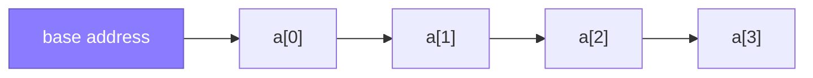

Arrays and strings are the first data structure in almost every interview, and the easiest place to lose points on details you already know. The bar is not "can you use an array" — it is "do you know why `substring` allocates, why `ArrayList.add` is amortised O(1), and which of six near-identical patterns fits this exact problem".

## Memory layout

An array is a **contiguous block of memory**: element `i` lives at `base + i * elementSize`, which is why indexing is O(1) — it's arithmetic, not search. This contiguity is also why arrays are cache-friendly: reading `a[i]` pulls a whole cache line, so `a[i+1]` is very likely already in L1 cache.



A linked list gives up this contiguity for O(1) insert — nodes scatter across the heap, so traversal causes a cache miss per node. This is the real reason arrays beat linked lists in practice even when both are "O(n)": constant factors from cache locality dominate at interview-sized inputs.

> [!KEY]
> Array access is O(1) because it's a memory address calculation. Everything else about arrays — insert cost, resize cost — follows from "contiguous and fixed-size".

## Fixed vs dynamic arrays

A raw array (`int[]` in Java) has a size fixed at creation. A dynamic array (`ArrayList<T>`) wraps a raw array and reallocates when it runs out of room.

| Aspect | Fixed array | Dynamic array (`ArrayList<T>`) |
|---|---|---|
| Size | Fixed at creation | Grows as needed |
| Append at end | N/A — must pre-size | Amortised `O(1)` |
| Insert at index | `O(n)` shift | `O(n)` shift |
| Random access | `O(1)` | `O(1)` |
| Extra memory | None | Up to ~1.5x used capacity (slack) |

### Amortised growth

When an `ArrayList` is full, it allocates a new backing array — **~1.5x** the size (`oldCapacity + (oldCapacity >> 1)`) — and copies every element over. That single append is `O(n)`, but it only happens when capacity grows, so it happens `O(log n)` times across `n` appends. Total work across `n` appends is `O(n)`, giving **amortised O(1)** per append.

```java
// Growth is ~1.5x: capacity 10 -> 15 -> 22 -> 33 ...
List<Integer> list = new ArrayList<>();
for (int i = 0; i < 1_000_000; i++)
    list.add(i);   // ~30 resizes total, not 1,000,000
```

> [!TIP]
> If you know the final size up front, pass it to the constructor: `new ArrayList<>(n)`. This skips every resize and is a small but real senior-signal detail.

## In-place manipulation: rotation and reversal

"In-place" means `O(1)` extra space — you mutate the input array instead of allocating a new one. The classic example is **array rotation**, and the elegant trick is the **reversal algorithm**: to rotate an array right by `k`, reverse the whole array, then reverse each of the two segments.

```java
// Rotate array right by k, in-place, O(n) time, O(1) space
public void rotate(int[] a, int k) {
    k %= a.length;
    reverse(a, 0, a.length - 1);
    reverse(a, 0, k - 1);
    reverse(a, k, a.length - 1);
}
private void reverse(int[] a, int lo, int hi) {
    while (lo < hi) {
        int tmp = a[lo]; a[lo++] = a[hi]; a[hi--] = tmp;
    }
}
```

This "reverse the whole, then reverse the parts" idea reappears constantly: reversing words in a sentence in place, cyclic shifts, and rotating a matrix. Recognizing the pattern saves derivation time under pressure.

> [!WARNING]
> Always take `k %= a.length` first. A rotation amount larger than the array length is a very common off-by-crash bug — without the modulo you index out of bounds or do redundant full rotations.

## String immutability and StringBuilder

In Java, `String` is **immutable** (and UTF-16 internally): every operation that looks like mutation (`+=`, `replace`, `substring`) actually allocates a new string and copies. `substring(i, j)` is `O(j - i)`, not `O(1)`, because since Java 7 it copies the characters. Concatenating in a loop is the classic trap:

```java
// O(n^2): each += allocates a new String and copies everything so far
String s = "";
for (char c : chars) s += c;

// O(n) amortised: StringBuilder mutates an internal char buffer
StringBuilder sb = new StringBuilder();
for (char c : chars) sb.append(c);
String result = sb.toString();
```

`StringBuilder` behaves like a dynamic array of `char` internally — same geometric growth strategy, same amortised-O(1) append. If you need to reverse or shuffle characters in place, convert to `char[]` with `toCharArray()`, mutate, then build a new string with `new String(chars)` — you cannot mutate a `String` directly.

> [!DANGER]
> Interviewers plant string-concatenation-in-a-loop deliberately. Even if your algorithm is otherwise `O(n)`, `s += c` silently makes it `O(n²)`. Say "I'll use a StringBuilder here to avoid quadratic string copies" out loud.

## Char frequency counting

Counting character frequency is the backbone of anagram, permutation and substring-matching problems. For ASCII input, a fixed-size array beats a `HashMap` — no hashing overhead, and the 26/128/256 bound is known up front.

```java
// O(n) time, O(1) space (26 is a constant, not a function of n)
int[] freq = new int[26];
for (char c : s.toCharArray()) freq[c - 'a']++;

boolean isAnagram(String a, String b) {
    if (a.length() != b.length()) return false;
    int[] f = new int[26];
    for (char c : a.toCharArray()) f[c - 'a']++;
    for (char c : b.toCharArray()) if (--f[c - 'a'] < 0) return false;
    return true;
}
```

For Unicode or an unknown alphabet, fall back to `Map<Character, Integer>` — the pattern (build a count, compare counts) is identical.

## Choosing the right array pattern

Most array problems reduce to one of a handful of patterns. Recognizing which one applies is the actual skill being tested.

| Pattern | Signal in the problem | Typical complexity |
|---|---|---|
| Two pointers (opposite ends) | Sorted array, pair/triplet sum, palindrome check | `O(n)` |
| Two pointers (same direction) | "Remove duplicates in place", partitioning | `O(n)` |
| Sliding window | Contiguous subarray/substring, "at most k", longest/shortest | `O(n)` |
| Prefix sum | Repeated range-sum queries, subarray sum equals k | `O(n)` build, `O(1)` query |
| Sorting first | Order doesn't matter, need pairs/duplicates adjacent | `O(n log n)` |
| Hash set/map | Need `O(1)` membership or frequency, order doesn't matter | `O(n)` |
| Monotonic stack | Next greater/smaller element | `O(n)` |

If the array is already sorted, always ask yourself whether two pointers or binary search removes a factor of `n` before reaching for a hash map — that single question resolves most "can this be faster" follow-ups.

## Cheat sheet

- Array access is `O(1)` because it's an address calculation; contiguity also gives cache-friendliness.
- Dynamic array append is **amortised O(1)**, worst case `O(n)` on resize (Java's `ArrayList` grows ~1.5x).
- Pre-size an `ArrayList` with a known capacity to skip resizes entirely.
- Reverse-whole-then-reverse-parts is the standard trick for in-place rotation.
- Always `k %= length` before rotating by `k`.
- `String` is immutable in Java — `substring` is `O(len)`, concatenation in a loop is `O(n²)`.
- Use `StringBuilder` for building strings incrementally; `toCharArray()` for in-place char mutation.
- Fixed-size count array beats `HashMap` when the alphabet is small and known (e.g., lowercase letters).
- Match the problem to a pattern first (two pointers, sliding window, prefix sum, hashing) before coding.

## Common mistakes

| Mistake | Fix |
|---|---|
| Rotating by `k` without `k %= length` | Always normalise `k` first |
| Building a string with `+=` in a loop | Use `StringBuilder` |
| Assuming `substring` is free | It's `O(len)` — a full copy |
| Using `list.contains` inside a loop over the same list | That's `O(n)` per call — use a `HashSet` |
| Forgetting arrays are reference types when passed to methods | Mutations inside the method are visible to the caller |
| Not pre-sizing an `ArrayList` when the final size is known | Pass capacity to the constructor to skip resizes |

## Summary

Arrays are fast because they are contiguous; strings are slow to mutate because they are immutable — nearly every array/string interview question is really testing whether you understand these two facts and their consequences. Dynamic arrays trade a rare `O(n)` resize for amortised `O(1)` append; `StringBuilder` gives you the same trade for strings. Once you can name the pattern a problem wants (two pointers, sliding window, prefix sum, hashing) the coding itself is usually mechanical.

## Top Interview Questions

### Q1. Why is array access O(1) but insertion at an arbitrary index O(n)?

Array elements sit at contiguous memory addresses, so accessing index `i` is a single arithmetic calculation (`base + i * elementSize`) — no traversal needed, hence `O(1)`. Insertion at index `i` requires every element from `i` to the end to shift one slot to the right to make room, which touches up to `n` elements, hence `O(n)`. Insertion at the very end has nothing to shift, which is why dynamic arrays optimise for append rather than arbitrary insert.

### Q2. Explain amortised O(1) append for a dynamic array like ArrayList\<T\>.

When an `ArrayList` runs out of backing-array capacity, it allocates a new array roughly 1.5x the size and copies every existing element — an `O(n)` operation. But this only happens when capacity is exhausted, which is only after many more cheap `O(1)` appends have occurred since the last resize. Summing the cost of all resizes across `n` total appends gives `O(n)` total work, or `O(1)` per append on average — that's what "amortised" means: a worst-case guarantee over a *sequence* of operations, not any single one.

### Q3. Why is string concatenation in a loop O(n²) in Java, and how do you fix it?

`String` in Java is immutable — every `+=` creates a brand-new `String` object and copies all existing characters into it plus the new one. Doing this `n` times means the i-th concatenation copies `O(i)` characters, and summing `1 + 2 + ... + n` gives `O(n²)` total. The fix is `StringBuilder`, which maintains a mutable internal `char` buffer that grows geometrically like a dynamic array, giving amortised `O(1)` per append and `O(n)` total.

### Q4. How would you reverse an array in place, and how does that generalise to rotation?

Use two pointers starting at both ends, swap, and move inward until they cross — `O(n)` time, `O(1)` space. Rotation by `k` builds on this: reverse the entire array, then reverse the first `k` elements, then reverse the remaining `n - k` elements. Each element is touched a constant number of times, so the whole rotation is still `O(n)` time and `O(1)` space, with no extra array needed. This "reverse the whole, then reverse the parts" trick also solves "reverse words in a sentence in place".

### Q5. You need to check if two strings are anagrams. Walk through your approach and its complexity.

If the alphabet is small and known (say lowercase English letters), allocate a fixed `int[26]` count array, increment for each character of the first string, decrement for each character of the second, and fail early if any count goes negative or the lengths differ. This is `O(n)` time and `O(1)` space, since 26 is a constant. An alternative is sorting both strings and comparing — `O(n log n)` time, `O(1)` extra if sorting in place — which is simpler to write but asymptotically worse; I'd mention both and justify picking the counting approach for performance.

### Q6. How does Java represent 2-D arrays, and what's the difference between a rectangular grid and a jagged array?

In Java every multidimensional array is an **array of arrays** (`int[][]`) — there is no distinct contiguous rectangular type like some languages offer. `new int[rows][cols]` allocates an outer array plus one independent `int[]` per row, so the rows are separate objects reached by reference; the memory is not one contiguous block, and each row access costs an extra pointer indirection. A "rectangular" grid is simply the case where every inner array has the same length (e.g., a chessboard), whereas a truly jagged array (`new int[rows][]`, then fill each row separately) lets rows have different lengths. Because rows are first-class `int[]` objects you can sort, reverse, or replace a single row independently, and stream over one row directly. When you genuinely need one contiguous block for cache locality, flatten to a single `int[rows * cols]` and index with `r * cols + c`.

### Q7. Given a large array, how would you find the maximum sum of any contiguous subarray?

This is Kadane's algorithm: track the best sum ending at the current index (`curMax = Math.max(nums[i], curMax + nums[i])`) and a running global best. It works because if the running sum ever goes negative, it can only hurt any subarray extended through it, so you reset to starting fresh at the current element. This is `O(n)` time and `O(1)` space, beating the brute-force `O(n²)` (or `O(n³)` without prefix sums) pairwise check. I'd mention this is a specific case of the broader "prefix sum / running state" pattern.

### Q8. How would you detect and remove duplicates from a sorted array in place?

Use the same-direction two-pointer pattern: a `slow` pointer marks the end of the deduplicated prefix, and a `fast` pointer scans forward. Whenever `nums[fast] != nums[slow]`, advance `slow` and copy `nums[fast]` into it. Because the array is sorted, duplicates are always adjacent, so a single `O(n)` pass with `O(1)` extra space suffices, and the function returns the new logical length. If the array were unsorted, you'd need a `HashSet` to track "seen" values instead, at the cost of `O(n)` space.

### Q9. In production, you're processing a huge log file line by line and building an output string. What would you actually do, and why?

I would not concatenate strings in a loop — that's `O(n²)` and will visibly degrade as file size grows. I'd use a `StringBuilder` (or, for truly huge output, stream directly to a `BufferedWriter`/output stream instead of holding the whole result in memory at all). I'd also pre-size the `StringBuilder`'s capacity if I have a rough estimate of final length, to reduce the number of internal buffer resizes. If the output needs to go somewhere else (a file, a socket), writing incrementally avoids ever materialising the whole string, which matters far more at production scale than at interview scale.

### Q10. What is the difference between value semantics and reference semantics for arrays, and why does it matter when passing them to a method?

In Java, arrays are objects: passing an array to a method passes its reference *by value*, so the caller and the method both point at the same underlying memory, and mutations inside the method (`arr[0] = 5`) are visible to the caller after the call returns. This differs from a primitive like `int`, which is genuinely copied when passed. It matters because a method that "looks read-only" can still silently mutate caller state through an array parameter — a common source of subtle bugs — and it's why defensive copying (`arr.clone()` or `Arrays.copyOf`) is sometimes necessary before handing an array to code you don't fully trust.
