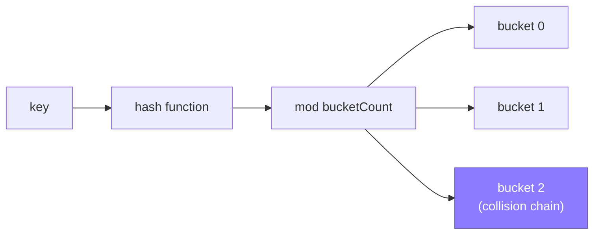

Hashing is the single most useful idea in interview coding: it turns an `O(n)` or `O(n²)` scan into `O(1)` average lookup. Interviewers expect you to reach for a `HashMap`/`HashSet` instinctively, and to be able to explain exactly why the "O(1)" claim is only true on average.

## How a hash table works

A hash table stores key-value pairs in an array of **buckets**. A **hash function** turns a key into an integer; the table takes that integer modulo the bucket count to pick a bucket index. Lookup, insert and delete all start by computing the hash and jumping straight to that bucket — no scanning the whole table.



Two different keys can hash to the same bucket — a **collision**. What happens next is the part interviewers probe:

| Strategy | How it works | Trade-off |
|---|---|---|
| Separate chaining | Each bucket holds a linked list (or small tree) of entries that collided | Simple, degrades gracefully, extra pointer overhead |
| Open addressing | On collision, probe the next slot (linear, quadratic, or double hashing) until an empty one is found | Better cache locality, but clustering can hurt as load factor rises |

Java's `HashMap` uses separate chaining (each bucket is a linked list that converts to a balanced red-black tree once it holds 8 or more entries — "treeification"), while some other languages' hash sets use open addressing. Either way, the guarantee is the same: **O(1) average**, degrading toward `O(log n)` for a treeified bucket (or `O(n)` with a broken hash) if too many keys collide.

> [!KEY]
> A hash table is an array plus a function that maps keys to array indices. Everything else — chaining, probing, resizing — exists to handle collisions cheaply.

## Load factor and resizing

**Load factor** = `count / bucketCount`. As it rises, collision chains get longer and lookups slow down. When load factor crosses a threshold (Java's `HashMap` uses a default load factor of 0.75 and doubles the bucket array, which is always a power of two), the table **rehashes**: allocate a bigger bucket array and reinsert every existing key. That single rehash is `O(n)`, but — just like a dynamic array's resize — it happens rarely enough that insertion is **amortised O(1)**.

| Load factor | Effect |
|---|---|
| Low (< 0.5) | Fast lookups, wastes memory |
| ~0.75 | Good balance — Java's default resize threshold |
| High (> 0.75) | Longer chains; Java treeifies a bucket at 8 entries to cap it at `O(log n)` |

> [!TIP]
> If you know roughly how many entries you'll insert, construct the `HashMap`/`HashSet` with that capacity (`new HashMap<>(expectedCount)`). This avoids repeated rehashing, the same trick as pre-sizing an `ArrayList`.

## HashMap and HashSet in Java

```java
Map<Character, Integer> freq = new HashMap<>();
for (char c : s.toCharArray())
    freq.merge(c, 1, Integer::sum);            // insert-or-update idiom

Set<Integer> seen = new HashSet<>();
for (int x : nums)
    if (!seen.add(x))                          // add returns false if already present
        System.out.println("duplicate: " + x);

Integer count = freq.get('a');                 // returns null if absent, never throws
if (count != null)
    System.out.println(count);
```

`HashSet<T>` is really a `HashMap<T, Object>` under the hood — it wraps a map whose values are all one shared dummy object, same bucket array, same hashing. Both give `O(1)` average `add`, `contains`/`containsKey`, and `remove`.

## The hashCode/equals contract

For a custom type to work correctly as a map key or set member, it must honour one rule: **if two objects are `equals`, they must return the same `hashCode`.** The reverse is not required — different objects can share a hash code (that's just a collision).

```java
class Point {
    int x, y;
    @Override public boolean equals(Object obj) {
        return obj instanceof Point p && p.x == x && p.y == y;
    }
    @Override public int hashCode() {
        return Objects.hash(x, y);
    }
}
```

> [!DANGER]
> If you override `equals` but not `hashCode` (or vice versa), the type silently breaks in a `HashSet`/`HashMap`: two "equal" objects can land in different buckets and both be treated as distinct keys. This is a real production bug pattern, not just an interview trivia question — mention it proactively when defining a key type.

Java `record` types generate `equals`, `hashCode` and `toString` from their components automatically, which is one reason to prefer a `record` for a composite map key over a hand-rolled class.

## When hashing degrades to O(n)

Hashing's "O(1) average" has a genuine worst case: if every key collides into the same bucket, every operation degrades to `O(n)` — the chain becomes a linear scan (or `O(log n)` once Java treeifies that bucket). This happens when:

- The hash function is poor (e.g., always returns 0, or a bad custom `hashCode`).
- An adversary who knows your hash function crafts inputs that all collide (a real denial-of-service vector). Java's `String.hashCode` is a fixed, published formula, so `HashMap` defends structurally: once a bucket holds 8+ entries it treeifies into a red-black tree, capping that bucket at `O(log n)` instead of `O(n)`.
- The key type's `hashCode` is inconsistent with `equals`.

> [!WARNING]
> "Hash map lookup is O(1)" is only true *on average, with a good hash function*. State it as "O(1) average, O(n) worst case" — interviewers listen for this precision (Java's `HashMap` softens that worst case to `O(log n)` by treeifying oversized buckets).

## Core map/set patterns

| Pattern | Idea | Example problems |
|---|---|---|
| Frequency map | Count occurrences of each key | Anagram check, majority element, top-k frequent |
| Seen-set | Track what's been visited to avoid reprocessing / detect repeats | Duplicate detection, cycle detection, two-sum |
| Complement lookup | For each element, check if `target - x` was already seen | Two-sum, pair-sum variants |
| Grouping | Map a derived key (sorted string, normalized value) to a list of originals | Group anagrams, bucket by remainder |
| Index map | Map value → last-seen index | Longest substring without repeats, contains-nearby-duplicate |

```java
// Group anagrams: derived key = sorted characters
Map<String, List<String>> groups = new HashMap<>();
for (String word : words) {
    char[] chars = word.toCharArray();
    Arrays.sort(chars);
    String key = new String(chars);
    groups.computeIfAbsent(key, k -> new ArrayList<>()).add(word);
}
```

## Ordered vs unordered maps

`HashMap`/`HashSet` give no ordering guarantee — iteration order can change after a resize and must never be relied on. When order matters, Java offers `TreeMap<K,V>` / `TreeSet<T>` (red-black tree, `O(log n)` operations, always sorted by key), or `LinkedHashMap` / `LinkedHashSet`, which preserve insertion order while keeping `O(1)` operations.

| Need | Structure | Lookup |
|---|---|---|
| Fastest possible lookup, no order needed | `HashMap` / `HashSet` | `O(1)` average |
| Sorted iteration, still need lookup | `TreeMap` / `TreeSet` | `O(log n)` |
| Preserve insertion order exactly | `LinkedHashMap` / `LinkedHashSet` | `O(1)` |

## Cheat sheet

- A hash table is a bucket array plus a hash function; collisions are resolved via chaining or open addressing.
- Load factor rising too high triggers a resize — an `O(n)` rehash that's amortised away over many inserts.
- `HashMap`/`HashSet` give `O(1)` **average**, `O(n)` **worst case** (`O(log n)` once Java treeifies a bucket). Always state both.
- Overriding `equals` without `hashCode` (or vice versa) silently breaks map/set behaviour.
- Pre-size a `HashMap`/`HashSet` with an expected capacity when you know it, to skip rehashes.
- Complement lookup (`target - x` seen already) turns `O(n²)` pair problems into `O(n)`.
- Use a derived/normalized key (sorted string, tuple) to group related items.
- Reach for `TreeMap`/`TreeSet` only when you actually need sorted iteration — it costs `O(log n)` instead of `O(1)`.

## Common mistakes

| Mistake | Fix |
|---|---|
| Auto-unboxing `map.get(key)` when the key may be absent | `get` returns `null` → NPE on unboxing; use `getOrDefault` |
| Overriding `equals` but not `hashCode` | Always override both together, consistently |
| Calling hash lookup "O(1) worst case" | It's O(1) **average**; worst case is O(n) |
| Iterating a `HashMap` expecting sorted or insertion order | Use `TreeMap` (sorted) or `LinkedHashMap` (insertion order) |
| Mutating a `HashMap` while iterating it | Throws `ConcurrentModificationException`; use an `Iterator` or apply changes after the loop |
| Using a mutable object as a map key | Its hash code can change after insertion, corrupting the bucket it lives in |

## Summary

A hash table trades memory for speed: hashing a key into a bucket index turns search from `O(n)` into `O(1)` on average, at the cost of needing a well-behaved hash function and headroom for resizing. The recurring interview patterns — frequency maps, seen-sets, complement lookups, grouping by a derived key — are all the same idea applied to different problems. Know the `equals`/`hashCode` contract cold, and always state the average-versus-worst-case distinction when you claim `O(1)`.

## Top Interview Questions

### Q1. How does a hash table achieve O(1) average lookup?

A hash function converts a key into an integer, which is reduced (typically via modulo) to an index into a fixed-size bucket array. Lookup, insert, and delete all compute this index directly and jump straight to that bucket instead of scanning the structure, which is what makes them `O(1)` on average — independent of how many other keys are stored. The "average" qualifier exists because multiple keys can hash to the same bucket (a collision); resolving those collisions (via chaining or open addressing) is what can push a single operation toward `O(n)` in the worst case.

### Q2. Compare separate chaining and open addressing for collision resolution.

Separate chaining stores a small linked list (or tree, for many collisions) per bucket — collisions simply extend the list at that index. It's simple and degrades gracefully, but each entry carries extra pointer overhead and chain traversal has poor cache locality. Open addressing stores at most one entry per slot; on a collision it probes forward (linearly, quadratically, or via a second hash function) until it finds an empty slot. It has better cache behaviour since entries are packed in the array, but suffers from clustering — a run of filled slots makes subsequent insertions/lookups progressively more expensive as load factor rises.

### Q3. What is load factor, and why does resizing matter?

Load factor is the ratio of stored entries to the number of buckets. As it increases, collision chains grow longer (or, in open addressing, probe sequences grow longer), degrading lookup performance toward `O(n)`. Hash table implementations resize — allocate a larger bucket array and rehash every existing entry into it — once load factor crosses a threshold, typically around 0.7–1.0. That rehash is `O(n)`, but because it only happens when capacity roughly doubles, the amortised cost per insert across many operations remains `O(1)`, exactly analogous to dynamic array growth.

### Q4. Explain the hashCode/equals contract in Java. What breaks if you violate it?

The contract states that if two objects are considered equal by `equals`, they must return the same value from `hashCode`. The converse isn't required — unequal objects can share a hash code without violating the contract, since that's just an ordinary collision. If you override `equals` to compare by value but leave the default identity-based `hashCode` inherited from `Object`, two logically-equal objects can hash to different buckets. In a `HashSet` or as a `HashMap` key, this means a lookup for an "equal" object can fail to find an entry that's actually present, or duplicate entries can silently coexist — a subtle, hard-to-diagnose bug.

### Q5. When does a hash map's performance degrade to O(n), and how would you defend against it in production?

Degradation happens when many keys collide into the same bucket: a poor or broken hash function, a key type whose `hashCode` is inconsistent with `equals`, or (in security-sensitive contexts) an attacker deliberately crafting inputs that all hash identically — a known denial-of-service technique against naive hash tables. In production, defenses include using well-distributed hash functions and relying on the runtime's own mitigations — Java's `HashMap`, for example, converts an overloaded bucket into a red-black tree (`O(log n)` instead of `O(n)`) once it exceeds 8 entries, blunting collision-flooding attacks — plus capping or monitoring bucket sizes in security-critical services that accept untrusted keys.

### Q6. Walk through solving two-sum with hashing, and state the complexity.

Iterate through the array once; for each element `x`, check whether `target - x` is already in a hash set/map built from elements seen so far. If it is, you've found the pair; if not, add `x` to the set and continue. This is `O(n)` time and `O(n)` space, versus `O(n²)` for the brute-force nested loop, because each lookup and insert is `O(1)` average. If you also need the *indices* rather than just the values, use a `Map<Integer,Integer>` (a `HashMap`) mapping value to index instead of a plain `Set<Integer>`.

### Q7. How would you group a list of words into anagram groups efficiently?

Compute a canonical key for each word — most simply, its characters sorted alphabetically (`"eat"` and `"tea"` both become `"aet"`) — and use a `Map<String, List<String>>` mapping that key to the list of original words sharing it. This is `O(n * k log k)` where `k` is average word length, dominated by sorting each word; you could shave the per-word cost to `O(k)` with a 26-length character count converted to a fixed-width string key instead of sorting, which matters if `k` is large. Either way, hashing turns an otherwise `O(n²)` pairwise-comparison problem into a single linear pass.

### Q8. What's the difference between HashMap and TreeMap in Java, and when would you pick one over the other?

`HashMap<K,V>` is a hash table: `O(1)` average lookup/insert/delete, no ordering guarantee on iteration. `TreeMap<K,V>` is backed by a balanced binary search tree (red-black tree): `O(log n)` for the same operations, but iteration always yields keys in sorted order, and navigation methods like `ceilingKey` ("smallest key ≥ x") or `floorKey` are supported efficiently. Pick `HashMap` by default for raw speed; switch to `TreeMap` only when you genuinely need sorted iteration or range queries, since you're paying a real complexity cost (`O(log n)` vs `O(1)`) for that ordering. If you only need insertion-order iteration, reach for `LinkedHashMap`, which keeps `O(1)` operations.

### Q9. You're debugging a HashSet<T> of a custom class where contains() returns false for an object that looks identical to one already inserted. What's your diagnosis process?

First I'd check whether the class overrides `equals` — if it doesn't, the set is using identity equality inherited from `Object`, and two separately-constructed "identical" objects are never equal regardless of their field values. If `equals` is overridden by value, I'd check whether `hashCode` is also overridden consistently; if it's still the default identity-based one, the two "equal" objects land in different buckets and the set never even compares them with `equals`. The fix is to override both, deriving the hash code from the same fields used in the equality comparison (`Objects.hash(field1, field2, ...)` in Java), and to make sure the object's fields don't mutate after insertion, since a changed hash code after insertion also corrupts lookups.

### Q10. In a high-throughput production service, would you ever avoid using a hash map, and what would you use instead?

Yes, in a few situations: if keys are dense small integers, a plain array indexed directly is faster and avoids hashing overhead entirely; if I need sorted iteration or range queries, a sorted tree structure like `TreeMap` is more appropriate despite the `O(log n)` cost; and if the service accepts untrusted external keys (e.g., arbitrary user-supplied strings as map keys) at very high volume, I'd worry about hash-flooding denial-of-service and would rely on mitigations such as Java's `HashMap` treeifying oversized buckets into red-black trees, or a data structure resistant to worst-case collision attacks. Otherwise, a well-sized hash map pre-allocated to the expected entry count is almost always the right default.
