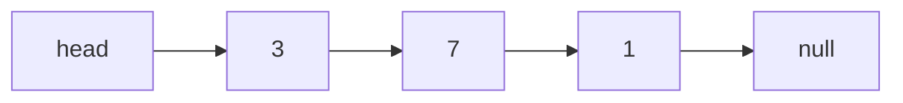
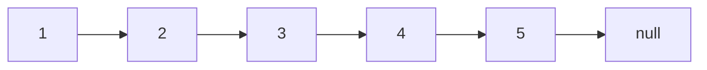

Linked lists rarely appear in production code paths you'd write today, but they remain a staple interview topic because they test something specific: can you manipulate pointers correctly under pressure without an off-by-one or a lost reference. The good news is that almost every linked-list question is one of five reusable techniques.

## Node anatomy and list shapes

A linked list is a chain of nodes, each holding a value and a reference to the next node (and, for doubly linked lists, the previous one too).

```java
class ListNode {
    int val;
    ListNode next;
    ListNode(int val) { this.val = val; }
}

class DListNode {
    int val;
    DListNode next;
    DListNode prev;
}
```



| Variant | Structure | Notes |
|---|---|---|
| Singly linked | Each node points to next only | Simplest; no backward traversal |
| Doubly linked | Each node points to next and previous | O(1) removal given a node reference; `LinkedList<T>` in Java |
| Circular | Last node points back to head (or first) | Used for round-robin buffers, `next` never null |

> [!KEY]
> Almost every linked-list bug is a **pointer ordering** bug: reassigning `next` before you've saved the reference you needed. Always capture what you need into a local variable *before* mutating pointers.

## Insert and delete complexity

| Operation | Array | Singly linked list |
|---|---|---|
| Insert/delete at front | `O(n)` shift | `O(1)` |
| Insert/delete at back (with tail pointer) | `O(1)` amortised | `O(1)` with tail, else `O(n)` |
| Insert/delete at arbitrary position | `O(n)` shift | `O(n)` to find + `O(1)` to splice |
| Access by index | `O(1)` | `O(n)` |

The headline trade: linked lists win at the **front**, arrays win at **random access**. Everywhere else they're comparable once you count the `O(n)` search needed to reach an arbitrary linked-list position.

## The dummy head technique

Inserting or deleting at the **head** of a list requires special-casing, because the head has no predecessor to update — unless you invent one. A **dummy (sentinel) node** placed before the real head removes every special case: every real node now has a predecessor, including the original head.

```java
// Remove all nodes with a given value — dummy head avoids a special case for removing the head itself
public ListNode removeElements(ListNode head, int val) {
    ListNode dummy = new ListNode(0);
    dummy.next = head;
    ListNode cur = dummy;
    while (cur.next != null) {
        if (cur.next.val == val) cur.next = cur.next.next;
        else cur = cur.next;
    }
    return dummy.next;
}
```

> [!TIP]
> Whenever a linked-list problem says "the head might need to change" (delete node, insert before head, merge lists), reach for a dummy node immediately. It's a small trick that eliminates an entire class of edge-case bugs.

## Fast and slow pointers

Two pointers moving at different speeds through a list solve a surprising number of problems without extra space.



| Goal | Technique | Why it works |
|---|---|---|
| Find the middle | Slow moves 1 step, fast moves 2 | When fast reaches the end, slow is at the midpoint |
| Detect a cycle | Slow moves 1, fast moves 2 | If there's a cycle, fast eventually laps slow inside it |
| Find cycle entry point | After meeting, reset one pointer to head, move both 1 step at a time | Meeting point math guarantees they meet at the cycle start |
| Find nth-from-end | Advance fast n steps first, then move both together | Fast finishes exactly n steps ahead of slow |

```java
// Cycle detection (Floyd's algorithm) + finding the entry point
public ListNode detectCycle(ListNode head) {
    ListNode slow = head, fast = head;
    while (fast != null && fast.next != null) {
        slow = slow.next;
        fast = fast.next.next;
        if (slow == fast) {
            ListNode ptr = head;
            while (ptr != slow) { ptr = ptr.next; slow = slow.next; }
            return ptr;             // start of the cycle
        }
    }
    return null;                    // no cycle
}
```

> [!WARNING]
> Always guard with `fast != null && fast.next != null`, not just `fast != null`. Forgetting the `.next` check dereferences a null pointer the moment the list has an even length.

## Reversal: iterative and recursive

```java
// Iterative: O(n) time, O(1) space — the standard answer
public ListNode reverse(ListNode head) {
    ListNode prev = null, cur = head;
    while (cur != null) {
        ListNode next = cur.next;   // save before overwriting
        cur.next = prev;
        prev = cur;
        cur = next;
    }
    return prev;
}

// Recursive: O(n) time, O(n) space (call stack) — elegant but not free
public ListNode reverseRec(ListNode head) {
    if (head == null || head.next == null) return head;
    ListNode newHead = reverseRec(head.next);
    head.next.next = head;
    head.next = null;
    return newHead;
}
```

Always mention both, and note the space trade-off — the recursive version isn't "free", it just moves the cost to the call stack, and will stack-overflow on a very long list where the iterative version won't.

## Merging sorted lists

Merging two sorted linked lists is the same idea as the merge step of merge sort, done with pointers instead of array indices — a dummy head keeps the splicing code clean.

```java
public ListNode mergeTwoLists(ListNode a, ListNode b) {
    ListNode dummy = new ListNode(0);
    ListNode tail = dummy;
    while (a != null && b != null) {
        if (a.val <= b.val) { tail.next = a; a = a.next; }
        else { tail.next = b; b = b.next; }
        tail = tail.next;
    }
    tail.next = (a != null) ? a : b;   // attach whichever list has leftovers
    return dummy.next;
}
```

`O(n + m)` time, `O(1)` extra space (we relink existing nodes rather than allocating new ones). Merging **k** sorted lists extends this with a min-heap keyed by current node value, giving `O(N log k)` where `N` is the total number of nodes.

## When does a linked list actually beat an array?

Rarely, and it's worth saying so out loud in an interview rather than reflexively defaulting to a linked list.

| Scenario | Better choice | Why |
|---|---|---|
| Frequent insert/delete at both ends, no random access needed | Linked list (or `Deque`) | O(1) at the ends, no shifting |
| Need random access by index | Array / `ArrayList` | O(1) vs O(n) |
| Cache-sensitive, tight loops | Array | Contiguous memory, cache-friendly |
| Splicing large sublists between structures (e.g., LRU cache) | Doubly linked list | O(1) node removal/insertion given the node |
| General-purpose "list of things" | Array / `ArrayList` | Better constants almost always win |

> [!NOTE]
> The realistic production use case for a linked list is an **LRU cache**: a doubly linked list gives O(1) move-to-front and O(1) removal of an arbitrary node (given its reference), paired with a hash map for O(1) lookup of that node. That combination is the actual reason `LinkedList<T>` exists in Java's collections library — and `LinkedHashMap` even offers a built-in access-order mode that implements exactly this.

## Cheat sheet

- Save `next` into a local variable *before* you overwrite a `next` pointer — the #1 source of linked-list bugs.
- Use a dummy head whenever the head itself might change (delete head, merge, insert-before-head).
- Fast/slow pointers solve: middle-of-list, cycle detection, cycle entry point, nth-from-end — all `O(n)` time, `O(1)` space.
- Reversal: iterative is `O(1)` space; recursive is `O(n)` space via the call stack — know both, prefer iterative for long lists.
- Merging k sorted lists: min-heap of the k current heads, `O(N log k)`.
- Linked lists win at insert/delete near the head or given a node reference; arrays win almost everywhere else, especially at random access.
- Doubly linked list + hash map is the real-world combo behind an LRU cache.

## Common mistakes

| Mistake | Fix |
|---|---|
| Overwriting `next` before saving the old value | Always capture `next = cur.next` first |
| Checking `fast != null` but not `fast.next != null` | Both checks are required before `fast.next.next` |
| Special-casing head insert/delete inline | Use a dummy head node instead |
| Forgetting to null-terminate after reversal | The old head's `next` must become `null` |
| Assuming recursive reversal is "free" | It costs `O(n)` stack space and can overflow on long lists |
| Losing the rest of the list when splicing | Save `tail.next` (or the next node) before reassigning |

## Summary

Linked list problems are pointer bookkeeping exercises: save what you need before you mutate, use a dummy head to erase head-of-list special cases, and reach for fast/slow pointers whenever the problem smells like "middle", "cycle", or "nth from end". Arrays beat linked lists in almost every practical dimension except O(1) insert/delete near the head or at a known node — which is precisely the shape of an LRU cache, the one place linked lists show up in real systems.

## Top Interview Questions

### Q1. What's the difference between a singly and doubly linked list, and what does each cost you?

A singly linked list stores only a `next` reference per node — it's smaller and simpler, but you can only traverse forward, and deleting a node requires a reference to its predecessor, which means an `O(n)` scan to find it unless you already have that predecessor in hand. A doubly linked list adds a `prev` reference per node, doubling the pointer overhead per node, but in exchange you can traverse backward and delete a node in `O(1)` given only a reference to that node itself, since you can reach its predecessor directly. This is exactly why `LinkedList<T>` in Java, and LRU cache implementations generally, use doubly linked lists.

### Q2. How do fast and slow pointers detect a cycle in a linked list, and how do you find where the cycle begins?

Advance `slow` one node and `fast` two nodes per step. If there's no cycle, `fast` reaches the end (`null`) first. If there is a cycle, `fast` enters it and, moving twice as fast as `slow`, eventually "laps" `slow` from behind — they meet inside the cycle. To find the cycle's entry point, reset one pointer to the head and leave the other at the meeting point, then advance both one step at a time; the mathematics of the distances involved guarantees they meet exactly at the first node of the cycle. This is Floyd's cycle-detection algorithm, and it runs in `O(n)` time with `O(1)` extra space.

### Q3. Why does the dummy head technique simplify linked-list code?

Without a dummy node, the head of the list has no predecessor, so any operation that might delete or insert before the head needs a separate branch of code just for that case (e.g., `if (node == head) head = head.next; else prev.next = node.next;`). A dummy node placed just before the real head means every real node — including the original head — now has a predecessor, so the exact same splicing logic handles the head and every other position uniformly. You return `dummy.next` at the end instead of tracking a possibly-changed `head` variable. It's a small trick that removes an entire category of edge-case bugs, especially in merge and delete operations.

### Q4. Reverse a singly linked list iteratively. Then explain the recursive version and its trade-off.

Iteratively: maintain `prev` (initially null) and `cur` (initially head); in a loop, save `cur.next` into a temporary, point `cur.next` at `prev`, then advance both `prev` and `cur` by one. This is `O(n)` time and `O(1)` space. Recursively: reverse the rest of the list first (`reverseRec(head.next)`), then fix up the link so `head.next.next = head`, and set `head.next = null`. This is elegant to write but costs `O(n)` auxiliary space on the call stack — for a list with hundreds of thousands of nodes, that can stack-overflow, whereas the iterative version has constant space and no such risk. In an interview, I'd lead with iterative and mention the recursive version's trade-off proactively.

### Q5. How would you merge two sorted linked lists, and how does that extend to merging k sorted lists?

For two lists, use a dummy head and a tail pointer; repeatedly compare the current heads of both lists, splice the smaller one onto the result's tail, and advance that list's pointer; when one list runs out, attach whatever remains of the other directly. This is `O(n + m)` time and `O(1)` extra space, since nodes are relinked rather than copied. For k lists, put the current head of each list into a min-heap keyed by value; repeatedly pop the minimum, append it to the result, and push that node's `next` (if any) back into the heap. This is `O(N log k)` time where `N` is the total node count across all lists — better than merging lists two at a time sequentially for large k.

### Q6. Given only a reference to a node in the middle of a singly linked list (not the head), how would you delete it?

You can't easily find the predecessor without the head, so the standard trick is: copy the *next* node's value into the current node, then skip over the next node by setting `cur.next = cur.next.next`. Effectively, you're deleting the *next* node but making it look like you deleted the current one. This only works if the node is not the last node in the list (since there'd be no "next" value to copy) — if it might be the tail, you need the actual predecessor, which requires a full traversal from the head, `O(n)`.

### Q7. How do you find the middle of a linked list in one pass?

Use fast and slow pointers, both starting at the head: on each step, `slow` advances one node and `fast` advances two. When `fast` reaches the end of the list (or `fast.next` is null for an even-length list), `slow` is sitting at the middle. This is `O(n)` time, `O(1)` space, and avoids a two-pass approach (count the length, then walk `length/2` steps), which is also `O(n)` but touches the list twice and needs to handle the length calculation separately.

### Q8. You suspect a linked list-based queue in production is leaking memory even though items are being dequeued. What would you check?

I'd first check whether dequeue actually nulls out the removed node's `next` (and `prev`, if doubly linked) reference before dropping it, or whether it just moves the head pointer forward and leaves the old head's outgoing pointer intact — in a language with a tracing garbage collector this specific case usually isn't fatal since nothing still references the old node, but it's worth verifying nothing else (like a debug/history list) is holding a reference to old nodes. I'd also check for an accidental cycle introduced by a buggy insert (e.g., a node's `next` pointing back into the middle of the list), which would keep an entire chain of "removed" nodes reachable and unable to be collected. Finally, I'd check if raw nodes are exposed to external code that might retain long-lived references to them.

### Q9. When would you genuinely prefer a linked list over an array/ArrayList in real code?

Rarely, and I'd say so directly rather than defaulting to a linked list. The one strong case is when you need O(1) insertion and removal at both ends *and* O(1) removal of an arbitrary element given a direct reference to it — the canonical example is an LRU cache, where a doubly linked list tracks recency order and a hash map gives O(1) lookup of the node to move or evict. Outside of that kind of combined structure, arrays win on cache locality, random access, and lower memory overhead per element, even when both are asymptotically "O(n)" for some operation — the constant factors from pointer-chasing and cache misses are real.

### Q10. What's the difference between a circular linked list and a regular one, and where is it used?

In a circular linked list, the last node's `next` points back to the head instead of to `null`, so traversal never naturally terminates — you must track a count or stop when you return to a known starting node. It's used for round-robin scheduling (e.g., cycling through processes or players in a game), circular buffers, and implementing structures like the Josephus problem elegantly. The main implementation gotcha is that any traversal loop written with the "until null" idiom will infinite-loop on a circular list, so you need an explicit termination condition, usually a count or "stop when we're back at the start" check.
