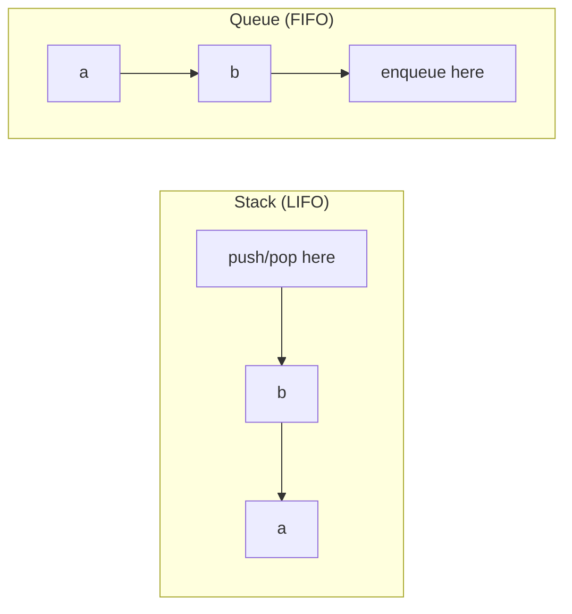

Stacks and queues are simple to define — LIFO and FIFO — but the interview value is in the patterns built on top of them: monotonic stacks, min-stacks, and deque-based sliding windows all show up repeatedly across "hard" problems that are actually easy once you recognise the shape.

## LIFO vs FIFO

A **stack** is Last-In-First-Out: the most recently added element is the first one removed. A **queue** is First-In-First-Out: elements leave in the order they arrived. A **deque** (double-ended queue) supports insert/remove at both ends, so it can act as either.



| Structure | Add | Remove | Java type |
|---|---|---|---|
| Stack | `push` — top | `pop` — top | `Deque<T>` (`ArrayDeque`) |
| Queue | `offer` — back | `poll` — front | `Deque<T>` (`ArrayDeque`) |
| Deque | `offerFirst`/`offerLast` | `pollFirst`/`pollLast` | `Deque<T>` (`ArrayDeque`) |

> [!KEY]
> Stack = "undo history" (last action is first to reverse). Queue = "waiting line" (first come, first served). Every use case maps back to one of those two mental models.

## Array vs linked implementations

Both stacks and queues can be backed by an array or a linked list, with the same trade-offs seen elsewhere:

| Backing | Push/pop or enqueue/dequeue | Notes |
|---|---|---|
| Dynamic array | Amortised `O(1)` at the relevant end | A naive array-backed queue needs a **circular buffer**, or dequeue is `O(n)` (shifting everything left) |
| Linked list | `O(1)` at head/tail (with tail pointer) | No resizing, but per-node pointer overhead and worse cache locality |

Java's `ArrayDeque` is array-backed with internal circular-buffer logic, so it serves as both a stack and a queue with `O(1)` amortised operations without you needing to hand-roll anything. Prefer it to the legacy `java.util.Stack` (which is synchronized and extends `Vector`) and to using `LinkedList` as a queue — `ArrayDeque` is faster and has no per-node overhead.

> [!WARNING]
> A naive queue built on `ArrayList` using `remove(0)` for dequeue is `O(n)` per operation — every remaining element shifts left. Use `ArrayDeque` (circular buffer internally) instead of reinventing one on top of `ArrayList`.

## Monotonic stack: next greater element

A **monotonic stack** keeps its elements in strictly increasing (or decreasing) order by popping anything that violates the order before pushing. It's the standard tool for "next greater/smaller element" style problems, because each element is pushed and popped at most once — giving `O(n)` total despite an inner `while` loop.

```java
// Next Greater Element: for each index, find the next element to its right that's larger
// O(n) time — each index is pushed and popped at most once — O(n) space
public int[] nextGreaterElement(int[] nums) {
    int[] result = new int[nums.length];
    Arrays.fill(result, -1);
    Deque<Integer> stack = new ArrayDeque<>();   // holds indices, values kept in increasing order
    for (int i = 0; i < nums.length; i++) {
        while (!stack.isEmpty() && nums[stack.peek()] < nums[i])
            result[stack.pop()] = nums[i];
        stack.push(i);
    }
    return result;
}
```

The same skeleton, with a decreasing stack instead, solves **largest rectangle in histogram**: pop bars taller than the current one, and each pop computes a candidate rectangle using the popped bar's height and the width between the new stack top and the current index.

> [!TIP]
> Whenever a problem asks "for each element, find the next/previous element that is greater/smaller", say "monotonic stack" immediately — it's almost always the intended `O(n)` answer against an `O(n²)` brute force.

## Min-stack

A min-stack supports `Push`, `Pop`, `Top`, and `GetMin`, all in `O(1)`. The trick is to carry the running minimum alongside each element — either a parallel stack, or by pushing pairs.

```java
public class MinStack {
    private record Entry(int val, int min) {}
    private final Deque<Entry> stack = new ArrayDeque<>();
    public void push(int val) {
        int newMin = stack.isEmpty() ? val : Math.min(val, stack.peek().min());
        stack.push(new Entry(val, newMin));
    }
    public void pop() { stack.pop(); }
    public int top() { return stack.peek().val(); }
    public int getMin() { return stack.peek().min(); }
}
```

Every push records "the minimum of everything at or below me", so popping never loses track of the current minimum — no rescanning needed.

## Queue via two stacks

A classic "implement X using Y" question: build a FIFO queue out of two LIFO stacks.

```java
public class QueueWithStacks {
    private final Deque<Integer> in = new ArrayDeque<>(), out = new ArrayDeque<>();
    public void enqueue(int x) { in.push(x); }
    public int dequeue() {
        if (out.isEmpty())
            while (!in.isEmpty()) out.push(in.pop());   // reverse order only when needed
        return out.pop();
    }
}
```

Each element moves from `in` to `out` at most once, so while a single `dequeue` can be `O(n)` in the worst case, the **amortised** cost per operation across a sequence is `O(1)`.

## Circular buffer

A **circular (ring) buffer** implements a queue on a plain array by wrapping indices with modulo arithmetic instead of shifting elements. Java's `ArrayDeque` uses the same wraparound idea but grows when full; fixed-capacity ring buffers in logging or telemetry systems often choose to overwrite the oldest value instead.

```java
public class OverwritingRingBuffer {
    private final int[] buf; private int head, size;
    public OverwritingRingBuffer(int capacity) {
        if (capacity <= 0) throw new IllegalArgumentException("capacity must be positive");
        buf = new int[capacity];
    }
    public void enqueue(int x) {
        int tail = (head + size) % buf.length;
        buf[tail] = x;
        if (size == buf.length) head = (head + 1) % buf.length;  // overwrite oldest
        else size++;
    }
}
```

## Deque and sliding-window maximum

A deque lets you push/pop from both ends in `O(1)`, which is exactly what's needed to maintain the maximum of a sliding window in `O(n)` overall. Keep indices in the deque in **decreasing value order**: pop smaller trailing values before pushing (they can never be the max while the current element is still in range), and pop from the front once an index falls outside the window.

```java
// Sliding window maximum, O(n) time, O(k) space
public int[] maxSlidingWindow(int[] nums, int k) {
    Deque<Integer> dq = new ArrayDeque<>();      // stores indices, values decreasing front-to-back
    int[] result = new int[nums.length - k + 1];
    int r = 0;
    for (int i = 0; i < nums.length; i++) {
        while (!dq.isEmpty() && nums[dq.peekLast()] < nums[i]) dq.pollLast();
        dq.addLast(i);
        if (dq.peekFirst() <= i - k) dq.pollFirst();   // out of window
        if (i >= k - 1) result[r++] = nums[dq.peekFirst()];
    }
    return result;
}
```

## Java API details that matter

Prefer `offer`/`poll`/`peek` when using a deque as a queue because they make the empty-case behaviour explicit: `poll` and `peek` return `null`, while `remove` and `element` throw. For a stack, `push`, `pop` and `peek` are idiomatic on `Deque`, but `pop` still throws on empty, so guard with `isEmpty()` unless the problem guarantees valid operations.

`ArrayDeque` does **not** allow `null` elements. That is a feature for interview code: a `null` return from `poll()` unambiguously means "empty", not "the next item was null". If you genuinely need to store nulls, use a different representation, but for algorithm problems values are normally primitives or non-null objects, so `ArrayDeque` remains the default.

Also remember that `ArrayDeque` is not thread-safe; that is fine for coding interviews and most single-threaded algorithms. If a production queue crosses threads, choose a concurrent queue from `java.util.concurrent` instead of adding ad-hoc synchronization around interview-style code.

Finally, name the end you are using in comments while coding. Bugs often come from mixing `offer` with `pop` or `push` with `pollLast`, accidentally reversing the intended order.

## BFS uses a queue, DFS uses a stack

This is worth stating explicitly because it explains *why* each traversal has its characteristic shape: BFS explores level-by-level because a queue preserves discovery order (first-discovered, first-explored), while DFS plunges depth-first because a stack (or the recursion call stack) always explores the most-recently-discovered node next.

| Traversal | Structure | Order |
|---|---|---|
| BFS | Queue | Level by level, shortest path in unweighted graphs |
| DFS | Stack (explicit or recursive call stack) | Depth-first, backtracking |

## Cheat sheet

- Stack = LIFO ("undo"), Queue = FIFO ("waiting line"), Deque = both ends.
- Don't build a queue on `ArrayList` with `remove(0)` — that's `O(n)` per dequeue. Use `ArrayDeque` or a circular buffer.
- Monotonic stack solves "next/previous greater/smaller element" in `O(n)` — each element pushed/popped once.
- Min-stack: carry the running min alongside each pushed value for `O(1)` `GetMin`.
- Queue via two stacks: amortised `O(1)` per operation, worst case `O(n)` on a single dequeue.
- A circular buffer avoids shifting by wrapping indices with modulo — this is how array-backed queues achieve `O(1)`.
- Deque + "pop smaller values before pushing" solves sliding-window maximum in `O(n)`.
- BFS = queue (level order); DFS = stack or recursion (depth first). This single fact explains both algorithms' shapes.

## Common mistakes

| Mistake | Fix |
|---|---|
| Dequeuing via `ArrayList.remove(0)` | Use `ArrayDeque` (circular buffer), not a list |
| Forgetting a monotonic stack holds indices, not values | Store indices so you can compute distances/widths later |
| Popping from an empty stack/queue without checking | `pop`/`remove` throw — use `peek`/`poll` (which return `null`) or check `isEmpty()` |
| Recomputing the minimum on every `getMin()` call | Track the running min alongside each push |
| Removing sliding-window deque entries only from the front | Also trim smaller trailing values from the back before pushing |
| Using recursion for DFS on very deep/unbalanced structures | Consider an explicit stack to avoid stack overflow |

## Summary

Stacks and queues are simple primitives, but a handful of patterns built on them — monotonic stack, min-stack, queue-via-two-stacks, circular buffer, and deque-based sliding window — cover most of what gets asked. The unifying idea is using the right end of the right structure to avoid an `O(n)` shift or rescan: pop what's now useless before pushing, and let the structure's LIFO or FIFO order do the bookkeeping for you.

## Top Interview Questions

### Q1. What's the difference between a stack, a queue and a deque?

A stack is Last-In-First-Out: `push` and `pop` both operate on the same end (the top), so the most recently added element is removed first — think "undo history". A queue is First-In-First-Out: `offer` adds at the back, `poll` removes from the front, preserving arrival order — think "waiting line". A deque (double-ended queue) generalises both by allowing `O(1)` insertion and removal at *both* ends, so it can be used as a stack, a queue, or something that needs both behaviours, like a sliding window. In Java, `ArrayDeque` fills all three roles — `push`/`pop` for a stack, `offer`/`poll` for a queue, and `offerFirst`/`offerLast`/`pollFirst`/`pollLast` for a deque; the legacy `java.util.Stack` and using `LinkedList` as a queue still work, but `ArrayDeque` is faster and preferred.

### Q2. Why is a naive array-backed queue (using remove(0)) inefficient, and how do real implementations fix it?

Removing the first element of an `ArrayList` requires shifting every remaining element one position to the left to close the gap, which is `O(n)` per dequeue — so a queue built this way costs `O(n)` per operation instead of the expected `O(1)`. Real implementations use a **circular buffer**: a fixed (or dynamically resized) array with a `head` index and a `size` counter, where enqueue writes to `(head + size) % capacity` and dequeue simply advances `head` with a modulo, never shifting existing elements. This is exactly how Java's `ArrayDeque` is implemented internally, giving true `O(1)` amortised enqueue/dequeue.

### Q3. Explain the monotonic stack pattern and why it achieves O(n) for "next greater element".

You scan the array left to right, maintaining a stack of indices whose corresponding values are in increasing order. For each new element, you pop every index from the stack whose value is smaller than the current element — each popped index has just found its "next greater element" (the current one) — then push the current index. Although there's a `while` loop popping inside the main loop, each index is pushed exactly once and popped at most once across the entire run, so total work across all iterations is `O(n)`, not `O(n²)` despite looking like nested loops. This same pattern, with a decreasing stack, computes the largest rectangle in a histogram.

### Q4. How do you design a stack that supports push, pop, top, and retrieving the minimum, all in O(1)?

Store, alongside each pushed value, the minimum of the entire stack up to and including that element — either as a stack of `(value, currentMin)` pairs, or as a second parallel stack that mirrors pushes/pops but only updates on new minimums. When you push, compute `newMin = Math.min(value, currentMin)` using the previous top's stored minimum (or the value itself if the stack was empty), and store that alongside the value. `getMin()` then just peeks at the top's stored minimum in `O(1)`, and popping automatically "restores" the previous minimum since it was stored at the level below. The cost is `O(1)` extra space per element, trading memory for guaranteed constant-time minimum queries.

### Q5. How would you implement a FIFO queue using two stacks, and what's the amortised complexity?

Keep two stacks, `in` and `out`. `enqueue` always pushes onto `in`. `dequeue` pops from `out`; if `out` is empty, first pour every element from `in` into `out` (which reverses their order back to FIFO), then pop from `out`. Each element is moved from `in` to `out` at most once over its lifetime, so while any single `dequeue` call can be `O(n)` in the worst case (when it triggers the pour), the total work across `n` operations is `O(n)`, giving **amortised O(1)** per operation — the same argument used for dynamic array resizing.

### Q6. What is a monotonic deque, and how does it solve sliding-window maximum in O(n)?

A monotonic deque keeps indices with strictly decreasing values from front to back. As the window slides, you first remove indices from the back whose values are smaller than the incoming element (they can never be the window's max while a larger, later element is still in range), then push the new index at the back; you also remove the front index if it has fallen outside the current window. The front of the deque is always the index of the current window's maximum. Each index enters and leaves the deque at most once, so the whole algorithm is `O(n)` time and `O(k)` space, compared to a naive `O(n*k)` re-scan of every window.

### Q7. Why does BFS use a queue while DFS uses a stack (or recursion)?

BFS needs to explore nodes in the order they were *discovered*, level by level — a queue's FIFO order guarantees that a node discovered earlier is expanded before one discovered later, which is exactly what produces the level-by-level expansion and guarantees shortest paths in an unweighted graph. DFS needs to plunge as deep as possible along one branch before backtracking, which means it should always expand the *most recently* discovered node next — a stack's LIFO order (or, equivalently, the implicit call stack of recursion) does exactly that. Swapping the structures effectively swaps the algorithm: a stack-driven traversal becomes DFS-like, a queue-driven one becomes BFS-like.

### Q8. You're asked to validate that a string of brackets is balanced. Walk through the approach.

Push every opening bracket onto a stack as you scan left to right. On a closing bracket, check that the stack is non-empty and its top matches the corresponding opening bracket; if either check fails, the string is unbalanced — pop the matched opener and continue. At the end, the string is balanced only if the stack is empty (no unmatched openers remain). This is `O(n)` time and `O(n)` worst-case space (e.g., for a string of all opening brackets), and it's the canonical example of "stack = matching/undo semantics" — every closing bracket must match the *most recently* seen unmatched opener, which is precisely LIFO order.

### Q9. In a production message-processing system, would you use a stack or a queue to buffer incoming work, and why?

A queue, almost always — incoming work items typically need to be processed in the order they arrived (fairness, and often correctness if later messages depend on earlier ones being processed first), which is FIFO semantics. A stack would process the most recently arrived item first, potentially starving older items indefinitely under sustained load — acceptable only in specific cases like "most recent event wins" (e.g., debouncing UI updates) or explicitly LIFO workloads like an undo stack. For most task queues, message brokers, and job processors, FIFO (or a priority queue when strict ordering isn't the only requirement) is the correct default, with careful thought given to starvation and fairness if priorities are introduced.

### Q10. How would you detect if a sequence of pushes and pops on a stack could have produced a given popped sequence?

Simulate it: maintain a real stack, iterate through the `pushed` sequence, pushing each value; after each push, check whether the stack's top matches the next value expected in the `popped` sequence, and if so, pop it and advance the popped-sequence pointer — repeat that check in a loop, since multiple pops can happen consecutively. After processing all pushes, the sequence is valid if the stack ends up empty (everything was eventually matched and popped in a valid order). This runs in `O(n)` time and `O(n)` space, and it's a good example of using a stack to *validate* an ordering constraint rather than just store values.
