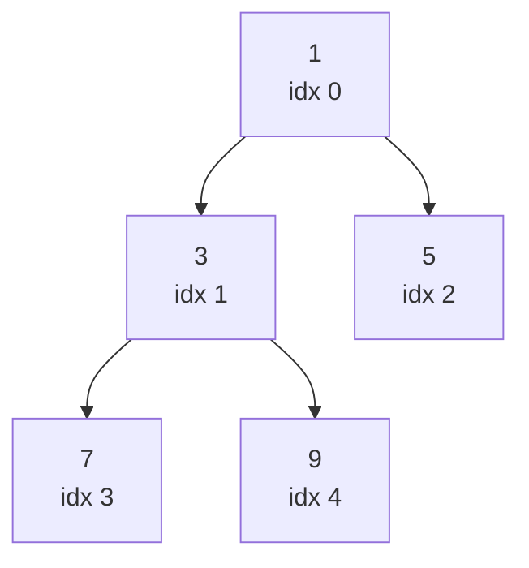
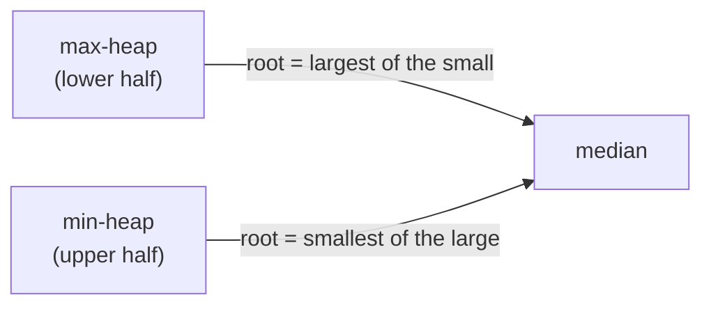

A heap answers one question fast, repeatedly: "what's the current min (or max)?" That single capability — `O(log n)` insert, `O(1)` peek, `O(log n)` remove-extreme — powers scheduling, top-K problems, heap sort, graph algorithms (Dijkstra's, Prim's), and merging sorted data. Interviewers expect you to reach for `PriorityQueue` the moment a problem mentions "kth", "top", "smallest/largest k", or "merge sorted".

## Binary heap as an array

A binary heap is a **complete binary tree** (every level full except possibly the last, filled left to right) stored directly in an array — no explicit pointers needed, because a node's children and parent are computable from its index.




| Node at index `i` | Formula |
|---|---|
| Left child | `2i + 1` |
| Right child | `2i + 2` |
| Parent | `(i - 1) / 2` |

A **min-heap** keeps every parent ≤ its children (root is the minimum); a **max-heap** flips the inequality. This is a weaker ordering than a BST — siblings have no defined order relative to each other — which is exactly why heap operations are cheaper than BST ones for "give me the extreme value" but can't do full sorted traversal or arbitrary search in `O(log n)`.

> [!KEY]
> A heap is not sorted — it only guarantees the root is the min (or max). That relaxed invariant is what makes insert and remove-extreme `O(log n)` instead of `O(n)`.

## Sift-up and sift-down

Insert appends to the end of the array, then **sifts up**: swap with the parent while the heap property is violated. Remove-min swaps the root with the last element, shrinks the array, then **sifts down**: swap with the smaller child while violated.

```java
// Sift up after appending — O(log n)
void siftUp(List<Integer> heap, int i) {
    while (i > 0) {
        int parent = (i - 1) / 2;
        if (heap.get(parent) <= heap.get(i)) break;
        Collections.swap(heap, parent, i);
        i = parent;
    }
}

// Sift down from index i — O(log n)
void siftDown(List<Integer> heap, int i) {
    int n = heap.size();
    while (true) {
        int left = 2 * i + 1, right = 2 * i + 2, smallest = i;
        if (left < n && heap.get(left) < heap.get(smallest)) smallest = left;
        if (right < n && heap.get(right) < heap.get(smallest)) smallest = right;
        if (smallest == i) break;
        Collections.swap(heap, i, smallest);
        i = smallest;
    }
}
```

Both operations move along a single root-to-leaf path, so both are `O(log n)` — bounded by the tree's height.

### Deleting an arbitrary element, not just the root

Removing the min/max is the common case, but a heap can also delete any known element: find its index (an accompanying hash map from value to index makes this `O(1)` instead of an `O(n)` scan), overwrite it with the last element in the array, shrink the array, then sift that replacement in whichever direction restores the heap property — it may need to sift up (if it's now smaller than its new parent, in a min-heap) or sift down (if it's larger than a new child).

```java
// Delete a known element by index — O(log n) once the index is known
void deleteAt(List<Integer> heap, int index) {
    heap.set(index, heap.get(heap.size() - 1));
    heap.remove(heap.size() - 1);
    if (index < heap.size()) {
        siftDown(heap, index);
        siftUp(heap, index);   // only one of these actually moves anything; harmless to call both
    }
}
```

This is the operation behind "cancel a scheduled job" or "remove a specific vertex's stale distance entry" — situations where you need to remove something other than the current extreme.

## Build-heap is O(n), not O(n log n)

Inserting `n` elements one at a time costs `O(n log n)`. But **heapify** — the standard build-from-array procedure — calls `SiftDown` on every non-leaf node, starting from the last non-leaf up to the root, and is `O(n)` overall.

The reason: most nodes live near the bottom of the tree and have very little distance left to sift. Roughly half the nodes are leaves (0 sift work), a quarter are one level up (at most 1 swap), an eighth two levels up, and so on — the sum `Σ (n / 2^(h+1)) * h` converges to a constant multiple of `n`, not `n log n`.

> [!TIP]
> Say this explicitly when it's relevant: *"Building the heap from the input array up front is O(n), so the overall algorithm is O(n + k log n) rather than O(n log n)"* — it's a precise, senior-sounding detail that most candidates get wrong.

## PriorityQueue in Java

Java's `PriorityQueue<T>` is a **binary min-heap** of elements, ordered either by their natural ordering or by a supplied `Comparator`; pass `Comparator.reverseOrder()` (or any custom comparator) for max-heap behaviour. The element itself is what gets compared — there is no separate priority argument — and note the queue is **not stable** for elements that compare equal.

```java
record Task(String name, int priority) {}

// Min-heap ordered by priority — lowest priority value polls first
PriorityQueue<Task> pq = new PriorityQueue<>(Comparator.comparingInt(Task::priority));
pq.offer(new Task("task-a", 5));
pq.offer(new Task("task-b", 1));   // lower priority value polls first
pq.poll();                          // Task[name=task-b, priority=1]

// Max-heap: reverse the comparator
PriorityQueue<Integer> maxPq = new PriorityQueue<>(Comparator.reverseOrder());
```

| Operation | Complexity |
|---|---|
| `offer` (add) | `O(log n)` |
| `poll` (remove min) | `O(log n)` |
| `peek` | `O(1)` |
| `remove(Object)` (arbitrary element) | `O(n)` |
| Construct from a `Collection` (heapify) | `O(n)` |

## Top-K pattern: min-heap of size k

To find the k **largest** elements in a stream, counter-intuitively use a **min-heap** capped at size k: push every element, and whenever the heap exceeds size k, pop the minimum. What survives at the end is the k largest, and the root is always the **kth largest** — a useful side effect.

```java
// k largest elements, O(n log k) time, O(k) space
public int[] kLargest(int[] nums, int k) {
    PriorityQueue<Integer> pq = new PriorityQueue<>();   // min-heap
    for (int x : nums) {
        pq.offer(x);
        if (pq.size() > k) pq.poll();       // evict the current smallest
    }
    int[] result = new int[pq.size()];
    for (int i = 0; i < result.length; i++) result[i] = pq.poll();
    return result;
}
```

`O(n log k)` beats sorting the whole array (`O(n log n)`) whenever `k` is small relative to `n` — a detail worth naming explicitly.

> [!WARNING]
> The inversion trips people up: min-heap for **largest** k, max-heap for **smallest** k. The heap holds the "k best so far", and you evict the *worst of the best* — which is the minimum when you're hunting for the largest values.

## Merge k sorted lists

Push the first element of each list (or its index) into a min-heap keyed by value. Repeatedly pop the minimum, emit it, and push the next element from the same source list.

```java
// O(N log k) time, O(k) space — N total elements across k lists
record Entry(int val, int listIdx, int elemIdx) {}

public int[] mergeKSortedArrays(int[][] lists) {
    PriorityQueue<Entry> pq = new PriorityQueue<>(Comparator.comparingInt(Entry::val));
    for (int i = 0; i < lists.length; i++)
        if (lists[i].length > 0) pq.offer(new Entry(lists[i][0], i, 0));

    List<Integer> result = new ArrayList<>();
    while (!pq.isEmpty()) {
        Entry e = pq.poll();
        result.add(e.val());
        if (e.elemIdx() + 1 < lists[e.listIdx()].length)
            pq.offer(new Entry(lists[e.listIdx()][e.elemIdx() + 1], e.listIdx(), e.elemIdx() + 1));
    }
    return result.stream().mapToInt(Integer::intValue).toArray();
}
```

## Median from a data stream: two heaps

Maintain a max-heap for the **lower** half of numbers seen and a min-heap for the **upper** half, kept balanced in size (within 1 of each other). The median is then either the max-heap's root, or the average of both roots.



```java
public class MedianFinder {
    private final PriorityQueue<Integer> lo = new PriorityQueue<>(Comparator.reverseOrder()); // max-heap
    private final PriorityQueue<Integer> hi = new PriorityQueue<>();  // min-heap

    public void addNum(int num) {
        lo.offer(num);
        hi.offer(lo.poll());                 // shuffle the max of lo into hi
        if (hi.size() > lo.size()) lo.offer(hi.poll());
    }

    public double findMedian() {
        return lo.size() > hi.size() ? lo.peek() : (lo.peek() + hi.peek()) / 2.0;
    }
}
```

Each insert is `O(log n)`; `FindMedian` is `O(1)` — a huge improvement over re-sorting on every insert.

## Heap vs sorted list vs BST

| Need | Heap | Sorted array/list | Balanced BST |
|---|---|---|---|
| Find min/max | `O(1)` peek | `O(1)` if you know which end | `O(log n)` |
| Insert | `O(log n)` | `O(n)` (shift to keep sorted) | `O(log n)` |
| Remove min/max | `O(log n)` | `O(1)` / `O(n)` depending on end | `O(log n)` |
| Search arbitrary value | `O(n)` | `O(log n)` (binary search) | `O(log n)` |
| Iterate in sorted order | `O(n log n)` (repeated pop) | `O(n)` | `O(n)` |
| Build from n items | `O(n)` | `O(n log n)` sort | `O(n log n)` insert one at a time |

> [!NOTE]
> Pick a heap when you only ever need the current extreme value repeatedly. Pick a sorted structure or BST when you need arbitrary search, range queries, or full sorted order — a heap can't do those efficiently.

## Cheat sheet

- A heap is a complete binary tree stored in an array; parent/child indices are pure arithmetic (`2i+1`, `2i+2`, `(i-1)/2`).
- Sift-up on insert, sift-down on remove — both `O(log n)`, bounded by tree height.
- Deleting a specific known element (not just the root): swap it with the last array element, shrink, then sift in whichever direction restores order — `O(log n)` given its index.
- Building a heap from a full array (`heapify`) is `O(n)`, not `O(n log n)` — most nodes are near the bottom with little sifting to do.
- `PriorityQueue<T>` in Java is a binary min-heap by default; flip to a max-heap with `Comparator.reverseOrder()`. It has no decrease-key and `remove(Object)` is `O(n)`.
- Top-k **largest** → min-heap capped at size k. Top-k **smallest** → max-heap capped at size k.
- Merge k sorted sequences: min-heap of "current head of each sequence", `O(N log k)`.
- Median of a stream: max-heap for the lower half + min-heap for the upper half, kept balanced in size.
- A heap can't binary-search or iterate in sorted order cheaply — use a BST or sorted structure for that.

## Common mistakes

| Mistake | Fix |
|---|---|
| Using a max-heap for "k largest" | Use a min-heap capped at size k, evicting the smallest |
| Assuming build-heap is `O(n log n)` | It's `O(n)` via bottom-up heapify |
| Expecting a heap to support fast arbitrary search | Heaps only guarantee the root; search is `O(n)` |
| Forgetting `PriorityQueue.poll` is `O(log n)`, not `O(1)` | Only `peek` is `O(1)` |
| Rebuilding the whole heap on every insert during a stream | Insert incrementally with sift-up, `O(log n)` per element |
| Using one heap to track a running median | You need two heaps, kept balanced in size |

## Summary

A heap trades full ordering for speed: it guarantees only that the root is the current extreme, which is exactly enough to make insert and remove-extreme `O(log n)` and peek `O(1)`. That trade-off underlies the top-k pattern (bound a heap to size k and evict the worst), merging sorted sequences (a heap of "current heads"), and streaming statistics like a running median (two balanced heaps). Know that heapify is `O(n)`, know the min-heap-for-largest inversion cold, and reach for `PriorityQueue` the moment a problem says "kth" or "top".

## Top Interview Questions

### Q1. What invariant does a binary heap maintain, and how does that differ from a binary search tree?

A min-heap guarantees only that every parent's value is less than or equal to both of its children's values — the root is therefore always the minimum — but there is no ordering guarantee between siblings or across subtrees otherwise. A BST guarantees a much stronger global invariant: every node in a left subtree is less than the node, and every node in the right subtree is greater, which holds recursively at every level. That extra structure is what lets a BST support `O(log n)` arbitrary search and in-order sorted traversal, capabilities a heap does not have (heap search is `O(n)`) — in exchange, a heap's weaker invariant makes insert and remove-extreme cheaper to maintain and lets it be stored compactly in an array with no pointers.

### Q2. Why is building a heap from an array O(n) rather than O(n log n)?

If you inserted `n` elements one at a time, each insert would cost up to `O(log n)` (sifting up from a leaf to the root), giving `O(n log n)` total. But the standard `heapify` procedure instead calls sift-down starting from the last non-leaf node up to the root. Because a heap is a complete binary tree, roughly half the nodes are leaves needing zero sift work, a quarter need at most one swap, an eighth need at most two, and so on — the total work sums to a series that converges to `O(n)`. The key insight is that sift-down's cost depends on a node's *height* (distance to the farthest leaf below it), and most nodes have small height, whereas sift-up's cost depends on *depth*, and most nodes have large depth — that asymmetry is exactly why building bottom-up beats inserting one at a time.

### Q3. How would you find the kth largest element in an unsorted array, and what are the complexity trade-offs?

Three approaches, in increasing order of efficiency: (1) sort the array and index from the end, `O(n log n)` time, `O(1)` extra space if sorting in place; (2) maintain a min-heap of size k, pushing every element and popping whenever the heap exceeds size k — the root ends up being the kth largest, `O(n log k)` time, `O(k)` space, which wins when `k` is much smaller than `n`; (3) Quickselect, a partition-based approach similar to quicksort that only recurses into the side containing the target index, giving `O(n)` average time (though `O(n²)` worst case) and `O(1)` extra space if done in place. I'd lead with the heap approach as the clean general answer and mention Quickselect as the optimal-average-case alternative if pressed for more.

### Q4. Design a data structure that returns the median of a growing stream of numbers efficiently.

Maintain two heaps: a max-heap holding the smaller half of the numbers seen so far, and a min-heap holding the larger half, keeping their sizes equal or differing by at most one. On each insertion, add the new number to one heap and then rebalance by moving the extreme element across if the size invariant is violated — this keeps both heaps balanced in `O(log n)` per insertion. The median is then `O(1)` to retrieve: if the heaps are equal in size, it's the average of both roots; if one has one more element, it's that heap's root. This beats re-sorting the whole dataset on every insertion (`O(n log n)` per number) by a huge margin.

### Q5. Explain how a priority queue is used in Dijkstra's shortest path algorithm.

Dijkstra repeatedly needs to select the unvisited vertex with the current smallest known distance from the source — exactly the operation a min-heap is built for. You push the source with distance 0, then repeatedly pop the minimum-distance vertex, relax (update) the distances of its neighbours, and push any improved distances back into the heap. Because the heap can contain stale entries (a vertex pushed multiple times with different distances before being finalized), and because Java's `PriorityQueue` offers no decrease-key, the standard idiom is lazy deletion: skip an entry when you pop it if it's already been finalized with a better distance. With a binary heap, this gives `O((V + E) log V)` overall — the heap is what turns the naive `O(V²)` array-scan version of Dijkstra into something efficient on sparse graphs.

### Q6. What's the difference between a min-heap capped at size k for "k largest" versus "k smallest" problems, and why does the inversion trip people up?

For k **largest**, you use a **min-heap**: push every element, and whenever the heap exceeds size k, pop (evict) the current minimum — because the minimum in the heap is the "weakest" candidate among your current top-k contenders, and you want to discard the weakest, not the strongest. For k **smallest**, you invert it: a **max-heap**, evicting the current maximum whenever the heap exceeds size k. The confusion comes from an intuitive but wrong instinct to use "a max-heap for the biggest things" — but the heap here isn't storing "the answer type", it's storing "the current best k candidates", and you always want to be able to cheaply find and discard the *worst* of those candidates, which is the opposite extreme from what you're ultimately looking for.

### Q7. Your service needs to process jobs by priority, and priorities can change after a job is enqueued (a "decrease-key" scenario). How would you handle this with a heap-based priority queue?

Standard binary heaps don't support an efficient direct decrease-key operation — you'd have to scan to find the item first, which is `O(n)`. A common practical workaround is "lazy deletion": when a job's priority changes, simply push a new entry with the updated priority and mark the old entry as stale (e.g., via a version number or a "cancelled" flag in an accompanying map); when popping, skip and discard any stale entries you encounter. This keeps every heap operation at `O(log n)` at the cost of some extra memory for stale entries and slightly more complex bookkeeping. If decrease-key needs to be truly first-class and frequent, a specialized structure like a Fibonacci heap (used in some theoretical Dijkstra implementations) supports `O(1)` amortised decrease-key, though it's rarely used in practice due to high constant factors and implementation complexity.

### Q8. How would you merge k sorted linked lists or arrays efficiently?

Push the first element (or head node) of each of the k sequences into a min-heap, tagged with which sequence it came from. Repeatedly pop the current minimum, append it to the result, and if the sequence it came from has more elements, push that sequence's next element into the heap. Every element across all sequences is pushed and popped exactly once, and each heap operation is `O(log k)` since the heap never holds more than k elements at a time, giving `O(N log k)` total time where N is the combined length of all sequences — a clear improvement over merging the lists two at a time sequentially, which would cost `O(N * k)` in the worst case.

### Q9. Why can't a heap efficiently answer "does value X exist in this collection?"

A heap only maintains the parent-child ordering invariant (parent ≤ children for a min-heap); it says nothing about the relative order of sibling subtrees, so there's no way to eliminate half the tree the way binary search does in a sorted array or BST. To check whether X exists, you'd have to potentially inspect every node — `O(n)` in the worst case — because a value could legally be located almost anywhere in the tree as long as it's ≥ its ancestors. If frequent membership checks are needed alongside priority operations, you'd pair the heap with a separate hash set (or hash map from value to heap position, for more advanced "find and update" scenarios) to get `O(1)` average membership checks on top of the heap's ordering guarantees.

### Q10. When would you choose a heap over simply keeping a sorted list?

Choose a heap when you mostly need to repeatedly insert and extract the current min/max and don't need full sorted order or arbitrary search — insert and remove-extreme are `O(log n)` on a heap versus `O(n)` on a sorted array/list (because inserting into a sorted array requires shifting elements to keep it sorted). Choose a sorted structure (sorted array, `TreeSet`, `TreeMap`) when you need to binary-search for arbitrary values, do range queries, or iterate the full collection in order frequently — those are `O(log n)` or `O(n)` respectively on a sorted structure but effectively `O(n)`/`O(n log n)` on a heap. In short: heap for "give me the extreme, repeatedly, cheaply"; sorted structure for "give me arbitrary order-based queries".

### Q11. How do you delete an arbitrary, known element from a heap — not just the root?

Locate the element's index (an auxiliary hash map from value to index turns this into `O(1)` instead of an `O(n)` scan), overwrite that slot with the last element in the underlying array, shrink the array by one, and then restore the heap property from that index — sift it down if it's now larger than one of its new children (min-heap), or sift it up if it's now smaller than its new parent. Only one direction will actually move the element, so it's safe to attempt both. This is `O(log n)` once the index is known, and it's the operation behind features like cancelling a specific scheduled job or evicting a specific stale entry, as opposed to `Dequeue`, which only ever removes the current extreme.
