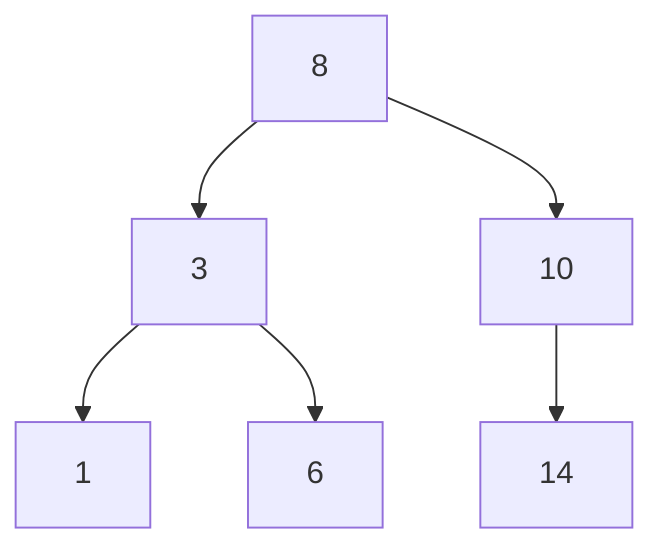
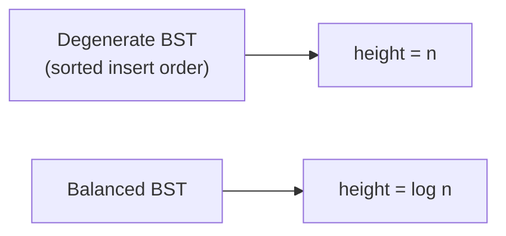

A binary search tree earns its keep by giving you `O(log n)` search, insert and delete **while also** giving you sorted order for free via an inorder traversal — no other structure covered so far does both. The catch is that "`O(log n)`" silently depends on the tree staying roughly balanced, which is where AVL and red-black trees come in.

## The BST invariant

For every node, **all values in its left subtree are smaller, and all values in its right subtree are larger** — and critically, this must hold for the *entire* subtree, not just the immediate children.



| Property | Guarantee |
|---|---|
| Left subtree of any node | All values `<` node's value |
| Right subtree of any node | All values `>` node's value |
| Inorder traversal | Produces values in ascending sorted order |
| Duplicates | Typically disallowed, or consistently routed one direction (e.g., always right) |

> [!KEY]
> The invariant is about the **entire subtree**, not just parent-vs-child. A node with a smaller left child and larger right child isn't automatically a valid BST — a deep descendant could still violate the global ordering relative to an ancestor further up.

## Search and insert

Both are the same idea: compare against the current node, and go left or right, discarding the other half of the tree at every step — the same principle as binary search on a sorted array, just realised as pointers instead of index arithmetic.

```java
public TreeNode search(TreeNode node, int key) {
    if (node == null || node.val == key) return node;
    return key < node.val ? search(node.left, key) : search(node.right, key);
}

public TreeNode insert(TreeNode node, int key) {
    if (node == null) return new TreeNode(key);
    if (key < node.val) node.left = insert(node.left, key);
    else if (key > node.val) node.right = insert(node.right, key);
    return node;   // duplicate: no-op, return unchanged
}
```

Both are `O(h)` where `h` is the tree's height — `O(log n)` if balanced, `O(n)` if degenerate.

## Delete: the two-child case

Deletion has three cases, and only one is genuinely tricky:

| Node to delete has | Action |
|---|---|
| No children | Simply remove it |
| One child | Splice the child up to replace it |
| Two children | Replace its value with its **inorder successor** (or predecessor), then delete that successor from the right subtree |

The inorder successor of a node with two children is the **leftmost node of its right subtree** — the smallest value greater than the node being deleted. Using it preserves the BST invariant because everything in the left subtree stays smaller and everything remaining in the right subtree stays larger.

```java
public TreeNode delete(TreeNode node, int key) {
    if (node == null) return null;
    if (key < node.val) node.left = delete(node.left, key);
    else if (key > node.val) node.right = delete(node.right, key);
    else {
        if (node.left == null) return node.right;
        if (node.right == null) return node.left;
        TreeNode successor = node.right;
        while (successor.left != null) successor = successor.left;  // leftmost = smallest in right subtree
        node.val = successor.val;
        node.right = delete(node.right, successor.val);            // remove the successor's original spot
    }
    return node;
}
```

> [!TIP]
> Say the successor/predecessor choice out loud: *"I could use either the inorder successor (min of right subtree) or predecessor (max of left subtree) — either preserves the invariant, I'll use the successor."* It shows you understand *why* it works, not just the recipe.

## Validating a BST: the classic min/max bug

The most common mistake is checking only immediate parent-child relationships instead of the full ancestor chain.

```java
// WRONG: only compares a node to its direct parent
boolean isValidBstWrong(TreeNode node) {
    if (node == null) return true;
    if (node.left != null && node.left.val >= node.val) return false;
    if (node.right != null && node.right.val <= node.val) return false;
    return isValidBstWrong(node.left) && isValidBstWrong(node.right);
}

// CORRECT: carry a valid (min, max) range down through the recursion
boolean isValidBst(TreeNode node, long min, long max) {
    if (node == null) return true;
    if (node.val <= min || node.val >= max) return false;
    return isValidBst(node.left, min, node.val) && isValidBst(node.right, node.val, max);
}
// Call as isValidBst(root, Long.MIN_VALUE, Long.MAX_VALUE)
```

The wrong version passes a tree like `[5, 3, 8, null, null, 4, 9]` where 4 sits under 8 but violates 5's invariant — every direct parent-child pair looks fine locally, but 4 should never appear in 5's right subtree at all.

> [!DANGER]
> This is one of the most-failed "easy" problems in interviews precisely because the wrong solution *looks* correct and passes simple test cases. Always carry a valid range down the recursion, not just a comparison with the immediate parent.

## Kth smallest element

Inorder traversal visits nodes in ascending order, so the kth smallest is simply the kth node visited — stop early once you reach it instead of building the full list.

```java
public int kthSmallest(TreeNode root, int k) {
    Deque<TreeNode> stack = new ArrayDeque<>();
    TreeNode cur = root;
    while (true) {
        while (cur != null) { stack.push(cur); cur = cur.left; }
        cur = stack.pop();
        if (--k == 0) return cur.val;
        cur = cur.right;
    }
}
```

`O(h + k)` time — you only descend to the leftmost node once, then advance k times — versus `O(n)` for collecting the entire inorder list first.

## Balanced trees: AVL vs red-black

An unbalanced BST degrades to a linked list in the worst case (inserting sorted data in order), turning every `O(log n)` operation into `O(n)`. Self-balancing trees fix this by restoring balance after every insert/delete via **rotations**.



| Aspect | AVL tree | Red-black tree |
|---|---|---|
| Balance condition | Strict — left/right subtree heights differ by ≤ 1 | Looser — longest path ≤ 2× shortest path |
| Lookup speed | Faster (more strictly balanced, lower height) | Slightly slower |
| Insert/delete speed | Slower (more rotations to maintain strict balance) | Faster (fewer rotations) |
| Typical use | Read-heavy workloads | Write-heavy workloads; used in Linux kernel schedulers, C++ `std::map` |

Both guarantee `O(log n)` height and thus `O(log n)` search/insert/delete — the difference is a constant-factor trade between lookup speed and update speed, not an asymptotic one.

> [!NOTE]
> You're extremely unlikely to be asked to implement AVL rotations from scratch. Knowing *why* self-balancing trees exist (to prevent the degenerate `O(n)` case) and the read-vs-write trade-off between AVL and red-black is the expected depth.

## The degenerate BST trap

Inserting already-sorted data into a plain BST with no rebalancing produces a tree that is really just a linked list in disguise — every node has only a right child (or only a left child).

| Insert order | Resulting shape | Height |
|---|---|---|
| `[1,2,3,4,5]` into a plain BST | Right-skewed chain | `O(n)` |
| `[3,1,4,2,5]` (randomised) into a plain BST | Roughly balanced | `O(log n)` |
| Any order into an AVL/red-black tree | Balanced by construction | `O(log n)` guaranteed |

This is why production sorted-map implementations (`TreeMap` in Java, `std::map` in C++) use self-balancing trees internally rather than plain BSTs.

## TreeMap and TreeSet in Java

Java doesn't expose a raw BST directly — it exposes `TreeMap<K,V>` and `TreeSet<T>`, both backed by a red-black tree internally, giving `O(log n)` operations with guaranteed balance. They also add ordered-navigation methods a plain BST doesn't: `floorKey`/`ceilingKey`/`higherKey`/`lowerKey` for nearest-key lookups, and `headMap`/`tailMap`/`subMap` (and the `TreeSet` equivalents) for range views.

```java
TreeMap<Integer, String> sd = new TreeMap<>();
sd.put(5, "five"); sd.put(1, "one"); sd.put(3, "three");
for (var kv : sd.entrySet()) { /* iterates in ascending key order: 1, 3, 5 */ }

TreeSet<Integer> ss = new TreeSet<>();
ss.add(5); ss.add(1); ss.add(3);
int smallest = ss.first();                   // O(log n)
SortedSet<Integer> view = ss.subSet(1, 4);   // range view [1, 4), O(log n) to set up
```

| Need | Structure |
|---|---|
| Guaranteed `O(log n)`, sorted iteration, range queries | `TreeMap` / `TreeSet` |
| Fastest average lookup, order doesn't matter | `HashMap` / `HashSet` |
| Manual BST for a specific algorithmic problem | Roll your own `TreeNode` class |

## Cheat sheet

- BST invariant is global per subtree, not just parent-vs-child — validate with a carried (min, max) range.
- Search/insert/delete are all `O(h)`; `h` is `O(log n)` balanced, `O(n)` degenerate.
- Two-child delete: replace with inorder successor (min of right subtree) or predecessor (max of left subtree), then delete that node recursively.
- Inorder traversal of a BST yields sorted order — kth smallest is just the kth node visited, stop early.
- AVL trees are more strictly balanced (faster lookup, slower updates); red-black trees are looser (faster updates, still `O(log n)` throughout).
- Inserting sorted data into a plain BST degenerates it into a linked list — `O(n)` height. Self-balancing trees prevent this by construction.
- In Java, use `TreeMap`/`TreeSet` for a production-grade balanced tree — both are red-black trees under the hood, with `floorKey`/`ceilingKey`/`higherKey`/`subMap` ordered navigation on top.

## Common mistakes

| Mistake | Fix |
|---|---|
| Validating a BST by comparing only to direct children | Carry a valid (min, max) range down the recursion |
| Forgetting the two-child delete case needs a successor/predecessor swap | Always handle 0/1/2-child deletion as three explicit cases |
| Assuming BST operations are always `O(log n)` | They're `O(h)`; a degenerate/skewed tree makes `h = O(n)` |
| Inserting pre-sorted data into a plain (non-balancing) BST | Randomise insert order, or use a self-balancing structure |
| Forgetting duplicates need a consistent policy | Decide up front: disallow, or always route one direction |
| Using `HashMap` when sorted iteration or range queries are needed | Use `TreeMap`/`TreeSet` instead |

## Summary

A BST gives you `O(log n)` search, insert and delete plus sorted order for free — but only when it stays balanced, which a plain BST does not guarantee on its own. Know the delete-with-two-children successor swap, the min/max-range technique for validation (the single most commonly botched "easy" tree question), and that inorder traversal turns kth-smallest into an early-exit scan. AVL and red-black trees exist purely to bound height at `O(log n)` regardless of insert order, with AVL favouring lookup speed and red-black favouring update speed — in Java, that's `TreeMap`/`TreeSet` under the hood.

## Top Interview Questions

### Q1. What invariant defines a binary search tree, and why must it apply to entire subtrees, not just parent-child pairs?

For every node, all values in its left subtree must be smaller than the node's value, and all values in its right subtree must be larger — and this must hold transitively for every descendant, not merely the node's immediate children. If you only checked immediate parent-child pairs, a tree could have a node whose direct children satisfy the local comparison but whose grandchild's value violates the ordering relative to a higher ancestor — for example, a right grandchild that's smaller than the root even though it's larger than its immediate parent. This is exactly why BST validation requires carrying a valid (min, max) bound down through the recursion rather than comparing only adjacent nodes.

### Q2. Walk through deleting a node with two children from a BST.

You cannot simply remove the node, since that would disconnect both of its subtrees. Instead, find either its inorder successor (the smallest value in its right subtree — reached by going right once, then left as far as possible) or its inorder predecessor (the largest value in its left subtree), copy that value into the node being "deleted", and then recursively delete the successor (or predecessor) from its original position — which is guaranteed to have at most one child, reducing to the simpler 0- or 1-child case. Using the successor or predecessor preserves the BST invariant because it's the next value in sorted order relative to the deleted node, so everything smaller stays in the left subtree and everything larger stays in the right.

### Q3. Why does an inorder traversal of a BST produce sorted output, and how would you exploit that for "kth smallest element"?

Inorder traversal visits left subtree, then the node, then right subtree — and because every node's left subtree contains only smaller values and its right subtree only larger ones, this visiting order necessarily produces values in strictly ascending order. For kth smallest, rather than collecting the entire traversal into a list and indexing into it (`O(n)` time and space), use an iterative inorder traversal with an explicit stack and stop as soon as you've popped the kth node, giving `O(h + k)` time and `O(h)` space — you only ever descend to the leftmost node once and then take k steps forward.

### Q4. A candidate submits a BST validation function that checks node.left.val < node.val < node.right.val at every node. What's wrong with it, and how do you demonstrate the bug?

This only enforces the invariant locally between a node and its immediate children, not globally across the whole subtree, so it can incorrectly accept invalid trees. A concrete counterexample: the tree with root 5, left child 3, right child 8, where 8's left child is 4. Every local parent-child comparison passes (3 < 5, 8 > 5, 4 < 8), but 4 is in the root's right subtree even though 4 < 5, violating the true BST invariant. The fix is to pass a valid (min, max) range down the recursion — initially (−∞, +∞) — narrowing it to (min, node.val) when recursing left and (node.val, max) when recursing right, and failing immediately if a node's value falls outside its inherited range.

### Q5. What happens to BST operations if you insert already-sorted data, and how do self-balancing trees prevent this?

Inserting strictly increasing (or decreasing) values into a plain BST with no rebalancing produces a tree where every node has only a right child (or only a left child) — structurally identical to a linked list. Its height becomes `O(n)` instead of `O(log n)`, so search, insert, and delete all degrade to `O(n)`. Self-balancing trees like AVL or red-black trees prevent this by performing rotations after every insert/delete that would otherwise unbalance the tree, guaranteeing height stays `O(log n)` regardless of insertion order — this is why production sorted-map implementations (`std::map`, `TreeMap`) use self-balancing trees rather than plain BSTs internally.

### Q6. Compare AVL trees and red-black trees at a conceptual level. When would each be preferable?

Both guarantee `O(log n)` height and thus `O(log n)` search/insert/delete, but they differ in how strictly they enforce balance. AVL trees require every node's left and right subtree heights to differ by at most 1, which keeps the tree closer to perfectly balanced and gives faster lookups, at the cost of more frequent rotations (and thus slower inserts/deletes) to maintain that strict condition. Red-black trees use a looser balance condition (via node colouring rules, roughly guaranteeing the longest root-to-leaf path is no more than twice the shortest), tolerating a slightly taller tree in exchange for fewer rotations per update. AVL suits read-heavy workloads where lookup speed dominates; red-black suits write-heavy workloads, which is why it's the more common choice in general-purpose library implementations like `std::map` and the Linux kernel's scheduler.

### Q7. How would you find the lowest common ancestor of two nodes in a BST, and how is it simpler than the general binary tree case?

Starting at the root, compare both target values against the current node's value. If both targets are smaller than the current node, the LCA must be in the left subtree, so recurse (or iterate) left. If both are larger, recurse right. As soon as the targets fall on opposite sides (or one of them equals the current node), the current node is the LCA — return it immediately. This exploits the BST ordering invariant to avoid searching both subtrees the way a general binary tree LCA algorithm must, giving `O(h)` time using a single root-to-target path, versus `O(n)` for the general-tree version which may need to visit every node. It can also be written iteratively with a simple `while` loop instead of recursion, since there's no need to combine results from two branches.

### Q8. Your production service uses a custom BST to maintain a sorted index, and you notice lookups have gotten progressively slower over months of operation. What's your diagnosis and fix?

The most likely cause is that the tree has become unbalanced through its insertion history — for example, if keys tend to arrive in increasing order (timestamps, auto-incrementing IDs), a plain BST with no rebalancing degrades toward a linked list, pushing height from `O(log n)` toward `O(n)` and making every lookup progressively slower as more skewed data accumulates. I'd confirm by measuring the tree's actual height against `log2(n)` for the current node count — a height many times larger than `log2(n)` confirms the diagnosis. The fix is to replace the custom BST with a self-balancing structure (red-black tree, AVL, or in Java, `TreeMap`/`TreeSet`), or periodically rebuild the tree from a sorted snapshot of its data using a balanced-construction algorithm (picking the middle element as root recursively) if a full self-balancing rewrite isn't feasible immediately.

### Q9. How would you construct a height-balanced BST from a sorted array?

Recursively pick the middle element of the current array range as the root, then recurse on the left half to build the left subtree and the right half to build the right subtree. Because you always split the remaining range roughly in half, the resulting tree has `O(log n)` height by construction, without needing any rotations — this works specifically because the input is already sorted, so the middle element is guaranteed to be the correct BST root for that range without any comparisons needed. This is `O(n)` time overall (each element is processed once to create a node) and is often used as a way to "rebalance" a tree that's become skewed, by first flattening it to a sorted array via inorder traversal and then rebuilding it with this technique.

### Q10. In Java, when would you choose TreeMap over HashMap, and what do you give up?

Choose `TreeMap` when you need keys to iterate in sorted order, or need range-style queries like "smallest key greater than X" (`ceilingKey`/`higherKey`) or `subMap`, none of which `HashMap` supports at all since it offers no ordering guarantee. The cost is that `TreeMap`'s operations (`put`, lookup, `remove`) are `O(log n)`, backed by a red-black tree, versus `HashMap`'s `O(1)` average, backed by a hash table — so if you never need sorted iteration or range queries, `HashMap` is strictly faster and should be the default. A common production pattern is using `HashMap` for the hot-path lookups and only building a sorted view (or using `TreeMap` from the start) when a specific feature genuinely requires ordered enumeration, like generating a sorted report or implementing a leaderboard-style range query.
