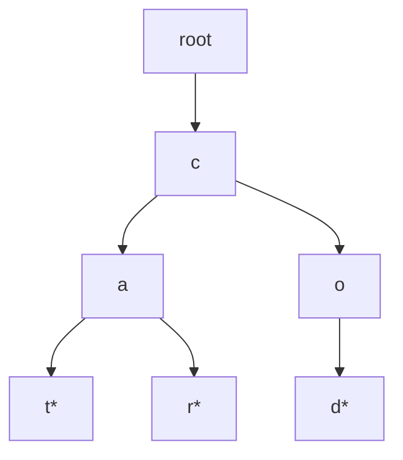

A trie (prefix tree) is the structure interviewers reach for the moment a problem mentions **prefixes** — autocomplete, spell-check, longest common prefix, word search on a board. Its entire value proposition is sharing common prefixes across many strings so you never re-scan them.

## Structure

Each node represents one character position and holds a map (or fixed-size array) of children, plus a flag marking whether a complete word ends there. The root represents the empty prefix.



The diagram above encodes `"cat"`, `"car"`, and `"cod"` — nodes marked `*` are end-of-word markers. Notice `"ca"` is shared structurally between `"cat"` and `"car"`: that shared prefix is stored exactly once, which is the whole point.

```java
class TrieNode {
    Map<Character, TrieNode> children = new HashMap<>();
    boolean isWord;
    String word;   // optional terminal payload for word-search/autocomplete variants
}
```

> [!KEY]
> A trie's cost is proportional to the **length of the key**, not the number of keys stored. Searching for a word of length L is `O(L)`, whether the trie holds ten words or ten million.

## Node children: map vs fixed array

| Representation | Lookup | Memory | When to use |
|---|---|---|---|
| `Map<Character, TrieNode>` | `O(1)` average | Only allocates for characters actually present | Unicode, large or sparse alphabet |
| `TrieNode[26]` (fixed array) | `O(1)`, no hashing overhead | Fixed 26 slots per node regardless of usage | Known small alphabet (lowercase English letters) |

The array version is faster in practice (array indexing beats hashing) and is the standard choice when the problem guarantees lowercase letters only — a detail worth stating explicitly to show you're thinking about constants, not just asymptotic complexity.

## Insert, search, startsWith

```java
public class Trie {
    private final TrieNode root = new TrieNode();

    public void insert(String word) {
        TrieNode node = root;
        for (char c : word.toCharArray()) {
            node = node.children.computeIfAbsent(c, k -> new TrieNode());
        }
        node.isWord = true;
    }

    public boolean search(String word) {
        TrieNode node = find(word);
        return node != null && node.isWord;
    }

    public boolean startsWith(String prefix) {
        return find(prefix) != null;
    }

    private TrieNode find(String s) {
        TrieNode node = root;
        for (char c : s.toCharArray()) {
            node = node.children.get(c);
            if (node == null) return null;
        }
        return node;
    }
}
```

| Operation | Time | Space |
|---|---|---|
| Insert | `O(L)` | `O(L)` worst case (new path for a fully novel word) |
| Search | `O(L)` | `O(1)` |
| StartsWith | `O(L)` | `O(1)` |

`L` = length of the word/prefix. Note that `search` and `startsWith` share almost identical logic — `search` just adds the `isWord` check at the end, which is why interviewers often ask you to implement both to see if you notice the overlap.

## Trie vs hash set

| Need | Hash set | Trie |
|---|---|---|
| Exact word membership | `O(L)` average, simpler | `O(L)`, more memory overhead per node |
| "Does any word start with this prefix?" | `O(n * L)` — must check every word | `O(L)` — walk the prefix once |
| Autocomplete (list all words with a prefix) | Not supported directly | Walk to the prefix node, then DFS the subtree |
| Memory for many words sharing prefixes | One full copy of each string | Shared nodes for common prefixes |
| Memory for words with little prefix overlap | Compact | Overhead of many single-child chains |

> [!TIP]
> If a problem only ever asks "is this exact string present?", a `HashSet<String>` is simpler and just as fast — don't reach for a trie by default. Reach for it specifically when prefixes matter: "starts with", "autocomplete", or "shares a prefix with".

## Autocomplete

Walk down the trie following the typed prefix — `O(L)` — then run a DFS from that node to collect every complete word in its subtree.

```java
public List<String> autocomplete(String prefix) {
    TrieNode node = find(prefix);
    List<String> results = new ArrayList<>();
    if (node != null) collect(node, new StringBuilder(prefix), results);
    return results;
}

private void collect(TrieNode node, StringBuilder path, List<String> results) {
    if (node.isWord) results.add(path.toString());
    for (var entry : node.children.entrySet()) {
        path.append(entry.getKey());
        collect(entry.getValue(), path, results);
        path.setLength(path.length() - 1);   // backtrack
    }
}
```

Total cost is `O(L + T)`, where `T` is the number of trie nodes in the matching prefix's subtree (equivalently proportional to the total characters in the completions returned). You never touch unrelated branches outside that prefix.

## Word search on a board

Combine a trie with DFS/backtracking on a 2-D grid to search for **multiple words simultaneously**, instead of running a separate DFS per word. Insert all target words into a trie first (storing the complete word on each terminal node); then DFS from every board cell, following trie edges instead of a fixed target string, and prune immediately when the current path leaves the trie.

```java
void dfs(char[][] board, int r, int c, TrieNode node, List<String> found) {
    char ch = board[r][c];
    if (ch == '#') return;
    TrieNode next = node.children.get(ch);
    if (next == null) return;
    if (next.word != null) { found.add(next.word); next.word = null; }  // avoid duplicates

    board[r][c] = '#';   // mark visited
    int[][] dirs = { {0, 1}, {0, -1}, {1, 0}, {-1, 0} };
    for (int[] d : dirs) {
        int nr = r + d[0], nc = c + d[1];
        if (nr >= 0 && nr < board.length && nc >= 0 && nc < board[0].length)
            dfs(board, nr, nc, next, found);
    }
    board[r][c] = ch;    // backtrack
}
```

The trie prunes the search: as soon as the path-so-far isn't a prefix of *any* target word, that branch stops immediately — far cheaper than checking each of `k` words independently against every board path, which would cost `O(k)` times as much work.

## Longest common prefix

Insert all strings, then walk down from the root as long as each node has exactly one child and isn't a word boundary — the path traced out is the longest common prefix.

```java
// Simpler non-trie approach for a single call: compare strings pairwise
public String longestCommonPrefix(String[] strs) {
    if (strs.length == 0) return "";
    int end = strs[0].length();
    for (int i = 1; i < strs.length; i++) {
        int j = 0;
        while (j < end && j < strs[i].length() && strs[0].charAt(j) == strs[i].charAt(j)) j++;
        end = j;
        if (end == 0) return "";
    }
    return strs[0].substring(0, end);
}
```

`O(n * m)` where `m` is the shortest string length — a trie is overkill for a single one-off query like this, but becomes worthwhile when you need to answer "longest common prefix" repeatedly against an evolving dictionary.

## Compressed tries

A **compressed trie** (radix tree / Patricia trie) merges chains of single-child nodes into one edge labelled with a substring instead of one character per node — this collapses long unbranching paths (common with sparse datasets like IP routing tables or URLs) and saves substantial memory.

| Aspect | Standard trie | Compressed trie (radix tree) |
|---|---|---|
| Edge label | Single character | Substring |
| Nodes for a long unbranching chain | One per character | One for the whole chain |
| Used in | Interview problems, in-memory dictionaries | IP routing tables, filesystem paths, DNS |

## When a trie is worth it

| Signal in the problem | Use a trie? |
|---|---|
| "Does any string start with X?" repeatedly | Yes |
| Autocomplete / typeahead | Yes |
| Searching multiple target words on a grid simultaneously | Yes |
| Simple "is this exact word present" membership check | No — `HashSet<String>` is simpler and equally fast |
| Strings share very little prefix structure (e.g., random UUIDs) | No — trie overhead outweighs the benefit |

## String matching: finding a pattern inside a text

A trie answers "which of many strings share this prefix". A different, equally common interview family asks the reverse question: given one (often long) text and one pattern, find every place the pattern occurs — in `O(n + m)`, without the naive `O(n·m)` of sliding the pattern one character at a time and re-comparing from scratch on every mismatch.

### KMP (Knuth-Morris-Pratt): never re-scan the text

KMP's insight is that a mismatch still tells you something: the characters matched *so far* are known, so instead of restarting the pattern from its first character, you fall back to the longest prefix of the pattern that is also a suffix of what you've already matched — that prefix doesn't need re-checking, because you already know it matches.

This "longest proper prefix that's also a suffix" is precomputed once per pattern into an **LPS array**:

```text
pattern = "ABABC"
lps[0] = 0   (A            — no proper prefix)
lps[1] = 0   (AB           — no prefix equals a suffix)
lps[2] = 1   (ABA          — "A" is both prefix and suffix)
lps[3] = 2   (ABAB         — "AB" is both prefix and suffix)
lps[4] = 0   (ABABC        — no match)
```

```java
// Builds lps[i] = length of the longest proper prefix of pattern[0..i] that's also its suffix — O(m)
int[] buildLps(String pattern) {
    int m = pattern.length();
    int[] lps = new int[m];
    int len = 0, i = 1;
    while (i < m) {
        if (pattern.charAt(i) == pattern.charAt(len)) lps[i++] = ++len;
        else if (len > 0) len = lps[len - 1];   // fall back without advancing i
        else lps[i++] = 0;
    }
    return lps;
}

// O(n + m) — the text pointer i never moves backward; only the pattern pointer j falls back
List<Integer> kmpSearch(String text, String pattern) {
    if (pattern.isEmpty()) return List.of(0);
    int[] lps = buildLps(pattern);
    List<Integer> matches = new ArrayList<>();
    int i = 0, j = 0;
    while (i < text.length()) {
        if (text.charAt(i) == pattern.charAt(j)) { i++; j++; }
        if (j == pattern.length()) {
            matches.add(i - j);
            j = lps[j - 1];
        } else if (i < text.length() && text.charAt(i) != pattern.charAt(j)) {
            if (j != 0) j = lps[j - 1];   // fall back to the next-best prefix
            else i++;                      // nothing matched yet at this position; just advance the text
        }
    }
    return matches;
}
```

`O(m)` to build the LPS array, `O(n)` to scan the text once — `O(n + m)` total, no backtracking on the text.

### Rabin-Karp: rolling hash

Instead of comparing characters, hash every `m`-length window of the text and compare hashes to the pattern's hash. The trick that makes this fast is a **rolling hash**: updating the previous window's hash to the next window's hash in `O(1)` by removing the leading character's contribution and appending the new trailing character, rather than rehashing the whole window.

```java
// Average O(n + m), worst case O(n*m) if hashes collide — always verify a hash match against the real substring
boolean rabinKarp(String text, String pattern) {
    final int BASE = 31, MOD = 1_000_000_007;
    int m = pattern.length(), n = text.length();
    if (m > n) return false;

    long patternHash = 0, windowHash = 0, highestPower = 1;
    for (int i = 0; i < m - 1; i++) highestPower = highestPower * BASE % MOD;
    for (int i = 0; i < m; i++) {
        patternHash = (patternHash * BASE + pattern.charAt(i)) % MOD;
        windowHash = (windowHash * BASE + text.charAt(i)) % MOD;
    }

    for (int i = 0; i <= n - m; i++) {
        if (patternHash == windowHash && text.substring(i, i + m).equals(pattern)) return true;
        if (i < n - m) {
            windowHash = (windowHash - text.charAt(i) * highestPower % MOD + MOD) * BASE % MOD + text.charAt(i + m);
            windowHash %= MOD;
        }
    }
    return false;
}
```

The hash-match check must still verify the actual substring (`O(m)`) because different substrings can collide to the same hash — skipping that verification is a correctness bug, not just a style choice. Rabin-Karp's real strength is **multi-pattern** search (hash all patterns into a set, then check every window's hash for membership) and duplicate-substring problems, where its rolling-hash mechanism generalises better than KMP's single-pattern LPS array.

### Z-algorithm

`Z[i]` is the length of the longest substring starting at index `i` that is also a prefix of the whole string. Once you have the Z-array, pattern search becomes a single concatenation trick: build `pattern + '$' + text` (`$` being a separator absent from both), compute its Z-array, and every index where `Z[i] == pattern.length()` marks a match in `text`.

```java
// O(n) — maintains [l, r), the rightmost prefix-matching window found so far, to avoid re-comparing known characters
int[] zArray(String s) {
    int n = s.length();
    int[] z = new int[n];
    int l = 0, r = 0;
    for (int i = 1; i < n; i++) {
        if (i < r) z[i] = Math.min(r - i, z[i - l]);
        while (i + z[i] < n && s.charAt(z[i]) == s.charAt(i + z[i])) z[i]++;
        if (i + z[i] > r) { l = i; r = i + z[i]; }
    }
    return z;
}
```

Beyond pattern search, the Z-array helps with prefix-heavy questions such as "what's the shortest repeating unit of this string"; with additional bookkeeping it can also be used in distinct-substring counting, though suffix arrays/automata are the more common production tools for that problem.

> [!NOTE]
> **Aho-Corasick** is what you reach for when you have *many* patterns to search for simultaneously in one text: build a trie of all patterns, then add KMP-style failure links between trie nodes so a mismatch falls back to the longest matching suffix already seen, anywhere in the trie. It runs in `O(n + Σ|patterns| + matches)` — the trie you already know how to build, plus one linear pass. **Manacher's algorithm** solves a different problem — every palindromic substring in `O(n)`, by mirroring already-computed palindrome lengths around a tracked centre — worth recognising by name even if you'd rarely implement it from scratch under interview time pressure.

| Algorithm | Preprocessing | Search | Space | Best for |
|---|---|---|---|---|
| Naive | `O(1)` | `O(n·m)` | `O(1)` | Short text/pattern only |
| KMP | `O(m)` | `O(n)` | `O(m)` | Single pattern, guaranteed no re-scanning |
| Z-algorithm | `O(n + m)` | `O(n + m)` | `O(n + m)` | Prefix-based queries, distinct-substring counting |
| Rabin-Karp | `O(m)` | `O(n)` average | `O(1)` | Multi-pattern search, duplicate-substring problems |
| Aho-Corasick | `O(Σ\|pᵢ\|)` | `O(n + matches)` | `O(Σ\|pᵢ\|)` with sparse transitions | Many patterns searched simultaneously |

## Cheat sheet

- A trie's cost scales with **key length**, not key count — `O(L)` insert/search regardless of how many words are stored.
- Use a fixed-size array (`TrieNode[26]`) for a known small alphabet; use a `Map<Character, TrieNode>` otherwise.
- `search` and `startsWith` share the same traversal — `search` just adds an `isWord` check at the end.
- Reach for a trie specifically for prefix-related questions — autocomplete, "starts with", multi-word board search.
- Don't use a trie for plain exact-membership checks — a hash set is simpler and just as fast for that.
- Word search on a board: insert all target words into a trie, then DFS once per cell, pruning branches that leave the trie.
- Compressed tries (radix trees) merge single-child chains into one edge — used for IP routing tables and URL/path storage in production.
- KMP falls back using a precomputed LPS array so the text pointer never moves backward — `O(n + m)`, no re-scanning.
- Rabin-Karp compares rolling hashes, not characters — always verify a hash match against the real substring, and it's the natural choice for multi-pattern search.
- Aho-Corasick is a trie plus KMP-style failure links, for searching many patterns in one pass.

## Common mistakes

| Mistake | Fix |
|---|---|
| Using a trie for simple exact-match membership | Use `HashSet<String>` instead — simpler, same speed |
| Forgetting the end-of-word marker | Without `isWord`, you can't tell a prefix from a stored word |
| Running a separate DFS per target word on a board | Insert all words into one trie, DFS once per cell |
| Not pruning a board DFS when the path leaves the trie | Check `node.children.get(ch) != null` before recursing further |
| Assuming trie memory usage is always lower than a hash set | It's lower only when strings share meaningful prefixes |
| Re-visiting the same board cell within one DFS path | Mark visited (or swap the character) and restore on backtrack |
| Trusting a Rabin-Karp hash match without verifying the substring | Hashes can collide — always confirm with a direct string comparison |
| Restarting the pattern from index 0 on every KMP mismatch | Fall back using the LPS array instead — that's the entire point of KMP |

## Summary

A trie shares common prefixes across many strings in a single tree, so any prefix-related query — search, startsWith, autocomplete, multi-word board search — costs `O(L)` in the length of the key rather than scanning every stored string. It is not a general-purpose replacement for a hash set; use it specifically when the problem is about prefixes, and default to a hash set for plain membership checks. The board-search combination (trie plus backtracking DFS, pruning branches that leave the trie) is the pattern most likely to appear as a "hard" interview question on this topic. The related but distinct family — KMP, Rabin-Karp, the Z-algorithm — finds a pattern inside a single text in linear time by never re-scanning characters it has already matched, and Aho-Corasick bridges the two families by adding failure links to a trie.

## Top Interview Questions

### Q1. What is a trie, and what complexity guarantee does it provide that a hash set doesn't?

A trie (prefix tree) is a tree where each node represents one character position, edges represent the next character in a sequence, and a boolean flag marks nodes where a complete stored word ends. Its key property is that operations cost `O(L)` where `L` is the length of the key being inserted or searched, completely independent of how many other keys are stored — a hash set gives you `O(L)` average for exact membership too, but has no efficient way to answer "does any stored string start with this prefix?" without scanning every stored string, which is `O(n * L)`. A trie answers that same prefix query in `O(L)` by simply walking down the tree following the prefix's characters.

### Q2. When would you choose a fixed-size array of children over a dictionary/map of children in a trie node, and why?

Choose a fixed-size array (e.g., `TrieNode[26]` for lowercase English letters) when the alphabet is small and known in advance — array indexing by character offset (`c - 'a'`) is a direct memory access with no hashing overhead, which is faster in practice than dictionary lookups even though both are asymptotically `O(1)`. The trade-off is that every node allocates all 26 slots regardless of how many children it actually has, which wastes memory for sparse tries. Choose a `Map<Character, TrieNode>` instead when the alphabet is large, unknown, or Unicode, where a fixed array would either be impractically large or wouldn't cover all possible characters.

### Q3. Design a trie that supports insert, search (exact match), and startsWith (prefix match).

All three operations share the same traversal: walk from the root, following the child corresponding to each character of the input string, creating new nodes as needed for insert or returning early on a missing child for search/startsWith. Insert marks the final node's `isWord` flag true. `search` performs the traversal and returns true only if the final node exists **and** has `isWord` set. `startsWith` performs the identical traversal but returns true as long as the final node exists at all, regardless of `isWord` — since a prefix doesn't need to be a complete stored word. All three run in `O(L)` time where `L` is the length of the input string, and I'd implement `search` and `startsWith` by sharing a single internal helper that returns the terminal node (or null), since their logic differs only in that final check.

### Q4. How would you implement autocomplete (return all stored words matching a given prefix) using a trie?

First walk down the trie following the prefix's characters, in `O(L)` time, to reach the node representing that exact prefix — if any character is missing along the way, there are no completions, return an empty list immediately. From that node, run a DFS (or BFS) over its entire subtree, building up the string as you descend and collecting it into the result list whenever you pass a node with `isWord` set. The total cost is `O(L + S)` where `S` is the total size of all matching completions collected — you never touch any part of the trie outside that prefix's subtree, which is the entire efficiency win over scanning a flat list of all stored words.

### Q5. Walk through solving "word search II" — finding which of a list of words appear in a 2-D letter board — efficiently.

The naive approach runs a separate DFS/backtracking search per target word against the board, costing roughly `O(k * rows * cols * 4^L)` for `k` words. The efficient approach inserts all `k` target words into a single trie first, then runs just one DFS per board cell, following trie edges instead of a fixed target string — at each step, only recurse into a neighbouring cell if the current trie node has a child matching that cell's letter, which prunes any path that can't possibly be a prefix of any remaining target word. Whenever the current trie node's `isWord` flag is set, you've found a match; mark it to avoid duplicate reporting. This shares all common prefix-checking work across all `k` words simultaneously rather than repeating it per word.

### Q6. What's the memory trade-off of using a trie versus simply storing all strings in a hash set?

A trie shares memory across common prefixes — if many stored strings begin with the same substring, that substring's path through the tree is stored exactly once, regardless of how many strings share it. A hash set, by contrast, stores each string as an independent, full copy in memory. This means a trie is more memory-efficient specifically when stored strings have substantial prefix overlap (a dictionary of English words, for example), but can actually use *more* memory than a hash set when strings share little to no prefix structure (random UUIDs, hashes), because each trie node carries its own overhead (a children map/array plus a boolean flag) on top of the character data itself.

### Q7. How would you find the longest common prefix among a set of strings, and would you use a trie?

For a single, one-off query, a trie is overkill — simpler to take the first string as a candidate prefix and, for each subsequent string, shrink the candidate from the end until it's actually a prefix of that string (using `startsWith`), stopping early if the candidate becomes empty. This is `O(n * m)` where `m` is the length of the shortest string, and needs no extra data structure. A trie becomes worthwhile if you need to answer this kind of prefix query repeatedly against a growing or changing set of strings: insert everything once, then the longest common prefix is found by walking from the root as long as each node has exactly one child and isn't itself a complete word boundary — amortising the cost across many queries instead of rescanning the whole set every time.

### Q8. What is a compressed trie (radix tree), and why would production systems prefer it over a standard trie?

A compressed trie merges any chain of nodes that each have exactly one child into a single edge labelled with the full substring spanned by that chain, rather than one node per character. This matters a lot for data with long unbranching stretches and relatively few branch points — IP routing tables, URL paths, filesystem paths — because a standard trie would allocate a separate node for every single character along those long stretches, wasting memory and traversal steps on segments that never actually branch. Production systems like IP routers and some database indexes use radix trees specifically because the memory and lookup-time savings from this compression are significant at the scale they operate, even though the implementation is somewhat more complex (edges now store variable-length substrings and may need to be split when a new insertion diverges partway through an existing edge).

### Q9. Your team is deciding between a HashSet<String> and a trie to power a search-as-you-type feature against a dictionary of a million words. Walk through your reasoning.

A `HashSet<String>` only answers "is this exact string present" in `O(L)` — to support search-as-you-type (matching partial input against all words that start with it), you'd need to scan the entire set checking `startsWith` on every word, which is `O(n * L)` per keystroke and would not scale interactively against a million-word dictionary. A trie answers "what words start with this prefix" natively in `O(L)` to reach the prefix node, plus `O(S)` to collect the actual matches, which scales with the *output size*, not the dictionary size — exactly the right shape for autocomplete. I'd choose the trie here specifically because the feature's core requirement — prefix matching, repeated on every keystroke — is precisely what a trie is optimized for, and the English-word dictionary has enough shared prefix structure that memory usage should also be reasonable, possibly better than the hash set.

### Q10. How would you handle case-insensitivity and non-alphabetic characters (numbers, punctuation) in a trie-based dictionary?

For case-insensitivity, normalise all input to a single case (typically lowercase) before both insertion and lookup, so `"Cat"` and `"cat"` map to the identical path in the trie — this needs to happen consistently at every entry point into the trie, otherwise lookups silently fail for differently-cased input. For a wider character set than plain lowercase letters (digits, punctuation, mixed case preserved), switch the node's children representation from a fixed 26-slot array to a `Map<Character, TrieNode>`, which handles an arbitrary character set at the cost of slightly slower per-node access due to hashing overhead versus direct array indexing. In both cases, the core insert/search/startsWith algorithms don't change — only the character normalisation step and the children representation do.

### Q11. How does KMP avoid re-scanning the text, and what does the LPS array actually represent?

The LPS ("longest proper prefix that's also a suffix") array is computed once per pattern: `lps[i]` is the length of the longest prefix of `pattern[0..i]` that is also a suffix of it. During the search, when characters at `text[i]` and `pattern[j]` mismatch after some prefix of the pattern already matched, you don't need to re-compare that matched prefix against the text again — you already know it's there. So instead of resetting `j` to 0 and re-advancing `i` character by character, you jump `j` directly to `lps[j-1]`, which is the longest prefix of the pattern that could still validly align with what you've already confirmed matches in the text. Because `i` only ever moves forward and `j` is bounded by values already computed in `lps`, the total work is `O(n)` for the text scan plus `O(m)` to build `lps`, giving `O(n + m)` with the text pointer never backtracking.

### Q12. Compare Rabin-Karp to KMP. When would you actually prefer Rabin-Karp?

Both are `O(n + m)`, but KMP guarantees that bound in the worst case via its LPS fallback, while Rabin-Karp's `O(n + m)` is an *average* case that assumes few hash collisions — an adversarial input or a poor hash/modulus choice can degrade it to `O(n·m)` in the worst case, since every hash collision forces an `O(m)` substring verification. Where Rabin-Karp wins is multi-pattern search: hashing generalises naturally to "compute this window's hash, check it against a set of many pattern hashes", giving an approach for searching for any of `k` patterns without needing `k` separate LPS arrays or a full trie. It's also the standard technique behind duplicate-substring detection (hash every substring of a given length and look for a repeated hash), a family of problems KMP doesn't naturally address at all.
