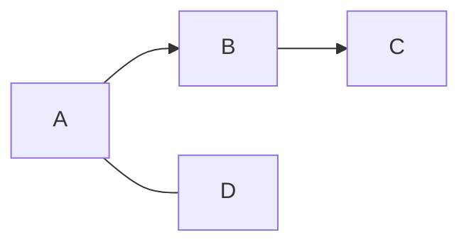
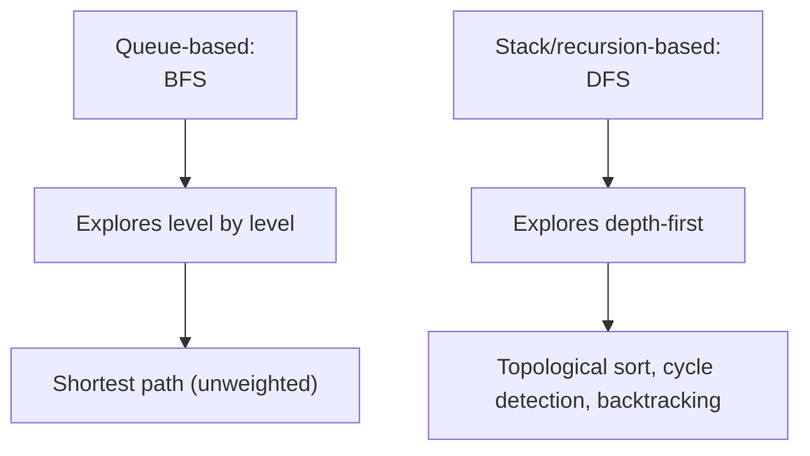
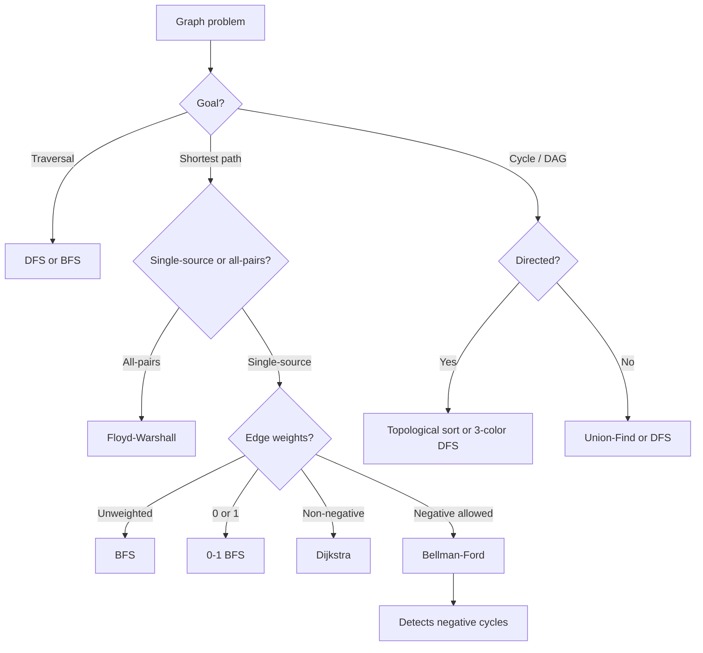

Almost every graph interview question is a traversal in disguise — connected components, cycle detection, bipartite checks and multi-source shortest paths are all BFS or DFS with one extra bookkeeping trick layered on top. Get comfortable with the representation choices and the BFS/DFS trade-off first; everything else follows.

## Terminology

Formally, a graph is a pair `G = (V, E)`, where `V` is the set of vertices (nodes) and `E` is the set of edges connecting them.

| Term | Meaning |
|---|---|
| Vertex | A single node in the graph |
| Edge | A connection between two vertices |
| Degree | The number of edges touching a vertex |
| In-degree / out-degree | In a directed graph, the number of edges entering / leaving a vertex |
| Weight | A cost, distance, or capacity value attached to an edge |
| Path | A sequence of edges connecting a sequence of vertices |
| Cycle | A path that starts and ends at the same vertex |


## Directed, undirected, weighted

| Type | Edge meaning | Example |
|---|---|---|
| Undirected | Connection goes both ways | Friendship graph, road network (two-way street) |
| Directed | Connection has a direction | Follows on social media, task dependencies, one-way streets |
| Weighted | Edge carries a cost/distance/capacity | Road network with distances, network with bandwidth |
| Unweighted | Every edge costs the same (implicitly 1) | Most traversal-only problems |



Directed edges (`A --> B`) mean "A points to B, not necessarily the reverse". An undirected edge (`A --- D`) is equivalent to two directed edges, one each way — that equivalence is exactly how you'd implement an undirected graph on top of a directed representation.

> [!KEY]
> "Graph problem" almost always decomposes into: pick a representation, pick BFS or DFS, and add one piece of state (visited set, distance array, color array, union-find). The traversal skeleton barely changes between problems.

## Representation: adjacency list vs matrix vs edge list


| Representation | Structure | Edge lookup | Iterate neighbors | Space | Best for |
|---|---|---|---|---|---|
| Adjacency list | Array/map of lists, one per vertex | `O(degree)` | `O(degree)` | `O(V + E)` | Sparse graphs — the default choice |
| Adjacency matrix | `V × V` 2-D array | `O(1)` | `O(V)` | `O(V²)` | Dense graphs, frequent "is there an edge?" queries |
| Edge list | Flat list of `(u, v, weight)` tuples | `O(E)` | `O(E)` | `O(E)` | Algorithms that just need to process every edge once (Kruskal's, Bellman-Ford) |

```java
// Adjacency list — the default for almost every interview problem
List<List<Integer>> adj = new ArrayList<>();
for (int i = 0; i < n; i++) adj.add(new ArrayList<>());
adj.get(u).add(v);
adj.get(v).add(u);   // omit this line for a directed graph

// Weighted adjacency list, using a record for the (neighbour, weight) pair
record Edge(int to, int weight) {}
List<List<Edge>> wadj = new ArrayList<>();

// Adjacency matrix
int[][] matrix = new int[n][n];
matrix[u][v] = 1;
```

> [!TIP]
> Default to an adjacency list unless the problem explicitly needs fast edge-existence checks or the graph is dense (`E` close to `V²`). Most interview graphs — grids, sparse relationship graphs — are adjacency-list territory.

## BFS vs DFS

Both visit every reachable vertex and edge in `O(V + E)` time and `O(V)` space — the difference is entirely about **order** and what that order is useful for.



| Aspect | BFS | DFS |
|---|---|---|
| Structure | Queue | Stack (explicit or recursion) |
| Visits | Level by level, nearest first | As deep as possible, then backtrack |
| Shortest path (unweighted) | Yes — first time you reach a node is via a shortest path | No — may find a longer path first |
| Cycle detection / topological sort | Possible (Kahn's algorithm) but less natural | Natural — color/state tracking during recursion |
| Memory pattern | Can hold an entire "frontier" (wide graphs cost more) | Holds one path at a time (deep graphs cost more) |
| Typical use | Shortest path, level-order, "minimum steps" | Connectivity, cycle detection, topological order, exhaustive search |

```java
// BFS — shortest path in an unweighted graph
int bfs(List<List<Integer>> adj, int start, int target) {
    boolean[] visited = new boolean[adj.size()];
    Deque<int[]> queue = new ArrayDeque<>();   // each entry is {node, dist}
    queue.offer(new int[]{start, 0});
    visited[start] = true;
    while (!queue.isEmpty()) {
        int[] cur = queue.poll();
        int node = cur[0], dist = cur[1];
        if (node == target) return dist;
        for (int next : adj.get(node))
            if (!visited[next]) { visited[next] = true; queue.offer(new int[]{next, dist + 1}); }
    }
    return -1;
}

// DFS — recursive, connectivity/exploration
void dfs(List<List<Integer>> adj, int node, boolean[] visited) {
    visited[node] = true;
    for (int next : adj.get(node))
        if (!visited[next]) dfs(adj, next, visited);
}
```

> [!WARNING]
> Mark a node visited **when you enqueue/push it**, not when you dequeue/pop it. Marking too late lets the same node get added to the queue multiple times through different paths, wasting work and — in BFS shortest-path problems — occasionally corrupting the distance count.

## Connected components

Run an unvisited-driven loop over all vertices, launching a fresh BFS/DFS from each vertex not yet visited — each launch discovers exactly one connected component.

```java
int countComponents(List<List<Integer>> adj, int n) {
    boolean[] visited = new boolean[n];
    int count = 0;
    for (int i = 0; i < n; i++) {
        if (visited[i]) continue;
        count++;
        dfs(adj, i, visited);   // marks the whole component visited
    }
    return count;
}
```

`O(V + E)` total — every vertex and edge is still visited exactly once overall, just possibly split across multiple traversal launches.

## Grid as graph

A 2-D grid is a graph where each cell is a vertex and edges connect it to its (usually 4, sometimes 8) neighbors — "number of islands", "rotting oranges", and shortest-path-on-a-grid problems are all standard BFS/DFS with grid-specific bounds checking instead of an adjacency list.

```java
int[] dr = { 0, 0, 1, -1 };
int[] dc = { 1, -1, 0, 0 };

// Neighbor iteration replaces adj.get(node) from the list-based version;
// a cell (nr, nc) is in bounds when 0 <= nr < rows and 0 <= nc < cols
for (int d = 0; d < 4; d++) {
    int nr = r + dr[d], nc = c + dc[d];
    if (nr >= 0 && nr < rows && nc >= 0 && nc < cols && grid[nr][nc] == '1' && !visited[nr][nc]) { /* ... */ }
}
```

## Cycle detection: directed vs undirected

This is the single biggest source of confusion in graph interviews — the two cases genuinely need different techniques.

| Graph type | Technique | Why |
|---|---|---|
| Undirected | DFS tracking the parent; a visited neighbor that isn't the parent means a cycle | An edge back to the immediate parent is not a cycle — it's the same edge traversed backward |
| Directed | DFS with **three states** (unvisited, in-progress, done); a visited node still in-progress ("on the current recursion stack") means a cycle | A back edge to any *finished* node is fine; only an edge into the *current path* is a cycle |

```java
// Directed cycle detection — three-color DFS
// 0 = unvisited, 1 = in progress (on current DFS path), 2 = done
boolean hasCycleDirected(List<List<Integer>> adj, int node, int[] state) {
    state[node] = 1;
    for (int next : adj.get(node)) {
        if (state[next] == 1) return true;              // back edge into current path = cycle
        if (state[next] == 0 && hasCycleDirected(adj, next, state)) return true;
    }
    state[node] = 2;
    return false;
}
```

> [!DANGER]
> Using the undirected "just check visited" rule on a directed graph gives false positives — a directed graph can have two separate paths converging on the same already-finished node, which is completely legal (it's a DAG), not a cycle. You need the three-state (unvisited/in-progress/done) version for directed graphs.

## Bipartite check

A graph is bipartite if its vertices can be split into two groups such that every edge connects vertices from *different* groups — equivalently, it can be properly 2-colored. BFS or DFS both work: color the starting node, then force every neighbor to the opposite color, failing if a neighbor is already colored the *same*.

```java
boolean isBipartite(List<List<Integer>> adj, int n) {
    int[] color = new int[n];   // 0 = uncolored, 1 or -1 = the two groups
    for (int start = 0; start < n; start++) {
        if (color[start] != 0) continue;
        color[start] = 1;
        Deque<Integer> queue = new ArrayDeque<>(); queue.offer(start);
        while (!queue.isEmpty()) {
            int node = queue.poll();
            for (int next : adj.get(node)) {
                if (color[next] == 0) { color[next] = -color[node]; queue.offer(next); }
                else if (color[next] == color[node]) return false;   // same color on both ends of an edge
            }
        }
    }
    return true;
}
```

`O(V + E)`. A graph with an odd-length cycle is never bipartite — that's the underlying reason this check is equivalent to "no odd cycles".

## Multi-source BFS

Instead of a single starting node, push **all** starting nodes into the queue before the first step — this computes "distance to the nearest of several sources" in a single `O(V + E)` pass, rather than running BFS once per source (`O(k * (V + E))`).

```java
// e.g., "rotting oranges" — distance from ANY initially-rotten orange
Deque<int[]> queue = new ArrayDeque<>();
boolean[][] seen = new boolean[rows][cols];
for (int[] source : initialSources) {
    queue.offer(source);                  // seed with ALL sources at once
    seen[source[0]][source[1]] = true;     // mark as soon as it is enqueued
}
int minutes = 0;
while (!queue.isEmpty()) {
    int size = queue.size();
    boolean advanced = false;
    for (int i = 0; i < size; i++) {
        int[] cell = queue.poll();
        int r = cell[0], c = cell[1];
        // visit neighbors; mark before enqueueing newly-reached cells, and set advanced = true
    }
    if (advanced) minutes++;
}
```

Any time a problem says "distance from the nearest of several starting points", think multi-source BFS immediately — seeding the queue with every source before starting is the entire trick, the rest of the BFS is unchanged.

## Complexity summary

| Algorithm | Time | Space | Notes |
|---|---|---|---|
| BFS / DFS | `O(V + E)` | `O(V)` | Visited set + queue/stack/recursion |
| Connected components | `O(V + E)` | `O(V)` | One BFS/DFS launch per unvisited vertex |
| Cycle detection (undirected) | `O(V + E)` | `O(V)` | DFS + parent tracking, or Union-Find |
| Cycle detection (directed) | `O(V + E)` | `O(V)` | Three-state DFS |
| Bipartite check | `O(V + E)` | `O(V)` | 2-coloring via BFS/DFS |
| Multi-source BFS | `O(V + E)` | `O(V)` | Same bound as single-source — sources just share the initial frontier |

## Choosing the right algorithm

Plain BFS/DFS solve traversal, components, cycles and bipartiteness, but a graph question that mentions weights, "shortest", or "minimum cost to connect everything" needs a different tool entirely. Route the decision through the question's actual goal before writing any code:



The one-line version of each branch: unweighted single-source shortest path is BFS; weights of only 0 or 1 upgrade to 0-1 BFS (a deque instead of a queue); non-negative weights call for Dijkstra; any negative weight needs Bellman-Ford, which can report a reachable negative cycle; and all-pairs shortest paths use Floyd-Warshall. Directed cycle/ordering questions want topological sort or three-state DFS; undirected connectivity/cycle questions are equally well served by Union-Find as by DFS.

## Cheat sheet

- Default representation: adjacency list, `O(V + E)` space. Use a matrix only for dense graphs or frequent O(1) edge checks.
- BFS = queue = level order = shortest path in unweighted graphs. DFS = stack/recursion = depth-first = natural for cycle detection and topological sort.
- Mark visited at enqueue/push time, not at dequeue/pop time.
- Undirected cycle detection: track the parent, ignore the edge straight back to it. Directed cycle detection: three-state DFS (unvisited/in-progress/done).
- A grid is a graph — reuse the exact same BFS/DFS skeleton with bounds-checked neighbor generation instead of an adjacency list.
- Bipartite check = 2-coloring via BFS/DFS; fails exactly when an odd-length cycle exists.
- Multi-source BFS: seed the queue with every source before the first step, one pass instead of one-BFS-per-source.
- Connected components = loop over all vertices, launch a fresh traversal from every still-unvisited one.

## Common mistakes

| Mistake | Fix |
|---|---|
| Marking visited on dequeue instead of enqueue | Mark at enqueue/push time to avoid duplicate queue entries |
| Using undirected cycle-detection logic on a directed graph | Directed graphs need three-state DFS, not simple "seen before" |
| Rejecting an edge back to the immediate parent as a cycle (undirected) | That's the same edge traversed backward — only a *different* visited neighbor is a real cycle |
| Running BFS once per source when multiple sources share a query | Seed the queue with all sources at once — multi-source BFS |
| Choosing an adjacency matrix for a huge sparse graph | That's `O(V²)` space for a graph that might only need `O(V + E)` |
| Forgetting to loop over all vertices for components/cycle checks | A single BFS/DFS only covers one connected component |

## Summary

Graph traversal is a small skeleton — pick a representation (default: adjacency list), pick BFS or DFS based on whether you need shortest-path/level order or depth-first/backtracking behaviour, and mark visited at the moment you discover a node. Everything else — connected components, cycle detection, bipartite checks, multi-source BFS — is that same skeleton with one additional piece of state layered on top. The two traps worth memorising cold: mark-visited timing, and the fact that directed and undirected cycle detection are genuinely different algorithms.

## Top Interview Questions

### Q1. Compare adjacency list, adjacency matrix, and edge list representations. When would you choose each?

An adjacency list stores, for each vertex, a list of its neighbors — `O(V + E)` space, `O(degree)` to iterate a vertex's neighbors, and it's the right default for sparse graphs, which is most interview graphs. An adjacency matrix is a `V × V` grid where `matrix[u][v]` indicates an edge — `O(V²)` space regardless of edge count, but `O(1)` edge-existence checks, making it worthwhile for dense graphs or algorithms that repeatedly ask "is there an edge between u and v?". An edge list is just a flat list of `(u, v, weight)` tuples — minimal structure, `O(E)` space, and it's the natural input format for algorithms like Kruskal's minimum spanning tree or Bellman-Ford that process every edge as a unit rather than needing to look up a specific vertex's neighbors.

### Q2. When would you use BFS over DFS, and vice versa?

Use BFS when you need the shortest path in an unweighted graph, or when you need to process nodes in strict order of distance from a source (level-order processing) — BFS guarantees the first time you reach any node is via a shortest path, because it exhausts all nodes at distance `d` before considering any at distance `d+1`. Use DFS when you need to explore full paths before backtracking — natural for cycle detection, topological sorting, connectivity checks, and exhaustive search/backtracking problems where you need to fully commit to one path before abandoning it. Both run in `O(V + E)` time and `O(V)` space, so the choice is about which traversal order matches the problem's actual requirement, not about efficiency.

### Q3. Why does BFS guarantee the shortest path in an unweighted graph, but DFS does not?

BFS processes nodes in increasing order of distance from the source because it explores the entire "frontier" at distance `d` (everything currently in the queue) before any node at distance `d+1` gets added — this means the very first time any node is dequeued/discovered, it's necessarily via the shortest possible path, since no longer path could have reached it earlier in this strictly expanding-frontier order. DFS commits to one path as deep as possible before backtracking, so it can easily reach a target node via a long, winding path long before it would have found a shorter one through a different branch — there's no guarantee about which path arrives first, only that some path is eventually found.

### Q4. How do you detect a cycle in a directed graph, and why doesn't the undirected approach work here?

Use DFS with three states per node: unvisited, in-progress (currently on the active recursion path), and done (fully explored, including all its descendants). A cycle exists if, during DFS, you encounter an edge to a node that is currently in-progress — meaning it's an ancestor on the current path, so this edge closes a loop back to it. The undirected approach — simply checking "have I seen this neighbor before, ignoring the direct parent" — fails on directed graphs because a directed graph can perfectly legally have two separate paths converge on the same already-*finished* node (a classic DAG shape, like a diamond), which the undirected check would incorrectly flag as a cycle since it doesn't distinguish "finished and not on my current path" from "currently being explored".

### Q5. Explain why marking a node visited at enqueue time versus dequeue time matters for BFS correctness.

If you mark a node visited only when it's dequeued, multiple different paths reaching that same node before it's dequeued will each independently enqueue it — the same node can end up in the queue several times, wasting work, and in shortest-path BFS this can also cause the *distance* recorded for that node to potentially come from whichever queue entry happens to get processed, rather than guaranteeing the first (shortest) one is used consistently throughout downstream processing. Marking visited immediately at enqueue time ensures each node is added to the queue exactly once, guaranteeing both efficiency (no duplicate processing) and correctness (the distance associated with a node's first — and only — enqueue is definitively its shortest-path distance).

### Q6. How would you check whether a graph is bipartite?

Attempt to 2-color the graph via BFS or DFS: assign the starting vertex one color, then for every edge, force the neighbor to the opposite color; if you ever encounter an edge where both endpoints are already colored the *same*, the graph is not bipartite. You need to restart this process from every connected component separately, since components are independent for this check. This runs in `O(V + E)` time and is exactly equivalent to checking whether the graph contains any odd-length cycle — any odd cycle makes proper 2-coloring impossible, since you'd eventually be forced to color two adjacent vertices identically when the cycle closes.

### Q7. What is multi-source BFS, and how does it improve on running BFS separately from each source?

Multi-source BFS seeds the initial queue with *all* starting nodes at once (each at distance 0) before running the standard BFS loop, rather than running a full separate BFS from each source and taking a minimum afterward. Because BFS naturally expands in order of distance regardless of how many nodes are in the initial frontier, this single pass correctly computes, for every node, its distance to the *nearest* of the sources — in `O(V + E)` total, the same asymptotic cost as a single-source BFS. Running BFS once per source instead would cost `O(k * (V + E))` for `k` sources, a real difference when there are many sources, such as multiple simultaneously-rotting oranges in a grid or multiple fire origins spreading through a map.

### Q8. How do you find the number of connected components in an undirected graph?

Maintain a visited array over all vertices, and loop through every vertex from 0 to n-1: whenever you encounter an unvisited vertex, increment a component counter and launch a full BFS or DFS from it, which will mark every vertex reachable from it (i.e., the entire component) as visited. Once that traversal finishes, continue the outer loop to find the next unvisited vertex, if any, and repeat. Each vertex and edge is still touched exactly once across the whole process even though the traversal is "restarted" multiple times, so total time remains `O(V + E)`. An alternative is Union-Find: union the endpoints of every edge, then count the number of distinct root parents remaining — also effectively `O(V + E)` with near-constant-time union/find operations.

### Q9. You're modeling a road network with one-way streets and need to find whether every intersection is reachable from a central hub, and whether the hub is reachable from every intersection. How would you approach this?

This is two separate directed-graph reachability questions on the same graph. For "is every intersection reachable from the hub", run a single BFS or DFS starting at the hub on the graph as given, and check whether every vertex was visited. For "is the hub reachable from every intersection", conceptually reverse every edge (or maintain a second, reverse adjacency list built alongside the forward one) and run BFS/DFS from the hub on that *reversed* graph — a vertex reachable from the hub in the reversed graph means the hub is reachable from that vertex in the original graph. Both traversals are `O(V + E)`, and building the reverse adjacency list up front is also `O(V + E)`, so the whole check remains linear in graph size — this reverse-graph trick is a common technique whenever a directed reachability question is asked "backwards".

### Q10. In a production system processing a large, sparse dependency graph (e.g., build targets or package dependencies), what representation and traversal would you choose, and why?

I'd use an adjacency list — dependency graphs are typically sparse (most nodes depend on only a handful of others, not a large fraction of all nodes), so an adjacency matrix's `O(V²)` memory would be wasteful and likely infeasible at scale. For actually processing dependencies in valid order (build target A before anything depending on it), I'd use a topological sort, which is naturally built on DFS (post-order gives a valid reverse topological order) or Kahn's algorithm (BFS-based, repeatedly removing nodes with zero remaining in-degree) — and I'd run a directed cycle check first, since a cycle in a dependency graph means the build is genuinely unsatisfiable and should fail fast with a clear error rather than deadlocking or looping. Kahn's algorithm is often preferred in production because it naturally reports exactly which nodes are involved in a cycle (whatever remains un-removed at the end), which is more actionable for debugging than a DFS-based cycle flag alone.
