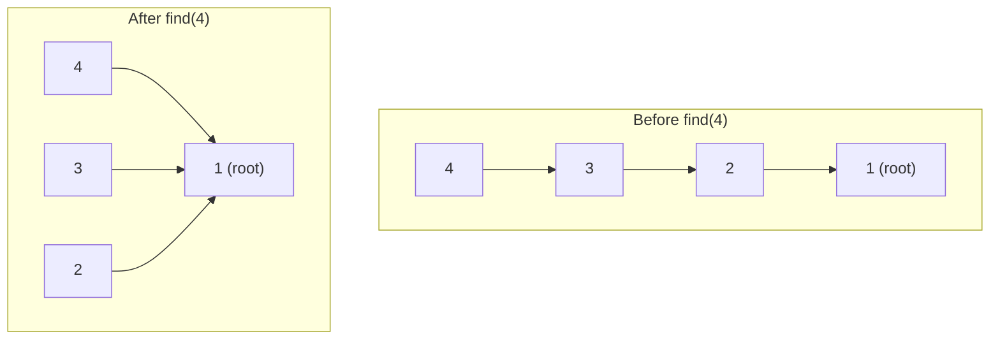

Union-Find (Disjoint Set Union, DSU) answers one question extremely fast, repeatedly: *are these two elements in the same group?* It quietly underlies cycle detection, Kruskal's MST, and any problem phrased as "merge these into groups and query them later."

## What it models

Union-Find maintains a **forest** — one tree per component. Every element points to a parent; the root of a tree is that component's representative. Two elements are connected exactly when they share a root. It supports two operations:

- **find(x)** — walk parent pointers up to the root, i.e. the representative of x's component.
- **union(a, b)** — merge the components containing `a` and `b` by attaching one root under the other.

A naive implementation can degrade to `O(n)` per operation if unions always build a long chain. Two independent optimisations fix that.

### Union by rank / size

Always attach the smaller (or shallower) tree under the larger one's root, instead of the reverse. This keeps tree height bounded at `O(log n)` — you never let a big tree hang off a small one.

### Path compression

During `find`, re-point every node visited on the way up so it hangs **directly off the root**. The path only needs walking once; after that, lookups on it are `O(1)`.



> [!KEY]
> Combined, `m` operations on `n` elements cost `O(m·α(n))` total, where `α` is the inverse Ackermann function. For any `n` that fits in the observable universe, `α(n) ≤ 4` — so this is "near O(1)" in practice, not just asymptotically.

## Implementation

```java
public class UnionFind {
    private final int[] parent;
    private final int[] size;
    public int components;

    public UnionFind(int n) {
        parent = new int[n];
        size = new int[n];
        for (int i = 0; i < n; i++) { parent[i] = i; size[i] = 1; }
        components = n;
    }

    public int find(int x) {
        // Path compression: rewrite the pointer to the root as we unwind
        if (parent[x] != x) parent[x] = find(parent[x]);
        return parent[x];
    }

    public boolean union(int a, int b) {
        int ra = find(a), rb = find(b);
        if (ra == rb) return false;           // already connected -> this edge closes a cycle
        if (size[ra] < size[rb]) { int t = ra; ra = rb; rb = t; }
        parent[rb] = ra;                      // attach the smaller tree under the larger
        size[ra] += size[rb];
        components--;
        return true;
    }
}
```

`union` returning `false` is the whole trick behind cycle detection: if two endpoints of an edge already share a root, that edge would create a cycle rather than connect anything new.

## Complexity picture

| Optimisation applied | find / union cost |
|---|---|
| Neither | `O(n)` worst case (degenerates to a linked list) |
| Union by rank/size only | `O(log n)` worst case |
| Path compression only | `O(log n)` amortised |
| Both | `O(α(n))` amortised — effectively constant |

## Where it shows up

| Problem shape | How Union-Find is used |
|---|---|
| Count connected components | One `union` per edge; answer = distinct roots remaining |
| Cycle detection (undirected graph) | `union` endpoints of each edge; a `false` return means a cycle |
| Kruskal's MST | Sort edges by weight, `union` endpoints greedily, skip edges that would close a cycle |
| Accounts merge / group friends | `union` accounts sharing an email or id, then group everything by final root |
| Redundant Connection (LeetCode) | The first edge whose `union` call returns `false` is the answer |
| Grid percolation | `union` adjacent open cells; check whether a virtual top and bottom root match |

> [!TIP]
> Say this out loud in an MST question: *"I sort edges by weight, and for each one I ask Union-Find whether the endpoints are already connected — if yes I skip it, otherwise I add it to the MST and union them."* That single sentence proves you understand Kruskal's without reciting pseudocode.

### Accounts Merge, worked briefly

Given accounts with a name and a list of emails, merge accounts that share any email. Union every pair of emails within the same account (chain them: `email[0]` with `email[i]` for all `i`). At the end, group all emails by their root, then attach the owning name. This is `O(total emails · α(n))` — far better than pairwise comparison, which is `O(accounts²)`.

## Mapping real keys to Union-Find indices

Interview inputs are often already numbered `0..n-1`, but production-shaped problems use strings: emails, usernames, account ids, or arbitrary labels. Union-Find itself wants dense integer indices because parent arrays are faster and simpler than parent maps. The standard pattern is to maintain a `Map<String, Integer>` and assign the next id the first time a key appears.

```java
Map<String, Integer> id = new HashMap<>();
int getId(String key) {
    return id.computeIfAbsent(key, k -> id.size());
}
```

After all ids are assigned, create the `UnionFind` with `id.size()`, or grow the arrays dynamically if keys arrive online and the maximum count is not known. When producing output, keep the reverse mapping or group original keys directly by `find(id.get(key))`. The algorithmic cost stays near-linear; the map adds `O(1)` average lookup per key.

Do not union display names or other non-unique labels unless the problem says they identify the same entity. In Accounts Merge, the email is the identity and the name is metadata; two different people can share a name. Picking the wrong identity key makes the Union-Find implementation fast but semantically wrong.

When grouping results, call `find` one final time for every id so path compression canonicalises roots before they become hash-map keys.

## Union-Find vs DFS/BFS

Both answer connectivity questions, but they fit different shapes of problem.

| Scenario | Better tool | Why |
|---|---|---|
| Static graph, one connectivity query | DFS/BFS | `O(V + E)` once; no reusable structure needed |
| Edges arrive over time, repeated "connected?" queries | Union-Find | `O(α(n))` per edge; no full re-traversal each time |
| Need the actual path or cycle, not just yes/no | DFS with parent tracking | Union-Find only answers "same component", it does not reconstruct a path |
| Building an MST incrementally | Union-Find (Kruskal) | Natural fit for "would this edge create a cycle" |
| Directed graph cycle detection | 3-colour DFS or topological sort | Plain Union-Find does not respect edge direction |

> [!WARNING]
> Union-Find is for **undirected** connectivity. Treating directed edges as undirected creates false positives: `a -> b`, `a -> c`, `b -> c` is a DAG, but Union-Find would reject `b -> c` because `b` and `c` are already in the same undirected component. Use DFS with a recursion-stack colour, or Kahn's algorithm, for directed cycle detection instead.

> [!DANGER]
> A common bug: comparing `parent[a] == parent[b]` directly instead of `find(a) == find(b)`. Immediate parents are not roots — you must fully resolve both sides before comparing.

## Cheat sheet

- Two operations: `find` (get the representative/root) and `union` (merge two components).
- Union by rank/size + path compression together give `O(α(n))` amortised — near constant.
- `union` returning `false` means the two nodes were already connected — that is your cycle signal.
- Always compare `find(a) == find(b)`, never raw `parent[a] == parent[b]`.
- Number of components = number of distinct roots = `n - (successful unions)`.
- Kruskal's MST: sort edges by weight, union greedily, skip edges that would close a cycle.
- Works cleanly only on **undirected** graphs; for directed cycles use DFS colouring or Kahn's algorithm.
- Prefer Union-Find over DFS/BFS when edges/queries arrive online and you'd otherwise re-traverse repeatedly.
- Path compression can be done recursively (shown above) or iteratively with two passes to avoid deep recursion on huge inputs.

## Common mistakes

| Mistake | Fix |
|---|---|
| Comparing `parent[a] == parent[b]` instead of `find(a) == find(b)` | Always resolve to the root before comparing |
| Skipping union by rank/size, relying on path compression alone | Combine both for the `O(α(n))` guarantee; either alone is only `O(log n)` |
| Using Union-Find to detect cycles in a **directed** graph | Use 3-colour DFS or Kahn's algorithm instead |
| Forgetting to decrement a `components` counter, then recomputing it by scanning roots each query | Maintain the counter incrementally inside `union` |
| Deep recursion in `find` causing a stack overflow on very large n | Convert to an iterative two-pass path compression |
| Re-initialising the structure per query instead of reusing it across incremental unions | Build once, mutate incrementally — that is the entire point of the structure |

## Summary

Union-Find models connectivity as a forest of parent pointers, and two independent tricks — union by rank/size and path compression — collapse its amortised cost to essentially constant time per operation. That makes it the tool of choice whenever a problem is really "keep merging groups and keep asking if two things are in the same group": counting components, detecting cycles in undirected graphs, building an MST with Kruskal's algorithm, or merging accounts by shared attributes. Reach for DFS/BFS instead when you need an actual path, a directed-cycle check, or you only need one static query.

## Top Interview Questions

### Q1. What is Union-Find and what two operations does it expose?

Union-Find (Disjoint Set Union) is a data structure that partitions a set of elements into disjoint groups and supports two operations: `find(x)`, which returns the representative (root) of the group containing `x`, and `union(a, b)`, which merges the groups containing `a` and `b`. It is implemented as a forest where each node stores a parent pointer, and a node is its own group's representative when it points to itself. Two elements are in the same group exactly when `find` returns the same root for both. It is the standard tool for dynamic connectivity questions — "are these connected", not "what is the path".

### Q2. Why do we need both union by rank/size and path compression? What happens with only one?

Union by rank/size controls tree **height** at union time — always attach the shorter or smaller tree under the taller one, bounding height to `O(log n)`. Path compression flattens trees at **find** time by re-pointing visited nodes straight to the root. Either alone gives `O(log n)` per operation. Used together they interact: compression keeps trees shallow for future unions, and rank/size keeps them shallow to begin with, so the combined amortised cost drops to `O(α(n))`, the inverse Ackermann function — under 5 for any realistic input. Without either optimisation, naive unions can build a linked-list-shaped tree, degrading `find` to `O(n)`.

### Q3. What is the inverse Ackermann function and why does it matter here?

The Ackermann function grows faster than any exponential or tower of exponentials; its inverse, `α(n)`, grows unimaginably slowly — `α(n) ≤ 4` for any `n` up to numbers far larger than the number of atoms in the universe. When both optimisations are applied to Union-Find, the amortised cost per operation is `O(α(n))`, which is why practitioners casually call it "constant time" even though it is not literally `O(1)` in the strict theoretical sense. The honest phrasing for an interview is: "amortised near-constant, technically `O(α(n))`."

### Q4. How do you detect a cycle in an undirected graph using Union-Find?

Process edges one at a time. For each edge `(u, v)`, call `find(u)` and `find(v)`. If they already share a root, adding this edge would connect two nodes already connected by some other path — that closes a cycle, so report it (or skip it, in Kruskal's). Otherwise call `union(u, v)`. This is exactly the "Redundant Connection" pattern: the first edge whose union fails is the extra edge that created the cycle. It runs in `O(E · α(V))`, versus `O(V + E)` DFS repeated per query if you needed to check connectivity many times.

### Q5. Walk through using Union-Find inside Kruskal's MST algorithm.

Sort all edges by weight ascending. Initialise a Union-Find over the `V` vertices. Iterate edges in sorted order: for each edge, if `find(u) != find(v)`, add the edge to the MST and call `union(u, v)`; otherwise skip it because it would form a cycle. Stop once `V - 1` edges have been added. Total cost is dominated by the sort, `O(E log E)`, since Union-Find operations are near-constant. The key insight to state out loud: Union-Find is exactly the "would this edge create a cycle" oracle that greedy MST construction needs.

### Q6. How would you solve "Accounts Merge" (merge accounts sharing any email) with Union-Find?

Map every distinct email to an integer id. For each account, union `email[0]` with every other email in that same account, so all emails belonging to one account end up in the same component. After processing all accounts, group emails by their `find` root using a hash map, sort each group, and attach the account name that owns any email in that root's group. This is `O(total emails · α(n) log n)` (the log n from sorting each group's emails), far better than comparing accounts pairwise for shared emails, which is quadratic.

### Q7. When would you prefer DFS/BFS over Union-Find for a connectivity problem, and vice versa?

If you only need one connectivity check on a static graph, DFS/BFS is simpler and just as fast: `O(V + E)` once. Union-Find pays off when edges arrive incrementally (online) and you need repeated "connected?" answers as they come in, because re-running DFS/BFS after every new edge would be `O(V + E)` each time versus `O(α(n))` amortised for Union-Find. Conversely, if you need to reconstruct the actual path or cycle (not just a yes/no), DFS with parent tracking is the right tool — plain Union-Find discards path information once merged.

### Q8. Can Union-Find detect cycles in a directed graph? Why or why not directly?

Not directly, and this is a common trap. Union-Find only tracks whether two nodes are connected **ignoring direction** — it treats every edge as bidirectional. For example, `a -> b`, `a -> c`, `b -> c` is acyclic, but after the first two edges Union-Find already puts `b` and `c` in the same undirected component and would incorrectly treat `b -> c` as a cycle. For directed graphs, use 3-colour DFS (white/grey/black, a "grey" back-edge means a cycle) or run Kahn's topological sort — if it cannot order all nodes, a cycle exists.

### Q9. How do you count connected components efficiently after processing all edges?

Initialise a counter to `n` (each element starts as its own component). Every time `union` successfully merges two previously-separate components (i.e. their roots differed), decrement the counter. After processing all edges, the counter holds the final component count without any extra scan. This is `O(E · α(V))` total. The alternative — scanning all `n` elements and counting distinct `find` results at the end — also works and is `O(n · α(n))`, but maintaining a running counter avoids the final pass entirely and is the cleaner production pattern.

### Q10. What's the practical difference between union by rank and union by size?

Union by rank tracks an upper bound on each tree's height and attaches the shorter tree under the taller one's root; the rank only increases when two trees of equal rank merge, so it's an approximation of height once path compression starts altering real depths. Union by size tracks the actual node count and attaches the smaller tree under the larger one. Both give the same `O(log n)` worst-case bound before compression and the same `O(α(n))` amortised bound combined with compression. In practice, size is slightly more intuitive to reason about and doubles as a free "component size" query, so many implementations prefer it.

### Q11. How would you support undoing a union (rollback) for offline processing, and why does path compression complicate this?

Path compression mutates parent pointers destructively as a side effect of `find`, so a simple "restore the old parent pointer" undo is not enough — many nodes may have been re-pointed during the compressions that happened between the union and the undo. The standard fix is **union by rank/size without path compression**, keeping an explicit undo stack of `(child, oldParent, oldRank)` triples recorded on each successful union; rollback pops the stack and restores exactly those fields. This gives `O(log n)` per operation instead of `O(α(n))`, trading a little speed for reversibility — used in offline "small to large" or divide-and-conquer-over-time techniques.

### Q12. Design a system where friend requests arrive as a stream of pairs, and you must answer "are these two users in the same network" after each request, efficiently.

Maintain a single Union-Find instance sized to the maximum user id, initialised once at startup. On each incoming friend request `(u, v)`, call `union(u, v)` — `O(α(n))`. To answer a "same network" query for `(a, b)`, call `find(a) == find(b)` — also `O(α(n))`. This scales to millions of requests without ever re-scanning the graph, which is exactly why Union-Find beats re-running BFS/DFS per query in a streaming or online setting. In production, add persistence (periodically snapshot the parent array) and consider sharding by id range if the user base is too large for one in-memory structure.
