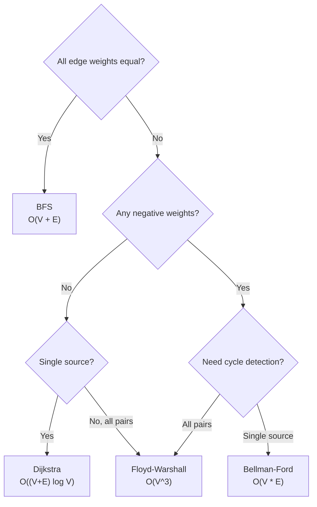

Every shortest-path question is really a question about the **shape of the weights**: are they all equal, all non-negative, or can they go negative? Answer that first and the algorithm picks itself. Interviewers use this family to test whether you reach for the *simplest* correct tool rather than always defaulting to Dijkstra.

## Choosing the right algorithm



| n (vertices) | Weighted? | Negative edges? | Pick |
|---|---|---|---|
| Any | No | — | BFS |
| ≤ 400–500 | Yes | Maybe, all pairs | Floyd-Warshall |
| Up to 10⁵ | Yes | No | Dijkstra |
| Up to 10³–10⁴ edges | Yes | Yes | Bellman-Ford |

> [!KEY]
> Dijkstra is a **greedy** algorithm: it commits to the shortest distance to a node the moment it is popped, assuming nothing later can make it shorter. Negative weights break that assumption — that is the whole story of why Dijkstra fails on them.

## BFS: shortest path in unweighted graphs

When every edge costs the same, the fewest number of edges *is* the shortest path, so a plain level-order BFS suffices — no weights, no priority queue.

```java
// O(V + E) time, O(V) space
int[] dist = new int[n];
Arrays.fill(dist, -1);
Deque<Integer> q = new ArrayDeque<>();
q.offer(src);
dist[src] = 0;
while (!q.isEmpty()) {
    int u = q.poll();
    for (int v : adj.get(u))
        if (dist[v] == -1) {
            dist[v] = dist[u] + 1;
            q.offer(v);
        }
}
```

## Dijkstra: non-negative weights

Dijkstra maintains a min-heap of `(distance, node)` and repeatedly finalises the closest unvisited node, **relaxing** its outgoing edges — updating a neighbour's distance if a shorter path was just found.

```java
// O((V + E) log V) time, O(V + E) space
long INF = Long.MAX_VALUE / 4;
long[] dist = new long[n];
Arrays.fill(dist, INF);
dist[src] = 0;
// Java's PriorityQueue has no decrease-key, so we push a fresh {node, distance}
// pair on every relaxation and skip stale pairs when they surface (lazy deletion)
record State(int node, long dist) {}
PriorityQueue<State> pq = new PriorityQueue<>(Comparator.comparingLong(State::dist));
pq.offer(new State(src, 0));
while (!pq.isEmpty()) {
    State top = pq.poll();
    int u = top.node();
    long d = top.dist();
    if (d > dist[u]) continue;          // stale entry, skip
    for (int[] edge : adj.get(u)) {
        int v = edge[0], w = edge[1];
        if (dist[u] + w < dist[v]) {
            dist[v] = dist[u] + w;
            pq.offer(new State(v, dist[v]));
        }
    }
}
```

Java's `PriorityQueue` has no decrease-key operation, so rather than updating a neighbour's existing heap entry you push a brand-new `{node, distance}` pair on every successful relaxation. The heap therefore accumulates stale pairs; the `if (d > dist[u]) continue;` guard discards them the moment they surface — the standard **lazy-deletion** idiom. It leaves at most `O(E)` entries in the heap in the worst case without changing the `O((V + E) log V)` bound.

> [!WARNING]
> Dijkstra fails with negative edges because it **never revisits** a finalised node. A negative edge discovered later could shorten a path to a node already popped, but the algorithm has no mechanism to reopen it — it can silently return a wrong, too-large answer instead of erroring.

## Bellman-Ford: negative weights and cycle detection

Bellman-Ford relaxes **every edge**, `V - 1` times. After `V - 1` rounds, all shortest paths (which use at most `V - 1` edges) are correct. A `V`-th round that still relaxes something proves a negative cycle reachable from the source.

```java
// O(V * E) time, O(V) space
long INF = Long.MAX_VALUE / 4;
long[] dist = new long[n];
Arrays.fill(dist, INF);
dist[src] = 0;
for (int i = 0; i < n - 1; i++)
    for (int[] e : edges) {
        int u = e[0], v = e[1], w = e[2];
        if (dist[u] != INF && dist[u] + w < dist[v])
            dist[v] = dist[u] + w;
    }

for (int[] e : edges) {                    // one extra pass
    int u = e[0], v = e[1], w = e[2];
    if (dist[u] != INF && dist[u] + w < dist[v])
        throw new IllegalStateException("Negative cycle");
}
```

> [!TIP]
> Say this in the room: *"Bellman-Ford is slower — O(V·E) instead of O((V+E) log V) — but it is the single-source algorithm here that handles negative edges and detects reachable negative cycles."* Naming the trade-off, not just the algorithm, is what separates a memorised answer from an understood one.

## Floyd-Warshall: all pairs at once

Floyd-Warshall computes shortest distances between **every pair** of nodes by allowing paths to route through an increasing set of intermediate vertices `k`. It is simple — three nested loops — and the `k` loop must be outermost or the recurrence is wrong.

```java
// O(V^3) time, O(V^2) space
for (int k = 0; k < n; k++)
    for (int i = 0; i < n; i++)
        for (int j = 0; j < n; j++)
            if (dist[i][k] != INF && dist[k][j] != INF
                && dist[i][k] + dist[k][j] < dist[i][j])
                dist[i][j] = dist[i][k] + dist[k][j];
```

A negative cycle shows up as `dist[i][i] < 0` for some `i` after the loops finish. Swapping `min`/`+` for `OR`/`AND` turns the same triple loop into **transitive closure** (reachability).

## 0-1 BFS and bucketed weights

When edge weights are only 0 or 1, a normal queue is no longer enough because a zero-cost edge should be explored before older one-cost work. A deque fixes that: relaxing a 0-weight edge pushes the neighbour to the **front**, and relaxing a 1-weight edge pushes it to the **back**. This preserves nondecreasing distance order without a binary heap, so the runtime is `O(V + E)`.

```java
int[] dist = new int[n];
Arrays.fill(dist, Integer.MAX_VALUE);
Deque<Integer> dq = new ArrayDeque<>();
dq.offer(src);
dist[src] = 0;
while (!dq.isEmpty()) {
    int u = dq.pollFirst();
    for (int[] edge : adj.get(u)) {
        int v = edge[0], w = edge[1];      // w is 0 or 1
        if (dist[u] + w < dist[v]) {
            dist[v] = dist[u] + w;
            if (w == 0) dq.offerFirst(v);
            else dq.offerLast(v);
        }
    }
}
```

For small integer weights larger than 1, use buckets (Dial's algorithm) rather than expanding each edge into dummy nodes. Both are specialised alternatives to Dijkstra that exploit tighter weight constraints.

Do not use a plain `visited` boolean in weighted shortest-path code the way you would in BFS. In Dijkstra, a node becomes final only when the smallest-distance heap entry is popped; in Bellman-Ford, a node can improve across multiple rounds; in 0-1 BFS, the deque order preserves distance but the `dist[]` comparison is still the correctness guard. The invariant is "only relax from the best distance known so far", not "first discovery wins" unless every edge has identical cost.

That is why the weight constraints should be read before coding: they decide not just the data structure, but also when a distance is safe to finalize.

## A*: Dijkstra with a heuristic

A* is Dijkstra plus a **heuristic** `h(n)` estimating remaining distance to the goal — it explores nodes ordered by `f(n) = g(n) + h(n)` (cost so far + estimated cost to go) instead of `g(n)` alone. This focuses the search toward the goal instead of expanding uniformly outward.

| Requirement | Meaning | Consequence if violated |
|---|---|---|
| Admissible | `h(n)` never overestimates true cost | Optimality is lost |
| Consistent | `h(n) ≤ cost(n, n') + h(n')` | Nodes may need re-expansion |

Classic heuristic: **Euclidean or Manhattan distance** on a grid. With `h = 0` everywhere, A* degrades exactly to Dijkstra — a fact worth stating if asked to compare them.

## Reconstructing the path, not just the distance

Every algorithm above only needs one extra array to recover the actual path: `parent[v]` set whenever `dist[v]` improves.

```java
// After relaxation succeeds: dist[v] = dist[u] + w;
parent[v] = u;

// Reconstruct src -> target
List<Integer> path = new ArrayList<>();
for (int at = target; at != -1; at = parent[at])
    path.add(at);
Collections.reverse(path);
```

> [!NOTE]
> If a node is unreachable, `parent[target]` stays `-1` and the walk terminates immediately with an empty or partial path — check `dist[target] == INF` first and say so explicitly.

## Comparison at a glance

| Algorithm | Time | Space | Handles negative weights | Sources |
|---|---|---|---|---|
| BFS | O(V + E) | O(V) | N/A (unweighted) | Single |
| Dijkstra | O((V+E) log V) | O(V + E) | No | Single |
| Bellman-Ford | O(V · E) | O(V) | Yes, detects negative cycles | Single |
| Floyd-Warshall | O(V³) | O(V²) | Yes, detects negative cycles | All pairs |
| A* | O((V+E) log V) worst case | O(V + E) | No | Single (goal-directed) |

## Cheat sheet

- **Unweighted → BFS.** No priority queue needed.
- **Non-negative weights, single source → Dijkstra**, O((V+E) log V) with a binary heap.
- **Negative weights, single source → Bellman-Ford.** O(V·E), and it detects reachable negative cycles. Floyd-Warshall can also detect negative cycles in the all-pairs setting.
- **All pairs, small V (≲500) → Floyd-Warshall**, O(V³), trivial to code correctly.
- **Have a good heuristic and a single goal → A*** narrows the search versus Dijkstra.
- **Negative cycle means "shortest path" is undefined** — some path can be made arbitrarily small by looping.
- **Always keep a `parent[]` array** if the path itself (not just its length) is required.
- **Dijkstra's stale-entry check** (`if (d > dist[u]) continue;`) is what makes a lazy-deletion heap correct.

## Common mistakes

| Mistake | Fix |
|---|---|
| Using Dijkstra on a graph with negative edges | Switch to Bellman-Ford; Dijkstra can return a wrong answer without erroring |
| Looping `i, j, k` instead of `k, i, j` in Floyd-Warshall | `k` (the intermediate) must be the outermost loop |
| Forgetting to relax exactly `V - 1` times in Bellman-Ford | Fewer passes can miss valid longer paths; one extra pass detects cycles |
| Not checking `dist[u] == INF` before relaxing | Adding to `INF` overflows or gives a meaningless small number |
| Using an inadmissible heuristic in A* | Optimality is no longer guaranteed — verify `h(n) ≤` true cost |
| Re-enqueuing a node into Dijkstra's heap and forgetting the staleness check | Track the distance the entry was pushed with and skip if it's outdated |

## Summary

Shortest-path questions are decided by two facts: whether weights exist and whether they can be negative. BFS handles the unweighted case, Dijkstra the non-negative single-source case, Bellman-Ford anything with negative weights (and proves cycle-freeness), and Floyd-Warshall the all-pairs case. A* is Dijkstra with a heuristic bolted on for goal-directed search. Reconstruction is always the same one-line trick: track a `parent` array during relaxation.

## Top Interview Questions

### Q1. Why does Dijkstra's algorithm fail with negative edge weights?

Dijkstra is greedy: once a node is popped from the priority queue with its current best distance, the algorithm assumes that distance is final and never revisits the node. This assumption relies on all remaining edges only being able to *increase* a path's cost, which is true only when all weights are non-negative. If a negative edge exists, a path discovered later could still reduce the distance to an already-finalized node, but Dijkstra has no mechanism to reopen it, so it can silently return a distance that is too large. It does not crash or loop forever — it just gives a wrong answer, which is what makes it dangerous.

### Q2. Walk me through why Bellman-Ford needs exactly V-1 relaxation rounds.

Any shortest path in a graph with `V` vertices visits at most `V - 1` edges (a simple path cannot repeat a vertex). Each full round of relaxing every edge is guaranteed to correctly extend the shortest path found so far by at least one more edge in the worst case — so after `V - 1` rounds, paths of length up to `V - 1` edges are all correctly computed. Doing a `V`-th round and finding further improvement means some path is still shrinking, which is only possible if a negative-weight cycle is reachable from the source, since a well-defined shortest path cannot keep improving forever.

### Q3. How do you detect a negative cycle, and why does its presence make "shortest path" meaningless?

Run one extra relaxation pass after the standard `V - 1` rounds; if any edge still relaxes, a negative cycle exists on some path from the source. It matters because if you can traverse a cycle whose total weight is negative, you can loop it arbitrarily many times to make the path cost approach negative infinity — there is no finite shortest path anymore. In production, this shows up in currency-arbitrage detection (a cycle of exchange rates whose product exceeds 1 is a negative cycle in log-space) and in scheduling systems with negative constraints.

### Q4. When would you use Floyd-Warshall over running Dijkstra V times?

Floyd-Warshall is O(V³) and computes all-pairs shortest paths in one pass; running Dijkstra from every source is O(V·(V+E) log V). For dense graphs where `E` is close to `V²`, these are comparable, but Floyd-Warshall is far simpler to implement correctly (no heap, no per-source bookkeeping) and, unlike repeated Dijkstra, works even with negative edges (as long as there's no negative cycle). The trade-off is space — O(V²) — and that it becomes impractical past roughly V ≈ 400–500 in an interview setting, whereas Dijkstra scales to V, E in the 10⁵–10⁶ range.

### Q5. What is the intuition behind A*, and what makes its heuristic valid?

A* is Dijkstra where the priority queue orders nodes by `f(n) = g(n) + h(n)`: the confirmed cost so far plus an estimate of the remaining cost to the goal. A good heuristic biases the search to expand nodes that look promising toward the goal instead of expanding uniformly in all directions, which can drastically cut down the search space. For A* to still guarantee the optimal path, the heuristic must be **admissible** — it must never overestimate the true remaining cost. If it overestimates, A* can return a suboptimal path because it will prematurely deprioritise a node that was actually on the true shortest path.

### Q6. How would you reconstruct the actual shortest path, not just its length?

Maintain a `parent[]` array alongside `dist[]`. Every time you relax an edge `(u, v)` — i.e., `dist[u] + w < dist[v]` — set `parent[v] = u`. After the algorithm finishes, walk backwards from the target using `parent` until you hit the source (or `-1`/`null`, meaning unreachable), then reverse the collected list. This adds only O(V) space and works identically for BFS, Dijkstra, and Bellman-Ford; for Floyd-Warshall you keep a `next[i][j]` matrix instead, updated whenever `dist[i][k] + dist[k][j]` improves `dist[i][j]`.

### Q7. Your Dijkstra implementation is timing out on a graph with 10^5 nodes and 10^6 edges. What would you check?

First, confirm the priority queue holds `(distance, node)` pairs and not the whole adjacency list — pushing large objects blows up the constant factor. Second, check for the classic bug of re-pushing a node every time it is relaxed without a staleness guard (`if (d > dist[u]) continue;`) — without it, the heap can grow to O(E) entries but the algorithm still functions, so the real fix is often an inefficient adjacency representation (using a list of edges scanned linearly instead of an adjacency list, making each relaxation O(V) instead of O(degree)). Finally, verify the graph is stored as an adjacency list, not a dense matrix, since a matrix forces O(V²) work regardless of edge count.

### Q8. Can you use BFS on a weighted graph if all weights are small positive integers?

Yes, with a trick: replace each edge of weight `w` with `w` unit-weight edges via dummy intermediate nodes, then run plain BFS — this is correct because BFS still explores strictly in order of total distance. It is only practical when weights are small, since it inflates the graph size by a factor of the maximum weight. If weights are only `0` or `1`, use **0-1 BFS** with a deque: push zero-weight edges to the front and weight-1 edges to the back, achieving `O(V + E)`. For small bounded non-negative integer weights beyond 1, use bucketed Dijkstra/Dial's algorithm rather than a plain FIFO queue.

### Q9. Two nodes are connected by multiple edges of different weights — does any of these algorithms break?

No, as long as your adjacency list stores all edges (not just one per neighbour pair) and relaxation considers every edge independently, all four algorithms handle parallel edges correctly — Dijkstra and Bellman-Ford will simply never improve past the minimum-weight edge between the pair, and Floyd-Warshall's initial `dist[i][j]` should be seeded with the *minimum* weight among all direct edges between `i` and `j`, not just the last one read.

### Q10. In a production routing system (like a maps app), which of these algorithms would you actually deploy, and why?

None of them at raw scale — real systems use precomputed hierarchical structures like **contraction hierarchies** or **A*** with strong geometric heuristics (great-circle distance) layered on top of Dijkstra, because road networks have millions of nodes and users expect sub-100ms responses. A* is the right *conceptual* base because road distances are geometric and a consistent heuristic (straight-line distance, which never overestimates real road distance) prunes the search dramatically. Bellman-Ford would only appear for detecting arbitrage-style negative cycles in specialized graphs, not for point-to-point routing.

### Q11. What's the difference between "admissible" and "consistent" heuristics in A*, and does it matter in an interview?

Admissible means the heuristic never overestimates the true cost to the goal from any node — this alone guarantees A* finds an optimal path. Consistent (or "monotone") is stronger: for every edge `(u, v)`, `h(u) ≤ cost(u, v) + h(v)`, which guarantees that once a node is expanded its distance is final, exactly like Dijkstra's invariant — without consistency, a node might need to be re-expanded after being popped. In an interview, mentioning consistency shows you understand *why* A* can safely reuse Dijkstra's "never revisit a popped node" logic, whereas plain admissibility only guarantees the final answer is correct, not that the search is efficient.

### Q12. How does the choice of algorithm change if you need the K shortest paths instead of just the shortest one?

None of the four directly generalize; you'd use **Yen's algorithm**, which repeatedly runs Dijkstra (or a similar shortest-path routine) while systematically excluding edges used by previously found paths to force alternate routes, typically in O(K · V · (E log V)). This is worth mentioning as a follow-up answer to show you know shortest-path algorithms are a family with well-known extensions, rather than treating Dijkstra as the end of the topic.
