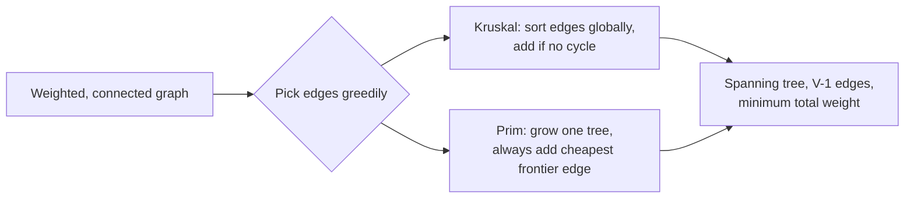

A minimum spanning tree connects every vertex of a weighted, undirected graph with the smallest possible total edge weight and no cycles. Interviewers use MST questions to check two things: can you apply Union-Find correctly, and can you justify *why* a greedy choice is safe here when greedy usually needs proof.

## What makes something a spanning tree

A spanning tree of a graph with `V` vertices has exactly `V - 1` edges, touches every vertex, and contains no cycle. A **minimum** spanning tree is the spanning tree (there can be several) whose edge weights sum to the least possible value. MSTs are only defined for **connected** graphs; a disconnected graph instead has a **minimum spanning forest**, one tree per component.



> [!KEY]
> Both Kruskal and Prim are greedy, and greedy is normally suspicious — but MST is one of the few problems where a local greedy choice is *provably* globally optimal, thanks to the **cut property**.

## The cut property and the cycle property

These two properties are why MST greedy algorithms are correct, not just heuristics.

| Property | Statement | Used by |
|---|---|---|
| Cut property | For any partition of vertices into two sets, the minimum-weight edge crossing the cut is in *some* MST | Prim (grows one side of a cut at a time) |
| Cycle property | For any cycle, the maximum-weight edge in that cycle is *not* in any MST (unless tied) | Kruskal (skips the edge that would close a cycle, which is always the heaviest one added last) |

> [!TIP]
> If asked to *prove* Kruskal is correct, cite the cycle property: adding edges in increasing weight order and rejecting anything that closes a cycle means the rejected edge is always the maximum-weight edge of some cycle, so removing it can only be optimal or neutral.

## Kruskal's algorithm: sort edges, union what doesn't cycle

Sort all edges by weight ascending. Walk the sorted list, adding an edge only if its two endpoints are in different components — checked and merged with **Union-Find**. Stop once `V - 1` edges are added.

```java
// O(E log E) for sort + O(E * alpha(V)) for union-find ≈ O(E log E), Space O(V)
// Edge is a record: record Edge(int u, int v, int weight) {}
Arrays.sort(edges, Comparator.comparingInt(Edge::weight));
int totalWeight = 0, edgesUsed = 0;
for (Edge e : edges) {
    if (union(e.u(), e.v())) {            // false if already same component (would cycle)
        totalWeight += e.weight();
        if (++edgesUsed == n - 1) break;  // tree complete
    }
}
// If edgesUsed < n - 1 here, the graph was disconnected: no MST, only a forest.
```

Union-Find with path compression and union by rank makes each `union`/`find` call effectively `O(α(n))` — constant in practice.

```java
int[] parent, rank;
int find(int x) { return parent[x] == x ? x : (parent[x] = find(parent[x])); }
boolean union(int a, int b) {
    int ra = find(a), rb = find(b);
    if (ra == rb) return false;            // same component -> would create a cycle
    if (rank[ra] < rank[rb]) { int t = ra; ra = rb; rb = t; }
    parent[rb] = ra;
    if (rank[ra] == rank[rb]) rank[ra]++;
    return true;
}
```

## Prim's algorithm: grow one tree from a seed

Prim starts from an arbitrary vertex and repeatedly adds the cheapest edge that connects the current tree to a vertex not yet in it — a direct application of the cut property, where the cut is "tree so far" versus "everything else".

```java
// O((V + E) log V) with a binary heap, Space O(V + E)
boolean[] visited = new boolean[n];
PriorityQueue<int[]> pq = new PriorityQueue<>(Comparator.comparingInt(a -> a[1]));
pq.offer(new int[]{0, 0});
int totalWeight = 0, visitedCount = 0;
while (!pq.isEmpty() && visitedCount < n) {
    int[] top = pq.poll();
    int u = top[0], w = top[1];
    if (visited[u]) continue;             // stale entry, skip
    visited[u] = true;
    visitedCount++;
    totalWeight += w;
    for (int[] edge : adj.get(u)) {
        int v = edge[0], weight = edge[1];
        if (!visited[v])
            pq.offer(new int[]{v, weight});
    }
}
if (visitedCount != n) totalWeight = -1;  // disconnected
```

> [!WARNING]
> Prim's priority queue key is the **edge weight connecting to the tree**, not the cumulative distance from the start — this is the detail people confuse with Dijkstra. Mixing the two up gives you the shortest-path tree instead of the minimum spanning tree, which can be a different tree entirely.

## Kruskal vs Prim: which one to reach for

| Factor | Kruskal | Prim |
|---|---|---|
| Best on | Sparse graphs (`E ≈ V`) | Dense graphs (`E ≈ V²`) |
| Time | `O(E log E)` | `O((V + E) log V)` with a heap, `O(V²)` with an array |
| Core structure | Union-Find | Priority queue |
| Natural output order | Edges in increasing weight — easy to also report "which edge closed which cut" | Grows outward from a single node, natural for streaming/incremental construction |
| Easiest to reason about | Global: sort once, scan once | Local: always ask "what's the cheapest way out of my current tree" |

> [!NOTE]
> On a **dense** graph, `E` approaches `V²`, so `E log E` (Kruskal) becomes worse than `V²` (Prim with a plain array instead of a heap) — this crossover is the textbook justification for "Prim for dense, Kruskal for sparse".

## Worked example

Vertices `{A, B, C, D}`, edges `A-B(1), B-C(2), A-C(4), C-D(3), B-D(5)`.

- **Kruskal:** sort → `A-B(1), B-C(2), C-D(3), A-C(4), B-D(5)`. Take `A-B` (1), take `B-C` (2), take `C-D` (3) — three edges, four vertices, done. Total weight `6`. `A-C` and `B-D` are skipped because they would close a cycle.
- **Prim from A:** frontier `{A-B(1), A-C(4)}` → take `A-B`. Frontier `{A-C(4), B-C(2), B-D(5)}` → take `B-C`. Frontier `{A-C(4), C-D(3), B-D(5)}` → take `C-D`. Same total weight `6`, same tree — confirming both greedy strategies converge on the optimum.

## Handling disconnected input

An MST requires connectivity, so code should prove it got a real spanning tree rather than silently returning the weight of a partial result. In Kruskal, count accepted edges and require exactly `V - 1`; in Prim, count visited vertices and require exactly `V`. If the check fails, return a sentinel, throw, or explicitly report a minimum spanning forest depending on the problem statement.

For a forest, the same greedy ideas still work component by component. Kruskal naturally produces a minimum spanning forest if you simply continue scanning all edges without expecting `V - 1` accepted edges. Prim can do the same by restarting from each unvisited vertex and accumulating one tree per component. State this distinction in interviews: "no MST" for disconnected graphs, "minimum spanning forest" if the caller wants best effort per component.

Negative edge weights do not break MST algorithms. Unlike shortest paths, there is no danger of looping around a negative cycle because a spanning tree is acyclic by definition. Kruskal will simply sort negative edges first, and Prim will happily choose a negative frontier edge when it is the cheapest safe connection.

## Real-world applications

| Domain | How MST is used |
|---|---|
| Network design | Cheapest cabling/fiber layout connecting all sites with no redundant links |
| Clustering | Remove the `k - 1` most expensive MST edges to split the graph into `k` clusters (single-linkage clustering) |
| Approximation algorithms | 2-approximation for the metric Traveling Salesman Problem via MST + DFS |
| Circuit design | Minimizing wire length connecting components on a board |
| Image segmentation | Graph-based segmentation treats pixels as nodes, cuts high-weight MST edges to split regions |

## Cheat sheet

- MST needs a **connected, undirected, weighted** graph; disconnected graphs give a **forest**, one MST per component.
- A spanning tree always has exactly `V - 1` edges.
- **Cut property**: the min-weight edge crossing any cut is safe to add. Justifies Prim.
- **Cycle property**: the max-weight edge in any cycle is safe to discard. Justifies Kruskal.
- **Kruskal** = sort edges + Union-Find; best for sparse graphs.
- **Prim** = priority queue growing one tree; best for dense graphs.
- Prim's heap key is "cost to join the tree", **not** cumulative path distance — that's Dijkstra.
- MST is not unique if weights tie, but its **total weight** always is.
- MST → cluster by cutting the `k-1` heaviest edges to get `k` groups.

## Common mistakes

| Mistake | Fix |
|---|---|
| Confusing Prim's key with Dijkstra's distance | Prim's key is the single edge weight into the tree, not accumulated path cost |
| Forgetting to check for a disconnected graph | If Kruskal adds fewer than `V - 1` edges, or Prim visits fewer than `V` nodes, there is no MST |
| Using `find` without path compression | Union-Find degrades toward `O(n)` per call without compression + union by rank |
| Assuming the MST is unique | It's only unique when all edge weights are distinct; ties can produce multiple valid MSTs with the same total weight |
| Running Kruskal without sorting first | The algorithm's correctness depends on processing edges in non-decreasing weight order |
| Using Kruskal on a dense graph without noticing the cost | `O(E log E)` with `E ≈ V²` can be worse than Prim's `O(V²)` array version |

## Summary

MST algorithms are a rare case where a locally greedy rule — smallest edge that doesn't close a cycle (Kruskal), or cheapest way to extend the current tree (Prim) — is provably globally optimal, via the cut and cycle properties. Kruskal is a sort-plus-Union-Find algorithm best suited to sparse graphs; Prim grows one tree with a priority queue and suits dense graphs. Both land on the same total weight, and the choice between them is a complexity and implementation-convenience trade-off, not a correctness one.

## Top Interview Questions

### Q1. What is a minimum spanning tree and when is it undefined?

An MST is a subset of a connected, undirected, weighted graph's edges that connects all vertices, contains no cycle, and has the minimum possible sum of edge weights; it always has exactly `V - 1` edges for `V` vertices. It's undefined for a disconnected graph — you instead get a **minimum spanning forest**, one MST per connected component — and it's undefined for directed graphs, where the analogous structure is called a minimum arborescence and requires a different algorithm (Chu-Liu/Edmonds).

### Q2. Explain the cut property and why it justifies Prim's algorithm.

The cut property says: for any partition of the graph's vertices into two non-empty sets, the minimum-weight edge crossing that partition belongs to some MST (assuming weights are distinct, or at least ties are broken consistently). Prim's algorithm exploits this directly — at every step, the "cut" is the current tree versus everything outside it, and Prim always adds the cheapest edge crossing that exact cut. Because this holds at every single step, the tree Prim builds incrementally is guaranteed to end up minimal.

### Q3. Explain the cycle property and why it justifies Kruskal's algorithm.

The cycle property says the maximum-weight edge in any cycle can never be part of an MST (again assuming no ties, or consistent tie-breaking), because removing it and keeping the rest of the cycle still connects the same vertices for less weight. Kruskal processes edges in increasing order and only skips an edge when adding it would close a cycle — and the edge it skips is, by construction, the heaviest edge in whatever cycle it would have completed. So every rejection is justified by the cycle property, and every acceptance is justified by the cut property applied to the current forest.

### Q4. Compare the time complexity of Kruskal and Prim, and say when each wins.

Kruskal is `O(E log E)` dominated by the sort, plus near-linear Union-Find operations, so it scales with the number of edges. Prim with a binary heap is `O((V + E) log V)`; with a simple array (no heap) it's `O(V²)`. On a **sparse** graph (`E` close to `V`), Kruskal's `E log E` is smaller than Prim's `V²`, so Kruskal wins. On a **dense** graph (`E` close to `V²`), `E log E` becomes `V² log V`, worse than Prim's array-based `O(V²)`, so Prim wins. The rule of thumb: sparse → Kruskal, dense → Prim (array variant).

### Q5. Why does Union-Find need both path compression and union by rank?

Path compression flattens the tree every time `find` is called, so future lookups for the same nodes are near-instant. Union by rank (or by size) ensures that when merging two components, the smaller tree is always attached under the larger one's root, preventing the structure from becoming a long chain. Either optimization alone gives roughly `O(log n)` per operation; combined, they give `O(α(n))` — the inverse Ackermann function, which is effectively constant (under 5) for any realistic input size. Skipping both can degrade Union-Find to `O(n)` per operation in the worst case, turning Kruskal into an effectively quadratic algorithm.

### Q6. Is the minimum spanning tree always unique? Give an example where it isn't.

No — it's unique only when all edge weights are distinct. If two edges tie for the same weight and both could complete a valid spanning tree, you get multiple different MSTs with identical total weight. Example: a 4-cycle `A-B(1), B-C(1), C-D(1), D-A(1)` — any 3 of these 4 edges form a valid MST of total weight 3, and there are 4 different ways to choose which edge to drop, all equally minimal. The **total weight** of the MST is always unique even when the specific tree is not.

### Q7. How would you detect that a graph has no spanning tree at all?

Run Kruskal to completion and count edges added — if you finish scanning all edges and have fewer than `V - 1` edges in your union-find structure, the graph is disconnected and no spanning tree exists. Equivalently with Prim, count how many vertices get marked visited — if it's less than `V` when the priority queue empties, some vertices were unreachable from the starting node. In both cases, you can report the actual number of connected components by counting distinct roots in the Union-Find structure (Kruskal) or by restarting Prim from each unvisited node (Prim), which gives you the minimum spanning **forest**.

### Q8. How is MST used to approximate the Traveling Salesman Problem?

For metric TSP (triangle inequality holds), build the MST, then do a DFS preorder walk of it, visiting each vertex once by skipping already-visited nodes ("shortcutting"). This produces a tour whose cost is at most twice the optimal tour's cost, because the MST's weight is a lower bound on the optimal tour's weight (removing one edge from an optimal tour gives a spanning tree), and the DFS walk traverses each MST edge at most twice. This 2-approximation is a standard follow-up question after basic MST mechanics, testing whether you can connect MST to a broader algorithmic technique.

### Q9. You're given a live-updating graph (edges added over time) and need the MST after each addition — how would you avoid recomputing from scratch?

Maintain the current MST and Union-Find state. When a new edge `(u, v, w)` arrives: if `u` and `v` are in different components, add the edge directly (it's necessarily part of the new MST, by the cut property). If they're already connected, find the maximum-weight edge on the current tree path between `u` and `v` (via an LCA-based structure or a link-cut tree for full generality) — if the new edge's weight is smaller, swap it in and discard the old maximum edge; otherwise ignore the new edge. This avoids full recomputation and is the basis of dynamic MST maintenance used in network topology management.

### Q10. How would you use MST-based ideas for clustering data points?

Build a complete graph where nodes are data points and edge weights are pairwise distances, compute the MST, then remove the `k - 1` heaviest edges — this splits the tree into `k` connected components, which are your clusters. This is exactly **single-linkage hierarchical clustering**, and MST gives an efficient way to compute it: instead of the naive `O(n³)` hierarchical merge, building the MST with Prim (`O(n²)` on a dense graph of `n` points) and then cutting edges is much cheaper, and the resulting dendrogram falls directly out of the order edges were added to the MST.

### Q11. What's the difference between MST and a shortest-path tree, and why can't you reuse Dijkstra's tree as an MST?

A shortest-path tree (as built by Dijkstra or BFS) minimizes the distance from **one specific source** to every other node; an MST minimizes the **total weight of all edges** in the tree, with no notion of a distinguished source. These can be genuinely different trees: in a triangle `A-B(10), A-C(10), B-C(1)`, Dijkstra from `A` chooses direct edges `A-B` and `A-C` so both nodes are distance 10 from `A`, total tree weight 20. The MST chooses `B-C(1)` plus one of the 10-weight edges, total 11. The objectives are different: shortest paths optimise per-destination distance from a root, while MST optimises global connection cost.

### Q12. If asked to find the *maximum* spanning tree, what would you change?

Both algorithms adapt trivially: for Kruskal, sort edges in **decreasing** order of weight instead of increasing, and apply the same Union-Find logic; for Prim, use a max-heap instead of a min-heap so you always pull the highest-weight frontier edge. The correctness arguments mirror the cut and cycle properties exactly, just flipped — the cut property becomes "the maximum edge across a cut is safe to add" and the cycle property becomes "the minimum edge in a cycle is safe to discard". Maximum spanning trees show up in problems like maximizing bandwidth reliability or in certain formulations of correlation-based clustering.
