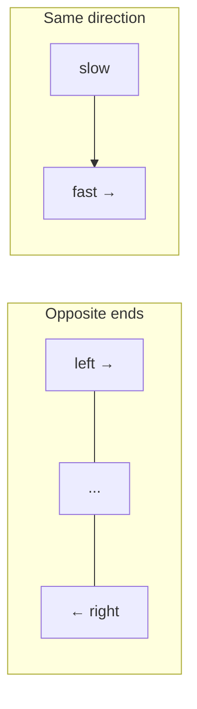

Two pointers is the simplest pattern that consistently turns an `O(n²)` nested-loop brute force into `O(n)`. The trick is not the code — it is recognising *when* moving two indices together is valid, which depends on the array being sorted or the condition being monotonic.

## Two families

There are two distinct shapes, and interviewers expect you to name which one you are using.



| Variant | Movement | Typical use | Requires sorted input? |
|---|---|---|---|
| Opposite ends | `left` starts at 0, `right` at end, they close inward | Pair sum, container with most water, palindrome check | Usually yes |
| Same direction (slow/fast) | Both start at 0, `fast` scans ahead, `slow` marks a write position | In-place removal, partitioning, cycle detection | No |

> [!KEY]
> Two pointers work only when moving one pointer **provably cannot miss the answer**. On a sorted array, moving `left` right when the pair-sum is too small is safe because every pair involving the old `left` and anything smaller than the current `right` was already too small. That argument, not the code, is what you should say out loud.

## Sorted-array pair sum

Given a sorted array, find two numbers that sum to a target.

```java
// O(n) time, O(1) space — array must be sorted
public int[] twoSumSorted(int[] nums, int target) {
    int left = 0, right = nums.length - 1;
    while (left < right) {
        int sum = nums[left] + nums[right];
        if (sum == target) return new int[] { left, right };
        if (sum < target) left++;   // need a bigger sum
        else right--;               // need a smaller sum
    }
    return new int[] { -1, -1 };
}
```

This is `O(n)` versus `O(n²)` brute force, or `O(n)` time / `O(n)` space with a hash set if the array is **unsorted** and you cannot sort it (sorting destroys original indices).

## Three-sum with de-duplication

Fix one element, then two-pointer the rest. Sorting first makes both the search and the de-duplication trivial.

```java
// O(n^2) time, O(1) extra space (excluding output), input sorted first
public List<List<Integer>> threeSum(int[] nums) {
    Arrays.sort(nums);
    List<List<Integer>> result = new ArrayList<>();
    for (int i = 0; i < nums.length - 2; i++) {
        if (i > 0 && nums[i] == nums[i - 1]) continue;   // skip duplicate anchors
        int left = i + 1, right = nums.length - 1;
        while (left < right) {
            int sum = nums[i] + nums[left] + nums[right];
            if (sum == 0) {
                result.add(List.of(nums[i], nums[left], nums[right]));
                while (left < right && nums[left] == nums[left + 1]) left++;   // skip dup
                while (left < right && nums[right] == nums[right - 1]) right--; // skip dup
                left++; right--;
            } else if (sum < 0) left++;
            else right--;
        }
    }
    return result;
}
```

> [!TIP]
> The de-duplication trick is always the same: after recording a match, skip past every equal neighbour before moving on. Say this explicitly — it is the detail that separates a working solution from one with duplicate triplets.

## Container with most water

Opposite-ends pointers, but the movement rule is different from pair-sum: always move the **shorter** wall inward, because the taller one can never be the bottleneck again while paired with anything further in.

```java
// O(n) time, O(1) space
public int maxArea(int[] height) {
    int left = 0, right = height.length - 1, best = 0;
    while (left < right) {
        int h = Math.min(height[left], height[right]);
        best = Math.max(best, h * (right - left));
        if (height[left] < height[right]) left++;
        else right--;
    }
    return best;
}
```

## In-place removal and partitioning (slow/fast)

The same-direction variant does not need sorted input. `slow` marks the next write position; `fast` scans for elements that should be kept.

```java
// O(n) time, O(1) space — remove all instances of val in place
public int removeElement(int[] nums, int val) {
    int slow = 0;
    for (int fast = 0; fast < nums.length; fast++)
        if (nums[fast] != val)
            nums[slow++] = nums[fast];
    return slow;   // new logical length
}
```

The Dutch National Flag (3-way partition, e.g. `Sort Colors`) is the same idea with three pointers: `low`, `mid`, `high`, partitioning into three regions in one pass.

## Palindrome checks

Opposite ends collapsing inward, comparing as they go — the most direct application of the pattern.

```java
// O(n) time, O(1) space
public boolean isPalindrome(String s) {
    int left = 0, right = s.length() - 1;
    while (left < right) {
        if (!Character.isLetterOrDigit(s.charAt(left))) { left++; continue; }
        if (!Character.isLetterOrDigit(s.charAt(right))) { right--; continue; }
        if (Character.toLowerCase(s.charAt(left)) != Character.toLowerCase(s.charAt(right))) return false;
        left++; right--;
    }
    return true;
}
```

## Merging two sorted arrays

Same-direction, but from the **back** when merging in place (to avoid overwriting unread elements), or from the front when producing a new array.

| Merge direction | Use case |
|---|---|
| Front-to-back into a new array | Merging two separate sorted lists |
| Back-to-front in place | `nums1` has trailing free space (classic "Merge Sorted Array") — avoids shifting |

## Trapping rain water

A two-pointer variant of a prefix-max problem: water trapped at index `i` is `min(maxLeft, maxRight) - height[i]`. Instead of precomputing both prefix-max arrays (`O(n)` space), track running maxima from both ends and always advance the side with the smaller max — that side's water level is already determined.

```java
// O(n) time, O(1) space
public int trap(int[] height) {
    int left = 0, right = height.length - 1;
    int leftMax = 0, rightMax = 0, water = 0;
    while (left < right) {
        if (height[left] < height[right]) {
            leftMax = Math.max(leftMax, height[left]);
            water += leftMax - height[left];
            left++;
        } else {
            rightMax = Math.max(rightMax, height[right]);
            water += rightMax - height[right];
            right--;   // advance right inward
        }
    }
    return water;
}
```

> [!WARNING]
> The correctness argument here is subtle and worth stating: when `height[left] < height[right]`, we know `rightMax >= height[right] > height[left]`, so the water above `left` is bounded by `leftMax` regardless of what lies further right. That is why it is safe to resolve `left` using only `leftMax`.

## Recognising when the pattern applies

| Signal in the problem | Likely pattern |
|---|---|
| "sorted array", find a pair/triplet with a target sum | Opposite-ends two pointers |
| "in place", "without extra space", remove/move elements | Same-direction slow/fast |
| "palindrome", "reverse", compare from both sides | Opposite-ends two pointers |
| "merge two sorted", "k sorted lists" | Same-direction (often with a heap for k > 2) |
| Answer depends on `min`/`max` of two boundary values | Opposite-ends, move the limiting side |
| Need every subarray or substring meeting a condition | Usually sliding window, not plain two pointers |

> [!DANGER]
> Two pointers on an **unsorted** array for a sum problem is a classic trap — the greedy "move left if sum too small" argument only holds because the array is sorted. On unsorted data, use a hash set instead, or sort first if indices don't matter.

## Cheat sheet

- Opposite-ends: `left`/`right` close inward — sorted-array sums, palindromes, container/rain water.
- Same-direction: `slow`/`fast` — in-place removal, partitioning, cycle detection on linked lists.
- Always state the invariant that justifies moving a pointer — that is the actual interview signal.
- Container with most water: always move the **shorter** wall.
- Trapping rain water: always advance the side with the **smaller running max**.
- Three-sum: sort first, fix one index, two-pointer the rest, skip duplicates on both anchor and inner pointers.
- Merging in place: work from the **back** to avoid overwriting unread data.
- Two pointers need a monotonic/sorted property; without one, prefer a hash set or prefix sum.
- Complexity is almost always `O(n)` or `O(n log n)` (if a sort is required first), `O(1)` extra space.

## Common mistakes

| Mistake | Fix |
|---|---|
| Using two pointers on an unsorted array expecting sorted-array logic | Sort first (if order doesn't matter) or use a hash set |
| Forgetting to skip duplicates in three-sum, producing repeated triplets | Advance past equal neighbours after recording each match |
| Moving the taller wall in "container with most water" | Always move the **shorter** wall inward |
| Merging sorted arrays from the front when one has trailing free space | Merge from the back to avoid overwriting unread elements |
| Off-by-one on the `while (left < right)` vs `left <= right` condition | Use `<` when pointers must not cross/overlap the same element twice |
| Treating slow/fast (in-place partition) as needing sorted input | It never does — it only needs a per-element keep/discard test |

## Summary

Two pointers replaces nested loops with a single pass by exploiting a monotonic property: sortedness for opposite-ends problems, or a simple keep/discard test for same-direction problems. The pattern is recognisable from the problem statement — sorted arrays, pair/triplet sums, palindromes, and in-place array surgery are the classic signals. The part that actually earns interview credit is the one-sentence proof of why moving a given pointer cannot skip the optimal answer, not the four lines of code that implement it.

## Top Interview Questions

### Q1. What are the two main variants of the two-pointers pattern, and how do they differ?

The **opposite-ends** variant starts one pointer at index 0 and another at the last index, moving them toward each other; it is used for sorted-array pair sums, palindrome checks, and container-style problems, and generally requires the input to be sorted or otherwise have a monotonic property. The **same-direction (slow/fast)** variant starts both pointers at 0, with `fast` scanning ahead and `slow` marking a write or boundary position; it is used for in-place removal, partitioning, and detecting cycles in linked lists, and does not require sorted input — only a per-element test of whether to keep, skip, or swap.

### Q2. Why does the two-pointer approach work for finding a pair with a target sum in a sorted array?

Because the array is sorted, if `nums[left] + nums[right] > target`, then pairing `right` with anything to its left (which is `<= nums[right]`) other than positions already checked would still be `>= ` the current sum only if larger, so decreasing `right` is the only way to reduce the sum — we can safely discard `right` because it cannot form a valid pair with anything currently between `left` and `right` either (all give a larger or equal sum than checked so far). Symmetrically, if the sum is too small, increasing `left` is safe because `left` paired with anything smaller than the current `right` was already the largest possible pairing for that `left`. This monotonic argument is why sortedness is required.

### Q3. How do you avoid duplicate triplets in the classic "Three Sum" problem?

Sort the array first. Iterate an anchor index `i`, skipping it if it equals the previous anchor (`nums[i] == nums[i-1]`) to avoid repeating the same first element. For the inner two-pointer scan (`left`, `right`), after recording a valid triplet, advance `left` past any run of equal values and retreat `right` past any run of equal values before continuing. Both de-duplication steps are necessary: skipping only the anchor prevents duplicate first elements, but without also skipping duplicate `left`/`right` values you can still emit the same triplet multiple times from a single anchor.

### Q4. In "Container With Most Water", why do you always move the pointer at the shorter wall?

The area for a given pair is `min(height[left], height[right]) * (right - left)`. If you move the taller wall inward instead, the width strictly decreases and the height is still capped by the shorter wall (unchanged), so the area cannot improve — that move is provably useless. Moving the shorter wall is the only move that has a chance of increasing the bounding height for a still-decreasing width, so it is the only move that can possibly find a better answer. This is a good example of a two-pointer move being justified by elimination, not by a greedy guess.

### Q5. How does "Trapping Rain Water" use two pointers instead of precomputed prefix-max arrays?

The naive approach precomputes a left-max and right-max array in `O(n)` space, then for each index takes `min(leftMax[i], rightMax[i]) - height[i]`. The two-pointer version tracks running `leftMax` and `rightMax` on the fly and advances whichever side currently has the smaller running max, computing that side's trapped water immediately. It is safe because the side with the smaller max is guaranteed to be bounded by its own running max regardless of what the far side's exact max is (which we haven't fully computed yet) — this reduces the problem to `O(1)` extra space instead of `O(n)`.

### Q6. When would you use two pointers versus a hash set for a pair-sum problem?

Use two pointers when the array is already sorted, or when you are allowed to sort it and don't need to preserve original indices — it costs `O(n log n)` for the sort (or `O(n)` if already sorted) and `O(1)` extra space. Use a hash set when the array is unsorted and you must preserve original order or indices, or sorting is undesirable for another reason — it costs `O(n)` time and `O(n)` extra space. In an interview, state both and pick based on the constraint the interviewer cares about (usually whether extra space is a concern).

### Q7. How would you remove duplicates from a sorted array in place, and what does the function return?

Use the slow/fast pattern: `slow` tracks the position of the last unique element written; `fast` scans forward. When `nums[fast] != nums[slow]`, increment `slow` and copy `nums[fast]` into `nums[slow]`. This runs in `O(n)` time and `O(1)` extra space, and by convention the function returns the new logical length `slow + 1`, leaving the rest of the array's contents undefined (the caller is expected to only read the first `slow + 1` elements). This exact template generalises to "keep at most k duplicates" by comparing against `nums[slow - k]` instead.

### Q8. Debugging scenario: your two-pointer palindrome check returns wrong answers on strings with punctuation and mixed case. What's likely wrong and how do you fix it?

Most likely the pointers are comparing raw characters without skipping non-alphanumeric characters or normalising case. The fix is to advance `left` past any non-alphanumeric character and `right` similarly before each comparison, and compare using a case-insensitive form (`Character.toLowerCase`) rather than raw equality. A second common bug is off-by-one in the loop condition — using `<=` instead of `<` for `left < right` can cause a false negative on odd-length strings by comparing the middle character to itself incorrectly, or an index-out-of-range if not guarded.

### Q9. How would you merge two sorted arrays in place when one has extra trailing capacity, without using O(n) extra space?

Start pointers at the **end** of both arrays' valid data (not the end of the buffer) and a third pointer at the very end of the combined buffer. Compare the two current end elements, copy the larger one to the write position, and decrement that source pointer and the write pointer. Working backward avoids overwriting elements in the first array that haven't been read yet — merging forward would require shifting elements repeatedly, degrading to `O(n²)` or requiring `O(n)` auxiliary space. This runs in `O(n + m)` time and `O(1)` extra space.

### Q10. What's a production consideration when applying two pointers to very large or streamed arrays that don't fit in memory?

Two pointers assume random access to both ends of the data, which does not hold for a stream or an external (disk-backed) dataset — you cannot cheaply seek to "the last element" without first knowing where it is, and reverse iteration over a stream is often impossible. For streamed data, you would instead need either a two-pass approach (first pass to find the length/end marker, buffering only what's needed), an external sort plus a merge pass that reads sequentially from both sides using file seeks, or reformulating the problem with a sliding window that only looks forward. State this trade-off explicitly if asked about scaling beyond in-memory arrays.

### Q11. How do you generalise the two-pointer three-sum solution to four-sum, and what's the complexity?

Fix two anchor indices with nested loops (skipping duplicates at each level the same way as three-sum), then run the standard two-pointer scan on the remaining two indices for each pair of anchors. This gives `O(n^3)` time (two nested anchor loops times a linear two-pointer scan) and `O(1)` extra space excluding output. The general pattern extends to "k-sum" by recursing: reduce k-sum to (k-1)-sum with one fixed anchor, bottoming out at two-sum via two pointers once k reaches 2 — giving `O(n^(k-1))` overall.

### Q12. Why is two pointers not the right tool for "find the longest substring satisfying some property", and what should you use instead?

That phrasing needs the window's **length** to be tracked while expanding and shrinking based on a running condition (like a character-frequency count), not just two indices closing toward each other — that is the sliding window pattern, a specialised same-direction two-pointer technique with an explicit expand/contract loop and auxiliary window state (a frequency map, a distinct-count, or a running sum). Plain two pointers moves each pointer at most once per direction with a simple test; sliding window pointers can each move multiple times as the window grows and shrinks in response to violations of the window's invariant.
