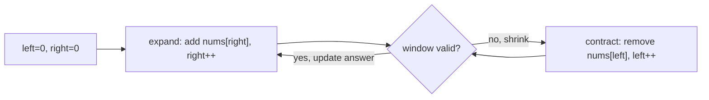

Sliding window is what two pointers becomes when the thing you are tracking is a **range**, not just two positions. Any time a problem asks about the best contiguous subarray or substring, and a brute force would re-scan overlapping ranges, this pattern collapses it to `O(n)`.

## Fixed vs variable windows

| Window type | Size | Typical trigger phrase | Example |
|---|---|---|---|
| Fixed | Constant `k`, given up front | "of size k", "every k elements" | Max sum subarray of size k |
| Variable | Grows and shrinks based on a condition | "longest/shortest substring such that...", "at most K distinct" | Longest substring without repeating characters |



> [!KEY]
> Every variable window follows the same template: **expand right to include new data, then contract left while some invariant is violated (or satisfied, if you're minimising)**. The invariant — not the code — is what changes between problems.

## The expand/contract template

```java
// Generic variable-window skeleton
int left = 0, best = 0; // or Integer.MAX_VALUE for minimisation
// window state, e.g. a Map<Character, Integer> frequency map, goes here
for (int right = 0; right < n; right++) {
    // 1. Add nums[right] / s.charAt(right) into the window state
    while (/* window invariant is violated */) {
        // 2. Remove nums[left] / s.charAt(left) from the window state
        left++;
    }
    // 3. Window [left, right] is now valid — update the answer
    best = Math.max(best, right - left + 1);
}
```

Each element enters the window exactly once (when `right` reaches it) and leaves exactly once (when `left` passes it), so total work across the whole run is `O(n)`, even though it looks like a nested loop.

## Longest substring without repeating characters

```java
// O(n) time, O(min(n, alphabet)) space
public int lengthOfLongestSubstring(String s) {
    Map<Character, Integer> lastSeen = new HashMap<>();
    int left = 0, best = 0;
    for (int right = 0; right < s.length(); right++) {
        char c = s.charAt(right);
        Integer idx = lastSeen.get(c);
        if (idx != null && idx >= left)
            left = idx + 1;           // jump left past the previous occurrence
        lastSeen.put(c, right);
        best = Math.max(best, right - left + 1);
    }
    return best;
}
```

Note this variant jumps `left` directly instead of a `while` loop — both are valid; jumping is an optimisation once you know exactly how far to move.

## Minimum window substring

The classic hard variant: find the smallest window in `s` containing every character of `t` (with multiplicity).

```java
// O(|s| + |t|) time, O(|t|) space
public String minWindow(String s, String t) {
    Map<Character, Integer> need = new HashMap<>();
    for (char c : t.toCharArray()) need.merge(c, 1, Integer::sum);
    int required = need.size(), formed = 0;
    Map<Character, Integer> window = new HashMap<>();
    int left = 0, bestLen = Integer.MAX_VALUE, bestStart = 0;

    for (int right = 0; right < s.length(); right++) {
        char c = s.charAt(right);
        window.merge(c, 1, Integer::sum);
        // compare via intValue() — == on boxed Integers is wrong above 127
        if (need.containsKey(c) && window.get(c).intValue() == need.get(c).intValue()) formed++;

        while (formed == required) {  // window is valid — try to shrink it
            if (right - left + 1 < bestLen) { bestLen = right - left + 1; bestStart = left; }
            char lc = s.charAt(left);
            window.merge(lc, -1, Integer::sum);
            if (need.containsKey(lc) && window.get(lc) < need.get(lc)) formed--;
            left++;
        }
    }
    // Java's substring takes an END index, not a length
    return bestLen == Integer.MAX_VALUE ? "" : s.substring(bestStart, bestStart + bestLen);
}
```

> [!TIP]
> Say the invariant out loud before coding: *"formed == required means the window currently satisfies the frequency requirement for every needed character — I only shrink while that stays true, recording the best window each time it does."* That framing is what a senior answer sounds like.

## At-most-K-distinct, and the "exactly K" trick

"Longest substring with at most K distinct characters" is a direct expand/contract application: track a frequency map and shrink while `distinct count > K`. A neat corollary worth quoting: **exactly K = atMost(K) - atMost(K-1)**, because the count of windows with exactly K distinct characters is the count with at most K minus the count with at most K-1. This turns an awkward "exactly" constraint into two easy "at most" sliding windows.

## Subarray sum with positive numbers, and why negatives break it

For an array of **positive** numbers, "does a contiguous subarray sum to exactly target" is solvable with a sliding window: expand right, and shrink left while the running sum exceeds the target — because adding more positive numbers only ever increases the sum, the window's sum is monotonic as you move either pointer.

```java
// Works only when all elements are positive — O(n) time, O(1) space
public boolean hasSubarrayWithSum(int[] nums, int target) {
    int left = 0, sum = 0;
    for (int right = 0; right < nums.length; right++) {
        sum += nums[right];
        while (sum > target && left <= right) sum -= nums[left++];
        if (sum == target) return true;
    }
    return false;
}
```

> [!DANGER]
> With negative numbers, shrinking the window from the left can **decrease** the sum unpredictably, so "sum too big, shrink left" is no longer a valid move — the monotonic assumption the whole pattern depends on is gone. For arrays that may contain negatives, use a **prefix sum + hashmap** instead: track running prefix sums and look up `prefixSum - target` in a seen-set, which works in `O(n)` regardless of sign.

| Array contains | Correct tool | Why |
|---|---|---|
| Only positive numbers | Sliding window | Sum is monotonic as the window grows/shrinks |
| Negative numbers allowed | Prefix sum + hash map | Sliding window's monotonic assumption breaks |

## Why sliding window is O(n)

`right` moves from `0` to `n-1` exactly once — `n` steps total. `left` only ever moves forward, and can move at most `n` times across the entire run (it can never exceed `right`, and never moves backward). So total pointer movement across the whole algorithm is bounded by `2n`, not `n²` — this is why a "loop inside a loop" shape is still linear. This is the same amortised argument used for the two-pointer pattern, just applied to a range instead of two fixed positions.

> [!WARNING]
> The complexity argument only holds if the work done inside the shrink loop per step is `O(1)` (or amortised `O(1)`, like a dictionary update). If shrinking recomputes something expensive from scratch each time, the whole algorithm silently becomes `O(n²)` again — watch for this when window state is more complex than a simple counter or frequency map.

## Cheat sheet

- Fixed window: maintain a running sum/count, add the new element, subtract the one leaving `k` steps behind.
- Variable window: expand `right` every step; shrink `left` inside a `while` whenever the invariant is violated (or, for minimisation, while it's still satisfied).
- State the invariant explicitly before coding — it is the only thing that changes between problems.
- `exactly K` = `atMost(K)` − `atMost(K-1)` is a reusable trick for distinct-count problems.
- Sliding window requires a **monotonic** relationship between window size and the tracked quantity — this needs non-negative values for sums.
- With negatives, switch to prefix sum + hash map — `O(n)` time, no monotonicity required.
- Total pointer movement is bounded by `2n`, which is the whole justification for the `O(n)` claim.
- Watch for expensive work inside the shrink loop silently making the algorithm quadratic.

## Common mistakes

| Mistake | Fix |
|---|---|
| Using sliding window on an array with negative numbers | Switch to prefix sum + hash map instead |
| Shrinking the window with a `while (condition)` but forgetting to update the answer before or after correctly | Decide up front whether you're tracking max (update before shrinking) or min (update while valid inside the shrink) |
| Recomputing frequency/sum from scratch every iteration | Maintain running state incrementally — add on expand, subtract on contract |
| Off-by-one on window length: using `right - left` instead of `right - left + 1` | Window `[left, right]` inclusive has length `right - left + 1` |
| Forgetting to reset/clean up window state when a key's count hits zero | Remove the key from maps like `HashSet`/distinct-count trackers, not just decrement to zero |
| Assuming "at most K" and "exactly K" need separate custom logic | Use the atMost(K) − atMost(K−1) trick instead of writing new logic |

## Summary

Sliding window is the range version of two pointers: `right` expands to absorb new data, `left` contracts to repair a broken invariant, and each element is touched a constant number of times overall, giving `O(n)`. It solves substring and subarray problems that ask for longest, shortest, or count of windows satisfying a condition. The one hard requirement is monotonicity — growing the window must move you predictably toward or away from validity, which holds for non-negative sums and character-frequency conditions but breaks the moment negative numbers enter the array, at which point prefix sum with a hash map is the correct substitute.

## Top Interview Questions

### Q1. What is the sliding window pattern, and when should you reach for it?

Sliding window maintains a contiguous range `[left, right]` over an array or string and moves its boundaries incrementally rather than re-scanning from scratch for every possible window. Reach for it when a problem asks for the longest, shortest, or count of contiguous subarrays/substrings satisfying some condition — "longest substring without repeating characters", "smallest subarray with sum >= target", "at most K distinct characters". The core requirement is that the window's validity changes **monotonically** as you expand or contract it; without that, you cannot safely decide which direction to move a pointer.

### Q2. Explain the expand/contract template and how you decide whether to update the answer before or after shrinking.

The template expands `right` every iteration to absorb one new element into the window's state, then enters a `while` loop that contracts `left` while some condition holds. For **maximisation** problems (longest window satisfying a property), you shrink only while the invariant is *violated*, then update the answer once the window is valid again, after the shrink loop. For **minimisation** problems (shortest window satisfying a property), you shrink *while the window is still valid*, updating the best answer on every valid state you see, because you're looking for the smallest such window before it becomes invalid again.

### Q3. Why is a sliding window algorithm O(n) even though it looks like a loop nested inside a loop?

`right` advances from `0` to `n-1` exactly once, contributing `O(n)` steps. `left` only ever moves forward and can never exceed `right`, so across the *entire* execution of the algorithm — not per iteration of the outer loop — `left` advances at most `n` times total. Summing both pointers' total movement gives `O(2n) = O(n)`. This is an amortised argument: the inner `while` loop looks like it could run `O(n)` times per outer iteration, but it cannot do so repeatedly, because `left` cannot un-advance. The caveat is that work done per step inside both loops must itself be `O(1)` (or amortised `O(1)`).

### Q4. How would you find the minimum window substring of s that contains all characters of t?

Build a frequency map of `t`. Expand `right` over `s`, incrementing a window frequency map and a "formed" counter whenever a needed character's count in the window first matches its required count. Once `formed` equals the number of distinct required characters, the window is valid — enter a shrink loop that records the best (smallest) valid window seen so far, then removes `s[left]` from the window, decrementing `formed` if that removal drops a required character below its needed count, and advances `left`. This runs in `O(|s| + |t|)` time and `O(|t|)` space, since each character enters and leaves the window map at most once.

### Q5. Why doesn't sliding window work directly for "subarray sums to target" when the array can contain negative numbers?

The pattern relies on the window's sum changing monotonically as you move `left` or `right` — with only positive numbers, extending the window always increases the sum and shrinking it always decreases it, so "sum too big, shrink" is always a safe, unambiguous move. With negative numbers present, adding an element to the window can decrease the sum, and removing an element from the left can also decrease or increase it unpredictably, so there is no longer a reliable direction to move a pointer in response to the sum being off-target. The window can no longer be "corrected" by a simple greedy shrink/expand rule.

### Q6. What technique replaces sliding window for subarray sum problems once negative numbers are allowed?

Prefix sum combined with a hash map. Compute a running prefix sum as you scan left to right, and maintain a hash map (or hash set) of prefix sums seen so far. For "does a subarray sum to target", at each index check whether `runningSum - target` has been seen before — if so, the subarray between that earlier position and the current one sums to exactly `target`. This works regardless of sign because it doesn't rely on monotonic window growth, just on the identity `sum(i..j) = prefix[j] - prefix[i-1]`. It runs in `O(n)` time and `O(n)` space.

### Q7. How do you count the number of subarrays with exactly K distinct elements?

Directly tracking "exactly K" with a single sliding window is awkward because shrinking to maintain exactly K distinct isn't monotonic in an easy way. Instead use the identity `exactly(K) = atMost(K) - atMost(K-1)`, where `atMost(K)` counts subarrays with at most K distinct elements — itself a straightforward sliding window (expand right, shrink left while distinct count exceeds K, and add `right - left + 1` to the running total each time the window is valid, since every subarray ending at `right` and starting anywhere from `left` to `right` also satisfies at-most-K). Computing `atMost(K)` and `atMost(K-1)` and subtracting gives the exact count in `O(n)` total.

### Q8. Debugging scenario: your fixed-size sliding window for "max sum subarray of size k" gives a wrong answer for the first few windows. What's likely wrong?

The most common bug is starting the "update answer" check too early or too late relative to when the window actually reaches size `k`. The fix is to only start comparing/recording the best sum once `i >= k - 1` (0-indexed), because before that the window hasn't reached its full size yet. A related bug is forgetting to subtract `nums[i - k]` when the window slides past size `k`, which causes the running sum to keep growing instead of representing only the last `k` elements — always pair every addition of `nums[i]` with a subtraction of `nums[i - k]` once `i >= k`.

### Q9. How would you adapt sliding window to "longest substring with at most K distinct characters" and what window state do you need?

Maintain a frequency map (character to count) for the current window and a running count of distinct keys with non-zero frequency. Expand `right`, incrementing that character's count in the map (and incrementing distinct count if this is a new key). While distinct count exceeds K, decrement `s[left]`'s count, removing the key entirely (and decrementing distinct count) if its count reaches zero, then advance `left`. After the shrink loop, the window `[left, right]` is guaranteed valid, so update the best length. This is `O(n)` time and `O(K)` space for the frequency map.

### Q10. In a production log-processing system, how might you apply a sliding-window idea to compute a rolling average or rate over the last N minutes of events?

This is the fixed-size sliding window pattern applied to a time-based (rather than index-based) window: maintain a queue of recent event timestamps (and values, if computing an average), a running sum, and evict from the front of the queue any events older than `now - N minutes` before recording each new metric point, subtracting their contribution from the running sum as they're evicted. This gives amortised `O(1)` per event for maintaining a running rate or average, versus re-scanning the last N minutes of raw events on every query, which would be `O(window size)` per query. It is the same expand (new event arrives) / contract (old event expires) template applied to real time instead of array indices.

### Q11. What's the difference between the sliding window pattern and the two-pointer pattern discussed for arrays?

They are closely related — sliding window is really a specialised two-pointer technique — but the distinction is in intent and pointer behaviour. Classic two pointers (opposite-ends or slow/fast) typically moves each pointer **at most once** per element and is used for pair/triplet sums, palindromes, and in-place partitioning, often on sorted data. Sliding window tracks a contiguous **range** with explicit window state (a running sum, a frequency map) and both pointers can each move multiple times across the run as the window repeatedly expands and contracts in response to a validity condition, most commonly on substrings/subarrays rather than simple pair lookups.

### Q12. How would you find the smallest subarray with a sum greater than or equal to a target, given all positive numbers?

This is the canonical minimisation sliding window. Expand `right`, adding `nums[right]` to a running sum. Whenever the running sum is `>= target`, enter a shrink loop: record the current window length if it's smaller than the best seen so far, subtract `nums[left]` from the running sum, and advance `left` — keep shrinking as long as the sum stays `>= target`. This runs in `O(n)` time and `O(1)` space. It relies on all values being positive so that shrinking the window can only decrease the sum, which is exactly the monotonicity requirement the whole pattern depends on.
