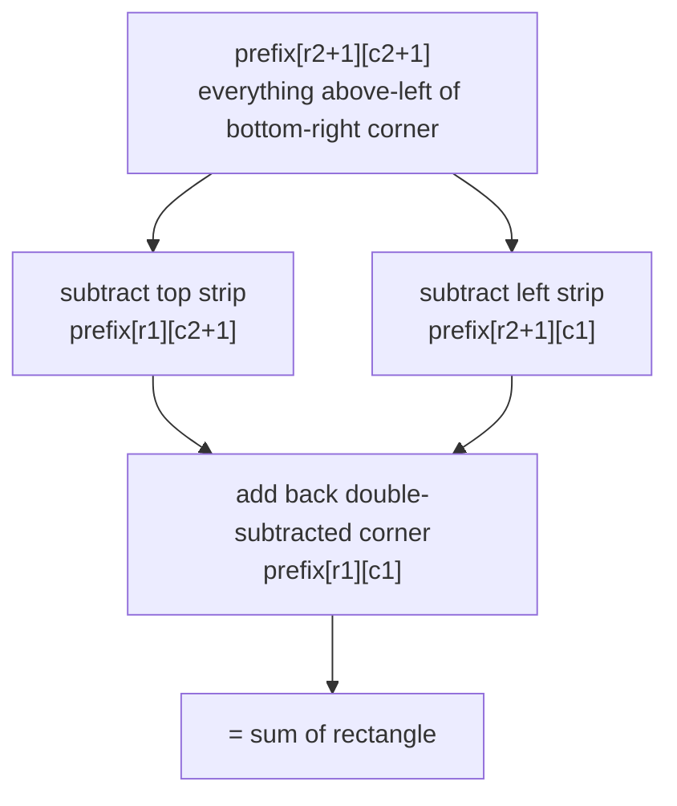

Prefix sums trade a one-time `O(n)` (or `O(n·m)`) build for `O(1)` range queries afterward. Difference arrays are the mirror image — they trade `O(1)` range **updates** for a single `O(n)` rebuild at the end. Together they cover most "range" questions that would otherwise be re-summed from scratch every time.

## 1-D prefix sums

`prefix[i]` holds the sum of everything up to and including index `i`. A range sum `[l, r]` is then one subtraction.

```java
// Build: O(n) time, O(n) space
int[] prefix = new int[nums.length];
prefix[0] = nums[0];
for (int i = 1; i < nums.length; i++)
    prefix[i] = prefix[i - 1] + nums[i];

// Range query [l, r], O(1)
int rangeSum(int l, int r) {
    return l == 0 ? prefix[r] : prefix[r] - prefix[l - 1];
}
```

> [!KEY]
> The identity to memorise: `sum(l..r) = prefix[r] - prefix[l-1]`. Almost every prefix-sum problem is a variation on subtracting two running totals to isolate a range.

## 2-D prefix sums

Same idea extended to a grid, using inclusion-exclusion to avoid double-subtracting the overlapping region.

```java
// Build: O(rows * cols), Space O(rows * cols)
// prefix[i][j] = sum of the rectangle from (0,0) to (i-1,j-1), using a 1-padded border to avoid bounds checks
int[][] prefix = new int[rows + 1][cols + 1];
for (int i = 0; i < rows; i++)
    for (int j = 0; j < cols; j++)
        prefix[i + 1][j + 1] = grid[i][j] + prefix[i][j + 1] + prefix[i + 1][j] - prefix[i][j];

// Sum of rectangle (r1,c1) to (r2,c2) inclusive, O(1)
int regionSum(int r1, int c1, int r2, int c2) {
    return prefix[r2 + 1][c2 + 1] - prefix[r1][c2 + 1] - prefix[r2 + 1][c1] + prefix[r1][c1];
}
```



## Subarray sum equals K (with a hash map)

Range-sum queries need the array to be static (immutable) once built. A different family of problems — "how many subarrays sum to exactly K" — uses the same prefix-sum identity but combines it with a hash map, because the array is scanned once rather than queried repeatedly.

```java
// O(n) time, O(n) space
public int subarraySum(int[] nums, int k) {
    Map<Integer, Integer> seen = new HashMap<>();
    seen.put(0, 1);   // empty prefix seen once
    int running = 0, count = 0;
    for (int x : nums) {
        running += x;
        count += seen.getOrDefault(running - k, 0);
        seen.merge(running, 1, Integer::sum);
    }
    return count;
}
```

The trick: a subarray `(i, j]` sums to `k` exactly when `prefix[j] - prefix[i] == k`, i.e. `prefix[i] == prefix[j] - k`. Instead of storing the whole prefix array and scanning it for matches (`O(n²)`), keep a running count of every prefix value seen so far and look up `running - k` — `O(n)`.

> [!TIP]
> The `seen[0] = 1` seed is the detail interviewers watch for. It accounts for subarrays that start at index 0 — without it, you silently miss every subarray whose sum from the very beginning equals `k`.

## Count of subarrays divisible by K

Same identity, mod arithmetic instead of exact match: two prefixes with the **same remainder mod K** bound a subarray divisible by K, because `(prefix[j] - prefix[i]) % K == 0` exactly when `prefix[j] % K == prefix[i] % K`.

```java
// O(n) time, O(K) space
public int subarraysDivByK(int[] nums, int k) {
    int[] remCount = new int[k];
    remCount[0] = 1;
    int running = 0, count = 0;
    for (int x : nums) {
        running += x;
        int rem = ((running % k) + k) % k;   // normalise negative remainders
        count += remCount[rem];
        remCount[rem]++;
    }
    return count;
}
```

> [!WARNING]
> Java's `%` operator can return a negative result for negative operands (e.g. `-3 % 5 == -3`). Always normalise with `((x % k) + k) % k` before using a remainder as an array index — this is the single most common bug in this family of problems. (`Math.floorMod(x, k)` does the same normalisation in one call.)

## Difference arrays: O(1) range updates

Prefix sums answer "what is the sum over this range" fast. Difference arrays answer the opposite question fast: "add `val` to every element in this range", when you have many such updates and only need the final array once.

```java
// u updates + one final pass: O(u + n) time, O(n) space
int[] diff = new int[n + 1];
for (int[] update : updates) {   // each update is {l, r, val}
    int l = update[0], r = update[1], val = update[2];
    diff[l] += val;
    diff[r + 1] -= val;      // cancel the effect right after r
}
int[] result = new int[n];
int running = 0;
for (int i = 0; i < n; i++) {
    running += diff[i];
    result[i] = running;
}
```

Each update is `O(1)` regardless of how wide the range is, versus `O(range length)` for a naive loop over every index in the range. Only the final reconstruction pass is `O(n)`, done once at the end.

## Running max/min prefixes

A lighter-weight relative of the prefix sum: instead of a running total, keep a running maximum or minimum. This underlies problems like "best time to buy and sell stock" (track the running minimum price seen so far, compare against it at each step) and "trapping rain water" (running max from both ends).

```java
// O(n) time, O(1) space — max profit with one buy and one sell
public int maxProfit(int[] prices) {
    int minSoFar = Integer.MAX_VALUE, best = 0;
    for (int p : prices) {
        minSoFar = Math.min(minSoFar, p);
        best = Math.max(best, p - minSoFar);
    }
    return best;
}
```

## Immutable vs mutable ranges

Plain prefix sums assume the underlying array never changes after the build. The moment updates are interleaved with queries, the `O(1)` query cost is deceptive — every update would force an `O(n)` rebuild.

| Requirement | Structure | Query | Update | Space |
|---|---|---|---|---|
| Array never changes, many range-sum queries | Prefix sum array | `O(1)` | not supported (rebuild is `O(n)`) | `O(n)` |
| Many point updates AND many range-sum queries | Fenwick tree (Binary Indexed Tree) | `O(log n)` | `O(log n)` | `O(n)` |
| Interleaved range updates AND range queries | Segment tree with lazy propagation | `O(log n)` | `O(log n)` | `O(n)` |
| Many range updates, single final read of the whole array | Difference array | `O(n)` at the end | `O(1)` per update | `O(n)` |

> [!DANGER]
> Using a plain prefix-sum array when the problem says "update index i to value v, then query a range" is a classic trap — every update invalidates every suffix of the prefix array, making a naive rebuild `O(n)` per update. The moment you see interleaved point updates and range queries, reach for a **Fenwick tree** (Binary Indexed Tree) instead, which supports both in `O(log n)`.

## Indexing, overflow and query shape

Prefix-sum bugs are usually indexing bugs. A padded prefix array (`prefix[0] = 0`, `prefix[i + 1] = prefix[i] + nums[i]`) is often safer than an inclusive prefix because every query becomes `prefix[r + 1] - prefix[l]` with no `l == 0` branch. The same padding idea is why the 2-D version stores `rows + 1` by `cols + 1` cells: the extra top row and left column let the inclusion-exclusion formula work at the matrix boundary without special cases.

Use `long` for running sums when constraints are large. Even if every individual input is an `int`, a prefix over `10^5` values can exceed `Integer.MAX_VALUE`, and a wrapped prefix sum makes every later subtraction wrong. Difference arrays have the same risk because many range updates can stack on one index.

Finally, match the structure to the query shape. Prefix sums answer aggregate queries on immutable data; difference arrays handle batched updates followed by one reconstruction; hash-map prefix sums count subarrays with a target; Fenwick and segment trees handle online updates. Saying this choice out loud is often more valuable than writing the formula from memory.

For subarray counting, also distinguish between storing counts and storing only membership. "Does any subarray sum to K?" can use a `HashSet` of seen prefix sums. "How many subarrays sum to K?" needs a `HashMap` from prefix sum to frequency, because multiple earlier prefixes with the same value produce multiple valid starts. That one-word difference in the prompt changes the data structure and the answer update.

## Cheat sheet

- `sum(l..r) = prefix[r] - prefix[l-1]` (guard `l == 0`) — the one identity behind almost every prefix-sum problem.
- 2-D range sum uses inclusion-exclusion: add the corner back after subtracting both strips.
- "Subarray sum equals K" = prefix sums + hash map of counts, seeded with `{0: 1}` for subarrays starting at index 0.
- "Divisible by K" = same idea using remainders mod K instead of exact values; normalise negative remainders.
- Difference arrays give `O(1)` range updates; reconstruct with one final prefix-sum pass, `O(n)`.
- Running max/min prefixes solve single-pass "best so far" problems without any extra data structure.
- Plain prefix sums are for **immutable** arrays; if updates are interleaved with queries, use a Fenwick tree or segment tree instead.
- Fenwick tree (BIT): `O(log n)` point update and range query, `O(n)` space — the standard answer to "mutable prefix sum".

## Common mistakes

| Mistake | Fix |
|---|---|
| Forgetting the `l == 0` guard when computing `prefix[r] - prefix[l-1]` | Special-case `l == 0` to return `prefix[r]` directly, or pad the prefix array with a leading zero |
| Not seeding the hash map with `{0: 1}` in "subarray sum equals K" | Always seed the empty prefix so subarrays starting at index 0 are counted |
| Using raw `% k` on possibly-negative running sums | Normalise with `((x % k) + k) % k` before indexing |
| Applying a difference array update as `diff[r] -= val` instead of `diff[r + 1] -= val` | The cancellation must happen one index *after* the last affected index |
| Rebuilding a prefix sum array from scratch after every point update | Switch to a Fenwick tree or segment tree once updates and queries interleave |
| Double-counting the overlap region in a 2-D range sum | Use the four-term inclusion-exclusion formula, adding the corner back |

## Summary

Prefix sums and difference arrays are two sides of the same trick: precompute once, query or update in constant time afterward. Range-sum queries on a static array, subarray-sum-equals-K, and divisible-by-K problems all reduce to the identity `sum(l..r) = prefix[r] - prefix[l-1]`, often paired with a hash map or remainder array to count matches in one pass. Difference arrays flip the trade-off for many range **updates**, deferring all the work to a single final reconstruction pass. The moment updates and queries interleave on a changing array, neither plain structure is enough — that's the cue to bring up a Fenwick tree or segment tree.

## Top Interview Questions

### Q1. What is a prefix sum array, and what identity do you use to answer a range-sum query?

A prefix sum array `prefix[i]` stores the cumulative sum of all elements from index 0 to `i`. Once built in `O(n)`, any range sum query `sum(l, r)` can be answered in `O(1)` using the identity `prefix[r] - prefix[l-1]`, with a special case for `l == 0` (return `prefix[r]` directly, or pad the array with a leading zero to avoid the special case entirely). This trades `O(n)` upfront build time and `O(n)` space for `O(1)` per query, which is a huge win when there are many queries against the same static array — the naive alternative is `O(r - l + 1)` per query.

### Q2. How do you extend prefix sums to 2 dimensions, and why is inclusion-exclusion needed?

Build `prefix[i][j]` as the sum of the rectangle from the origin to `(i-1, j-1)` (using a 1-padded border avoids bounds checks). To query a rectangle from `(r1, c1)` to `(r2, c2)`, you cannot simply subtract one strip — subtracting both the top strip and the left strip removes the top-left corner rectangle **twice**, so you must add it back once: `prefix[r2+1][c2+1] - prefix[r1][c2+1] - prefix[r2+1][c1] + prefix[r1][c1]`. This is the standard inclusion-exclusion pattern, and it turns an `O(rows * cols)` region sum into `O(1)` after an `O(rows * cols)` build.

### Q3. Walk through solving "subarray sum equals K" in O(n) using prefix sums and a hash map.

Maintain a running prefix sum and a hash map from prefix-sum value to how many times it has occurred, seeded with `{0: 1}` to account for subarrays starting at index 0. At each element, add it to the running sum, then check whether `running - k` exists in the map — if it does, every earlier index with that prefix value marks the start of a subarray ending here that sums to exactly `k`, so add its count to the answer. Finally, record the current running sum in the map. This avoids the `O(n²)` brute force of checking every `(i, j)` pair directly, reducing it to a single `O(n)` pass with `O(n)` space for the map.

### Q4. Why is the {0: 1} seed necessary in the subarray-sum-equals-K solution? What breaks without it?

Without seeding the map with prefix sum `0` occurring once, the algorithm cannot account for subarrays that start at index 0, because there is no "prefix before index 0" recorded to subtract against. Concretely, if the very first few elements themselves sum to exactly `k`, the check `running - k == 0` would look up `0` in the map and find nothing, silently missing that valid subarray. Seeding with `{0: 1}` represents the empty prefix (sum of zero elements) as having occurred once before any real elements are processed, which correctly captures subarrays anchored at the start of the array.

### Q5. How do you count subarrays whose sum is divisible by K, and what's the tricky implementation detail?

Track a running sum and, instead of the sum itself, use its remainder modulo K as the key into a count array of size K (seeded with `remCount[0] = 1` for the same reason as the K-sum problem). Two prefixes with the same remainder mod K bound a subarray whose sum is divisible by K, because `(prefix[j] - prefix[i]) % K == 0` exactly when the two prefixes share a remainder. The tricky detail is that many languages, including Java, can produce a negative remainder for a negative running sum, so you must normalise with `((running % k) + k) % k` (or `Math.floorMod(running, k)`) before using it as an index or map key — otherwise you get an out-of-range index or silently wrong counts.

### Q6. What is a difference array, and when would you prefer it over directly updating a range in a loop?

A difference array `diff` stores, at each index, the *change* relative to the previous index rather than the absolute value. To apply "add val to every element in range [l, r]", you do `diff[l] += val` and `diff[r+1] -= val` — both `O(1)` — instead of looping over the whole range, which is `O(r - l + 1)`. After all updates are applied, one final prefix-sum pass over `diff` reconstructs the actual array in `O(n)`. This is a clear win whenever there are many range updates (say, u updates over a large range) applied before a single final read — total cost drops from `O(u * range length)` to `O(u + n)`.

### Q7. What happens if you use a plain prefix sum array on a problem that requires point updates interleaved with range queries?

Plain prefix sums assume the underlying array is immutable after the initial build. If a single element changes, every prefix sum value from that index onward becomes stale, so a naive fix requires rebuilding the entire suffix of the prefix array — `O(n)` per update. If updates and range-sum queries are interleaved many times, that degrades the whole workload to `O(n)` per operation instead of the `O(1)` queries you were hoping for. The correct structure for this access pattern is a Fenwick tree (Binary Indexed Tree) or a segment tree, both of which support point update and range query in `O(log n)`.

### Q8. What is a Fenwick tree (Binary Indexed Tree) and why is it preferred over a segment tree for simple range-sum-with-updates problems?

A Fenwick tree is a compact array-based structure that supports point update and prefix-sum query in `O(log n)` time using only `O(n)` space, by cleverly encoding partial sums at indices determined by the lowest set bit of the index. It's preferred over a full segment tree for plain range-sum-with-point-update problems because it is simpler to implement (roughly 15 lines, two functions, no recursion or tree nodes) and has a smaller constant factor. A segment tree becomes necessary once you need more general range operations, such as range updates combined with range queries (needing lazy propagation), range minimum/maximum, or other non-sum aggregations that don't decompose as cleanly.

### Q9. Debugging scenario: your difference-array solution over-applies an update beyond its intended range. What's the likely bug?

The most likely bug is writing the cancellation at the wrong index — using `diff[r] -= val` instead of `diff[r + 1] -= val`. The cancellation must occur one position **after** the last index the update should affect, because the final reconstruction pass is a running sum: if you cancel at `r` instead of `r + 1`, index `r` itself loses the update it was supposed to receive. A second common bug is an off-by-one on the difference array's size — it needs to be `n + 1` long, not `n`, to safely hold a cancellation write for an update ending at the last valid index `n - 1` (writing to `diff[n]`).

### Q10. How would you compute the maximum profit from a single buy/sell of a stock using a running-prefix idea, and what's the complexity?

Track a running minimum price seen so far while scanning left to right; at each day, the best possible profit if you sold today is `price[today] - minSoFar`, so update a running best with that value, then update `minSoFar` with today's price. This is conceptually a "running minimum prefix" rather than a running sum, but it's the same one-pass philosophy as prefix sums — maintain an aggregate as you go instead of recomputing it. It runs in `O(n)` time and `O(1)` space, versus the brute force `O(n²)` of checking every buy/sell pair.

### Q11. In a production analytics system, you need range-sum queries ("total events between two timestamps") over a dataset that also receives new events continuously. How would you design this?

If updates only ever append at the end (no arbitrary insertions), a prefix sum recomputed incrementally works: maintain a running total structure — e.g., pre-aggregate counts into fixed time buckets (hourly, daily) and keep a prefix sum over the buckets, updating only the current (rightmost) bucket as new events arrive and appending a new prefix entry when a bucket closes. If arbitrary historical corrections or backfills can land anywhere in the timeline (not just at the end), a Fenwick tree indexed by time bucket is the right structure, since it supports both the update-a-bucket and range-sum-over-buckets operations in `O(log n)`, avoiding a full rebuild on every correction.

### Q12. Why can't you use a sliding window instead of prefix sum + hash map for "subarray sum equals K" when the array contains negative numbers?

Sliding window depends on the window's sum growing or shrinking monotonically as you expand or contract it, which only holds if all elements are non-negative — adding an element can never decrease the sum, so "sum too big, shrink from the left" is always a safe, unambiguous move. With negative numbers present, extending the window can decrease the sum and shrinking it can also decrease or increase it unpredictably, so there is no reliable rule for which pointer to move in response to being off-target. Prefix sum with a hash map sidesteps this entirely by directly indexing on cumulative sums rather than relying on any monotonic window behaviour, so it works regardless of sign.
