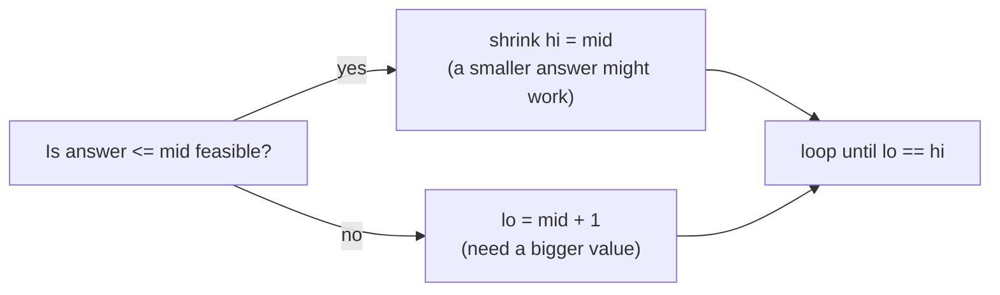

Binary search is simple in concept and notoriously easy to get subtly wrong in practice. The fix is to memorise one exact template per use case rather than reinventing the loop bounds each time — interviewers notice when the boundary handling is automatic.

## The template that avoids off-by-one and overflow

```java
// Exact-value search: O(log n) time, O(1) space
public int binarySearch(int[] nums, int target) {
    int lo = 0, hi = nums.length - 1;
    while (lo <= hi) {
        int mid = lo + (hi - lo) / 2;   // avoids overflow vs (lo + hi) / 2
        if (nums[mid] == target) return mid;
        if (nums[mid] < target) lo = mid + 1;
        else hi = mid - 1;
    }
    return -1;
}
```

> [!WARNING]
> `mid = (lo + hi) / 2` can overflow in languages with fixed-width integers when `lo` and `hi` are both large — `lo + (hi - lo) / 2` never adds two large numbers together, so it cannot overflow. In Java, `int` overflow wraps silently instead of throwing, making this bug very easy to miss in testing.

Write this iteratively, not recursively. A recursive version reads slightly cleaner but costs `O(log n)` stack space for no benefit — the iterative form is `O(1)` space and is what every production binary search implementation uses.

Java's standard library also ships `Arrays.binarySearch(int[], key)` and `Collections.binarySearch(list, key)`. Their return contract is Java-specific and worth stating: on a hit they return the matching index, but on a **miss** they return `-(insertionPoint) - 1` — a negative value that encodes where the key *would* be inserted to keep the array sorted. Recover that position with `insertionPoint = -result - 1`; never assume a plain `-1` means "not found". They also require the input to be sorted, and give an unspecified index if there are duplicate keys.

## Lower bound / upper bound semantics

Most real binary-search problems are not "find this exact value" but "find the boundary of a region" — these use a **half-open** `[lo, hi)` template instead, which is what makes lower/upper bound clean.

```java
// Lower bound: first index i where nums[i] >= target — O(log n)
public int lowerBound(int[] nums, int target) {
    int lo = 0, hi = nums.length;
    while (lo < hi) {
        int mid = lo + (hi - lo) / 2;
        if (nums[mid] < target) lo = mid + 1;
        else hi = mid;
    }
    return lo;
}

// Upper bound: first index i where nums[i] > target — O(log n)
public int upperBound(int[] nums, int target) {
    int lo = 0, hi = nums.length;
    while (lo < hi) {
        int mid = lo + (hi - lo) / 2;
        if (nums[mid] <= target) lo = mid + 1;
        else hi = mid;
    }
    return lo;
}
```

| Function | Returns | `count(target)` formula |
|---|---|---|
| `lowerBound` | first index `>= target` | `upperBound(target) - lowerBound(target)` |
| `upperBound` | first index `> target` | — |

> [!KEY]
> The `[lo, hi)` half-open template with `while (lo < hi)` and `hi = mid` (never `mid - 1`) is the one template to memorise for **every** "find the boundary" problem — rotated arrays, peaks, and binary-search-on-answer all reduce to it.

## Search in a rotated sorted array

At every step, at least one half of `[lo, mid]` or `[mid, hi]` is guaranteed sorted — identify which half is sorted, then check whether the target lies inside that half's range.

```java
// O(log n) time, O(1) space
public int searchRotated(int[] nums, int target) {
    int lo = 0, hi = nums.length - 1;
    while (lo <= hi) {
        int mid = lo + (hi - lo) / 2;
        if (nums[mid] == target) return mid;
        if (nums[lo] <= nums[mid]) {              // left half is sorted
            if (nums[lo] <= target && target < nums[mid]) hi = mid - 1;
            else lo = mid + 1;
        } else {                                  // right half is sorted
            if (nums[mid] < target && target <= nums[hi]) lo = mid + 1;
            else hi = mid - 1;
        }
    }
    return -1;
}
```

A close relative asks only for the **minimum** of the rotation, not a specific target — that needs just the half-open template compared against the rightmost element, since the minimum is exactly the rotation's pivot point:

```java
// O(log n) time, O(1) space — the pivot is the only element smaller than nums[hi]
public int findMinRotated(int[] nums) {
    int lo = 0, hi = nums.length - 1;
    while (lo < hi) {
        int mid = lo + (hi - lo) / 2;
        if (nums[mid] > nums[hi]) lo = mid + 1;  // pivot is to the right of mid
        else hi = mid;                           // mid could be the pivot itself
    }
    return nums[lo];
}
```

## Find a peak element


A peak is any element greater than both neighbours. Binary search works because comparing `nums[mid]` to `nums[mid+1]` always tells you which direction has *a* peak — the slope points toward one.

```java
// O(log n) time, O(1) space
public int findPeak(int[] nums) {
    int lo = 0, hi = nums.length - 1;
    while (lo < hi) {
        int mid = lo + (hi - lo) / 2;
        if (nums[mid] < nums[mid + 1]) lo = mid + 1;   // climb toward the higher side
        else hi = mid;
    }
    return lo;
}
```

## Binary search on the answer

This is the pattern that separates candidates who "know binary search" from those who can apply it. Instead of searching an array, search the **space of possible answers** for the smallest (or largest) value that satisfies a feasibility check.



```java
// Generic answer-space template: O(log(range) * cost of feasible)
int lo = minPossibleAnswer, hi = maxPossibleAnswer;
while (lo < hi) {
    int mid = lo + (hi - lo) / 2;
    if (feasible(mid)) hi = mid;     // mid works, try smaller
    else lo = mid + 1;               // mid doesn't work, need bigger
}
return lo;
```

The three textbook examples all share this shape:

| Problem | What "mid" represents | Feasibility check |
|---|---|---|
| Koko eating bananas | Bananas eaten per hour | Can Koko finish all piles within `h` hours at this speed? |
| Ship packages within D days | Ship capacity | Can all packages ship within `D` days at this capacity? |
| Split array, minimise the largest sum | Max allowed subarray sum | Can the array be split into `<= k` parts, each `<= mid`? |

```java
// Koko Eating Bananas — O(n log(max(piles))) time, O(1) space
public int minEatingSpeed(int[] piles, int h) {
    int lo = 1, hi = Arrays.stream(piles).max().getAsInt();
    while (lo < hi) {
        int mid = lo + (hi - lo) / 2;
        long hoursNeeded = Arrays.stream(piles).mapToLong(p -> (long) Math.ceil((double) p / mid)).sum();
        if (hoursNeeded <= h) hi = mid; else lo = mid + 1;
    }
    return lo;
}
```

> [!TIP]
> The sentence that signals you've recognised this pattern: *"The answer space — bananas per hour, ship capacity, max subarray sum — is monotonic: if capacity X works, every capacity greater than X also works. That monotonicity is what makes binary search on the answer valid, even though we're not searching an array."*

## Predicate monotonicity — the actual requirement

Binary search only works when the feasibility predicate is monotonic across the search space: `false, false, ..., false, true, true, ..., true` (or the reverse). If the predicate is not monotonic, binary search will silently converge on the wrong boundary without any runtime error.

| Search shape | Monotonic condition required |
|---|---|
| Exact value in sorted array | Array is sorted |
| Lower/upper bound | Array is sorted |
| Rotated sorted array | Array is a rotation of a sorted array (at most one break) |
| Binary search on answer | "Is this candidate value feasible?" is monotonic in the candidate |

> [!DANGER]
> Binary search on an array that merely "looks roughly sorted" or has more than one rotation point produces wrong answers with no crash — always verify the monotonicity assumption before reaching for binary search, especially on custom predicates.

## Search in a 2-D matrix

If a matrix is sorted row-wise and the first element of each row is greater than the last element of the previous row, treat it as one flattened sorted array and binary search with index math.

```java
// O(log(rows * cols)) time, O(1) space
public boolean searchMatrix(int[][] matrix, int target) {
    int rows = matrix.length, cols = matrix[0].length;
    int lo = 0, hi = rows * cols - 1;
    while (lo <= hi) {
        int mid = lo + (hi - lo) / 2;
        int val = matrix[mid / cols][mid % cols];
        if (val == target) return true;
        if (val < target) lo = mid + 1; else hi = mid - 1;
    }
    return false;
}
```

If rows are sorted but *not* guaranteed contiguous across row boundaries (each row and column individually sorted, but rows can overlap in value range), the flattening trick breaks — instead start from the top-right corner and eliminate a row or column each step, `O(rows + cols)`.

## Cheat sheet

- `mid = lo + (hi - lo) / 2` — never `(lo + hi) / 2`, to dodge overflow.
- Exact-value search: closed range `[lo, hi]`, loop `while (lo <= hi)`.
- Lower/upper bound and answer-space search: half-open `[lo, hi)`, loop `while (lo < hi)`, always `hi = mid` (never `mid - 1`) on the "keep" branch.
- `count(target) = upperBound(target) - lowerBound(target)`.
- Rotated array: identify which half is sorted first, then check if target falls in that half's range; finding just the minimum compares `nums[mid]` against `nums[hi]` instead.
- Peak finding: move toward the neighbour with the larger value.
- Binary search on the answer requires a **monotonic feasibility predicate** — state this out loud.
- 2-D matrix fully sorted row-major: flatten with `mid / cols`, `mid % cols`.
- Complexity is `O(log n)` for the search itself; on-answer variants add the cost of the feasibility check per step.

## Common mistakes

| Mistake | Fix |
|---|---|
| `mid = (lo + hi) / 2` | Use `lo + (hi - lo) / 2` to avoid overflow |
| Mixing closed `[lo, hi]` and half-open `[lo, hi)` conventions in the same function | Pick one convention per function and keep the loop condition and update consistent with it |
| Using `hi = mid - 1` in a lower-bound search | Use `hi = mid` — `mid` might itself be the answer, don't discard it |
| Applying binary search to an unsorted or non-monotonic predicate | Verify sortedness/monotonicity first; binary search fails silently otherwise |
| Off-by-one when converting a flattened index back to row/col | `row = mid / cols`, `col = mid % cols` |
| Forgetting integer overflow in the feasibility check itself (e.g. summing large piles) | Use `long` accumulators inside the predicate when values can be large |

## Summary

Binary search is one idea — repeatedly halve a monotonic search space — expressed through two templates: a closed-range template for exact-value lookup, and a half-open template for boundaries, rotated arrays, peaks, and searching directly over a space of candidate answers. The skill interviewers are testing is not "can you write a while loop", it's whether you can identify the monotonic property that makes the halving valid in the first place, and whether your loop bounds and update rules are exactly correct without needing to trace through examples to convince yourself.

## Top Interview Questions

### Q1. Why do we compute mid as lo + (hi - lo) / 2 instead of (lo + hi) / 2?

`(lo + hi) / 2` can overflow when both `lo` and `hi` are large positive integers close to the type's maximum value, because their sum can exceed the maximum representable value before the division happens. `lo + (hi - lo) / 2` avoids this because `hi - lo` is bounded by the size of the search range (usually much smaller than either bound individually), so the intermediate values stay well within range. In Java, `int` overflow wraps around silently by default rather than throwing, so this bug produces a wrong answer or infinite loop instead of a crash, making it easy to miss until it hits production with a large enough array.

### Q2. What is the difference between lower bound and upper bound, and how do you compute the count of a target value using both?

Lower bound returns the first index where `nums[i] >= target` — the leftmost valid insertion point. Upper bound returns the first index where `nums[i] > target` — the position just past the last occurrence of target. Both use the half-open `[lo, hi)` template with `while (lo < hi)`. The count of occurrences of `target` in a sorted array is then `upperBound(target) - lowerBound(target)`, computed in `O(log n)` total — two binary searches instead of a linear scan through every occurrence.

### Q3. How do you binary search in a rotated sorted array, and what's the key insight?

At every step, compare `nums[lo]` to `nums[mid]`: if `nums[lo] <= nums[mid]`, the left half `[lo, mid]` is guaranteed sorted (no rotation point inside it); otherwise the right half `[mid, hi]` is guaranteed sorted. Once you know which half is sorted, check whether `target` falls within that half's value range using simple comparisons — if it does, search that half, otherwise search the other half. This preserves `O(log n)` because exactly one half is always fully ordered, so you can always make a definite decision about where the target could be, even though the array as a whole is not fully sorted.

### Q4. How does binary search find a peak element, and why does it work without the array being fully sorted?

Compare `nums[mid]` to `nums[mid + 1]`. If `nums[mid] < nums[mid + 1]`, the sequence is still climbing at `mid`, so a peak must exist somewhere in `[mid + 1, hi]` — move `lo = mid + 1`. Otherwise, `nums[mid] >= nums[mid + 1]`, so `mid` itself could be a peak or the peak is to its left — move `hi = mid`. This works without full sortedness because the only property needed is that `nums[i-1] < nums[i]` implies a peak exists to the right of `i-1` and `nums[i] > nums[i+1]` implies one exists at or to the left of `i` — a strictly local, not global, monotonic guarantee, using the array boundaries as implicit `-infinity` neighbours.

### Q5. Explain "binary search on the answer" with the Koko Eating Bananas problem, and state its complexity.

Instead of searching an array, you search the space of possible eating speeds, `1` to `max(piles)`. For a candidate speed `mid`, compute the total hours needed to eat all piles at that speed (`ceil(pile / mid)` summed over all piles) — this is the feasibility check. The key insight is that this feasibility is monotonic: if speed `mid` finishes within `h` hours, any faster speed also finishes in time, and any slower speed might not. Binary search over the speed range, shrinking toward the smallest feasible speed. This is `O(n log(max(piles)))` — `O(log(max(piles)))` iterations, each doing an `O(n)` feasibility pass over all piles.

### Q6. What is the general template for "binary search on the answer" problems, and what must you verify before applying it?

The template searches `[minPossibleAnswer, maxPossibleAnswer)` with the half-open convention: at each `mid`, run a feasibility check `feasible(mid)`; if true, shrink `hi = mid` (a smaller answer might still work); if false, `lo = mid + 1` (need a larger value). The loop ends with `lo == hi` holding the smallest feasible value. Before applying it, you must verify the feasibility predicate is **monotonic** across the answer space — once a value becomes feasible, every larger (or smaller, depending on direction) value must remain feasible. Without that guarantee, binary search converges to an arbitrary, possibly wrong, boundary with no error raised.

### Q7. Debugging scenario: your lower-bound binary search is stuck in an infinite loop. What's the likely bug?

The most common cause is writing `hi = mid - 1` in the "keep searching to the left" branch of a half-open `[lo, hi)` template — this is a closed-range idiom leaking into a half-open loop. In the half-open template, `mid` itself might be a valid answer, so the correct update is `hi = mid`, never `mid - 1`; using `mid - 1` in a `while (lo < hi)` loop can cause `lo` and `hi` to converge incorrectly or, if `mid == lo`, to never advance `hi` past `lo` correctly, sometimes leaving the loop condition permanently true. The fix is to keep the two templates (closed-range with `<=` and `mid ± 1`, versus half-open with `<` and `hi = mid`) strictly separate and never mix their update rules.

### Q8. How would you search for a target in a fully sorted 2-D matrix (each row sorted, and the first element of each row greater than the last element of the previous row)?

Treat the matrix as a single flattened sorted array of size `rows * cols` without actually copying it — binary search over the index range `[0, rows*cols - 1]`, and for each `mid`, convert it back to `matrix[mid / cols][mid % cols]` to read the value. This works because the row-major layout guarantees the flattened order is fully sorted end to end. This gives `O(log(rows * cols))` time and `O(1)` space. If the matrix is only sorted per-row and per-column but rows can overlap in value range (a weaker guarantee), this flattening trick is invalid — instead start from the top-right corner and eliminate a row or column per comparison, giving `O(rows + cols)`.

### Q9. Split Array Largest Sum: how would you use binary search on the answer to minimise the largest subarray sum when splitting into k parts?

Binary search over candidate values for "the largest subarray sum", ranging from `max(nums)` (can't split any element further) to `sum(nums)` (the whole array as one part). For a candidate `mid`, greedily walk through the array accumulating a running subarray sum, starting a new subarray whenever adding the next element would exceed `mid`; count how many subarrays this requires. If that count is `<= k`, `mid` is feasible (shrink `hi = mid`); otherwise it's infeasible (`lo = mid + 1`). This is `O(n log(sum(nums)))` — `O(n)` per feasibility check, `O(log(sum))` iterations — versus an exponential brute-force partition search.

### Q10. In a production system, when would you use binary search on a live, changing dataset, and what has to be true for it to remain correct?

Binary search over a live dataset — say, finding the first log entry at or after a given timestamp in an append-only log — remains correct as long as the underlying ordering property (timestamps strictly non-decreasing) holds and you either snapshot the length/bounds before searching or ensure appends only happen after the current search range (never insertions in the middle, which would shift indices mid-search). In practice, systems like time-series databases and log stores rely on this exact guarantee — data is append-only and sorted by time — to support efficient range queries; if out-of-order writes or backfills can occur, you need an index structure (like a B-tree) rather than raw binary search over an array, since the sortedness assumption would otherwise silently break.

### Q11. What's the difference between binary search's O(log n) claim and what you actually pay in an "on the answer" variant?

Plain binary search on a sorted array does `O(log n)` total work because each comparison is `O(1)`. In "binary search on the answer" problems, each iteration's feasibility check itself often costs more than `O(1)` — for example, `O(n)` to simulate whether a given capacity ships all packages within D days. The total cost is then `O(log(range) * cost of feasibility check)`, e.g. `O(n log(sum(nums)))` for Split Array Largest Sum. It's important to state this compound cost explicitly rather than just saying "O(log n)" — interviewers specifically listen for whether you account for the feasibility check's own cost.

### Q12. Why does binary search require the search space to be monotonic, and what's a concrete example of it failing silently on non-monotonic data?

Binary search's core logic — "if mid doesn't satisfy the condition, the answer must be entirely on one side" — is only valid if satisfying the condition is a single contiguous region of the search space (all false then all true, or vice versa). If you binary search for a target in an array that is only partially sorted or has multiple "rotation" breaks (e.g., sorted then unsorted then sorted again in an unpredictable pattern), the algorithm will still terminate and return *some* index without any error, but that index may not be correct — because discarding a whole half based on one comparison assumes that half is uniformly consistent, which no longer holds. The defensive habit is to explicitly state and, where possible, verify the monotonicity assumption before applying binary search, rather than trusting that "it's basically sorted" is good enough.
