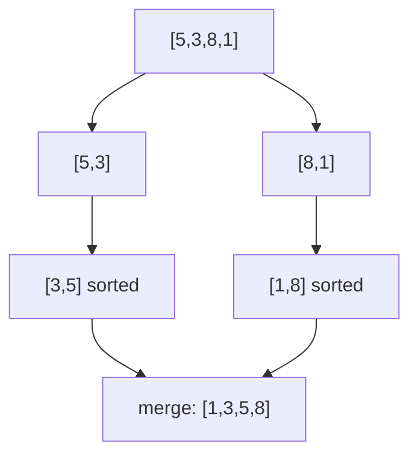

You will rarely implement a sort from scratch in an interview, but you will be asked to pick the right one, explain stability and worst case, and reason about why `Arrays.sort` on a primitive array and on an object array behave differently. This page is the reference table plus the handful of algorithms worth being able to write from memory.

## The comparison table

| Algorithm | Best | Average | Worst | Space | Stable? | In-place? | Use case |
|---|---|---|---|---|---|---|---|
| Bubble sort | `O(n)` | `O(n²)` | `O(n²)` | `O(1)` | ✅ | ✅ | Teaching only |
| Insertion sort | `O(n)` | `O(n²)` | `O(n²)` | `O(1)` | ✅ | ✅ | Small or nearly-sorted input |
| Selection sort | `O(n²)` | `O(n²)` | `O(n²)` | `O(1)` | ❌ | ✅ | Minimising number of swaps |
| Merge sort | `O(n log n)` | `O(n log n)` | `O(n log n)` | `O(n)` | ✅ | ❌ | Stability required, linked lists, external sort |
| Quicksort | `O(n log n)` | `O(n log n)` | `O(n²)` | `O(log n)` | ❌ | ✅ | General purpose, best average constant factor |
| Heapsort | `O(n log n)` | `O(n log n)` | `O(n log n)` | `O(1)` | ❌ | ✅ | Guaranteed `O(n log n)`, `O(1)` space |
| Counting sort | `O(n + k)` | `O(n + k)` | `O(n + k)` | `O(k)` | ✅ | ❌ | Small integer range k |
| Bucket sort | `O(n + k)` | `O(n + k)` | `O(n²)` | `O(n + k)` | ✅ | ❌ | Uniformly distributed values across a known range |
| Radix sort | `O(nk)` | `O(nk)` | `O(nk)` | `O(n + k)` | ✅ | ❌ | Fixed-width integers/strings, k = digit count |

> [!KEY]
> Comparison-based sorting has a proven lower bound of `Ω(n log n)` — you cannot beat it without exploiting structure in the data (like a bounded integer range, which is what counting and radix sort exploit).

## Insertion sort: the small-input specialist

Insertion sort builds the sorted portion one element at a time, shifting larger elements right until it finds the new element's correct slot — exactly how you'd sort a hand of playing cards.

```java
// O(n) best (already sorted), O(n^2) average/worst, O(1) space, stable
public void insertionSort(int[] arr) {
    for (int i = 1; i < arr.length; i++) {
        int key = arr[i];
        int j = i - 1;
        while (j >= 0 && arr[j] > key) {
            arr[j + 1] = arr[j];
            j--;
        }
        arr[j + 1] = key;
    }
}
```

Its worst case is `O(n²)`, the same as bubble and selection sort, but its best case — an already-sorted or nearly-sorted array — is `O(n)`, because the inner `while` loop never fires. That adaptive behaviour, a tiny constant factor, and good cache locality on small arrays are exactly why Java's dual-pivot quicksort and timsort both fall back to insertion sort once a partition or run shrinks below a small threshold (a few dozen elements): below that size, `O(n²)` with a small constant beats `O(n log n)` with a larger one.

## Quicksort: partitioning and worst case

Quicksort picks a pivot, partitions the array so everything smaller is left of it and everything larger is right, then recurses on both sides.

```java
// Average O(n log n), worst O(n^2), O(log n) space for the recursion stack
public void quickSort(int[] arr, int lo, int hi) {
    if (lo >= hi) return;
    int p = partition(arr, lo, hi);
    quickSort(arr, lo, p - 1);
    quickSort(arr, p + 1, hi);
}

private int partition(int[] arr, int lo, int hi) {
    int pivot = arr[hi];
    int i = lo;
    for (int j = lo; j < hi; j++)
        if (arr[j] <= pivot)
            swap(arr, i++, j);
    swap(arr, i, hi);
    return i;
}

private void swap(int[] arr, int a, int b) {
    int tmp = arr[a];
    arr[a] = arr[b];
    arr[b] = tmp;
}
```

The worst case `O(n²)` happens when the pivot is consistently the smallest or largest element — e.g. always picking the last element on an already-sorted or reverse-sorted array, producing maximally unbalanced partitions. **Randomising the pivot** (or using median-of-three) makes this worst case astronomically unlikely on any real input, which is why production quicksorts always randomise or otherwise defend the pivot choice.

> [!DANGER]
> A quicksort that always picks `arr[hi]` (or `arr[lo]`) as the pivot with no randomisation is a classic interview trap on sorted input — an already-sorted array triggers the exact `O(n²)` worst case, defeating the entire point of using quicksort.

## Merge sort and stability

Merge sort splits the array in half, recursively sorts both halves, then merges them back in linear time.



Its recurrence `T(n) = 2T(n/2) + O(n)` gives `O(n log n)` in **every** case — best, average, and worst — because the split is always balanced regardless of input order, unlike quicksort. It is naturally **stable**: during the merge step, if two elements are equal, always take from the left half first, preserving their original relative order. This is why merge sort is the default choice whenever stability is a requirement — for example, sorting rows by a secondary key after already sorting by a primary key.

## How real libraries actually sort

No production language uses a textbook single algorithm — they hybridise for real-world performance.

| Library | Algorithm family | Why |
|---|---|---|
| Java `Arrays.sort` (primitives: `int[]`, `long[]`, …) | Dual-pivot quicksort (with insertion sort for small ranges) | No stability requirement for primitives, so quicksort's speed wins |
| Java `Arrays.sort` (objects) / `Collections.sort` / `List.sort` | Timsort (a merge sort variant that detects and exploits already-sorted runs) | Objects are compared by a key where ties should keep their order, so stability is required; real data is often partially sorted, and timsort is near-linear on such input |
| Java `Stream.sorted()` | Timsort (stable) | An ordered stream's `sorted()` is documented to be stable, so it delegates to the same object sort |
| C++ `std::sort` | Introspective sort (quicksort, falls back to heapsort if recursion gets too deep, insertion sort for small partitions) | Combines quicksort's average-case speed with heapsort's worst-case guarantee, with no stability promise |

**Introsort** (introspective sort) is the pattern worth naming: start with quicksort, but track recursion depth — if it exceeds roughly `2 log n`, switch to heapsort to guarantee `O(n log n)` worst case, and switch to insertion sort once a partition shrinks below a small threshold (commonly 16 elements), since insertion sort has a lower constant factor for tiny inputs. It is what C++'s `std::sort` uses; Java's primitive sort takes a related but different route — dual-pivot quicksort with an insertion-sort fallback — and does **not** add a heapsort depth guard, so a carefully crafted adversarial input can in theory still force `O(n²)`.

**Timsort** is the other name worth knowing, and it is exactly what Java uses to sort objects (and `Collections.sort`/`List.sort`): it scans for naturally occurring ascending or descending runs in the input, extends and merges them, and falls back to insertion sort for short runs — giving `O(n)` on already-sorted or mostly-sorted data and `O(n log n)` worst case, while remaining stable.

## Non-comparison sorts: counting and bucket

Counting sort and radix sort escape the `Ω(n log n)` comparison lower bound (see Q12) by never comparing two elements directly — they use the values themselves to place elements.

```java
// O(n + k) time and space, k = value range, stable
public int[] countingSort(int[] arr, int maxValue) {
    int[] count = new int[maxValue + 1];
    for (int x : arr) count[x]++;
    for (int i = 1; i <= maxValue; i++) count[i] += count[i - 1]; // prefix sum → final position

    int[] output = new int[arr.length];
    for (int i = arr.length - 1; i >= 0; i--) { // right-to-left keeps it stable
        output[count[arr[i]] - 1] = arr[i];
        count[arr[i]]--;
    }
    return output;
}
```

**Bucket sort** takes a different approach, suited to uniformly distributed values (including floats): scatter elements into `k` buckets by value range, sort each small bucket with insertion sort, then concatenate the buckets in order. With `n` elements spread evenly across `n` buckets, each bucket holds `O(1)` elements on average, giving `O(n)` expected time — but a skewed distribution that dumps everything into one bucket degrades to `O(n²)`, since you are then just running insertion sort on the whole array.

| Sort | Escapes Ω(n log n) how | Degrades when |
|---|---|---|
| Counting sort | Indexes directly by value | Value range `k` is much larger than `n` |
| Bucket sort | Buckets by value range, sorts each small bucket | Values cluster into a few buckets |
| Radix sort | Repeated stable counting sort per digit | Keys have many digits/characters |

## Sorting with custom comparators in Java

```java
// Sort by length, then alphabetically — using a comparator
List<String> words = new ArrayList<>(List.of("pear", "fig", "apple", "kiwi"));
words.sort(Comparator.comparingInt(String::length).thenComparing(Comparator.naturalOrder()));

// Stream, stable, readable multi-key sort into a new list
List<String> sorted = words.stream()
    .sorted(Comparator.comparingInt(String::length).thenComparing(Comparator.naturalOrder()))
    .toList();
```

> [!TIP]
> `Arrays.sort(int[])` on primitives is **not stable** (it's dual-pivot quicksort under the hood); `Arrays.sort(Object[])`, `Collections.sort`, `List.sort`, and `Stream.sorted` **are stable** (TimSort). If a follow-up asks "does this preserve the original order of equal elements", the correct answer depends on whether you sorted primitives or objects — know this cold.

## Quickselect for the kth largest

Quickselect reuses quicksort's partition step but recurses into only **one** side, since it only needs to locate a single rank rather than sort everything.

```java
// Average O(n), worst O(n^2) — same partition logic as quicksort
public int findKthLargest(int[] nums, int k) {
    int target = nums.length - k;   // convert "kth largest" to a 0-indexed position from the smallest
    int lo = 0, hi = nums.length - 1;
    while (true) {
        int p = partition(nums, lo, hi);
        if (p == target) return nums[p];
        if (p < target) lo = p + 1; else hi = p - 1;
    }
}
```

| Approach | Time | Space | When to use |
|---|---|---|---|
| Full sort, then index | `O(n log n)` | `O(log n)`–`O(n)` | Need the whole order, not just one rank |
| Min-heap of size k | `O(n log k)` | `O(k)` | Streaming data, k is small relative to n |
| Quickselect | `O(n)` average, `O(n²)` worst | `O(1)`–`O(log n)` | One-shot kth-order-statistic query on an in-memory array |

## External sorting, briefly

When data does not fit in memory, sort it in chunks: read a chunk that fits in RAM, sort it in-place, write it to disk as a sorted "run", then **k-way merge** all the sorted runs using a min-heap that holds one element from each run at a time. This is the same divide-and-conquer idea as merge sort, just with disk I/O as the bottleneck instead of comparisons — it is how databases sort tables larger than available memory, and worth mentioning if asked to sort a dataset that doesn't fit in RAM.

## Cheat sheet

- Comparison sorts cannot beat `Ω(n log n)` worst case; counting/radix sort escape this by not comparing elements.
- Merge sort: `O(n log n)` guaranteed in every case, stable, needs `O(n)` extra space — the safe default when stability matters.
- Quicksort: fastest average case, `O(log n)` space, but `O(n²)` worst case on an adversarial or already-sorted input unless the pivot is randomised.
- Heapsort: `O(n log n)` guaranteed, `O(1)` space, not stable — the choice when memory is tight and stability doesn't matter.
- Counting sort: `O(n + k)`, only viable when the key range `k` is small relative to `n`.
- Bucket sort: `O(n)` expected on uniformly distributed data, degrades to `O(n²)` if values cluster into few buckets.
- Real libraries hybridise: introsort (quicksort → heapsort → insertion sort) and timsort (merge sort exploiting existing runs).
- `Arrays.sort` on primitives is not stable (dual-pivot quicksort); `Arrays.sort` on objects, `Collections.sort`, `List.sort`, and `Stream.sorted` are stable (TimSort).
- Quickselect finds the kth order statistic in `O(n)` average without fully sorting.
- External sort = sort in chunks that fit in memory, then k-way merge the sorted runs from disk.

## Common mistakes

| Mistake | Fix |
|---|---|
| Picking `arr[lo]` or `arr[hi]` as the quicksort pivot with no randomisation | Randomise the pivot or use median-of-three to defend against adversarial/sorted input |
| Assuming `Arrays.sort` is always stable in Java | It is not for primitive arrays (dual-pivot quicksort) — sort boxed objects, or use `Collections.sort`/`List.sort` (TimSort), when stability matters |
| Using counting sort on a huge or unbounded value range | Only viable when `k` (the range) is comparable to `n`; otherwise it wastes memory and time |
| Claiming quicksort is "always O(n log n)" | It's `O(n log n)` average, `O(n²)` worst case — always mention both |
| Fully sorting an array just to find the kth largest element | Use quickselect (`O(n)` average) or a size-k heap (`O(n log k)`) instead |
| Forgetting merge sort needs `O(n)` auxiliary space | State this trade-off explicitly against quicksort's `O(log n)` |

## Summary

Every sorting algorithm trades among time, space, and stability, and the "right" one depends on which constraint matters most: merge sort for guaranteed `O(n log n)` and stability, quicksort for the best average-case constant factor, heapsort when memory is tight, and counting/radix sort when the key range is small enough to skip comparisons entirely. Production libraries don't pick one — they hybridise, which is why naming dual-pivot quicksort (Java's primitive sort) and timsort (Java's object sort) signals real depth. When the question narrows to "just the kth element", quickselect answers it in linear average time without paying for a full sort.

## Top Interview Questions

### Q1. Compare merge sort and quicksort. When would you choose one over the other?

Both are `O(n log n)` on average, but merge sort guarantees `O(n log n)` in the worst case at the cost of `O(n)` auxiliary space, while quicksort runs in-place with `O(log n)` space but degrades to `O(n²)` on an adversarial or already-sorted pivot choice. Merge sort is stable; standard in-place quicksort is not. Choose merge sort when you need a stability guarantee (e.g., sorting by a secondary key after a primary key) or a hard worst-case bound (e.g., real-time systems), and when `O(n)` extra memory is acceptable. Choose quicksort when memory is constrained and average-case performance with a randomised pivot is good enough — which is most general-purpose in-memory sorting.

### Q2. Why does quicksort degrade to O(n²), and how do real implementations defend against it?

Quicksort's cost recurrence depends on how balanced each partition is. If the chosen pivot is always the smallest or largest remaining element — which happens on an already-sorted or reverse-sorted array when you naively pick the first or last element as pivot — every partition splits into a size-0 and a size-(n-1) piece, giving `n` recursive levels each doing `O(n)` work, for `O(n²)` total. Real implementations defend against this by randomising the pivot choice or using median-of-three (comparing the first, middle, and last elements), which makes an adversarial worst-case input astronomically unlikely rather than a predictable, easily-triggered edge case.

### Q3. What does "stable" mean for a sorting algorithm, and give a concrete example of why it matters?

A stable sort preserves the relative order of elements that compare as equal. It matters whenever you sort by one key and need a previous ordering (by a different key) preserved as a tiebreaker — for example, sorting a list of orders by customer name after they were already sorted by timestamp: a stable sort keeps orders from the same customer in their original chronological order, while an unstable sort could shuffle them. Merge sort, insertion sort, bubble sort, counting sort, and radix sort are stable; heapsort, selection sort, and standard in-place quicksort are not.

### Q4. Why does Java use a different sorting algorithm for primitive arrays versus object arrays?

`Arrays.sort(int[])` and the other primitive overloads use a **dual-pivot quicksort**: excellent average-case speed, in-place with `O(log n)` stack space, falling back to insertion sort on small ranges — but not stable, and `O(n²)` on an adversarial input in theory. `Arrays.sort(Object[])`, and therefore `Collections.sort` and `List.sort`, use **TimSort**: a stable, adaptive merge sort variant with a guaranteed `O(n log n)` worst case that costs `O(n)` extra space. The split exists because primitives carry no identity beyond their value, so stability is meaningless and raw speed wins; objects, by contrast, are frequently sorted by a key where two "equal" elements must keep their input order (a secondary-key sort), so a stable sort is required and the extra space TimSort needs is an acceptable trade. Naming this primitive-vs-object distinction is exactly the depth an interviewer is listening for.

### Q5. What is timsort, and why do Python and Java use it for sorting general objects?

Timsort is a hybrid of merge sort and insertion sort designed around the observation that real-world data is often already partially sorted. It scans the input for naturally occurring ascending or descending runs, extends short runs using insertion sort up to a minimum run length, and then merges runs together using a merge-sort-style merge step, with heuristics to merge runs of similar size for balance. This gives `O(n)` performance on already-sorted or nearly-sorted input (a huge real-world win) and `O(n log n)` worst case, while remaining stable — which matters for sorting objects by a key where ties should preserve insertion order, a guarantee Python's `sorted()` and Java's `Arrays.sort` for objects both make.

### Q6. Is `Arrays.sort` stable in Java, and does it depend on the element type?

Yes — it depends entirely on the element type. `Arrays.sort` on a **primitive** array (`int[]`, `double[]`, …) is **not** stable: it uses a dual-pivot quicksort, and since equal primitives are indistinguishable, the JDK makes no ordering promise for them. `Arrays.sort` on an **object** array (`T[]`), together with `Collections.sort`, `List.sort`, and `Stream.sorted`, **is** stable: all delegate to TimSort, which is documented to preserve the relative order of elements that compare equal. This is a common gotcha — moving a key-based sort from a primitive array to a boxed/object array (or the reverse) can silently change whether ties keep their original order, which breaks code that relies on an earlier sort as a tiebreaker.

### Q7. When would you use counting sort or radix sort instead of a comparison-based sort?

Use counting sort when the values to sort are integers within a small, known range `k` that is comparable to or smaller than `n` — it runs in `O(n + k)` by counting occurrences of each value and reconstructing the sorted array directly, entirely bypassing comparisons, so it beats the `Ω(n log n)` lower bound that applies to comparison sorts. Use radix sort when keys are fixed-width integers or strings with a larger range but bounded digit/character count `d` — it sorts digit by digit (typically least-significant first) using a stable counting sort as the subroutine, running in `O(d·(n + base))`. Neither is appropriate for arbitrary floating-point values, unbounded-range integers, or complex custom-comparator objects.

### Q8. Debugging scenario: your quicksort implementation runs correctly on random input but times out on already-sorted input of the same size. What's wrong and how do you fix it?

This is the textbook quicksort worst-case trigger: the pivot selection (commonly `arr[hi]` or `arr[lo]`) always picks an extreme value on sorted input, producing maximally unbalanced partitions and `O(n²)` behaviour instead of the expected `O(n log n)`. The fix is to randomise the pivot choice (swap a randomly chosen element into the pivot position before partitioning) or use median-of-three pivot selection, either of which makes the already-sorted case behave like a typical random case rather than the adversarial worst case. This is exactly the failure mode that motivates randomised or median-of-three pivots, and the depth-limited fallback to heapsort used by introsort-style library sorts; Java's primitive sort instead relies on a dual-pivot scheme that is much harder to force into the worst case.

### Q9. How would you find the kth largest element in an array without fully sorting it, and what's the complexity?

Use quickselect: run the same partition step as quicksort, but after partitioning around a pivot, only recurse into the side that contains the target rank (converted to a 0-indexed position from the smallest, e.g. `n - k` for the kth largest), discarding the other side entirely. This gives `O(n)` average time, since the total work across recursive calls forms a geometric series that sums to `O(n)`, though it degrades to `O(n²)` worst case without a randomised pivot, same as quicksort. An alternative with a hard worst-case bound is a min-heap of size k: push each element, popping the smallest whenever the heap exceeds size k — `O(n log k)` time, `O(k)` space, useful when data streams in rather than sitting in an array upfront.

### Q10. What's your approach to sorting a dataset that is far larger than available memory?

Use external sorting: split the data into chunks that fit comfortably in RAM, sort each chunk in memory with a standard algorithm (typically an efficient in-memory sort like quicksort or timsort), and write each sorted chunk to disk as a "run". Then perform a k-way merge across all runs using a min-heap holding one candidate element from each run at a time, repeatedly popping the smallest and refilling from its source run, writing the merged output sequentially to disk. This is the same divide-and-conquer principle as merge sort, but with disk I/O — sequential reads/writes rather than random access — as the dominant cost, which is exactly how production databases sort tables that exceed available memory.

### Q11. How would you sort a list of custom objects by multiple keys in Java, and does the result preserve original order for full ties?

Build a chained comparator with `Comparator.comparing(primaryKey).thenComparing(secondaryKey)` (use `.reversed()` or `Comparator.comparing(key, Comparator.reverseOrder())` for a descending key) and pass it to `list.sort(cmp)` or `Collections.sort(list, cmp)` — this composes comparators without hand-writing a multi-field `Comparator`. Because `List.sort`/`Collections.sort` are backed by a stable TimSort, any elements still tied after every specified key is compared retain their original relative order from the input list, so — unlike an unstable sort — you do **not** need to append an explicit original-index tiebreaker to get deterministic output. The one place you would lose that guarantee is sorting a *primitive* array by a derived key, since primitive `Arrays.sort` (dual-pivot quicksort) is not stable — a reason to sort the objects directly, or box into an object array, whenever tie order matters.

### Q12. Why is Ω(n log n) considered a proven lower bound for comparison-based sorting, and how do counting/radix sort get around it?

Any comparison-based sort can be modeled as a decision tree where each internal node is a comparison and each leaf is one possible output permutation; there are `n!` possible orderings of `n` distinct elements, so the tree needs at least `n!` leaves, and a binary tree with `n!` leaves must have depth at least `log₂(n!) = Ω(n log n)` by Stirling's approximation — meaning any comparison-based algorithm must make at least that many comparisons in the worst case. Counting sort and radix sort escape this bound because they never compare elements to each other at all; they use the *values themselves* as array indices (counting sort) or process fixed-width digits directly (radix sort), which is only possible because they exploit extra structure — a small, known key range — that general comparison-based sorting cannot assume.
