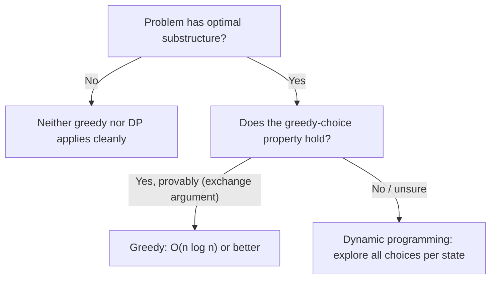

A greedy algorithm builds a solution one locally-best choice at a time, never reconsidering earlier decisions. That is either the fastest possible solution to a problem, or a subtly wrong one — the entire skill is knowing which, and proving it before you commit to the approach out loud.

## What makes a greedy choice safe

Two properties must both hold for a greedy strategy to be provably correct, not just "seems to work on the examples".

| Property | Meaning |
|---|---|
| Greedy-choice property | A locally optimal choice at each step leads to a globally optimal solution — you never need to revisit it |
| Optimal substructure | An optimal solution to the whole problem contains optimal solutions to its subproblems |

Optimal substructure alone is not enough — dynamic programming problems have it too, but still require exploring multiple choices per state because the locally-best choice isn't always globally safe. Greedy additionally requires that **committing early never closes off the true optimum**.



> [!KEY]
> "It passed the examples I tried" is not a proof. The interview-safe way to justify greedy is the **exchange argument**: assume an optimal solution does *not* make the greedy choice, then show you can swap it in without making the solution worse — therefore some optimal solution always includes the greedy choice.

## The exchange argument, concretely

Take activity/interval scheduling: pick the maximum number of non-overlapping intervals from a set. The greedy rule is "always pick the interval that finishes earliest among those still compatible."

**Proof sketch:** suppose an optimal solution's first pick is some interval `X` that does not finish earliest; let `E` be the interval that actually finishes earliest. Since `E` finishes no later than `X`, replacing `X` with `E` cannot conflict with anything `X`'s slot allowed and leaves at least as much room for everything after — so swapping `X` for `E` produces another optimal solution that *does* start with the greedy choice. By induction, the greedy strategy is optimal at every step.

```java
// O(n log n) time (dominated by the sort), O(1) extra space
public int maxNonOverlapping(int[][] intervals) {
    Arrays.sort(intervals, (a, b) -> Integer.compare(a[1], b[1]));   // sort by end time
    int count = 0, lastEnd = Integer.MIN_VALUE;
    for (int[] iv : intervals) {
        if (iv[0] >= lastEnd) {    // starts after (or when) the last pick ended
            count++;
            lastEnd = iv[1];
        }
    }
    return count;
}
```

> [!TIP]
> Sorting by **end** time, not start time, is the detail that makes this greedy choice correct — sorting by start time and picking greedily produces wrong answers on inputs with one long interval blocking several short ones.

## Jump game

Can you reach the last index, given each element is the max jump length from that position? Greedily track the farthest index reachable so far; if the current index ever exceeds that, you're stuck.

```java
// O(n) time, O(1) space
public boolean canJump(int[] nums) {
    int farthest = 0;
    for (int i = 0; i < nums.length; i++) {
        if (i > farthest) return false;              // stuck before reaching i
        farthest = Math.max(farthest, i + nums[i]);
    }
    return farthest >= nums.length - 1;
}
```

The greedy-choice property here is straightforward: the farthest reachable index only ever grows by considering every index you can already reach, so tracking the single running maximum loses no information relevant to reachability.

## Gas station

Given gas and cost arrays around a circular route, find the starting station that lets you complete the whole circuit, or determine none exists.

```java
// O(n) time, O(1) space
public int canCompleteCircuit(int[] gas, int[] cost) {
    int totalSurplus = 0, runningSurplus = 0, start = 0;
    for (int i = 0; i < gas.length; i++) {
        int diff = gas[i] - cost[i];
        totalSurplus += diff;
        runningSurplus += diff;
        if (runningSurplus < 0) {    // can't reach i+1 starting from `start`
            start = i + 1;           // no station between start and i can work either
            runningSurplus = 0;
        }
    }
    return totalSurplus >= 0 ? start : -1;
}
```

> [!WARNING]
> The subtle greedy-choice proof here: if the running surplus goes negative between `start` and some index `i`, no station strictly between them could have been a valid start either — any such station would inherit a smaller or equal surplus by the time it reached `i`, since it skips some of the positive contributions `start` had. This is the part interviewers actually want to hear, not just the final formula.

## Task scheduler

Given tasks (each an uppercase letter) and a cooldown `n` between two instances of the *same* task, find the minimum total time (including idle slots) to run them all.

```java
// O(n_tasks + 26) time, O(1) space (bounded alphabet)
public int leastInterval(char[] tasks, int n) {
    int[] freq = new int[26];
    for (char t : tasks) freq[t - 'A']++;
    int maxFreq = Arrays.stream(freq).max().getAsInt();
    long maxCount = Arrays.stream(freq).filter(f -> f == maxFreq).count();   // how many tasks tie for most frequent
    // The most frequent task defines (maxFreq - 1) full cooldown blocks of size (n + 1),
    // plus maxCount tasks in the final block; never fewer slots than the raw task count.
    return Math.max(tasks.length, (maxFreq - 1) * (n + 1) + (int) maxCount);
}
```

The greedy idea: always schedule the currently most-frequent remaining task first (conceptually — a max-heap simulation gives the same answer), so no idle slot is ever wasted while a schedulable task exists. The closed-form above is the compressed result of that simulation.

## Coin change: where greedy fails

Greedy works for change-making with the **US coin system** (1, 5, 10, 25) — always take the largest coin `≤` remaining amount. It silently fails for arbitrary denominations.

| Denominations | Target | Greedy picks | Greedy coin count | Optimal | Optimal coin count |
|---|---|---|---|---|---|
| {1, 5, 10, 25} | 30 | 25 + 5 | 2 | 25 + 5 | 2 ✅ |
| {1, 3, 4} | 6 | 4 + 1 + 1 | 3 | 3 + 3 | 2 ❌ greedy loses |

```java
// Greedy — fast, but WRONG for arbitrary denominations
public int greedyCoinCount(int[] coins, int amount) {   // coins sorted descending
    int count = 0;
    for (int c : coins) {
        count += amount / c;
        amount %= c;
    }
    return amount == 0 ? count : -1;    // "-1" here is itself unreliable for non-canonical coin sets
}
```

> [!DANGER]
> Coin change is the textbook counterexample to "greedy always works if it looks obviously right." With coins `{1, 3, 4}` and target `6`, greedy takes `4 + 1 + 1` (3 coins) while the optimum is `3 + 3` (2 coins). The correct general solution is dynamic programming: `dp[amount] = min(dp[amount - coin] + 1)` over all coins, `O(amount * numCoins)` time.

## Greedy vs dynamic programming decision guidance

| Signal | Lean toward |
|---|---|
| You can state and defend an exchange argument for the local choice | Greedy |
| Counterexample exists where the "obvious" local choice isn't globally optimal | DP |
| Problem asks for min/max count over **arbitrary** weights/denominations/costs | DP (unless the specific weight system is proven canonical, like standard currency) |
| Problem is about intervals/scheduling with a single sort key deciding everything | Greedy |
| Subproblems overlap and the choice at one step affects which choices are *available*, not just their cost, at future steps in a way that isn't monotonic | DP |
| You need to explore "what if I hadn't taken the greedy choice" to be sure | DP |

A good habit before committing to greedy in an interview is to try constructing a small counterexample yourself. If you can't build one after a genuine attempt, that failed attempt *is* the informal justification — pair it with a one-sentence exchange argument and move on.

## Cheat sheet

- Greedy needs **both** optimal substructure and the greedy-choice property — optimal substructure alone just means "DP might work".
- Justify greedy with an exchange argument: show any optimal solution can be modified to include the greedy choice without getting worse.
- Interval scheduling (max count of non-overlapping): sort by **end** time, greedily keep the earliest finisher.
- Jump Game: track the single running farthest-reachable index; if `i` ever exceeds it, fail.
- Gas Station: if running surplus goes negative, restart from the very next index — no station in between could have worked.
- Task Scheduler: `max(tasks.length, (maxFreq - 1) * (n + 1) + maxCount)`.
- Coin change fails greedily for arbitrary denominations — `{1,3,4}` targeting `6` is the canonical counterexample.
- If you can construct a counterexample to the "obvious" greedy rule, the problem needs DP instead.
- Greedy is almost always faster (`O(n log n)` or `O(n)`) than the DP alternative when it applies — that's the whole reason to prefer it when correctness holds.

## Common mistakes

| Mistake | Fix |
|---|---|
| Assuming a greedy solution is correct because it passed sample test cases | Construct an exchange argument, or actively try to build a counterexample first |
| Sorting interval-scheduling problems by start time instead of end time | Sort by **end** time when maximising the count of non-overlapping intervals |
| Applying greedy coin-change logic to arbitrary denominations | Use DP (`dp[amount] = min over coins`) unless the denomination set is proven canonical |
| Treating "optimal substructure" as sufficient justification for greedy | It is necessary but not sufficient — the greedy-choice property must also be proven |
| Forgetting the gas-station restart rule discards all intermediate stations, not just the failing one | Restart exactly at `i + 1` and reset the running surplus to 0 |
| Recomputing task scheduler via full simulation when a closed-form formula exists | Use the frequency-based formula for `O(n + 26)` instead of a heap simulation, unless the exact schedule (not just its length) is required |

## Summary

Greedy algorithms commit to the locally best choice at every step and never look back, which is fast whenever it's correct and wrong in ways that don't show up on casual testing when it isn't. The two-part test — optimal substructure plus a provable greedy-choice property, ideally via an exchange argument — is what separates interval scheduling, jump game, and gas station (all genuinely greedy) from coin change with arbitrary denominations (which needs dynamic programming despite "looking" greedy). When in doubt, try to construct a counterexample to your own greedy rule before presenting it as the answer.

## Top Interview Questions

### Q1. What two properties must a problem have for a greedy algorithm to be correct?

Optimal substructure — an optimal solution to the whole problem is built from optimal solutions to its subproblems — and the greedy-choice property, meaning a locally optimal choice made at the current step is guaranteed to be part of some globally optimal solution, so you never need to reconsider it later. Optimal substructure alone is necessary but not sufficient; dynamic programming problems also have optimal substructure but require exploring multiple choices per state because the "obviously best" local choice isn't always globally safe. The greedy-choice property is the stronger, extra condition that lets you commit immediately without backtracking.

### Q2. What is an exchange argument, and how would you use one to justify a greedy interval-scheduling algorithm?

An exchange argument proves a greedy choice is safe by assuming an optimal solution doesn't make that choice, then showing you can swap the greedy choice in without making the solution any worse — which means some optimal solution always includes it. For interval scheduling (maximise the count of non-overlapping intervals), assume an optimal solution's first interval is `X`, which doesn't finish earliest; let `E` be the interval that does finish earliest among valid candidates. Since `E` ends no later than `X`, replacing `X` with `E` cannot conflict with anything `X` allowed and leaves at least as much room for subsequent picks — so swapping produces another equally optimal solution that starts with the greedy choice, proving the greedy rule by induction.

### Q3. Why does the interval scheduling greedy algorithm sort by end time rather than start time?

Sorting by end time and always picking the earliest-finishing compatible interval maximises the room left over for future picks, because the interval that frees up the timeline soonest can never be a worse choice than a later-finishing alternative — this is exactly what the exchange argument proves. Sorting by start time and picking greedily fails: a very early-starting but very long interval would be picked first and could block out several short, non-overlapping intervals that together would have produced a strictly better count. Start-time sorting is correct for a *different* problem — merging overlapping intervals — but not for maximising the count of non-overlapping ones.

### Q4. Walk through the greedy proof behind the Gas Station problem.

Track a running "surplus" (gas minus cost) as you go around the circuit once from a candidate start. If the running surplus ever goes negative at some index `i`, the current candidate start cannot complete the circuit — but crucially, neither can *any* station strictly between the current start and `i`, because such a station would have inherited a smaller or equal cumulative surplus by the time it reached `i` (it missed out on whatever positive surplus came before it from the original start). So you can safely skip all of them and restart the search at `i + 1` with the surplus reset to zero, without ever needing to re-check the skipped stations individually. A solution exists at all only if the total surplus across the whole circuit is non-negative.

### Q5. Give the closed-form solution for Task Scheduler and explain the greedy idea behind it.

Count the frequency of each task; let `maxFreq` be the highest frequency and `maxCount` be how many distinct tasks tie for that highest frequency. The answer is `max(totalTasks, (maxFreq - 1) * (n + 1) + maxCount)`. The greedy idea is to always schedule the currently most-frequent remaining task next whenever legally possible (its cooldown has expired), which never wastes an idle slot unnecessarily — this is equivalent to laying out `(maxFreq - 1)` "blocks" of size `(n + 1)` around the most frequent task(s), with the final partial block holding all tasks tied for `maxFreq`, and everything else able to fill idle gaps; if there are enough other distinct tasks, no idle time is needed at all, which is why the formula takes a `max` against the raw task count.

### Q6. Why does greedy fail for coin change with arbitrary denominations, and what's the standard counterexample?

Greedy always picks the largest denomination that fits, but this only produces the true minimum coin count for "canonical" coin systems (like standard currency: 1, 5, 10, 25) where a mathematical property guarantees the greedy choice never blocks a better combination. With denominations `{1, 3, 4}` and a target of `6`, greedy takes the largest fitting coin repeatedly: `4`, then `1`, then `1`, totalling 3 coins, while the true optimum is `3 + 3`, only 2 coins. The failure happens because taking the large coin `4` leaves a remainder (`2`) that cannot be efficiently completed, whereas a different, locally "worse" first choice (`3`) leaves a remainder that can. This is why general coin change requires dynamic programming: `dp[amount] = 1 + min(dp[amount - coin])` over all coins, evaluated bottom-up.

### Q7. How would you decide, in an interview, whether a new problem you haven't seen before needs greedy or dynamic programming?

First check for optimal substructure — can the problem be broken into subproblems whose optimal solutions combine into the overall optimum? If not, neither approach cleanly applies. If yes, actively try to construct a counterexample to the "obvious" greedy rule for a few minutes: pick small, deliberately adversarial inputs (skewed weights, unusual denominations, one very large item among small ones) and check whether the greedy choice still wins. If you can't find a counterexample after a genuine attempt, sketch an exchange argument and go with greedy for the better complexity. If you find even one counterexample, the problem needs DP, which explores all choices per subproblem state rather than committing early.

### Q8. Debugging scenario: your Jump Game solution returns false for an input where a valid path clearly exists. What's the likely bug?

The most common bug is checking `i > farthest` at the wrong point relative to updating `farthest`, or initialising `farthest` incorrectly (it should start at `0`, representing "we can currently stand at index 0"). If the check `if (i > farthest) return false;` happens *after* updating `farthest` for the current index instead of before, you might incorrectly allow index `i` to update `farthest` even though you could never have legitimately reached `i` in the first place, silently propagating an invalid reach forward. The fix is to check reachability of the *current* index first, using the farthest value computed from all *previous* indices, and only then extend `farthest` using the current index's jump length.

### Q9. Can Task Scheduler's answer ever be smaller than the total number of tasks? Why does the formula account for this?

No — you can never finish executing all tasks in less time than the number of tasks itself, since each task occupies at least one time unit, even if there's no idle time at all between any of them (which happens when there are enough distinct tasks to fill every cooldown gap). The formula `(maxFreq - 1) * (n + 1) + maxCount` computes the schedule length assuming idle slots *might* be needed around the most frequent task, but if there are enough other distinct tasks to fill those gaps, the actual required time collapses down to just `totalTasks` — potentially smaller than the formula's raw value in cases with few repeats. Taking `max(totalTasks, formula)` correctly picks whichever bound is actually binding.

### Q10. In a production job-scheduling system, when would a greedy heuristic be an acceptable substitute for an exact optimal (possibly DP-based) algorithm?

When the exact optimal algorithm's complexity (say, `O(n * capacity)` for a DP-based knapsack-style scheduler) is too slow for the real-time or near-real-time latency budget the system needs, and a greedy heuristic (e.g., "always run the shortest job next" or "always run the job closest to its deadline") produces a result that is provably within a bounded factor of optimal, or empirically good enough on production workloads, it's a reasonable engineering trade-off — as long as you can quantify how far from optimal it can get in the worst case and that gap is acceptable for the business (e.g., resource utilisation within 5% of optimal in exchange for millisecond instead of second-scale scheduling decisions). This is a common real trade-off in build systems, CPU schedulers, and cloud resource allocators, where "fast and provably close enough" often beats "exactly optimal but too slow to compute at the required scale."

### Q11. Is Dijkstra's algorithm a greedy algorithm? How does that relate to why it fails with negative edge weights?

Yes — Dijkstra's greedily finalises the shortest known distance to whichever unvisited node currently has the smallest tentative distance, on the assumption that once a node is finalised, no future relaxation could ever produce a shorter path to it (because all remaining edges only add non-negative weight). That assumption is exactly the greedy-choice property for this problem, and it depends entirely on edge weights being non-negative: a negative edge encountered later could still shorten a path to an already-finalised node, silently violating the greedy commitment and producing an incorrect shortest-distance result. This is why negative weights require Bellman-Ford (which repeatedly relaxes all edges rather than committing early) instead.

### Q12. How would you prove or disprove that a greedy strategy for a brand-new interval-based problem (say, "minimum number of platforms needed for arriving/departing trains") is correct?

Attempt an exchange argument first: hypothesise the natural greedy rule (e.g., process events in time order, incrementing a counter on arrival and decrementing on departure, tracking the maximum concurrent count), and check whether any alternative ordering of ties or any alternative choice could ever produce a better (smaller) result — if the quantity being tracked is a pure function of a chronological sweep and doesn't depend on which specific train occupies which specific platform, the greedy count is trivially optimal, since it's really just a running maximum of concurrent overlaps, not a scheduling decision with multiple valid strategies. If instead the problem asks you to also assign trains to specific platforms optimally under some additional constraint (say, minimising platform changes), that added constraint may break the simple greedy count argument and require a more careful proof or a different algorithm (e.g., a matching or DP-based approach).
