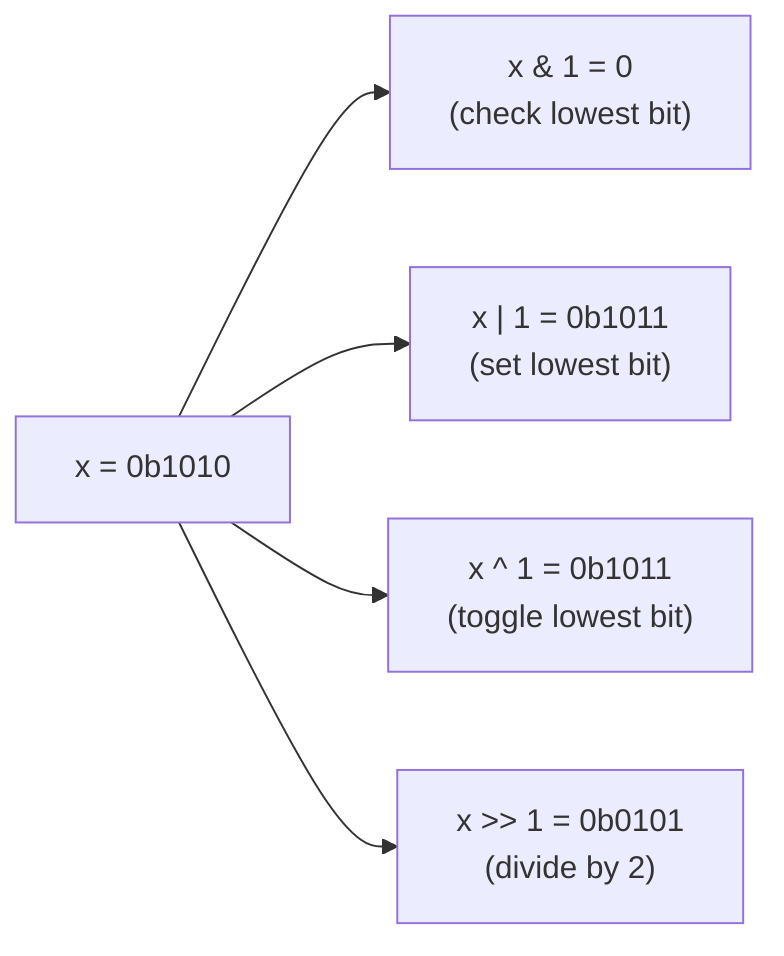

Bit manipulation questions are less about cleverness and more about recognising a small set of idioms — check a bit, isolate the lowest set bit, use XOR to cancel duplicates. Once memorised, they turn into some of the fastest, cleanest solutions you can write in an interview.

## The five operators

| Operator | Symbol | Effect |
|---|---|---|
| AND | `&` | 1 only where both bits are 1 — used to test or clear bits |
| OR | `\|` | 1 where either bit is 1 — used to set bits |
| XOR | `^` | 1 where bits differ — used to toggle bits and cancel duplicates |
| NOT | `~` | Flips every bit | 
| Shift | `<<`, `>>` | Moves bits left/right — equivalent to multiply/divide by powers of 2 |



> [!KEY]
> Every bit trick below is built from just three ideas: `1 << k` produces a mask with only bit `k` set, `&` reads or clears against that mask, and `|`/`^` write against it.

## Common idioms

| Goal | Expression | Notes |
|---|---|---|
| Check bit `k` | `(x >> k) & 1` | Returns `0` or `1` |
| Set bit `k` | `x \| (1 << k)` | Idempotent — safe to call twice |
| Clear bit `k` | `x & ~(1 << k)` | `~(1 << k)` has every bit set except `k` |
| Toggle bit `k` | `x ^ (1 << k)` | Flips just that bit |
| Lowest set bit (isolated) | `x & -x` | Relies on two's complement; see below |
| Clear lowest set bit | `x & (x - 1)` | Used to count set bits in `O(popcount)` iterations |
| Check power of two | `x > 0 && (x & (x - 1)) == 0` | A power of two has exactly one set bit |
| Count set bits | `Integer.bitCount(x)` | Built-in in Java; avoid hand-rolled loops when available |

```java
// Count set bits by repeatedly clearing the lowest one — O(number of set bits)
public int popCount(int x) {
    int count = 0;
    while (x != 0) {
        x &= (x - 1);   // clears the lowest set bit
        count++;
    }
    return count;
}
```

> [!TIP]
> `x & -x` isolates the lowest set bit because `-x` in two's complement is `~x + 1`: every bit below the lowest set bit becomes `0`, the lowest set bit itself stays `1` (since it was `0` in `~x` and the `+1` carries up to it), and everything above flips. ANDing with the original `x` keeps only that one bit.

## XOR properties and single-number problems

XOR is its own inverse: `a ^ a = 0` and `a ^ 0 = a`. It is also commutative and associative, so the order of XOR-ing a list doesn't matter — every value that appears an **even** number of times cancels out.

| Property | Statement |
|---|---|
| Self-inverse | `x ^ x = 0` |
| Identity | `x ^ 0 = x` |
| Commutative/associative | Order of XOR operations doesn't matter |
| Swap without a temp | `a ^= b; b ^= a; a ^= b;` |

```java
// Every number appears twice except one — find the one that appears once
// O(n) time, O(1) space — pairs cancel via XOR
public int singleNumber(int[] nums) {
    int result = 0;
    for (int x : nums) result ^= x;
    return result;
}
```

> [!WARNING]
> The plain XOR trick only works when **exactly one** element is unpaired. If two elements are each unpaired ("single number III"), split the XOR of all elements at a differing bit to separate the two into distinct groups, then XOR each group independently. If elements can appear three times except one, XOR alone fails entirely — you need per-bit counting mod 3 instead.

## Subsets via bitmask

Any subset of an `n`-element set maps to an integer from `0` to `2ⁿ - 1`, where bit `k` says "is element `k` included". This turns "generate all subsets" into a simple loop instead of recursive backtracking.

```java
// Generate all 2^n subsets — O(2^n * n) time, O(n) per subset
for (int mask = 0; mask < (1 << n); mask++) {
    List<Integer> subset = new ArrayList<>();
    for (int i = 0; i < n; i++)
        if ((mask & (1 << i)) != 0)
            subset.add(nums[i]);
    // process subset
}
```

| Task | Bitmask technique |
|---|---|
| Enumerate all subsets | Loop `mask` from `0` to `2ⁿ - 1` |
| Enumerate subsets of a specific mask `m` | `for (int s = m; s > 0; s = (s - 1) & m)` — classic "submask enumeration" |
| Check if set `A` is a subset of `B` | `(A & B) == A` |
| Union / intersection of sets | `A \| B` / `A & B` |
| Remove element `k` from set | `A & ~(1 << k)` |

## Two's complement and signed shift pitfalls

Negative integers are stored in two's complement: flip all bits and add 1. This is why `-x == ~x + 1` and why `x & -x` works for isolating the lowest set bit — but it also creates two shift pitfalls that are easy to get wrong in Java.

| Pitfall | Explanation |
|---|---|
| `>>` on a negative `int` is an **arithmetic** shift | Sign-extends — fills with `1`s from the left, keeping the number negative |
| `>>>` is the **unsigned** (logical) right shift | Fills with `0`s regardless of sign — needed when treating the value as a raw bit pattern; Java has no unsigned integer types, so `>>>` is the only way to get a logical shift |
| Left shift overflow | `1 << 31` overflows into the sign bit for a 32-bit `int`, producing `Integer.MIN_VALUE`, not an error; use `1L << k` for `k >= 31` |
| Shift amount `≥` width | `x << 32` on a 32-bit int is **undefined behaviour in C** but in Java the shift count is masked (`amount % 32` for `int`, `% 64` for `long`), so `1 << 32 == 1 << 0 == 1` |

```java
int x = -8;                        // 0xFFFFFFF8
System.out.println(x >> 1);        // -4  (arithmetic shift, sign-extended)
System.out.println(x >>> 1);       // 2147483644 (logical shift, zero-filled)
```

> [!DANGER]
> Using `>>` when you meant an unsigned/logical shift is a classic bug when packing flags into an `int` and treating it as a raw bitfield. If the value can be negative and you need a logical shift, use `>>>`, which fills with zeros regardless of sign — Java has no unsigned integer types to cast to.

## Bitmask DP intro

When `n` is small (roughly `≤ 20`) and the state needs to track "which subset of items has been used", represent that subset as an integer and index a DP table by it: `dp[mask]` or `dp[mask][last]`. This turns an exponential search into a memoised one, since there are only `2ⁿ` masks instead of `n!` orderings.

```java
// Minimum cost to visit all n cities starting at 0 (TSP outline)
// dp[mask][i] = min cost visiting exactly the cities in mask, ending at i
// Transition: dp[mask | (1 << j)][j] = min(existing, dp[mask][i] + cost[i][j])
```

See the dynamic programming patterns page for the full worked bitmask DP example — the key takeaway here is that bit operations (`mask | (1 << j)`, `mask & (1 << i)`) are exactly the vocabulary that bitmask DP is written in.

## Cheat sheet

- `1 << k` builds a mask with only bit `k` set — the basis of every other idiom.
- Check: `(x >> k) & 1`. Set: `x | (1 << k)`. Clear: `x & ~(1 << k)`. Toggle: `x ^ (1 << k)`.
- `x & -x` isolates the lowest set bit; `x & (x - 1)` clears it.
- XOR cancels pairs: use it for "find the element that appears once" problems.
- `A & B` = intersection, `A \| B` = union, `A & ~B` = difference, of two bitmask sets.
- `>>` on a negative `int` sign-extends; use `>>>` for a logical shift (Java has no unsigned types to cast to).
- `n ≤ ~20` and "track which items used" → reach for bitmask DP.
- Prefer `Integer.bitCount` / `Long.bitCount` over a hand-rolled counting loop when available.

## Common mistakes

| Mistake | Fix |
|---|---|
| Using `x & -x` without understanding two's complement | Know it relies on `-x == ~x + 1`; state this if asked to prove it |
| Assuming `>>` is a logical shift on signed integers | It's arithmetic (sign-extending) on `int`/`long`; use `>>>` for a logical shift |
| Forgetting XOR only cancels pairs, not triples | Different single-number variants need per-bit counting or grouping, not raw XOR |
| Off-by-one in `1 << k` when `k` is the bit *count* not index | Bit `k` is the `(k+1)`-th bit from the right; index from `0` |
| Iterating `2^n` subsets when `n` is large | Bitmask enumeration is only viable for roughly `n ≤ 20–22` |
| Not widening to `long` (`1L << k`) before shifting near the sign bit | `1 << 31` silently becomes `Integer.MIN_VALUE` instead of overflowing loudly |

## Summary

Bit manipulation interview questions draw from a short, reusable idiom list: masks built from `1 << k`, checked/set/cleared with `&`/`|`/`~`, toggled with `^`, and counted or isolated using `x & (x-1)` / `x & -x`. XOR's self-cancelling property solves an entire family of "find the odd one out" problems, and treating small sets as integer bitmasks turns subset enumeration and small-n DP into simple loops. The main trap is signed-shift behaviour — know the difference between arithmetic and logical shifts before it costs you a wrong answer on a negative input.

## Top Interview Questions

### Q1. How do you check, set, clear, and toggle a specific bit in an integer?

To check bit `k`, right-shift by `k` and AND with `1`: `(x >> k) & 1`, which isolates that bit as `0` or `1`. To set it, OR with a mask that has only that bit on: `x | (1 << k)` — this is idempotent, so calling it repeatedly is safe. To clear it, AND with the complement of that mask: `x & ~(1 << k)`, which leaves every other bit untouched and forces bit `k` to `0`. To toggle it, XOR with the same mask: `x ^ (1 << k)`, since XOR-ing a bit with `1` flips it while XOR-ing with `0` leaves it unchanged. All four are `O(1)` and form the base vocabulary every other bit trick builds on.

### Q2. Why does `x & -x` isolate the lowest set bit, and what does it rely on?

It relies on two's complement representation, where `-x` is computed as `~x + 1`. Flipping all bits of `x` turns every bit below the lowest set bit from `0` to `1`, and turns the lowest set bit itself from `1` to `0`. Adding `1` then causes a carry chain through all those newly-flipped `1`s, flipping them back to `0` and setting the former lowest-set-bit position back to `1` — everything above that position is inverted from the original. ANDing `x` with `-x` therefore leaves only the lowest set bit as `1` and clears everything else, in both directions. This trick is undefined for `x = 0`, which has no set bit.

### Q3. Given an array where every element appears twice except one, how do you find the unique one in O(n) time and O(1) space?

XOR every element together. Since `a ^ a = 0` and XOR is commutative and associative, every paired value cancels itself out regardless of order, leaving only the unpaired value XORed with `0`, which is itself. This is strictly better than a hash-set approach (`O(n)` time but `O(n)` space) because it needs no auxiliary storage at all — just a single accumulator variable, making it a favorite "know this trick" interview question.

### Q4. How would you extend the single-number trick if exactly two elements are unpaired instead of one?

First, XOR all numbers together — the result is `a ^ b` where `a` and `b` are the two unique numbers (all paired numbers cancel). Since `a != b`, this XOR is nonzero, so pick any set bit in it, say the lowest one (`diff & -diff`), which must differ between `a` and `b`. Partition all numbers into two groups based on whether that bit is set, and XOR each group independently — each group will contain exactly one of `a`/`b` plus pairs that cancel, isolating them. This is a strong follow-up question that tests whether you understand *why* the basic trick works, not just that it exists.

### Q5. What's the difference between `>>` and `>>>` in Java, and when does it matter?

`>>` is an **arithmetic** (signed) right shift: on a negative number it fills the vacated high bits with `1`s, preserving the sign, so `-8 >> 1 == -4`. `>>>` is a **logical** (unsigned) right shift: it always fills with `0`s regardless of sign, treating the value as a raw bit pattern, so `(-8) >>> 1` produces a large positive number. Because Java has no unsigned integer types, `>>>` is the *only* way to do a zero-filled shift. This matters whenever you're manipulating bit flags or hashes stored in a signed type and need to shift without sign-extension — using `>>` there silently corrupts the bit pattern for negative values, a bug that's easy to miss because it compiles cleanly and only misbehaves on specific inputs.

### Q6. How do you check if a number is a power of two using bit tricks, and why does it work?

`x > 0 && (x & (x - 1)) == 0`. A power of two has exactly one bit set (e.g., `8 = 0b1000`). Subtracting `1` flips that single set bit to `0` and every bit below it to `1` (e.g., `7 = 0b0111`), so ANDing the two produces `0` if and only if there was exactly one set bit to begin with. The `x > 0` guard is necessary because `0` would otherwise incorrectly pass (`0 & -1 == 0`), and it also excludes negative numbers where the bit pattern doesn't represent a power of two in the mathematical sense.

### Q7. How would you enumerate all subsets of a set of n elements using bitmasks, and what's the complexity?

Loop an integer `mask` from `0` to `2ⁿ - 1`; each bit position `k` set in `mask` means element `k` is included in that subset. For each mask, iterate the `n` bits to build the actual subset (or process it bit-by-bit without materializing it, depending on the task). This is `O(2ⁿ · n)` time overall — `2ⁿ` subsets, each taking `O(n)` to construct or inspect. It's the standard technique when `n` is small enough (`≤ ~20`) that `2ⁿ` is computationally feasible, replacing recursive backtracking with a flat loop that's easier to reason about and often faster in practice due to lower constant overhead.

### Q8. What is submask enumeration, and when would you use it?

Given a bitmask `m`, the idiom `for (int s = m; s > 0; s = (s - 1) & m)` (plus handling `s == 0` separately if needed) visits every submask of `m` exactly once, in decreasing numeric order. It works because `(s - 1) & m` computes the next lower submask by borrowing from the lowest set bit of `s` within the boundary of `m`'s bits. It's used in bitmask DP problems where a transition needs to consider "all ways to split the current set into two disjoint groups" — enumerating submasks of each mask across all masks is `O(3ⁿ)` total (a known identity), which is often fast enough for `n ≤ 20`.

### Q9. Your code does `1 << 31` in a 32-bit signed int context and gets a negative number — is that a bug?

Not necessarily a bug — it's expected behaviour. In a 32-bit signed `int`, bit 31 is the sign bit, so `1 << 31` produces `Integer.MIN_VALUE` (`-2147483648`), not an overflow exception, because Java integer arithmetic always wraps silently — there is no overflow-checking context, and if you want a throw-on-overflow you must call `Math.addExact`/`Math.multiplyExact` explicitly. This is often *intentional* when a bitmask deliberately needs to occupy the sign bit, but it's a common source of confusion when someone expects `1 << 31` to just be "a very large positive number" — if that's the intent, use a `long` and shift `1L << 31` (or up to `1L << 63`) instead.

### Q10. When would you reach for bitmask DP instead of a standard array-indexed DP?

When the state needs to represent "which specific subset of items has been chosen so far" — not just a count or an index — and the number of items `n` is small enough (typically `≤ 20`, sometimes up to ~22) that `2ⁿ` states are tractable, but too large for a purely combinatorial/polynomial DP to express directly. Classic cases: traveling salesman on a small city count, assigning `n` tasks to `n` workers minimizing cost, or "can these items be partitioned into k groups with equal sum" where remembering exactly which items were used (not just how many) affects future transitions.

### Q11. How would you count the number of set bits in an integer, and what's the fastest approach available in Java?

The manual approach repeatedly clears the lowest set bit with `x &= (x - 1)` and counts iterations, running in `O(popcount)` — faster than a naive `O(32)` bit-by-bit loop when the number has few set bits. In Java, `Integer.bitCount(int)` (and `Long.bitCount(long)`) is a hardware-intrinsic-backed built-in (the JIT lowers it to the POPCNT CPU instruction where available) and should be preferred in production code over any hand-rolled loop, since it is both faster and less error-prone; in an interview, mentioning the manual technique demonstrates understanding, but citing `Integer.bitCount` shows awareness of what the standard library already provides.

### Q12. Why does packing multiple boolean flags into a single int as a bitmask matter in production code, and what's the trade-off?

Packing flags into an `int`/`long` reduces memory from one field per boolean to a single shared integer, and lets you combine, check, and clear multiple flags with single bitwise operations instead of multiple field accesses — useful in high-throughput systems, serialized wire formats, or database columns where every byte matters. The trade-off is readability and type safety: raw bitmasks are harder to debug (a plain integer doesn't self-document which bits mean what) and easier to misuse (accidentally ORing flags from two different bitmask "namespaces"), so production code typically wraps them in an `enum` combined with an `EnumSet` (or named `static final int` masks) to get compiler-checked names while keeping the compact bitwise representation underneath.
