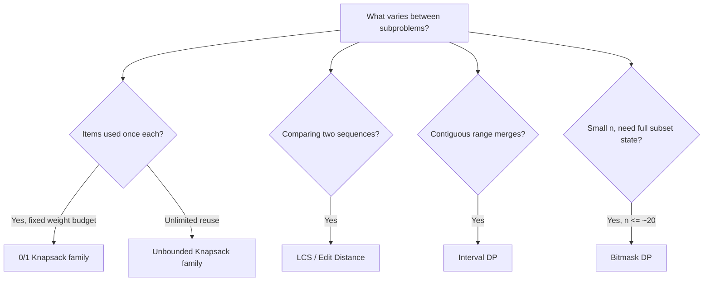

Most DP interview questions are a variation on a small number of well-known shapes. Recognising which shape you're looking at — not solving from scratch — is the actual skill being tested. This page is a lookup table: given a problem description, find the matching pattern, state and recurrence.

## How to use this catalogue

Read the problem for these signals: does an item get used once or unlimited times? Is order fixed (subsequence) or free (subset)? Is the answer over a contiguous range (interval) or a full assignment (bitmask)? Those questions narrow the field to one or two rows below.



> [!KEY]
> The recurrence almost always encodes a **choice**: take vs. skip, extend vs. start new, split at position `k`. Naming the choice out loud is 80% of deriving the recurrence correctly.

## Knapsack family

| Pattern | State | Recurrence | Notes |
|---|---|---|---|
| 0/1 knapsack | `dp[i][w]` = best value using first `i` items, capacity `w` | `dp[i][w] = max(dp[i-1][w], dp[i-1][w-wt[i]] + val[i])` | Each item used at most once; space-optimise by iterating `w` **backward** |
| Unbounded knapsack | `dp[w]` = best value with capacity `w` | `dp[w] = max(dp[w], dp[w-wt[i]] + val[i])` | Item reusable; iterate `w` **forward** |
| Subset sum | `dp[i][s]` = can first `i` items make sum `s` | `dp[i][s] = dp[i-1][s] \|\| dp[i-1][s-num[i]]` | Boolean version of 0/1 knapsack |
| Partition equal subset sum | Subset sum with `target = total / 2` | Same as subset sum | Reject immediately if `total` is odd |
| Coin change (min coins) | `dp[a]` = min coins to make amount `a` | `dp[a] = min(dp[a], dp[a-coin] + 1)` | Unbounded reuse of each coin |
| Coin change (count ways) | `dp[a]` = number of ways to make `a` | `dp[a] += dp[a-coin]` | Loop coins **outer**, amount inner, to avoid counting permutations as distinct |

```java
// 0/1 knapsack, space-optimised to O(W)
// Iterate w backwards so each item is only applied once per row
for (int i = 0; i < n; i++)
    for (int w = capacity; w >= weight[i]; w--)
        dp[w] = Math.max(dp[w], dp[w - weight[i]] + value[i]);
```

## Longest increasing subsequence (LIS)

| Version | State | Recurrence | Time |
|---|---|---|---|
| O(n²) | `dp[i]` = length of LIS ending at `i` | `dp[i] = max(dp[j] + 1)` for `j < i` where `nums[j] < nums[i]` | O(n²) |
| O(n log n) | `tails[k]` = smallest tail of an increasing subsequence of length `k+1` | Binary search `tails` for the first element `≥ nums[i]`, replace it (or append) | O(n log n) |

```java
// O(n log n) LIS length using binary search over "tails"
List<Integer> tails = new ArrayList<>();
for (int x : nums) {
    int lo = Collections.binarySearch(tails, x);
    if (lo < 0) lo = ~lo;             // insertion point (Java returns -(ip)-1 when absent)
    if (lo == tails.size()) tails.add(x);
    else tails.set(lo, x);
}
return tails.size();
```

> [!TIP]
> `tails` is not necessarily a *real* subsequence at the end — it only tracks the smallest possible tail for each length. That distinction trips people up when asked to also reconstruct the actual sequence, which needs a separate `parent[]` array alongside the O(n²) version.

## LCS and edit distance

| Pattern | State | Recurrence | Base case |
|---|---|---|---|
| Longest common subsequence | `dp[i][j]` = LCS length of `a[0..i)`, `b[0..j)` | If `a[i-1]==b[j-1]`: `dp[i-1][j-1]+1`, else `max(dp[i-1][j], dp[i][j-1])` | `dp[0][*] = dp[*][0] = 0` |
| Edit distance | `dp[i][j]` = min operations to convert `a[0..i)` to `b[0..j)` | If equal: `dp[i-1][j-1]`, else `1 + min(insert, delete, replace)` = `1 + min(dp[i][j-1], dp[i-1][j], dp[i-1][j-1])` | `dp[i][0]=i`, `dp[0][j]=j` |

Both are `O(m·n)` time, space-optimisable to `O(min(m, n))` since each row only needs the previous row.

## Palindromic substrings and subsequences

| Pattern | State | Recurrence | Fill order |
|---|---|---|---|
| Is `s[l..r]` a palindrome | `dp[l][r]` = boolean | `dp[l][r] = (s[l]==s[r]) && dp[l+1][r-1]` | Increasing length, or `l` from right to left, `r` left to right |
| Longest palindromic substring | Track max length while filling the table above | Same | Same |
| Longest palindromic subsequence | `dp[l][r]` = length | If `s[l]==s[r]`: `dp[l+1][r-1] + 2`, else `max(dp[l+1][r], dp[l][r-1])` | Same |

> [!WARNING]
> Palindrome DP fills **outward from short ranges to long ones** — `dp[l][r]` needs `dp[l+1][r-1]`, a *shorter* inner range, already computed. Filling row-by-row (as in a grid DP) computes cells in the wrong order and reads garbage.

## Grid paths

| Pattern | State | Recurrence |
|---|---|---|
| Unique paths | `dp[i][j]` = ways to reach `(i,j)` | `dp[i][j] = dp[i-1][j] + dp[i][j-1]` |
| Min path sum | `dp[i][j]` = min cost to reach `(i,j)` | `dp[i][j] = grid[i][j] + min(dp[i-1][j], dp[i][j-1])` |
| Paths with obstacles | Same as unique paths | Same, but `dp[i][j] = 0` if `grid[i][j]` is an obstacle |

Space-optimisable to `O(cols)` since row `i` only needs row `i - 1`.

## Interval DP

Interval DP answers "what's the best way to combine a contiguous range", where the recurrence **splits the range at every possible point `k`**.

| Pattern | State | Recurrence |
|---|---|---|
| Matrix chain multiplication | `dp[i][j]` = min cost to multiply matrices `i..j` | `dp[i][j] = min over k of dp[i][k] + dp[k+1][j] + cost(i,k,j)` |
| Burst balloons | `dp[i][j]` = max coins bursting all balloons strictly between `i` and `j` (last) | `dp[i][j] = max over k of dp[i][k] + dp[k][j] + nums[i]*nums[k]*nums[j]` |
| Palindrome partitioning (min cuts) | `dp[i]` = min cuts for `s[0..i)`, using an is-palindrome table | `dp[i] = min(dp[j] + 1)` for every `j < i` where `s[j..i)` is a palindrome |

> [!TIP]
> Interval DP always iterates by **increasing range length** — `for len in 2..n: for i in 0..n-len: j = i + len - 1` — because `dp[i][j]` depends on strictly shorter sub-ranges.

## State-machine DP: stock problems

Model "what state am I in right now" (holding a stock or not, how many transactions used) as extra dimensions, then transition between states each day.

```java
// Best time to buy/sell stock with at most 1 transaction — 2-state machine
// hold = max profit while holding a share, cash = max profit while not holding
int hold = Integer.MIN_VALUE, cash = 0;
for (int price : prices) {
    cash = Math.max(cash, hold + price);   // sell today
    hold = Math.max(hold, -price);         // buy today
}
return cash;
```

| Variant | Extra state dimension |
|---|---|
| Unlimited transactions | None beyond hold/cash |
| At most `k` transactions | Transaction count `0..k` |
| Cooldown after selling | A third "cooldown" state |
| Transaction fee | Subtract fee at sell transition |

## Tree DP and bitmask DP

**Tree DP** computes a value per subtree from its children's values, via post-order DFS — e.g. "maximum sum of a subset of tree nodes with no two adjacent" uses `dp[node] = (includeNode, excludeNode)`, combining children's `excludeNode` values when including the current node.

**Bitmask DP** represents "which subset of up to ~20 items has been used" as an integer, when `n` is too small for polynomial DP but too large for brute force enumeration.

| Pattern | State | Recurrence |
|---|---|---|
| House robber on a tree | `dp[node] = (best if included, best if excluded)` | `included = node.val + sum(child.excluded)`; `excluded = sum(max(child.included, child.excluded))` |
| Traveling salesman (small n) | `dp[mask][i]` = min cost visiting exactly `mask`, ending at `i` | `dp[mask][i] = min over j in mask of dp[mask \ {i}][j] + cost(j, i)` |
| Assign tasks to workers | `dp[mask]` = min cost assigning tasks in `mask` | `dp[mask] = min over last task t in mask of dp[mask \ {t}] + cost(worker[popcount(mask)-1], t)` |

```java
// Bitmask DP: TSP, n <= ~18
// dp[mask][i] = cheapest path visiting exactly the set "mask", ending at city i
// Java has no rectangular 2-D array; new int[1<<n][n] is an array of int[] rows
int[][] dp = new int[1 << n][n];
for (int m = 0; m < (1 << n); m++)
    for (int i = 0; i < n; i++)
        dp[m][i] = Integer.MAX_VALUE;
dp[1][0] = 0;                             // start at city 0
for (int mask = 1; mask < (1 << n); mask++)
    for (int i = 0; i < n; i++) {
        if ((mask & (1 << i)) == 0 || dp[mask][i] == Integer.MAX_VALUE) continue;
        for (int j = 0; j < n; j++) {
            if ((mask & (1 << j)) != 0) continue;
            int next = mask | (1 << j);
            dp[next][j] = Math.min(dp[next][j], dp[mask][i] + cost[i][j]);
        }
    }
```

## Pattern-to-state master table

| Problem shape | Signal words | State | Time |
|---|---|---|---|
| 0/1 knapsack | "each item once", "maximize value under weight" | `dp[i][w]` | `O(n·W)` |
| Unbounded knapsack | "unlimited supply", "minimum coins" | `dp[w]` | `O(n·W)` |
| LIS | "longest increasing subsequence" | `dp[i]` or `tails[]` | `O(n log n)` |
| LCS / edit distance | "two strings", "convert one to another" | `dp[i][j]` | `O(m·n)` |
| Palindrome | "palindromic substring/subsequence" | `dp[l][r]` | `O(n²)` |
| Grid path | "grid", "paths", "obstacles" | `dp[i][j]` | `O(rows·cols)` |
| Interval DP | "merge", "burst", "partition into segments" | `dp[i][j]` split at `k` | `O(n³)` |
| Stock/state machine | "buy/sell", "cooldown", "transaction fee" | few scalars per day | `O(n)` |
| Tree DP | "no two adjacent nodes", "subtree sum" | `dp[node] = (in, out)` | `O(n)` |
| Bitmask DP | "n ≤ 20", "assign", "visit all" | `dp[mask][i]` | `O(2ⁿ·n)` or `O(2ⁿ·n²)` |

## Cheat sheet

- **0/1 vs unbounded** is decided by iteration direction: backward = once each, forward = reusable.
- **LIS** has an `O(n log n)` version using binary search over `tails`; know it exists even if you default to `O(n²)`.
- **Interval DP always fills by increasing range length**, never row-by-row.
- **Palindrome DP** depends on the *shorter, inner* range — same ordering constraint as interval DP.
- **Bitmask DP** is the fallback when `n ≤ ~20` and the state needs "which items have been used".
- **Tree DP** carries a pair of values per node (include/exclude, or similar) combined at the parent.
- **State-machine DP** (stock problems) needs only a handful of scalars per step, not a full table.
- When stuck, ask: "does this look like knapsack, LIS, LCS, interval, or bitmask?" — one usually fits.

## Common mistakes

| Mistake | Fix |
|---|---|
| Filling interval DP row-by-row instead of by range length | Loop `len` from 2 to `n`, deriving `i, j` from it |
| Using 0/1 knapsack's forward loop for an unbounded problem | Forward reuses items; backward restricts to one use |
| Forgetting the `O(n log n)` LIS reconstructs a *length*, not the actual subsequence | Keep a parallel `parent[]` array if the sequence itself is needed |
| Mixing up edit distance's three operations | Insert/delete/replace map to `dp[i][j-1]`, `dp[i-1][j]`, `dp[i-1][j-1]` respectively |
| Applying bitmask DP when n > ~22 | `2ⁿ` explodes; look for a polynomial DP or greedy instead |
| Forgetting the odd-sum early exit in partition-equal-subset-sum | If `total` is odd, no equal partition can exist — return false immediately |

## Summary

The bulk of DP interview problems reduce to a handful of shapes: knapsack (item-selection under a budget), LIS/LCS (subsequence comparison), interval DP (optimal ways to combine a range), state-machine DP (a handful of running states per step), tree DP (post-order aggregation), and bitmask DP (small-n subset tracking). Spotting which shape a new problem matches — rather than deriving the recurrence from nothing — is what separates a fast, confident DP answer from a slow, uncertain one.

## Top Interview Questions

### Q1. How do you decide whether a problem is 0/1 knapsack or unbounded knapsack?

Check whether each item/element can be used more than once while building the answer. If items are consumed — "you have one of each coin/item and must choose to include or exclude it" — it's 0/1 knapsack, and the space-optimised 1-D version iterates the capacity dimension backward. If items can be reused arbitrarily many times — "unlimited coins of each denomination" — it's unbounded knapsack, and the same 1-D array is filled iterating capacity forward, since reading an already-updated-in-this-pass value is exactly what allows reuse.

### Q2. Explain the O(n log n) LIS algorithm — why does binary search work here?

Maintain an array `tails` where `tails[k]` is the smallest possible tail value of any increasing subsequence of length `k + 1` found so far. For each new number, binary search `tails` for the first entry `≥` the number; if found, replace it (a smaller tail for that length is always at least as good for future extensions), otherwise append it (a new longest length). This works because `tails` is always sorted — a smaller tail for a given length can never be worse for extending — so binary search validly finds the insertion point. Note that `tails` doesn't represent an actual subsequence, only the best possible tail per length; reconstructing the real sequence needs extra bookkeeping.

### Q3. What's the recurrence for edit distance, and how do the three operations map to it?

`dp[i][j]` is the minimum number of operations to convert the first `i` characters of one string into the first `j` characters of another. If the last characters match, `dp[i][j] = dp[i-1][j-1]` (no operation needed). Otherwise, `dp[i][j] = 1 + min(dp[i-1][j], dp[i][j-1], dp[i-1][j-1])`, where `dp[i-1][j]` corresponds to deleting a character from the first string, `dp[i][j-1]` corresponds to inserting a character to match, and `dp[i-1][j-1]` corresponds to replacing a character. Each of the three neighbouring cells represents exactly one edit operation, which is the detail worth stating explicitly to show you understand the recurrence rather than having memorised it.

### Q4. Why does interval DP need to iterate by increasing range length rather than by index?

Because `dp[i][j]`, representing the best way to combine the range from `i` to `j`, is computed as the best over all split points `k`, combining `dp[i][k]` and `dp[k+1][j]` — both of which are *strictly shorter* ranges than `[i, j]`. If you iterate `i` and `j` directly in nested loops without controlling range length, you can reach a state before its dependencies (shorter sub-ranges) are filled, reading uninitialised or stale values. Iterating by length — starting from ranges of length 1 or 2 and growing outward — guarantees every dependency is already resolved when needed.

### Q5. How would you approach a DP problem where n is up to 18 but the state involves "which items have been chosen"?

That's a strong signal for bitmask DP: represent the subset of chosen items as an integer bitmask (`2^18` ≈ 262,144 possible masks), and let the state be `dp[mask]` or `dp[mask][last]` if order/position also matters, like in the traveling salesman problem. Transitions iterate over which bit to add or remove next. This works specifically because `n` is small enough that `2ⁿ` is tractable but too large for a polynomial-only DP to capture "which specific subset" without enumerating combinations directly — bitmask DP effectively memoises across all `2ⁿ` subsets instead of re-deriving them.

### Q6. What's the difference between tree DP for "no two adjacent nodes" and the linked-list house robber problem?

The linked-list version only has two neighbours to consider (previous included or excluded), so it needs just two running scalars. The tree version needs `dp[node] = (bestIncludingNode, bestExcludingNode)` computed via post-order traversal, because a node has potentially many children, and "including this node" forces *all* children to be excluded, while "excluding this node" allows each child independently to be included or excluded (whichever is larger, summed across children). The key generalisation is that tree DP combines a per-node pair of values from multiple children, whereas linear DP only ever combines with a single predecessor.

### Q7. In the stock-trading DP pattern, why do you only need two variables (hold, cash) instead of a full array?

Because the state at day `i` only depends on the state at day `i - 1` — there's no need to look further back — so keeping a rolling `hold` and `cash` (max profit while holding a share vs. not holding one) is sufficient; each day, `cash` updates from selling (`hold + price`) and `hold` updates from buying (`cash - price` on the previous day, or `-price` for the very first buy). This is the same space-optimisation idea as 1-D DP collapsing to O(1) — the "table" collapses to just the two states that matter, updated in place each iteration.

### Q8. Given a burst-balloons style problem, how do you identify which balloon to consider "last" rather than "first"?

The key insight is to define `dp[i][j]` as the max coins from bursting *all* balloons strictly between (exclusive) indices `i` and `j`, and choose which balloon `k` in that range to burst **last** — meaning by the time it's burst, only `nums[i]` and `nums[j]` remain as its neighbours (since everything else between them is already gone), giving a clean, well-defined coin value of `nums[i] * nums[k] * nums[j]` regardless of the order the others were burst in. Choosing "first" instead would leave the remaining neighbours ambiguous, since they depend on burst order — thinking in reverse (which one goes last) is what makes the recurrence well-defined.

### Q9. Your DP solution to a coin-change "count ways" problem gives a different (larger) answer than expected — what's the likely bug?

The likely bug is looping amount as the outer loop and coins as the inner loop, which counts different *orderings* of the same coins as distinct ways (permutations), rather than counting combinations. To count combinations only, loop coins as the **outer** loop and amount as the **inner** loop, so that once you've "moved on" from a coin denomination, it's never revisited for a smaller amount in a way that creates a different ordering — this ensures each combination of coins is counted exactly once, regardless of the order they're conceptually added in.

### Q10. How would you extend the basic stock-trading DP to handle a cooldown period after selling?

Add a third state: instead of just `hold` and `cash`, track `hold`, `sold` (just sold today, can't buy tomorrow), and `rest` (not holding, free to buy). Transitions become: `hold = max(hold, rest - price)` (buy only from rest, not from sold), `sold = hold_prev + price` (sell today), `rest = max(rest, sold_prev)` (become free to trade again one day after selling). This is the same state-machine DP idea generalized with one more dimension to capture the cooldown constraint, and it's a good example of how state-machine DP scales by adding explicit named states rather than by adding array dimensions.

### Q11. What's the general strategy for converting a top-down bitmask DP solution into a bottom-up one?

Iterate `mask` from `0` up to `2ⁿ - 1` in increasing numeric order, and for each mask, only process it once all masks with fewer set bits (i.e., all "predecessor" masks reachable by removing one bit) have already been filled — which is automatically true because removing a bit always produces a numerically smaller mask. Then transition forward: for each valid state at `mask`, try adding one more unset bit to produce `mask | (1 << bit)`. This forward-transition style (as opposed to backward, pulling from predecessors) is usually simpler to write correctly for bitmask DP than trying to figure out which masks a given mask depends on.

### Q12. When would you choose interval DP over a greedy approach for a partitioning/merging problem?

Choose interval DP whenever the optimal way to merge or partition a range depends on **all possible split points**, and a greedy choice (like always merging the two smallest adjacent elements first) cannot be proven safe via an exchange argument. Matrix chain multiplication and burst balloons are the classic examples: the cost of combining a range depends on which split point you choose, and different split points can lead to very different totals, so you must try all `O(n)` splits per range, giving `O(n³)` total. If a proof exists that a specific greedy order (e.g., always the shortest range, or a fixed direction) is always optimal, a greedy or two-pointer approach could replace the DP — but that proof needs to be explicit, not assumed.
