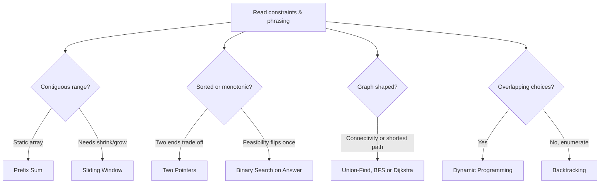

The hardest part of a coding interview is rarely writing the code — it's the first ninety seconds, deciding which of a dozen plausible techniques actually fits. This page is a recognition index, not a tutorial: for each family it gives the trigger phrase or constraint that should make the pattern come to mind, plus a one-line reminder of the core idea. The mechanics — invariants, proofs, full walkthroughs — live on the dedicated pattern pages; this page exists so you can go from "what is this problem really asking" to "which page do I need" in seconds.

## The trigger table

| When you notice... | Reach for | One-line idea |
|---|---|---|
| "Contiguous subarray/substring sum" on a **static** array | Prefix Sum | Precompute cumulative sums so any range query is `O(1)` |
| Many **range updates**, one final read of the whole array | Difference Array | Mark only the boundaries; reconstruct with one prefix-sum pass |
| Point updates **interleaved** with range queries | Fenwick Tree / Segment Tree | Trade array simplicity for `O(log n)` update and query |
| Array is sorted, or two values must trade off from opposite ends | Two Pointers | Converge inward, or run same-direction slow/fast pointers |
| "Longest/shortest substring or subarray satisfying a condition" | Sliding Window | Expand right, shrink left to restore or tighten the window invariant |
| "Next greater/smaller element", "span", histogram-shaped question | Monotonic Stack | Keep indices in increasing/decreasing order; each pushed and popped once |
| Sorted data, or a yes/no predicate that flips exactly once | Binary Search | Search on index directly, or binary search **on the answer** |
| "Kth largest/smallest", "top K", "median of a stream" | Heap | Bounded heap of size `k`, or two heaps balanced around the median |
| Need level order, or shortest step count in an unweighted structure | BFS | Explore in layers; the first visit to a node is the shortest path to it |
| Need reachability, component membership, or a property that composes down a tree | DFS | Recurse and combine child results; pre/in/post order picks what you compute |
| "Are these connected", "does this edge create a cycle", "same group" | Union-Find | Union operations answer connectivity in near-`O(1)` |
| "Order of tasks", "prerequisite", "can this even be scheduled" | Topological Sort | Process indegree-0 nodes first (Kahn's), or DFS post-order reversed |
| Edge weights are all non-negative and you need shortest paths | Dijkstra | Greedy relaxation from a min-heap of frontier distances |
| Edge weights can be negative | Bellman-Ford | Relax every edge `V - 1` times; one extra pass detects a negative cycle |
| Need shortest paths between **every** pair of nodes | Floyd-Warshall | Triple loop with the intermediate vertex as the **outer** loop |
| "Minimum cost to connect everything" | MST (Kruskal / Prim) | Greedily add the cheapest edge that doesn't close a cycle |
| "All subsets/permutations/combinations", constraint satisfaction | Backtracking | Check, mark, explore, unmark — prune as early as possible |
| Best/count of ways over choices with **overlapping** subproblems | Dynamic Programming | Define the state and transition once, then cache it |
| "Toggle/set/clear a bit", "power of two", parity tricks | Bit Manipulation | Manipulate the binary representation directly, no loop needed |
| "Primes up to n", GCD/LCM, counting arrangements | Math | A closed-form or sieve replaces a slow simulation |
| Duplicate detection in a `1..n` range, `O(1)` extra space required | Index Marking / Floyd Cycle | Use array values as pointers or negate visited slots in place |

> [!KEY]
> Say the trigger out loud before the pattern name. "This is a contiguous range on a static array" is a stronger interview signal than blurting "prefix sum" — it proves you reasoned to the technique instead of pattern-matching a memorized title.

## Arrays

- **Prefix sum** — build once in `O(n)`, then answer any range-sum query in `O(1)`; only valid while the array doesn't change.
- **Difference array** — the mirror image: `O(1)` per range update, with the real values reconstructed by one prefix-sum pass at the end.
- **Quickselect** — need the kth smallest/largest without a full sort; partition like quicksort but recurse into only the side that contains `k`, average `O(n)`.

## Hashing

- **Membership / duplicate check** — a `HashSet` turns "have I seen this before" into an `O(1)` average lookup.
- **Frequency counting** — a `HashMap<T, Integer>` turns "how many times has this appeared" into the same `O(1)` average lookup, incremented per pass.

## Two pointers, sliding window, binary search

These three have full mechanics pages of their own — the recognition cues are:

- **Two pointers**: the array is sorted, or you're comparing/consuming from both ends at once (palindrome checks, merging, partitioning).
- **Sliding window**: the question is about a *contiguous* run whose validity can be repaired incrementally as you expand or shrink one side, rather than recomputed from scratch. Remember `count(exactly K) = count(at most K) - count(at most K-1)` for "exactly K distinct" style variants.
- **Binary search**: not just "the array is sorted" — also "there's a monotonic yes/no predicate over a range of possible answers" (binary search *on the answer*, not on an index).

## Stacks

- **Monotonic stack** — the moment you need "next greater/smaller element" in either direction, or a histogram/span-style question, keep a stack of indices in strictly increasing or decreasing value order. Every element is pushed once and popped at most once, so the whole scan is `O(n)`.

## Range query data structures

| Need | Structure | Update | Query |
|---|---|---|---|
| Static array, many range-sum reads | Prefix sum array | not supported (`O(n)` rebuild) | `O(1)` |
| Point updates interleaved with range-sum reads | Fenwick tree (BIT) | `O(log n)` | `O(log n)` |
| Range updates and/or non-sum aggregates (min, max, gcd) | Segment tree (+ lazy propagation for range updates) | `O(log n)` | `O(log n)` |

> [!WARNING]
> Rebuilding a prefix-sum array after every point update is the classic trap that turns an `O(1)`-query design into `O(n)` per operation. The instant updates and queries interleave, that's the cue to reach for a Fenwick tree or segment tree instead of a plain prefix sum.

## Linked lists

- **Reversal** — three pointers (`prev`, `cur`, `next`), rewire one link at a time, `O(1)` space.
- **Fast/slow pointers** — cycle detection, finding the middle node, and detecting the cycle's entry point all reduce to a fast pointer moving twice as fast as a slow one.
- **Dummy head** — whenever the operation might touch the front of the list (insert/delete at index 0), a dummy node removes the special case.

## Heaps

- **Bounded heap of size k** — "k largest" keeps a min-heap of size `k` (evict the smallest when it overflows); "k smallest" flips to a max-heap. `O(n log k)`.
- **Repeated max/min operations** — build the heap once from all elements, then pop/process/push in a loop; each op is `O(log n)`.
- **Running median** — two balanced heaps (a max-heap for the lower half, a min-heap for the upper half) keep the median accessible in `O(1)`.

## Trees

- **BFS (level order)** — whenever the question is phrased per level, or asks for shortest distance/steps in a tree treated as an unweighted graph.
- **DFS (pre/in/post order)** — placement of the recursive call determines what you're computing: pre-order for "process before descending", in-order for BSTs (gives sorted order), post-order for anything that needs children's answers first (height, diameter, subtree sums).

## Graphs

- **Traversal** — BFS for shortest unweighted paths and level structure; DFS for reachability, components, and cycle checks.
- **Union-Find** — connectivity questions, cycle detection on undirected graphs, and Kruskal's MST all reduce to union operations near `O(1)` with path compression and union by rank.
- **Cycle detection** — undirected: DFS with parent-tracking, or Union-Find. Directed: 3-state DFS (unvisited/in-progress/done) or topological sort failing to place all nodes.
- **Topological sort** — "order of tasks with prerequisites" is Kahn's algorithm: repeatedly remove indegree-0 nodes.
- **Shortest path** — match the algorithm to the edge weights: BFS (unweighted), Dijkstra (non-negative weights), Bellman-Ford (negative weights allowed, also detects negative cycles), Floyd-Warshall (all pairs).
- **MST** — "minimum cost to connect everything" is Kruskal's (sort edges, union greedily) or Prim's (grow one tree, always take the cheapest crossing edge).

## Backtracking

- Recognize it from "all subsets", "all permutations", "all valid combinations/arrangements", or any constraint-satisfaction phrasing. The shape is always **check → mark → explore → unmark**; the only real design decision per problem is what to check and how aggressively you can prune before recursing.

## Dynamic programming

| Shape | Recognize it by |
|---|---|
| Take/leave (0/1 knapsack) | Each item used at most once, optimizing a sum under a capacity |
| Unbounded knapsack | Items can repeat under the same capacity/budget idea (coin change, rod cutting) |
| Subset sum / partition | "Can a subset reach exactly this total" |
| LCS / edit distance | Two sequences compared position by position |
| Grid DP | "Number of ways" or "min/max cost" moving through a 2D grid |
| Palindrome / interval DP | Subproblems are defined over a shrinking or growing `[left, right]` range |
| LIS | "Longest increasing/non-decreasing subsequence" |

## Bit manipulation

| Operation | Expression |
|---|---|
| Check bit `k` | `(x >> k) & 1` |
| Set / clear / toggle bit `k` | `x \| (1 << k)` / `x & ~(1 << k)` / `x ^ (1 << k)` |
| Lowest set bit | `x & -x` |
| Clear lowest set bit | `x & (x - 1)` |
| Is power of two | `x > 0 && (x & (x - 1)) == 0` |
| Popcount | `Integer.bitCount(x)` |
| Swap without a temp | `a ^= b; b ^= a; a ^= b;` |

## Math

Reach for a formula instead of simulating whenever the problem is really about counting, primality, or scale.

| Category | Key facts |
|---|---|
| Sums & series | `1..n = n(n+1)/2`; squares `1²..n² = n(n+1)(2n+1)/6`; geometric `a(rⁿ-1)/(r-1)` |
| Combinatorics | `nPr = n!/(n-r)!`; `nCr = n!/(r!(n-r)!)`; subsets of `n` items `= 2ⁿ`; Catalan `Cₙ = (2n)!/((n+1)!n!)` |
| Modular arithmetic | `(a + b) % m = ((a%m)+(b%m))%m`; normalise negatives with `((x % k) + k) % k`; common mod `1_000_000_007` |
| Number properties | `gcd(a,b) * lcm(a,b) = a * b`; primality check divisors up to `√n` |
| Geometry | Manhattan `\|x1-x2\| + \|y1-y2\|`; compare squared Euclidean distance to skip `sqrt` |

> [!TIP]
> Memorize the complexity budget for `n`, not just the formulas: `O(n!)` tops out near `n ≤ 11`, `O(2ⁿ)` near `n ≤ 22`, `O(n²)` near `n ≤ 5,000`, `O(n log n)` near `n ≤ 10⁶`, `O(n)` near `n ≤ 10⁸`. The constraint on `n` tells you the target complexity before you've picked an approach.

> [!NOTE]
> None of these one-liners replace the dedicated pages — they exist so that mid-interview, you can identify the *family* fast, then bring the full mechanics from memory or from the deeper page.

## Cheat sheet

- Static range-sum on an unchanging array → prefix sum; range updates → difference array; interleaved updates and queries → Fenwick/segment tree.
- Sorted array or "compare from both ends" → two pointers; "contiguous run, repairable validity" → sliding window; monotonic yes/no predicate → binary search on the answer.
- "Next greater/smaller" → monotonic stack. "Top/bottom k" or running median → heap.
- Reversal/cycle/middle on a linked list → fast/slow pointers; front-of-list edits → dummy head.
- Level order or shortest unweighted path → BFS; height/diameter/subtree property → DFS with the right traversal order.
- Connectivity/cycle/MST on a graph → Union-Find; prerequisite ordering → topological sort; shortest path → match the algorithm to the edge weights.
- "All subsets/permutations/valid arrangements" → backtracking with early pruning.
- Overlapping subproblems with a best/count objective → dynamic programming; name the state and transition before coding.
- Toggle/parity/power-of-two phrasing → bit manipulation. Primes/GCD/combinatorics phrasing → math formula, not simulation.

## Common mistakes

| Mistake | Fix |
|---|---|
| Reaching for two pointers on an array that isn't sorted and where order matters | Sort first if order is irrelevant to the answer, or pick a different pattern if it isn't |
| Using a sliding window when the array contains negative numbers | Sliding window relies on monotonic growth/shrink; negatives break that — use prefix sums with a hash map instead |
| Picking a plain prefix-sum array for a problem with point updates | Switch to a Fenwick tree or segment tree the moment updates and queries interleave |
| Storing values instead of indices in a monotonic stack/deque | Store indices so you can still tell how far an element is, and evict expired ones from a window |
| Treating "count all ways" the same as "check if any way exists" | Counting needs summing over choices (DP with `+=`); existence needs a boolean OR — using the wrong one silently produces the wrong recurrence |
| Running Dijkstra on a graph with negative edge weights | Dijkstra's greedy relaxation assumes non-negative weights; use Bellman-Ford instead |
| Putting the intermediate-vertex loop anywhere but outermost in Floyd-Warshall | The `k` loop must be outermost, or the recurrence reads stale distances |
| Defaulting straight to backtracking when subproblems actually overlap | If the same state recurs across branches, memoize it — that's dynamic programming wearing a backtracking costume |

## Summary

Recognition is a lookup problem before it's an algorithm problem: match the phrasing and constraints in front of you to the smallest set of clues in the trigger table, then bring the full mechanics from the dedicated page for that pattern. Static range sums point at prefix sums, but the instant updates enter the picture the answer shifts to a Fenwick or segment tree. A sorted array or two values trading off from opposite ends points at two pointers; a contiguous run with repairable validity points at sliding window; a monotonic feasibility predicate points at binary search on the answer, not on an index. Graphs split cleanly by what's being asked — connectivity to Union-Find, ordering to topological sort, shortest path to whichever of BFS/Dijkstra/Bellman-Ford/Floyd-Warshall matches the edge weights. The two catch-all families, backtracking and dynamic programming, are separated by one question: do the subproblems overlap? If they do, cache them.

## Top Interview Questions

### Q1. You read a new problem and have thirty seconds before you have to say something — what do you look for first?

The shape of the input and what's being asked about it, not the surface story. Is the array sorted? Is it about a contiguous range? Is there a graph or tree underneath the wording? Are you counting, or checking existence, or finding an extreme value? Constraints on `n` also matter immediately — if `n` is up to `10^9`, you already know you need something close to `O(n)` or `O(log n)`, which rules out most `O(n²)` ideas before you've even picked an approach. Naming the shape out loud ("this is a contiguous-range question on a static array") is itself a strong signal, because it shows you're reasoning toward the technique rather than pattern-matching a memorized title.

### Q2. How do you tell a prefix-sum problem apart from a sliding-window problem when both involve "a running total over a range"?

The deciding question is whether the range's validity can be *repaired incrementally* as you move one side of it. Sliding window needs that property — adding or removing one element must cheaply update whatever condition you're tracking (a sum, a character count, a distinct-element count). Prefix sum doesn't need that; it answers "what's the exact total between two fixed points" directly from precomputed cumulative sums, which is essential the moment negative numbers are involved (since a window's sum stops being monotonic once you can subtract). If negatives are possible and you're counting exact-total subarrays, that's prefix sum plus a hash map, not a window.

### Q3. What's the tell that a problem wants binary search on the answer rather than binary search on the array itself?

The phrasing usually contains "minimize the maximum" or "maximize the minimum" — e.g. "minimum days to ship all packages," "minimum eating speed to finish in time," "maximum minimum distance between placed items." None of these are searching for a position in a sorted array; they're searching a *range of possible answers* for the smallest (or largest) value that satisfies a yes/no feasibility check. The tell-tale structure is: define `Feasible(x)` as a boolean function of a candidate answer, confirm it's monotonic (once true, always true for larger `x`, or vice versa), then binary search over that boolean line instead of over indices.

### Q4. When should you reach for a monotonic stack instead of a nested loop for "next greater element" style problems?

The instant you notice the naive approach rescans the rest of the array for every element — that's the `O(n²)` bottleneck a monotonic stack removes. The insight is that once you find a greater element for something on the stack, every smaller element still under it on the stack can also potentially be resolved by that same greater element or a later one; you never need to look backward again. Keeping a stack of indices in increasing (or decreasing) value order guarantees each index is pushed once and popped at most once, so the whole scan collapses to `O(n)` even though it "looks" like nested loops in the naive version.

### Q5. How do you decide between BFS and DFS when a graph problem doesn't explicitly say "shortest path"?

Ask what you actually need to know: if it's the minimum number of steps/edges in an unweighted structure, or a "distance exactly k away" style question, BFS's layer-by-layer exploration guarantees the first visit is the shortest. If it's about reachability, counting components, validating structural properties recursively (heights, subtree checks, cycle detection via a visited/in-progress/done state machine), DFS is usually simpler to write and uses the call stack naturally instead of an explicit queue. A useful rule: if the word "minimum" or "shortest" modifies a step count, default to BFS; if the question is about structure or existence, default to DFS.

### Q6. What's the practical difference between "count the number of ways" and "does a way exist," and why does it matter for recognizing DP versus backtracking?

"Does a way exist" is a boolean question — you can stop the instant you find one success, and a backtracking search with early pruning is often sufficient even without memoization, because you're not obligated to explore every branch. "Count the number of ways" requires visiting every valid branch to sum them, which is exactly when overlapping subproblems start to hurt — the same state can be reached via multiple paths, and without caching you redo the same count repeatedly. That's the signal to convert plain backtracking into dynamic programming: define the state, memoize it, and the exponential blow-up collapses to polynomial.

### Q7. A problem mentions both "shortest path" and "negative edge weights" — what's your first move?

Immediately rule out Dijkstra — its greedy relaxation assumes that once a node's shortest distance is finalized, no cheaper path can appear later, which negative weights can violate. Reach for Bellman-Ford instead: relax every edge `V - 1` times, which is enough to propagate the true shortest distance along any simple path. As a bonus, run one more relaxation pass afterward — if any distance still improves, that's proof of a negative cycle reachable from the source, which Dijkstra has no mechanism to detect at all. If the problem needs all-pairs shortest paths with possible negative edges (but no negative cycles), Floyd-Warshall handles that directly in `O(V³)`.

### Q8. How do you recognize when a problem is really a Union-Find problem in disguise?

Look past the surface story for the underlying question: "are these two things ultimately connected," "does adding this edge create a cycle," "how many separate groups exist after all these merges," or "which elements can freely swap/interact with each other." Any of those reduce to union operations over a disjoint-set structure — accounts-merge (same email → same account), redundant-connection (the first union that returns false is the cycle-causing edge), and Kruskal's MST (skip an edge whose endpoints are already unioned) are all this same shape wearing different stories. The giveaway isn't graph vocabulary; it's the "merge" or "group" framing paired with fast repeated connectivity checks.

### Q9. Why does the complexity budget for `n` matter before you've even chosen an approach?

Because it eliminates entire families of approaches immediately and prevents wasted time designing something that will time out regardless of correctness. If `n` is up to `10^9`, only `O(n)` or `O(log n)` approaches survive, which usually means math, binary search, or a single linear scan — full DP tables or `O(n log n)` sorts are already too slow. If `n` is small, under about 20, that's often a strong hint the intended solution is exponential — bitmask DP or brute-force backtracking — because no polynomial trick is expected to exist. Stating this out loud ("given n up to 10^5, I'm targeting O(n log n) or better") also signals to the interviewer that you're reasoning from constraints rather than guessing.

### Q10. How do you avoid over-fitting to a memorized pattern when a problem looks like a familiar one but has a subtle twist?

Re-derive the invariant instead of trusting the label. If a "two pointers" problem suddenly allows negative numbers, check whether the monotonicity the technique relies on still holds — if it doesn't, the pattern doesn't transfer even though the surface story matches. The safest habit is to state the property your technique depends on explicitly before applying it: "sliding window works here because the character-count condition only gets easier to satisfy as I shrink the window" — and if you can't state that property confidently for the problem in front of you, that's the signal the twist has broken the pattern, and you need to re-derive the approach rather than force-fit a memorized one.
