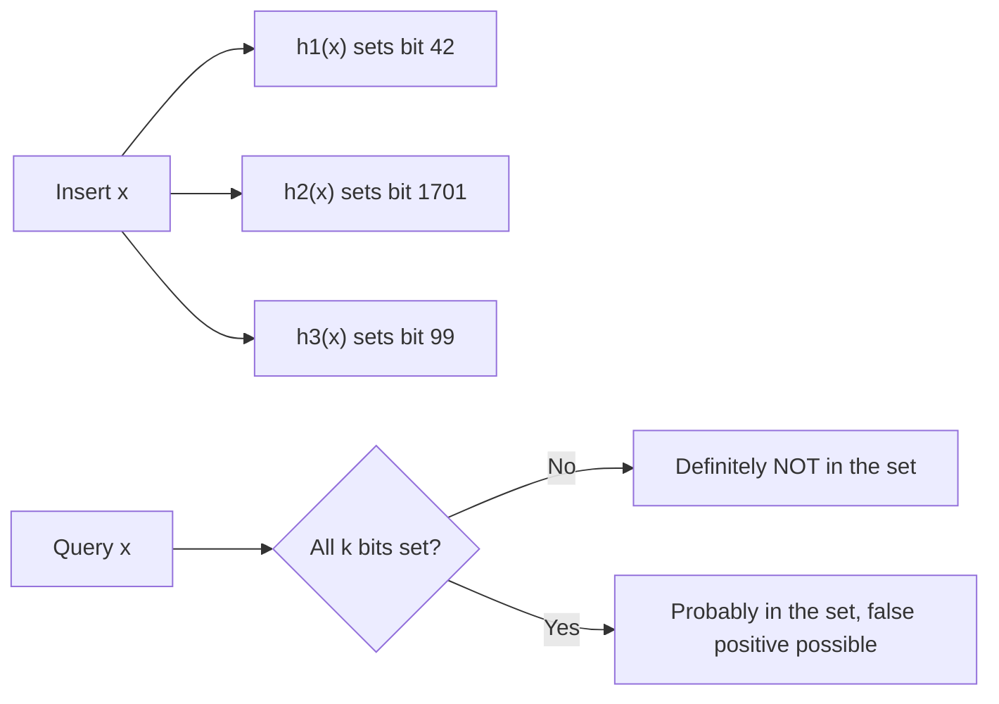

The core-patterns pages cover the structures you reach for in almost every interview. This page is the next tier: the data structures that show up when a problem's constraints quietly rule out anything simpler — range updates that must stay `O(log n)`, a set so large that exact membership is too expensive to store, or a storage engine question hiding inside what looked like a plain coding round. None of these are exotic; each one is the standard, well-known answer to a specific constraint, and recognizing that constraint is most of the battle.



> [!KEY]
> Pick the structure by the exact pair of operations you need, not by familiarity. A prefix-sum array wins on simplicity if the data never changes; a Fenwick tree wins the instant point updates and range-sum queries interleave; a segment tree wins the moment you need a non-sum aggregate (min, max, gcd) or range updates via lazy propagation.

## Segment trees

A segment tree is a binary tree laid over array intervals, where each node stores an aggregate (sum, min, max, gcd — anything associative) of the range it covers. Both query and update walk a single root-to-leaf path plus a bounded number of siblings, giving `O(log n)` for each, at the cost of `O(4n)` space for the array-backed implementation shown here.

```java
class SegmentTree {
    private final int[] tree;
    private final int n;

    SegmentTree(int[] arr) {
        n = arr.length;
        tree = new int[4 * n];
        build(arr, 0, 0, n - 1);
    }

    private void build(int[] arr, int node, int start, int end) {
        if (start == end) { tree[node] = arr[start]; return; }
        int mid = start + (end - start) / 2;
        build(arr, 2 * node + 1, start, mid);
        build(arr, 2 * node + 2, mid + 1, end);
        tree[node] = tree[2 * node + 1] + tree[2 * node + 2]; // sum; swap for min/max/gcd
    }

    // Range sum query over [l, r]
    int query(int l, int r) { return query(0, 0, n - 1, l, r); }
    private int query(int node, int start, int end, int l, int r) {
        if (r < start || end < l) return 0;               // out of range
        if (l <= start && end <= r) return tree[node];     // fully covered
        int mid = start + (end - start) / 2;
        return query(2 * node + 1, start, mid, l, r)
             + query(2 * node + 2, mid + 1, end, l, r);
    }

    // Point update: set arr[idx] = val
    void update(int idx, int val) { update(0, 0, n - 1, idx, val); }
    private void update(int node, int start, int end, int idx, int val) {
        if (start == end) { tree[node] = val; return; }
        int mid = start + (end - start) / 2;
        if (idx <= mid) update(2 * node + 1, start, mid, idx, val);
        else update(2 * node + 2, mid + 1, end, idx, val);
        tree[node] = tree[2 * node + 1] + tree[2 * node + 2];
    }
}
```

### Lazy propagation for range updates

A range update (add a delta to every element in `[l, r]`) applied node-by-node costs `O(n)`. Lazy propagation gets it back to `O(log n)`:

- Every node holds `lazy[node]`, a pending delta not yet pushed to its children.
- Before a query or update descends into a node's children, **push the pending delta down first**, then clear it on the parent.
- Only fully-covered ranges get the delta applied directly and deferred; partially-covered ranges recurse after the push-down.

> [!WARNING]
> The single most common lazy-propagation bug is querying or updating a child before pushing its parent's pending delta down. Push-down must happen unconditionally at the *start* of every recursive call that might touch children, not only when an update is being applied.

Useful for: range-add + range-sum, range-set + range-min, and similar combinations where both the update and the query span a range.

## Fenwick trees (Binary Indexed Trees)

A Fenwick tree encodes partial sums at indices determined by the lowest set bit of the index, giving prefix-sum query and point update in `O(log n)` with a much smaller constant than a segment tree and roughly fifteen lines of code.

```java
class FenwickTree {
    private final int[] bit;
    private final int n;

    FenwickTree(int n) { this.n = n; bit = new int[n + 1]; }

    // Add delta to index i (1-indexed)
    void update(int i, int delta) {
        for (; i <= n; i += i & -i) bit[i] += delta;
    }

    // Prefix sum over [1..i]
    int query(int i) {
        int sum = 0;
        for (; i > 0; i -= i & -i) sum += bit[i];
        return sum;
    }

    // Range sum over [l..r]
    int rangeQuery(int l, int r) { return query(r) - query(l - 1); }
}
```

### Choosing between prefix sum, Fenwick and segment tree

| Aspect | Prefix sum | Fenwick tree | Segment tree |
|---|---|---|---|
| Build | `O(n)` | `O(n log n)` (or `O(n)` direct) | `O(n)` |
| Point update | `O(n)` rebuild | `O(log n)` | `O(log n)` |
| Range query | `O(1)` | `O(log n)` | `O(log n)` |
| Range update | `O(1)` with a difference array | `O(log n)` | `O(log n)` with lazy propagation |
| Supported aggregates | Sum only (or with a diff array) | Sum, XOR | Any associative op (min, max, gcd, sum) |
| Code complexity | Simple | Medium | Higher |
| Space | `O(n)` | `O(n)` | `O(4n)` |
| Best for | Static array, range sum only | Dynamic point update + prefix sum | Any dynamic range aggregate |

## Union-Find recap

Union-Find already has a full mechanics page of its own — path compression, union by rank, and the `O(α(n))` amortized proof. The recap that matters here is which problem phrasings map onto it:

| Application | How Union-Find is used |
|---|---|
| Connected components | Union every edge, count distinct roots |
| Cycle detection (undirected) | Union an edge; a union that returns "already connected" means a cycle |
| Kruskal's MST | Union the cheapest edges in order; skip any that would close a cycle |
| Accounts merge | Union accounts that share an email |
| Redundant connection | The first edge whose union fails is the answer |
| Smallest string with swaps | Same component means the positions can be freely permuted |

## Cache design recap

LRU and LFU cache design questions look like advanced patterns but are really data-structure composition problems, and their full worked implementations belong with the other coded interview problems rather than here:

- **LRU** — a `HashMap<Key, Node>` plus a doubly linked list gives `O(1)` get, put and eviction; the list's tail is always the least recently used entry.
- **LFU** — two hash maps (key → node, frequency → bucket of a doubly linked list) plus a tracked `minFrequency` give `O(1)` average get and put; eviction removes from the tail of the minimum-frequency bucket.

## Probabilistic data structures

These trade a small, bounded error rate for space that stays flat regardless of how much data flows through, which is why they show up constantly in real infrastructure rather than just interview trivia.

### Bloom filter

An `m`-bit array plus `k` hash functions. Insert sets `k` bits; query checks all `k` — any `0` means **definitely absent**, all `1` means **probably present** (false positives possible, false negatives never).

| Quantity | Formula |
|---|---|
| False-positive rate | `p ≈ (1 - e^(-kn/m))^k` |
| Optimal number of hashes | `k = (m/n) · ln 2 ≈ 0.693 · m/n` |
| Bits needed for target `p` | `m = -n·ln(p) / (ln 2)²` |

**Example:** 1M items at a 1% target false-positive rate needs `m ≈ -1,000,000 · ln(0.01) / 0.693² ≈ 9.6M bits ≈ 1.2 MB`.

Used in production to skip expensive lookups: databases like Cassandra and RocksDB use one per SSTable to skip disk reads for keys that definitely aren't present, CDNs check a filter before an expensive cache lookup, and web crawlers use one to skip URLs already visited.

> [!TIP]
> A standard Bloom filter cannot support deletion — clearing a bit might belong to another inserted item's hash. If deletion is required, use a Counting Bloom Filter (small counters instead of single bits) instead of reinventing one.

### Count-Min sketch

A `d × w` integer array plus `d` independent hash functions. Insert increments `table[i][h_i(x)]` for every row; query for frequency returns the **minimum** across rows, which guarantees the estimate never undercounts.

- Never underestimates; overestimates by at most `ε·N` with probability `1 - δ`, where `w = ⌈e/ε⌉` and `d = ⌈ln(1/δ)⌉`.
- Space: `O(d·w) = O(ε⁻¹ · log(1/δ))`.
- Used for network flow analysis, top-k heavy hitters (paired with a min-heap), and event counting at scale (Flink, Redis).

### HyperLogLog

Estimates the number of *distinct* elements using a small fixed register array regardless of how large the underlying stream is, by tracking the longest leading-zero run (equivalently, the position of the first `1` bit) across many hashed registers and averaging out the noise.

- Error rate ≈ `1.04/√m` where `m` is the number of registers; `m = 16384` gives about 0.8% error.
- Space: `m` registers at 5-6 bits each, roughly 12 KB for 0.8% error at any scale.
- Used for unique visitor counts, distinct query counting, and Redis's `PFADD`/`PFCOUNT` cardinality estimation.

> [!NOTE]
> All three probabilistic structures make the same trade: a small, tunable error rate in exchange for memory that does not grow with the true size of the data. Reach for them the moment "exact" is explicitly not required and scale is explicitly large.

## Skip lists

A probabilistic linked list with extra "express lane" forward pointers, giving expected `O(log n)` search, insert and delete without the rotation logic a balanced BST needs.

| Aspect | Skip list | Balanced BST |
|---|---|---|
| Search / insert / delete | `O(log n)` expected | `O(log n)` worst case |
| Rebalancing logic | None — randomized level assignment | Rotations (AVL, red-black) |
| Space | `O(n)` expected, `O(log n)` pointers per node in expectation | `O(n)`, fixed pointers per node |
| Used in | Redis sorted sets (`ZSET`), LevelDB MemTable | In-memory ordered maps/sets |

## B+Tree vs LSM tree

A system-design-flavored comparison that occasionally surfaces inside a coding round when a question is really about how a storage engine is built underneath.

| Aspect | B+Tree | LSM tree |
|---|---|---|
| Structure | Balanced tree, all data in leaves | In-memory buffer + immutable, append-only SSTables |
| Write performance | `O(log n)`, in-place update | `O(1)` amortized, append-only |
| Read performance | `O(log n)` | `O(log n)` amortized, plus compaction overhead |
| Write amplification | Low | High — compaction rewrites data repeatedly |
| Read amplification | Low | Higher — may check multiple SSTables |
| Space amplification | Low | Higher until old data is compacted away |
| Best for | Read-heavy workloads (InnoDB, Postgres) | Write-heavy workloads (Cassandra, RocksDB, LevelDB) |
| Crash recovery | WAL + page-level recovery | WAL + compaction replay |

## String algorithms and number theory

Two families sit just outside the core patterns but appear often enough at senior level that not recognising the name is a visible gap. You are rarely asked to derive them; you are asked to name the right one and state its complexity.

| Algorithm | Solves | Complexity | The cue in the problem |
|---|---|---|---|
| KMP | Substring search without backtracking the text | `O(n + m)` | "find pattern in text", repeated prefixes matter |
| Z-algorithm | Longest match of each suffix against the whole string | `O(n)` | Prefix-matching or period-finding questions |
| Rabin-Karp | Substring search by rolling hash | `O(n + m)` average | Many patterns at once, or compare substrings in `O(1)` |
| Manacher | All palindromic substrings | `O(n)` | "longest palindromic substring" with `n` up to a million |
| Sieve of Eratosthenes | All primes up to `n` | `O(n log log n)` | Repeated primality queries over a bounded range |
| Shunting-yard | Infix expression to postfix, then evaluate | `O(n)` | "evaluate this expression string" with precedence and brackets |
| Digit DP | Count numbers in a range with a digit property | `O(digits x states)` | "how many numbers between A and B such that..." |

```java
// Sieve: mark composites from i*i upward; everything left is prime.
public boolean[] sieve(int n) {
    boolean[] composite = new boolean[n + 1];
    for (int i = 2; (long) i * i <= n; i++)
        if (!composite[i])
            for (int j = i * i; j <= n; j += i) // start at i*i, smaller multiples already marked
                composite[j] = true;
    return composite;
}
```

> [!TIP]
> For substring search in an interview, the expected answer is usually "the built-in `IndexOf` is fine, and if the interviewer wants the linear-time guarantee I would reach for KMP". Volunteering Manacher or Z only when the constraints demand them reads as judgement rather than trivia.

> [!WARNING]
> Rabin-Karp is `O(n + m)` on average but degrades to `O(nm)` on hash collisions, so always verify a hash match by comparing the actual characters. Interviewers who know the algorithm will ask specifically about that verification step.

## Cheat sheet

- Segment tree: any dynamic range aggregate beyond sum, or range updates via lazy propagation.
- Fenwick tree: point updates plus prefix/range sums, when a simpler and faster constant is enough.
- Lazy propagation: push the pending delta down *before* recursing into children, every time.
- Union-Find: connectivity, cycle detection and Kruskal's MST all reduce to union operations.
- LRU: hash map + doubly linked list. LFU: hash map + frequency-bucketed doubly linked lists.
- Bloom filter: false positives okay, false negatives never, deletion needs a counting variant.
- Count-Min sketch: frequency estimation that never undercounts, bounded overcount.
- HyperLogLog: distinct-count estimation in near-constant space regardless of stream size.
- Skip list: `O(log n)` expected ops with no rotation logic, used by Redis `ZSET`.
- B+Tree favors reads; LSM tree favors writes by deferring the cost to background compaction.

## Common mistakes

| Mistake | Fix |
|---|---|
| Building a segment tree with less than `4n` backing array space | Size the array `4 * n` for the recursive array-based layout, or use an iterative `2n` variant |
| Querying or updating a child before pushing a pending lazy delta down | Push-down must run unconditionally at the top of every recursive call that can reach children |
| Choosing a segment tree when only sum + point update is needed | A Fenwick tree does the same job with less code and a smaller constant |
| Trying to delete from a plain Bloom filter | Use a Counting Bloom Filter, or rebuild, since single bits can't be safely cleared |
| Treating a Count-Min sketch estimate as exact | It never undercounts but can overcount by a bounded amount — treat it as an upper-bound estimate |
| Assuming HyperLogLog gives an exact distinct count | It is an estimate with a known error rate; use exact hashing/counting if precision is required |
| Reaching for a skip list expecting worst-case guarantees | Its `O(log n)` bound is expected (probabilistic), not worst-case like a balanced BST |
| Forgetting LFU eviction needs a tie-break within the minimum-frequency bucket | Evict the least recently used entry inside that bucket, not an arbitrary one |

## Summary

These structures exist because the plain array, hash map, or linked list eventually runs into a specific constraint: a segment tree or Fenwick tree appears once updates and range queries interleave and a rebuild-on-every-change design is too slow; probabilistic sketches appear once the data volume makes exact storage impractical and a bounded error rate is an acceptable trade; skip lists and LSM trees appear once you need an alternative to rotation-heavy balanced trees or in-place updates under heavy write load. None of them need to be reinvented from scratch in an interview — what matters is recognizing the constraint that rules out the simpler structure, and being able to state the trade-off (space for speed, exactness for scale, read cost for write cost) that the advanced structure is making.

## Top Interview Questions

### Q1. When would you choose a Fenwick tree over a segment tree, given that a segment tree can do everything a Fenwick tree can?

Choose a Fenwick tree whenever the aggregate you need is invertible — sum and XOR are the common cases — and you don't need range updates beyond what a difference array trick can express. It's roughly fifteen lines of code, has a smaller constant factor than a segment tree's recursive tree-of-nodes structure, and is easier to get correct under interview time pressure. Reach for a segment tree instead the moment the aggregate is non-invertible (min, max, gcd) or you need genuine range updates combined with range queries, since that requires lazy propagation, which a Fenwick tree cannot express cleanly.

### Q2. Explain lazy propagation in a segment tree and why skipping it makes range updates too slow.

Without lazy propagation, updating every element in a range means visiting and updating every leaf in that range individually, which is `O(n)` in the worst case even though the tree structure looks like it should help. Lazy propagation instead applies the update's effect to a node's stored aggregate immediately, but defers pushing that change down to its children until something actually needs to descend into them — a later query or update that only partially overlaps this node's range. That deferral is what keeps both operations at `O(log n)`: you only ever pay the cost of pushing a delta down along the specific path a later operation needs to traverse, not across the whole subtree eagerly.

### Q3. A candidate says "I'll use a Bloom filter to check if a key exists in my cache." What follow-up would you ask, and why?

I'd ask what happens on a false positive, and whether the design needs to delete keys later. A Bloom filter answering "possibly present" is fine when a false positive just costs an extra, otherwise-necessary lookup — for example, deciding whether to bother querying a disk-backed store — but it's the wrong tool if a false positive would cause the system to skip work it actually needed to do. On deletion, a standard Bloom filter can't safely clear a bit, since that bit may be shared with another item's hash; if the design requires removing entries, that's the cue for a Counting Bloom Filter or a different structure entirely.

### Q4. How does a Count-Min sketch guarantee it never undercounts a frequency, and what's the cost of that guarantee?

Because every row's hash-bucket counter only ever increases on insert, and the query returns the **minimum** across all `d` rows, the true count can never exceed any individual row's counter — hash collisions can only inflate a counter, never deflate it below the true value. That guarantee comes at the cost of possible overestimation: two frequently-inserted keys can collide into the same bucket in some rows, inflating that bucket's count and, transitively, any single-row estimate. Taking the minimum across independent hash rows is what bounds that overestimation to `ε·N` with high probability, since it's unlikely all `d` rows collide unfavorably at once.

### Q5. Why is HyperLogLog able to estimate cardinality in roughly constant space, when a hash set would need space proportional to the number of distinct elements?

Because it never stores the actual elements — it only tracks, per register, the longest leading-zero run (the position of the first `1` bit) seen in the hashed values routed to that register. That single statistic is a probabilistic proxy for cardinality: the more distinct elements hashed into a register, the more likely a longer run of leading zeros has appeared. Averaging that estimator across many independent registers cancels out the variance any single register would have. The trade is that HyperLogLog can never tell you which elements were seen or provide an exact count — only a statistically bounded estimate — which is acceptable for analytics-style questions like unique visitor counts.

### Q6. What's the core structural difference between a skip list and a balanced binary search tree, given both offer expected/worst-case O(log n) operations?

A skip list achieves its logarithmic behavior through randomization — each node is assigned a random "height" of forward pointers when inserted, creating express lanes that let search skip over large chunks of the list — while a balanced BST achieves it deterministically through rotations that actively re-balance the tree's shape after every insert or delete. That makes a skip list's guarantee probabilistic (expected `O(log n)`, with a vanishingly small chance of a bad shape) versus a balanced BST's worst-case guarantee. In practice, skip lists are often chosen for concurrent or lock-free implementations because there's no cascading rotation to coordinate across threads, which is part of why Redis uses one for sorted sets.

### Q7. Why do LSM trees favor write-heavy workloads while B+Trees favor read-heavy workloads?

An LSM tree makes writes cheap by never modifying data in place — new writes just append to an in-memory buffer that's periodically flushed to an immutable SSTable on disk, which is close to `O(1)` amortized. The cost is deferred to background compaction, which merges and rewrites SSTables over time, and to reads, which may need to check several SSTables (plus a bloom filter per file to skip the ones that can't contain the key) before finding the latest value. A B+Tree instead updates in place at `O(log n)`, keeping all data in one balanced structure so reads stay fast and predictable, at the cost of write amplification from maintaining that structure eagerly on every write.

### Q8. How would you decide between a segment tree and a Fenwick tree in a system that needs both range-min queries and range-add updates?

Range-min is a non-invertible aggregate — you can't undo a "min" the way you can undo a sum by subtracting — so a Fenwick tree's core trick (prefix differences) doesn't extend to it. That rules Fenwick out and points directly at a segment tree with lazy propagation for the range-add updates. The lazy value stored per node would represent a pending additive delta not yet pushed to children, and the node's own minimum can be updated immediately by adding that delta once, since adding a constant to every element in a range shifts the range's minimum by exactly that same constant.

### Q9. What's the practical difference between "false positive acceptable" and "estimate with bounded error" when choosing among Bloom filters, Count-Min sketches, and HyperLogLog?

A Bloom filter answers a yes/no membership question with one-directional error (false positives possible, false negatives impossible) — you use it when an occasional unnecessary lookup is cheap enough to tolerate. A Count-Min sketch answers "how many times has this been seen," with error only in the overestimating direction, useful when you need approximate frequencies at a scale where per-key exact counters would need too much memory. HyperLogLog answers a completely different question — "how many distinct things have I seen" — with a small statistical error in either direction, and is the right tool specifically when the question is about distinct-count, not frequency or membership, and per-item tracking is infeasible at the target scale.

### Q10. If an interviewer asks you to design a rate limiter or cache layer and mentions "billions of keys, tight memory budget," which of these structures would you bring up, and how would you justify each?

I'd bring up a Bloom filter to cheaply reject requests for keys that have definitely never been seen before hitting a more expensive store, a Count-Min sketch if the limiter needs approximate per-key request counts rather than exact ones (since exact per-key counters at that scale would need memory proportional to the number of keys), and a skip list or LSM-tree-backed store if the underlying cache itself needs to support fast inserts under heavy write load without the memory overhead of a fully balanced tree structure. The justification in each case is the same shape: name the exact operation that needs to stay cheap (membership, frequency, ordered storage) and pick the structure that keeps memory flat while giving that one operation what it needs, accepting a small, bounded error where the structure requires it.
