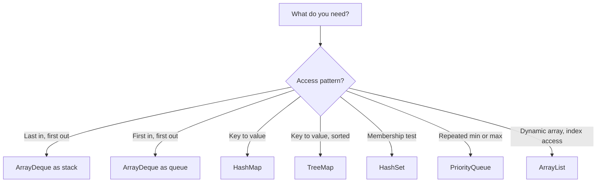

Knowing the algorithm is only half the coding round — the other half is not losing five minutes to `arr.length` versus `list.size()`, or to `substring` treating its second argument as an end index. This page is a fast lookup for the Java syntax, collection APIs and stream methods that come up constantly while solving DSA problems, organized so you can scan straight to the type you need instead of re-deriving it mid-interview.



> [!KEY]
> Arrays use `arr.length` (a field, no parentheses), `String` uses `s.length()`, and every collection uses `.size()`. This one inconsistency causes more compile friction under pressure than anything else on this page.

## Arrays vs ArrayList

Arrays are fixed length; `ArrayList` grows. Reach for a raw `int[]` when the size is known and you want speed, and for `ArrayList` when the size changes as you go. The distinction matters in interviews because generics can not hold primitives: there is no `ArrayList<int>`, only `ArrayList<Integer>`, which boxes every element and costs both memory and a pointer dereference per access. So a hot inner loop over integers should use `int[]`, and you only pay for `ArrayList` when you genuinely need to append or when the collection API buys you real convenience. Converting between the two is a one-liner most candidates fumble, so rehearse it: `int[]` to `List` needs a boxing stream, while `List<Integer>` back to `int[]` needs `mapToInt`.

| Operation | Array | `ArrayList<T>` | `String` |
|---|---|---|---|
| Size | `arr.length` | `list.size()` | `s.length()` |
| Read | `arr[i]` | `list.get(i)` | `s.charAt(i)` |
| Write | `arr[i] = v` | `list.set(i, v)` | immutable |
| Append | — | `list.add(v)` | use `StringBuilder` |

```java
int[] a = new int[n];                 // zero-filled by default
Arrays.fill(a, -1);                   // set every slot
int[] b = Arrays.copyOf(a, a.length); // clone; copyOfRange for a slice
System.arraycopy(a, 0, b, 0, a.length); // fast bulk copy
List<Integer> fixed = Arrays.asList(1, 2, 3); // fixed-size VIEW, set ok, add throws
List<Integer> imm = List.of(1, 2, 3);         // fully immutable, add/set throw
List<Integer> grow = new ArrayList<>(List.of(1, 2, 3)); // mutable copy
```

> [!WARNING]
> `Arrays.asList` returns a fixed-size list backed by the array — `add` and `remove` throw `UnsupportedOperationException`. `List.of(...)` is fully immutable. Wrap either in `new ArrayList<>(...)` when you need to mutate.

## String essentials

`String` is immutable, so every "modification" allocates a brand-new object. Concatenating in a loop with `+=` therefore rebuilds the whole string each pass, turning an innocent-looking loop into `O(n^2)` work — the single most common performance trap in a string problem. Build text with `StringBuilder` instead, which mutates an internal buffer in amortized `O(1)` per append and hands you a finished `String` with `toString()`. Because `String` is immutable it is also safe to use as a `HashMap` key and to share across threads without copying.

```java
char c = s.charAt(0);
String sub = s.substring(2, 5);   // indices 2,3,4 — second arg is END, exclusive
char[] cs = s.toCharArray();
String[] parts = s.split(",");    // argument is a REGEX; split("\\.") for a dot
String v = String.valueOf(42);    // int/char/boolean to String
boolean same = a.equals(b);       // value equality; == compares references
StringBuilder sb = new StringBuilder();
for (int i = 0; i < n; i++) sb.append(i);   // O(n) total, not O(n^2)
sb.reverse();
String joined = String.join("-", "a", "b"); // "a-b"
long vowels = s.chars().filter(ch -> "aeiou".indexOf(ch) >= 0).count();
```

> [!DANGER]
> `substring(a, b)` takes a start and an **end index**, not a length. To grab `len` characters from `a`, write `s.substring(a, a + len)`. Comparing strings with `==` tests reference identity and silently passes for interned literals — always use `.equals`.

## Map family

The map you pick encodes the ordering guarantee you need. `HashMap` gives O(1) average lookup and no order; `LinkedHashMap` preserves insertion order and, with `accessOrder=true`, moves touched entries to the end so overriding `removeEldestEntry` yields a ready-made LRU cache; `TreeMap` keeps keys sorted in a red-black tree for O(log n) navigation. Naming these three and their costs out loud is a quick senior signal.

| Type | Order | Extra powers |
|---|---|---|
| `HashMap` | none | fastest general map |
| `LinkedHashMap` | insertion (or access) | `accessOrder=true` gives LRU eviction |
| `TreeMap` | sorted by key | `floorKey`, `ceilingKey`, `higherKey`, `firstEntry`, `subMap` |

```java
Map<String, Integer> m = new HashMap<>();
int cur = m.getOrDefault(k, 0);         // no NullPointerException
m.putIfAbsent(k, 0);
m.computeIfAbsent(k, x -> new ArrayList<>()).add(v); // adjacency lists
m.merge(k, 1, Integer::sum);            // idiomatic frequency counter
for (Map.Entry<String, Integer> e : m.entrySet())
    process(e.getKey(), e.getValue());

TreeMap<Integer, String> t = new TreeMap<>();
Integer lo = t.floorKey(x);             // greatest key <= x, or null
Integer hi = t.ceilingKey(x);           // smallest key >= x, or null
```

The `merge`, `computeIfAbsent`, and `getOrDefault` trio is what separates fluent Java from a `containsKey`/`get`/`put` dance that hashes the key three times. `merge(k, 1, Integer::sum)` is the canonical frequency counter, and `computeIfAbsent(k, x -> new ArrayList<>())` is how you build a graph's adjacency lists in a single expression.

## Set family

A `Set` is just a `Map` with no values, so the same three flavours apply: `HashSet` for O(1) membership, `LinkedHashSet` to preserve insertion order, `TreeSet` when you need ordering and range queries. The interview-relevant trick is that `add` returns a boolean — `false` means the element was already present — so a duplicate check and the insertion happen in one call rather than a separate `contains` then `add`.

```java
Set<Integer> seen = new HashSet<>();
if (!seen.add(x)) { /* x was already present */ }
TreeSet<Integer> ts = new TreeSet<>();
ts.first(); ts.last();
ts.floor(x);    // <= x
ts.ceiling(x);  // >= x
ts.headSet(x);  // elements < x
ts.tailSet(x);  // elements >= x
```

## Deque, Queue and Stack

Use one type for both stack and queue: `ArrayDeque`. It is faster than `LinkedList` (contiguous storage means better cache locality and no per-node allocation) and than the legacy synchronized `java.util.Stack`. A `Deque` is a double-ended queue, so you push and pop at either end; the only thing to keep straight is which method pair you call for which discipline, since mixing `push` with `poll` on the same structure quietly gives you neither a clean stack nor a clean queue.

| Role | Push | Pop | Peek |
|---|---|---|---|
| Stack (LIFO) | `push` | `pop` | `peek` |
| Queue (FIFO) | `offer` | `poll` | `peek` |

```java
Deque<Integer> stack = new ArrayDeque<>();
stack.push(1); stack.push(2);
int top = stack.pop();          // 2

Deque<Integer> queue = new ArrayDeque<>();
queue.offer(1); queue.offer(2);
int front = queue.poll();       // 1
```

Avoid `java.util.Stack` (synchronized, and it iterates bottom-to-top, which surprises people) and `LinkedList` (pointer-chasing and cache-hostile) — say "`ArrayDeque` for both" out loud. The one catch worth naming: `ArrayDeque` rejects `null`, so it cannot use `null` to mark an absent value; reach for a sentinel when you need that.

## PriorityQueue, sorting and binary search

`PriorityQueue` is a binary heap, **min-heap by default**, giving O(log n) `offer` and `poll` and O(1) `peek` at the smallest element. There is no decrease-key and `remove(Object)` is O(n); to "update" a key, push a new entry and skip stale ones on poll. It is also not a stable heap — equal priorities come out in no guaranteed order — and building one from a `Collection` heapifies in O(n), cheaper than inserting one at a time. For "k largest" keep a size-k min-heap; for "k smallest" keep a size-k max-heap.

```java
PriorityQueue<Integer> min = new PriorityQueue<>();
PriorityQueue<Integer> max = new PriorityQueue<>(Comparator.reverseOrder());
PriorityQueue<int[]> byCost = new PriorityQueue<>(Comparator.comparingInt(e -> e[0]));
PriorityQueue<int[]> tie = new PriorityQueue<>(
    Comparator.<int[]>comparingInt(e -> e[0]).thenComparingInt(e -> e[1]));
min.offer(5); min.poll(); min.peek();
PriorityQueue<Integer> heapified = new PriorityQueue<>(list); // O(n) build, not O(n log n)
```

Sorting splits by array kind, and knowing which algorithm runs matters when the interviewer asks about stability. Primitive arrays use an unstable dual-pivot quicksort with no comparator hook, while object arrays and lists use TimSort, a stable adaptive merge sort that shines on partially sorted input. **You cannot pass a `Comparator` to a primitive `int[]`** — box to `Integer[]` first, or keep the data as `int[][]` rows and sort those, since a row is already an object.

| Call | Algorithm | Stable? |
|---|---|---|
| `Arrays.sort(int[])` | dual-pivot quicksort | no |
| `Arrays.sort(T[])`, `Collections.sort`, `List.sort` | TimSort | yes |

```java
int[] p = {3, 1, 2};
Arrays.sort(p);                                   // ascending, no comparator allowed
Integer[] boxed = {3, 1, 2};
Arrays.sort(boxed, Comparator.reverseOrder());    // comparator needs objects
int[][] iv = {{1, 4}, {0, 2}};
Arrays.sort(iv, (x, y) -> Integer.compare(x[0], y[0])); // never x[0]-y[0]: overflow

int idx = Arrays.binarySearch(p, 2);   // found: index; not found: -(insertionPoint)-1
```

Never write a comparator as `(a, b) -> a - b`: on large or negative values the subtraction overflows an `int` and the sort silently misorders. Always use `Integer.compare(a, b)`, which is overflow-safe. And when `binarySearch` misses, remember it returns `-(insertionPoint) - 1`, so the insertion point is `-result - 1` — a negative return is a location, not a failure.

Binary search on a sorted array is built in: `Arrays.binarySearch` and `Collections.binarySearch` return the index when the key is present and `-(insertionPoint) - 1` when it is absent, so a negative result is a location, not an error. When you actually need a lower or upper bound — the first element `>=` or `>` a target — reach for `TreeMap`/`TreeSet` navigation (`ceilingKey`, `higherKey`, `floor`, `ceiling`) rather than hand-rolling the boundary arithmetic, which is easy to get wrong under pressure.

## Boxing and numeric traps

Autoboxing hides real bugs. `Integer` caches values `-128..127`, so `==` on boxed integers is `true` for small numbers and `false` for large ones — always `.equals` or unbox. `list.remove(int)` removes by **index**; `list.remove(Integer)` removes by **value**, an overload ambiguity that silently deletes the wrong element. A related performance choice: a `Map<Character, Integer>` is flexible but boxes every entry, whereas an `int[26]` indexed by `c - 'a'` is faster and allocation-free when the alphabet is small and fixed — say which you are using and why.

```java
Integer x = 200, y = 200;
boolean bad = x == y;              // false — outside the cache; use x.equals(y)
List<Integer> l = new ArrayList<>(List.of(10, 20, 30));
l.remove(1);                       // removes INDEX 1 -> [10, 30]
l.remove(Integer.valueOf(30));     // removes the VALUE 30
```

Integer math wraps silently on overflow — promote to `long` or use `Math.addExact`. Compute midpoints as `mid = lo + (hi - lo) / 2` to dodge `int` overflow. Java's `%` can return a negative result, so normalize with `((x % m) + m) % m`.

```java
int mid = lo + (hi - lo) / 2;
int mod = ((x % m) + m) % m;           // always in [0, m)
long safe = (long) a * b;              // cast BEFORE multiplying
int bits = Integer.bitCount(v);        // set-bit count
String bin = Integer.toBinaryString(v);
int hi1 = v >>> 1;                     // logical shift, fills with 0
int lo1 = v >> 1;                      // arithmetic shift, keeps sign
```

> [!DANGER]
> Shift counts are taken mod 32 for `int` and mod 64 for `long`, so `1 << 32` is `1`, not `0`. Use `>>>` for unsigned/logical shifts and `>>` only when you intend sign extension. `Integer.MAX_VALUE + 1` is `Integer.MIN_VALUE`, not an error.

## Streams, records and 2-D arrays

Streams are concise but slower and harder to debug than a plain loop — they allocate intermediate objects, add virtual-call overhead, and cannot `break` early cleanly — so reserve them for one-off setup and aggregation rather than the algorithm's hot inner loop. The handful worth knowing under time pressure:

```java
int[] a = IntStream.range(0, n).toArray();
List<Integer> evens = list.stream().filter(v -> v % 2 == 0)
    .sorted().collect(Collectors.toList());
Map<Boolean, List<Integer>> parts = list.stream()
    .collect(Collectors.groupingBy(v -> v % 2 == 0));
Map<String, Long> counts = words.stream()
    .collect(Collectors.groupingBy(w -> w, Collectors.counting()));
int total = list.stream().mapToInt(Integer::intValue).sum();
int best = Arrays.stream(a).max().getAsInt();
String csv = list.stream().map(String::valueOf).collect(Collectors.joining(","));
```

Java 17 gives compact helper types: `record Point(int x, int y) {}` for immutable tuples, `var` for local inference, arrow `switch` for clean dispatch, and text blocks for multi-line literals.

2-D arrays are arrays of arrays: `new int[m][n]` gives `grid.length` rows and `grid[0].length` columns. Initialize a DP table row by row.

```java
int[][] dp = new int[m][n];
for (int[] row : dp) Arrays.fill(row, -1);   // memo table sentinel
record Point(int x, int y) {}                // one-line immutable value type
```

> [!TIP]
> On contest platforms with large input, `Scanner` is too slow — read with `BufferedReader` and split tokens with `StringTokenizer`. Recursion runs on the default thread stack with no tail-call optimization, so deep recursion throws `StackOverflowError`; convert to an explicit stack when depth can exceed ~10^4.

## Cheat sheet

- `arr.length`, `s.length()`, `list.size()` — memorize the three spellings cold.
- `substring(a, b)`: `b` is an exclusive end index; use `a + len` for a length.
- `equals` for value equality; `==` only for primitives and reference identity.
- `map.merge(k, 1, Integer::sum)` and `computeIfAbsent` replace `containsKey` dances.
- `ArrayDeque` for both stack (`push`/`pop`) and queue (`offer`/`poll`); it rejects `null`.
- `PriorityQueue` is a min-heap; `Comparator.reverseOrder()` makes a max-heap.
- Box to `Integer[]` to sort with a comparator; `int[]` takes no comparator.
- Never `(a, b) -> a - b`; use `Integer.compare`. Midpoint: `lo + (hi - lo) / 2`.
- `Integer` `==` is a bug above 127; `list.remove(int)` is by index, `remove(Integer)` by value.
- `((x % m) + m) % m` normalizes negative modulo; `long` guards overflow.

## Common mistakes

| Mistake | Fix |
|---|---|
| `s.substring(a, len)` expecting a length | `s.substring(a, a + len)` |
| `boxedA == boxedB` for equality | `boxedA.equals(boxedB)` or unbox |
| `(a, b) -> a - b` comparator | `(a, b) -> Integer.compare(a, b)` |
| Passing a comparator to `Arrays.sort(int[])` | box to `Integer[]` first |
| `new java.util.Stack<>()` for LIFO | `ArrayDeque` via `push`/`pop` |
| `list.remove(x)` ambiguity | `remove(int index)` vs `remove(Integer value)` |
| `str += c` in a loop | `StringBuilder.append` |
| Negative result from `%` | `((x % m) + m) % m` |

## Summary

Java rewards knowing its collection defaults: `HashMap`/`HashSet` for O(1) lookup, `TreeMap`/`TreeSet` for ordered range queries, `ArrayDeque` for every stack and queue, and `PriorityQueue` for a min-heap. The language traps that cost interview time are boxing identity (`==` on `Integer`), `substring`'s exclusive end index, comparator overflow, and silent integer overflow. Lean on `merge`, `computeIfAbsent`, and `getOrDefault` to write dense, correct map code, keep streams for setup rather than hot loops, and reach for `BufferedReader` when input is large. Master these and the coding round becomes about the algorithm, not the syntax.

## Top Interview Questions

### Q1. What is the most common Java-specific mistake candidates make under time pressure, and how do you avoid it?

Mixing up the size accessors and `substring` semantics. Arrays use the field `arr.length`, `String` uses the method `s.length()`, and collections use `.size()` — swapping them is an instant compile error that eats time. Right behind it is `substring(a, b)` treating `b` as an exclusive end index rather than a length, producing off-by-one bugs. The fix is muscle memory: rehearse the three size spellings and always write `s.substring(a, a + len)` when you mean "len characters from a." A senior candidate narrates this while typing so the interviewer sees deliberate, not accidental, correctness.

### Q2. Why prefer `getOrDefault` or `merge` over checking `containsKey` first?

`containsKey` followed by `get` hashes the key twice and adds branching that is easy to get wrong. `getOrDefault(k, 0)` returns a fallback in one call without inserting, and `merge(k, 1, Integer::sum)` performs the entire read-modify-write of a frequency counter atomically in one line: insert 1 if absent, otherwise add 1. `computeIfAbsent(k, x -> new ArrayList<>())` is the same idea for building adjacency lists. These are both shorter and less bug-prone, and reaching for them signals fluency with the modern `Map` API.

### Q3. Why is `ArrayDeque` preferred over `Stack` and `LinkedList` for stacks and queues?

`java.util.Stack` extends `Vector`, so every operation is synchronized (needless overhead single-threaded) and its iteration order is bottom-to-top, which surprises people. `LinkedList` works but chases pointers across the heap, wrecking cache locality. `ArrayDeque` is a growable circular array giving amortized O(1) `push`/`pop`/`offer`/`poll` with excellent locality, and it serves as both stack and queue so you learn one type. The one caveat to name: `ArrayDeque` forbids `null` elements, so if you need to represent "absent" you must use a sentinel value instead.

### Q4. When is it appropriate to use streams in an interview solution, and when should you avoid them?

Streams shine for readable setup and aggregation — building an array with `IntStream.range`, grouping with `Collectors.groupingBy`, or summing with `mapToInt(...).sum()`. Avoid them in performance-critical inner loops: they allocate, add call overhead, and are harder to step through in a debugger. They also can not `break` early cleanly or mutate external state without friction. A senior answer is "I'll use a stream to prepare the data, but the core algorithm stays a plain loop so it is fast and easy to trace when the interviewer asks me to add a print statement."

### Q5. Explain the difference between `Arrays.sort(int[])` and `Arrays.sort(Integer[])` with a comparator.

`Arrays.sort(int[])` uses a dual-pivot quicksort, is not stable, and accepts **no comparator** — primitives have exactly one natural order. To sort by a custom rule you must box to `Integer[]` (or sort an `int[][]` of rows), which switches to TimSort, a stable merge-sort variant that does accept a `Comparator`. Mixing these up produces a compile error ("no suitable method"). So `Arrays.sort(nums, cmp)` only compiles when `nums` is an object array, and stability only exists on the object-array path.

### Q6. Why does `(long) a * b` behave differently from `(long)(a * b)` when both are `int`?

`(long)(a * b)` multiplies as two `int`s first, overflowing to a 32-bit result, and only then widens the already-wrong value to `long`. `(long) a * b` widens `a` to `long` before the multiply, so the multiplication happens in 64-bit and the full product survives. The rule is cast **before** the operation that can overflow, not after. This bites constantly in problems that multiply two indices or sum many `int`s — promote early, or use `Math.multiplyExact` to fail loudly instead of silently wrapping.

### Q7. Why is `==` on boxed `Integer` values a bug, and when does it appear to work?

`Integer` caches instances for `-128..127`, so autoboxing two small equal ints yields the same cached object and `==` returns `true` — which fools quick tests. Outside that range each boxing creates a new object, so `==` compares references and returns `false` for equal values like `200 == 200`. The result is code that passes small cases and fails large ones. Always compare boxed numbers with `.equals`, or unbox to `int` first. Naming this cache range out loud is a strong senior signal.

### Q8. How do you build a max-heap given that `PriorityQueue` is a min-heap by default?

Pass a reversed comparator: `new PriorityQueue<>(Comparator.reverseOrder())` for boxed values, or `Comparator.comparingInt(e -> -e.cost)` / `.reversed()` for objects. For a "k largest" problem the trick is often the opposite — keep a **min-heap** of size k and poll whenever it exceeds k, so the smallest of the top-k sits at the root for O(log k) eviction. Remember there is no decrease-key and `remove(Object)` is O(n); to update a priority, push a fresh entry and skip stale ones when polling.

### Q9. What does it mean that `binarySearch` returns a negative number, and how do you use it?

When the key is present, `Arrays.binarySearch`/`Collections.binarySearch` returns its index. When absent, it returns `-(insertionPoint) - 1`, where `insertionPoint` is where the key would go to keep the array sorted. So a negative result is not an error — decode it as `int ip = -result - 1`. This lets you find the position for a missing element in one call. On sorted collections, `TreeMap`/`TreeSet` navigation (`floorKey`, `ceilingKey`, `higher`, `lower`) is the cleaner "lower/upper bound" substitute when you also need the neighbor value.

### Q10. Why can Java's `%` return a negative result, and how do you get a non-negative modulo?

Java defines `%` as the remainder, and its sign follows the **dividend**, so `-1 % 5` is `-1`, not `4`. That breaks code that uses the result to index an array of size `m` or to hash into buckets. The idiom `((x % m) + m) % m` maps any integer into `[0, m)`: the first `%` shrinks the magnitude, adding `m` clears the sign, and the second `%` removes the extra `m` when `x` was already non-negative. For modular arithmetic with big products, do the multiply in `long` before taking the modulus.
