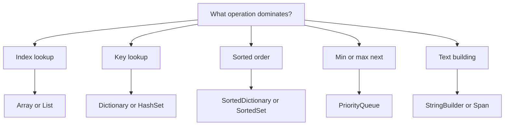

Knowing the algorithm is only half the C# coding round. The other half is choosing the right collection, avoiding hidden allocations, and writing boundary-safe numeric code quickly enough that the interviewer can focus on your reasoning.



> [!KEY]
> Arrays and strings use `.Length`; most collections use `.Count`. `Dictionary[key]` throws when absent, so default to `TryGetValue` in interview code.

## Collections map

C# generics support value types without Java-style boxing for `List<int>` or `Dictionary<int,int>`, which is a major performance win. Still, each container has a real allocation shape: `List<T>` grows an internal array, `Dictionary<K,V>` maintains buckets and entries, `LinkedList<T>` allocates one node per element, and LINQ often creates iterators or full materialized collections.

In an interview, choose the container by the operation you need to make cheap, not by habit. If the prompt says repeated membership checks, build a `HashSet<T>` once. If it says next smallest or largest after every update, reach for a heap or sorted tree. If it says move a known item to the front, keep a linked-list node in a dictionary. These choices make your complexity claim believable because the data structure directly supports the operation being repeated.

Capacity is another small senior signal. If you know you will add `n` items, `new List<int>(n)` or `new Dictionary<int,int>(n)` avoids some resizing. Do not confuse capacity with count: a list created with capacity `n` is still empty. For dictionaries with string keys, pass `StringComparer.Ordinal` or `StringComparer.OrdinalIgnoreCase` when exact byte-like behavior is intended. That avoids culture-sensitive surprises and documents the equality rule.

| Need | .NET type | Operations | Allocation and caveats |
|---|---|---|---|
| Fixed indexed data | `T[]` | Read and write `O(1)` | Zero-filled, fixed length, best cache locality |
| Growable indexed data | `List<T>` | Index `O(1)`, add amortized `O(1)`, middle insert `O(n)` | Capacity overallocates, call `TrimExcess` only after building |
| Key to value | `Dictionary<K,V>` | Average `O(1)` lookup and update | No ordering, resizes, worst case degrades with collisions |
| Membership | `HashSet<T>` | Average `O(1)` add and contains | `Add` returns false when value already exists |
| Sorted keys | `SortedDictionary<K,V>` | `O(log n)` tree operations | Sorted enumeration, higher constant than hash map |
| Sorted set and ranges | `SortedSet<T>` | `O(log n)` add and contains | `GetViewBetween` supports range views |
| LIFO | `Stack<T>` | `Push`, `Pop`, `Peek` are `O(1)` amortized | Array-backed, no random access |
| FIFO | `Queue<T>` | `Enqueue`, `Dequeue`, `Peek` are `O(1)` amortized | Circular array, not a deque |
| Priority first | `PriorityQueue<TElement,TPriority>` | `Enqueue` and `Dequeue` `O(log n)`, `Peek` `O(1)` | Min-heap, no stable order for equal priorities |
| Known-node splicing | `LinkedList<T>` | Remove a known node `O(1)` | Searching for that node is still `O(n)` |

```csharp
var freq = new Dictionary<char, int>();
foreach (char c in s)
    freq[c] = freq.GetValueOrDefault(c) + 1;

if (freq.TryGetValue('x', out int count))
    Console.WriteLine(count);

var minHeap = new PriorityQueue<string, int>();
minHeap.Enqueue("task", priority: 5);
minHeap.TryDequeue(out string item, out int priority);

var maxHeap = new PriorityQueue<int, int>(
    Comparer<int>.Create((a, b) => b.CompareTo(a)));
```

> [!WARNING]
> `PriorityQueue<TElement,TPriority>` orders by priority, not by element, and it is a min-heap. Equal priorities are not stable, so include a tie-breaker priority when order matters.

## Arrays strings and spans

Arrays are the fastest default for known-size numeric data. Rectangular arrays use `int[,] grid = new int[m, n]` and lengths via `GetLength(0)` and `GetLength(1)`. Jagged arrays use `int[][] grid = new int[m][]` and then allocate each row; they are common on LeetCode and often faster in tight row-major loops because each row is a normal one-dimensional array.

Initialization matters because C# zero-fills arrays for you. A fresh `bool[]` is already false and a fresh `int[]` is already zero, so only call `Array.Fill` when the sentinel is different. For lists, capacity is a useful hint when the output size is known; `new List<int>(n)` avoids repeated growth but does not create `n` elements.

Character handling has one more trap. `char` is a UTF-16 code unit, which is fine for most coding-round lowercase-letter problems but not the same as a full Unicode text element. If the prompt says lowercase English letters, an `int[26]` is faster and clearer than a dictionary. If it says arbitrary user text, avoid assuming one `char` equals one visible character unless the interviewer agrees.

Strings are immutable. Repeated `+=` in a loop copies over and over, so build with `StringBuilder`. Slicing a string with range syntax creates a new string; slicing a span does not allocate. `ReadOnlySpan<char>` is useful for parsing or comparing pieces of a string, but it is a stack-only `ref struct`: do not store it in fields, box it, or capture it in async code.

```csharp
var a = new int[n];
Array.Fill(a, -1);
var matrix = new int[rows, cols];
var jagged = new int[rows][];
for (int r = 0; r < rows; r++) jagged[r] = new int[cols];

var sb = new StringBuilder();
foreach (char c in word) sb.Append(char.ToUpperInvariant(c));
string built = sb.ToString();

ReadOnlySpan<char> line = "123,456".AsSpan();
int comma = line.IndexOf(',');
int left = int.Parse(line[..comma]);
int right = int.Parse(line[(comma + 1)..]);
```

| Task | Allocation-free option | Allocation warning |
|---|---|---|
| Build long text | `StringBuilder` | `s += part` in a loop is quadratic |
| Parse substring | `ReadOnlySpan<char>` with `int.Parse(span)` | `Substring` allocates a new string |
| Sort characters | `char[] chars = s.ToCharArray(); Array.Sort(chars);` | New string is needed for the final result |
| Case-insensitive keys | `StringComparer.OrdinalIgnoreCase` | Avoid culture surprises from lowercasing manually |

## Sorting search and lightweight state

`Array.Sort` and `List<T>.Sort` are in-place and not stable. LINQ `OrderBy` is stable, but it allocates and is deferred until enumeration. Comparers should use `CompareTo` or `Comparer<T>.Default.Compare`; subtraction can overflow and break ordering.

```csharp
Array.Sort(intervals, (a, b) => {
    int byStart = a[0].CompareTo(b[0]);
    return byStart != 0 ? byStart : a[1].CompareTo(b[1]);
});

var ordered = words.OrderBy(w => w.Length).ThenBy(w => w).ToArray();

int idx = Array.BinarySearch(nums, target);
int insertion = idx >= 0 ? idx : ~idx;

Queue<(int Row, int Col)> q = new();
q.Enqueue((0, 0));
var (row, col) = q.Dequeue();
```

| API | Stable | Notes |
|---|---|---|
| `Array.Sort(T[])` | No | In-place introspective sort |
| `List<T>.Sort` | No | In-place, same comparer style |
| `OrderBy().ThenBy()` | Yes | Deferred, allocates when materialized |
| `Array.BinarySearch` | Not applicable | Miss returns bitwise complement of insertion point |

Tuples are ideal for small states such as coordinates, heap entries, or dictionary keys: `(int r, int c)` is a `ValueTuple<int,int>` and compares structurally in dictionaries. For public domain objects or many fields, prefer a named record or class.

## Fast input output and LINQ discipline

For small interview examples, `Console.ReadLine()` with `Split(' ', StringSplitOptions.RemoveEmptyEntries)` is fine. For large competitive-style input, read bytes and parse integers. Accumulate output in a `StringBuilder` and write once to avoid flushing line by line.

```csharp
public sealed class FastScanner {
    private readonly Stream _stream = Console.OpenStandardInput();
    private readonly byte[] _buffer = new byte[1 << 16];
    private int _len, _ptr;

    private int Read() {
        if (_ptr >= _len) {
            _len = _stream.Read(_buffer, 0, _buffer.Length);
            _ptr = 0;
            if (_len == 0) return -1;
        }
        return _buffer[_ptr++];
    }

    public int NextInt() {
        int c;
        do c = Read(); while (c <= 32 && c != -1);
        int sign = 1;
        if (c == '-') { sign = -1; c = Read(); }
        int value = 0;
        while (c > 32 && c != -1) {
            value = value * 10 + c - '0';
            c = Read();
        }
        return value * sign;
    }
}
```

LINQ is excellent for setup, tests, and one-off transformations. It is risky in hot loops because it can allocate iterators, hide repeated enumeration, and make early exits awkward. `Count()` is O(1) on collections that expose a count, but it enumerates a plain `IEnumerable<T>`. `GroupBy`, `OrderBy`, `ToList`, and `ToArray` allocate by design.

A safe interview rule is to use LINQ outside the asymptotic core. Preparing a lookup table, sorting a small answer for display, or asserting a condition in a unit-style check is fine. Updating a sliding window, relaxing graph edges, or filling a DP table should be an explicit loop so the interviewer can trace every mutation.

Deferred execution is the LINQ behavior candidates most often forget. Saving `var evens = nums.Where(x => x % 2 == 0);` does not run the filter. Enumerating `evens` twice runs it twice unless you materialize with `ToList` or `ToArray`. That can be useful for streaming, but it can also turn a linear preprocessing step into repeated work inside another loop.

```csharp
int[] zeros = Enumerable.Repeat(0, n).ToArray();
var groups = words.GroupBy(w => w.Length)
                  .ToDictionary(g => g.Key, g => g.ToList());

// Prefer a loop when the operation is the algorithm's hot path.
int sum = 0;
foreach (int x in nums) sum += x;
```

> [!TIP]
> LINQ is fine for making input readable. If the interviewer asks for complexity, include materialization and repeated enumeration costs instead of treating every chain as free.

## Numeric traps and Java equivalence

C# integer arithmetic can overflow silently unless the expression is in a `checked` context. Use `long` for sums, products of two `int`s, prefix sums, and counts that may exceed two billion. Use `BigInteger` only when the mathematical result itself is unbounded; it is slower and changes the problem's memory profile.

Modulo and division deserve the same care. `int / int` truncates toward zero, and `%` keeps the sign of the left operand, so normalize negative remainders before using them as array indices. For binary search, compute the midpoint as `lo + (hi - lo) / 2`; it is both familiar to interviewers and safe for large positive bounds.

```csharp
long product = (long)a * b;
long exact = Math.BigMul(a, b);

checked {
    int risky = x + y;
}

BigInteger huge = BigInteger.One;
for (int i = 2; i <= n; i++) huge *= i;
```

| Java idea | C# equivalent | Difference to say out loud |
|---|---|---|
| `ArrayList<Integer>` | `List<int>` | C# generics avoid boxing for `int` values |
| `HashMap<K,V>` | `Dictionary<K,V>` | Use `TryGetValue` instead of `containsKey` plus indexer |
| `HashSet<T>` | `HashSet<T>` | `Add` returns whether the value was new |
| `TreeMap<K,V>` | `SortedDictionary<K,V>` | Tree operations are `O(log n)`, navigation API is less rich |
| `TreeSet<T>` | `SortedSet<T>` | `GetViewBetween` gives range views |
| `ArrayDeque` | `Stack<T>` and `Queue<T>` | .NET has no single built-in array deque |
| `PriorityQueue<T>` | `PriorityQueue<TElement,TPriority>` | Element and priority are separate type parameters |
| `record` or small class | `ValueTuple` or `record struct` | Tuples are good local state, records are clearer APIs |
| `StringBuilder` | `StringBuilder` | Same purpose, use for looped text construction |

## Cheat sheet

- Arrays and strings use `.Length`; `List<T>`, `Dictionary<K,V>`, `Queue<T>`, and `Stack<T>` use `.Count`.
- `Dictionary[key]` throws if absent; `TryGetValue` performs lookup and value retrieval together.
- `List<T>.Add` is amortized O(1); `Insert(0, x)` and `RemoveAt(0)` are O(n).
- `PriorityQueue<TElement,TPriority>` is a min-heap and is not stable for equal priorities.
- `Array.Sort` and `List<T>.Sort` are unstable; `OrderBy` is stable but allocates.
- Binary search miss uses `~index` as the insertion point.
- Use `StringBuilder` for repeated concatenation and spans for allocation-free parsing slices.
- Cast before arithmetic overflow can occur: `(long)a * b`, not `(long)(a * b)`.
- Use `StringComparer.Ordinal` or `OrdinalIgnoreCase` for predictable string keys.
- Keep one `Random` instance; do not create a new one for every pick.

## Common mistakes

| Mistake | Fix |
|---|---|
| Calling `arr.Count` or `list.Length` | Arrays and strings have `.Length`; collections have `.Count` |
| Using `dict[key]` for a maybe-absent key | Use `TryGetValue` or `GetValueOrDefault` |
| Comparator written as `a - b` | Use `a.CompareTo(b)` to avoid overflow |
| Assuming `Array.Sort` is stable | Use `OrderBy` when stability matters and cost is acceptable |
| Rebuilding strings with `+=` in a loop | Use `StringBuilder` |
| Treating LINQ chains as zero cost | Count iterator allocation, materialization, and repeated enumeration |
| Multiplying as `int` before casting | Cast one operand to `long` first |
| Removing from `List<T>` during `foreach` | Use an index loop, collect removals, or iterate a copy |

> [!DANGER]
> `string == string` compares values in C#, unlike Java reference comparison, but sorting and dictionaries still need explicit ordinal comparers when culture-sensitive behavior would be wrong.

## Summary

C# interview fluency comes from matching the operation to the collection and knowing which APIs hide allocation or overflow. Use arrays and `List<T>` for indexed data, dictionaries and sets for average O(1) lookup, sorted trees for ordered data, and priority queues for repeated minimum or maximum selection. Prefer `TryGetValue`, safe comparers, `StringBuilder`, spans for parsing, and early `long` promotion. These habits keep the code straightforward while making the complexity explanation precise. The best use of this reference is rehearsal: say the type, its dominant operation, and its trap before writing code. That turns C# from a source of syntax friction into a language that supports clear algorithm narration. The goal is not to use every advanced API; it is to know the simple API that preserves the intended complexity. When in doubt, choose explicit loops and clear types first, then introduce library shortcuts only when you can explain their cost and failure modes under edge input, empty collections, and large numeric limits. Simple, explicit code wins most rounds.

## Top Interview Questions

### Q1. Which C# collection should you choose for common algorithm patterns?

Use an array when the size is known and index access dominates; it is compact and fast. Use `List<T>` when you need amortized O(1) appends plus indexing. Use `Dictionary<K,V>` for key-to-value lookup and `HashSet<T>` for membership or duplicate checks. Use `SortedDictionary<K,V>` or `SortedSet<T>` when sorted iteration or range queries matter and O(log n) is acceptable. Use `Stack<T>` for LIFO and `Queue<T>` for FIFO. Use `PriorityQueue<TElement,TPriority>` for repeated min or max by priority. Use `LinkedList<T>` only when you already hold nodes and need O(1) splicing.

### Q2. Why is `TryGetValue` preferred over `ContainsKey` followed by indexing?

`ContainsKey` plus `dict[key]` performs two lookups and still leaves a gap where code can become noisy or inconsistent. `TryGetValue` does the existence check and retrieves the value in one call: `if (dict.TryGetValue(k, out var v))`. It also avoids `KeyNotFoundException` from the indexer. For frequency maps, `dict[k] = dict.GetValueOrDefault(k) + 1` is concise, while `TryGetValue` is useful when the absent branch needs custom initialization. In an interview, using these APIs signals that you understand both correctness and the cost of repeated hash lookups.

### Q3. What are the important details of .NET `PriorityQueue`?

It is a min-heap ordered by priority, with separate element and priority type parameters. `Enqueue` and `Dequeue` are O(log n), `Peek` is O(1), and equal priorities are not stable. To make a max-heap, pass a reversed comparer for the priority type or store negated priorities only when negation cannot overflow. There is no efficient decrease-key operation; the usual workaround is to enqueue a new entry and ignore stale entries when popped. This is common in Dijkstra-style code. Also remember that priority, not element, controls ordering, so composite tie-breakers should be encoded in the priority or comparer.

### Q4. When should you use `Span<T>` or `ReadOnlySpan<char>` in an interview?

Use spans when slicing or parsing would otherwise allocate many short strings, especially in custom parsers or tight loops. `ReadOnlySpan<char> part = s.AsSpan(start, length)` views the original string without copying, and APIs such as `int.Parse(ReadOnlySpan<char>)` can parse it directly. Do not overuse spans when ordinary strings keep the solution clearer and the input is small. Also know the limitation: spans are stack-only `ref struct` values, so they cannot be stored in fields, boxed, captured across `await`, or used in many LINQ scenarios. Mention them as an optimization, not as the default for every string problem.

### Q5. What should you say about sorting stability and comparers in C#?

`Array.Sort` and `List<T>.Sort` are in-place and not stable, so equal keys may change relative order. LINQ `OrderBy` and `ThenBy` are stable, but they allocate and are deferred until enumerated or materialized. Comparers should never subtract numeric values because subtraction can overflow and violate the comparer contract. Use `a.CompareTo(b)`, `Comparer<T>.Default.Compare(a, b)`, or a composed comparer. If a problem depends on preserving original order among equal keys, either include the original index as a tie-breaker or use stable LINQ sorting and state the allocation trade-off.

### Q6. When is LINQ acceptable in a coding interview solution?

LINQ is acceptable for setup, simple transformations, grouping small inputs, or making tests readable. It is less appropriate for the core hot loop of an algorithm where allocation, deferred execution, or repeated enumeration can obscure the true complexity. `Where` and `Select` are lazy; `ToList`, `ToArray`, `GroupBy`, and `OrderBy` allocate. `Count()` may be O(1) for collections but O(n) for a plain `IEnumerable<T>`. A strong answer is: use LINQ when it clarifies non-critical code, but write explicit loops for the algorithm you need to reason about, trace, and optimize.

### Q7. How do you handle integer overflow in C# algorithm problems?

Promote before the operation that can overflow. Write `(long)a * b`, not `(long)(a * b)`, because the latter multiplies in 32-bit first. Use `long` for prefix sums, pair products, counts of combinations, and binary-search bounds when limits are high. Use `checked` when overflow should be detected rather than wrapped, and use `BigInteger` only if the required mathematical answer is truly unbounded. Also avoid unsafe sentinels such as `int.MinValue` when you later add to them. C# often permits silent unchecked overflow, so defensive numeric types are part of correctness.

### Q8. What is the right fast input and output strategy in C#?

For ordinary interview platforms, `Console.ReadLine()` and `Split` are fine and easiest to read. If input is large, build a byte scanner over `Console.OpenStandardInput()` and parse integers manually to avoid per-line and per-token string allocations. For output, append to a `StringBuilder` and call `Console.Write` once, especially when printing many lines. Avoid flushing on every item. The key is to match the platform: do not burden a simple LeetCode method with a custom scanner, but be ready to write one for contest-style tasks where I/O dominates runtime.

### Q9. How do you explain C# collections to a Java-speaking interviewer?

Map the familiar types first: Java `ArrayList<Integer>` is C# `List<int>`, `HashMap` is `Dictionary`, `HashSet` is `HashSet`, `TreeMap` is `SortedDictionary`, and `TreeSet` is `SortedSet`. Then name the differences that affect code. C# generics store value types without boxing, so `List<int>` is not like `ArrayList<Integer>` internally. There is no single built-in `ArrayDeque`; use `Stack<T>`, `Queue<T>`, or a custom deque. `PriorityQueue` separates element and priority. Strings compare by value with `==`, but ordinal comparers are still important for predictable dictionaries and sorting.

### Q10. How do tuples and `out` parameters help write concise C# interview code?

`ValueTuple` gives lightweight named state without defining a class: queues can hold `(int Row, int Col)`, methods can return `(int min, int max)`, and dictionary keys can be `(int r, int c)`. Deconstruction keeps code readable when the state is small. `out` parameters appear in `TryGetValue`, `TryParse`, and priority queue dequeue methods, letting one call return success plus a value without exceptions. The balance is clarity: tuples are excellent local glue, but if a state grows beyond a few fields or crosses an API boundary, a named record or class explains intent better.