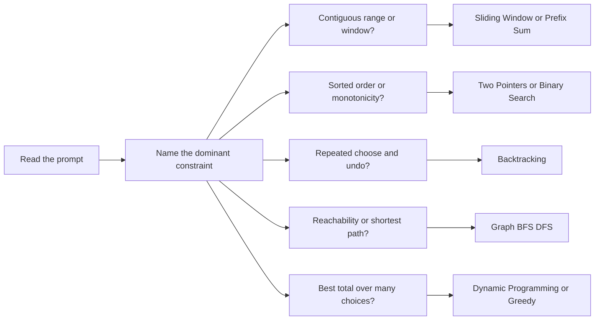

This page is the problem-library companion to the pattern pages. Instead of teaching a technique in isolation, it shows the canonical interview problem where that technique earns its keep, with complete Java implementations you can compare against your own. The fastest way to use it is to read a prompt, name the pattern family first, then jump to the matching section and check whether your invariant, state, and complexity story line up with the worked version here.



> [!KEY]
> In interviews, say the wasted work before you say the trick. Once you can name the bottleneck as repeated scanning, repeated branching, or repeated re-sorting, the right pattern usually becomes obvious.

> [!TIP]
> Use this page after you can already state a brute-force solution. Interviewers usually score the transition from correct-but-slow to optimal almost as highly as the final code.

**Arrays, Strings and Hashing**

| Problem | Pattern | Technique | Complexity |
|---|---|---|---|
| Maximum Subarray | Arrays | Kadane running sum | `O(n)/O(1)` |
| Best Time to Buy and Sell Stock | Arrays | Reverse scan with suffix max | `O(n)/O(1)` |
| Majority Element | Arrays | Boyer-Moore vote | `O(n)/O(1)` |
| Product of Array Except Self | Arrays | Prefix and suffix products | `O(n)/O(n)` |
| Maximum Product Subarray | Arrays | Prefix and suffix products with zero reset | `O(n)/O(1)` |
| Find All Duplicates in an Array | Arrays | Index marking by negation | `O(n)/O(1)` |
| Find the Duplicate Number | Arrays | Floyd cycle detection | `O(n)/O(1)` |
| Sort Colors | Arrays | Dutch national flag partition | `O(n)/O(1)` |
| Rotate Array | Arrays | Triple reverse | `O(n)/O(1)` |
| Next Permutation | Arrays | Pivot swap and suffix reverse | `O(n)/O(1)` |
| Spiral Matrix | Arrays | Boundary simulation | `O(rows * cols)/O(1)` |
| Set Matrix Zeroes | Arrays | First row and first column markers | `O(rows * cols)/O(1)` |
| Rotate Image | Arrays | Transpose then reverse rows | `O(n^2)/O(1)` |
| Longest Common Prefix | Strings | Vertical scan | `O(C)/O(1)` |
| Encode and Decode Strings | Strings | Length-prefix encoding | `O(C)/O(C)` |
| Contains Duplicate | Hashing | HashSet membership | `O(n)/O(n)` |
| Valid Anagram | Hashing | Frequency map | `O(n + m)/O(k)` |
| Two Sum | Hashing | Complement lookup map | `O(n)/O(n)` |
| Group Anagrams | Hashing | Sorted-string key | `O(n * k log k)/O(n * k)` |
| Subarray Sum Equals K | Hashing | Prefix sum counts | `O(n)/O(n)` |
| Longest Consecutive Sequence | Hashing | Start-of-sequence HashSet scan | `O(n)/O(n)` |
| 3Sum | Hashing | Fix one and run hash-based Two Sum | `O(n^2)/O(n)` |

**Pointers, Windows, Stacks, Linked Lists and Search**

| Problem | Pattern | Technique | Complexity |
|---|---|---|---|
| Valid Palindrome | 2 Pointers | Skip non-alphanumerics from both ends | `O(n)/O(1)` |
| Remove Duplicates from Sorted Array | 2 Pointers | Slow and fast overwrite | `O(n)/O(1)` |
| Two Sum II | 2 Pointers | Opposite ends on sorted array | `O(n)/O(1)` |
| Container With Most Water | 2 Pointers | Move the shorter wall | `O(n)/O(1)` |
| Trapping Rain Water | 2 Pointers | Two pointers or prefix-suffix maxima | `O(n)/O(1); O(n)/O(n)` |
| Palindromic Substrings | 2 Pointers | Expand centers or palindrome DP | `O(n^2)/O(1); O(n^2)/O(n^2)` |
| Longest Substring Without Repeating Characters | Sliding Window | HashSet window or last-seen index | `O(n)/O(k)` |
| Longest Repeating Character Replacement | Sliding Window | Valid while `window - maxFreq <= k` | `O(n)/O(k)` |
| Minimum Window Substring | Sliding Window | Need and window counts with formed targets | `O(\|s\| + \|t\|)/O(k)` |
| Subarray Product Less Than K | Sliding Window | Shrink while product is too large | `O(n)/O(1)` |
| Valid Parentheses | Stack | Push expected closing bracket | `O(n)/O(n)` |
| Evaluate Reverse Polish Notation | Stack | Push operands and pop two on operator | `O(n)/O(n)` |
| Min Stack | Stack design | Value stack plus running-min stack | `O(1) per op/O(n)` |
| Implement Queue Using Stacks | Queue design | In-stack and out-stack amortization | `Push O(1), Pop O(1) amortized/O(n)` |
| Implement Stack Using Queue | Stack design | Rotate queue after each push | `Push O(n), Pop O(1)/O(n)` |
| Sliding Window Maximum | Monotonic deque | Decreasing deque or max-heap | `O(n)/O(k); O(n log n)/O(n)` |
| Next Greater Element II | Monotonic stack | Scan the circular array twice | `O(n)/O(n)` |
| Remove K Digits | Monotonic stack | Pop larger left digits greedily | `O(n)/O(n)` |
| Largest Rectangle in Histogram | Monotonic stack | Previous and next smaller arrays | `O(n)/O(n)` |
| Merge Two Sorted Lists | Linked List | Dummy head merge | `O(n + m)/O(1)` |
| Remove Nth Node From End | Linked List | Length pass then delete | `O(n)/O(1)` |
| Palindrome Linked List | Linked List | Middle, reverse second half, compare | `O(n)/O(1)` |
| Reorder List | Linked List | Middle, reverse second half, weave | `O(n)/O(1)` |
| Copy List with Random Pointer | Linked List | Hash map or interleaving copy | `O(n)/O(n); O(n)/O(1)` |
| Merge K Sorted Lists | Linked List | Min-heap of list heads | `O(N log k)/O(k)` |
| LRU Cache | Design | Hash map plus doubly linked list | `O(1) avg/O(capacity)` |
| Find Minimum in Rotated Sorted Array | Binary Search | Compare mid with right | `O(log n)/O(1)` |
| Search in Rotated Sorted Array | Binary Search | Identify the sorted half | `O(log n)/O(1)` |
| Koko Eating Bananas | Binary Search | Brute force or search on answer | `O(N * maxPile)/O(1); O(N log maxPile)/O(1)` |

**Heaps, Trees and Graphs**

| Problem | Pattern | Technique | Complexity |
|---|---|---|---|
| Top K Frequent Elements | Heap | Min-heap of size k or bucket sort | `O(n log k)/O(n); O(n)/O(n)` |
| Find Median from Data Stream | Heap | Two heaps with rebalancing | `Add O(log n), Median O(1)/O(n)` |
| Task Scheduler | Heap | Cooldown simulation or counting formula | `O(T log k)/O(k); O(T + k)/O(k)` |
| Same Tree | Tree | Recursive structural comparison | `O(n)/O(h)` |
| Invert Binary Tree | Tree | Swap children on DFS | `O(n)/O(h)` |
| Path Sum | Tree | Subtract target down root-to-leaf path | `O(n)/O(h)` |
| Validate Binary Search Tree | Tree | Min and max bounds | `O(n)/O(h)` |
| Kth Smallest Element in a BST | Tree | Inorder traversal stops at k | `O(h + k)/O(h)` |
| Lowest Common Ancestor of a BST | Tree | Divide by BST ordering | `O(h)/O(1)` iterative |
| Lowest Common Ancestor of a Binary Tree | Tree | Return the split point from subtrees | `O(n)/O(h)` |
| Subtree of Another Tree | Tree | Same-tree check at every node | `O(N * M)/O(H + h)` |
| Construct Binary Tree from Preorder and Inorder | Tree | Preorder root plus inorder index map | `O(n)/O(n)` |
| Serialize and Deserialize Binary Tree | Tree | Preorder with null markers | `O(n)/O(n)` |
| Binary Tree Maximum Path Sum | Tree | Postorder max-gain DP | `O(n)/O(h)` |
| Number of Islands | Graph | Flood-fill connected components | `O(rows * cols)/O(rows * cols)` |
| Clone Graph | Graph | DFS with original-to-copy map | `O(V + E)/O(V)` |
| Rotting Oranges | Graph | Multi-source BFS by minute | `O(rows * cols)/O(rows * cols)` |
| Is Graph Bipartite | Graph | 0-1 coloring by component | `O(V + E)/O(V)` |
| Graph Valid Tree | Graph | `n - 1` edges plus connectivity check | `O(V + E)/O(V)` |
| Redundant Connection | Graph | Union-Find first failed union | `O(E * alpha(V))/O(V)` |
| Pacific Atlantic Water Flow | Graph | Reverse DFS from both oceans | `O(rows * cols)/O(rows * cols)` |
| Word Ladder | Graph | Pattern buckets for one-letter neighbors | `O(N * L^2)/O(N * L)` |
| Network Delay Time | Graph | Dijkstra shortest paths | `O((V + E) log V)/O(V + E)` |
| Alien Dictionary | Graph | Topological sort over precedence edges | `O(C + V + E)/O(V + E)` |

**Backtracking, Greedy, DP and Bit**

| Problem | Pattern | Technique | Complexity |
|---|---|---|---|
| Subsets | Backtracking | Include or exclude each element | `O(N * 2^N)/O(N)` |
| Subsets II | Backtracking | Sort and skip duplicate siblings | `O(N * 2^N)/O(N)` |
| Permutations | Backtracking | Used-array build or in-place swapping | `O(N * N!)/O(N)` |
| Combination Sum | Backtracking | Reuse the same index while shrinking target | `O(N^(T/m))/O(T/m)` |
| Combination Sum II | Backtracking | Choose once and skip duplicate siblings | `O(N * 2^N)/O(N)` |
| Word Search | Backtracking | DFS with mark and unmark | `O(rows * cols * 3^L)/O(L)` |
| Generate Parentheses | Backtracking | Open and close count pruning | `O(4^N / sqrt(N))/O(N)` |
| N-Queens | Backtracking | Brute force or conflict sets | `O(N^N)/O(N); O(N!)/O(N)` |
| Meeting Rooms I | Greedy and Intervals | Sort by start and compare neighbors | `O(n log n)/O(log n)` |
| Merge Intervals | Greedy and Intervals | Max-heap descending by end | `O(n log n)/O(n)` |
| Insert Interval | Greedy and Intervals | Before, merge, after scan | `O(n)/O(n)` |
| Maximum Number of Non-Overlapping Intervals | Greedy and Intervals | Sort by end and take earliest finish | `O(n log n)/O(log n)` |
| Erase Overlap Intervals | Greedy and Intervals | Keep earliest end and remove conflicts | `O(n log n)/O(log n)` |
| Meeting Rooms II | Greedy and Intervals | Sweep line with start and end events | `O(n log n)/O(n)` |
| Minimum Number of Arrows to Burst Balloons | Greedy and Intervals | Sort by end and shoot at end | `O(n log n)/O(log n)` |
| Jump Game | Greedy and Intervals | Track the farthest reachable index | `O(n)/O(1)` |
| Jump Game II | Greedy and Intervals | Expand one reachable frontier at a time | `O(n)/O(1)` |
| Gas Station | Greedy and Intervals | Total surplus plus reset on negative prefix | `O(n)/O(1)` |
| Climbing Stairs | DP | Fibonacci table | `O(n)/O(n)` |
| Unique Paths | DP | Grid path-count recurrence | `O(rows * cols)/O(rows * cols)` |
| Minimum Path Sum | DP | Grid cost accumulation | `O(rows * cols)/O(rows * cols)` |
| House Robber | DP | Max of rob and skip per house | `O(n)/O(n)` |
| House Robber II | DP | Two linear DPs for the circle | `O(n)/O(n)` |
| House Robber III | DP | Return rob and skip totals per node | `O(N)/O(H)` |
| Decode Ways | DP | One-digit and two-digit transitions | `O(n)/O(n)` |
| Word Break | DP | `dp[i]` over split points | `O(n^3)/O(n)` as written in Java because `substring` copies |
| Partition Equal Subset Sum | DP | 0/1 knapsack to `total / 2` | `O(n * target)/O(target)` |
| Edit Distance | DP | Insert, delete, replace recurrence | `O(m * n)/O(m * n)` |
| Best Time to Buy and Sell Stock with Cooldown | DP | Hold, sold, rest state machine | `O(n)/O(1)` |
| Longest Increasing Path in a Matrix | DP | Memoized DFS from each cell | `O(rows * cols)/O(rows * cols)` |
| Single Number | Bit | XOR cancellation | `O(n)/O(1)` |
| Missing Number from 1 to n | Bit | XOR all expected and seen values | `O(n)/O(1)` |
| Number of 1 Bits | Bit | Strip the lowest set bit each step | `O(p)/O(1)` |
| Sum of Two Integers | Bit | XOR for sum and AND-shift for carry | `O(w)/O(1)` |

> [!NOTE]
> If two problems share nearly the same invariant, practice them back to back. `Two Sum` to `3Sum`, `House Robber` to `House Robber II`, and `LCA of BST` to `LCA of Binary Tree` are all really variant drills more than fresh patterns.

## Arrays

### Maximum Subarray

**Time:** `O(n)` | **Space:** `O(1)`

```java
class Solution {
    public int maxSubArray(int[] nums) {
        int best = nums[0];
        int running = nums[0];

        for (int i = 1; i < nums.length; i++) {
            running = Math.max(nums[i], running + nums[i]);
            best = Math.max(best, running);
        }

        return best;
    }
}
```

### Best Time to Buy and Sell Stock

**Time:** `O(n)` | **Space:** `O(1)`

```java
class Solution {
    public int maxProfit(int[] prices) {
        if (prices.length == 0)
            return 0;

        int maxSell = prices[prices.length - 1];
        int best = 0;

        for (int i = prices.length - 2; i >= 0; i--) {
            best = Math.max(best, maxSell - prices[i]);
            maxSell = Math.max(maxSell, prices[i]);
        }

        return best;
    }
}
```

### Majority Element

**Time:** `O(n)` | **Space:** `O(1)`

```java
class Solution {
    public int majorityElement(int[] nums) {
        int candidate = 0;
        int count = 0;

        for (int num : nums) {
            if (count == 0)
                candidate = num;

            count += num == candidate ? 1 : -1;
        }

        return candidate;
    }
}
```

### Product of Array Except Self

**Time:** `O(n)` | **Space:** `O(n)` for the prefix and suffix arrays

```java
class Solution {
    public int[] productExceptSelf(int[] nums) {
        int n = nums.length;
        int[] prefix = new int[n];
        int[] suffix = new int[n];
        int[] result = new int[n];

        prefix[0] = 1;
        for (int i = 1; i < n; i++)
            prefix[i] = prefix[i - 1] * nums[i - 1];

        suffix[n - 1] = 1;
        for (int i = n - 2; i >= 0; i--)
            suffix[i] = suffix[i + 1] * nums[i + 1];

        for (int i = 0; i < n; i++)
            result[i] = prefix[i] * suffix[i];

        return result;
    }
}
```

### Maximum Product Subarray

**Time:** `O(n)` | **Space:** `O(1)`

```java
class Solution {
    public int maxProduct(int[] nums) {
        int best = Integer.MIN_VALUE;
        int prefix = 1;
        int suffix = 1;
        int n = nums.length;

        for (int i = 0; i < n; i++) {
            prefix = (prefix == 0 ? 1 : prefix) * nums[i];
            suffix = (suffix == 0 ? 1 : suffix) * nums[n - 1 - i];
            best = Math.max(best, Math.max(prefix, suffix));
        }

        return best;
    }
}
```

### Find All Duplicates in an Array

**Time:** `O(n)` | **Space:** `O(1)` excluding the result

```java
class Solution {
    public List<Integer> findDuplicates(int[] nums) {
        List<Integer> result = new ArrayList<>();

        for (int i = 0; i < nums.length; i++) {
            int index = Math.abs(nums[i]) - 1;
            if (nums[index] < 0)
                result.add(index + 1);
            else
                nums[index] = -nums[index];
        }

        return result;
    }
}
```

### Find the Duplicate Number

**Time:** `O(n)` | **Space:** `O(1)`

```java
class Solution {
    public int findDuplicate(int[] nums) {
        int slow = nums[0];
        int fast = nums[0];

        do {
            slow = nums[slow];
            fast = nums[nums[fast]];
        } while (slow != fast);

        slow = nums[0];
        while (slow != fast) {
            slow = nums[slow];
            fast = nums[fast];
        }

        return slow;
    }
}
```

### Sort Colors

**Time:** `O(n)` | **Space:** `O(1)`

```java
class Solution {
    public void sortColors(int[] nums) {
        int low = 0;
        int mid = 0;
        int high = nums.length - 1;

        while (mid <= high) {
            if (nums[mid] == 0) {
                swap(nums, low++, mid++);
            } else if (nums[mid] == 1) {
                mid++;
            } else {
                swap(nums, mid, high--);
            }
        }
    }

    private static void swap(int[] nums, int i, int j) {
        int tmp = nums[i];
        nums[i] = nums[j];
        nums[j] = tmp;
    }
}
```

### Rotate Array

**Time:** `O(n)` | **Space:** `O(1)`

```java
class Solution {
    public void rotate(int[] nums, int k) {
        if (nums.length == 0)
            return;

        int n = nums.length;
        k %= n;

        reverse(nums, 0, n - 1);
        reverse(nums, 0, k - 1);
        reverse(nums, k, n - 1);
    }

    private static void reverse(int[] nums, int left, int right) {
        while (left < right) {
            int tmp = nums[left];
            nums[left] = nums[right];
            nums[right] = tmp;
            left++;
            right--;
        }
    }
}
```

### Next Permutation

**Time:** `O(n)` | **Space:** `O(1)`

```java
class Solution {
    public void nextPermutation(int[] nums) {
        int pivot = nums.length - 2;
        while (pivot >= 0 && nums[pivot] >= nums[pivot + 1])
            pivot--;

        if (pivot >= 0) {
            int successor = nums.length - 1;
            while (nums[successor] <= nums[pivot])
                successor--;

            swap(nums, pivot, successor);
        }

        reverse(nums, pivot + 1, nums.length - 1);
    }

    private static void swap(int[] nums, int i, int j) {
        int tmp = nums[i];
        nums[i] = nums[j];
        nums[j] = tmp;
    }

    private static void reverse(int[] nums, int left, int right) {
        while (left < right) {
            swap(nums, left, right);
            left++;
            right--;
        }
    }
}
```

### Spiral Matrix

**Time:** `O(rows * cols)` | **Space:** `O(1)` excluding the result

```java
class Solution {
    public List<Integer> spiralOrder(int[][] matrix) {
        List<Integer> result = new ArrayList<>();
        int top = 0;
        int bottom = matrix.length - 1;
        int left = 0;
        int right = matrix[0].length - 1;

        while (top <= bottom && left <= right) {
            for (int col = left; col <= right; col++)
                result.add(matrix[top][col]);
            top++;

            for (int row = top; row <= bottom; row++)
                result.add(matrix[row][right]);
            right--;

            if (top <= bottom) {
                for (int col = right; col >= left; col--)
                    result.add(matrix[bottom][col]);
                bottom--;
            }

            if (left <= right) {
                for (int row = bottom; row >= top; row--)
                    result.add(matrix[row][left]);
                left++;
            }
        }

        return result;
    }
}
```

### Set Matrix Zeroes

**Time:** `O(rows * cols)` | **Space:** `O(1)`

```java
class Solution {
    public void setZeroes(int[][] matrix) {
        int rows = matrix.length;
        int cols = matrix[0].length;
        boolean zeroFirstRow = false;
        boolean zeroFirstCol = false;

        for (int r = 0; r < rows; r++) {
            if (matrix[r][0] == 0)
                zeroFirstCol = true;
        }

        for (int c = 0; c < cols; c++) {
            if (matrix[0][c] == 0)
                zeroFirstRow = true;
        }

        for (int r = 1; r < rows; r++) {
            for (int c = 1; c < cols; c++) {
                if (matrix[r][c] == 0) {
                    matrix[r][0] = 0;
                    matrix[0][c] = 0;
                }
            }
        }

        for (int r = 1; r < rows; r++) {
            for (int c = 1; c < cols; c++) {
                if (matrix[r][0] == 0 || matrix[0][c] == 0)
                    matrix[r][c] = 0;
            }
        }

        if (zeroFirstRow) {
            for (int c = 0; c < cols; c++)
                matrix[0][c] = 0;
        }

        if (zeroFirstCol) {
            for (int r = 0; r < rows; r++)
                matrix[r][0] = 0;
        }
    }
}
```

### Rotate Image

**Time:** `O(n^2)` | **Space:** `O(1)`

```java
class Solution {
    public void rotate(int[][] matrix) {
        int n = matrix.length;

        for (int r = 0; r < n; r++) {
            for (int c = r; c < n; c++) {
                int tmp = matrix[r][c];
                matrix[r][c] = matrix[c][r];
                matrix[c][r] = tmp;
            }
        }

        for (int r = 0; r < n; r++)
            reverseRow(matrix[r]);
    }

    private static void reverseRow(int[] row) {
        int left = 0, right = row.length - 1;
        while (left < right) {
            int tmp = row[left];
            row[left] = row[right];
            row[right] = tmp;
            left++;
            right--;
        }
    }
}
```

## Strings

### Longest Common Prefix

**Time:** `O(C)` | **Space:** `O(1)` excluding the result, where `C` is the total number of characters examined

```java
class Solution {
    public String longestCommonPrefix(String[] strs) {
        if (strs.length == 0)
            return "";

        for (int i = 0; i < strs[0].length(); i++) {
            char ch = strs[0].charAt(i);
            for (int j = 1; j < strs.length; j++) {
                if (i == strs[j].length() || strs[j].charAt(i) != ch)
                    return strs[0].substring(0, i);
            }
        }

        return strs[0];
    }
}
```

### Encode and Decode Strings

**Time:** `O(C)` | **Space:** `O(C)` for the encoded or decoded result, where `C` is the total character count

```java
public class Codec {
    public String encode(List<String> strs) {
        StringBuilder builder = new StringBuilder();

        for (String s : strs) {
            builder.append(s.length());
            builder.append('#');
            builder.append(s);
        }

        return builder.toString();
    }

    public List<String> decode(String s) {
        List<String> result = new ArrayList<>();
        int i = 0;

        while (i < s.length()) {
            int hash = i;
            while (s.charAt(hash) != '#')
                hash++;

            int length = Integer.parseInt(s.substring(i, hash));
            int start = hash + 1;
            result.add(s.substring(start, start + length));
            i = start + length;
        }

        return result;
    }
}
```

## Hashing

### Contains Duplicate

**Time:** `O(n)` average | **Space:** `O(n)`

```java
class Solution {
    public boolean containsDuplicate(int[] nums) {
        Set<Integer> seen = new HashSet<>();

        for (int num : nums) {
            if (!seen.add(num))
                return true;
        }

        return false;
    }
}
```

### Valid Anagram

**Time:** `O(n + m)` | **Space:** `O(k)`, where `k` is the character-set size

```java
class Solution {
    public boolean isAnagram(String s, String t) {
        if (s.length() != t.length())
            return false;

        Map<Character, Integer> count = new HashMap<>();
        for (char ch : s.toCharArray())
            count.merge(ch, 1, Integer::sum);

        for (char ch : t.toCharArray()) {
            Integer value = count.get(ch);
            if (value == null)
                return false;

            if (value == 1)
                count.remove(ch);
            else
                count.put(ch, value - 1);
        }

        return count.isEmpty();
    }
}
```

### Two Sum

**Time:** `O(n)` average | **Space:** `O(n)`

```java
class Solution {
    public int[] twoSum(int[] nums, int target) {
        Map<Integer, Integer> indexByValue = new HashMap<>();

        for (int i = 0; i < nums.length; i++) {
            int need = target - nums[i];
            if (indexByValue.containsKey(need))
                return new int[] { indexByValue.get(need), i };

            indexByValue.put(nums[i], i);
        }

        return new int[0];
    }
}
```

### Group Anagrams

**Time:** `O(n * k log k)` | **Space:** `O(n * k)`, where `k` is the maximum string length

```java
class Solution {
    public List<List<String>> groupAnagrams(String[] strs) {
        Map<String, List<String>> groups = new HashMap<>();

        for (String word : strs) {
            char[] chars = word.toCharArray();
            Arrays.sort(chars);
            String key = new String(chars);

            groups.computeIfAbsent(key, k -> new ArrayList<>()).add(word);
        }

        return new ArrayList<>(groups.values());
    }
}
```

### Subarray Sum Equals K

**Time:** `O(n)` average | **Space:** `O(n)`

```java
class Solution {
    public int subarraySum(int[] nums, int k) {
        Map<Integer, Integer> prefixCount = new HashMap<>();
        prefixCount.put(0, 1);
        int sum = 0;
        int count = 0;

        for (int num : nums) {
            sum += num;
            count += prefixCount.getOrDefault(sum - k, 0);
            prefixCount.merge(sum, 1, Integer::sum);
        }

        return count;
    }
}
```

### Longest Consecutive Sequence

**Time:** `O(n)` average | **Space:** `O(n)`

```java
class Solution {
    public int longestConsecutive(int[] nums) {
        Set<Integer> values = new HashSet<>();
        for (int num : nums)
            values.add(num);
        int best = 0;

        for (int num : values) {
            if (values.contains(num - 1))
                continue;

            int length = 1;
            while (values.contains(num + length))
                length++;

            best = Math.max(best, length);
        }

        return best;
    }
}
```

### 3Sum

**Time:** `O(n^2)` | **Space:** `O(n)` with a hash-based Two Sum, excluding the result

```java
class Solution {
    public List<List<Integer>> threeSum(int[] nums) {
        Arrays.sort(nums);
        List<List<Integer>> result = new ArrayList<>();

        for (int i = 0; i < nums.length - 2; i++) {
            if (i > 0 && nums[i] == nums[i - 1])
                continue;

            Set<Integer> seen = new HashSet<>();
            for (int j = i + 1; j < nums.length; j++) {
                int need = -nums[i] - nums[j];
                if (seen.contains(need)) {
                    result.add(Arrays.asList(nums[i], need, nums[j]));
                    while (j + 1 < nums.length && nums[j] == nums[j + 1])
                        j++;
                } else {
                    seen.add(nums[j]);
                }
            }
        }

        return result;
    }
}
```

## 2 Pointers

### Valid Palindrome

**Time:** `O(n)` | **Space:** `O(1)`

```java
class Solution {
    public boolean isPalindrome(String s) {
        int left = 0;
        int right = s.length() - 1;

        while (left < right) {
            while (left < right && !Character.isLetterOrDigit(s.charAt(left)))
                left++;
            while (left < right && !Character.isLetterOrDigit(s.charAt(right)))
                right--;

            if (Character.toLowerCase(s.charAt(left)) != Character.toLowerCase(s.charAt(right)))
                return false;

            left++;
            right--;
        }

        return true;
    }
}
```

### Remove Duplicates from Sorted Array

**Time:** `O(n)` | **Space:** `O(1)`

```java
class Solution {
    public int removeDuplicates(int[] nums) {
        if (nums.length == 0)
            return 0;

        int slow = 1;
        for (int fast = 1; fast < nums.length; fast++) {
            if (nums[fast] != nums[fast - 1])
                nums[slow++] = nums[fast];
        }

        return slow;
    }
}
```

### Two Sum II on a Sorted Array

**Time:** `O(n)` | **Space:** `O(1)`

```java
class Solution {
    public int[] twoSum(int[] numbers, int target) {
        int left = 0;
        int right = numbers.length - 1;

        while (left < right) {
            int sum = numbers[left] + numbers[right];
            if (sum == target)
                return new int[] { left + 1, right + 1 };

            if (sum < target)
                left++;
            else
                right--;
        }

        return new int[0];
    }
}
```

### Container With Most Water

**Time:** `O(n)` | **Space:** `O(1)`

```java
class Solution {
    public int maxArea(int[] height) {
        int left = 0;
        int right = height.length - 1;
        int best = 0;

        while (left < right) {
            int width = right - left;
            int area = width * Math.min(height[left], height[right]);
            best = Math.max(best, area);

            if (height[left] < height[right])
                left++;
            else
                right--;
        }

        return best;
    }
}
```

### Trapping Rain Water

**Two pointers:** Time `O(n)`, Space `O(1)` | **Prefix/suffix arrays:** Time `O(n)`, Space `O(n)`

**Two pointers**

```java
class Solution {
    public int trap(int[] height) {
        int left = 0;
        int right = height.length - 1;
        int maxLeft = 0;
        int maxRight = 0;
        int water = 0;

        while (left < right) {
            if (height[left] < height[right]) {
                maxLeft = Math.max(maxLeft, height[left]);
                water += maxLeft - height[left];
                left++;
            } else {
                maxRight = Math.max(maxRight, height[right]);
                water += maxRight - height[right];
                right--;
            }
        }

        return water;
    }
}
```

**Prefix and suffix maxima**

```java
class Solution {
    public int trap(int[] height) {
        if (height.length == 0)
            return 0;

        int n = height.length;
        int[] prefixMax = new int[n];
        int[] suffixMax = new int[n];

        prefixMax[0] = height[0];
        for (int i = 1; i < n; i++)
            prefixMax[i] = Math.max(prefixMax[i - 1], height[i]);

        suffixMax[n - 1] = height[n - 1];
        for (int i = n - 2; i >= 0; i--)
            suffixMax[i] = Math.max(suffixMax[i + 1], height[i]);

        int water = 0;
        for (int i = 0; i < n; i++)
            water += Math.min(prefixMax[i], suffixMax[i]) - height[i];

        return water;
    }
}
```

> [!WARNING]
> In the two-pointer version, update `maxLeft` or `maxRight` before adding trapped water. Doing the subtraction first is the classic bug that creates negative water on the first few bars.

### Palindromic Substrings

**Expand centers:** Time `O(n^2)`, Space `O(1)` | **DP:** Time `O(n^2)`, Space `O(n^2)`

**Expand around every center**

```java
class Solution {
    public int countSubstrings(String s) {
        int count = 0;

        for (int center = 0; center < s.length(); center++) {
            count += expand(s, center, center);
            count += expand(s, center, center + 1);
        }

        return count;
    }

    private static int expand(String s, int left, int right) {
        int count = 0;
        while (left >= 0 && right < s.length() && s.charAt(left) == s.charAt(right)) {
            count++;
            left--;
            right++;
        }

        return count;
    }
}
```

**DP table**

```java
class Solution {
    public int countSubstrings(String s) {
        int n = s.length();
        boolean[][] dp = new boolean[n][n];
        int count = 0;

        for (int length = 1; length <= n; length++) {
            for (int left = 0; left + length - 1 < n; left++) {
                int right = left + length - 1;
                if (s.charAt(left) == s.charAt(right) && (length <= 2 || dp[left + 1][right - 1])) {
                    dp[left][right] = true;
                    count++;
                }
            }
        }

        return count;
    }
}
```

## Sliding Window

### Longest Substring Without Repeating Characters

**Time:** `O(n)` | **Space:** `O(k)`, where `k` is the character-set size

**HashSet window**

```java
class Solution {
    public int lengthOfLongestSubstring(String s) {
        Set<Character> window = new HashSet<>();
        int left = 0;
        int best = 0;

        for (int right = 0; right < s.length(); right++) {
            while (!window.add(s.charAt(right)))
                window.remove(s.charAt(left++));

            best = Math.max(best, right - left + 1);
        }

        return best;
    }
}
```

**Last-seen index optimization**

```java
class Solution {
    public int lengthOfLongestSubstring(String s) {
        Map<Character, Integer> lastSeen = new HashMap<>();
        int left = 0;
        int best = 0;

        for (int right = 0; right < s.length(); right++) {
            Integer previous = lastSeen.get(s.charAt(right));
            if (previous != null)
                left = Math.max(left, previous + 1);

            lastSeen.put(s.charAt(right), right);
            best = Math.max(best, right - left + 1);
        }

        return best;
    }
}
```

### Longest Repeating Character Replacement

**Time:** `O(n)` | **Space:** `O(k)`, where `k` is the character-set size

```java
class Solution {
    public int characterReplacement(String s, int k) {
        int[] frequency = new int[26];
        int left = 0;
        int maxFrequency = 0;
        int best = 0;

        for (int right = 0; right < s.length(); right++) {
            maxFrequency = Math.max(maxFrequency, ++frequency[s.charAt(right) - 'A']);

            while (right - left + 1 - maxFrequency > k) {
                frequency[s.charAt(left) - 'A']--;
                left++;
            }

            best = Math.max(best, right - left + 1);
        }

        return best;
    }
}
```

### Minimum Window Substring

**Time:** `O(|s| + |t|)` | **Space:** `O(k)`, where `k` is the character-set size

```java
class Solution {
    public String minWindow(String s, String t) {
        if (s.length() < t.length())
            return "";

        Map<Character, Integer> need = new HashMap<>();
        for (char ch : t.toCharArray())
            need.merge(ch, 1, Integer::sum);

        Map<Character, Integer> window = new HashMap<>();
        int required = need.size();
        int formed = 0;
        int left = 0;
        int bestStart = 0;
        int bestLength = Integer.MAX_VALUE;

        for (int right = 0; right < s.length(); right++) {
            char ch = s.charAt(right);
            window.merge(ch, 1, Integer::sum);

            if (need.containsKey(ch) && window.get(ch).intValue() == need.get(ch).intValue())
                formed++;

            while (formed == required) {
                if (right - left + 1 < bestLength) {
                    bestLength = right - left + 1;
                    bestStart = left;
                }

                char leftChar = s.charAt(left++);
                window.merge(leftChar, -1, Integer::sum);
                if (need.containsKey(leftChar) && window.get(leftChar) < need.get(leftChar))
                    formed--;
            }
        }

        return bestLength == Integer.MAX_VALUE ? "" : s.substring(bestStart, bestStart + bestLength);
    }
}
```

### Subarray Product Less Than K

**Time:** `O(n)` | **Space:** `O(1)`

```java
class Solution {
    public int numSubarrayProductLessThanK(int[] nums, int k) {
        if (k <= 1)
            return 0;

        int left = 0;
        long product = 1;
        int count = 0;

        for (int right = 0; right < nums.length; right++) {
            product *= nums[right];
            while (product >= k)
                product /= nums[left++];

            count += right - left + 1;
        }

        return count;
    }
}
```

## Stack and Queue

### Valid Parentheses

**Time:** `O(n)` | **Space:** `O(n)`

```java
class Solution {
    public boolean isValid(String s) {
        Deque<Character> stack = new ArrayDeque<>();

        for (char ch : s.toCharArray()) {
            if (ch == '(')
                stack.push(')');
            else if (ch == '[')
                stack.push(']');
            else if (ch == '{')
                stack.push('}');
            else if (stack.isEmpty() || stack.pop() != ch)
                return false;
        }

        return stack.isEmpty();
    }
}
```

### Evaluate Reverse Polish Notation

**Time:** `O(n)` | **Space:** `O(n)`

```java
class Solution {
    public int evalRPN(String[] tokens) {
        Deque<Integer> stack = new ArrayDeque<>();

        for (String token : tokens) {
            switch (token) {
                case "+": {
                    int b = stack.pop();
                    int a = stack.pop();
                    stack.push(a + b);
                    break;
                }
                case "-": {
                    int b = stack.pop();
                    int a = stack.pop();
                    stack.push(a - b);
                    break;
                }
                case "*": {
                    int b = stack.pop();
                    int a = stack.pop();
                    stack.push(a * b);
                    break;
                }
                case "/": {
                    int b = stack.pop();
                    int a = stack.pop();
                    stack.push(a / b);
                    break;
                }
                default:
                    stack.push(Integer.parseInt(token));
                    break;
            }
        }

        return stack.peek();
    }
}
```

### Min Stack

**Time:** `O(1)` per operation | **Space:** `O(n)`

```java
class MinStack {
    private final Deque<Integer> values = new ArrayDeque<>();
    private final Deque<Integer> minimums = new ArrayDeque<>();

    public void push(int val) {
        values.push(val);
        if (minimums.isEmpty())
            minimums.push(val);
        else
            minimums.push(Math.min(val, minimums.peek()));
    }

    public void pop() {
        values.pop();
        minimums.pop();
    }

    public int top() {
        return values.peek();
    }

    public int getMin() {
        return minimums.peek();
    }
}
```

### Implement Queue Using Two Stacks

**Time:** Enqueue `O(1)`, dequeue `O(1)` amortized | **Space:** `O(n)`

```java
class MyQueue {
    private final Deque<Integer> input = new ArrayDeque<>();
    private final Deque<Integer> output = new ArrayDeque<>();

    public void push(int x) {
        input.push(x);
    }

    public int pop() {
        moveIfNeeded();
        return output.pop();
    }

    public int peek() {
        moveIfNeeded();
        return output.peek();
    }

    public boolean empty() {
        return input.isEmpty() && output.isEmpty();
    }

    private void moveIfNeeded() {
        if (!output.isEmpty())
            return;

        while (!input.isEmpty())
            output.push(input.pop());
    }
}
```

### Implement Stack Using One Queue

**Time:** Push `O(n)`, pop and peek `O(1)` | **Space:** `O(n)`

```java
class MyStack {
    private final Deque<Integer> queue = new ArrayDeque<>();

    public void push(int x) {
        queue.offer(x);
        int rotations = queue.size() - 1;
        for (int i = 0; i < rotations; i++)
            queue.offer(queue.poll());
    }

    public int pop() {
        return queue.poll();
    }

    public int top() {
        return queue.peek();
    }

    public boolean empty() {
        return queue.isEmpty();
    }
}
```

### Sliding Window Maximum

**Deque:** Time `O(n)`, Space `O(k)` | **Max heap:** Time `O(n log n)`, Space `O(n)`

**Monotonic deque**

```java
class Solution {
    public int[] maxSlidingWindow(int[] nums, int k) {
        if (nums.length == 0 || k == 0)
            return new int[0];

        Deque<Integer> deque = new ArrayDeque<>();
        List<Integer> result = new ArrayList<>();

        for (int i = 0; i < nums.length; i++) {
            while (!deque.isEmpty() && deque.peekFirst() <= i - k)
                deque.pollFirst();

            while (!deque.isEmpty() && nums[deque.peekLast()] <= nums[i])
                deque.pollLast();

            deque.addLast(i);
            if (i >= k - 1)
                result.add(nums[deque.peekFirst()]);
        }

        int[] output = new int[result.size()];
        for (int i = 0; i < output.length; i++)
            output[i] = result.get(i);
        return output;
    }
}
```

**Max heap**

```java
class Solution {
    public int[] maxSlidingWindow(int[] nums, int k) {
        if (nums.length == 0 || k == 0)
            return new int[0];

        PriorityQueue<int[]> heap = new PriorityQueue<>((a, b) -> Integer.compare(b[0], a[0]));
        int[] result = new int[nums.length - k + 1];

        for (int i = 0; i < nums.length; i++) {
            heap.offer(new int[] { nums[i], i });

            while (heap.peek()[1] <= i - k)
                heap.poll();

            if (i >= k - 1)
                result[i - k + 1] = heap.peek()[0];
        }

        return result;
    }
}
```

### Next Greater Element II

**Time:** `O(n)` | **Space:** `O(n)`

```java
class Solution {
    public int[] nextGreaterElements(int[] nums) {
        int n = nums.length;
        int[] result = new int[n];
        Arrays.fill(result, -1);
        Deque<Integer> stack = new ArrayDeque<>();

        for (int i = 0; i < 2 * n; i++) {
            int index = i % n;
            while (!stack.isEmpty() && nums[stack.peek()] < nums[index])
                result[stack.pop()] = nums[index];

            if (i < n)
                stack.push(index);
        }

        return result;
    }
}
```

### Remove K Digits

**Time:** `O(n)` | **Space:** `O(n)`

```java
class Solution {
    public String removeKdigits(String num, int k) {
        Deque<Character> stack = new ArrayDeque<>();

        for (char digit : num.toCharArray()) {
            while (k > 0 && !stack.isEmpty() && stack.peek() > digit) {
                stack.pop();
                k--;
            }

            stack.push(digit);
        }

        while (k > 0 && !stack.isEmpty()) {
            stack.pop();
            k--;
        }

        StringBuilder builder = new StringBuilder();
        Iterator<Character> it = stack.descendingIterator();
        while (it.hasNext())
            builder.append(it.next());

        int start = 0;
        while (start < builder.length() && builder.charAt(start) == '0')
            start++;

        String result = builder.substring(start);
        return result.isEmpty() ? "0" : result;
    }
}
```

### Largest Rectangle in Histogram

**Time:** `O(n)` | **Space:** `O(n)`

```java
class Solution {
    public int largestRectangleArea(int[] heights) {
        int n = heights.length;
        int[] leftSmaller = new int[n];
        int[] rightSmaller = new int[n];
        Deque<Integer> stack = new ArrayDeque<>();

        for (int i = 0; i < n; i++) {
            while (!stack.isEmpty() && heights[stack.peek()] >= heights[i])
                stack.pop();

            leftSmaller[i] = stack.isEmpty() ? -1 : stack.peek();
            stack.push(i);
        }

        stack.clear();

        for (int i = n - 1; i >= 0; i--) {
            while (!stack.isEmpty() && heights[stack.peek()] >= heights[i])
                stack.pop();

            rightSmaller[i] = stack.isEmpty() ? n : stack.peek();
            stack.push(i);
        }

        int best = 0;
        for (int i = 0; i < n; i++) {
            int width = rightSmaller[i] - leftSmaller[i] - 1;
            best = Math.max(best, heights[i] * width);
        }

        return best;
    }
}
```

## Linked List

### Merge Two Sorted Lists

**Time:** `O(n + m)` | **Space:** `O(1)`

```java
class Solution {
    public ListNode mergeTwoLists(ListNode list1, ListNode list2) {
        ListNode dummy = new ListNode(0);
        ListNode tail = dummy;

        while (list1 != null && list2 != null) {
            if (list1.val <= list2.val) {
                tail.next = list1;
                list1 = list1.next;
            } else {
                tail.next = list2;
                list2 = list2.next;
            }

            tail = tail.next;
        }

        tail.next = list1 != null ? list1 : list2;
        return dummy.next;
    }
}
```

### Remove Nth Node From End of List

**Time:** `O(n)` | **Space:** `O(1)`

```java
class Solution {
    public ListNode removeNthFromEnd(ListNode head, int n) {
        int length = 0;
        for (ListNode node = head; node != null; node = node.next)
            length++;

        ListNode dummy = new ListNode(0, head);
        ListNode current = dummy;

        for (int i = 0; i < length - n; i++)
            current = current.next;

        current.next = current.next.next;
        return dummy.next;
    }
}
```

### Palindrome Linked List

**Time:** `O(n)` | **Space:** `O(1)`

```java
class Solution {
    public boolean isPalindrome(ListNode head) {
        if (head == null || head.next == null)
            return true;

        ListNode slow = head;
        ListNode fast = head;
        while (fast != null && fast.next != null) {
            slow = slow.next;
            fast = fast.next.next;
        }

        if (fast != null)
            slow = slow.next;

        ListNode secondHalf = reverse(slow);
        ListNode firstHalf = head;

        while (secondHalf != null) {
            if (firstHalf.val != secondHalf.val)
                return false;

            firstHalf = firstHalf.next;
            secondHalf = secondHalf.next;
        }

        return true;
    }

    private static ListNode reverse(ListNode head) {
        ListNode prev = null;
        while (head != null) {
            ListNode next = head.next;
            head.next = prev;
            prev = head;
            head = next;
        }

        return prev;
    }
}
```

### Reorder List

**Time:** `O(n)` | **Space:** `O(1)`

```java
class Solution {
    public void reorderList(ListNode head) {
        if (head == null || head.next == null)
            return;

        ListNode slow = head;
        ListNode fast = head;
        while (fast.next != null && fast.next.next != null) {
            slow = slow.next;
            fast = fast.next.next;
        }

        ListNode second = reverse(slow.next);
        slow.next = null;
        ListNode first = head;

        while (second != null) {
            ListNode firstNext = first.next;
            ListNode secondNext = second.next;

            first.next = second;
            second.next = firstNext;

            first = firstNext;
            second = secondNext;
        }
    }

    private static ListNode reverse(ListNode head) {
        ListNode prev = null;
        while (head != null) {
            ListNode next = head.next;
            head.next = prev;
            prev = head;
            head = next;
        }

        return prev;
    }
}
```

### Copy List with Random Pointer

**Hash map:** Time `O(n)`, Space `O(n)` | **Interleaving:** Time `O(n)`, Space `O(1)`

**Hash map copy**

```java
class Solution {
    public Node copyRandomList(Node head) {
        if (head == null)
            return null;

        Map<Node, Node> copies = new HashMap<>();
        for (Node node = head; node != null; node = node.next)
            copies.put(node, new Node(node.val));

        for (Node node = head; node != null; node = node.next) {
            copies.get(node).next = node.next == null ? null : copies.get(node.next);
            copies.get(node).random = node.random == null ? null : copies.get(node.random);
        }

        return copies.get(head);
    }
}
```

**Interleaving nodes in place**

```java
class Solution {
    public Node copyRandomList(Node head) {
        if (head == null)
            return null;

        for (Node node = head; node != null; node = node.next.next) {
            Node copy = new Node(node.val);
            copy.next = node.next;
            node.next = copy;
        }

        for (Node node = head; node != null; node = node.next.next) {
            if (node.random != null)
                node.next.random = node.random.next;
        }

        Node dummy = new Node(0);
        Node copyTail = dummy;
        Node current = head;

        while (current != null) {
            Node copy = current.next;
            current.next = copy.next;
            copyTail.next = copy;
            copyTail = copy;
            current = current.next;
        }

        return dummy.next;
    }
}
```

### Merge K Sorted Lists

**Time:** `O(N log k)` | **Space:** `O(k)`, where `N` is the total node count

```java
class Solution {
    public ListNode mergeKLists(ListNode[] lists) {
        PriorityQueue<ListNode> heap = new PriorityQueue<>(Comparator.comparingInt(node -> node.val));
        for (ListNode node : lists) {
            if (node != null)
                heap.offer(node);
        }

        ListNode dummy = new ListNode(0);
        ListNode tail = dummy;

        while (!heap.isEmpty()) {
            ListNode node = heap.poll();
            tail.next = node;
            tail = tail.next;

            if (node.next != null)
                heap.offer(node.next);
        }

        return dummy.next;
    }
}
```

### LRU Cache

**Time:** `O(1)` average for `Get` and `Put` | **Space:** `O(capacity)`

```java
class LRUCache {
    private static final class DllNode {
        int key;
        int value;
        DllNode prev;
        DllNode next;

        DllNode() {
        }

        DllNode(int key, int value) {
            this.key = key;
            this.value = value;
        }
    }

    private final int capacity;
    private final Map<Integer, DllNode> map = new HashMap<>();
    private final DllNode head = new DllNode();
    private final DllNode tail = new DllNode();

    public LRUCache(int capacity) {
        this.capacity = capacity;
        head.next = tail;
        tail.prev = head;
    }

    public int get(int key) {
        DllNode node = map.get(key);
        if (node == null)
            return -1;

        moveToFront(node);
        return node.value;
    }

    public void put(int key, int value) {
        DllNode node = map.get(key);
        if (node != null) {
            node.value = value;
            moveToFront(node);
            return;
        }

        DllNode fresh = new DllNode(key, value);
        map.put(key, fresh);
        addAfterHead(fresh);

        if (map.size() > capacity) {
            DllNode lru = tail.prev;
            remove(lru);
            map.remove(lru.key);
        }
    }

    private void moveToFront(DllNode node) {
        remove(node);
        addAfterHead(node);
    }

    private void addAfterHead(DllNode node) {
        node.next = head.next;
        node.prev = head;
        head.next.prev = node;
        head.next = node;
    }

    private void remove(DllNode node) {
        node.prev.next = node.next;
        node.next.prev = node.prev;
    }
}
```

## Binary Search

### Find Minimum in Rotated Sorted Array

**Time:** `O(log n)` | **Space:** `O(1)`

```java
class Solution {
    public int findMin(int[] nums) {
        int left = 0;
        int right = nums.length - 1;

        while (left < right) {
            int mid = left + (right - left) / 2;
            if (nums[mid] > nums[right])
                left = mid + 1;
            else
                right = mid;
        }

        return nums[right];
    }
}
```

### Search in Rotated Sorted Array

**Time:** `O(log n)` | **Space:** `O(1)`

```java
class Solution {
    public int search(int[] nums, int target) {
        int left = 0;
        int right = nums.length - 1;

        while (left <= right) {
            int mid = left + (right - left) / 2;
            if (nums[mid] == target)
                return mid;

            if (nums[left] <= nums[mid]) {
                if (nums[left] <= target && target < nums[mid])
                    right = mid - 1;
                else
                    left = mid + 1;
            } else {
                if (nums[mid] < target && target <= nums[right])
                    left = mid + 1;
                else
                    right = mid - 1;
            }
        }

        return -1;
    }
}
```

### Koko Eating Bananas

**Brute force:** Time `O(N * max(piles))`, Space `O(1)` | **Binary search on answer:** Time `O(N log(max(piles)))`, Space `O(1)`

**Example:** `piles = [3, 6, 7, 11], h = 8` → `4`

**Brute force**

```java
class Solution {
    public int minEatingSpeedBruteForce(int[] piles, int h) {
        int maxPile = Arrays.stream(piles).max().getAsInt();

        for (int speed = 1; speed <= maxPile; speed++) {
            if (hoursNeeded(piles, speed) <= h)
                return speed;
        }

        return maxPile;
    }

    private static long hoursNeeded(int[] piles, int speed) {
        long hours = 0;
        for (int pile : piles)
            hours += (pile + (long) speed - 1) / speed;

        return hours;
    }
}
```

**Binary search on the answer**

```java
class Solution {
    public int minEatingSpeed(int[] piles, int h) {
        int left = 1;
        int right = Arrays.stream(piles).max().getAsInt();

        while (left <= right) {
            int speed = left + (right - left) / 2;
            long hours = hoursNeeded(piles, speed);

            if (hours <= h)
                right = speed - 1;
            else
                left = speed + 1;
        }

        return left;
    }

    private static long hoursNeeded(int[] piles, int speed) {
        long hours = 0;
        for (int pile : piles)
            hours += (pile + (long) speed - 1) / speed;

        return hours;
    }
}
```

## Heap

### Top K Frequent Elements

**Min heap:** Time `O(n log k)`, Space `O(n)` | **Buckets:** Time `O(n)`, Space `O(n)`

**Min-heap of size `k`**

```java
class Solution {
    public int[] topKFrequent(int[] nums, int k) {
        Map<Integer, Integer> frequency = new HashMap<>();
        for (int num : nums)
            frequency.merge(num, 1, Integer::sum);

        PriorityQueue<Integer> heap = new PriorityQueue<>(Comparator.comparingInt(frequency::get));
        for (int key : frequency.keySet()) {
            heap.offer(key);
            if (heap.size() > k)
                heap.poll();
        }

        int[] result = new int[k];
        for (int i = k - 1; i >= 0; i--)
            result[i] = heap.poll();

        return result;
    }
}
```

**Bucket sort by frequency**

```java
class Solution {
    public int[] topKFrequent(int[] nums, int k) {
        Map<Integer, Integer> frequency = new HashMap<>();
        for (int num : nums)
            frequency.merge(num, 1, Integer::sum);

        @SuppressWarnings("unchecked")
        List<Integer>[] buckets = new List[nums.length + 1];
        for (Map.Entry<Integer, Integer> entry : frequency.entrySet()) {
            int freq = entry.getValue();
            if (buckets[freq] == null)
                buckets[freq] = new ArrayList<>();
            buckets[freq].add(entry.getKey());
        }

        List<Integer> result = new ArrayList<>();
        for (int freq = buckets.length - 1; freq >= 0 && result.size() < k; freq--) {
            if (buckets[freq] == null)
                continue;

            for (int num : buckets[freq]) {
                result.add(num);
                if (result.size() == k)
                    break;
            }
        }

        int[] output = new int[result.size()];
        for (int i = 0; i < output.length; i++)
            output[i] = result.get(i);
        return output;
    }
}
```

### Find Median from Data Stream

**Time:** `O(log n)` per insertion and `O(1)` per median lookup | **Space:** `O(n)`

```java
class MedianFinder {
    private final PriorityQueue<Integer> lower = new PriorityQueue<>(Comparator.reverseOrder());
    private final PriorityQueue<Integer> upper = new PriorityQueue<>();

    public void addNum(int num) {
        if (lower.isEmpty() || num <= lower.peek())
            lower.offer(num);
        else
            upper.offer(num);

        if (lower.size() > upper.size() + 1) {
            upper.offer(lower.poll());
        } else if (upper.size() > lower.size()) {
            lower.offer(upper.poll());
        }
    }

    public double findMedian() {
        if (lower.size() == upper.size())
            return (lower.peek() + (double) upper.peek()) / 2.0;

        return lower.peek();
    }
}
```

### Task Scheduler

**Heap simulation:** Time `O(T log k)`, Space `O(k)` | **Counting formula:** Time `O(T + k)`, Space `O(k)`

**Heap simulation with a cooldown queue**

```java
class Solution {
    public int leastIntervalSimulated(char[] tasks, int cooldown) {
        Map<Character, Integer> counts = new HashMap<>();
        for (char task : tasks)
            counts.merge(task, 1, Integer::sum);

        PriorityQueue<Integer> heap = new PriorityQueue<>(Comparator.reverseOrder());
        for (int count : counts.values())
            heap.offer(count);

        Queue<int[]> cooling = new ArrayDeque<>();
        int time = 0;

        while (!heap.isEmpty() || !cooling.isEmpty()) {
            time++;

            while (!cooling.isEmpty() && cooling.peek()[1] <= time) {
                int[] ready = cooling.poll();
                heap.offer(ready[0]);
            }

            if (heap.isEmpty())
                continue;

            int remaining = heap.poll() - 1;
            if (remaining > 0)
                cooling.offer(new int[] { remaining, time + cooldown + 1 });
        }

        return time;
    }
}
```

**Counting formula**

```java
class Solution {
    public int leastInterval(char[] tasks, int cooldown) {
        int[] frequency = new int[26];
        for (char task : tasks)
            frequency[task - 'A']++;

        int maxFrequency = 0;
        for (int count : frequency)
            maxFrequency = Math.max(maxFrequency, count);

        int countMax = 0;
        for (int count : frequency) {
            if (count == maxFrequency)
                countMax++;
        }

        return Math.max(tasks.length, (maxFrequency - 1) * (cooldown + 1) + countMax);
    }
}
```

## Tree

### Same Tree

**Time:** `O(n)` | **Space:** `O(h)` recursion stack, where `n` is the number of compared nodes

```java
class Solution {
    public boolean isSameTree(TreeNode p, TreeNode q) {
        if (p == null || q == null)
            return p == q;

        return p.val == q.val
            && isSameTree(p.left, q.left)
            && isSameTree(p.right, q.right);
    }
}
```

### Invert Binary Tree

**Time:** `O(n)` | **Space:** `O(h)` recursion stack

```java
class Solution {
    public TreeNode invertTree(TreeNode root) {
        if (root == null)
            return null;

        TreeNode temp = root.left;
        root.left = root.right;
        root.right = temp;
        invertTree(root.left);
        invertTree(root.right);
        return root;
    }
}
```

### Path Sum

**Time:** `O(n)` | **Space:** `O(h)` recursion stack

```java
class Solution {
    public boolean hasPathSum(TreeNode root, int targetSum) {
        if (root == null)
            return false;

        if (root.left == null && root.right == null)
            return targetSum == root.val;

        int remaining = targetSum - root.val;
        return hasPathSum(root.left, remaining) || hasPathSum(root.right, remaining);
    }
}
```

### Validate Binary Search Tree

**Time:** `O(n)` | **Space:** `O(h)` recursion stack

```java
class Solution {
    public boolean isValidBST(TreeNode root) {
        return isValidRange(root, Long.MIN_VALUE, Long.MAX_VALUE);
    }

    private static boolean isValidRange(TreeNode node, long min, long max) {
        if (node == null)
            return true;
        if (node.val <= min || node.val >= max)
            return false;

        return isValidRange(node.left, min, node.val)
            && isValidRange(node.right, node.val, max);
    }
}
```

### Kth Smallest Element in a BST

**Time:** `O(h + k)` | **Space:** `O(h)`

```java
class Solution {
    public int kthSmallest(TreeNode root, int k) {
        Deque<TreeNode> stack = new ArrayDeque<>();
        TreeNode current = root;

        while (current != null || !stack.isEmpty()) {
            while (current != null) {
                stack.push(current);
                current = current.left;
            }

            current = stack.pop();
            if (--k == 0)
                return current.val;

            current = current.right;
        }

        throw new IllegalStateException("k is out of range.");
    }
}
```

### Lowest Common Ancestor of a BST

**Time:** `O(h)` | **Space:** `O(h)` recursive or `O(1)` iterative

**Iterative**

```java
class Solution {
    public TreeNode lowestCommonAncestor(TreeNode root, TreeNode p, TreeNode q) {
        TreeNode current = root;

        while (current != null) {
            if (p.val < current.val && q.val < current.val)
                current = current.left;
            else if (p.val > current.val && q.val > current.val)
                current = current.right;
            else
                return current;
        }

        return null;
    }
}
```

**Recursive**

```java
class Solution {
    public TreeNode lowestCommonAncestor(TreeNode root, TreeNode p, TreeNode q) {
        if (root == null)
            return null;
        if (p.val < root.val && q.val < root.val)
            return lowestCommonAncestor(root.left, p, q);
        if (p.val > root.val && q.val > root.val)
            return lowestCommonAncestor(root.right, p, q);
        return root;
    }
}
```

### Lowest Common Ancestor of a Binary Tree

**Time:** `O(n)` | **Space:** `O(h)` recursion stack

```java
class Solution {
    public TreeNode lowestCommonAncestor(TreeNode root, TreeNode p, TreeNode q) {
        if (root == null || root == p || root == q)
            return root;

        TreeNode left = lowestCommonAncestor(root.left, p, q);
        TreeNode right = lowestCommonAncestor(root.right, p, q);

        if (left != null && right != null)
            return root;

        return left != null ? left : right;
    }
}
```

### Subtree of Another Tree

**Time:** `O(N * M)` worst case | **Space:** `O(H + h)` recursion stack

```java
class Solution {
    public boolean isSubtree(TreeNode root, TreeNode subRoot) {
        if (subRoot == null)
            return true;
        if (root == null)
            return false;

        return isSame(root, subRoot)
            || isSubtree(root.left, subRoot)
            || isSubtree(root.right, subRoot);
    }

    private static boolean isSame(TreeNode a, TreeNode b) {
        if (a == null || b == null)
            return a == b;

        return a.val == b.val
            && isSame(a.left, b.left)
            && isSame(a.right, b.right);
    }
}
```

### Construct Binary Tree from Preorder and Inorder Traversal

**Time:** `O(n)` | **Space:** `O(n)` for the index map and recursion stack

```java
class Solution {
    private int preorderIndex;
    private Map<Integer, Integer> inorderIndex;

    public TreeNode buildTree(int[] preorder, int[] inorder) {
        inorderIndex = new HashMap<>();
        for (int i = 0; i < inorder.length; i++)
            inorderIndex.put(inorder[i], i);

        preorderIndex = 0;
        return build(preorder, 0, inorder.length - 1);
    }

    private TreeNode build(int[] preorder, int left, int right) {
        if (left > right)
            return null;

        int rootValue = preorder[preorderIndex++];
        TreeNode root = new TreeNode(rootValue);
        int mid = inorderIndex.get(rootValue);

        root.left = build(preorder, left, mid - 1);
        root.right = build(preorder, mid + 1, right);
        return root;
    }
}
```

### Serialize and Deserialize Binary Tree

**Time:** `O(n)` | **Space:** `O(n)` for serialized data and deserialization tokens, plus `O(h)` recursion stack

```java
public class Codec {
    public String serialize(TreeNode root) {
        List<String> values = new ArrayList<>();
        dfs(root, values);
        return String.join(",", values);
    }

    public TreeNode deserialize(String data) {
        Queue<String> queue = new ArrayDeque<>(Arrays.asList(data.split(",")));
        return build(queue);
    }

    private static void dfs(TreeNode node, List<String> values) {
        if (node == null) {
            values.add("null");
            return;
        }

        values.add(Integer.toString(node.val));
        dfs(node.left, values);
        dfs(node.right, values);
    }

    private static TreeNode build(Queue<String> queue) {
        String value = queue.poll();
        if (value.equals("null"))
            return null;

        TreeNode node = new TreeNode(Integer.parseInt(value));
        node.left = build(queue);
        node.right = build(queue);
        return node;
    }
}
```

### Binary Tree Maximum Path Sum

**Time:** `O(n)` | **Space:** `O(h)` recursion stack

```java
class Solution {
    private int maxPath = Integer.MIN_VALUE;

    public int maxPathSum(TreeNode root) {
        maxGain(root);
        return maxPath;
    }

    private int maxGain(TreeNode node) {
        if (node == null)
            return 0;

        int left = Math.max(0, maxGain(node.left));
        int right = Math.max(0, maxGain(node.right));

        maxPath = Math.max(maxPath, node.val + left + right);
        return node.val + Math.max(left, right);
    }
}
```

## Graph

### Number of Islands

**Time:** `O(rows * cols)` | **Space:** `O(rows * cols)` worst case

```java
class Solution {
    private static final int[] DR = { 1, -1, 0, 0 };
    private static final int[] DC = { 0, 0, 1, -1 };

    public int numIslands(char[][] grid) {
        int rows = grid.length;
        int cols = grid[0].length;
        int count = 0;

        for (int r = 0; r < rows; r++) {
            for (int c = 0; c < cols; c++) {
                if (grid[r][c] != '1')
                    continue;

                count++;
                dfs(grid, r, c);
            }
        }

        return count;
    }

    private static void dfs(char[][] grid, int r, int c) {
        if (r < 0 || c < 0 || r == grid.length || c == grid[0].length || grid[r][c] != '1')
            return;

        grid[r][c] = '0';
        for (int i = 0; i < 4; i++)
            dfs(grid, r + DR[i], c + DC[i]);
    }
}
```

### Clone Graph

**Time:** `O(V + E)` | **Space:** `O(V)` excluding the cloned graph

```java
class Solution {
    private final Map<Node, Node> copies = new HashMap<>();

    public Node cloneGraph(Node node) {
        if (node == null)
            return null;
        if (copies.containsKey(node))
            return copies.get(node);

        Node clone = new Node(node.val);
        copies.put(node, clone);

        for (Node neighbor : node.neighbors)
            clone.neighbors.add(cloneGraph(neighbor));

        return clone;
    }
}
```

### Rotting Oranges

**Time:** `O(rows * cols)` | **Space:** `O(rows * cols)` worst case

```java
class Solution {
    private static final int[] DR = { 1, -1, 0, 0 };
    private static final int[] DC = { 0, 0, 1, -1 };

    public int orangesRotting(int[][] grid) {
        Queue<int[]> queue = new ArrayDeque<>();
        int fresh = 0;

        for (int r = 0; r < grid.length; r++) {
            for (int c = 0; c < grid[0].length; c++) {
                if (grid[r][c] == 2)
                    queue.offer(new int[] { r, c });
                else if (grid[r][c] == 1)
                    fresh++;
            }
        }

        int minutes = 0;
        while (!queue.isEmpty() && fresh > 0) {
            int size = queue.size();
            minutes++;

            for (int i = 0; i < size; i++) {
                int[] cell = queue.poll();
                int r = cell[0];
                int c = cell[1];
                for (int d = 0; d < 4; d++) {
                    int nr = r + DR[d];
                    int nc = c + DC[d];
                    if (nr < 0 || nc < 0 || nr == grid.length || nc == grid[0].length || grid[nr][nc] != 1)
                        continue;

                    grid[nr][nc] = 2;
                    fresh--;
                    queue.offer(new int[] { nr, nc });
                }
            }
        }

        return fresh == 0 ? minutes : -1;
    }
}
```

### Is Graph Bipartite

**Time:** `O(V + E)` | **Space:** `O(V)`

```java
class Solution {
    public boolean isBipartite(int[][] graph) {
        int n = graph.length;
        int[] color = new int[n];
        Arrays.fill(color, -1);

        for (int start = 0; start < n; start++) {
            if (color[start] != -1)
                continue;

            Queue<Integer> queue = new ArrayDeque<>();
            queue.offer(start);
            color[start] = 0;

            while (!queue.isEmpty()) {
                int node = queue.poll();
                for (int neighbor : graph[node]) {
                    if (color[neighbor] == -1) {
                        color[neighbor] = 1 - color[node];
                        queue.offer(neighbor);
                    } else if (color[neighbor] == color[node]) {
                        return false;
                    }
                }
            }
        }

        return true;
    }
}
```

### Graph Valid Tree

**Time:** `O(V + E)` | **Space:** `O(V)`

```java
class Solution {
    public boolean validTree(int n, int[][] edges) {
        if (edges.length != n - 1)
            return false;

        List<Integer>[] graph = new List[n];
        for (int i = 0; i < n; i++)
            graph[i] = new ArrayList<>();

        for (int[] edge : edges) {
            graph[edge[0]].add(edge[1]);
            graph[edge[1]].add(edge[0]);
        }

        Set<Integer> seen = new HashSet<>();
        Deque<Integer> stack = new ArrayDeque<>();
        stack.push(0);

        while (!stack.isEmpty()) {
            int node = stack.pop();
            if (!seen.add(node))
                continue;

            for (int neighbor : graph[node]) {
                if (!seen.contains(neighbor))
                    stack.push(neighbor);
            }
        }

        return seen.size() == n;
    }
}
```

### Redundant Connection

**Time:** `O(E * alpha(V))` | **Space:** `O(V)` for Union-Find

```java
class Solution {
    public int[] findRedundantConnection(int[][] edges) {
        DisjointSetUnion dsu = new DisjointSetUnion(edges.length + 1);

        for (int[] edge : edges) {
            if (!dsu.union(edge[0], edge[1]))
                return edge;
        }

        return new int[0];
    }

    private static final class DisjointSetUnion {
        private final int[] parent;
        private final int[] rank;

        DisjointSetUnion(int size) {
            parent = new int[size];
            rank = new int[size];
            for (int i = 0; i < size; i++)
                parent[i] = i;
        }

        int find(int x) {
            if (parent[x] != x)
                parent[x] = find(parent[x]);
            return parent[x];
        }

        boolean union(int a, int b) {
            int rootA = find(a);
            int rootB = find(b);
            if (rootA == rootB)
                return false;

            if (rank[rootA] < rank[rootB]) {
                int temp = rootA;
                rootA = rootB;
                rootB = temp;
            }

            parent[rootB] = rootA;
            if (rank[rootA] == rank[rootB])
                rank[rootA]++;

            return true;
        }
    }
}
```

### Pacific Atlantic Water Flow

**Time:** `O(rows * cols)` | **Space:** `O(rows * cols)`

```java
class Solution {
    private static final int[] DR = { 1, -1, 0, 0 };
    private static final int[] DC = { 0, 0, 1, -1 };

    public List<List<Integer>> pacificAtlantic(int[][] heights) {
        int rows = heights.length;
        int cols = heights[0].length;
        boolean[][] pacific = new boolean[rows][cols];
        boolean[][] atlantic = new boolean[rows][cols];

        for (int r = 0; r < rows; r++) {
            dfs(heights, r, 0, Integer.MIN_VALUE, pacific);
            dfs(heights, r, cols - 1, Integer.MIN_VALUE, atlantic);
        }

        for (int c = 0; c < cols; c++) {
            dfs(heights, 0, c, Integer.MIN_VALUE, pacific);
            dfs(heights, rows - 1, c, Integer.MIN_VALUE, atlantic);
        }

        List<List<Integer>> result = new ArrayList<>();
        for (int r = 0; r < rows; r++) {
            for (int c = 0; c < cols; c++) {
                if (pacific[r][c] && atlantic[r][c])
                    result.add(Arrays.asList(r, c));
            }
        }

        return result;
    }

    private static void dfs(int[][] heights, int r, int c, int previousHeight, boolean[][] seen) {
        if (r < 0 || c < 0 || r == heights.length || c == heights[0].length)
            return;
        if (seen[r][c] || heights[r][c] < previousHeight)
            return;

        seen[r][c] = true;
        for (int i = 0; i < 4; i++)
            dfs(heights, r + DR[i], c + DC[i], heights[r][c], seen);
    }
}
```

### Word Ladder

**Time:** `O(N * L^2)` | **Space:** `O(N * L)`, where `N` is the word count and `L` is the word length

```java
class Solution {
    public int ladderLength(String beginWord, String endWord, List<String> wordList) {
        Set<String> words = new HashSet<>(wordList);
        if (!words.contains(endWord))
            return 0;

        words.add(beginWord);
        Map<String, List<String>> patterns = new HashMap<>();

        for (String word : words) {
            for (int i = 0; i < word.length(); i++) {
                String pattern = word.substring(0, i) + "*" + word.substring(i + 1);
                patterns.computeIfAbsent(pattern, p -> new ArrayList<>()).add(word);
            }
        }

        Queue<String> queue = new ArrayDeque<>();
        Set<String> seen = new HashSet<>();
        seen.add(beginWord);
        queue.offer(beginWord);
        int steps = 1;

        while (!queue.isEmpty()) {
            int size = queue.size();
            for (int s = 0; s < size; s++) {
                String word = queue.poll();
                if (word.equals(endWord))
                    return steps;

                for (int i = 0; i < word.length(); i++) {
                    String pattern = word.substring(0, i) + "*" + word.substring(i + 1);
                    List<String> neighbors = patterns.get(pattern);
                    if (neighbors == null)
                        continue;

                    for (String next : neighbors) {
                        if (seen.add(next))
                            queue.offer(next);
                    }

                    patterns.remove(pattern);
                }
            }
            steps++;
        }

        return 0;
    }
}
```

### Network Delay Time

**Dijkstra:** Time `O((V + E) log V)` | **Space:** `O(V + E)`

```java
class Solution {
    public int networkDelayTime(int[][] times, int n, int k) {
        List<int[]>[] graph = new List[n + 1];
        for (int i = 0; i <= n; i++)
            graph[i] = new ArrayList<>();

        for (int[] edge : times)
            graph[edge[0]].add(new int[] { edge[1], edge[2] });

        int[] distance = new int[n + 1];
        Arrays.fill(distance, Integer.MAX_VALUE);
        distance[k] = 0;

        PriorityQueue<int[]> heap = new PriorityQueue<>(Comparator.comparingInt(a -> a[1]));
        heap.offer(new int[] { k, 0 });

        while (!heap.isEmpty()) {
            int[] top = heap.poll();
            int node = top[0];
            int currentDistance = top[1];
            if (currentDistance > distance[node])
                continue;

            for (int[] edge : graph[node]) {
                int to = edge[0];
                int weight = edge[1];
                int nextDistance = currentDistance + weight;
                if (nextDistance >= distance[to])
                    continue;

                distance[to] = nextDistance;
                heap.offer(new int[] { to, nextDistance });
            }
        }

        int answer = 0;
        for (int node = 1; node <= n; node++) {
            if (distance[node] == Integer.MAX_VALUE)
                return -1;

            answer = Math.max(answer, distance[node]);
        }

        return answer;
    }
}
```

### Alien Dictionary

**Time:** `O(C + V + E)` | **Space:** `O(V + E)`, where `C` is the total input character count

```java
class Solution {
    public String alienOrder(String[] words) {
        Map<Character, Set<Character>> graph = new HashMap<>();
        Map<Character, Integer> indegree = new HashMap<>();

        for (String word : words) {
            for (char ch : word.toCharArray()) {
                graph.putIfAbsent(ch, new HashSet<>());
                indegree.putIfAbsent(ch, 0);
            }
        }

        for (int i = 0; i < words.length - 1; i++) {
            String first = words[i];
            String second = words[i + 1];

            if (first.length() > second.length() && first.startsWith(second))
                return "";

            int limit = Math.min(first.length(), second.length());
            for (int j = 0; j < limit; j++) {
                if (first.charAt(j) == second.charAt(j))
                    continue;

                if (graph.get(first.charAt(j)).add(second.charAt(j)))
                    indegree.merge(second.charAt(j), 1, Integer::sum);

                break;
            }
        }

        Queue<Character> queue = new ArrayDeque<>();
        for (Map.Entry<Character, Integer> entry : indegree.entrySet()) {
            if (entry.getValue() == 0)
                queue.offer(entry.getKey());
        }
        StringBuilder order = new StringBuilder();

        while (!queue.isEmpty()) {
            char ch = queue.poll();
            order.append(ch);

            for (char next : graph.get(ch)) {
                indegree.merge(next, -1, Integer::sum);
                if (indegree.get(next) == 0)
                    queue.offer(next);
            }
        }

        return order.length() == indegree.size() ? order.toString() : "";
    }
}
```

## Backtracking

### Subsets

**Time:** `O(N * 2^N)` | **Space:** `O(N)`

**Example:** `nums = [1, 2, 3]` → `[[], [1], [2], [3], [1,2], [1,3], [2,3], [1,2,3]]`

```java
class Solution {
    public List<List<Integer>> subsets(int[] nums) {
        List<List<Integer>> result = new ArrayList<>();
        List<Integer> current = new ArrayList<>();
        backtrack(nums, 0, current, result);
        return result;
    }

    private void backtrack(int[] nums, int index, List<Integer> current, List<List<Integer>> result) {
        if (index == nums.length) {
            result.add(new ArrayList<>(current));
            return;
        }

        current.add(nums[index]);
        backtrack(nums, index + 1, current, result);
        current.remove(current.size() - 1);

        backtrack(nums, index + 1, current, result);
    }
}
```

### Subsets II

**Time:** `O(N * 2^N)` | **Space:** `O(N)`

**Example:** `nums = [1, 2, 2]` → `[[], [1], [2], [1,2], [2,2], [1,2,2]]`

```java
class Solution {
    public List<List<Integer>> subsetsWithDup(int[] nums) {
        Arrays.sort(nums);
        List<List<Integer>> result = new ArrayList<>();
        List<Integer> current = new ArrayList<>();
        backtrack(nums, 0, current, result);
        return result;
    }

    private void backtrack(int[] nums, int start, List<Integer> current, List<List<Integer>> result) {
        result.add(new ArrayList<>(current));

        for (int i = start; i < nums.length; i++) {
            if (i > start && nums[i] == nums[i - 1])
                continue;

            current.add(nums[i]);
            backtrack(nums, i + 1, current, result);
            current.remove(current.size() - 1);
        }
    }
}
```

### Permutations

**Time:** `O(N * N!)` | **Space:** `O(N)`

**Example:** `nums = [1, 2, 3]` → `[[1,2,3], [1,3,2], [2,1,3], [2,3,1], [3,1,2], [3,2,1]]`

**Backtracking with a used array**

```java
class Solution {
    public List<List<Integer>> permute(int[] nums) {
        List<List<Integer>> result = new ArrayList<>();
        List<Integer> current = new ArrayList<>();
        boolean[] used = new boolean[nums.length];
        backtrack(nums, used, current, result);
        return result;
    }

    private void backtrack(int[] nums, boolean[] used, List<Integer> current, List<List<Integer>> result) {
        if (current.size() == nums.length) {
            result.add(new ArrayList<>(current));
            return;
        }

        for (int i = 0; i < nums.length; i++) {
            if (used[i])
                continue;

            used[i] = true;
            current.add(nums[i]);
            backtrack(nums, used, current, result);
            current.remove(current.size() - 1);
            used[i] = false;
        }
    }
}
```

**In-place swapping**

```java
class Solution {
    public List<List<Integer>> permute(int[] nums) {
        List<List<Integer>> result = new ArrayList<>();
        backtrack(nums, 0, result);
        return result;
    }

    private void backtrack(int[] nums, int start, List<List<Integer>> result) {
        if (start == nums.length) {
            List<Integer> perm = new ArrayList<>();
            for (int num : nums)
                perm.add(num);
            result.add(perm);
            return;
        }

        for (int i = start; i < nums.length; i++) {
            swap(nums, start, i);
            backtrack(nums, start + 1, result);
            swap(nums, start, i);
        }
    }

    private static void swap(int[] nums, int i, int j) {
        int tmp = nums[i];
        nums[i] = nums[j];
        nums[j] = tmp;
    }
}
```

### Combination Sum

**Time:** `O(N^(T/m))` | **Space:** `O(T/m)`

**Example:** `candidates = [2, 3, 6, 7], target = 7` → `[[2,2,3], [7]]`

```java
class Solution {
    public List<List<Integer>> combinationSum(int[] candidates, int target) {
        Arrays.sort(candidates);
        List<List<Integer>> result = new ArrayList<>();
        List<Integer> current = new ArrayList<>();
        backtrack(candidates, 0, target, current, result);
        return result;
    }

    private void backtrack(int[] candidates, int start, int remaining, List<Integer> current, List<List<Integer>> result) {
        if (remaining == 0) {
            result.add(new ArrayList<>(current));
            return;
        }

        for (int i = start; i < candidates.length; i++) {
            if (candidates[i] > remaining)
                break;

            current.add(candidates[i]);
            backtrack(candidates, i, remaining - candidates[i], current, result);
            current.remove(current.size() - 1);
        }
    }
}
```

### Combination Sum II

**Time:** `O(N * 2^N)` | **Space:** `O(N)`

**Example:** `candidates = [10,1,2,7,6,1,5], target = 8` → `[[1,1,6], [1,2,5], [1,7], [2,6]]`

```java
class Solution {
    public List<List<Integer>> combinationSum2(int[] candidates, int target) {
        Arrays.sort(candidates);
        List<List<Integer>> result = new ArrayList<>();
        List<Integer> current = new ArrayList<>();
        backtrack(candidates, 0, target, current, result);
        return result;
    }

    private void backtrack(int[] candidates, int start, int remaining, List<Integer> current, List<List<Integer>> result) {
        if (remaining == 0) {
            result.add(new ArrayList<>(current));
            return;
        }

        for (int i = start; i < candidates.length; i++) {
            if (i > start && candidates[i] == candidates[i - 1])
                continue;
            if (candidates[i] > remaining)
                break;

            current.add(candidates[i]);
            backtrack(candidates, i + 1, remaining - candidates[i], current, result);
            current.remove(current.size() - 1);
        }
    }
}
```

### Word Search in a 2D Grid

**Time:** `O(rows * cols * 3^L)` worst case | **Space:** `O(L)` recursion stack

```java
class Solution {
    private static final int[] DR = { 1, -1, 0, 0 };
    private static final int[] DC = { 0, 0, 1, -1 };

    public boolean exist(char[][] board, String word) {
        for (int r = 0; r < board.length; r++) {
            for (int c = 0; c < board[0].length; c++) {
                if (backtrack(board, r, c, word, 0))
                    return true;
            }
        }

        return false;
    }

    private static boolean backtrack(char[][] board, int r, int c, String word, int index) {
        if (index == word.length())
            return true;
        if (r < 0 || c < 0 || r == board.length || c == board[0].length || board[r][c] != word.charAt(index))
            return false;

        char saved = board[r][c];
        board[r][c] = '#';

        for (int i = 0; i < 4; i++) {
            if (backtrack(board, r + DR[i], c + DC[i], word, index + 1)) {
                board[r][c] = saved;
                return true;
            }
        }

        board[r][c] = saved;
        return false;
    }
}
```

### Generate Parentheses

**Time:** `O(4^N / sqrt(N))` | **Space:** `O(N)`

**Example:** `n = 3` → `["((()))", "(()())", "(())()", "()(())", "()()()"]`

```java
class Solution {
    public List<String> generateParenthesis(int n) {
        List<String> result = new ArrayList<>();
        StringBuilder current = new StringBuilder();
        backtrack(n, 0, 0, current, result);
        return result;
    }

    private void backtrack(int n, int open, int close, StringBuilder current, List<String> result) {
        if (current.length() == 2 * n) {
            result.add(current.toString());
            return;
        }

        if (open < n) {
            current.append('(');
            backtrack(n, open + 1, close, current, result);
            current.setLength(current.length() - 1);
        }

        if (close < open) {
            current.append(')');
            backtrack(n, open, close + 1, current, result);
            current.setLength(current.length() - 1);
        }
    }
}
```

### N-Queens

**Brute force:** Time `O(N^N)`, Space `O(N)` | **Backtracking + conflict sets:** Time `O(N!)`, Space `O(N)`

**Example:** `n = 4` → `[[".Q..", "...Q", "Q...", "..Q."], ["..Q.", "Q...", "...Q", ".Q.."]]`

**Brute force**

```java
class Solution {
    public List<List<String>> solveNQueensBruteForce(int n) {
        List<List<String>> result = new ArrayList<>();
        int[] position = new int[n];
        place(n, 0, position, result);
        return result;
    }

    private void place(int n, int row, int[] position, List<List<String>> result) {
        if (row == n) {
            if (isValid(position))
                result.add(buildBoard(position));
            return;
        }

        for (int col = 0; col < n; col++) {
            position[row] = col;
            place(n, row + 1, position, result);
        }
    }

    private static boolean isValid(int[] position) {
        for (int i = 0; i < position.length; i++) {
            for (int j = i + 1; j < position.length; j++) {
                if (position[i] == position[j] || Math.abs(position[i] - position[j]) == Math.abs(i - j))
                    return false;
            }
        }

        return true;
    }

    private static List<String> buildBoard(int[] position) {
        List<String> board = new ArrayList<>(position.length);
        for (int row = 0; row < position.length; row++) {
            char[] line = new char[position.length];
            Arrays.fill(line, '.');
            line[position[row]] = 'Q';
            board.add(new String(line));
        }

        return board;
    }
}
```

**Conflict sets**

```java
class Solution {
    public List<List<String>> solveNQueens(int n) {
        List<List<String>> result = new ArrayList<>();
        Set<Integer> columns = new HashSet<>();
        Set<Integer> diagonal = new HashSet<>();
        Set<Integer> antiDiagonal = new HashSet<>();
        int[] position = new int[n];
        backtrack(n, 0, columns, diagonal, antiDiagonal, position, result);
        return result;
    }

    private void backtrack(int n, int row, Set<Integer> columns, Set<Integer> diagonal,
            Set<Integer> antiDiagonal, int[] position, List<List<String>> result) {
        if (row == n) {
            result.add(buildBoard(position));
            return;
        }

        for (int col = 0; col < n; col++) {
            if (columns.contains(col) || diagonal.contains(row - col) || antiDiagonal.contains(row + col))
                continue;

            columns.add(col);
            diagonal.add(row - col);
            antiDiagonal.add(row + col);
            position[row] = col;

            backtrack(n, row + 1, columns, diagonal, antiDiagonal, position, result);

            columns.remove(col);
            diagonal.remove(row - col);
            antiDiagonal.remove(row + col);
        }
    }

    private static List<String> buildBoard(int[] position) {
        List<String> board = new ArrayList<>(position.length);
        for (int row = 0; row < position.length; row++) {
            char[] line = new char[position.length];
            Arrays.fill(line, '.');
            line[position[row]] = 'Q';
            board.add(new String(line));
        }

        return board;
    }
}
```

If you only need the count for N-Queens II, keep an integer answer and skip board materialisation. The same three conflict sets can also be compressed into bitmasks when you want the fastest constant factors.

## Greedy and Intervals

### Meeting Rooms I

**Time:** `O(n log n)` | **Space:** `O(log n)` for the in-place sort stack

```java
class Solution {
    public boolean canAttendMeetings(int[][] intervals) {
        Arrays.sort(intervals, (a, b) -> Integer.compare(a[0], b[0]));

        for (int i = 1; i < intervals.length; i++) {
            if (intervals[i][0] < intervals[i - 1][1])
                return false;
        }

        return true;
    }
}
```

### Merge Intervals

**Time:** `O(n log n)` | **Space:** `O(n)` for the heap and result

```java
class Solution {
    public int[][] merge(int[][] intervals) {
        if (intervals.length == 0)
            return new int[0][];

        PriorityQueue<int[]> heap = new PriorityQueue<>((a, b) -> Integer.compare(b[1], a[1]));
        for (int[] interval : intervals)
            heap.offer(new int[] { interval[0], interval[1] });

        List<int[]> mergedDescending = new ArrayList<>();
        int[] current = heap.poll();

        while (!heap.isEmpty()) {
            int[] next = heap.poll();
            if (next[1] >= current[0]) {
                current[0] = Math.min(current[0], next[0]);
            } else {
                mergedDescending.add(current);
                current = next;
            }
        }

        mergedDescending.add(current);
        Collections.reverse(mergedDescending);
        return mergedDescending.toArray(new int[0][]);
    }
}
```

### Insert Interval

**Time:** `O(n)` | **Space:** `O(n)` for the result

```java
class Solution {
    public int[][] insert(int[][] intervals, int[] newInterval) {
        List<int[]> result = new ArrayList<>();
        int i = 0;

        while (i < intervals.length && intervals[i][1] < newInterval[0])
            result.add(intervals[i++]);

        while (i < intervals.length && intervals[i][0] <= newInterval[1]) {
            newInterval[0] = Math.min(newInterval[0], intervals[i][0]);
            newInterval[1] = Math.max(newInterval[1], intervals[i][1]);
            i++;
        }

        result.add(new int[] { newInterval[0], newInterval[1] });

        while (i < intervals.length)
            result.add(intervals[i++]);

        return result.toArray(new int[0][]);
    }
}
```

### Maximum Number of Non-Overlapping Intervals

**Time:** `O(n log n)` | **Space:** `O(log n)` for the in-place sort stack

```java
class Solution {
    public int maxNonOverlapping(int[][] intervals) {
        Arrays.sort(intervals, (a, b) -> Integer.compare(a[1], b[1]));

        int count = 0;
        int currentEnd = Integer.MIN_VALUE;

        for (int[] interval : intervals) {
            if (interval[0] >= currentEnd) {
                count++;
                currentEnd = interval[1];
            }
        }

        return count;
    }
}
```

### Erase Overlap Intervals

**Time:** `O(n log n)` | **Space:** `O(log n)` for the in-place sort stack

```java
class Solution {
    public int eraseOverlapIntervals(int[][] intervals) {
        if (intervals.length == 0)
            return 0;

        Arrays.sort(intervals, (a, b) -> Integer.compare(a[1], b[1]));

        int removed = 0;
        int currentEnd = intervals[0][1];

        for (int i = 1; i < intervals.length; i++) {
            if (intervals[i][0] < currentEnd) {
                removed++;
            } else {
                currentEnd = intervals[i][1];
            }
        }

        return removed;
    }
}
```

### Meeting Rooms II

**Time:** `O(n log n)` | **Space:** `O(n)`

```java
class Solution {
    public int minMeetingRooms(int[][] intervals) {
        if (intervals.length == 0)
            return 0;

        List<int[]> events = new ArrayList<>(intervals.length * 2);
        for (int[] interval : intervals) {
            events.add(new int[] { interval[0], 1 });
            events.add(new int[] { interval[1], -1 });
        }

        events.sort((a, b) -> {
            int compareTime = Integer.compare(a[0], b[0]);
            return compareTime != 0 ? compareTime : Integer.compare(a[1], b[1]);
        });

        int rooms = 0;
        int best = 0;
        for (int[] event : events) {
            rooms += event[1];
            best = Math.max(best, rooms);
        }

        return best;
    }
}
```

### Minimum Number of Arrows to Burst Balloons

**Time:** `O(n log n)` | **Space:** `O(log n)` for the in-place sort stack

```java
class Solution {
    public int findMinArrowShots(int[][] points) {
        if (points.length == 0)
            return 0;

        Arrays.sort(points, (a, b) -> Integer.compare(a[1], b[1]));

        int arrows = 0;
        long shotAt = Long.MIN_VALUE;

        for (int[] balloon : points) {
            if (balloon[0] > shotAt) {
                arrows++;
                shotAt = balloon[1];
            }
        }

        return arrows;
    }
}
```

### Jump Game

**Time:** `O(n)` | **Space:** `O(1)`

```java
class Solution {
    public boolean canJump(int[] nums) {
        int maxReach = 0;

        for (int i = 0; i < nums.length; i++) {
            if (i > maxReach)
                return false;

            maxReach = Math.max(maxReach, i + nums[i]);
        }

        return true;
    }
}
```

### Jump Game II

**Time:** `O(n)` | **Space:** `O(1)`

```java
class Solution {
    public int jump(int[] nums) {
        int jumps = 0;
        int currentEnd = 0;
        int farthest = 0;

        for (int i = 0; i < nums.length - 1; i++) {
            farthest = Math.max(farthest, i + nums[i]);
            if (i == currentEnd) {
                jumps++;
                currentEnd = farthest;
            }
        }

        return jumps;
    }
}
```

### Gas Station

**Time:** `O(n)` | **Space:** `O(1)`

```java
class Solution {
    public int canCompleteCircuit(int[] gas, int[] cost) {
        int total = 0;
        int tank = 0;
        int start = 0;

        for (int i = 0; i < gas.length; i++) {
            int diff = gas[i] - cost[i];
            total += diff;
            tank += diff;

            if (tank < 0) {
                tank = 0;
                start = i + 1;
            }
        }

        return total >= 0 ? start : -1;
    }
}
```

## DP

### Climbing Stairs

**Time:** `O(n)` | **Space:** `O(n)`, reducible to `O(1)`

```java
class Solution {
    public int climbStairs(int n) {
        if (n <= 2)
            return n;

        int[] dp = new int[n + 1];
        dp[0] = 0;
        dp[1] = 1;
        dp[2] = 2;

        for (int i = 3; i <= n; i++)
            dp[i] = dp[i - 1] + dp[i - 2];

        return dp[n];
    }
}
```

### Unique Paths

**Time:** `O(rows * cols)` | **Space:** `O(rows * cols)`, reducible to `O(cols)`

```java
class Solution {
    public int uniquePaths(int m, int n) {
        int[][] dp = new int[m][n];

        for (int r = 0; r < m; r++)
            dp[r][0] = 1;
        for (int c = 0; c < n; c++)
            dp[0][c] = 1;

        for (int r = 1; r < m; r++) {
            for (int c = 1; c < n; c++)
                dp[r][c] = dp[r - 1][c] + dp[r][c - 1];
        }

        return dp[m - 1][n - 1];
    }
}
```

### Minimum Path Sum

**Time:** `O(rows * cols)` | **Space:** `O(rows * cols)`, reducible to `O(cols)`

```java
class Solution {
    public int minPathSum(int[][] grid) {
        int rows = grid.length;
        int cols = grid[0].length;
        int[][] dp = new int[rows][cols];

        dp[0][0] = grid[0][0];

        for (int r = 1; r < rows; r++)
            dp[r][0] = dp[r - 1][0] + grid[r][0];
        for (int c = 1; c < cols; c++)
            dp[0][c] = dp[0][c - 1] + grid[0][c];

        for (int r = 1; r < rows; r++) {
            for (int c = 1; c < cols; c++)
                dp[r][c] = grid[r][c] + Math.min(dp[r - 1][c], dp[r][c - 1]);
        }

        return dp[rows - 1][cols - 1];
    }
}
```

### House Robber

**Time:** `O(n)` | **Space:** `O(n)`, reducible to `O(1)`

```java
class Solution {
    public int rob(int[] nums) {
        if (nums.length == 0)
            return 0;
        if (nums.length == 1)
            return nums[0];

        int[] dp = new int[nums.length];
        dp[0] = nums[0];
        dp[1] = Math.max(nums[0], nums[1]);

        for (int i = 2; i < nums.length; i++)
            dp[i] = Math.max(nums[i] + dp[i - 2], dp[i - 1]);

        return dp[nums.length - 1];
    }
}
```

### House Robber II

**Time:** `O(n)` | **Space:** `O(n)` as shown, reducible to `O(1)`

```java
class Solution {
    public int rob(int[] nums) {
        int n = nums.length;
        if (n == 0)
            return 0;
        if (n == 1)
            return nums[0];
        if (n == 2)
            return Math.max(nums[0], nums[1]);

        int[] takeFirst = new int[n];
        int[] skipFirst = new int[n];

        takeFirst[0] = nums[0];
        takeFirst[1] = Math.max(nums[0], nums[1]);
        skipFirst[0] = 0;
        skipFirst[1] = nums[1];

        for (int i = 2; i < n; i++) {
            takeFirst[i] = Math.max(nums[i] + takeFirst[i - 2], takeFirst[i - 1]);
            skipFirst[i] = Math.max(nums[i] + skipFirst[i - 2], skipFirst[i - 1]);
        }

        return Math.max(takeFirst[n - 2], skipFirst[n - 1]);
    }
}
```

### House Robber III

**Time:** `O(N)` | **Space:** `O(H)`

```java
class Solution {
    public int rob(TreeNode root) {
        int[] result = dfs(root);
        return Math.max(result[0], result[1]);
    }

    private static int[] dfs(TreeNode node) {
        if (node == null)
            return new int[] { 0, 0 };

        int[] left = dfs(node.left);
        int[] right = dfs(node.right);

        int rob = node.val + left[1] + right[1];
        int notRob = Math.max(left[0], left[1]) + Math.max(right[0], right[1]);
        return new int[] { rob, notRob };
    }
}
```

### Decode Ways

**Time:** `O(n)` | **Space:** `O(n)`, reducible to `O(1)`

```java
class Solution {
    public int numDecodings(String s) {
        if (s.length() == 0 || s.charAt(0) == '0')
            return 0;

        int[] dp = new int[s.length() + 1];
        dp[0] = 1;
        dp[1] = 1;

        for (int i = 2; i <= s.length(); i++) {
            if (s.charAt(i - 1) != '0')
                dp[i] += dp[i - 1];

            int value = (s.charAt(i - 2) - '0') * 10 + (s.charAt(i - 1) - '0');
            if (value >= 10 && value <= 26)
                dp[i] += dp[i - 2];
        }

        return dp[s.length()];
    }
}
```

### Word Break

**Time:** `O(n^3)` as written in Java 17 because each `substring` copy can cost `O(n)` | **Space:** `O(n)` DP, excluding the dictionary

```java
class Solution {
    public boolean wordBreak(String s, List<String> wordDict) {
        Set<String> words = new HashSet<>(wordDict);
        boolean[] dp = new boolean[s.length() + 1];
        dp[0] = true;

        for (int i = 1; i <= s.length(); i++) {
            for (int j = 0; j < i; j++) {
                if (dp[j] && words.contains(s.substring(j, i))) {
                    dp[i] = true;
                    break;
                }
            }
        }

        return dp[s.length()];
    }
}
```

### Partition Equal Subset Sum

**Time:** `O(n * target)` | **Space:** `O(target)`, where `target = total / 2`

```java
class Solution {
    public boolean canPartition(int[] nums) {
        int total = 0;
        for (int num : nums)
            total += num;
        if ((total & 1) == 1)
            return false;

        int target = total / 2;
        boolean[] dp = new boolean[target + 1];
        dp[0] = true;

        for (int num : nums) {
            for (int sum = target; sum >= num; sum--)
                dp[sum] |= dp[sum - num];
        }

        return dp[target];
    }
}
```

### Edit Distance

**Time:** `O(m * n)` | **Space:** `O(m * n)`, reducible to `O(min(m, n))`

```java
class Solution {
    public int minDistance(String word1, String word2) {
        int m = word1.length();
        int n = word2.length();
        int[][] dp = new int[m + 1][n + 1];

        for (int i = 0; i <= m; i++)
            dp[i][0] = i;
        for (int j = 0; j <= n; j++)
            dp[0][j] = j;

        for (int i = 1; i <= m; i++) {
            for (int j = 1; j <= n; j++) {
                if (word1.charAt(i - 1) == word2.charAt(j - 1)) {
                    dp[i][j] = dp[i - 1][j - 1];
                } else {
                    dp[i][j] = 1 + Math.min(
                        dp[i - 1][j],
                        Math.min(dp[i][j - 1], dp[i - 1][j - 1]));
                }
            }
        }

        return dp[m][n];
    }
}
```

### Best Time to Buy and Sell Stock with Cooldown

**Time:** `O(n)` | **Space:** `O(1)`

```java
class Solution {
    public int maxProfit(int[] prices) {
        int hold = Integer.MIN_VALUE / 2;
        int sold = 0;
        int rest = 0;

        for (int price : prices) {
            int previousHold = hold;
            int previousSold = sold;
            int previousRest = rest;

            hold = Math.max(previousHold, previousRest - price);
            sold = previousHold + price;
            rest = Math.max(previousRest, previousSold);
        }

        return Math.max(sold, rest);
    }
}
```

### Longest Increasing Path in a Matrix

**Time:** `O(rows * cols)` | **Space:** `O(rows * cols)` for memoization and recursion

```java
class Solution {
    private static final int[] DR = { 1, -1, 0, 0 };
    private static final int[] DC = { 0, 0, 1, -1 };

    public int longestIncreasingPath(int[][] matrix) {
        int rows = matrix.length;
        int cols = matrix[0].length;
        int[][] memo = new int[rows][cols];
        int best = 0;

        for (int r = 0; r < rows; r++) {
            for (int c = 0; c < cols; c++)
                best = Math.max(best, dfs(matrix, r, c, memo));
        }

        return best;
    }

    private static int dfs(int[][] matrix, int r, int c, int[][] memo) {
        if (memo[r][c] != 0)
            return memo[r][c];

        int best = 1;
        for (int i = 0; i < 4; i++) {
            int nr = r + DR[i];
            int nc = c + DC[i];
            if (nr < 0 || nc < 0 || nr == matrix.length || nc == matrix[0].length || matrix[nr][nc] <= matrix[r][c])
                continue;

            best = Math.max(best, 1 + dfs(matrix, nr, nc, memo));
        }

        memo[r][c] = best;
        return best;
    }
}
```

## Bit

### Single Number

**Time:** `O(n)` | **Space:** `O(1)`

```java
class Solution {
    public int singleNumber(int[] nums) {
        int answer = 0;
        for (int num : nums)
            answer ^= num;

        return answer;
    }
}
```

### Missing Number from 1 to n

**Time:** `O(n)` | **Space:** `O(1)`

```java
class Solution {
    public int missingNumber(int[] nums) {
        int n = nums.length + 1;
        int answer = 0;

        for (int value = 1; value <= n; value++)
            answer ^= value;
        for (int num : nums)
            answer ^= num;

        return answer;
    }
}
```

### Number of 1 Bits

**Time:** `O(p)` | **Space:** `O(1)`, where `p` is the number of set bits

```java
class Solution {
    public int hammingWeight(int n) {
        int count = 0;
        while (n != 0) {
            n &= n - 1;
            count++;
        }

        return count;
    }
}
```

### Sum of Two Integers

**Time:** `O(w)` | **Space:** `O(1)`, where `w` is the integer bit width

```java
class Solution {
    public int getSum(int a, int b) {
        while (b != 0) {
            int carry = (a & b) << 1;
            a ^= b;
            b = carry;
        }

        return a;
    }
}
```

## Cheat sheet

- **Arrays:** Carry the smallest state that preserves the answer so far — running sum, suffix max, or a few partition pointers often beats extra storage.
- **Strings:** When raw delimiters are unsafe, prefix the length and parsing becomes deterministic.
- **Hashing:** Use a hash map when the bottleneck is repeated lookup, and a hash set when the question is really existence or uniqueness.
- **2 Pointers:** Move the pointer that cannot participate in a better future answer, usually the smaller value or the out-of-place side.
- **Sliding Window:** A window is the right tool when you can repair validity incrementally instead of recomputing a whole range from scratch.
- **Stack and Queue:** Monotonic structures shine when each element wants the next greater, next smaller, or still-valid candidate.
- **Linked List:** Most linked-list questions reduce to splitting, reversing, or weaving one segment at a time.
- **Binary Search:** Think in terms of a monotone predicate — once feasibility flips, search the boundary.
- **Heap:** Reach for a heap when you need the current best candidate repeatedly but do not need the whole collection fully sorted.
- **Tree:** Say what your DFS returns from a node before you code it; the recurrence usually falls out immediately.
- **Graph:** BFS for minimum unweighted steps, DFS for reachability and components, Dijkstra once edge weights matter.
- **Backtracking:** Model each level as a choice, then prune with the smallest rule that proves a branch cannot recover.
- **Greedy and Intervals:** Sort by the dimension your local choice protects, usually earliest end time or farthest reach.
- **DP:** Define the subproblem and transition first; implementation details are usually mechanical after that.
- **Bit:** XOR cancels pairs, `n & (n - 1)` removes one set bit, and carry simulation turns arithmetic into iteration.

## Common mistakes

| Mistake | Fix |
|---|---|
| Forgetting to seed the prefix-sum map with `0 -> 1` in `Subarray Sum Equals K` | Seed the empty prefix so subarrays starting at index 0 are counted |
| Updating trapped water before refreshing `maxLeft` or `maxRight` | Update the running boundary first, then add `boundary - height` |
| Using a sliding window on a metric that is not monotone | Check whether expanding and shrinking the window behaves predictably; if not, prefer prefix sums or hashing |
| Storing values instead of indices in `Sliding Window Maximum` | Store indices so you can evict expired elements as the window moves |
| Swapping the pivot in `Next Permutation` but forgetting to reverse the suffix | Reverse the suffix because it was decreasing and must become the smallest possible tail |
| Reusing row 0 and column 0 as markers in `Set Matrix Zeroes` without separate flags | Record first-row and first-column zeros before marking the matrix in place |
| Unlinking the LRU node from the list but forgetting to remove it from the map | Treat list removal and map removal as one atomic eviction step |
| Letting `House Robber II` consider both the first and last house | Split the circle into two linear cases and compare those answers only |
| Starting BFS from one rotten orange instead of all rotten oranges | Multi-source BFS must enqueue every initial source before minute 0 |
| Missing the invalid prefix case in `Alien Dictionary` | If a longer word appears before its exact prefix, return an empty order immediately |
| Reusing the same element in `Combination Sum II` or failing to skip duplicate siblings | Sort first, advance to `i + 1`, and skip duplicates at the same recursion depth |
| Sorting `Meeting Rooms II` events without processing end events before start events at the same time | Tie-break on delta so `-1` ends are applied before `+1` starts |

## Summary

Pattern recognition is what turns a giant problem list into a small set of reusable interview moves. Across these 109 canonical questions, the same themes recur: remove repeated lookup with hashing, exploit order with two pointers or binary search, preserve a frontier with BFS, cache overlapping work with DP, and prune impossible branches with backtracking. If you can name the invariant before you type, most of these implementations become short, mechanical translations of that idea rather than separate solutions to memorize.

## Top Interview Questions

### Q1. How do you recognize the right problem family in the first minute of reading a prompt?

Start by translating the wording into constraints and repeated work, not into a memorized LeetCode title. If the input is sorted, monotone, or asks for a boundary, think two pointers or binary search. If it asks about a contiguous region that can be repaired incrementally, think sliding window. If it asks for reachability, minimum number of steps, or "all nodes at distance k," think graph traversal. If it asks for the best answer across many overlapping choices, think DP or greedy. The fastest practical habit is to say the brute-force scan out loud first, then ask what exact work it repeats. That repeated work is usually the cleanest clue to the pattern family.

### Q2. When should you prefer hashing over sorting as the main optimization?

Prefer hashing when you need exact lookup, counting, or deduplication and the original relative order either matters or is irrelevant. `Two Sum`, `Group Anagrams`, and `Subarray Sum Equals K` all become fast because a hash structure answers "have I seen this complement, signature, or prefix?" immediately. Prefer sorting when the gain comes from global order: merging intervals, using two pointers, or greedily keeping the earliest finishing interval. Sorting often unlocks a simpler invariant, but it costs `O(n log n)` and may destroy original indices unless you carry them along. A good interview explanation is: hashing removes repeated search; sorting creates structure that makes one linear pass possible afterward.

### Q3. How do you decide between a sliding window and a prefix-sum approach?

Ask whether the property you care about can be updated locally when the window expands or shrinks. Sliding window works when validity changes predictably, such as character frequencies, product thresholds with all values at least one, or at-most-k replacements. Prefix sums are better when the question is about exact totals over many candidate ranges, especially when negative numbers break monotonicity. That is why `Subarray Product Less Than K` fits a window, but `Subarray Sum Equals K` needs prefix sums and a hash map. In interviews, a strong explanation is that windows depend on a repairable invariant, while prefix sums depend on subtracting two cumulative states to isolate a range.

### Q4. What are the strongest signals that a monotonic stack or deque is the right tool?

Look for language like next greater, next smaller, nearest larger to the left, first smaller after this point, or maximum of every moving window. Those prompts all ask you to keep only candidates that are still useful after later elements arrive. A monotonic stack handles one-shot nearest-element questions because once a better candidate appears, dominated elements can never matter again. A monotonic deque extends the idea to windows by also expiring indices that fall out of range. The interview-friendly way to describe it is: I want a structure that stays ordered by usefulness, so every element is added once and removed once, giving me linear time instead of repeated rescans.

### Q5. How would you explain binary search on the answer to an interviewer who has not seen your final code yet?

Frame it as a monotone feasibility problem. Instead of searching directly for the answer value, define a predicate like "can Koko finish all piles at speed s within h hours?" or "can I ship these packages with capacity c in d days?" The important property is that once a candidate becomes feasible, every larger candidate stays feasible, or vice versa. That creates a sorted true/false boundary even if the original data is unsorted. Then the code is just a boundary search over the candidate range. This explanation signals deeper understanding than saying "I just binary searched it," because it makes clear why binary search is valid in the first place.

### Q6. How do you choose between BFS and DFS on graph-style interview problems?

Choose BFS when the level number matters: shortest path in an unweighted graph, minimum transformations, minutes until spread, or all nodes exactly k edges away. BFS explores in concentric layers, so the first time you reach a node is automatically the shortest step count. Choose DFS when the task is reachability, counting components, validating a property recursively, or exploring every branch in a search tree. DFS also adapts naturally to backtracking because the call stack mirrors the current path. In interviews, say the reason explicitly: I need minimum steps, so I want a level-order traversal; or I only need connectivity, so DFS keeps the code smaller without changing complexity.

### Q7. When is a greedy solution justified, and when should you switch to dynamic programming?

Greedy is justified when a local choice can be shown not to hurt the global optimum. Interval scheduling works because keeping the earliest finishing interval leaves the most room for everything after it. Jump Game works because only the farthest reachable boundary matters, not the exact path taken to get there. Switch to DP when the future value of a choice depends on more than a single locally optimal summary, or when overlapping subproblems keep reappearing. House Robber, Decode Ways, and Edit Distance all need stored subproblem answers because the best decision now depends on several earlier states. In interview language: greedy compresses the past into one safe summary; DP remembers multiple states because one summary is not enough.

### Q8. What is the best way to handle design-style data structure questions like LRU Cache?

State the operations and target complexity before writing any code. For LRU Cache, say you need `Get` and `Put` in `O(1)`, plus eviction of the least recently used key, which immediately rules out plain arrays or linked lists alone. Then name the paired structures and the invariant: a hash map maps keys to nodes, and a doubly linked list keeps usage order with the head as most recent and the tail as least recent. Only after that should you code the four primitive operations — remove, insert after head, move to front, and evict tail. Interviewers like this because it shows you are designing around invariants and complexity requirements, not just reproducing a memorized class skeleton.

### Q9. What debugging routine works best for pointer-heavy problems on linked lists and trees?

Use the smallest example that exercises the rewiring once, then narrate pointer ownership line by line. For linked lists, draw the nodes, mark `prev`, `curr`, `next`, and check after each assignment which references are still intact. For fast/slow problems, verify where each pointer lands on even and odd lengths separately. For tree recursion, state exactly what the helper returns for a node and test that return value on a three-node tree before trusting it on the full case. The key habit is not "read the code harder" but "simulate the mutation in a controlled example." Pointer bugs almost always come from losing access to the rest of the structure one assignment too early.

### Q10. How should you practice a page this large without falling into rote memorization?

Study by family, not by file order, and force yourself to say the invariant before you look at code. Do `Two Sum`, `3Sum`, and `Subarray Sum Equals K` together to isolate what hashing is really doing. Pair `House Robber` with `House Robber II`, then `LCA of BST` with `LCA of Binary Tree`, so you learn the variant delta rather than two separate answers. Re-solve from memory a few days later without opening your old code, and only compare afterward. The goal is not to remember 109 implementations line for line; it is to reduce them to maybe fifteen reusable stories about state, ordering, search, and pruning that you can re-derive under pressure.
