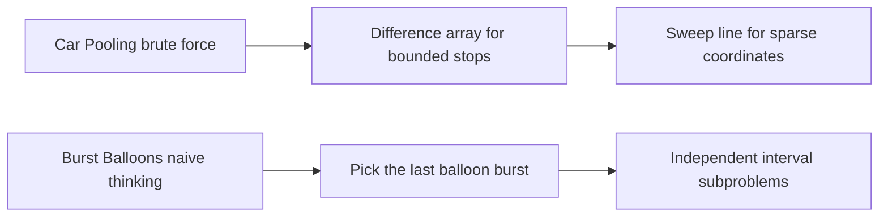

This page is the harder tier of the problem library. These are the questions where a correct brute-force solution is usually easy to say out loud, but the interview signal comes from finding the one state definition, ordering trick, or data-structure invariant that makes the optimal version click. Use it as a walkthrough reference: read the prompt, name the family, then check whether your recurrence, sweep, heap, or stack invariant matches the worked solution here.

| Problem | Pattern | Technique | Time | Space |
|---|---|---|---|---|
| Car Pooling | Arrays | Difference array for bounded coordinates | `O(n + range)` | `O(range)` |
| Burst Balloons | Dynamic Programming | Interval DP with last-burst framing | `O(n^3)` | `O(n^2)` |
| Regular Expression Matching | Dynamic Programming | 2D DP over string and pattern prefixes | `O(m * n)` | `O(m * n)` |
| Partition to K Equal Sum Subsets | Dynamic Programming | Bitmask DP over used elements | `O(2^n * n)` | `O(2^n)` |
| Cheapest Flights Within K Stops | Graphs | Bellman-Ford over `k + 1` edge relaxations | `O((k + 1) * E)` | `O(V)` |
| Critical Connections in a Network | Graphs | Tarjan low-link bridge detection | `O(V + E)` | `O(V + E)` |
| Reconstruct Itinerary | Graphs | Hierholzer Eulerian path traversal | `O(E log E)` | `O(E)` |
| Partition Labels | Greedy | Last-occurrence greedy partitioning | `O(n)` | `O(1)` |
| Letter Combinations of a Phone Number | Backtracking | Choose one letter per digit | `O(n * 4^n)` including output strings | `O(n)` |
| Palindrome Partitioning | Backtracking | Backtracking with palindrome DP precompute | `O(n * 2^n)` | `O(n^2)` |
| Meeting Rooms III | Heap | Available-room heap plus busy-room heap | `O(M log M + M log n)` for `M` meetings and `n` rooms | `O(n)` |
| LFU Cache Design | Linked List | Hash maps plus frequency buckets of doubly linked lists | `O(1)` average per op | `O(capacity)` |
| Median of Two Sorted Arrays | Binary Search | Partition binary search on the smaller array | `O(log(min(m, n)))` | `O(1)` |
| Split Array Largest Sum | Binary Search | Binary search on the answer | `O(n log(sum(nums)))` | `O(1)` |
| Count of Smaller Numbers After Self | Binary Search | Merge-sort counting or Fenwick tree | `O(n log n)` | `O(n)` |
| Path Sum III | Tree | Prefix sums on the root-to-node path | `O(n)` | `O(h)` |
| Asteroid Collision | Stack | Resolve only active right-moving collisions | `O(n)` | `O(n)` |
| Car Fleet | Stack | Sort by position and collapse arrival times | `O(n log n)` | `O(n)` |
| Calculator | Stack | Push result and sign at each parenthesis | `O(n)` | `O(n)` |



## Arrays

### Car Pooling

**Problem.** You are given trips of the form `[passengers, start, end]` and a vehicle capacity. Determine whether all trips can be completed without the number of passengers in the car ever exceeding the capacity.

**Worked example.** `trips = [[2,1,5],[3,3,7]], capacity = 4` returns `false` because the intervals overlap on stops `3` and `4`, so the car would need to carry `5` passengers there.

**Approach 1 — Brute force**

**Time:** `O(n * range)` | **Space:** `O(range)`

Mark every stop covered by every trip and keep a running passenger count per location. It is correct, but it wastes work when a trip spans a long range.

```java
class Solution {
    public boolean carPoolingBruteForce(int[][] trips, int capacity) {
        int furthestStop = 0;
        for (int[] trip : trips)
            furthestStop = Math.max(furthestStop, trip[2]);

        int[] load = new int[furthestStop + 1];

        for (int[] trip : trips) {
            int passengers = trip[0];
            int start = trip[1];
            int end = trip[2];

            for (int stop = start; stop < end; stop++) {
                load[stop] += passengers;
                if (load[stop] > capacity)
                    return false;
            }
        }

        return true;
    }
}
```

**Approach 2 — Difference array**

**Time:** `O(n + range)` | **Space:** `O(range)`

Instead of updating every stop in `[start, end)`, record only the boundary changes: pick-up adds passengers at `start`, drop-off removes them at `end`. A prefix sum reconstructs the load at each stop.

```java
class Solution {
    public boolean carPoolingDifferenceArray(int[][] trips, int capacity) {
        int furthestStop = 0;
        for (int[] trip : trips)
            furthestStop = Math.max(furthestStop, trip[2]);

        int[] diff = new int[furthestStop + 1];

        for (int[] trip : trips) {
            int passengers = trip[0];
            int start = trip[1];
            int end = trip[2];

            diff[start] += passengers;
            diff[end] -= passengers;
        }

        int current = 0;
        for (int stop = 0; stop <= furthestStop; stop++) {
            current += diff[stop];
            if (current > capacity)
                return false;
        }

        return true;
    }
}
```

**Approach 3 — Sweep line**

**Time:** `O(n log n)` | **Space:** `O(n)`

When coordinates are sparse or unbounded, keep only the boundary events, sort them, and scan from left to right. The critical tie-break is that drop-offs must happen before pick-ups at the same location.

```java
class Solution {
    public boolean carPooling(int[][] trips, int capacity) {
        // Each event is [position, delta]; sorting by position, then delta
        // ensures drop-offs (negative delta) come before pick-ups at the same stop.
        List<int[]> events = new ArrayList<>();

        for (int[] trip : trips) {
            events.add(new int[] { trip[1], trip[0] });
            events.add(new int[] { trip[2], -trip[0] });
        }

        events.sort((a, b) -> {
            int byPosition = Integer.compare(a[0], b[0]);
            if (byPosition != 0)
                return byPosition;
            return Integer.compare(a[1], b[1]);
        });

        int passengersOnBoard = 0;
        for (int[] currentEvent : events) {
            passengersOnBoard += currentEvent[1];
            if (passengersOnBoard > capacity)
                return false;
        }

        return true;
    }
}
```

## Dynamic Programming

### Burst Balloons

**Problem.** Given an array `nums`, bursting balloon `i` earns `nums[left] * nums[i] * nums[right]`, where `left` and `right` are the current adjacent balloons after earlier bursts. Return the maximum coins obtainable by bursting all balloons. Virtual balloons with value `1` exist outside both ends.

**Worked example.** `nums = [3, 1, 5, 8]` returns `167`.

> [!KEY]
> The hard part is choosing the **last** balloon burst inside an interval, not the first. Once `k` is the last burst between two fixed boundaries, its neighbors are known, so the left and right subproblems become independent.

**Approach 1 — Interval DP**

**Time:** `O(n^3)` | **Space:** `O(n^2)`

Pad the array with `1` at both ends and define `dp[left, right]` as the best answer for the open interval `(left, right)`. Then try every balloon `last` inside that interval as the final burst.

```java
class Solution {
    public int maxCoins(int[] nums) {
        int n = nums.length;
        int[] values = new int[n + 2];
        values[0] = 1;
        values[n + 1] = 1;

        for (int i = 0; i < n; i++)
            values[i + 1] = nums[i];

        int[][] dp = new int[n + 2][n + 2];

        for (int length = 2; length < n + 2; length++) {
            for (int left = 0; left + length < n + 2; left++) {
                int right = left + length;

                for (int last = left + 1; last < right; last++) {
                    int coins =
                        dp[left][last] +
                        dp[last][right] +
                        values[left] * values[last] * values[right];

                    dp[left][right] = Math.max(dp[left][right], coins);
                }
            }
        }

        return dp[0][n + 1];
    }
}
```

### Regular Expression Matching

**Problem.** Given a string `s` and a pattern `p` that supports `.` for any single character and `*` for zero or more occurrences of the previous character, determine whether `p` matches the entire string.

**Worked example.** `s = "aab", p = "c*a*b"` returns `true`.

**Approach 1 — Plain recursion**

**Time:** `O(2^(m + n))` | **Space:** `O(m + n)`

At each `*`, branch into two possibilities: use zero copies of the previous character, or consume one character from `s` and stay on the same pattern index.

```java
class Solution {
    private String s;
    private String p;

    public boolean isMatchRecursive(String s, String p) {
        this.s = s;
        this.p = p;
        return match(0, 0);
    }

    private boolean match(int i, int j) {
        if (j == p.length())
            return i == s.length();

        boolean firstMatches =
            i < s.length() &&
            (p.charAt(j) == s.charAt(i) || p.charAt(j) == '.');

        if (j + 1 < p.length() && p.charAt(j + 1) == '*') {
            return match(i, j + 2) ||
                   (firstMatches && match(i + 1, j));
        }

        return firstMatches && match(i + 1, j + 1);
    }
}
```

**Approach 2 — 2D DP**

**Time:** `O(m * n)` | **Space:** `O(m * n)`

Let `dp[i, j]` mean whether the first `i` characters of `s` match the first `j` characters of `p`. The `*` case either erases the previous token (`x*` used zero times) or consumes one matching character and stays in the same pattern column.

```java
class Solution {
    public boolean isMatch(String s, String p) {
        int m = s.length();
        int n = p.length();
        boolean[][] dp = new boolean[m + 1][n + 1];
        dp[0][0] = true;

        for (int j = 2; j <= n; j++) {
            if (p.charAt(j - 1) == '*')
                dp[0][j] = dp[0][j - 2];
        }

        for (int i = 1; i <= m; i++) {
            for (int j = 1; j <= n; j++) {
                if (p.charAt(j - 1) != '*') {
                    if (p.charAt(j - 1) == s.charAt(i - 1) || p.charAt(j - 1) == '.')
                        dp[i][j] = dp[i - 1][j - 1];
                } else {
                    dp[i][j] = dp[i][j - 2];

                    if (p.charAt(j - 2) == s.charAt(i - 1) || p.charAt(j - 2) == '.')
                        dp[i][j] = dp[i][j] || dp[i - 1][j];
                }
            }
        }

        return dp[m][n];
    }
}
```

> [!NOTE]
> Wildcard matching with `?` and `*` uses the same grid idea, but its `*` means “any sequence”, so the transition becomes `dp[i, j] = dp[i - 1, j] || dp[i, j - 1]`.

### Partition to K Equal Sum Subsets

**Problem.** Given `nums` and an integer `k`, determine whether the array can be partitioned into `k` non-empty subsets whose sums are all equal.

**Worked example.** `nums = [4, 3, 2, 3, 5, 2, 1], k = 4` returns `true` because the subsets can be `[5], [1,4], [2,3], [2,3]`.

**Approach 1 — Backtracking with pruning**

**Time:** `O(k * 2^n)` | **Space:** `O(n)`

Sort in descending order so large numbers fail fast, fill one bucket at a time, and prune equivalent bucket states. If two buckets currently have the same load, trying the current number in both is redundant.

```java
class Solution {
    private int[] nums;
    private int k;
    private int target;
    private int[] buckets;

    public boolean canPartitionKSubsetsBacktracking(int[] nums, int k) {
        int total = 0;
        for (int num : nums)
            total += num;

        if (total % k != 0)
            return false;

        this.target = total / k;
        Arrays.sort(nums);
        // Reverse to descending order so large numbers fail fast.
        for (int i = 0, j = nums.length - 1; i < j; i++, j--) {
            int tmp = nums[i];
            nums[i] = nums[j];
            nums[j] = tmp;
        }

        if (nums.length == 0 || nums[0] > target)
            return false;

        this.nums = nums;
        this.k = k;
        this.buckets = new int[k];
        return place(0);
    }

    private boolean place(int index) {
        if (index == nums.length)
            return true;

        int value = nums[index];
        Set<Integer> seenLoads = new HashSet<>();

        for (int bucket = 0; bucket < k; bucket++) {
            if (buckets[bucket] + value > target)
                continue;

            if (!seenLoads.add(buckets[bucket]))
                continue;

            buckets[bucket] += value;
            if (place(index + 1))
                return true;
            buckets[bucket] -= value;

            if (buckets[bucket] == 0)
                break;
        }

        return false;
    }
}
```

**Approach 2 — Bitmask DP**

**Time:** `O(2^n * n)` | **Space:** `O(2^n)`

Treat a subset of used elements as a bitmask. The remainder of the used sum modulo `target` tells you how full the current bucket is; once it returns to `0`, you just completed a bucket.

```java
class Solution {
    public boolean canPartitionKSubsets(int[] nums, int k) {
        int total = 0;
        for (int num : nums)
            total += num;

        if (total % k != 0)
            return false;

        int target = total / k;
        int n = nums.length;
        int allMasks = 1 << n;
        boolean[] reachable = new boolean[allMasks];
        int[] remainder = new int[allMasks];
        reachable[0] = true;

        for (int mask = 0; mask < allMasks; mask++) {
            if (!reachable[mask])
                continue;

            for (int i = 0; i < n; i++) {
                if ((mask & (1 << i)) != 0)
                    continue;

                if (remainder[mask] + nums[i] > target)
                    continue;

                int nextMask = mask | (1 << i);
                reachable[nextMask] = true;
                remainder[nextMask] = (remainder[mask] + nums[i]) % target;
            }
        }

        return reachable[allMasks - 1];
    }
}
```

This is the same subset-state shape that powers small-`n` Traveling Salesman, except TSP adds one more dimension such as `dp[mask][last]` to remember where the route ends.

## Graphs

### Cheapest Flights Within K Stops

**Problem.** Given `n` cities, a list of directed flights `[from, to, price]`, a source `src`, a destination `dst`, and a limit `k`, return the cheapest price from `src` to `dst` using at most `k` stops. Return `-1` if no such route exists.

**Worked example.** `n = 4, flights = [[0,1,100],[1,2,100],[2,0,100],[1,3,600],[2,3,200]], src = 0, dst = 3, k = 1` returns `700`.

**Tempting but wrong — Plain Dijkstra**

**Time:** `O(E log V)` | **Space:** `O(V)` | **Status:** incorrect for this problem

Cost-only Dijkstra loses information. A path that is slightly more expensive so far but uses fewer stops can still be the only valid way to stay within the stop budget later, so the state must include the number of edges or stops used.

**Approach 1 — Bellman-Ford for `k + 1` rounds**

**Time:** `O((k + 1) * E)` | **Space:** `O(V)`

After `i` full edge-relaxation rounds, you know the cheapest price using at most `i` edges. The copy of the previous round is essential so one round cannot chain newly relaxed edges together.

```java
class Solution {
    public int findCheapestPriceBellmanFord(int n, int[][] flights, int src, int dst, int k) {
        final int infinity = Integer.MAX_VALUE / 4;
        int[] distance = new int[n];
        Arrays.fill(distance, infinity);
        distance[src] = 0;

        for (int round = 0; round <= k; round++) {
            int[] previous = distance.clone();

            for (int[] flight : flights) {
                int from = flight[0];
                int to = flight[1];
                int price = flight[2];

                if (previous[from] == infinity)
                    continue;

                distance[to] = Math.min(distance[to], previous[from] + price);
            }
        }

        return distance[dst] == infinity ? -1 : distance[dst];
    }
}
```

**Approach 2 — Dijkstra on `(city, edgesUsed)`**

**Time:** `O(E * (k + 1) * log(V * (k + 2)))` | **Space:** `O(V * (k + 2))`

This is the heap-based version of the same idea: the state is not just the city, but the city plus how many edges you spent to get there.

```java
class Solution {
    public int findCheapestPrice(int n, int[][] flights, int src, int dst, int k) {
        List<int[]>[] graph = new List[n];
        for (int i = 0; i < n; i++)
            graph[i] = new ArrayList<>();

        for (int[] flight : flights)
            graph[flight[0]].add(new int[] { flight[1], flight[2] });

        int maxEdges = k + 1;
        final int infinity = Integer.MAX_VALUE / 4;
        int[][] best = new int[n][maxEdges + 1];
        for (int[] row : best)
            Arrays.fill(row, infinity);

        // State is [cost, city, edgesUsed]; min-heap by cost.
        PriorityQueue<int[]> pq = new PriorityQueue<>(Comparator.comparingInt(a -> a[0]));
        best[src][0] = 0;
        pq.offer(new int[] { 0, src, 0 });

        while (!pq.isEmpty()) {
            int[] state = pq.poll();
            int cost = state[0];
            int city = state[1];
            int edgesUsed = state[2];

            if (cost != best[city][edgesUsed])
                continue;

            if (city == dst)
                return cost;

            if (edgesUsed == maxEdges)
                continue;

            for (int[] edge : graph[city]) {
                int to = edge[0];
                int price = edge[1];
                int nextEdges = edgesUsed + 1;
                int nextCost = cost + price;

                if (nextCost < best[to][nextEdges]) {
                    best[to][nextEdges] = nextCost;
                    pq.offer(new int[] { nextCost, to, nextEdges });
                }
            }
        }

        return -1;
    }
}
```

### Critical Connections in a Network

**Problem.** Given a connected undirected graph, return all bridges: edges whose removal disconnects the graph.

**Worked example.** `n = 4, connections = [[0,1],[1,2],[2,0],[1,3]]` returns `[[1,3]]`.

**Approach 1 — Brute force**

**Time:** `O(E * (V + E))` | **Space:** `O(V + E)`

Remove each edge in turn and run a DFS. If the graph is no longer fully reachable, that edge was a bridge.

```java
class Solution {
    public List<List<Integer>> criticalConnectionsBruteForce(int n, List<List<Integer>> connections) {
        List<int[]>[] graph = new List[n];
        for (int i = 0; i < n; i++)
            graph[i] = new ArrayList<>();

        for (int id = 0; id < connections.size(); id++) {
            int u = connections.get(id).get(0);
            int v = connections.get(id).get(1);
            graph[u].add(new int[] { v, id });
            graph[v].add(new int[] { u, id });
        }

        List<List<Integer>> bridges = new ArrayList<>();

        for (int blockedEdge = 0; blockedEdge < connections.size(); blockedEdge++) {
            boolean[] visited = new boolean[n];
            int seen = countReachable(graph, blockedEdge, visited, 0);

            if (seen != n) {
                bridges.add(Arrays.asList(
                    connections.get(blockedEdge).get(0),
                    connections.get(blockedEdge).get(1)));
            }
        }

        return bridges;
    }

    private int countReachable(List<int[]>[] graph, int blockedEdge, boolean[] visited, int node) {
        visited[node] = true;
        int seen = 1;

        for (int[] edge : graph[node]) {
            int to = edge[0];
            int id = edge[1];
            if (id == blockedEdge || visited[to])
                continue;

            seen += countReachable(graph, blockedEdge, visited, to);
        }

        return seen;
    }
}
```

**Approach 2 — Tarjan low-link algorithm**

**Time:** `O(V + E)` | **Space:** `O(V + E)`

Let `discovery[node]` be the DFS discovery time and `low[node]` be the earliest discovery time reachable from that subtree using at most one back edge. If `low[child] > discovery[node]`, the edge to that child is a bridge.

```java
class Solution {
    private List<int[]>[] graph;
    private int[] discovery;
    private int[] low;
    private int timer;
    private List<List<Integer>> bridges;

    public List<List<Integer>> criticalConnections(int n, List<List<Integer>> connections) {
        graph = new List[n];
        for (int i = 0; i < n; i++)
            graph[i] = new ArrayList<>();

        for (int id = 0; id < connections.size(); id++) {
            int u = connections.get(id).get(0);
            int v = connections.get(id).get(1);
            graph[u].add(new int[] { v, id });
            graph[v].add(new int[] { u, id });
        }

        discovery = new int[n];
        low = new int[n];
        Arrays.fill(discovery, -1);
        timer = 0;
        bridges = new ArrayList<>();

        for (int node = 0; node < n; node++) {
            if (discovery[node] == -1)
                dfs(node, -1);
        }

        return bridges;
    }

    private void dfs(int node, int parentEdge) {
        discovery[node] = low[node] = timer++;

        for (int[] edge : graph[node]) {
            int to = edge[0];
            int id = edge[1];
            if (id == parentEdge)
                continue;

            if (discovery[to] != -1) {
                low[node] = Math.min(low[node], discovery[to]);
            } else {
                dfs(to, id);
                low[node] = Math.min(low[node], low[to]);

                if (low[to] > discovery[node])
                    bridges.add(Arrays.asList(node, to));
            }
        }
    }
}
```

Related low-link rules are worth remembering: articulation points use `low[child] >= discovery[node]`, and directed strongly connected components use Tarjan or Kosaraju rather than the bridge test above.

### Reconstruct Itinerary

**Problem.** Given airline tickets `[from, to]`, reconstruct the itinerary that starts at `"JFK"` and uses every ticket exactly once. If multiple valid itineraries exist, return the lexicographically smallest one.

**Worked example.** `tickets = [["MUC","LHR"],["JFK","MUC"],["SFO","SJC"],["LHR","SFO"]]` returns `["JFK","MUC","LHR","SFO","SJC"]`.

**Approach 1 — Backtracking**

**Time:** `O(E!)` | **Space:** `O(E)`

Try every unused outgoing ticket in lexicographic order and backtrack on failure. It is conceptually simple and a good first explanation in an interview.

```java
class Solution {
    private List<String[]> sortedTickets;
    private boolean[] used;
    private List<String> route;

    public List<String> findItineraryBacktracking(List<List<String>> tickets) {
        sortedTickets = new ArrayList<>();
        for (List<String> ticket : tickets)
            sortedTickets.add(new String[] { ticket.get(0), ticket.get(1) });

        sortedTickets.sort((a, b) -> {
            int byFrom = a[0].compareTo(b[0]);
            if (byFrom != 0)
                return byFrom;
            return a[1].compareTo(b[1]);
        });

        used = new boolean[sortedTickets.size()];
        route = new ArrayList<>();
        route.add("JFK");

        backtrack("JFK", 0);
        return route;
    }

    private boolean backtrack(String airport, int usedCount) {
        if (usedCount == sortedTickets.size())
            return true;

        for (int i = 0; i < sortedTickets.size(); i++) {
            String[] ticket = sortedTickets.get(i);
            if (used[i] || !ticket[0].equals(airport))
                continue;

            used[i] = true;
            route.add(ticket[1]);

            if (backtrack(ticket[1], usedCount + 1))
                return true;

            route.remove(route.size() - 1);
            used[i] = false;
        }

        return false;
    }
}
```

**Approach 2 — Hierholzer's algorithm**

**Time:** `O(E log E)` | **Space:** `O(E)`

This is an Eulerian-path problem. Always consume the smallest outgoing edge first, but append airports to the answer in post-order, after their outgoing edges have been exhausted.

```java
class Solution {
    private Map<String, PriorityQueue<String>> graph;
    private List<String> route;

    public List<String> findItinerary(List<List<String>> tickets) {
        graph = new HashMap<>();

        for (List<String> ticket : tickets) {
            String from = ticket.get(0);
            String to = ticket.get(1);
            graph.computeIfAbsent(from, x -> new PriorityQueue<>()).offer(to);
        }

        route = new ArrayList<>();
        dfs("JFK");
        Collections.reverse(route);
        return route;
    }

    private void dfs(String airport) {
        PriorityQueue<String> heap = graph.get(airport);
        if (heap != null) {
            while (!heap.isEmpty()) {
                String next = heap.poll();
                dfs(next);
            }
        }

        route.add(airport);
    }
}
```

An Eulerian path exists when the graph is connected and at most one node has `outdegree - indegree = 1` and at most one has `indegree - outdegree = 1`. This problem guarantees a valid answer, so the real trick is recognizing the traversal shape.

## Greedy

### Partition Labels

**Problem.** Partition a string into as many parts as possible so that each character appears in at most one part, then return the partition sizes.

**Worked example.** `s = "ababcbacadefegdehijhklij"` returns `[9, 7, 8]`.

**Approach 1 — Brute force**

**Time:** `O(n^2)` | **Space:** `O(1)`

Build each partition by repeatedly scanning the rest of the string to find the last occurrence of every character currently inside the partition.

```java
class Solution {
    public List<Integer> partitionLabelsBruteForce(String s) {
        List<Integer> result = new ArrayList<>();
        int start = 0;

        while (start < s.length()) {
            int end = findLastIndex(s, s.charAt(start));
            int i = start;

            while (i < end) {
                end = Math.max(end, findLastIndex(s, s.charAt(i)));
                i++;
            }

            result.add(end - start + 1);
            start = end + 1;
        }

        return result;
    }

    private static int findLastIndex(String s, char target) {
        for (int i = s.length() - 1; i >= 0; i--) {
            if (s.charAt(i) == target)
                return i;
        }

        return -1;
    }
}
```

**Approach 2 — Greedy**

**Time:** `O(n)` | **Space:** `O(1)`

Precompute the last index of each character. As you scan the string, keep extending the current partition's right boundary to the farthest last occurrence seen so far. When your index reaches that boundary, the partition is complete.

```java
class Solution {
    public List<Integer> partitionLabels(String s) {
        int[] last = new int[26];

        for (int i = 0; i < s.length(); i++)
            last[s.charAt(i) - 'a'] = i;

        List<Integer> result = new ArrayList<>();
        int start = 0;
        int end = 0;

        for (int i = 0; i < s.length(); i++) {
            end = Math.max(end, last[s.charAt(i) - 'a']);

            if (i == end) {
                result.add(end - start + 1);
                start = i + 1;
            }
        }

        return result;
    }
}
```

## Backtracking

### Letter Combinations of a Phone Number

**Problem.** Given a string of digits from `2` to `9`, return all possible letter combinations from the classic telephone keypad mapping.

**Worked example.** `digits = "23"` returns `["ad","ae","af","bd","be","bf","cd","ce","cf"]`.

**Approach 1 — Backtracking**

**Time:** `O(n * 4^n)` including output string construction | **Space:** `O(n)`

Pick one character for each digit, recurse to the next digit, and undo nothing except the current position in the temporary output buffer.

```java
class Solution {
    private final String[] mapping = {
        "",
        "",
        "abc",
        "def",
        "ghi",
        "jkl",
        "mno",
        "pqrs",
        "tuv",
        "wxyz"
    };
    private List<String> result;
    private char[] current;
    private String digits;

    public List<String> letterCombinations(String digits) {
        if (digits == null || digits.isEmpty())
            return new ArrayList<>();

        this.digits = digits;
        result = new ArrayList<>();
        current = new char[digits.length()];

        backtrack(0);
        return result;
    }

    private void backtrack(int index) {
        if (index == digits.length()) {
            result.add(new String(current));
            return;
        }

        String letters = mapping[digits.charAt(index) - '0'];
        for (int i = 0; i < letters.length(); i++) {
            current[index] = letters.charAt(i);
            backtrack(index + 1);
        }
    }
}
```

### Palindrome Partitioning

**Problem.** Partition a string so every piece is a palindrome, and return all valid partitions.

**Worked example.** `s = "aab"` returns `[["a","a","b"],["aa","b"]]`.

**Approach 1 — Backtracking**

**Time:** `O(n^2 * 2^n)` with on-the-fly palindrome checks and substring copies | **Space:** `O(n)`

At each start index, try every possible end index, keep only palindromic substrings, recurse, and then remove the last chosen substring.

```java
class Solution {
    private String s;
    private List<List<String>> result;
    private List<String> current;

    public List<List<String>> partitionBruteForce(String s) {
        this.s = s;
        result = new ArrayList<>();
        current = new ArrayList<>();

        backtrack(0);
        return result;
    }

    private void backtrack(int start) {
        if (start == s.length()) {
            result.add(new ArrayList<>(current));
            return;
        }

        for (int end = start; end < s.length(); end++) {
            if (!isPalindrome(s, start, end))
                continue;

            current.add(s.substring(start, end + 1));
            backtrack(end + 1);
            current.remove(current.size() - 1);
        }
    }

    private static boolean isPalindrome(String s, int left, int right) {
        while (left < right) {
            if (s.charAt(left) != s.charAt(right))
                return false;

            left++;
            right--;
        }

        return true;
    }
}
```

**Approach 2 — Backtracking plus palindrome DP precompute**

**Time:** `O(n * 2^n)` | **Space:** `O(n^2)`

The search tree is the same, but now each palindrome check is `O(1)` because `isPalindrome[left, right]` is prefilled by increasing substring length.

```java
class Solution {
    private String s;
    private boolean[][] isPalindrome;
    private List<List<String>> result;
    private List<String> current;

    public List<List<String>> partition(String s) {
        this.s = s;
        int n = s.length();
        isPalindrome = new boolean[n][n];

        for (int length = 1; length <= n; length++) {
            for (int left = 0; left + length - 1 < n; left++) {
                int right = left + length - 1;

                if (s.charAt(left) == s.charAt(right) &&
                    (length < 3 || isPalindrome[left + 1][right - 1])) {
                    isPalindrome[left][right] = true;
                }
            }
        }

        result = new ArrayList<>();
        current = new ArrayList<>();

        backtrack(0);
        return result;
    }

    private void backtrack(int start) {
        if (start == s.length()) {
            result.add(new ArrayList<>(current));
            return;
        }

        for (int end = start; end < s.length(); end++) {
            if (!isPalindrome[start][end])
                continue;

            current.add(s.substring(start, end + 1));
            backtrack(end + 1);
            current.remove(current.size() - 1);
        }
    }
}
```

The minimum-cuts variant flips this into pure DP: once you have the palindrome table, `cuts[i]` becomes the minimum cuts needed for the prefix ending at `i`.

## Heap

### Meeting Rooms III

**Problem.** You are given `n` rooms and a list of meetings `[start, end]`. A meeting takes the lowest-numbered free room; if none is free, it waits until one becomes available while keeping the same duration. Return the room that hosts the most meetings, breaking ties toward the smaller room number.

**Worked example.** `n = 2, meetings = [[0,10],[1,5],[2,7],[3,4]]` returns `0`.

**Approach 1 — Two heaps**

**Time:** `O(M log M + M log n)` for `M` meetings and `n` rooms | **Space:** `O(n)`

Maintain one min-heap of available room numbers and one min-heap of busy rooms ordered by `(endTime, roomNumber)`. Free any rooms whose meeting ended at or before the next start time, then either assign directly or delay the meeting onto the earliest room that frees up.

```java
class Solution {
    public int mostBooked(int n, int[][] meetings) {
        Arrays.sort(meetings, (a, b) -> Integer.compare(a[0], b[0]));

        PriorityQueue<Integer> availableRooms = new PriorityQueue<>();
        for (int room = 0; room < n; room++)
            availableRooms.offer(room);

        // Busy rooms ordered by (endTime, roomNumber).
        PriorityQueue<long[]> busyRooms = new PriorityQueue<>(
            (a, b) -> a[0] != b[0] ? Long.compare(a[0], b[0]) : Long.compare(a[1], b[1]));

        long[] count = new long[n];

        for (int[] meeting : meetings) {
            long start = meeting[0];
            long end = meeting[1];
            long duration = end - start;

            while (!busyRooms.isEmpty() && busyRooms.peek()[0] <= start) {
                long[] freed = busyRooms.poll();
                availableRooms.offer((int) freed[1]);
            }

            int roomNumber;
            long finishTime;

            if (!availableRooms.isEmpty()) {
                roomNumber = availableRooms.poll();
                finishTime = end;
            } else {
                long[] nextFree = busyRooms.poll();
                roomNumber = (int) nextFree[1];
                finishTime = nextFree[0] + duration;
            }

            count[roomNumber]++;
            busyRooms.offer(new long[] { finishTime, roomNumber });
        }

        int bestRoom = 0;
        for (int room = 1; room < n; room++) {
            if (count[room] > count[bestRoom])
                bestRoom = room;
        }

        return bestRoom;
    }
}
```

## Linked List

### LFU Cache Design

**Problem.** Design a cache with `Get` and `Put` in `O(1)` average time. On eviction, remove the least frequently used key; if multiple keys share that frequency, evict the least recently used among them.

**Worked example.** After `Put(1, 1), Put(2, 2), Get(1), Put(3, 3)` in a capacity-`2` cache, key `2` is evicted because keys `1` and `2` were tied at first, then `Get(1)` raised key `1`'s frequency.

**Approach 1 — Hash maps plus frequency buckets**

**Time:** `O(1)` average for `Get` and `Put` | **Space:** `O(capacity)`

Map each key to a node, and map each frequency to a doubly linked list of nodes ordered by recency. `minFrequency` always points at the current eviction bucket.

```java
class LFUCache {
    private static final class Node {
        int key;
        int value;
        int frequency;
        Node prev;
        Node next;

        Node(int key, int value) {
            this.key = key;
            this.value = value;
            this.frequency = 1;
        }
    }

    private static final class DoublyLinkedList {
        private final Node head;
        private final Node tail;
        private int count;

        DoublyLinkedList() {
            head = new Node(-1, -1);
            tail = new Node(-1, -1);
            head.next = tail;
            tail.prev = head;
        }

        int count() {
            return count;
        }

        void addFirst(Node node) {
            node.next = head.next;
            node.prev = head;
            head.next.prev = node;
            head.next = node;
            count++;
        }

        void remove(Node node) {
            node.prev.next = node.next;
            node.next.prev = node.prev;
            count--;
        }

        Node removeLast() {
            Node node = tail.prev;
            remove(node);
            return node;
        }
    }

    private final int capacity;
    private int minFrequency;
    private final Map<Integer, Node> nodesByKey;
    private final Map<Integer, DoublyLinkedList> listsByFrequency;

    public LFUCache(int capacity) {
        this.capacity = capacity;
        this.minFrequency = 0;
        this.nodesByKey = new HashMap<>();
        this.listsByFrequency = new HashMap<>();
    }

    public int get(int key) {
        Node node = nodesByKey.get(key);
        if (node == null)
            return -1;

        touch(node);
        return node.value;
    }

    public void put(int key, int value) {
        if (capacity == 0)
            return;

        Node existing = nodesByKey.get(key);
        if (existing != null) {
            existing.value = value;
            touch(existing);
            return;
        }

        if (nodesByKey.size() == capacity) {
            DoublyLinkedList leastUsed = listsByFrequency.get(minFrequency);
            Node evicted = leastUsed.removeLast();
            nodesByKey.remove(evicted.key);

            if (leastUsed.count() == 0)
                listsByFrequency.remove(minFrequency);
        }

        Node node = new Node(key, value);
        nodesByKey.put(key, node);

        listsByFrequency.computeIfAbsent(1, x -> new DoublyLinkedList()).addFirst(node);
        minFrequency = 1;
    }

    private void touch(Node node) {
        int oldFrequency = node.frequency;
        DoublyLinkedList oldList = listsByFrequency.get(oldFrequency);
        oldList.remove(node);

        if (oldList.count() == 0) {
            listsByFrequency.remove(oldFrequency);
            if (minFrequency == oldFrequency)
                minFrequency++;
        }

        node.frequency++;

        listsByFrequency.computeIfAbsent(node.frequency, x -> new DoublyLinkedList()).addFirst(node);
    }
}
```

The LRU tie-break works because every frequency bucket is itself ordered by recency: touches move a node to the front of the next frequency list, and eviction removes from the tail of the minimum-frequency list.

## Binary Search

### Median of Two Sorted Arrays

**Problem.** Given two sorted arrays `nums1` and `nums2`, return the median of the combined sorted order.

**Worked example.** `nums1 = [1, 3], nums2 = [2]` returns `2.0`.

**Approach 1 — Merge and sort**

**Time:** `O((m + n) log(m + n))` | **Space:** `O(m + n)`

This is the straightforward baseline: concatenate, sort, and take the middle element or average of the two middle elements.

```java
class Solution {
    public double findMedianSortedArraysBruteForce(int[] nums1, int[] nums2) {
        int[] merged = new int[nums1.length + nums2.length];
        System.arraycopy(nums1, 0, merged, 0, nums1.length);
        System.arraycopy(nums2, 0, merged, nums1.length, nums2.length);
        Arrays.sort(merged);

        int n = merged.length;
        if ((n & 1) == 1)
            return merged[n / 2];

        return (merged[n / 2 - 1] + (double) merged[n / 2]) / 2.0;
    }
}
```

**Approach 2 — Two pointers**

**Time:** `O(m + n)` | **Space:** `O(1)`

You do not need the whole merged array. Advance two pointers just far enough to reach the median position, remembering the previous and current selected values.

```java
class Solution {
    public double findMedianSortedArraysTwoPointers(int[] nums1, int[] nums2) {
        int total = nums1.length + nums2.length;
        int target = total / 2;
        int i = 0;
        int j = 0;
        int previous = 0;
        int current = 0;

        for (int count = 0; count <= target; count++) {
            previous = current;

            if (i < nums1.length &&
                (j >= nums2.length || nums1[i] <= nums2[j])) {
                current = nums1[i];
                i++;
            } else {
                current = nums2[j];
                j++;
            }
        }

        if ((total & 1) == 1)
            return current;

        return (previous + (double) current) / 2.0;
    }
}
```

**Approach 3 — Binary search partition**

**Time:** `O(log(min(m, n)))` | **Space:** `O(1)`

Binary-search the cut position in the smaller array. The correct partition is the one where every value on the left side is `<=` every value on the right side.

```java
class Solution {
    public double findMedianSortedArrays(int[] nums1, int[] nums2) {
        if (nums1.length > nums2.length)
            return findMedianSortedArrays(nums2, nums1);

        int m = nums1.length;
        int n = nums2.length;
        int left = 0;
        int right = m;
        int leftSize = (m + n + 1) / 2;

        while (left <= right) {
            int i = left + (right - left) / 2;
            int j = leftSize - i;

            int nums1Left = i == 0 ? Integer.MIN_VALUE : nums1[i - 1];
            int nums1Right = i == m ? Integer.MAX_VALUE : nums1[i];
            int nums2Left = j == 0 ? Integer.MIN_VALUE : nums2[j - 1];
            int nums2Right = j == n ? Integer.MAX_VALUE : nums2[j];

            if (nums1Left <= nums2Right && nums2Left <= nums1Right) {
                if (((m + n) & 1) == 1)
                    return Math.max(nums1Left, nums2Left);

                int leftMax = Math.max(nums1Left, nums2Left);
                int rightMin = Math.min(nums1Right, nums2Right);
                return (leftMax + (double) rightMin) / 2.0;
            }

            if (nums1Left > nums2Right)
                right = i - 1;
            else
                left = i + 1;
        }

        throw new IllegalStateException("Input arrays must be sorted.");
    }
}
```

### Split Array Largest Sum

**Problem.** Given a non-negative array `nums` and an integer `m`, split the array into `m` non-empty contiguous subarrays while minimizing the largest subarray sum.

**Worked example.** `nums = [7, 2, 5, 10, 8], m = 2` returns `18`, produced by splitting as `[7,2,5]` and `[10,8]`.

**Approach 1 — Brute force**

**Time:** `O(n^m)` | **Space:** `O(1)` ignoring recursion stack

Try every set of split points, compute the largest piece sum for that split, and keep the minimum over all valid choices.

```java
class Solution {
    private long[] prefix;
    private int[] nums;

    public int splitArrayBruteForce(int[] nums, int m) {
        this.nums = nums;
        prefix = new long[nums.length + 1];
        for (int i = 0; i < nums.length; i++)
            prefix[i + 1] = prefix[i] + nums[i];

        return (int) search(0, m);
    }

    private long search(int start, int groupsRemaining) {
        if (groupsRemaining == 1)
            return prefix[nums.length] - prefix[start];

        long best = Long.MAX_VALUE;

        for (int end = start; end <= nums.length - groupsRemaining; end++) {
            long leftSum = prefix[end + 1] - prefix[start];
            long rightBest = search(end + 1, groupsRemaining - 1);
            long candidate = Math.max(leftSum, rightBest);
            best = Math.min(best, candidate);
        }

        return best;
    }
}
```

**Approach 2 — DP over prefix length and group count**

**Time:** `O(n^2 * m)` | **Space:** `O(n * m)`

Let `dp[i, groups]` be the minimum possible largest subarray sum when splitting the first `i` numbers into `groups` pieces. The last split point tries every `split < i`.

```java
class Solution {
    public int splitArrayDp(int[] nums, int m) {
        int n = nums.length;
        long[] prefix = new long[n + 1];
        for (int i = 0; i < n; i++)
            prefix[i + 1] = prefix[i] + nums[i];

        long[][] dp = new long[n + 1][m + 1];
        long infinity = Long.MAX_VALUE / 4;

        for (int i = 0; i <= n; i++) {
            for (int groups = 0; groups <= m; groups++)
                dp[i][groups] = infinity;
        }

        dp[0][0] = 0;

        for (int i = 1; i <= n; i++) {
            for (int groups = 1; groups <= Math.min(i, m); groups++) {
                for (int split = 0; split < i; split++) {
                    if (dp[split][groups - 1] == infinity)
                        continue;

                    long largest =
                        Math.max(dp[split][groups - 1], prefix[i] - prefix[split]);

                    dp[i][groups] = Math.min(dp[i][groups], largest);
                }
            }
        }

        return (int) dp[n][m];
    }
}
```

> [!WARNING]
> In binary-search-on-answer problems, search the answer range from `max(nums)` to `sum(nums)`. Starting lower than the largest element makes the predicate meaningless, and returning `right` after a lower-bound search is the classic off-by-one mistake.

**Approach 3 — Binary search on the answer**

**Time:** `O(n log(sum(nums)))` | **Space:** `O(1)`

If you guess a maximum allowed subarray sum `mid`, you can greedily count how many groups are required. That count is monotonic: larger `mid` never needs more groups, so binary search applies.

```java
class Solution {
    public int splitArray(int[] nums, int m) {
        long left = 0;
        long right = 0;

        for (int num : nums) {
            left = Math.max(left, num);
            right += num;
        }

        while (left < right) {
            long mid = left + (right - left) / 2;

            if (countGroups(nums, mid) <= m)
                right = mid;
            else
                left = mid + 1;
        }

        return (int) left;
    }

    private static int countGroups(int[] nums, long maxAllowed) {
        int groups = 1;
        long currentSum = 0;

        for (int num : nums) {
            if (currentSum + num > maxAllowed) {
                groups++;
                currentSum = 0;
            }

            currentSum += num;
        }

        return groups;
    }
}
```

### Count of Smaller Numbers After Self

**Problem.** Given `nums`, return an array `counts` where `counts[i]` is the number of elements to the right of `nums[i]` that are smaller than it.

**Worked example.** `nums = [5, 2, 6, 1]` returns `[2, 1, 1, 0]`.

**Approach 1 — Brute force**

**Time:** `O(n^2)` | **Space:** `O(1)`

For each index, scan every later value and count how many are smaller.

```java
class Solution {
    public List<Integer> countSmallerBruteForce(int[] nums) {
        int n = nums.length;
        int[] counts = new int[n];

        for (int i = 0; i < n; i++) {
            for (int j = i + 1; j < n; j++) {
                if (nums[j] < nums[i])
                    counts[i]++;
            }
        }

        List<Integer> result = new ArrayList<>();
        for (int c : counts)
            result.add(c);
        return result;
    }
}
```

**Approach 2 — Merge sort counting**

**Time:** `O(n log n)` | **Space:** `O(n)`

Sort indices rather than values. Every time a right-half element is written before a left-half element during merge, it contributes one smaller element to every unmerged left index.

```java
class Solution {
    private int[] nums;
    private int[] counts;
    private int[] indices;
    private int[] temp;

    public List<Integer> countSmaller(int[] nums) {
        this.nums = nums;
        int n = nums.length;
        counts = new int[n];
        indices = new int[n];
        temp = new int[n];

        for (int i = 0; i < n; i++)
            indices[i] = i;

        mergeSort(0, n - 1);

        List<Integer> result = new ArrayList<>();
        for (int c : counts)
            result.add(c);
        return result;
    }

    private void mergeSort(int left, int right) {
        if (left >= right)
            return;

        int mid = left + (right - left) / 2;
        mergeSort(left, mid);
        mergeSort(mid + 1, right);
        merge(left, mid, right);
    }

    private void merge(int left, int mid, int right) {
        int i = left;
        int j = mid + 1;
        int write = left;
        int rightTaken = 0;

        while (i <= mid && j <= right) {
            if (nums[indices[j]] < nums[indices[i]]) {
                temp[write++] = indices[j++];
                rightTaken++;
            } else {
                counts[indices[i]] += rightTaken;
                temp[write++] = indices[i++];
            }
        }

        while (i <= mid) {
            counts[indices[i]] += rightTaken;
            temp[write++] = indices[i++];
        }

        while (j <= right)
            temp[write++] = indices[j++];

        for (int k = left; k <= right; k++)
            indices[k] = temp[k];
    }
}
```

> [!NOTE]
> Fenwick trees are 1-indexed. After coordinate compression, rank the smallest value as `1`, not `0`; otherwise `index += index & -index` never advances from `0`.

**Approach 3 — Fenwick tree**

**Time:** `O(n log n)` | **Space:** `O(n)`

Coordinate-compress the values, scan from right to left, query how many smaller ranks have already been seen, then update the current rank.

```java
class Solution {
    public List<Integer> countSmallerFenwick(int[] nums) {
        int[] sorted = nums.clone();
        Arrays.sort(sorted);

        Map<Integer, Integer> rank = new HashMap<>();
        int nextRank = 1;

        for (int value : sorted) {
            if (!rank.containsKey(value))
                rank.put(value, nextRank++);
        }

        BinaryIndexedTree bit = new BinaryIndexedTree(nextRank);
        int[] counts = new int[nums.length];

        for (int i = nums.length - 1; i >= 0; i--) {
            int compressed = rank.get(nums[i]);
            counts[i] = bit.query(compressed - 1);
            bit.update(compressed, 1);
        }

        List<Integer> result = new ArrayList<>();
        for (int c : counts)
            result.add(c);
        return result;
    }

    private static final class BinaryIndexedTree {
        private final int[] tree;

        BinaryIndexedTree(int size) {
            tree = new int[size + 1];
        }

        void update(int index, int delta) {
            while (index < tree.length) {
                tree[index] += delta;
                index += index & -index;
            }
        }

        int query(int index) {
            int sum = 0;

            while (index > 0) {
                sum += tree[index];
                index -= index & -index;
            }

            return sum;
        }
    }
}
```

## Tree

### Path Sum III

**Problem.** Given a binary tree and a target sum, count all downward paths whose values add up to that target. A path may start at any node and end at any descendant.

**Worked example.** `root = [10,5,-3,3,2,null,11,3,-2,null,1], targetSum = 8` returns `3`.

**Approach 1 — Brute force**

**Time:** `O(n^2)` | **Space:** `O(h)`

For every node, count all matching downward paths that start there, then recurse into both children as potential starting points.

```java
class TreeNode {
    int val;
    TreeNode left, right;

    TreeNode(int val) {
        this.val = val;
    }
}

class Solution {
    public int pathSumBruteForce(TreeNode root, int targetSum) {
        if (root == null)
            return 0;

        return countFrom(root, targetSum) +
               pathSumBruteForce(root.left, targetSum) +
               pathSumBruteForce(root.right, targetSum);
    }

    private int countFrom(TreeNode node, long remaining) {
        if (node == null)
            return 0;

        int count = node.val == remaining ? 1 : 0;
        count += countFrom(node.left, remaining - node.val);
        count += countFrom(node.right, remaining - node.val);
        return count;
    }
}
```

**Approach 2 — Prefix sum plus hash map**

**Time:** `O(n)` | **Space:** `O(h)`

Treat the root-to-current-node path like an array prefix sum. If the current prefix is `sum`, then any earlier prefix `sum - target` marks the start of a valid path ending here.

```java
class TreeNode {
    int val;
    TreeNode left, right;

    TreeNode(int val) {
        this.val = val;
    }
}

class Solution {
    private Map<Long, Integer> prefixCount;
    private int targetSum;

    public int pathSum(TreeNode root, int targetSum) {
        this.targetSum = targetSum;
        prefixCount = new HashMap<>();
        prefixCount.put(0L, 1);

        return dfs(root, 0);
    }

    private int dfs(TreeNode node, long currentSum) {
        if (node == null)
            return 0;

        currentSum += node.val;

        int count = prefixCount.getOrDefault(currentSum - targetSum, 0);

        prefixCount.merge(currentSum, 1, Integer::sum);
        count += dfs(node.left, currentSum);
        count += dfs(node.right, currentSum);
        prefixCount.merge(currentSum, -1, Integer::sum);

        if (prefixCount.get(currentSum) == 0)
            prefixCount.remove(currentSum);

        return count;
    }
}
```

## Stack

### Asteroid Collision

**Problem.** Given signed asteroid sizes where positive moves right and negative moves left, return the state after all collisions. Only a right-moving asteroid followed later by a left-moving asteroid can collide.

**Worked example.** `asteroids = [5, 10, -5]` returns `[5, 10]`.

**Approach 1 — Brute force**

**Time:** `O(n^2)` | **Space:** `O(1)` ignoring the mutable output container

Repeatedly scan for an adjacent positive-negative collision, resolve it, and restart until the list stabilizes.

```java
class Solution {
    public int[] asteroidCollisionBruteForce(int[] asteroids) {
        List<Integer> current = new ArrayList<>();
        for (int a : asteroids)
            current.add(a);
        boolean changed = true;

        while (changed) {
            changed = false;

            for (int i = 0; i < current.size() - 1; i++) {
                if (current.get(i) <= 0 || current.get(i + 1) >= 0)
                    continue;

                int left = current.get(i);
                int right = current.get(i + 1);

                if (Math.abs(left) > Math.abs(right)) {
                    current.remove(i + 1);
                } else if (Math.abs(left) < Math.abs(right)) {
                    current.remove(i);
                } else {
                    current.remove(i + 1);
                    current.remove(i);
                }

                changed = true;
                break;
            }
        }

        int[] result = new int[current.size()];
        for (int i = 0; i < current.size(); i++)
            result[i] = current.get(i);
        return result;
    }
}
```

**Approach 2 — Stack**

**Time:** `O(n)` | **Space:** `O(n)`

Only a new left-moving asteroid can collide with existing right-moving asteroids, so a stack of survivors is enough. Resolve repeated collisions until the new asteroid dies or becomes safe to push.

```java
class Solution {
    public int[] asteroidCollision(int[] asteroids) {
        Deque<Integer> stack = new ArrayDeque<>();

        for (int asteroid : asteroids) {
            int current = asteroid;
            boolean alive = true;

            while (alive &&
                   current < 0 &&
                   !stack.isEmpty() &&
                   stack.peekLast() > 0) {
                int top = stack.peekLast();

                if (top < -current) {
                    stack.pollLast();
                    continue;
                }

                if (top == -current)
                    stack.pollLast();

                alive = false;
            }

            if (alive)
                stack.addLast(current);
        }

        int[] result = new int[stack.size()];
        int i = 0;
        for (int value : stack)
            result[i++] = value;
        return result;
    }
}
```

### Car Fleet

**Problem.** Cars move toward the same target, cannot pass each other, and merge into fleets when a faster car catches a slower one. Return the number of fleets that arrive at the destination.

**Worked example.** `target = 12, position = [10, 8, 0, 5, 3], speed = [2, 4, 1, 1, 3]` returns `3`.

**Approach 1 — Repeated merging**

**Time:** `O(n^3)` | **Space:** `O(n)` for the mutable fleet list

Sort cars by position from nearest to farthest, compute their solo arrival times, and keep rescanning for adjacent pairs that must merge. This is educational, but far from optimal.

```java
class Solution {
    public int carFleetBruteForce(int target, int[] position, int[] speed) {
        List<double[]> fleets = new ArrayList<>();

        for (int i = 0; i < position.length; i++) {
            double time = (double) (target - position[i]) / speed[i];
            fleets.add(new double[] { position[i], time });
        }

        fleets.sort((a, b) -> Double.compare(b[0], a[0]));

        boolean merged = true;
        while (merged) {
            merged = false;

            for (int i = 1; i < fleets.size(); i++) {
                if (fleets.get(i)[1] <= fleets.get(i - 1)[1]) {
                    fleets.remove(i);
                    merged = true;
                    break;
                }
            }
        }

        return fleets.size();
    }
}
```

**Approach 2 — Stack**

**Time:** `O(n log n)` | **Space:** `O(n)`

Sort by position descending, compute arrival times, and push a new fleet only when the current car arrives later than the fleet directly ahead of it.

```java
class Solution {
    public int carFleetStack(int target, int[] position, int[] speed) {
        int n = position.length;
        int[][] cars = new int[n][2];
        for (int i = 0; i < n; i++) {
            cars[i][0] = position[i];
            cars[i][1] = speed[i];
        }
        // Sort by position descending (nearest to the target first).
        Arrays.sort(cars, (a, b) -> Integer.compare(b[0], a[0]));

        Deque<Double> stack = new ArrayDeque<>();

        for (int i = 0; i < n; i++) {
            double time = (double) (target - cars[i][0]) / cars[i][1];

            if (stack.isEmpty() || time > stack.peekLast())
                stack.addLast(time);
        }

        return stack.size();
    }
}
```

**Approach 3 — Without an explicit stack**

**Time:** `O(n log n)` | **Space:** `O(n)` for the paired car array

The stack only ever needs its latest arrival time, so collapse it into one variable: if the current arrival time is greater than the last fleet time, it starts a new fleet; otherwise it merges into the fleet ahead.

```java
class Solution {
    public int carFleet(int target, int[] position, int[] speed) {
        int n = position.length;
        int[][] cars = new int[n][2];
        for (int i = 0; i < n; i++) {
            cars[i][0] = position[i];
            cars[i][1] = speed[i];
        }
        // Sort by position descending (nearest to the target first).
        Arrays.sort(cars, (a, b) -> Integer.compare(b[0], a[0]));

        int fleetCount = 0;
        double lastFleetTime = 0;

        for (int i = 0; i < n; i++) {
            double time = (double) (target - cars[i][0]) / cars[i][1];

            if (fleetCount == 0 || time > lastFleetTime) {
                fleetCount++;
                lastFleetTime = time;
            }
        }

        return fleetCount;
    }
}
```

### Calculator

**Problem.** Evaluate an expression containing digits, spaces, `+`, `-`, `(`, and `)`.

**Worked example.** `s = "1 + (2 - (3 + 4))"` returns `-4`.

**Approach 1 — Brute force**

**Time:** `O(n^2)` | **Space:** `O(1)` ignoring string rebuilding

Repeatedly evaluate the innermost parenthesized expression, replace it with its integer result, and continue until no parentheses remain.

```java
class Solution {
    public int calculateBruteForce(String s) {
        String expression = s;

        while (true) {
            int open = expression.lastIndexOf('(');
            if (open == -1)
                break;

            int close = expression.indexOf(')', open);
            int value = evaluateFlat(expression.substring(open + 1, close));

            expression =
                expression.substring(0, open) +
                Integer.toString(value) +
                expression.substring(close + 1);
        }

        return evaluateFlat(expression);
    }

    private static int evaluateFlat(String expression) {
        int result = 0;
        int sign = 1;
        int i = 0;

        while (i < expression.length()) {
            char ch = expression.charAt(i);

            if (ch == ' ') {
                i++;
            } else if (ch == '+' || ch == '-') {
                int combinedSign = 1;

                while (i < expression.length() &&
                       (expression.charAt(i) == '+' || expression.charAt(i) == '-' || expression.charAt(i) == ' ')) {
                    if (expression.charAt(i) == '-')
                        combinedSign *= -1;

                    i++;
                }

                sign = combinedSign;
            } else {
                int number = 0;
                while (i < expression.length() && Character.isDigit(expression.charAt(i))) {
                    number = number * 10 + (expression.charAt(i) - '0');
                    i++;
                }

                result += sign * number;
            }
        }

        return result;
    }
}
```

**Approach 2 — Stack**

**Time:** `O(n)` | **Space:** `O(n)`

When you see `(`, push the current accumulated result and sign, then reset for the inner expression. When you see `)`, pop and fold the finished inner result back into the outer expression.

```java
class Solution {
    public int calculate(String s) {
        int result = 0;
        int sign = 1;
        Deque<Integer> stack = new ArrayDeque<>();
        int i = 0;

        while (i < s.length()) {
            char ch = s.charAt(i);

            if (ch == ' ') {
                i++;
                continue;
            }

            if (Character.isDigit(ch)) {
                int number = 0;

                while (i < s.length() && Character.isDigit(s.charAt(i))) {
                    number = number * 10 + (s.charAt(i) - '0');
                    i++;
                }

                result += sign * number;
                continue;
            }

            if (ch == '+') {
                sign = 1;
            } else if (ch == '-') {
                sign = -1;
            } else if (ch == '(') {
                stack.push(result);
                stack.push(sign);
                result = 0;
                sign = 1;
            } else if (ch == ')') {
                int previousSign = stack.pop();
                int previousResult = stack.pop();
                result = previousResult + previousSign * result;
            }

            i++;
        }

        return result;
    }
}
```

## Cheat sheet

- **Car Pooling:** bounded coordinate range means difference array; sparse coordinate range means sweep line; same-stop ordering must drop off before picking up.
- **Burst Balloons:** define the subproblem by the balloon burst **last** in an interval, not first.
- **Regular Expression Matching:** `*` either deletes the previous token from consideration or consumes one character while staying on the same pattern index.
- **Partition to K Equal Sum Subsets:** descending sort plus equivalent-bucket pruning is the difference between tractable backtracking and pointless repetition.
- **Cheapest Flights Within K Stops:** when a path budget matters, state must include the budget used so far.
- **Critical Connections:** `low[child] > disc[parent]` is the exact bridge test.
- **Reconstruct Itinerary:** Eulerian-path problems often want post-order output, then a final reverse.
- **Partition Labels:** the active partition ends at the farthest last occurrence of any character seen so far.
- **Letter Combinations:** the branching factor is the keypad size, not the number of digits already used.
- **Palindrome Partitioning:** precompute palindrome truth first if repeated substring checks dominate.
- **Meeting Rooms III:** one heap says which room is free; the other says when the next room becomes free.
- **LFU Cache Design:** frequency decides the bucket; recency decides the eviction within the bucket.
- **Median of Two Sorted Arrays:** the binary-search partition is valid only when left-side maxima are `<=` right-side minima.
- **Split Array Largest Sum:** binary search works because “can I split with max sum `x`?” is monotonic.
- **Count of Smaller Numbers After Self:** merge-sort counting and Fenwick trees are both order-statistics tools.
- **Path Sum III:** prefix-sum maps must be backtracked on the way up the recursion.
- **Asteroid Collision:** only a negative asteroid entering a stack of positive asteroids can trigger work.
- **Car Fleet:** once you process cars from front to back, fleet times become monotone non-decreasing.
- **Calculator:** pushing both prior result and prior sign is the clean way to handle nested parentheses.

## Common mistakes

| Mistake | Fix |
|---|---|
| Processing Car Pooling pick-ups before drop-offs at the same stop | Sort same-position events so negative deltas come first |
| Framing Burst Balloons by the first balloon burst | Choose the last balloon burst so interval boundaries stay fixed |
| Treating regex `*` as “match anything” | `*` only repeats the preceding token; `.` is the wildcard for one character |
| Forgetting early impossibility checks in partition-to-`k` | Return false immediately if `sum % k != 0` or the largest number exceeds the target bucket sum |
| Using cost-only Dijkstra for Cheapest Flights | Include stops or edges used in the state, or use Bellman-Ford rounds |
| Skipping parent-edge handling in Tarjan DFS | Track the incoming edge id, not just the parent node, to avoid bad low-link updates |
| Appending itinerary nodes in pre-order | Append after exhausting outgoing edges, then reverse the route |
| Recomputing partition-label last occurrences on every character | Precompute the last index of each character once |
| Rechecking palindrome substrings character by character inside every branch | Precompute `isPalindrome[left, right]` by increasing substring length |
| Evicting the oldest key globally in LFU | Evict from the minimum-frequency bucket, and within that bucket use LRU order |
| Returning `right` after lower-bound binary search in Split Array | Maintain the invariant and return `left` when the loop ends |
| Updating a Fenwick tree at index `0` | Coordinate-compress to ranks starting at `1` |
| Forgetting to remove the current prefix sum when backtracking Path Sum III | Decrement the prefix frequency after both child DFS calls |
| Handling only one asteroid collision and then moving on | Keep resolving while the current asteroid can still collide with the new stack top |
| Thinking a faster car behind always forms a new fleet | If its arrival time is not later than the fleet ahead, it merges into that fleet |
| Pushing only the sign or only the result for Calculator parentheses | Push both so you can restore the full outer context on `)` |

## Summary

Advanced interview problems are rarely about more syntax or more memorization; they are about spotting the one representation that untangles the problem. Sometimes that representation is a better state (`city + stops`, `mask + remainder`, prefix sums on a tree path), sometimes it is a better ordering (`last balloon burst`, post-order Eulerian traversal, sort by position descending), and sometimes it is a better data structure invariant (frequency buckets for LFU, monotone fleet times, active right-movers on a stack). The practical interview move is always the same: say the brute-force version first, name exactly what wasted work it repeats, then explain the state or invariant that removes that waste.

## Top Interview Questions

### Q1. Why is choosing the last balloon burst the key idea in Burst Balloons, and why does choosing the first balloon not work as cleanly?

Choosing the last balloon burst inside an interval freezes its neighbors, which is exactly what makes the subproblem independent. If balloon `k` is the last one burst between boundaries `left` and `right`, then its gain is always `values[left] * values[k] * values[right]`, regardless of the order used inside the left and right subintervals. That gives a clean recurrence: best left subproblem plus best right subproblem plus the final burst gain. If you try to choose the first balloon instead, its eventual neighbors depend on what gets removed later, so the same state no longer determines the score. That is the recurring interval-DP lesson: define the decision at the moment when the boundary conditions are stable, not while they are still changing.

### Q2. In Cheapest Flights Within K Stops, why is plain Dijkstra not enough, and what does the correct state look like?

Plain Dijkstra assumes that once you reach a node with the cheapest cost so far, any more expensive path to that same node can be discarded. That assumption breaks here because the stop budget matters just as much as the cost. A path that reaches city `A` cheaply but already used too many stops can be worse than a slightly more expensive path that reaches `A` with budget left. The right state is therefore something like `(city, edgesUsed)` or `(city, stopsUsed)`, not just `city`. Once you carry that extra state, both Bellman-Ford and heap-based search become correct again: Bellman-Ford because each round limits path length, and Dijkstra because it now compares full states rather than merging incompatible situations together.

### Q3. How do you explain the progression from brute force to difference array to sweep line in Car Pooling?

The brute-force solution updates every stop covered by every trip, which is correct but obviously wasteful when trips span long ranges. The observation behind the difference array is that range updates only matter at their boundaries: `+passengers` at the start and `-passengers` at the end. A prefix sum then reconstructs the active load at every stop in linear time. The sweep-line version is the same boundary idea, but it drops the assumption that the coordinate range is small and dense. Instead of keeping an array indexed by stop number, it sorts just the pick-up and drop-off events. In an interview, that narration is strong because it names the exact waste removed at each step: first repeated range updates, then dependence on a dense coordinate domain.

### Q4. Why does binary search on the answer work for Split Array Largest Sum, and what monotonic property are you using?

You are not binary-searching an index; you are binary-searching the maximum allowed subarray sum. For any guess `x`, you can greedily scan the array and count how many groups are required if no group is allowed to exceed `x`. That predicate is monotonic: if a particular `x` is feasible, then any larger `x` is also feasible, because relaxing the cap cannot require more groups. Conversely, if `x` is too small, every smaller value is also too small. Once you see that monotonicity, lower-bound binary search is natural. The two classic mistakes are setting the low bound below `max(nums)` and returning the wrong pointer at the end. A good answer explicitly states the invariant and the feasible predicate before writing code.

### Q5. Count of Smaller Numbers After Self has both a merge-sort solution and a Fenwick-tree solution. How do you decide which explanation to give first?

I would usually explain merge-sort counting first because it shows the counting logic directly: when a right-half value is merged ahead of a left-half value, it is smaller than every still-unmerged left value, so it contributes to those counts. That makes the invariant very visual and interview-friendly. The Fenwick-tree solution is often the better follow-up when you want to show another order-statistics tool: scan from right to left, coordinate-compress the values, query how many smaller ranks have already been seen, then update the current rank. If the interviewer likes divide-and-conquer reasoning, lead with merge sort; if they like indexed frequency structures or ask for an online-style explanation, bring up Fenwick. Both are really solving the same ranked-prefix question in different clothes.

### Q6. What is the data-structure invariant that makes LFU Cache support O(1) average Get and Put?

The invariant is that every key lives in exactly one frequency bucket, and every bucket is a doubly linked list ordered by recency within that frequency. A hash map gives O(1) access from key to node, another map gives O(1) access from frequency to its list, and `minFrequency` tells you which bucket to evict from. On `Get`, you remove the node from frequency `f`, increment it to `f + 1`, and insert it at the front of the new list. On `Put`, if you need to evict, you remove from the tail of the `minFrequency` list, which is the least recently used key among the least frequently used ones. That tie-break is the part candidates often forget to encode explicitly.

### Q7. How do low-link values identify a bridge in Critical Connections in a Network?

During DFS, `discovery[node]` records when a node was first seen, while `low[node]` records the earliest discovery time reachable from that node's subtree using zero or more tree edges and at most one back edge. After you DFS into a child, if `low[child] > discovery[node]`, it means the child's entire subtree cannot reach `node` or any ancestor of `node` without using the edge between them. So removing that edge disconnects the graph, which is exactly the definition of a bridge. The logic is more important than the formula: low-link values summarize whether a subtree has an escape route back upward. If it does not, the parent edge is structurally critical.

### Q8. Why does Hierholzer's algorithm for Reconstruct Itinerary append airports in post-order instead of pre-order?

Because greedy forward walking alone can trap you in a dead end before all edges are used. Hierholzer's insight is that a node should only be committed to the route after every outgoing edge from that node has already been consumed. That is why the DFS appends in post-order: you keep drilling down through unused edges until you get stuck, append that terminal node, then unwind. The unwind order naturally stitches together smaller Eulerian trails into the final route, and a final reverse gives the usable itinerary. In this problem, lexicographic order is layered on top by always consuming the smallest available destination first. The combination sounds subtle, but the mental model is simple: spend edges greedily, record airports only when there are no edges left to spend from there.

### Q9. Why does the prefix-sum hash-map trick work for Path Sum III even though paths can start anywhere in the tree?

Because every downward path ending at the current node is a suffix of the root-to-current path. If the running prefix sum at the current node is `sum`, then any earlier prefix equal to `sum - target` marks a starting point whose suffix to the current node totals exactly `target`. That is the same algebra behind Subarray Sum Equals K, just applied along a DFS path instead of a linear array. The detail that makes it correct on a tree is backtracking: once you return from a node, you decrement its prefix sum count so sibling branches do not see prefixes from the wrong path. Without that undo step, you would accidentally count paths that jump across the tree instead of staying on one downward chain.

### Q10. If an interviewer gives you one of these advanced problems, how should you narrate your way from the obvious solution to the optimal one?

Start with the correct but slow solution and be explicit about what repeated work it does. Then say the one observation that kills that waste. For Car Pooling, the waste is updating every stop, so you keep only boundary changes. For Burst Balloons, the problem is that “first burst” keeps changing neighbors, so you reframe around the last burst. For Cheapest Flights, the issue is that node-only state loses the stop budget, so you add stops to the state. For Split Array, the waste is enumerating split layouts, so you search the answer space with a monotone feasibility check. That pattern of narration is what interviewers want to hear: baseline, bottleneck, new invariant or state, and new complexity. It shows reasoning, not just memorized code.
