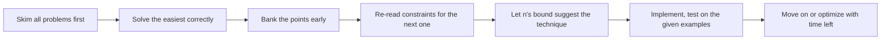

A timed contest is a different skill from an untimed interview: four problems, a ticking clock, and partial credit for whatever you finish. This page is a set of write-ups from one such round, kept in the format that's actually useful to revisit later — what the problem asked, what approach got picked and why, the working solution, and the one thing worth remembering next time a similar shape shows up.



> [!TIP]
> In a scored contest, a correct `O(n²)` solution submitted in five minutes almost always beats a correct `O(n)` solution submitted in twenty. Optimize only after the naive version is banked, unless the constraints make `O(n²)` outright impossible.

| Problem | Difficulty | Technique | Complexity |
|---|---|---|---|
| Count Rotations With Exactly K Equal Adjacent Pairs | Easy | Circular equal-pair count, adjust for the one boundary that changes | `O(n)` |
| Count Good Cyclic Rotations | Medium | Fixed-size sliding window over the doubled array | `O(n)` |
| Count Robot Groups | Medium | Initial collapse, then a monotonic stack over speed | `O(n)` when positions are already sorted |
| Minimum Cost Path With At Most K Turns | Hard | Dijkstra over an expanded `(row, col, direction, turns)` state | `O(V log V)` on the expanded graph |

## Count Rotations With Exactly K Equal Adjacent Pairs

**Problem.** Given a string `s` of length `n` and an integer `k`, a cyclic rotation moves some prefix of `s` to the end. Each rotation has a score: the number of adjacent index pairs `(i, i+1)` where the characters are equal. Count how many of the `n` cyclic rotations have a score of exactly `k`.

**Approach.** Rotating the string never changes which characters are adjacent to each other *around the circle* — it only changes which single pair sits at the "seam" (the join between the old end and the old start). So instead of scoring all `n` rotations from scratch, count the equal adjacent pairs in the circular string once. Removing one specific rotation's seam pair either subtracts one equal pair (if that pair happened to be equal) or leaves the count unchanged (if it wasn't). That means every rotation's score is either `circularEqualCount` or `circularEqualCount - 1`, and counting how many rotations land in each bucket is just counting how many of the `n` circular adjacent pairs are equal versus not.

```java
class Solution {
    public int countRotations(String s, int k) {
        int n = s.length();
        int equal = 0;

        // Count equal adjacent pairs in the circular string
        for (int i = 0; i < n; i++)
            if (s.charAt(i) == s.charAt((i + 1) % n))
                equal++;

        int ans = 0;
        if (k == equal - 1) ans += equal;       // the removed seam pair was equal
        if (k == equal) ans += n - equal;       // the removed seam pair was not equal
        return ans;
    }
}
```

**What I learned.** Whenever a problem asks you to score every rotation of something, check whether rotating actually changes most of the structure — often only a single boundary element changes per rotation, and the rest of the circular structure is invariant. That turns an apparent `O(n²)` "regenerate and rescore every rotation" problem into an `O(n)` "count once, then bucket by what the seam contributes" problem.

## Count Good Cyclic Rotations

**Problem.** Given an integer array `nums` of even length `n`, a cyclic rotation is good if the sum of its first `n/2` elements is strictly greater than the sum of its last `n/2` elements. Count how many of the `n` cyclic rotations are good.

**Approach.** Line the array up against itself (conceptually `nums + nums`) and notice that the "first half" of each successive rotation is a fixed-size window of length `n/2` sliding one position at a time across that doubled array. Maintain the running window sum incrementally — add the element entering the window, subtract the element leaving it — and compare it against half the total sum on every step, which turns `n` separate `O(n)` recomputations into one `O(n)` sliding pass.

```java
class Solution {
    public int countGoodRotations(int[] nums) {
        int len = nums.length;
        long total = 0;
        for (int x : nums) total += x;

        long windowSum = 0;
        for (int i = 0; i < len / 2; i++) windowSum += nums[i];

        int good = 0;
        for (int i = len / 2; i < len + len / 2; i++) {
            if (2L * windowSum > total) good++;
            windowSum += nums[i % len];
            windowSum -= nums[(i - len / 2 + len) % len];
        }
        return good;
    }
}
```

**What I learned.** Compare with `2 * windowSum > total` rather than `windowSum > total / 2`. The doubled comparison is exact for odd totals, works for negative totals too, and still avoids floating point; using integer division would be wrong in Java for some negative totals because division truncates toward zero.

> [!TIP]
> "Every rotation shares a fixed-size prefix/suffix split" is a strong hint to think of the array doubled against itself, with the target window sliding one step per rotation — it converts an `O(n)`-per-rotation recomputation into one `O(n)` pass overall.

## Count Robot Groups

**Problem.** Robots start at strictly increasing positions, each with a constant speed, and merge whenever the gap between two adjacent groups drops to at most `distance`. Merged groups adopt the position and speed of the rightmost member and never split again. Return the number of groups remaining after all possible merges, across all time.

**Approach.** Split the problem into two passes. First, merge whatever is already touching at `t = 0` — scan left to right and collapse any adjacent pair whose gap is already at most `distance` into one group (taking the rightmost robot's position and speed). Second, account for merges that happen later as faster groups catch up to slower ones ahead: a group survives on its own forever only if there is no group anywhere ahead with a strictly smaller speed. If every group ahead is at least as fast, the gap never closes; the first slower group ahead is the merge target that collapses the chain. That "is there something slower ahead" question is exactly what a next-smaller-element scan with a monotonic stack answers in one linear pass.

```java
class Solution {
    public int countGroups(int[] pos, int[] speed, int distance) {
        List<int[]> groups = new ArrayList<>();   // each entry is {pos, speed}
        int n = pos.length;

        // Pass 1: merge anything already touching at t = 0
        for (int i = 0; i < n; i++) {
            if (!groups.isEmpty() && pos[i] - groups.get(groups.size() - 1)[0] <= distance)
                groups.set(groups.size() - 1, new int[]{pos[i], speed[i]});
            else
                groups.add(new int[]{pos[i], speed[i]});
        }

        // Pass 2: a group survives independently only if nothing slower lies ahead of it
        int m = groups.size();
        int[] nextSlower = new int[m];
        Arrays.fill(nextSlower, -1);
        Deque<Integer> stack = new ArrayDeque<>();
        for (int i = 0; i < m; i++) {
            while (!stack.isEmpty() && groups.get(stack.peek())[1] > groups.get(i)[1])
                nextSlower[stack.pop()] = i;
            stack.push(i);
        }

        int finalGroups = 0;
        for (int i = 0; i < m;) {
            if (nextSlower[i] == -1) { finalGroups++; i++; }
            else i = nextSlower[i];
        }
        return finalGroups;
    }
}
```

**What I learned.** Simulating time directly is a trap here — with speeds and positions this general, "when does group A catch group B" is a continuous calculation you'd have to redo for every pair. The actual question is an ordering question ("is there ever something slower ahead of me"), not a timing question, and ordering questions over an array are almost always a monotonic-stack scan away from `O(n)`.

## Minimum Cost Path With At Most K Turns

**Problem.** Given an `m x n` grid of cell costs, find the minimum total cost of a path from `(0, 0)` to `(m-1, n-1)`, moving in the four cardinal directions, using at most `k` turns (a turn is a direction change between two consecutive moves).

**Approach.** A plain shortest-path search over `(row, col)` can't answer this, because the cheapest way to reach a cell might use more turns than the cheapest way to reach it with fewer turns — the two are genuinely different states with different future costs. The fix is to expand the state Dijkstra operates on: instead of `(row, col)`, track `(row, col, direction, turnsUsedSoFar)`, so the algorithm never conflates "cheapest but turn-heavy" with "slightly pricier but turn-light" paths that might still be the only way to finish inside the turn budget.

```java
class Solution {
    public int minimumCost(int[][] grid, int k) {
        int m = grid.length, n = grid[0].length;
        if (m == 1 && n == 1) return grid[0][0];

        int[] dr = {0, 1, 0, -1};
        int[] dc = {1, 0, -1, 0};

        int[][][][] dist = new int[m][n][4][k + 1];
        for (int[][][] a : dist)
            for (int[][] b : a)
                for (int[] row : b)
                    Arrays.fill(row, Integer.MAX_VALUE);

        // each queue entry is {cost, r, c, d, t}, ordered by cost
        PriorityQueue<int[]> pq = new PriorityQueue<>(Comparator.comparingInt(e -> e[0]));

        for (int d = 0; d < 4; d++) {
            int nr = dr[d], nc = dc[d];
            if (nr >= 0 && nr < m && nc >= 0 && nc < n) {
                int cost = grid[0][0] + grid[nr][nc];
                dist[nr][nc][d][0] = cost;
                pq.offer(new int[]{cost, nr, nc, d, 0});
            }
        }

        while (!pq.isEmpty()) {
            int[] state = pq.poll();
            int cost = state[0], r = state[1], c = state[2], d = state[3], t = state[4];
            if (cost > dist[r][c][d][t]) continue;          // stale entry, skip
            if (r == m - 1 && c == n - 1) return cost;

            for (int nd = 0; nd < 4; nd++) {
                int nt = t + (nd != d ? 1 : 0);
                if (nt > k) continue;

                int nr = r + dr[nd], nc = c + dc[nd];
                if (nr < 0 || nr >= m || nc < 0 || nc >= n) continue;

                int ncost = cost + grid[nr][nc];
                if (ncost < dist[nr][nc][nd][nt]) {
                    dist[nr][nc][nd][nt] = ncost;
                    pq.offer(new int[]{ncost, nr, nc, nd, nt});
                }
            }
        }
        return -1;
    }
}
```

**What I learned.** Whenever a shortest-path problem has an extra hard constraint (a budget, a count, a limit), the constraint has to become part of the graph's state, not a filter bolted on afterward — otherwise Dijkstra's core assumption (first visit to a state is optimal) silently breaks, because "first visit to a cell" and "first visit to a cell within budget" are not the same guarantee.

> [!WARNING]
> Plain Dijkstra over `(row, col)` alone would wrongly assume the cheapest way to reach a cell is always the best starting point for everything after it. Once turns are budgeted, a pricier path with turns to spare can beat a cheaper path that's already out of budget — the state must carry the budget, not just position.

## Cheat sheet

- Circular rotation-scoring problems: check whether rotating only changes one boundary element; if so, count the invariant structure once and bucket by the boundary.
- "Score of every rotation" where the score is a fixed-size sum: that's a sliding window over the doubled array, not `n` independent recomputations.
- Merging problems phrased with continuous-time catch-up: look for whether the answer only depends on relative *order* (monotonic stack), not on simulating actual time.
- Shortest path with an extra hard constraint (turns, stops, budget): fold the constraint into the search state, don't check it separately.
- In a scored contest: bank the easy problem correctly before optimizing anything.

## Common mistakes

| Mistake | Fix |
|---|---|
| Regenerating and rescoring every rotation from scratch | Check what actually changes per rotation — usually just one boundary pair or window edge |
| Comparing `windowSum > total / 2` with integer or floating-point division | Use `2 * windowSum > total`; it is exact for odd totals and avoids Java's truncation trap on negative totals |
| Trying to simulate exact catch-up times between robots | If only the eventual merge/no-merge outcome matters, reduce it to a monotonic-stack ordering question |
| Running plain Dijkstra on `(row, col)` when a turn/stop budget is part of the problem | Expand the state to include the budget dimension, e.g. `(row, col, direction, turnsUsed)` |
| Treating a stale priority-queue entry as valid | Always recheck `cost > dist[state]` on dequeue and skip if it's outdated |

## Summary

These four problems share a theme even though they look unrelated: each one has an `O(n²)`-or-worse brute force that's obvious to state, and a much cheaper solution that appears the moment you ask "what actually changes here, and what stays invariant." Rotation scoring stays invariant except at one seam; the good-rotation sum is a sliding window in disguise; robot merging is an ordering question, not a timing one; and the turn-limited shortest path just needs a bigger state, not a different algorithm. The contest habit worth keeping is asking that "what's invariant, what's the real state" question before writing any code, rather than reaching for whichever technique the problem superficially resembles.

## Top Interview Questions

### Q1. When a problem asks you to evaluate every rotation or every window of an array, what's the first optimization you should look for?

Look for what actually changes between one rotation/window and the next, rather than assuming you need to recompute everything from scratch each time. Very often, moving from one rotation to the next only changes a single boundary element or pair — the rest of the circular or windowed structure is identical — which means you can maintain a running value incrementally (add what enters, remove what leaves) instead of rescoring the whole thing. This turns an apparent `O(n²)` "regenerate everything n times" problem into an `O(n)` single pass, and it's one of the highest-value patterns to recognize quickly in a timed contest, since these problems often look deceptively expensive at first glance.

### Q2. How do you decide whether a "things merge over time" simulation problem actually needs to simulate time?

Check whether the final answer only depends on the relative order or ranking of some property, not on the actual numeric time values. If group A only ever catches group B because A's speed is greater than B's, and once caught they move together permanently, then the exact moment of catching is irrelevant to the final grouping — only the fact that it eventually happens matters. That's a strong signal to look for an ordering-based technique like a monotonic stack ("is there anything slower ahead of me") instead of computing catch-up times, distances, or explicit event simulation, which would be far more complex and error-prone to get right under time pressure.

### Q3. Why does adding an extra constraint like "at most k turns" or "at most k stops" to a shortest-path problem require changing the search state, not just filtering results afterward?

Because Dijkstra's correctness relies on the invariant that once you've found the shortest cost to reach a given state, no other path to that exact state can beat it, so it never needs to be revisited. If the search state is just `(row, col)`, that invariant becomes false the moment turns or stops matter, because a cheaper path to a cell might have used up more of the budget than an alternative, slightly costlier path — and only one of those might actually be able to finish within the limit. Filtering afterward can't fix this, because the algorithm may have already discarded the higher-budget-remaining option as "already visited, no need to revisit." The state itself has to include the constrained resource.

### Q4. In a timed contest, how should you prioritize between finishing the easy problems correctly versus attempting a partial solution on a hard one?

Prioritize banking correct solutions on the problems you're confident about first, since contests typically score by problems fully solved, not partial credit for elegant-but-incomplete hard solutions. A correct, even inelegant, solution to an easy or medium problem is worth more than a half-working attempt at a hard one, especially early in the round when time pressure is lower and mistakes on "should be easy" problems are more costly relative to their point value. Once the problems you're confident about are solved and verified against the given examples, then it's reasonable to spend remaining time on the harder problem, ideally after skimming it early so you've had background time to think about it.

### Q5. What's a fast way to avoid division mistakes in comparisons like "first half sum is greater than the second half"?

Rewrite the comparison algebraically without division and keep it in integer arithmetic: "first half is greater than the second half" is `windowSum > total - windowSum`, which becomes `2 * windowSum > total`. That version handles odd totals naturally and avoids Java's integer-division behavior, especially for negative totals where truncation toward zero differs from mathematical floor. It also avoids floating-point precision risk. In code, keep the sums in `long` before doubling so the comparison does not overflow on large inputs.

### Q6. How do you recognize when a monotonic stack is the right tool in a problem that doesn't obviously mention "next greater/smaller element"?

Look past the surface framing for an underlying "is there anything ahead of me that changes my fate" question. Robot merging is framed as a physics/time problem, but the actual computational question — "does a slower group exist anywhere ahead of this one" — is structurally identical to "find the next smaller element to the right." Whenever a problem asks about the *existence* of some dominating or subordinate element later in a sequence, and that answer only needs to be computed once per element without revisiting, a monotonic stack is very likely to reduce an apparent quadratic scan to a linear one.

### Q7. What's the advantage of keeping the priority-queue "stale entry" check (`if (cost > dist[state]) continue;`) in a Dijkstra-style solution instead of removing outdated entries from the queue directly?

Java's built-in `PriorityQueue` has no efficient way to decrease a specific entry's priority, and removing an arbitrary entry with `remove(Object)` is `O(n)`, so the standard workaround is "lazy deletion": simply add a new, better entry for the same state without removing the old, worse one, and when the old one is eventually polled, check whether it's still the best known distance for that state before processing it. This keeps the implementation simple and avoids needing an indexed heap, at the cost of the queue occasionally holding a few extra stale entries — a small overhead that's almost always worth the simplicity in a contest setting.

### Q8. When expanding a search state to include an extra dimension like direction and turns-used, how do you reason about the resulting time and space complexity?

Multiply the original state space by the size of each new dimension you add: if the base grid has `m * n` cells, and you add 4 possible directions and `k + 1` possible turn counts, the state space becomes `m * n * 4 * (k + 1)`. Each state can be enqueued and processed roughly `O(log(state count))` times in a heap-based search, so the overall complexity becomes `O(m * n * k * log(m * n * k))` in the worst case. It's important to say this complexity out loud in an interview or contest explanation, since it shows you understand that the expanded state isn't "free" — it directly multiplies both the memory footprint and the number of heap operations.

### Q9. What's a general strategy for spotting the "invariant vs. changing part" of a problem quickly, especially under contest time pressure?

Start by mentally simulating the brute-force version for two or three consecutive cases (two adjacent rotations, two adjacent windows, two time steps) and explicitly compare what's different between them. In almost every "evaluate every X" problem, the difference between consecutive cases is much smaller than the full recomputation would suggest — often a single element entering and one leaving. Once you can name that specific difference, ask whether it can be tracked incrementally with a running variable, a window, or a monotonic structure, rather than trying to jump straight to "the" clever trick. This habit of comparing adjacent cases explicitly, rather than staring at the full problem, is one of the fastest ways to find the optimization under time pressure.

### Q10. How should you validate a contest solution against the given examples before submitting, given there's no interviewer to catch a subtle bug for you?

Trace through every provided example by hand against your actual code logic, not just against your mental model of the algorithm, since the two can diverge in small but fatal ways (off-by-one loop bounds, wrong comparison direction, an unhandled edge case like `n = 1`). Pay particular attention to boundary-sized examples explicitly given in the problem (smallest valid `n`, all-equal inputs, single-element cases), since contest problem setters usually include at least one example designed to catch a specific common mistake. If your code produces the expected output for every given example after an honest, line-by-line trace — not just "it looks right" — that's the strongest signal you have before submitting, given there's no one else to review it first.
