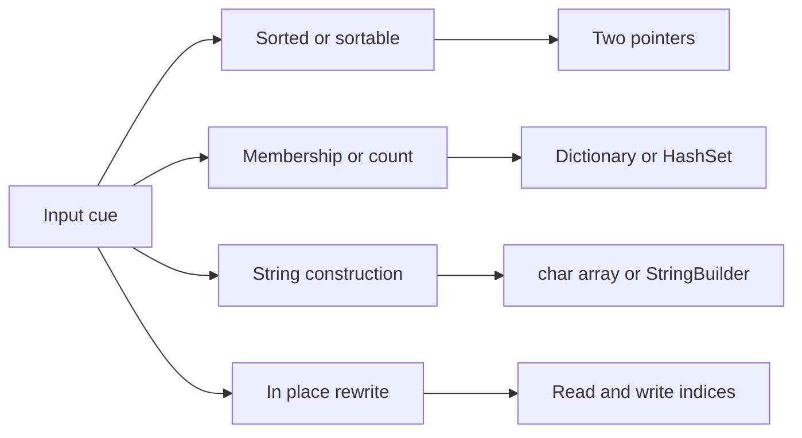

This workbook is problem-first practice for C# candidates. The theory lives in the pattern track, so the focus here is recognizing the cue, naming the invariant, and writing clean LeetCode-style C# without losing edge cases.

## C# Mechanics

Arrays, strings, and hash tables in .NET reward choosing the right representation early. Prefer arrays for bounded alphabets, `Dictionary<TKey, TValue>` for sparse counts, `HashSet<T>` for membership, and `StringBuilder` or `char[]` when a string is built incrementally. `Dictionary` and `HashSet` are insertion-friendly but their enumeration order is not a correctness contract, so never base an answer on it unless the problem explicitly allows arbitrary order.

| Cue in the problem | C# move | Gotcha to say out loud |
|---|---|---|
| Count lowercase letters | `int[26]` with `c - 'a'` | Only valid when the alphabet is guaranteed |
| Sparse frequency or index lookup | `Dictionary<T, int>` with `TryGetValue` | Store before or after lookup based on whether the same item may be reused |
| Duplicate detection | `HashSet<T>.Add` returns `false` for a repeat | Set iteration order is unspecified |
| Sorted order matters | `Array.Sort(nums)` then two pointers | Sorting mutates input, so copy first if needed |
| Build a result string | `StringBuilder` or a result buffer | Repeated `+=` on `string` can become quadratic |
| In-place array write | Separate read and write indices | Define what prefix is already correct before the loop |



> [!KEY]
> For these problems, the senior move is not inventing a data structure. It is naming the smallest state that preserves the invariant: a set, a count table, two pointers, or a result buffer.


## Choosing The State

Before writing code, classify the problem by what must be remembered. If the next answer depends on whether a value was seen, use a set. If it depends on how many times a value appears, use a count table. If order is sorted or can safely be sorted, ask whether moving the smaller or larger side eliminates impossible pairs. If the problem mutates an array in place, state the prefix or suffix that is already correct before every loop iteration.

| State to keep | Problems it unlocks | Interview phrase |
|---|---|---|
| Seen value to index | Two Sum and complement lookup | The map only contains earlier indices |
| Character or value counts | Anagrams, Sudoku, uniqueness | The count table is the compressed window of evidence |
| Opposite-end pointers | 3Sum, container, sorted squares | The sorted order lets one move discard many pairs |
| Running products or maxima | Product except self, rain water | The scan carries exactly the missing side information |
| Read and write positions | Deduplication, zero movement, merge | The region before write is finalized |

For C# specifically, avoid clever syntax that hides the invariant. A short `if (!map.TryGetValue(...))` block is better than a dense one-liner when explaining why a bucket exists. Likewise, `Array.Sort` plus clear pointer names is easier to debug than a LINQ chain. LINQ is expressive in production code, but in interviews it can allocate enumerators, obscure complexity, and make edge cases harder to step through on a whiteboard.

`Span<T>` and `ReadOnlySpan<T>` can reduce allocations in production parsers, but most online judges expose `string` and array signatures. Because spans are stack-only `ref struct` values, they cannot be captured by lambdas or kept across `async`/iterator suspension points. It is enough to mention spans as a follow-up optimization while keeping the interview solution portable. If a method returns indices or grouped values, favor explicit arrays and lists so the shape matches the prompt exactly.

## Two Sum

Given an array and a target, return two indices whose values sum to the target. The one-pass insight is to ask whether the complement has already appeared, then store the current value after the check so the same element is not reused.

```csharp
public int[] TwoSum(int[] nums, int target) {
    var seen = new Dictionary<int, int>();
    for (int i = 0; i < nums.Length; i++) {
        int complement = target - nums[i];
        if (seen.TryGetValue(complement, out int j))
            return new[] { j, i };
        seen[nums[i]] = i;
    }
    return Array.Empty<int>();
}
```

Complexity: O(n) time and O(n) space for the dictionary.

## Group Anagrams

Group strings that contain the same characters with the same multiplicities. Sorting each word gives a canonical key that is simple, stable, and easy to explain, even though a 26-count key can be faster for strictly lowercase input.

```csharp
public IList<IList<string>> GroupAnagrams(string[] strs) {
    var groups = new Dictionary<string, List<string>>();
    foreach (string word in strs) {
        char[] chars = word.ToCharArray();
        Array.Sort(chars);
        string key = new string(chars);
        if (!groups.TryGetValue(key, out var bucket)) {
            bucket = new List<string>();
            groups[key] = bucket;
        }
        bucket.Add(word);
    }

    var result = new List<IList<string>>();
    foreach (var bucket in groups.Values) result.Add(bucket);
    return result;
}
```

Complexity: O(n k log k) time for n words of max length k, and O(nk) space for the grouped strings.

## Valid Sudoku

A filled digit is valid only if it is new in its row, column, and 3 by 3 box. Three arrays of hash sets keep those constraints independent; the box index formula is the line interviewers watch.

```csharp
public bool IsValidSudoku(char[][] board) {
    var rows = new HashSet<char>[9];
    var cols = new HashSet<char>[9];
    var boxes = new HashSet<char>[9];
    for (int i = 0; i < 9; i++) {
        rows[i] = new HashSet<char>();
        cols[i] = new HashSet<char>();
        boxes[i] = new HashSet<char>();
    }

    for (int r = 0; r < 9; r++) {
        for (int c = 0; c < 9; c++) {
            char digit = board[r][c];
            if (digit == '.') continue;
            int box = r / 3 * 3 + c / 3;
            if (!rows[r].Add(digit) || !cols[c].Add(digit) || !boxes[box].Add(digit))
                return false;
        }
    }
    return true;
}
```

Complexity: O(1) time and space because the board is always 81 cells.
## Longest Consecutive Sequence

Find the longest run of consecutive integers in an unsorted array. The trick is to start counting only at numbers whose predecessor is absent; without that guard, already sorted input degenerates into repeated scans.

```csharp
public int LongestConsecutive(int[] nums) {
    var values = new HashSet<int>(nums);
    int best = 0;
    foreach (int value in values) {
        if (values.Contains(value - 1)) continue;
        int length = 1;
        while (values.Contains(value + length)) length++;
        best = Math.Max(best, length);
    }
    return best;
}
```

Complexity: O(n) expected time and O(n) space.

## 3Sum

Return all unique triplets that sum to zero. Sort once, fix the first value, and solve the remaining two-sum with opposite-end pointers; skip duplicates at the fixed index and after every hit.

```csharp
public IList<IList<int>> ThreeSum(int[] nums) {
    Array.Sort(nums);
    var result = new List<IList<int>>();
    for (int i = 0; i < nums.Length - 2; i++) {
        if (i > 0 && nums[i] == nums[i - 1]) continue;
        int left = i + 1, right = nums.Length - 1;
        while (left < right) {
            int sum = nums[i] + nums[left] + nums[right];
            if (sum == 0) {
                result.Add(new[] { nums[i], nums[left], nums[right] });
                while (left < right && nums[left] == nums[left + 1]) left++;
                while (left < right && nums[right] == nums[right - 1]) right--;
                left++;
                right--;
            } else if (sum < 0) {
                left++;
            } else {
                right--;
            }
        }
    }
    return result;
}
```

> [!WARNING]
> Deduplication is part of the algorithm, not cleanup. If duplicate fixed values or duplicate pointer values are not skipped, the output violates the problem even when every triplet sums correctly.

Complexity: O(n squared) time and O(1) extra space excluding output.

## Product of Array Except Self

For each position, multiply everything to its left by everything to its right without division. The output array first stores left products, then a right running product is folded in from the end.

```csharp
public int[] ProductExceptSelf(int[] nums) {
    int n = nums.Length;
    var answer = new int[n];
    answer[0] = 1;
    for (int i = 1; i < n; i++)
        answer[i] = answer[i - 1] * nums[i - 1];

    int rightProduct = 1;
    for (int i = n - 1; i >= 0; i--) {
        answer[i] *= rightProduct;
        rightProduct *= nums[i];
    }
    return answer;
}
```

Complexity: O(n) time and O(1) extra space when the output array is excluded.

## Trapping Rain Water

Water at an index is limited by the smaller maximum wall on its left and right. Two pointers work because when `leftMax <= rightMax`, the left side is already the bottleneck and can be finalized.

```csharp
public int Trap(int[] height) {
    int left = 0, right = height.Length - 1;
    int leftMax = 0, rightMax = 0, water = 0;
    while (left < right) {
        leftMax = Math.Max(leftMax, height[left]);
        rightMax = Math.Max(rightMax, height[right]);
        if (leftMax <= rightMax) {
            water += leftMax - height[left];
            left++;
        } else {
            water += rightMax - height[right];
            right--;
        }
    }
    return water;
}
```

Complexity: O(n) time and O(1) space.

## Valid Palindrome II

The string is valid if it is already a palindrome or can become one after deleting one character. On the first mismatch, there are only two meaningful repairs: skip the left character or skip the right character.

```csharp
public bool ValidPalindrome(string s) {
    int left = 0, right = s.Length - 1;
    while (left < right) {
        if (s[left] != s[right])
            return IsPalindromeRange(s, left + 1, right)
                || IsPalindromeRange(s, left, right - 1);
        left++;
        right--;
    }
    return true;
}

private bool IsPalindromeRange(string s, int left, int right) {
    while (left < right) {
        if (s[left] != s[right]) return false;
        left++;
        right--;
    }
    return true;
}
```

Complexity: O(n) time and O(1) space.

## String to Integer Atoi

This parser trims leading spaces, reads an optional sign, then consumes digits until the first non-digit. Overflow must be detected before multiplying by 10 because unchecked integer arithmetic wraps in C#.

```csharp
public int MyAtoi(string s) {
    int i = 0, n = s.Length;
    while (i < n && s[i] == ' ') i++;
    if (i == n) return 0;

    int sign = 1;
    if (s[i] == '-') { sign = -1; i++; }
    else if (s[i] == '+') i++;

    int result = 0;
    const int limit = int.MaxValue / 10;
    const int lastDigit = int.MaxValue % 10;
    while (i < n && s[i] >= '0' && s[i] <= '9') {
        int digit = s[i] - '0';
        if (result > limit || (result == limit && digit > lastDigit))
            return sign == 1 ? int.MaxValue : int.MinValue;
        result = result * 10 + digit;
        i++;
    }
    return sign * result;
}
```

Complexity: O(n) time and O(1) space.

## Longest Palindromic Substring

Every palindrome has a center: one character for odd length or a gap for even length. Expanding from all `2n - 1` centers is concise and avoids dynamic programming storage.

```csharp
public string LongestPalindrome(string s) {
    if (s.Length == 0) return "";
    int bestStart = 0, bestLength = 1;
    for (int center = 0; center < s.Length; center++) {
        Expand(s, center, center, ref bestStart, ref bestLength);
        Expand(s, center, center + 1, ref bestStart, ref bestLength);
    }
    return s.Substring(bestStart, bestLength);
}

private void Expand(string s, int left, int right, ref int bestStart, ref int bestLength) {
    while (left >= 0 && right < s.Length && s[left] == s[right]) {
        left--;
        right++;
    }
    int length = right - left - 1;
    if (length > bestLength) {
        bestStart = left + 1;
        bestLength = length;
    }
}
```

> [!TIP]
> In C# interviews, call out `string` immutability. Returning `Substring` once is fine; repeatedly slicing inside nested loops can hide extra allocation costs.

Complexity: O(n squared) time and O(1) space.
## Reference Table

The remaining problems keep the same mechanics but add smaller variations. Use this table as a review checklist when deciding which invariant to state first.

| Problem | Cue that identifies it | Technique | Time and space |
|---|---|---|---|
| Two Sum II | Sorted array and exactly one pair | Opposite-end pointers | O(n), O(1) |
| Remove Duplicates from Sorted Array | Keep one copy in place | Read and write pointer | O(n), O(1) |
| Move Zeroes | Stable partition by predicate | Compact nonzero values then fill zeroes | O(n), O(1) |
| Squares of a Sorted Array | Largest square can be at either end | Fill output from the back | O(n), O(n) |
| Container With Most Water | Width shrinks each move | Move the shorter wall | O(n), O(1) |
| 3Sum Closest | Sorted triplet closest to target | Fix one value and two-pointer the rest | O(n squared), O(1) |
| Sort Colors | Three categories in place | Dutch national flag pointers | O(n), O(1) |
| Rotate Array by K Steps | Cyclic shift in place | Three reversals after reducing k | O(n), O(1) |
| Merge Sorted Array In Place | Spare capacity at the end | Merge from the back | O(m plus n), O(1) |
| Find the Duplicate Number | Values form a functional graph | Floyd cycle detection | O(n), O(1) |
| Valid Palindrome | Ignore punctuation and case | Two pointers with character filters | O(n), O(1) |
| Valid Anagram | Same letter counts | Fixed frequency array | O(n), O(1) |
| Longest Common Prefix | Shared prefix across words | Shrink candidate prefix | O(total characters), O(1) |
| Roman to Integer | Smaller symbol before larger subtracts | One pass with value map | O(n), O(1) |
| Integer to Roman | Greedy largest symbol first | Ordered value table | O(1), O(1) |
| Reverse Words in a String | Normalize spaces while reversing order | Split remove empties, reverse, join | O(n), O(n) |
| Palindromic Substrings | Count every center expansion | Expand centers and count hits | O(n squared), O(1) |
| Multiply Strings | Manual digit multiplication | Result buffer of length m plus n | O(mn), O(m plus n) |
| Text Justification | Pack words by line width | Greedy line building with space distribution | O(n times width), O(width) |
| Contains Duplicate | Any repeated value | `HashSet<T>.Add` short circuit | O(n), O(n) |
| First Unique Character | First count equal to one | Frequency pass then index pass | O(n), O(1) |
| Isomorphic Strings | One-to-one character mapping | Forward and reverse dictionaries | O(n), O(1) |
| Top K Frequent Elements | Return high-frequency values | Count then bucket by frequency | O(n), O(n) |
| 4Sum II | Four arrays, count zero tuples | Meet in the middle pair sums | O(n squared), O(n squared) |

## Cheat sheet

- Use `TryGetValue` when a missing key is expected; avoid double lookups.
- `HashSet<T>.Add` is both insertion and duplicate test.
- Choose `int[26]` only when the problem guarantees lowercase English letters.
- Convert strings to `char[]` before sorting or in-place mutation.
- Sort plus two pointers is the default for unique pair or triplet enumeration.
- State whether output space is excluded from the space complexity.
- `Array.Sort` mutates; mention copying if input order must be preserved.
- Detect integer overflow before multiplication or addition when parsing.
- For palindrome expansions, the valid length after overshooting is `right - left - 1`.

## Common mistakes

| Mistake | Fix |
|---|---|
| Relying on `Dictionary` iteration order for result order | Sort the result or state that any order is accepted |
| Using only one map for isomorphic strings | Maintain the reverse mapping too |
| Incrementing both 3Sum pointers before skipping duplicates | Skip equal neighbors first, then move past the chosen pair |
| Treating Unicode text as 26 lowercase letters | Use `Dictionary<char, int>` or a comparer-aware strategy |
| Building long strings with repeated `+=` | Use `StringBuilder`, `string.Concat`, or a fixed result buffer |
| Forgetting one-indexed output in sorted Two Sum variants | Convert only at the return boundary |

## Summary

Arrays, strings, and hashing questions are usually won by a small invariant and an idiomatic C# container. Hash maps answer membership and counting questions, two pointers exploit sorted order, and buffers make string work predictable. When constraints change, revisit the representation first: alphabet size, input mutability, overflow range, and required output order often decide the implementation.
## Top Interview Questions

### Q1. How do you decide between sorting with two pointers and using a hash map?

Use a hash map when the original order is irrelevant and you need constant-time membership, index lookup, or frequency counts. It usually gives O(n) expected time at the cost of O(n) memory and depends on good hashing. Sort plus two pointers is better when sorted order unlocks a monotonic movement, duplicate suppression, or O(1) extra space. Sorting costs O(n log n) and mutates the array unless you copy it, but it can make 3Sum, closest-pair, and interval-style reasoning much easier. In an interview, state the constraint that decides it: need original indices, stable order, strict memory, or duplicate-free output.

### Q2. Why does the one-pass Two Sum dictionary not reuse the same element?

The loop checks the complement before inserting the current index. At position `i`, the dictionary contains only indices strictly less than `i`, so a successful lookup always returns a different element. After the lookup fails, storing `nums[i]` makes the value available for future positions. This also handles duplicates correctly: for `[3, 3]` and target `6`, index 0 is inserted after it fails to pair with itself, then index 1 finds index 0. If you inserted first and then checked, you would need extra logic to avoid returning the same index twice.

### Q3. How do you prove the sorted two-pointer move is safe?

Name the monotonic fact. With a sorted array and pointers at `left` and `right`, increasing `left` can only increase or preserve the sum, while decreasing `right` can only decrease or preserve it. If the sum is too small, every pair using the current `left` and any smaller right endpoint is also too small, so `left` can be discarded. If the sum is too large, every pair using the current `right` and any larger left endpoint is also too large, so `right` can be discarded. Each move removes only impossible pairs, which is the invariant that makes the linear scan correct.

### Q4. What C# string details matter in these problems?

`string` is immutable, so operations that appear to change it allocate a new string. A single `Substring` return is fine, but repeated concatenation in loops can become O(n squared). For construction use `StringBuilder`, `char[]`, or collect pieces and call `string.Concat` or `string.Join`. For indexing, remember that `char` is a UTF-16 code unit, not a full Unicode grapheme. Most interview problems specify ASCII or lowercase English letters; if they do not, avoid `int[26]` and use a dictionary or a comparer-aware normalization strategy. Also prefer ordinal comparisons for algorithmic string ordering.

### Q5. How would you adapt an anagram solution for Unicode or case-insensitive input?

Do not keep the `int[26]` array unless the alphabet is fixed. For Unicode code units, use `Dictionary<char, int>` and increment or decrement counts with `GetValueOrDefault`. For case-insensitive input, normalize consistently before counting, or use a comparer when keys are strings. If the requirement is human-language text, clarify whether accented forms should be equivalent and whether grapheme clusters matter; that can require normalization before counting. The important interview point is that the representation follows the character model. A constant-size array is fast, but it is only correct under a stated alphabet constraint.

### Q6. What is the clean way to remove duplicates from 3Sum output?

Sort first, then prevent duplicates at the source. Skip a fixed index `i` when it has the same value as `i - 1`, because it would generate the same families of pairs. After recording a valid triplet, advance `left` past equal values and retreat `right` past equal values before continuing. This avoids using a `HashSet` of serialized triplets, keeps memory low, and makes the proof local. Sorting is not just for pointer movement; it clusters equal values so duplicate suppression becomes deterministic and easy to reason about.

### Q7. Why is Longest Consecutive Sequence still O(n) with an inner while loop?

The inner loop runs only from starts of sequences, where `value - 1` is absent. Every number is counted as part of exactly one sequence extension, and non-start values do not launch a scan. Across the whole algorithm, the total number of successful `Contains(value + length)` checks is bounded by the number of distinct values. Without the start guard, every element in an already consecutive array would scan the suffix after it, producing O(n squared). The proof depends on iterating distinct set values, not the original array with duplicates.

### Q8. What production concerns should you mention for hash-heavy C# solutions?

Mention memory, comparers, and ordering. A `Dictionary` or `HashSet` can double memory compared with an array and resizes as it grows, so pre-sizing may help when the input length is known. Use the right equality comparer for strings, such as ordinal or ordinal-ignore-case, instead of relying on culture-sensitive behavior by accident. Do not rely on enumeration order for correctness. Finally, remember that hash operations are amortized O(1), not guaranteed constant time under every possible comparer and input. Those details show that you know the difference between interview complexity and runtime engineering.