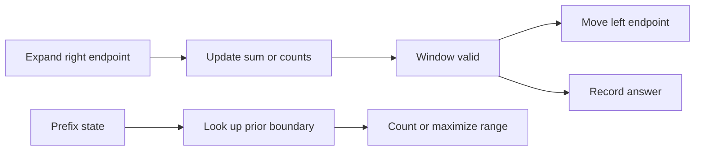

This workbook covers the C# implementations that show up after a problem asks for a contiguous range. Use a window when moving an endpoint changes validity predictably; use prefix sums when arbitrary past boundaries must be remembered.

## C# Mechanics

Sliding windows are endpoint algorithms: add the right item, update state, then shrink the left side while an invariant requires it. Prefix sums are boundary algorithms: transform a range question into a difference between two accumulated states. In C#, the state is usually an `int` or `long`, an `int[]` for bounded alphabets, a `Dictionary<int, int>` for prefix counts, or a deque of indices for monotonic maximums.

| Cue in the problem | C# move | Gotcha to say out loud |
|---|---|---|
| Fixed length window | Maintain a rolling sum or count | Divide after the scan to avoid repeated floating work |
| Shortest or longest valid subarray with positive values | Expand right, shrink left | This monotonic shrink fails when negatives are allowed |
| Character inventory | `int[26]` or `int[128]` | Switch to `Dictionary<char, int>` for wider alphabets |
| Range sum queries | Prefix array with one extra sentinel slot | `prefix[right + 1] - prefix[left]` is the safe formula |
| Count subarrays with a target sum | Prefix count dictionary | Seed prefix zero before the scan |
| Sliding maximum | Deque of indices, not values | Remove stale indices before reading the front |



> [!KEY]
> A window needs a monotone validity rule. If removing from the left can make the condition worse or better unpredictably, reach for prefix sums instead.


## Window Or Prefix Decision

Use this decision before choosing code. A fixed window has a known width, so every iteration has one entering element and, after the first `k` positions, one leaving element. A variable window has a validity predicate over the current range. A prefix-sum solution stores facts about all previous boundaries because the correct left edge might be far behind and cannot be found by local shrinking.

| Question shape | Better pattern | Why |
|---|---|---|
| Every subarray of exactly k elements | Fixed window | Width never changes, so the update is constant work |
| Shortest positive-sum range at least target | Variable window | Positive values make shrinking monotone |
| Count all ranges with sum k | Prefix counts | Many previous starts can end at the same right boundary |
| Longest range with equal transformed sum | Prefix first index | Earliest matching boundary gives the longest span |
| Many range additions then final values | Difference array | Mark changes once and materialize with one prefix pass |
| Maximum inside every window | Monotonic deque | The deque keeps only undominated candidates |

A useful C# habit is to choose the numeric type before writing the loop. Window lengths fit in `int`, but sums over large arrays may not. Prefix values are dictionary keys, so an overflow silently creates wrong key collisions. If constraints are not explicit, use `long` for accumulated sums and only convert at the return boundary when the method signature requires `int`. For text windows, decide whether `int[26]`, `int[128]`, or `Dictionary<char, int>` matches the promised alphabet.

When debugging, print or mentally track the tuple `(left, right, state, answer)`. If `left` moves while the window is invalid for a longest problem, or while it is valid for a shortest problem, that is usually the bug. For prefix maps, the common bug is ordering: query the map before inserting the current prefix when the subarray must be non-empty.

Fixed-window inventory problems also have an ordering trap. When the incoming character is processed, decrement the need and reduce the missing count only if the old need was positive. When the outgoing character leaves, increment the need and increase the missing count only if the old value showed the window was exactly satisfied. Saying this aloud prevents the classic off-by-one in permutation and anagram problems.

For prefix arrays, prefer the sentinel convention even when it feels like one extra slot. A `prefix` array of length `n + 1` lets every query use the same formula and keeps empty prefixes representable. Difference arrays use the same idea from the other direction: write the cancellation at one-past-end, then let the final prefix pass spread the effect.

Finally, decide what the answer means before updating it. Longest-window problems usually update after the window has been repaired to a valid state. Shortest-window problems update inside the loop that is still valid, just before removing the leftmost item. Count problems often update immediately after computing the current prefix because every matching earlier boundary ends at the current index. That timing distinction is a reliable way to find bugs in dry runs. When the interviewer changes from returning one best length to returning every start index, keep the same window state but change only the recording step.

## Best Time to Buy and Sell Stock

For each selling day, the best buy day is the minimum price seen before it. This is a size-changing window with only one piece of state, and returning zero for descending prices falls out of `best = 0`.

```csharp
public int MaxProfit(int[] prices) {
    int minPrice = int.MaxValue;
    int best = 0;
    foreach (int price in prices) {
        best = Math.Max(best, price - minPrice);
        minPrice = Math.Min(minPrice, price);
    }
    return best;
}
```

Complexity: O(n) time and O(1) space.

## Longest Substring Without Repeating Characters

Keep a window with no duplicate character. Instead of shrinking one step at a time, store the last seen index and jump `left` past the previous occurrence when it lies inside the current window.

```csharp
public int LengthOfLongestSubstring(string s) {
    int[] last = new int[128];
    Array.Fill(last, -1);
    int left = 0, best = 0;
    for (int right = 0; right < s.Length; right++) {
        int c = s[right];
        if (last[c] >= left) left = last[c] + 1;
        last[c] = right;
        best = Math.Max(best, right - left + 1);
    }
    return best;
}
```

Complexity: O(n) time and O(1) space for ASCII input.

## Minimum Size Subarray Sum

All numbers are positive, so expanding right can only increase the sum and shrinking left can only decrease it. That monotonicity lets the loop shrink while the target is satisfied to find the shortest valid window.

```csharp
public int MinSubArrayLen(int target, int[] nums) {
    int left = 0, answer = int.MaxValue;
    long sum = 0;
    for (int right = 0; right < nums.Length; right++) {
        sum += nums[right];
        while (sum >= target) {
            answer = Math.Min(answer, right - left + 1);
            sum -= nums[left++];
        }
    }
    return answer == int.MaxValue ? 0 : answer;
}
```

> [!WARNING]
> Do not use this shrinking template for target sums when negative numbers are allowed. A negative leaving the window can increase the sum, so the proof collapses.

Complexity: O(n) time and O(1) space.

## Longest Repeating Character Replacement

A window can be converted to one repeated letter if `windowLength - maxFrequency <= k`. Keep the highest frequency ever seen in the window; it may be stale after shrinking, but it remains safe for maximizing the answer.

```csharp
public int CharacterReplacement(string s, int k) {
    int[] freq = new int[26];
    int left = 0, maxFreq = 0, best = 0;
    for (int right = 0; right < s.Length; right++) {
        int idx = s[right] - 'A';
        freq[idx]++;
        maxFreq = Math.Max(maxFreq, freq[idx]);
        if ((right - left + 1) - maxFreq > k) {
            freq[s[left] - 'A']--;
            left++;
        }
        best = Math.Max(best, right - left + 1);
    }
    return best;
}
```

Complexity: O(n) time and O(1) space.
## Permutation in String

This is a fixed-size window over `s2` with a deficit count initialized from `s1`. When a character enters, it may satisfy a need; when the window exceeds the target size, the outgoing character may create a need again.

```csharp
public bool CheckInclusion(string s1, string s2) {
    int[] count = new int[26];
    foreach (char c in s1) count[c - 'a']++;

    int required = s1.Length;
    int width = s1.Length;
    for (int right = 0; right < s2.Length; right++) {
        if (count[s2[right] - 'a']-- > 0) required--;
        if (right >= width && count[s2[right - width] - 'a']++ >= 0)
            required++;
        if (required == 0) return true;
    }
    return false;
}
```

Complexity: O(n) time and O(1) space for lowercase English letters.

## Minimum Window Substring

Find the shortest substring of `s` that covers the multiset of characters in `t`. Track how many distinct required characters are fully satisfied, then shrink while all requirements are met.

```csharp
public string MinWindow(string s, string t) {
    int[] need = new int[128], have = new int[128];
    int required = 0, formed = 0;
    foreach (char c in t) {
        if (need[c]++ == 0) required++;
    }

    int left = 0, minStart = 0, minLen = int.MaxValue;
    for (int right = 0; right < s.Length; right++) {
        have[s[right]]++;
        if (need[s[right]] > 0 && have[s[right]] == need[s[right]]) formed++;
        while (formed == required) {
            if (right - left + 1 < minLen) {
                minStart = left;
                minLen = right - left + 1;
            }
            char outgoing = s[left++];
            have[outgoing]--;
            if (need[outgoing] > 0 && have[outgoing] < need[outgoing]) formed--;
        }
    }
    return minLen == int.MaxValue ? "" : s.Substring(minStart, minLen);
}
```

Complexity: O(n plus m) time and O(1) space for ASCII input.

## Sliding Window Maximum

The maximum of each window is the front of a decreasing deque of indices. Smaller values behind the new value are dominated because the new value is larger and leaves later.

```csharp
public int[] MaxSlidingWindow(int[] nums, int k) {
    int[] result = new int[nums.Length - k + 1];
    var deque = new LinkedList<int>();
    for (int right = 0; right < nums.Length; right++) {
        while (deque.Count > 0 && nums[deque.Last.Value] <= nums[right])
            deque.RemoveLast();
        deque.AddLast(right);
        if (deque.First.Value < right - k + 1)
            deque.RemoveFirst();
        if (right >= k - 1)
            result[right - k + 1] = nums[deque.First.Value];
    }
    return result;
}
```

> [!TIP]
> Store indices in the deque, not values. Indices let you test whether the front has fallen out of the current window.

Complexity: O(n) time and O(k) space.

## Subarray Sum Equals K

With negative numbers, a window cannot safely shrink. Use the identity `currentPrefix - priorPrefix = k`, and count how many prior prefixes equal `currentPrefix - k`.

```csharp
public int SubarraySum(int[] nums, int k) {
    var counts = new Dictionary<long, int> { [0L] = 1 };
    long prefix = 0;
    int answer = 0;
    foreach (int value in nums) {
        prefix += value;
        answer += counts.GetValueOrDefault(prefix - k, 0);
        counts[prefix] = counts.GetValueOrDefault(prefix, 0) + 1;
    }
    return answer;
}
```

Complexity: O(n) time and O(n) space.

## Continuous Subarray Sum

A subarray sum is divisible by `k` when two prefix sums have the same remainder modulo `k`. Store the earliest index for each remainder so the subarray length is as large as possible and check that it is at least two. When `k` is zero, use the raw prefix sum instead of taking a modulo; two equal prefixes mark a zero-sum subarray.

```csharp
public bool CheckSubarraySum(int[] nums, int k) {
    var firstIndex = new Dictionary<long, int> { [0L] = -1 };
    long prefix = 0;
    long divisor = Math.Abs((long)k);
    for (int i = 0; i < nums.Length; i++) {
        prefix += nums[i];
        long key = divisor == 0 ? prefix : ((prefix % divisor) + divisor) % divisor;
        if (firstIndex.TryGetValue(key, out int start)) {
            if (i - start >= 2) return true;
        } else {
            firstIndex[key] = i;
        }
    }
    return false;
}
```

Complexity: O(n) time and O(min(n, |k|)) space when `k != 0`, or O(n) space when `k == 0`.

## Range Sum Query 2D

Zero-padded prefix matrices make every rectangle query the same four-corner formula. The extra row and column remove boundary branches from both construction and querying.

```csharp
public class NumMatrix {
    private readonly int[][] prefix;

    public NumMatrix(int[][] matrix) {
        int rows = matrix.Length, cols = matrix[0].Length;
        prefix = new int[rows + 1][];
        for (int r = 0; r <= rows; r++) prefix[r] = new int[cols + 1];
        for (int r = 1; r <= rows; r++)
            for (int c = 1; c <= cols; c++)
                prefix[r][c] = matrix[r - 1][c - 1]
                    + prefix[r - 1][c] + prefix[r][c - 1]
                    - prefix[r - 1][c - 1];
    }

    public int SumRegion(int r1, int c1, int r2, int c2) {
        return prefix[r2 + 1][c2 + 1] - prefix[r1][c2 + 1]
             - prefix[r2 + 1][c1] + prefix[r1][c1];
    }
}
```

Complexity: O(mn) build time, O(1) query time, and O(mn) space.
## Reference Table

These variants are worth reviewing after the full solutions because they reuse the same state machines with a changed predicate or boundary formula.

| Problem | Cue that identifies it | Technique | Time and space |
|---|---|---|---|
| Maximum Average Subarray I | Exact window size k | Rolling sum then divide once | O(n), O(1) |
| Max Consecutive Ones III | At most k zeroes | Variable window with zero count | O(n), O(1) |
| Find All Anagrams in a String | Every fixed window permutation | Same deficit array as permutation check | O(n), O(1) |
| Fruit Into Baskets | At most two distinct values | Dictionary counts with shrink while too many types | O(n), O(1) |
| Running Sum of 1d Array | Prefix at every index | Accumulate into result or mutate input | O(n), O(n) |
| Find Pivot Index | Left sum equals right sum | Total sum minus current and left | O(n), O(1) |
| Range Sum Query Immutable | Many static range queries | One-dimensional prefix with sentinel | Build O(n), query O(1), O(n) |
| Contiguous Array | Equal zeroes and ones | Treat zero as minus one and store first prefix index | O(n), O(n) |
| Corporate Flight Bookings | Batch range increments | Difference array then prefix | O(q plus n), O(n) |
| Car Pooling | Capacity over positions | Difference array over stop range | O(n plus range), O(range) |

## Cheat sheet

- Fixed windows usually add one item and remove one item per step.
- Variable windows need a monotone validity predicate.
- Prefix count maps must be seeded with prefix zero before scanning.
- Store first prefix index for longest length, but store counts for number of subarrays.
- Use `long` for sums when constraints can exceed 32-bit range.
- Difference arrays mark range starts and one-past-range endings.
- Deques for sliding maximum store indices in decreasing value order.
- Recomputing a max inside every window is usually O(nk), not O(n).
- Modulo prefix problems often need earliest remainder, not latest.

## Common mistakes

| Mistake | Fix |
|---|---|
| Applying sliding window to arrays with negative values | Use prefix sums and a hash map unless validity is still monotone |
| Forgetting the prefix zero seed | Add `{ [0] = 1 }` for counts or `{ [0] = -1 }` for first indices |
| Removing the deque front after reading the maximum | Remove stale indices before writing the answer |
| Dividing integer sums without casting | Cast to `double` before division for average problems |
| Overwriting earliest prefix index | Keep the first index when maximizing length |
| Allocating `n` slots for a difference array that writes at `end` | Allocate `n + 1` when using one-past-end cancellation |

## Summary

Sliding windows compress contiguous-range search when endpoint movement has predictable effects. Prefix sums handle the harder cases by turning each range into a relationship between two boundaries. In C#, the best implementations keep the state explicit: a rolling sum, a bounded count array, a prefix dictionary, a difference array, or a deque of candidate indices.
## Top Interview Questions

### Q1. How do you know whether a problem is a fixed or variable sliding window?

A fixed window is signaled by an exact length such as k characters, k elements, or every window of size k. The algorithm initializes the first window, then adds the new right item and removes the item that fell off. A variable window is signaled by a condition such as at most k distinct values, sum at least target, or covers all characters. There you expand right to explore and move left only when the condition says the window is too large, already valid, or otherwise needs repair. State the invariant in terms of the current window before writing code.

### Q2. Why does the positive-number minimum subarray problem allow shrinking, but Subarray Sum Equals K does not?

When all numbers are positive, adding to the right never decreases the sum and removing from the left never increases it. That monotonic behavior proves that once a window reaches the target, shrinking it is the only way to find a shorter valid window before expanding again. With negative numbers, removing a negative value can increase the sum, and adding a negative value can decrease it. The endpoint decisions are no longer safe. Prefix sums avoid that problem by considering every prior boundary through a hash map instead of assuming local movement preserves order.

### Q3. What does the stale `maxFreq` trick do in Longest Repeating Character Replacement?

`maxFreq` records the highest frequency ever seen in the active scan, not necessarily the exact maximum after left moves. That is acceptable because the algorithm only needs to avoid underestimating the best possible window length. A stale high value may let the window look valid for a little longer, but it cannot cause a too-large answer to be recorded before a real window of that size has been reachable during the scan. If challenged, you can recompute the maximum over 26 letters after every shrink and still stay O(26n), which is O(n), but the stale version is the common concise implementation.

### Q4. Why does a monotonic deque give O(n) sliding window maximums?

Each index is added to the deque once. It can be removed from the back once when a later value dominates it, or removed from the front once when it leaves the window. Because no index returns after removal, the total number of deque operations is linear. The deque remains decreasing by value, so the front is always the maximum candidate for the current window. Storing indices instead of values is essential because the algorithm must know when the front index is older than `right - k + 1`.

### Q5. What invariant makes Minimum Window Substring correct?

The window counts in `have` reflect exactly the substring from `left` to `right`, and `formed` counts how many distinct required characters currently meet their required frequency. Expanding right can only add supply. Once `formed == required`, the window covers `t`, so the algorithm records it and then moves left while coverage remains true to find the smallest window ending at this `right`. When removing the left character drops a required count below its need, `formed` decreases and the window is no longer valid. That cycle checks each minimal valid boundary once.

### Q6. When do you store prefix counts, and when do you store first prefix indices?

Store counts when the question asks how many subarrays satisfy a condition. For Subarray Sum Equals K, every prior prefix equal to `current - k` contributes one answer, so the dictionary value is a frequency. Store first indices when the question asks for longest length or a minimum starting point. For Contiguous Array or Continuous Subarray Sum, the earliest occurrence of a prefix value creates the longest possible span when the same prefix reappears. Overwriting it with a later index loses information and can shrink the best answer incorrectly.

### Q7. How do difference arrays relate to prefix sums?

A difference array is the inverse representation of a prefix sum. Instead of updating every element in a range, you mark the change at the range start and mark the cancellation one position after the range end. A final prefix pass materializes all point values. This turns q range updates over n positions from O(qn) into O(q plus n). It is ideal for flight bookings, car pooling, and timeline capacity checks. The main bug is indexing: convert one-indexed input carefully and allocate an extra slot if you write at the one-past-end boundary.

### Q8. What C# implementation details matter for these patterns in production code?

Use `long` for accumulated sums when input limits are not tiny, because prefix sums and range updates can overflow `int` even if individual values do not. Pre-size dictionaries when possible for large streams, and choose arrays over dictionaries for bounded alphabets or fixed coordinate ranges. For text windows, confirm whether ASCII, lowercase, UTF-16 characters, or culture-aware comparison is required. For deques, `LinkedList<T>` is convenient but allocation-heavy; a hand-rolled circular array can be faster in hot paths. In interviews, name these trade-offs after presenting the clear solution.