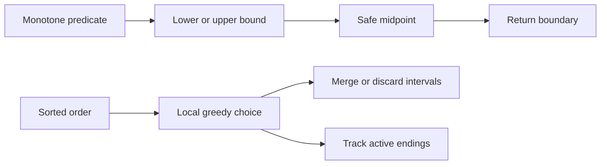

This workbook turns sorted structure into C# code you can write under interview pressure. The common theme is monotonicity: binary search discards impossible halves, while sorting makes the next greedy decision local and provable.

## C# Mechanics

Binary search in C# should use overflow-safe midpoints and a consistent interval convention. Sorting and interval problems should use `CompareTo` or `Comparer<T>` instead of subtracting keys, because coordinate limits can overflow an `int`. `Array.BinarySearch` is useful in production but uncommon in interviews; when it misses, it returns the bitwise complement of the insertion index, so `~result` is the position where the value should be inserted.

| Cue in the problem | C# move | Gotcha to say out loud |
|---|---|---|
| First index satisfying a predicate | Half-open lower bound over `[lo, hi)` | Initialize `hi = n` so answer `n` is reachable |
| Last feasible value | Upper midpoint `lo + (hi - lo + 1) / 2` | Prevent infinite loops when assigning `lo = mid` |
| Search over capacity or speed | Binary search the answer, write `Can(...)` | Feasibility must be monotone |
| Sort intervals | `Array.Sort(intervals, (a, b) => a[0].CompareTo(b[0]))` | Do not subtract keys in the comparer |
| Need earliest finishing choice | Sort by end and greedily keep or shoot | The proof is an exchange argument |
| Reuse meeting rooms | `PriorityQueue<int, int>` of end times | Available in .NET 6+ and implemented as a min-heap |



> [!KEY]
> Binary search is not about arrays only. It is about a true or false region with one boundary; the code is just a disciplined way to find that boundary.


## Boundary And Ordering Checklist

Most mistakes in this group are not the idea; they are the boundary chosen for the loop. Decide whether the answer can be before the first element, after the last element, or exactly at `mid`. Then pick a convention and never mix it halfway through the code. For sorting problems, decide which key makes future work local: start time for merging, end time for keeping compatible intervals, concatenation order for largest number, or active end times for meeting rooms.

| Decision | Safe default | Why it matters |
|---|---|---|
| Exact sorted lookup | Closed interval or half-open interval | Both work only if updates match the invariant |
| Insertion point | Half-open lower bound | It naturally returns `n` when the target is larger than all values |
| Last true predicate | Upper midpoint | Prevents stalling when two candidates remain |
| Feasibility search | First true lower bound | Finds the minimum capacity, speed, or day that works |
| Interval merging | Sort by start | Overlaps become adjacent |
| Interval selection | Sort by end | Earliest finishing choice leaves maximum room |
| Custom order | Comparator, not arithmetic subtraction | Avoids overflow and preserves sort contracts |

In C#, prefer small helper methods for predicates such as `CanFinish`, `CanShip`, `LowerBound`, and `UpperBound`. They make the binary search loop read like the proof: choose a candidate, ask whether it is feasible, and move the boundary. For interval arrays, remember that `int[][]` stores references to inner arrays. Mutating `last[1]` inside a merged result also mutates that inner interval object, which is fine for LeetCode but worth mentioning if an API promises not to mutate inputs.

`Array.BinarySearch` is worth knowing but rarely the clearest interview answer. A negative return value is the bitwise complement of the insertion index, so `~result` recovers the lower-bound position. Writing the loop yourself is usually better because it exposes whether you are finding an exact hit, first true value, last true value, or insertion point.

For sorting, call out whether the algorithm is stable. `Array.Sort` is not a stability promise, so if equal keys must preserve original order, attach original indices or use a stable projection explicitly. Most interval problems do not need stability because the overlap rule is independent of the original order after sorting.

For answer-space searches, spend a sentence on bounds. The lower bound should be a value that might work only at the smallest feasible edge, such as the maximum package weight for shipping capacity. The upper bound should be definitely feasible, such as the sum of all weights when shipping everything in one day. Tight bounds reduce iterations, but correctness matters more: if the true answer is outside the interval, the binary search will be perfectly implemented and still wrong. The same habit helps interval scans: initialize the first kept end or room heap from a real interval when possible, and use sentinel values only when their ordering is obviously safe.
If constraints allow empty input, add the guard before the loop instead of weakening the invariant inside it.

## Search Insert Position

Return the index of the target, or where it should be inserted to keep the array sorted. This is the lower-bound template: first index whose value is greater than or equal to the target.

```csharp
public int SearchInsert(int[] nums, int target) {
    int lo = 0, hi = nums.Length;
    while (lo < hi) {
        int mid = lo + (hi - lo) / 2;
        if (nums[mid] < target)
            lo = mid + 1;
        else
            hi = mid;
    }
    return lo;
}
```

Complexity: O(log n) time and O(1) space.

## Find First and Last Position

Use lower bound for the first target and upper bound for the first value greater than target. Avoid `target + 1`, because that overflows when the target is `int.MaxValue`.

```csharp
public int[] SearchRange(int[] nums, int target) {
    int first = LowerBound(nums, target);
    if (first == nums.Length || nums[first] != target)
        return new[] { -1, -1 };
    int last = UpperBound(nums, target) - 1;
    return new[] { first, last };
}

private int LowerBound(int[] nums, int target) {
    int lo = 0, hi = nums.Length;
    while (lo < hi) {
        int mid = lo + (hi - lo) / 2;
        if (nums[mid] < target) lo = mid + 1;
        else hi = mid;
    }
    return lo;
}

private int UpperBound(int[] nums, int target) {
    int lo = 0, hi = nums.Length;
    while (lo < hi) {
        int mid = lo + (hi - lo) / 2;
        if (nums[mid] <= target) lo = mid + 1;
        else hi = mid;
    }
    return lo;
}
```

Complexity: O(log n) time and O(1) space.

## Search in Rotated Sorted Array

A rotation preserves sorted order in at least one half around the midpoint. Identify the sorted half, decide whether the target can live there, and discard the other half.

```csharp
public int Search(int[] nums, int target) {
    int lo = 0, hi = nums.Length - 1;
    while (lo <= hi) {
        int mid = lo + (hi - lo) / 2;
        if (nums[mid] == target) return mid;

        if (nums[lo] <= nums[mid]) {
            if (nums[lo] <= target && target < nums[mid])
                hi = mid - 1;
            else
                lo = mid + 1;
        } else {
            if (nums[mid] < target && target <= nums[hi])
                lo = mid + 1;
            else
                hi = mid - 1;
        }
    }
    return -1;
}
```

Complexity: O(log n) time and O(1) space when values are distinct.

## Koko Eating Bananas

The answer is not an index in the input; it is the minimum feasible eating speed. If Koko can finish at speed `k`, then every larger speed is also feasible, so binary search the first true speed.

```csharp
public int MinEatingSpeed(int[] piles, int h) {
    int lo = 1, hi = piles.Max();
    while (lo < hi) {
        int speed = lo + (hi - lo) / 2;
        if (CanFinish(piles, speed, h))
            hi = speed;
        else
            lo = speed + 1;
    }
    return lo;
}

private bool CanFinish(int[] piles, int speed, int h) {
    long hours = 0;
    foreach (int pile in piles)
        hours += ((long)pile + speed - 1) / speed;
    return hours <= h;
}
```

> [!WARNING]
> Feasibility checks often overflow before the search itself does. Accumulate hours, weights, or products in `long` unless constraints make `int` unquestionably safe.

Complexity: O(n log M) time where M is the largest pile, and O(1) space.
## Median of Two Sorted Arrays

Partition both arrays so the left side contains half the elements and every left value is less than or equal to every right value. Search only the smaller array to keep the logarithm small and the sentinels manageable.

```csharp
public double FindMedianSortedArrays(int[] nums1, int[] nums2) {
    if (nums1.Length > nums2.Length)
        return FindMedianSortedArrays(nums2, nums1);

    int m = nums1.Length, n = nums2.Length;
    int half = (m + n + 1) / 2;
    int lo = 0, hi = m;
    while (lo <= hi) {
        int i = lo + (hi - lo) / 2;
        int j = half - i;
        int maxL1 = i == 0 ? int.MinValue : nums1[i - 1];
        int minR1 = i == m ? int.MaxValue : nums1[i];
        int maxL2 = j == 0 ? int.MinValue : nums2[j - 1];
        int minR2 = j == n ? int.MaxValue : nums2[j];

        if (maxL1 <= minR2 && maxL2 <= minR1) {
            if ((m + n) % 2 == 1) return Math.Max(maxL1, maxL2);
            return (Math.Max(maxL1, maxL2) + (double)Math.Min(minR1, minR2)) / 2.0;
        }
        if (maxL1 > minR2) hi = i - 1;
        else lo = i + 1;
    }
    return 0.0;
}
```

Complexity: O(log min(m, n)) time and O(1) space.

## Merge Intervals

Sorting by start makes every overlapping interval adjacent to the segment it can extend. The output list remains non-overlapping because each new interval either extends the last segment or starts after it.

```csharp
public int[][] Merge(int[][] intervals) {
    if (intervals.Length == 0) return Array.Empty<int[]>();
    Array.Sort(intervals, (a, b) => a[0].CompareTo(b[0]));
    var merged = new List<int[]> { intervals[0] };
    for (int i = 1; i < intervals.Length; i++) {
        int[] last = merged[merged.Count - 1];
        int[] current = intervals[i];
        if (current[0] <= last[1])
            last[1] = Math.Max(last[1], current[1]);
        else
            merged.Add(current);
    }
    return merged.ToArray();
}
```

Complexity: O(n log n) time from sorting and O(n) output space.

## Insert Interval

The input is already sorted and non-overlapping, so do not sort again. Copy intervals before the new range, merge the overlapping middle, then copy the suffix.

```csharp
public int[][] Insert(int[][] intervals, int[] newInterval) {
    var result = new List<int[]>();
    int i = 0;
    while (i < intervals.Length && intervals[i][1] < newInterval[0])
        result.Add(intervals[i++]);

    while (i < intervals.Length && intervals[i][0] <= newInterval[1]) {
        newInterval[0] = Math.Min(newInterval[0], intervals[i][0]);
        newInterval[1] = Math.Max(newInterval[1], intervals[i][1]);
        i++;
    }

    result.Add(newInterval);
    while (i < intervals.Length) result.Add(intervals[i++]);
    return result.ToArray();
}
```

Complexity: O(n) time and O(n) output space.

## Non-overlapping Intervals

To remove the fewest intervals, keep as many compatible intervals as possible. Sorting by end time is the greedy choice because the earliest finishing kept interval leaves maximum room for the future.

```csharp
public int EraseOverlapIntervals(int[][] intervals) {
    Array.Sort(intervals, (a, b) => a[1].CompareTo(b[1]));
    int removed = 0;
    int previousEnd = int.MinValue;
    foreach (int[] interval in intervals) {
        if (interval[0] >= previousEnd)
            previousEnd = interval[1];
        else
            removed++;
    }
    return removed;
}
```

Complexity: O(n log n) time and O(1) extra space excluding sort stack.

## Meeting Rooms II

Sort meetings by start time and keep the end time of every allocated room in a min-heap. If the earliest room ends before the next meeting starts, reuse it; otherwise allocate another room.

```csharp
public int MinMeetingRooms(int[][] intervals) {
    Array.Sort(intervals, (a, b) => a[0].CompareTo(b[0]));
    var ends = new PriorityQueue<int, int>();
    foreach (int[] meeting in intervals) {
        if (ends.Count > 0 && ends.Peek() <= meeting[0])
            ends.Dequeue();
        ends.Enqueue(meeting[1], meeting[1]);
    }
    return ends.Count;
}
```

Complexity: O(n log n) time and O(n) space.

## Largest Number

The sorting key is not numeric value; it is which concatenation order creates the larger string. Put `a` before `b` when `a + b` is lexicographically larger than `b + a`, and collapse all-zero output to one zero.

```csharp
public string LargestNumber(int[] nums) {
    string[] parts = Array.ConvertAll(nums, n => n.ToString());
    Array.Sort(parts, (a, b) =>
        string.Compare(b + a, a + b, StringComparison.Ordinal));
    if (parts[0] == "0") return "0";
    return string.Concat(parts);
}
```

> [!TIP]
> Custom comparers must be consistent and overflow-safe. For numeric keys use `CompareTo`; for concatenation ordering use ordinal string comparison rather than subtraction or parsing.

Complexity: O(n log n times L) time where L is average digit length, and O(nL) space.
## Reference Table

These remaining problems are high-yield variations on the same boundaries, predicates, and sorted greedy choices.

| Problem | Cue that identifies it | Technique | Time and space |
|---|---|---|---|
| Binary Search | Exact target in sorted array | Half-open or closed interval search | O(log n), O(1) |
| Sqrt(x) | Largest k with k squared at most x | Last-true binary search with `long` product | O(log x), O(1) |
| First Bad Version | First true API response | Lower bound on a monotone predicate | O(log n), O(1) |
| Find Peak Element | Local slope guarantees a peak | Compare `mid` with `mid + 1` | O(log n), O(1) |
| Search a 2D Matrix | Globally sorted matrix | Binary search virtual one-dimensional index | O(log mn), O(1) |
| Find Minimum in Rotated Sorted Array | Rotation point is minimum | Compare `mid` with right endpoint | O(log n), O(1) |
| Capacity To Ship Packages | Minimum feasible capacity | Binary search answer with greedy feasibility | O(n log sum), O(1) |
| Meeting Rooms | Can attend every meeting | Sort starts and check adjacent overlap | O(n log n), O(1) |
| Interval List Intersections | Two sorted interval lists | Advance pointer with earlier end | O(n plus m), O(1) |
| Minimum Arrows to Burst Balloons | Points covering intervals | Sort by end and shoot greedily | O(n log n), O(1) |
| Implement Merge Sort | Stable divide and conquer sorting | Reuse one temp buffer | O(n log n), O(n) |
| Quick Sort and Quickselect | Partition around pivot | Random pivot, recurse selected side for select | Average O(n log n) sort or O(n) select |

## Cheat sheet

- Use `lo + (hi - lo) / 2` for midpoints.
- Half-open lower bound returns `n` when every value is smaller than the target.
- Last-true searches need the upper midpoint when assigning `lo = mid`.
- Binary search on answer requires a monotone feasibility function.
- Compare interval endpoints with `CompareTo`, not subtraction.
- Sort by start for merging, by end for maximum compatible interval sets.
- In rotated arrays with duplicates, equality can force O(n) fallback.
- `PriorityQueue<TElement, TPriority>` is the standard min-heap in .NET 6+.
- Custom string comparers should use `StringComparison.Ordinal`.

## Common mistakes

| Mistake | Fix |
|---|---|
| Initializing lower-bound `hi` to `n - 1` | Use `hi = n` so insertion after the last element is reachable |
| Computing `(lo + hi) / 2` | Use `lo + (hi - lo) / 2` to avoid overflow |
| Using `target + 1` for upper bound | Write a real upper-bound predicate to handle `int.MaxValue` |
| Sorting intervals with `a[1] - b[1]` | Use `a[1].CompareTo(b[1])` |
| Treating touching intervals as overlapping in meeting rooms | Use `nextStart < currentEnd`; equality is back-to-back |
| Forgetting all-zero handling in Largest Number | If the first sorted string is `0`, return `0` |

## Summary

Binary search problems ask for a boundary; sorting and interval problems ask for an order that makes the next decision safe. In C#, disciplined bounds, overflow-safe arithmetic, and comparer correctness are part of the solution, not polish. Once the invariant is clear, the implementation is usually a short loop plus a careful return boundary.
## Top Interview Questions

### Q1. What is the difference between lower bound and upper bound?

Lower bound returns the first index whose value is greater than or equal to the target. Upper bound returns the first index whose value is strictly greater than the target. Together they describe the full range of equal values in a sorted array: first occurrence is lower bound, last occurrence is upper bound minus one. The half-open interval `[lo, hi)` makes both easy because `hi` starts at `n`, so an insertion point after the last element is reachable. In C#, avoid shortcuts like `target + 1` for upper bound because `int.MaxValue + 1` overflows.

### Q2. Why is midpoint overflow a real interview concern?

If `lo` and `hi` are large positive integers, `(lo + hi) / 2` can overflow before division. This is not theoretical: APIs like First Bad Version use `n = int.MaxValue` as a common edge case. The safe midpoint is `lo + (hi - lo) / 2`, where the subtraction stays within the interval size. For last-true searches that assign `lo = mid`, use `lo + (hi - lo + 1) / 2` so the midpoint rounds upward and the loop cannot stall when two values remain. Mentioning this shows you know both correctness and termination details.

### Q3. How do you recognize binary search on the answer?

The input may not be sorted, but the answer space is ordered and feasibility is monotone. In Koko Eating Bananas, if speed `k` works, any larger speed also works. In shipping capacity, if capacity `c` works, any larger capacity also works. That creates a false region followed by a true region, so lower-bound search finds the first feasible value. The implementation has two parts: tight search bounds and a `Can(...)` function that runs in linear time. If feasibility is not monotone, binary search on the answer is invalid no matter how clean the code looks.

### Q4. What changes in rotated sorted arrays when duplicates are allowed?

With distinct values, comparing `nums[lo]` and `nums[mid]` tells you which half is sorted, and comparing `nums[mid]` with `nums[hi]` can locate the minimum. Duplicates make equality ambiguous. For example, when `nums[mid] == nums[hi]`, the minimum may be on either side, so the safe fallback is usually `hi--`. That preserves correctness but can degrade to O(n), such as an array of all equal values. In interviews, state the distinct-value assumption first, then describe the duplicate fallback and its worst-case complexity.

### Q5. Why does the median of two sorted arrays search the smaller array?

The partition chooses `i` elements from the first array and `j` from the second so the left side has half the total length. If you search the smaller array, `i` stays within a smaller range and `j = half - i` is easier to keep valid with sentinels. The correctness condition is `maxLeft1 <= minRight2` and `maxLeft2 <= minRight1`. If `maxLeft1` is too large, move `i` left; otherwise move it right. The smaller-array rule gives O(log min(m, n)) time and avoids boundary bugs when one array contributes zero elements.

### Q6. Why does sorting by end time work for interval removal and arrows?

Sorting by end time keeps the option that finishes earliest. For non-overlapping intervals, if two intervals overlap, keeping the one with the earlier end cannot reduce the number of future intervals that can fit; it only leaves more room. That exchange argument proves the greedy choice. For arrows, shooting at the earliest end bursts every balloon whose start is before that point, and delaying the arrow would not help the current earliest-ending balloon. These problems look different, but both ask for the smallest set of choices that cover or keep compatible intervals.

### Q7. What makes a custom sort comparer safe in C#?

A comparer must be consistent, transitive, and overflow-safe. For numeric endpoints, use `a.CompareTo(b)` rather than `a - b`, because subtraction can overflow when values approach `int.MinValue` or `int.MaxValue`. For string-based ordering such as Largest Number, compare the two possible concatenations with `StringComparison.Ordinal` so culture rules do not affect algorithmic order. If a comparer is inconsistent, `Array.Sort` is allowed to produce surprising results or throw. In an interview, explain the comparison rule in words before relying on the lambda.

### Q8. When would you use a heap instead of a sweep line for meeting rooms?

A heap of end times is the clearest implementation when meetings arrive sorted by start time and you need to know whether the earliest room is free. It also maps naturally to assigning actual rooms. A sweep line separates all starts and ends, sorts them, and counts active meetings as time advances; it is compact when you only need the maximum overlap. Both are O(n log n). In C#, `PriorityQueue<int, int>` gives a direct min-heap for the heap version, while the sweep line can be two sorted arrays of starts and ends.