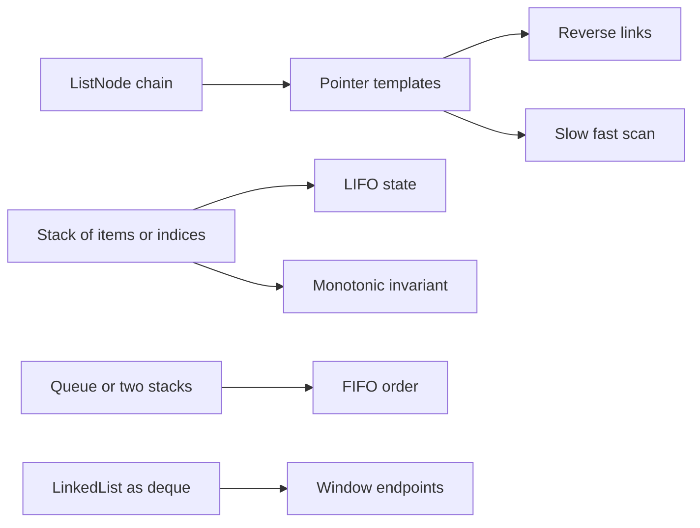

This workbook keeps the linear-structure theory light and spends its space on worked C# solutions. The problems below are the ones that repeatedly test pointer discipline, stack invariants, queue amortisation, and the ability to state complexity without hand-waving.

## C# Mechanics

Most linked-list interview platforms provide a `ListNode` with lowercase fields, while production C# would normally use properties and clearer names. Use the platform shape in solutions so the method can be pasted into the judge, then say out loud which part is the real invariant: which segment is already reversed, which node is the predecessor, or which stack entries are still waiting for an answer.

```csharp
public class ListNode {
    public int val;
    public ListNode next;
    public ListNode(int val = 0, ListNode next = null) {
        this.val = val;
        this.next = next;
    }
}
```

| Need | C# mechanic | Interview cue |
|---|---|---|
| Hand-rolled nodes | `ListNode`, `Node`, or a small nested class | Identity matters more than value equality |
| LIFO state | `Stack<T>` | Parsing, monotonic stacks, undoing nested context |
| FIFO state | `Queue<T>` | Level BFS, two-stack queue, multi-source spread |
| Deque behavior | `LinkedList<T>` or two stacks | .NET has no built-in `Deque<T>` in common LeetCode versions |
| Monotonic scan | `Stack<int>` of indices | Store indices when the answer is a distance or width |



> [!KEY]
> In pointer problems, name the role of each reference before writing code. `prev`, `curr`, `next`, `slow`, `fast`, `dummy`, and `tail` are not decoration; they are the proof outline.

The easiest way to keep these solutions interview-ready is to state the invariant before the first line of code. For linked lists, say which links are already final and which pointer is allowed to move. For stacks, say what unresolved work remains in the stack and what condition makes an item ready to pop. For queues, say whether the operation is worst-case or amortised. That short sentence prevents most off-by-one, lost-tail, and stale-minimum bugs.

Use the .NET collections directly unless the problem is explicitly about designing a collection. `Stack<T>` and `Queue<T>` are backed by arrays and are excellent for algorithm snippets. `LinkedList<T>` is useful when a real deque is required, but it is rarely necessary for these selected problems because the core challenge is usually an invariant, not a missing container.

## Worked Linked List Problems

The linked-list set below intentionally mixes tiny templates with composition problems. Reverse and merge are the base moves; remove-nth and cycle-entry test pointer spacing; reorder and random-copy test whether you can combine templates without corrupting the structure. In a whiteboard interview, draw three or four nodes and trace pointer identity, not just values.

### Reverse Linked List

Reverse a singly linked list in place. The key invariant is that everything before `curr` is already reversed and `next` is saved before the old forward link is cut.

```csharp
public ListNode ReverseList(ListNode head) {
    ListNode prev = null;
    ListNode curr = head;
    while (curr != null) {
        ListNode next = curr.next;
        curr.next = prev;
        prev = curr;
        curr = next;
    }
    return prev;
}
```

Complexity: `O(n)` time and `O(1)` extra space.

### Merge Two Sorted Lists

Merge two sorted chains by moving existing nodes behind a dummy head. The dummy removes the special case for the first output node, and the tail invariant stays simple: everything behind `tail` is already sorted.

```csharp
public ListNode MergeTwoLists(ListNode list1, ListNode list2) {
    var dummy = new ListNode();
    var tail = dummy;
    while (list1 != null && list2 != null) {
        if (list1.val <= list2.val) {
            tail.next = list1;
            list1 = list1.next;
        } else {
            tail.next = list2;
            list2 = list2.next;
        }
        tail = tail.next;
    }
    tail.next = list1 ?? list2;
    return dummy.next;
}
```

Complexity: `O(m + n)` time and `O(1)` extra space.

### Remove Nth Node From End

Use a dummy node and keep `fast` exactly `n + 1` steps ahead of `slow`. When `fast` falls off the list, `slow` is parked at the predecessor of the node to delete, including when the real head is removed.

```csharp
public ListNode RemoveNthFromEnd(ListNode head, int n) {
    var dummy = new ListNode(0, head);
    ListNode slow = dummy, fast = dummy;
    for (int i = 0; i <= n; i++)
        fast = fast.next;
    while (fast != null) {
        slow = slow.next;
        fast = fast.next;
    }
    slow.next = slow.next.next;
    return dummy.next;
}
```

Complexity: `O(L)` time and `O(1)` extra space.

### Linked List Cycle II

Floyd's algorithm has two phases. First find any meeting point inside the cycle; then reset one pointer to `head` and advance both one step at a time until they meet at the entry.

```csharp
public ListNode DetectCycle(ListNode head) {
    ListNode slow = head, fast = head;
    while (fast != null && fast.next != null) {
        slow = slow.next;
        fast = fast.next.next;
        if (slow == fast) {
            ListNode entry = head;
            while (entry != slow) {
                entry = entry.next;
                slow = slow.next;
            }
            return entry;
        }
    }
    return null;
}
```

Complexity: `O(n)` time and `O(1)` extra space. Compare node identity, not node values.

### Reorder List

The pattern is three templates chained together: find the middle, reverse the second half, then weave alternating nodes. Cut `slow.next` before weaving or the first half can retain a stale edge and form a cycle.

```csharp
public void ReorderList(ListNode head) {
    if (head == null || head.next == null) return;
    ListNode slow = head, fast = head;
    while (fast.next != null && fast.next.next != null) {
        slow = slow.next;
        fast = fast.next.next;
    }
    ListNode second = Reverse(slow.next);
    slow.next = null;
    for (ListNode first = head; second != null;) {
        ListNode a = first.next, b = second.next;
        first.next = second;
        second.next = a;
        first = a;
        second = b;
    }
}

private ListNode Reverse(ListNode node) {
    ListNode prev = null;
    while (node != null) {
        ListNode next = node.next;
        node.next = prev;
        prev = node;
        node = next;
    }
    return prev;
}
```

Complexity: `O(n)` time and `O(1)` extra space.

### Copy List with Random Pointer

The constant-space trick interleaves each copy after its original, uses that position as the implicit map, then separates the two chains. It is a deep copy because every `next` and `random` edge in the copy points to copied nodes.

```csharp
public Node CopyRandomList(Node head) {
    if (head == null) return null;
    for (Node node = head; node != null; node = node.next.next) {
        var copy = new Node(node.val) { next = node.next };
        node.next = copy;
    }
    for (Node node = head; node != null; node = node.next.next)
        node.next.random = node.random?.next;

    var dummy = new Node(0);
    Node tail = dummy;
    for (Node node = head; node != null; node = node.next) {
        tail.next = node.next;
        tail = tail.next;
        node.next = tail.next;
    }
    return dummy.next;
}
```

Complexity: `O(n)` time and `O(1)` auxiliary space beyond the copied nodes.

> [!WARNING]
> Many linked-list solutions mutate the input. If the interview asks for the original list to remain intact, either restore the second half after comparison or choose the stack or hash-map variant.

## Worked Stack and Queue Problems

These problems all store deferred decisions. A parser stack waits for a matching closer, a monotonic stack waits for a boundary that proves an answer, and a two-stack queue waits until order reversal is actually needed. The implementation is usually short; the interview signal is whether you can explain why the stack never needs to revisit popped state.

### Min Stack

Track the data stack and a second stack of running minimums. Push duplicate minimums with `<=`; otherwise popping one copy of the minimum would erase the only minimum marker.

```csharp
public class MinStack {
    private readonly Stack<int> _data = new();
    private readonly Stack<int> _mins = new();

    public void Push(int val) {
        _data.Push(val);
        if (_mins.Count == 0 || val <= _mins.Peek())
            _mins.Push(val);
    }

    public void Pop() {
        int val = _data.Pop();
        if (val == _mins.Peek()) _mins.Pop();
    }

    public int Top() => _data.Peek();
    public int GetMin() => _mins.Peek();
}
```

Complexity: `O(1)` per operation and `O(n)` space.

### Implement Queue Using Stacks

Two stacks simulate FIFO order by reversing only when necessary. The expensive pour is amortised because each element moves from `_inbox` to `_outbox` at most once.

```csharp
public class MyQueue {
    private readonly Stack<int> _inbox = new();
    private readonly Stack<int> _outbox = new();

    public void Push(int x) => _inbox.Push(x);
    public int Pop() { Pour(); return _outbox.Pop(); }
    public int Peek() { Pour(); return _outbox.Peek(); }
    public bool Empty() => _inbox.Count == 0 && _outbox.Count == 0;

    private void Pour() {
        if (_outbox.Count != 0) return;
        while (_inbox.Count > 0)
            _outbox.Push(_inbox.Pop());
    }
}
```

Complexity: amortised `O(1)` per operation, worst-case `O(n)` for a single pour, and `O(n)` space.

### Decode String

Nested encodings need the previous builder and its repeat count saved when `[` opens a new frame. Use `StringBuilder` so repeated appends are linear in the decoded output size rather than quadratic.

```csharp
public string DecodeString(string s) {
    var counts = new Stack<int>();
    var builders = new Stack<StringBuilder>();
    var current = new StringBuilder();
    int count = 0;
    foreach (char ch in s) {
        if (char.IsDigit(ch)) {
            count = count * 10 + ch - '0';
        } else if (ch == '[') {
            counts.Push(count);
            builders.Push(current);
            current = new StringBuilder();
            count = 0;
        } else if (ch == ']') {
            int repeat = counts.Pop();
            var previous = builders.Pop();
            string inner = current.ToString();
            for (int i = 0; i < repeat; i++) previous.Append(inner);
            current = previous;
        } else {
            current.Append(ch);
        }
    }
    return current.ToString();
}
```

Complexity: `O(L)` time and `O(D + L)` space, where `L` is decoded length and `D` is nesting depth.

### Daily Temperatures

Keep a stack of indices whose answer has not been found yet, in non-increasing temperature order. When a warmer day arrives, every colder index popped receives the distance to the current day.

```csharp
public int[] DailyTemperatures(int[] temperatures) {
    int n = temperatures.Length;
    int[] answer = new int[n];
    var stack = new Stack<int>();
    for (int i = 0; i < n; i++) {
        while (stack.Count > 0 &&
               temperatures[i] > temperatures[stack.Peek()]) {
            int day = stack.Pop();
            answer[day] = i - day;
        }
        stack.Push(i);
    }
    return answer;
}
```

Complexity: `O(n)` time and `O(n)` space.

### Remove K Digits

The greedy exchange is local but decisive: if a higher-significance digit is larger than the incoming digit, delete it while you still can. After the scan, remove leftover digits from the right and trim leading zeroes.

```csharp
public string RemoveKdigits(string num, int k) {
    var stack = new Stack<char>();
    foreach (char digit in num) {
        while (k > 0 && stack.Count > 0 && stack.Peek() > digit) {
            stack.Pop();
            k--;
        }
        stack.Push(digit);
    }
    while (k-- > 0) stack.Pop();
    char[] chars = stack.ToArray();
    Array.Reverse(chars);
    if (chars.Length == 0) return "0";
    int start = 0, last = chars.Length - 1;
    while (start < last && chars[start] == '0') start++;
    return new string(chars, start, chars.Length - start);
}
```

Complexity: `O(n)` time and `O(n)` space. Preserve one zero so inputs like `10`, `k = 1` return `0`, not an empty string.

### Largest Rectangle in Histogram

A non-decreasing stack delays pricing a bar until the first shorter bar on the right is known. The previous stack top after popping is the first shorter bar on the left, so the width is exclusive on both sides.

```csharp
public int LargestRectangleArea(int[] heights) {
    int n = heights.Length;
    var extended = new int[n + 1];
    Array.Copy(heights, extended, n);
    var stack = new Stack<int>();
    int best = 0;
    for (int i = 0; i <= n; i++) {
        while (stack.Count > 0 && extended[i] < extended[stack.Peek()]) {
            int height = extended[stack.Pop()];
            int width = stack.Count == 0 ? i : i - stack.Peek() - 1;
            best = Math.Max(best, height * width);
        }
        stack.Push(i);
    }
    return best;
}
```

Complexity: `O(n)` time and `O(n)` space.

> [!TIP]
> In monotonic-stack problems, decide whether the stack is increasing or decreasing, whether it stores values or indices, and when an entry becomes impossible to improve.

## Reference Table

The remaining source problems are still useful drills. Use the cue column to identify the pattern quickly, then implement from the template rather than memorising the whole solution. If a table row sounds close to a worked problem, name the delta: `Reverse Linked List II` adds fixed boundaries, `Maximal Rectangle` reuses histogram row by row, and `Basic Calculator II` adds operator precedence to the same stack idea.

| Problem | Identifying cue | Technique | Time | Space |
|---|---|---|---|---|
| Middle of the Linked List | Return second middle on even length | Slow and fast pointers | `O(n)` | `O(1)` |
| Palindrome Linked List | Compare first half to reversed second half | Middle plus reverse plus compare | `O(n)` | `O(1)` |
| Add Two Numbers | Carry flows while either list remains | Digit simulation with dummy tail | `O(max(m,n))` | `O(max(m,n))` |
| Reverse Linked List II | Reverse only positions left through right | Dummy predecessor and local head insertion | `O(right)` | `O(1)` |
| Sort List | Linked list sorting without random access | Merge sort and slow fast split | `O(n log n)` | `O(log n)` |
| Reverse Nodes in k-Group | Reverse complete blocks only | Count block then reverse window | `O(n)` | `O(n/k)` recursive |
| Valid Parentheses | Closing token must match last opener | Stack of opening brackets | `O(n)` | `O(n)` |
| Evaluate Reverse Polish Notation | Operator consumes two previous operands | Operand stack | `O(n)` | `O(n)` |
| Basic Calculator II | `*` and `/` bind before final sum | Stack signed terms after immediate multiply | `O(n)` | `O(n)` |
| Asteroid Collision | Only right mover before left mover can collide | Stack simulation | `O(n)` | `O(n)` |
| Next Greater Element II | Circular next greater value | Monotonic stack over two passes | `O(n)` | `O(n)` |
| Maximal Rectangle | Each matrix row becomes a histogram | Running heights plus histogram stack | `O(mn)` | `O(n)` |

## Cheat sheet

- Use a dummy head when deletion or insertion can affect the real head.
- Save `next` before rewiring a link; otherwise the rest of the chain is lost.
- Slow and fast pointers solve middle, cycle, and one-pass distance problems.
- For cycle entry, the first meeting point is not the answer; reset one pointer.
- `Stack<T>` enumerates and converts in LIFO order, so reverse arrays when rebuilding strings.
- A monotonic stack is linear because every index is pushed once and popped once.
- For queues with stacks, pour lazily from input to output only when output is empty.
- `LinkedList<T>` can model a deque, but node removal requires holding `LinkedListNode<T>` references.
- Mutating a list is often allowed in coding platforms but should be named as a trade-off.

## Common mistakes

| Mistake | Fix |
|---|---|
| Returning the first Floyd meeting point as the cycle entry | Run the second phase with one pointer reset to `head` |
| Advancing `fast` only `n` steps for remove-nth | Advance `n + 1` from the dummy so `slow` lands on the predecessor |
| Pushing duplicate minimums only once in `MinStack` | Push to the min stack when `val <= currentMin` |
| Storing temperatures instead of indices | Store indices whenever the answer is a distance or width |
| Eagerly pouring the two-stack queue on every push | Pour only when the output stack is empty |
| Forgetting the histogram sentinel | Append height `0` so every remaining bar is priced |

## Summary

Linear-structure interviews are won by clean invariants. Linked-list work is pointer ownership and predecessor control; stack work is delayed decisions; queue work is ordering plus amortisation. In C#, the platform APIs are simple, but the absence of a standard deque and the lowercase LeetCode node fields are worth acknowledging before writing code. When stuck, reduce the problem to the moment a node, index, or element becomes safe to commit; that moment almost always reveals the right pointer move or stack pop. Finish by naming whether the input was mutated, because that is the follow-up many interviewers use.

## Top Interview Questions

### Q1. Why does the three-pointer linked-list reversal work?

At the start of every loop, `prev` is the head of the already-reversed prefix, `curr` is the first node not yet processed, and the original suffix still begins at `curr`. The only dangerous operation is assigning `curr.next = prev`, because it destroys the old forward edge. Saving `next = curr.next` first preserves the suffix. After rewiring, moving `prev` to `curr` and `curr` to `next` expands the reversed prefix by one node and keeps the invariant true. When `curr` becomes null, there is no unreversed suffix left, so `prev` is the new head. This proof also explains why the algorithm is `O(n)` time and `O(1)` space.

### Q2. When should you introduce a dummy node?

Use a dummy node whenever the operation may need to change the real head or when the first output node would otherwise require a special case. Removing the nth node from the end, merging sorted lists, partitioning a list, and adding numbers are standard examples. The dummy gives you a stable predecessor before the first real node, so deletion is always `prev.next = prev.next.next` and appending is always `tail.next = node`. The dummy's value is irrelevant because the returned head is `dummy.next`. In an interview, mention that a dummy node is not extra asymptotic allocation; it is one helper object or stack variable that buys simpler, safer pointer logic.

### Q3. How do slow and fast pointers solve different problems?

The same speed difference gives different information depending on the stop condition. For middle-of-list, `fast` moves two nodes while `slow` moves one, so when `fast` reaches the end, `slow` is at the middle. For remove-nth, a fixed gap of `n + 1` from a dummy makes `slow` the predecessor when `fast` reaches null. For cycle detection, a two-speed chase guarantees a meeting inside the cycle if one exists, because the distance between pointers changes by one modulo the cycle length each step. The follow-up is usually entry location: reset one pointer to `head` and move both at speed one; their next meeting is the cycle start.

### Q4. What is the trade-off between stack and in-place linked-list palindrome checks?

A stack solution pushes the first half or all values and compares while walking the list. It is straightforward and preserves the input, but it costs `O(n)` extra space. The in-place solution finds the middle, reverses the second half, compares node values, and optionally restores the half before returning. It uses `O(1)` extra space and is the answer interviewers usually want when they ask for an optimized version. The cost is mutation risk: if the caller expects the original list, you must reverse the second half again. State that requirement before coding, because correctness can include preserving input shape.

### Q5. Why is a monotonic stack linear even with nested while loops?

The nested `while` loop looks quadratic, but each index enters the stack once and leaves once. In Daily Temperatures, an index is pushed when its answer is unknown and popped the first time a warmer day appears. It can never be pushed again. In Largest Rectangle, a bar is pushed while it may extend right and popped when the first shorter right boundary is found. The total number of pushes is `n`, and the total number of pops is at most `n`, so all stack operations are linear. The invariant determines the result computed on pop: distance for temperatures, width and area for histogram.

### Q6. How do you choose between `Stack<T>`, `Queue<T>`, and `LinkedList<T>` in C#?

Use `Stack<T>` when the most recent unresolved item must be handled first: bracket matching, expression evaluation, decoding nested strings, or monotonic scans. Use `Queue<T>` when work proceeds in arrival order, especially BFS by level or multi-source spreading. Use `LinkedList<T>` when you need to remove from both ends or keep stable node handles, but remember it has more pointer overhead and a less convenient API than a purpose-built deque. In coding interviews, many deque problems can be rewritten with two stacks, two queues, or a monotonic stack, so do not reach for `LinkedList<T>` unless both-end operations are truly central.

### Q7. Why does `MinStack` need to store duplicate minimums?

The minimum stack represents history, not just distinct values. Suppose the data stack receives `3, 3`. If you push only the first `3` into `_mins`, then popping the top data value `3` would also pop the only minimum marker. The remaining data stack still has a `3`, but `_mins` would be empty or expose an older, larger value. Pushing to `_mins` when `val <= _mins.Peek()` records each active copy of the minimum. On pop, remove from `_mins` only when the value leaving `_data` equals the current minimum. That keeps `GetMin` `O(1)` with exact behavior through duplicates.

### Q8. How do you prove the two-stack queue is amortised `O(1)`?

Charge each enqueued element for at most two stack moves. It is pushed once into `_inbox`. Later, during a lazy pour, it is popped from `_inbox` and pushed into `_outbox`. Finally, it is popped from `_outbox` as the queue result. Even though one individual `Pop` or `Peek` can move many elements, those elements will never be poured again. Over `n` queue operations, the total number of stack operations is linear in the number of inserted elements, so the average cost per operation is `O(1)`. The proof depends on pouring only when `_outbox` is empty; eager pouring breaks the bound.

### Q9. What is the invariant behind Largest Rectangle in Histogram?

The stack stores indices of bars in non-decreasing height order. For any bar on the stack, no shorter bar has appeared to its right yet, so its maximum rectangle is not ready to price. When a shorter bar at index `i` appears, every taller bar popped has found its first shorter right boundary at `i`. After popping that bar, the new stack top is the first shorter bar to its left. Therefore the width is `i` if the stack is empty, otherwise `i - stack.Peek() - 1`. A sentinel zero at the end forces all bars to be popped and priced without a separate cleanup loop.

### Q10. When is recursion risky for linked-list problems in C#?

Recursion is elegant for merge, reverse, and k-group variants, but each recursive call consumes stack space. A list with thousands of nodes may pass, while a list with hundreds of thousands can overflow the process stack in real services. C# does not guarantee tail-call optimization for ordinary recursive methods, and many linked-list algorithms are not tail-recursive anyway. Prefer iterative pointer templates when the platform asks for `O(1)` extra space or when input size is large. If you choose recursion for clarity, include the stack complexity honestly, such as `O(n)` for full-list recursion or `O(n/k)` for recursive k-group reversal.
