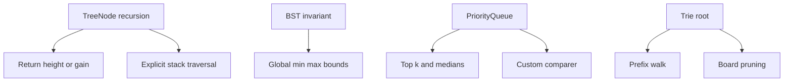

This workbook focuses on the C# implementation details behind tree, heap, and trie interview problems. The traversal ideas are assumed; the goal here is to connect each problem to a short invariant, a pasteable solution, and the complexity line an interviewer expects.

## C# Mechanics

Tree problems usually use the platform's `TreeNode` shape. Write recursive code when it makes the return value obvious, but be ready to switch to an explicit `Stack<TreeNode>` for skewed trees or production inputs. Heaps in .NET 6+ use `PriorityQueue<TElement, TPriority>`, which is a min-heap by priority and does not expose decrease-key; push a new priority and ignore stale entries when needed. Tries are ordinary object graphs, so the main C# choice is whether each node owns a fixed child array or a dictionary of only present children.

```csharp
public class TreeNode {
    public int val;
    public TreeNode left;
    public TreeNode right;
    public TreeNode(int val = 0, TreeNode left = null, TreeNode right = null) {
        this.val = val;
        this.left = left;
        this.right = right;
    }
}
```

| Structure | C# representation | Watch point |
|---|---|---|
| Binary tree | `TreeNode` references | Recursion depth is `O(h)` and can become `O(n)` |
| Traversal stack | `Stack<TreeNode>` | Enables early exit and avoids call-stack overflow |
| Heap | `PriorityQueue<TElement, TPriority>` | Min-heap by default, no decrease-key operation |
| Custom heap order | `Comparer<TPriority>.Create(...)` | Reverse the priority comparer for a max-heap |
| Trie node | `Dictionary<char, Node>` or `Node[26]` | Dictionary is flexible, array is faster for lowercase English |



> [!KEY]
> A recursive tree helper should have one sentence describing what it returns. If it also updates a global answer, say which value is returned upward and which value is only recorded.

## Worked Tree and BST Problems

The tree selections focus on return-value discipline. Level order is the queue template; balance, LCA, construction, and maximum path sum are different DFS contracts; validation and kth-smallest are the two BST invariants that interviewers most often probe. For each one, be ready to say whether the algorithm depends on height, sorted in-order order, unique values, or guaranteed node existence.

### Binary Tree Level Order Traversal

Group BFS output by snapshotting the queue size before the inner loop. That count is the exact number of nodes at the current depth, even as children are enqueued for the next depth.

```csharp
public IList<IList<int>> LevelOrder(TreeNode root) {
    var result = new List<IList<int>>();
    if (root == null) return result;
    var queue = new Queue<TreeNode>();
    queue.Enqueue(root);
    while (queue.Count > 0) {
        int size = queue.Count;
        var level = new List<int>();
        for (int i = 0; i < size; i++) {
            var node = queue.Dequeue();
            level.Add(node.val);
            if (node.left != null) queue.Enqueue(node.left);
            if (node.right != null) queue.Enqueue(node.right);
        }
        result.Add(level);
    }
    return result;
}
```

Complexity: `O(n)` time and `O(n)` space at the widest level.

### Balanced Binary Tree

Avoid recomputing height at every node. Return the subtree height if it is balanced, or `-1` as a sentinel that propagates immediately once an imbalance is found.

```csharp
public bool IsBalanced(TreeNode root) {
    return HeightOrFail(root) != -1;
}

private int HeightOrFail(TreeNode node) {
    if (node == null) return 0;
    int left = HeightOrFail(node.left);
    if (left == -1) return -1;
    int right = HeightOrFail(node.right);
    if (right == -1) return -1;
    if (Math.Abs(left - right) > 1) return -1;
    return 1 + Math.Max(left, right);
}
```

Complexity: `O(n)` time and `O(h)` recursion space.

### Lowest Common Ancestor of a Binary Tree

Post-order DFS bubbles up evidence. If both sides return a target, the current node is the split point; if only one side returns non-null, that evidence keeps bubbling upward.

```csharp
public TreeNode LowestCommonAncestor(TreeNode root, TreeNode p, TreeNode q) {
    if (root == null || root == p || root == q) return root;
    TreeNode left = LowestCommonAncestor(root.left, p, q);
    TreeNode right = LowestCommonAncestor(root.right, p, q);
    if (left != null && right != null) return root;
    return left ?? right;
}
```

Complexity: `O(n)` time and `O(h)` space. If either node might be absent, track a found count instead of trusting this shortcut.

### Construct Binary Tree from Preorder and Inorder

Preorder exposes the current root; inorder tells how many nodes belong to the left subtree. A dictionary from value to inorder index keeps reconstruction linear and avoids copying array slices.

```csharp
private Dictionary<int, int> _inorderIndex;

public TreeNode BuildTree(int[] preorder, int[] inorder) {
    _inorderIndex = new Dictionary<int, int>();
    for (int i = 0; i < inorder.Length; i++)
        _inorderIndex[inorder[i]] = i;
    return Build(preorder, 0, preorder.Length - 1, 0);
}

private TreeNode Build(int[] preorder, int preL, int preR, int inL) {
    if (preL > preR) return null;
    int rootVal = preorder[preL];
    int inRoot = _inorderIndex[rootVal];
    int leftSize = inRoot - inL;
    var root = new TreeNode(rootVal);
    root.left = Build(preorder, preL + 1, preL + leftSize, inL);
    root.right = Build(preorder, preL + leftSize + 1, preR, inRoot + 1);
    return root;
}
```

Complexity: `O(n)` time and `O(n)` space for the map plus recursion. The method relies on unique values.

### Binary Tree Maximum Path Sum

The returned value is a single-arm gain usable by the parent. The global answer records a two-arm path that bends at the current node, and negative arms are clamped away.

```csharp
private int _bestPath;

public int MaxPathSum(TreeNode root) {
    _bestPath = int.MinValue;
    Gain(root);
    return _bestPath;
}

private int Gain(TreeNode node) {
    if (node == null) return 0;
    int left = Math.Max(0, Gain(node.left));
    int right = Math.Max(0, Gain(node.right));
    _bestPath = Math.Max(_bestPath, node.val + left + right);
    return node.val + Math.Max(left, right);
}
```

Complexity: `O(n)` time and `O(h)` space. Initialise the best value to `int.MinValue` so all-negative trees work.

### Validate Binary Search Tree

Parent-only comparisons are not enough because an ancestor can constrain a deeper node. Pass strict global bounds down the recursion, using `long` so `int.MinValue` and `int.MaxValue` remain valid node values.

```csharp
public bool IsValidBST(TreeNode root) {
    return Valid(root, long.MinValue, long.MaxValue);
}

private bool Valid(TreeNode node, long low, long high) {
    if (node == null) return true;
    if (node.val <= low || node.val >= high) return false;
    return Valid(node.left, low, node.val)
        && Valid(node.right, node.val, high);
}
```

Complexity: `O(n)` time and `O(h)` space.

### Kth Smallest Element in a BST

In-order traversal visits a BST in ascending order. Use an explicit stack and stop as soon as the kth node is popped instead of collecting every value.

```csharp
public int KthSmallest(TreeNode root, int k) {
    var stack = new Stack<TreeNode>();
    TreeNode current = root;
    while (current != null || stack.Count > 0) {
        while (current != null) {
            stack.Push(current);
            current = current.left;
        }
        current = stack.Pop();
        if (--k == 0) return current.val;
        current = current.right;
    }
    return -1;
}
```

Complexity: `O(h + k)` time and `O(h)` space.

> [!WARNING]
> Recursive tree code is clean, but a skewed tree turns height into `n`. For production-scale inputs, use iterative traversal or guard against stack overflow.

## Worked Heap and Trie Problems

### Kth Largest Element in an Array

Keep a min-heap capped at `k` elements. After scanning the array, the heap contains the largest `k` values seen, so the root is the kth largest.

```csharp
public int FindKthLargest(int[] nums, int k) {
    var heap = new PriorityQueue<int, int>();
    foreach (int num in nums) {
        heap.Enqueue(num, num);
        if (heap.Count > k)
            heap.Dequeue();
    }
    return heap.Peek();
}
```

Complexity: `O(n log k)` time and `O(k)` space. Sorting is simpler but costs `O(n log n)`.

### Find Median from Data Stream

Use a max-heap for the lower half and a min-heap for the upper half. Keep sizes within one and ensure every lower-half value is no larger than every upper-half value.

```csharp
public class MedianFinder {
    private readonly PriorityQueue<int, int> _low =
        new(Comparer<int>.Create((a, b) => b.CompareTo(a)));
    private readonly PriorityQueue<int, int> _high = new();

    public void AddNum(int num) {
        _low.Enqueue(num, num);
        if (_high.Count > 0 && _low.Peek() > _high.Peek()) {
            int moved = _low.Dequeue();
            _high.Enqueue(moved, moved);
        }
        if (_low.Count > _high.Count + 1) {
            int moved = _low.Dequeue();
            _high.Enqueue(moved, moved);
        } else if (_high.Count > _low.Count) {
            int moved = _high.Dequeue();
            _low.Enqueue(moved, moved);
        }
    }

    public double FindMedian() {
        if (_low.Count == _high.Count)
            return (_low.Peek() + (long)_high.Peek()) / 2.0;
        return _low.Peek();
    }
}
```

Complexity: `O(log n)` per add, `O(1)` median, and `O(n)` space.

### Implement Trie

A lowercase trie can use a fixed 26-slot array per node. Search and prefix checks share the same walk; only exact search requires the terminal `End` flag.

```csharp
public class Trie {
    private class Node {
        public readonly Node[] Next = new Node[26];
        public bool End;
    }

    private readonly Node _root = new();

    public void Insert(string word) {
        Node node = _root;
        foreach (char ch in word) {
            int i = ch - 'a';
            node.Next[i] ??= new Node();
            node = node.Next[i];
        }
        node.End = true;
    }

    public bool Search(string word) {
        Node node = Find(word);
        return node != null && node.End;
    }

    public bool StartsWith(string prefix) => Find(prefix) != null;

    private Node Find(string text) {
        Node node = _root;
        foreach (char ch in text) {
            node = node.Next[ch - 'a'];
            if (node == null) return null;
        }
        return node;
    }
}
```

Complexity: `O(L)` per operation and `O(total characters * alphabet)` space for fixed arrays.

### Word Search II

Build one trie for all target words, then DFS from each board cell while following trie edges. Mark the board in place for the current path, and clear a terminal word after reporting it so duplicates are not emitted.

```csharp
private class WsNode {
    public WsNode[] Next = new WsNode[26];
    public string Word;
}

public IList<string> FindWords(char[][] board, string[] words) {
    var root = new WsNode();
    foreach (string word in words) {
        WsNode node = root;
        foreach (char ch in word)
            node = node.Next[ch - 'a'] ??= new WsNode();
        node.Word = word;
    }
    var result = new List<string>();
    for (int r = 0; r < board.Length; r++)
        for (int c = 0; c < board[0].Length; c++)
            Search(board, r, c, root, result);
    return result;
}

private void Search(char[][] b, int r, int c, WsNode node, List<string> result) {
    if (r < 0 || r == b.Length || c < 0 || c == b[0].Length) return;
    char ch = b[r][c];
    if (ch == '#') return;
    WsNode next = node.Next[ch - 'a'];
    if (next == null) return;
    if (next.Word != null) { result.Add(next.Word); next.Word = null; }
    b[r][c] = '#';
    Search(b, r + 1, c, next, result); Search(b, r - 1, c, next, result);
    Search(b, r, c + 1, next, result); Search(b, r, c - 1, next, result);
    b[r][c] = ch;
}
```

Complexity: worst-case `O(MN * 4 * 3^(L-1))` time with strong trie pruning in practice, and `O(total word characters + L)` space.

> [!TIP]
> `PriorityQueue` has no decrease-key. For Dijkstra-style heaps, enqueue the better distance again and skip stale entries when they are dequeued.

## Reference Table

These drills fill out the workbook without repeating code. The technique column is the part to recall under time pressure.

| Problem | Identifying cue | Technique | Time | Space |
|---|---|---|---|---|
| Maximum Depth of Binary Tree | Height only | Recursive depth return | `O(n)` | `O(h)` |
| Same Tree | Two trees must match shape and values | Parallel DFS | `O(n)` | `O(h)` |
| Invert Binary Tree | Swap every left and right child | Preorder or postorder DFS | `O(n)` | `O(h)` |
| Symmetric Tree | Mirror comparison | DFS on outside and inside pairs | `O(n)` | `O(h)` |
| Iterative Tree Traversals | Avoid recursion | Explicit stack templates | `O(n)` | `O(h)` |
| Zigzag Level Order | Alternate each level direction | BFS plus reverse or deque-style fill | `O(n)` | `O(n)` |
| Right Side View | Last node visible at each depth | BFS level tail or DFS first-right | `O(n)` | `O(n)` |
| Diameter of Binary Tree | Longest edge path | Return height, record left plus right | `O(n)` | `O(h)` |
| Path Sum II | Record root-to-leaf paths | DFS with backtracking list | `O(n^2)` worst | `O(n)` |
| Count Good Nodes | Node beats all ancestors | DFS carrying max-so-far | `O(n)` | `O(h)` |
| Flatten Binary Tree | Preorder linked list in place | Reverse postorder or stack | `O(n)` | `O(h)` |
| Search in a BST | Ordered descent | Iterative branch by value | `O(h)` | `O(1)` |
| Insert into a BST | Find null child position | BST descent | `O(h)` | `O(h)` recursive |
| Range Sum of BST | Sum only values in interval | Prune outside bounds | `O(n)` worst | `O(h)` |
| BST Lowest Common Ancestor | Both values fall on different sides | Iterative split search | `O(h)` | `O(1)` |
| Delete Node in a BST | Remove node with two children | Replace with inorder successor | `O(h)` | `O(h)` |
| Convert Sorted Array to BST | Build balanced tree | Middle element recursion | `O(n)` | `O(log n)` |
| BST Iterator | Next smallest repeatedly | Controlled inorder stack | `O(1)` amortised | `O(h)` |
| Kth Largest in a Stream | Maintain top k online | Min-heap capped at k | `O(log k)` add | `O(k)` |
| Last Stone Weight | Repeatedly smash two largest | Max-heap via reversed comparer | `O(n log n)` | `O(n)` |
| K Closest Points | Keep closest k by distance | Max-heap capped at k | `O(n log k)` | `O(k)` |
| Top K Frequent Words | Frequency with lexical tie | Heap with custom priority comparer | `O(n log k)` | `O(n)` |
| Task Scheduler | Cooldown intervals | Greedy formula over 26 counts | `O(n)` | `O(1)` |
| Reorganize String | Avoid adjacent equal chars | Max-heap with previous holdback | `O(n)` | `O(n)` |
| Merge k Sorted Lists | Smallest current list head | Min-heap of list nodes | `O(N log k)` | `O(k)` |
| Implement a Binary Min-Heap | Build heap operations | Array with sift up and down | `O(log n)` | `O(n)` |
| Add and Search Words | Dot wildcard search | Trie plus DFS branching | `O(26^d * L)` | `O(total characters)` |
| Longest Word in Dictionary | Every prefix must exist | Sort plus hash set or trie | `O(nL log n)` | `O(nL)` |
| Replace Words | Shortest root replaces word | Trie prefix walk | `O(D + W)` | `O(D)` |
| Maximum XOR of Two Numbers | Prefer opposite bits | Binary trie over 32 bits | `O(n)` | `O(n)` |
| Implement strStr with KMP | Pattern search without retreating text | LPS prefix table | `O(n + m)` | `O(m)` |
| Repeated Substring Pattern | Whole string repeats a smaller unit | KMP or doubled-string trick | `O(n)` | `O(n)` |
| Shortest Palindrome | Longest palindromic prefix | KMP on string plus reverse | `O(n)` | `O(n)` |

## Cheat sheet

- BFS by level starts with `int size = queue.Count` before the inner loop.
- For tree DFS, define exactly what the helper returns before coding.
- Use sentinels like `-1` for height failure when a subtree should short-circuit.
- BST validation needs ancestor bounds, not direct parent checks.
- In-order traversal is sorted only for a valid BST.
- Use `long` bounds when node values can be full 32-bit integers.
- `PriorityQueue<TElement, TPriority>` is a .NET 6+ min-heap; reverse the priority comparer for max-heap behavior.
- Two heaps solve streaming median by separating lower and upper halves.
- Trie `Search` and `StartsWith` differ only by the terminal flag.
- Board-search trie solutions should mark and restore cells on the current path.

## Common mistakes

| Mistake | Fix |
|---|---|
| Recomputing subtree heights for every balance check | Return height and failure in one DFS |
| Initialising maximum path sum to zero | Use `int.MinValue` so all-negative trees are valid |
| Validating BST with only parent comparisons | Carry strict global low and high bounds |
| Collecting all BST values for kth smallest | Stop after the kth in-order pop |
| Treating `PriorityQueue` as a max-heap by default | Provide a reversed comparer or negate priorities carefully |
| Using trie `Search` to answer prefix queries | Walk the prefix and ignore the terminal flag |
| Forgetting to restore a board cell after DFS | Mark on entry and restore on exit |

## Summary

Trees test whether a recursive return value is well-defined; heaps test whether you can maintain only the necessary frontier; tries test whether shared prefixes can cut search. C# gives good built-in stacks, queues, dictionaries, and priority queues, but it does not remove the need to state invariants. Keep code short, name the trade-off, and be explicit about height, heap size, and alphabet assumptions. When a problem looks unfamiliar, classify the state first: subtree return, ordered stream frontier, or prefix node.

## Top Interview Questions

### Q1. How do you decide what a tree DFS helper should return?

Start from the caller's need. If the parent needs a height, the helper returns height. If the parent needs to know whether a subtree contains a target, the helper returns that target or null. If the final answer can be a path that bends at a node, like maximum path sum or diameter, the helper usually returns a one-arm value while updating a separate global two-arm answer. Say this distinction before coding. It prevents the common mistake of returning a value that cannot legally be extended by the parent. A good helper contract also makes base cases obvious: null height is zero, null gain is zero, and missing target evidence is null.

### Q2. When should tree traversal be iterative instead of recursive?

Recursive traversal is concise and usually accepted for balanced or moderately sized trees. It becomes risky when the tree can be skewed, because recursion depth becomes `O(n)` and C# can throw a stack overflow before heap memory is exhausted. Iterative traversal with `Stack<TreeNode>` mirrors the call stack but stores frames on the managed heap and allows early exit more explicitly. Use it for kth-smallest, production parsers, very deep trees, and platforms that set strict recursion limits. In an interview, recursion is fine if constraints are small; for senior answers, mention the worst-case height and the iterative fallback.

### Q3. Why does BST validation need min and max bounds?

A BST node is constrained by every ancestor, not just its direct parent. A node in the left subtree of root must be less than root even if it is the right child of its immediate parent. Parent-only checks miss cases like root `10`, left child `5`, and `5`'s right child `12`; `12` is greater than its parent but invalid because it exceeds the root's upper bound. Passing strict `(low, high)` bounds down the recursion captures the full ancestor context. Use `long.MinValue` and `long.MaxValue` as initial bounds so actual `int.MinValue` and `int.MaxValue` node values do not collide with sentinels.

### Q4. How do you explain the maximum path sum recurrence?

Each node has two different values. The value it can return to its parent is a single path arm: node value plus the better of left or right gain, with negative gains clamped to zero. A parent cannot use both arms from a child because that would branch. The value that can update the global answer is different: node value plus both non-negative arms, representing a path that bends at this node. Initialising the answer to `int.MinValue` handles all-negative trees, because the best path must include at least one real node. This return-versus-record split is the core insight.

### Q5. When does a heap beat sorting?

A heap beats sorting when you only need a small frontier rather than a full order. Kth largest with `k` much smaller than `n` is the classic case: a min-heap capped at `k` costs `O(n log k)` and `O(k)` space, while sorting costs `O(n log n)` and often extra memory. Streaming problems also require heaps because the data arrives over time and queries happen between inserts. Sorting is still preferable when you need all elements ordered, when `k` is close to `n`, or when constant factors dominate on tiny inputs. State the heap size as part of the complexity.

### Q6. How do two heaps maintain the streaming median?

The lower half is stored in a max-heap and the upper half in a min-heap. The invariants are that every value in the lower half is less than or equal to every value in the upper half, and the sizes differ by at most one. A common convention keeps the lower heap one element larger when the total count is odd, so its top is the median. On insert, place the value, fix ordering if the two tops are inverted, then rebalance sizes. For an even count, average the two tops and cast before addition to avoid integer overflow. Add is `O(log n)`; median is `O(1)`.

### Q7. Why does `PriorityQueue` without decrease-key still work for shortest-path style heaps?

When a better priority for an element is discovered, enqueue the element again with the improved priority. The older entry remains in the heap, but it is stale. When dequeued, compare the priority with the current best distance or cost stored in an array or dictionary. If the heap priority is worse, skip it. This lazy deletion approach preserves correctness because only the best recorded priority is allowed to relax neighbors. It may add extra heap entries, but the asymptotic bound for typical Dijkstra implementations remains acceptable, such as `O((V+E) log V)` with adjacency lists. The key is never to trust a heap entry without checking current state.

### Q8. How do trie arrays compare with trie dictionaries?

A fixed array, usually length 26 for lowercase English letters, gives fast indexing and predictable `O(1)` child access. It wastes memory when the alphabet is large or the trie is sparse because every node allocates all slots. A `Dictionary<char, Node>` stores only existing edges, supports arbitrary characters, and is often easier for Unicode or mixed-case inputs, but it has hashing overhead and more object churn. In interviews, choose the array when constraints say lowercase `a` to `z`; choose the dictionary when the alphabet is not fixed. In both designs, operations are `O(L)` for a string of length `L`.

### Q9. Why does Word Search II combine a trie with backtracking?

Running a separate DFS for every word repeats enormous work because many words share prefixes. A trie lets one board walk serve all words with the same prefix. During DFS, if the current character has no trie child, the entire branch stops immediately. The board cell is marked on entry so the same cell is not reused in the current path, then restored on exit for other paths. When a terminal word is found, setting the stored word to null prevents duplicate output while keeping the node available as a prefix for longer words. The worst-case exponential shape remains, but trie pruning is the practical win.

### Q10. What should you say about recursion space in tree complexity?

Always express recursion space in terms of height `h`, not automatically `log n`. A balanced binary tree has `h = O(log n)`, but a skewed tree has `h = O(n)`. The call stack holds one frame per node on the current root-to-leaf path. That distinction matters for balance checks, BST validation, path sums, construction, and trie-backed board DFS. If the algorithm also stores results, say whether result storage is excluded from auxiliary space. A senior answer names both typical and worst cases: for example, `O(h)` stack space, which is `O(log n)` balanced and `O(n)` skewed.
