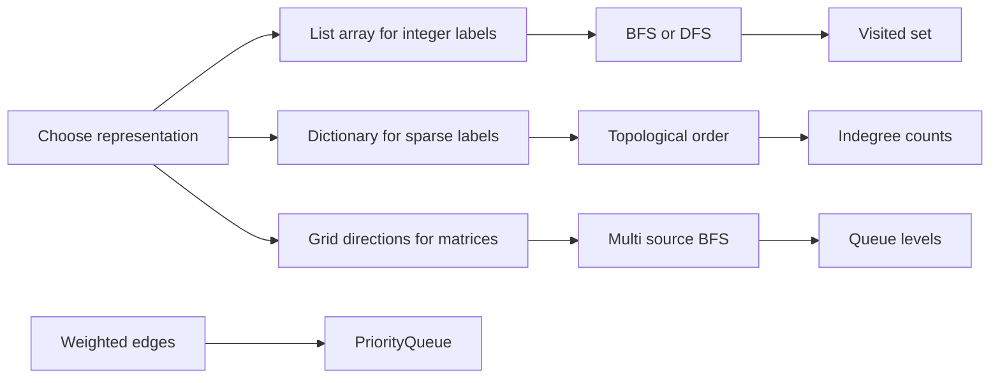

This workbook turns graph patterns into C# problem solutions. The theory of traversal and shortest paths is assumed; each section focuses on choosing the right representation, maintaining the right visited state, and stating the edge-case that usually breaks first attempts.

## C# Mechanics

For nodes labelled `0..n-1`, prefer `List<int>[]` because it is compact and fast. For sparse labels, strings, or objects, use `Dictionary<TKey, List<TValue>>` or `Dictionary<TKey, HashSet<TValue>>`. Matrix problems are still graphs; the cell coordinates are nodes and the four directions are implicit edges, so no adjacency list is needed.

| Graph shape | C# representation | Typical operation |
|---|---|---|
| Dense integer labels | `List<int>[]` | Fast adjacency by index |
| Sparse labels or strings | `Dictionary<TKey, List<TValue>>` | Build only seen vertices |
| Grid graph | Bounds checks plus direction arrays | Avoid materialising all edges |
| BFS frontier | `Queue<T>` | Shortest unweighted distance and level spread |
| Weighted frontier | `PriorityQueue<TElement, TPriority>` | Dijkstra or Prim, with stale-entry checks |



> [!KEY]
> Decide what counts as visited before coding. In grids it may be mutation, in BFS it may be enqueue-time marking, in Dijkstra it is a best-distance array, and in union-find it is the representative parent.

Graph bugs usually come from modelling the wrong state rather than from complicated syntax. A vertex might be a cell, a course, an email, an airport, or a pair like `(city, stops)`. Once that state is chosen, the visited structure must match it. Marking only a city is wrong when remaining stops matter; marking a board cell permanently is wrong when the mark should belong only to the current DFS path. Name the state first, then choose the container.

The second modelling choice is edge cost. If every move costs one, a queue gives shortest distance by level. If costs are non-negative and vary, a priority queue gives the next cheapest frontier. If the number of edges is capped, the round number is part of the state. If the question only asks whether components connect, union-find can ignore paths entirely.

That classification also keeps complexity honest. Say whether the work is per cell, per vertex plus edge, per relaxation round, or per heap operation. Graph answers often fail because the code is correct but the stated bound ignores generated neighbors or duplicate priority queue entries.

## Worked Traversal Problems

The traversal problems are ordered from concrete grids to abstract dependencies. Number of Islands is permanent DFS marking, Rotting Oranges is level BFS from many sources, Pacific Atlantic reverses edge direction, Clone Graph preserves object identity, and the scheduling and dictionary problems turn ordering constraints into indegrees. Word Ladder closes the set by showing how to generate graph neighbors on demand instead of storing them.

### Number of Islands

Scan every cell and start a DFS only when an unseen land cell appears. Mutating land to water is the visited marker, so the next scan position cannot count the same component twice.

```csharp
public int NumIslands(char[][] grid) {
    if (grid.Length == 0) return 0;
    int rows = grid.Length, cols = grid[0].Length, count = 0;
    for (int r = 0; r < rows; r++)
        for (int c = 0; c < cols; c++)
            if (grid[r][c] == '1') {
                Sink(grid, r, c);
                count++;
            }
    return count;
}

private void Sink(char[][] grid, int r, int c) {
    if (r < 0 || r == grid.Length || c < 0 || c == grid[0].Length) return;
    if (grid[r][c] != '1') return;
    grid[r][c] = '0';
    Sink(grid, r + 1, c); Sink(grid, r - 1, c);
    Sink(grid, r, c + 1); Sink(grid, r, c - 1);
}
```

Complexity: `O(mn)` time and `O(mn)` worst-case recursion space.

### Rotting Oranges

All initially rotten oranges are simultaneous sources. BFS by minute ensures each fresh orange is rotted at the earliest possible time, and the remaining fresh count detects unreachable components.

```csharp
public int OrangesRotting(int[][] grid) {
    int rows = grid.Length, cols = grid[0].Length, fresh = 0;
    var queue = new Queue<(int r, int c)>();
    for (int r = 0; r < rows; r++)
        for (int c = 0; c < cols; c++)
            if (grid[r][c] == 2) queue.Enqueue((r, c));
            else if (grid[r][c] == 1) fresh++;
    int minutes = 0;
    int[] dr = { 1, -1, 0, 0 }, dc = { 0, 0, 1, -1 };
    while (queue.Count > 0 && fresh > 0) {
        minutes++;
        for (int i = 0, size = queue.Count; i < size; i++) {
            var (r, c) = queue.Dequeue();
            for (int d = 0; d < 4; d++) {
                int nr = r + dr[d], nc = c + dc[d];
                if (nr < 0 || nr == rows || nc < 0 || nc == cols) continue;
                if (grid[nr][nc] != 1) continue;
                grid[nr][nc] = 2;
                fresh--;
                queue.Enqueue((nr, nc));
            }
        }
    }
    return fresh == 0 ? minutes : -1;
}
```

Complexity: `O(mn)` time and `O(mn)` space.

### Pacific Atlantic Water Flow

Instead of starting from every cell and trying to flow outward, reverse the direction. Start BFS from each ocean border and move only to neighbors with height greater than or equal to the current cell; cells reached by both oceans are answers.

```csharp
public IList<IList<int>> PacificAtlantic(int[][] heights) {
    int rows = heights.Length, cols = heights[0].Length;
    bool[,] pac = new bool[rows, cols], atl = new bool[rows, cols];
    var pacQ = new Queue<(int, int)>();
    var atlQ = new Queue<(int, int)>();
    for (int r = 0; r < rows; r++) {
        pac[r, 0] = true; pacQ.Enqueue((r, 0));
        atl[r, cols - 1] = true; atlQ.Enqueue((r, cols - 1));
    }
    for (int c = 0; c < cols; c++) {
        pac[0, c] = true; pacQ.Enqueue((0, c));
        atl[rows - 1, c] = true; atlQ.Enqueue((rows - 1, c));
    }
    Flow(heights, pacQ, pac); Flow(heights, atlQ, atl);
    var result = new List<IList<int>>();
    for (int r = 0; r < rows; r++)
        for (int c = 0; c < cols; c++)
            if (pac[r, c] && atl[r, c]) result.Add(new List<int> { r, c });
    return result;
}

private void Flow(int[][] h, Queue<(int r, int c)> q, bool[,] seen) {
    int[] dr = { 1, -1, 0, 0 }, dc = { 0, 0, 1, -1 };
    while (q.Count > 0) {
        var (r, c) = q.Dequeue();
        for (int d = 0; d < 4; d++) {
            int nr = r + dr[d], nc = c + dc[d];
            if (nr < 0 || nr == h.Length || nc < 0 || nc == h[0].Length) continue;
            if (seen[nr, nc] || h[nr][nc] < h[r][c]) continue;
            seen[nr, nc] = true;
            q.Enqueue((nr, nc));
        }
    }
}
```

Complexity: `O(mn)` time and `O(mn)` space.

### Clone Graph

Use a dictionary from original node reference to clone reference. Create the clone the first time a node is discovered, then wire every cloned neighbor while traversing the original graph.

```csharp
public Node CloneGraph(Node node) {
    if (node == null) return null;
    var map = new Dictionary<Node, Node>();
    var queue = new Queue<Node>();
    map[node] = new Node(node.val);
    queue.Enqueue(node);
    while (queue.Count > 0) {
        Node current = queue.Dequeue();
        foreach (Node next in current.neighbors) {
            if (!map.ContainsKey(next)) {
                map[next] = new Node(next.val);
                queue.Enqueue(next);
            }
            map[current].neighbors.Add(map[next]);
        }
    }
    return map[node];
}
```

Complexity: `O(V + E)` time and `O(V)` space.

### Course Schedule

Kahn's algorithm removes courses whose prerequisites are already satisfied. Build edges from prerequisite to unlocked course; reversing that direction is the classic bug.

```csharp
public bool CanFinish(int numCourses, int[][] prerequisites) {
    var graph = new List<int>[numCourses];
    for (int i = 0; i < numCourses; i++) graph[i] = new List<int>();
    int[] indegree = new int[numCourses];
    foreach (int[] edge in prerequisites) {
        graph[edge[1]].Add(edge[0]);
        indegree[edge[0]]++;
    }
    var queue = new Queue<int>();
    for (int i = 0; i < numCourses; i++)
        if (indegree[i] == 0) queue.Enqueue(i);
    int finished = 0;
    while (queue.Count > 0) {
        int course = queue.Dequeue();
        finished++;
        foreach (int next in graph[course])
            if (--indegree[next] == 0) queue.Enqueue(next);
    }
    return finished == numCourses;
}
```

Complexity: `O(V + E)` time and `O(V + E)` space.

### Alien Dictionary

Only the first differing character between adjacent sorted words gives an ordering edge. If a longer word appears before its own prefix, the input is invalid no matter what graph edges exist.

```csharp
public string AlienOrder(string[] words) {
    var graph = new Dictionary<char, HashSet<char>>();
    var indegree = new Dictionary<char, int>();
    foreach (string word in words)
        foreach (char ch in word) {
            graph.TryAdd(ch, new HashSet<char>());
            indegree.TryAdd(ch, 0);
        }
    for (int i = 0; i < words.Length - 1; i++) {
        string a = words[i], b = words[i + 1];
        if (a.Length > b.Length && a.StartsWith(b, StringComparison.Ordinal)) return "";
        for (int j = 0; j < Math.Min(a.Length, b.Length); j++) {
            if (a[j] == b[j]) continue;
            if (graph[a[j]].Add(b[j])) indegree[b[j]]++;
            break;
        }
    }
    var queue = new Queue<char>(indegree.Where(p => p.Value == 0).Select(p => p.Key));
    var order = new StringBuilder();
    while (queue.Count > 0) {
        char ch = queue.Dequeue();
        order.Append(ch);
        foreach (char next in graph[ch])
            if (--indegree[next] == 0) queue.Enqueue(next);
    }
    return order.Length == indegree.Count ? order.ToString() : "";
}
```

Complexity: `O(C)` time and `O(U)` space, where `C` is total characters and `U` is unique characters.

### Word Ladder

Unweighted shortest transformation length is BFS. Generate neighbors by changing each position to every letter, and mark a word visited when it is enqueued so it cannot appear in multiple same-level branches.

```csharp
public int LadderLength(string beginWord, string endWord, IList<string> wordList) {
    var words = new HashSet<string>(wordList);
    if (!words.Contains(endWord)) return 0;
    var queue = new Queue<string>();
    queue.Enqueue(beginWord);
    words.Remove(beginWord);
    int steps = 1;
    while (queue.Count > 0) {
        for (int i = 0, size = queue.Count; i < size; i++) {
            char[] chars = queue.Dequeue().ToCharArray();
            for (int p = 0; p < chars.Length; p++) {
                char old = chars[p];
                for (char ch = 'a'; ch <= 'z'; ch++) {
                    chars[p] = ch;
                    string next = new string(chars);
                    if (next == endWord) return steps + 1;
                    if (words.Remove(next)) queue.Enqueue(next);
                }
                chars[p] = old;
            }
        }
        steps++;
    }
    return 0;
}
```

Complexity: `O(N * L^2 * 26)` time because each generated C# string costs `O(L)`, and `O(N * L)` space.

> [!WARNING]
> In BFS, mark visited when enqueuing, not when dequeuing. Late marking allows the same vertex to enter the queue many times from different parents.

## Worked Path Problems

The path problems shift from reachability to optimality. Union-find answers whether two vertices already share a component; Dijkstra chooses the currently cheapest frontier when weights are non-negative; Bellman-Ford is safer when an edge-count limit changes the state; Prim builds the cheapest connected structure; and Eulerian traversal solves the unusual case where every edge must be consumed exactly once. The code differs, but each solution is still a small invariant around a frontier.

For C# implementation, keep tuple types small and readable. `(int r, int c)` is fine for grid queues, while named classes are better for larger state. Prefer arrays for distances and parents when labels are integers; switch to dictionaries only when labels are sparse. These choices are not cosmetic, because they control both lookup cost and how clearly you can explain the invariant.

### Connected Components in an Undirected Graph

Union-find treats each edge as evidence that two vertices share a component. Path compression and union by rank make each union effectively constant for interview constraints.

```csharp
public int CountComponents(int n, int[][] edges) {
    var dsu = new Dsu(n);
    foreach (int[] edge in edges)
        dsu.Union(edge[0], edge[1]);
    return dsu.Count;
}

private class Dsu {
    private readonly int[] _parent;
    private readonly int[] _rank;
    public int Count { get; private set; }

    public Dsu(int n) {
        _parent = Enumerable.Range(0, n).ToArray();
        _rank = new int[n];
        Count = n;
    }

    public int Find(int x) =>
        _parent[x] == x ? x : _parent[x] = Find(_parent[x]);

    public void Union(int a, int b) {
        a = Find(a); b = Find(b);
        if (a == b) return;
        if (_rank[a] < _rank[b]) (a, b) = (b, a);
        _parent[b] = a;
        if (_rank[a] == _rank[b]) _rank[a]++;
        Count--;
    }
}
```

Complexity: `O((V + E) * alpha(V))` time and `O(V)` space.

### Network Delay Time

Dijkstra's algorithm works because all edge weights are non-negative. Since `PriorityQueue` has no decrease-key, enqueue improved distances and skip stale heap entries.

```csharp
public int NetworkDelayTime(int[][] times, int n, int k) {
    var graph = new List<(int to, int w)>[n + 1];
    for (int i = 0; i <= n; i++) graph[i] = new List<(int, int)>();
    foreach (int[] edge in times)
        graph[edge[0]].Add((edge[1], edge[2]));
    int[] dist = Enumerable.Repeat(int.MaxValue, n + 1).ToArray();
    dist[k] = 0;
    var heap = new PriorityQueue<int, int>();
    heap.Enqueue(k, 0);
    while (heap.TryDequeue(out int node, out int cost)) {
        if (cost > dist[node]) continue;
        foreach (var (next, weight) in graph[node]) {
            int candidate = cost + weight;
            if (candidate >= dist[next]) continue;
            dist[next] = candidate;
            heap.Enqueue(next, candidate);
        }
    }
    int answer = 0;
    for (int i = 1; i <= n; i++) {
        if (dist[i] == int.MaxValue) return -1;
        answer = Math.Max(answer, dist[i]);
    }
    return answer;
}
```

Complexity: `O((V + E) log V)` time and `O(V + E)` space.

### Cheapest Flights Within K Stops

The stop limit makes plain Dijkstra awkward because a cheaper partial path with too many stops can be invalid. Bellman-Ford for exactly `k + 1` edge rounds keeps the constraint explicit.

```csharp
public int FindCheapestPrice(int n, int[][] flights, int src, int dst, int k) {
    const int Inf = int.MaxValue / 4;
    int[] dist = Enumerable.Repeat(Inf, n).ToArray();
    dist[src] = 0;
    for (int round = 0; round <= k; round++) {
        int[] next = (int[])dist.Clone();
        foreach (int[] flight in flights) {
            int from = flight[0], to = flight[1], price = flight[2];
            if (dist[from] == Inf) continue;
            next[to] = Math.Min(next[to], dist[from] + price);
        }
        dist = next;
    }
    return dist[dst] == Inf ? -1 : dist[dst];
}
```

Complexity: `O((k + 1)E)` time and `O(V)` space. The cloned array prevents same-round edge chaining.

### Min Cost to Connect All Points

This is a minimum spanning tree over a complete graph with Manhattan distances. Prim's algorithm grows the connected set and keeps the cheapest known edge into each outside point.

```csharp
public int MinCostConnectPoints(int[][] points) {
    int n = points.Length, total = 0, added = 0;
    int[] best = Enumerable.Repeat(int.MaxValue, n).ToArray();
    bool[] used = new bool[n];
    var heap = new PriorityQueue<int, int>();
    best[0] = 0;
    heap.Enqueue(0, 0);
    while (heap.TryDequeue(out int u, out int cost)) {
        if (used[u]) continue;
        used[u] = true;
        total += cost;
        if (++added == n) break;
        for (int v = 0; v < n; v++) {
            if (used[v]) continue;
            int w = Math.Abs(points[u][0] - points[v][0])
                  + Math.Abs(points[u][1] - points[v][1]);
            if (w < best[v]) {
                best[v] = w;
                heap.Enqueue(v, w);
            }
        }
    }
    return total;
}
```

Complexity: `O(n^2 log n)` time and `O(n^2)` worst-case heap space, plus `O(n)` state arrays.

### Reconstruct Itinerary

Use every ticket exactly once and choose the lexicographically smallest valid route. Hierholzer's Eulerian-path traversal consumes the smallest outgoing edge first and adds airports to the front when they are exhausted.

```csharp
public IList<string> FindItinerary(IList<IList<string>> tickets) {
    var graph = new Dictionary<string, PriorityQueue<string, string>>();
    foreach (var ticket in tickets) {
        if (!graph.ContainsKey(ticket[0]))
            graph[ticket[0]] = new PriorityQueue<string, string>();
        graph[ticket[0]].Enqueue(ticket[1], ticket[1]);
    }
    var route = new LinkedList<string>();

    void Visit(string airport) {
        if (graph.TryGetValue(airport, out var heap))
            while (heap.Count > 0)
                Visit(heap.Dequeue());
        route.AddFirst(airport);
    }

    Visit("JFK");
    return route.ToList();
}
```

Complexity: `O(E log E)` time for heap ordering and `O(V + E)` space.

> [!TIP]
> For shortest paths, match the algorithm to the constraint: BFS for unweighted edges, Dijkstra for non-negative weights, Bellman-Ford when edge-count limits or negative edges matter.

## Reference Table

The table keeps the remaining graph drills visible without turning the page into a second theory track. Several rows are deliberate variants of worked problems: `01 Matrix` is the same multi-source BFS idea as rotten oranges, `Path With Minimum Effort` is Dijkstra with a max-edge cost instead of a sum, and `Redundant Connection` is the cycle-detection side of the connected-components DSU.

| Problem | Identifying cue | Technique | Time | Space |
|---|---|---|---|---|
| Max Area of Island | Largest grid component | DFS returning component size | `O(mn)` | `O(mn)` |
| Flood Fill | Recolor connected region | DFS or BFS from start cell | `O(mn)` | `O(mn)` |
| Surrounded Regions | Border-connected cells survive | Reverse DFS from border `O` cells | `O(mn)` | `O(mn)` |
| 01 Matrix | Distance to nearest zero | Multi-source BFS from all zeroes | `O(mn)` | `O(mn)` |
| Course Schedule II | Return a valid course order | Kahn topo with output array | `O(V+E)` | `O(V+E)` |
| Number of Provinces | Components in adjacency matrix | Union-find or DFS over matrix | `O(n^2 alpha(n))` | `O(n)` |
| Graph Valid Tree | Connected and exactly `n - 1` edges | Union-find cycle check | `O(n alpha(n))` | `O(n)` |
| Redundant Connection | First edge that forms a cycle | Union-find while scanning edges | `O(n alpha(n))` | `O(n)` |
| Accounts Merge | Emails connect account records | Union-find with email maps | `O(N log N)` | `O(N)` |
| Path With Minimum Effort | Minimise maximum edge on path | Dijkstra with effort priority | `O(mn log(mn))` | `O(mn)` |
| Swim in Rising Water | Earliest time path becomes possible | Dijkstra or union-find by water level | `O(n^2 log n)` | `O(n^2)` |

## Cheat sheet

- Use `List<int>[]` for `0..n-1` labels and `Dictionary` for sparse or string labels.
- In grids, direction arrays replace explicit adjacency lists.
- Mark BFS nodes visited when enqueued.
- Multi-source BFS starts by enqueuing every source before the first level begins.
- Topological sorting needs edges from prerequisite to dependent item.
- Use `HashSet` adjacency when duplicate edges would corrupt indegree counts.
- Union-find is best when only connectivity or cycle existence matters.
- Dijkstra requires non-negative weights; skip stale priority-queue entries.
- Bellman-Ford round copies prevent paths from using too many edges in one round.
- Eulerian path solutions add nodes after exhausting outgoing edges.

## Common mistakes

| Mistake | Fix |
|---|---|
| Building graph edges in the wrong direction for course scheduling | Store prerequisite to course so indegree means unmet prerequisites |
| Marking BFS visited on dequeue | Mark on enqueue to prevent duplicate frontier entries |
| Forgetting the invalid prefix in Alien Dictionary | Reject longer word before its exact prefix before comparing characters |
| Using Dijkstra with negative weights | Switch to Bellman-Ford or another algorithm that supports them |
| Updating Bellman-Ford distances in place for stop-limited flights | Clone the previous round before relaxing edges |
| Treating priority queue entries as authoritative | Compare against current best distance and skip stale entries |
| Sorting itinerary adjacency descending but popping from the front | Use a min-heap or consume the smallest destination deliberately |

## Summary

Graph interviews are mostly about representation and state. Once the graph is shaped correctly, BFS, DFS, topological sorting, union-find, Dijkstra, Bellman-Ford, Prim, and Eulerian traversal become short templates. In C#, the main implementation choices are `List<int>[]` versus `Dictionary`, enqueue-time visited marking, and careful use of `PriorityQueue` without decrease-key. State the vertex shape, edge cost, and visited lifetime before coding, and most graph variants become one of the worked patterns. If the interviewer changes a constraint, revisit those three choices before changing code.

## Top Interview Questions

### Q1. How do you choose an adjacency representation in C#?

Start with the labels. If vertices are contiguous integers from `0` to `n - 1`, `List<int>[]` is fastest and simplest because array indexing is direct. If labels are strings, objects, or sparse integers, use `Dictionary<TKey, List<TValue>>` so you only create entries for seen vertices. If duplicate edges would break indegree counts, use `HashSet<T>` for each adjacency list. For grid problems, avoid building a graph at all; compute neighbors with direction arrays and bounds checks. In interviews, also state space: adjacency lists are `O(V + E)`, while an adjacency matrix is `O(V^2)` and only makes sense for dense graphs or direct connectivity queries.

### Q2. Why should BFS mark visited when enqueuing?

Marking on enqueue guarantees each vertex appears in the queue at most once. If you wait until dequeue, two different parents in the same level can both enqueue the same unmarked neighbor. That can explode work and may corrupt parent pointers or distance counts. Enqueue-time marking also matches the shortest-path property of unweighted BFS: the first time a node is discovered, it is reached with the smallest number of edges, so there is no reason to allow later discoveries. The exception is algorithms that intentionally allow multiple states per vertex, such as shortest path with remaining stops or keys; then the visited key must include the full state, not only the vertex.

### Q3. What is the difference between DFS visited states and BFS visited states?

Plain BFS usually needs a single visited set because discovery fixes shortest distance in unweighted graphs. DFS can need more nuance. For component counting, a boolean visited set is enough. For cycle detection in a directed graph, use three states: unvisited, visiting, and visited. A back edge to a visiting node proves a cycle; an edge to a fully visited node is safe. For backtracking, such as grid word search, visited is path-local: mark on entry and unmark on exit. A senior answer describes the lifetime of the mark. Is it permanent for the whole traversal, per recursion path, or a best-known distance that can improve?

### Q4. How does multi-source BFS differ from running BFS many times?

Multi-source BFS enqueues all starting sources before processing the first level. The queue then expands as one wave, so the first time a node is reached, it has the shortest distance to any source. Running BFS separately from each source repeats work and then requires taking minimums after the fact. Rotting Oranges starts with every rotten orange; 01 Matrix starts with every zero; ocean-flow variants start from all border cells for an ocean. The complexity stays linear in the grid or graph size because each node is enqueued once. The key implementation detail is to seed all sources first, then begin the level loop.

### Q5. When do you use topological sorting, and how do you detect failure?

Use topological sorting when directed edges represent prerequisites or ordering constraints. Kahn's algorithm counts incoming edges, enqueues all zero-indegree vertices, and repeatedly removes them while decrementing their neighbors. If every vertex is removed, an order exists. If the result count is smaller than the number of vertices, a directed cycle prevented some indegrees from reaching zero. DFS can also topologically sort by postorder, but Kahn's algorithm makes cycle detection and level-like processing very explicit. In C#, be careful with edge direction: for course scheduling, `prerequisite -> course` makes indegree mean number of unmet prerequisites.

### Q6. Why is union-find not a replacement for every graph traversal?

Union-find answers connectivity questions efficiently as edges are added. It is excellent for counting components, detecting an undirected cycle, validating a tree, and Kruskal-style minimum spanning trees. It does not preserve paths, distances, directions, or traversal order. You cannot use plain union-find to find the shortest path, produce a topological order, or detect cycles in a directed graph with dependency semantics. Its strength is maintaining connected components with near-constant `Find` and `Union` using path compression and rank. In an interview, choose it when the question asks whether nodes are connected or whether adding an undirected edge joins two already-connected vertices.

### Q7. Why does Dijkstra require non-negative edge weights?

Dijkstra finalizes the closest unsettled vertex under the assumption that no future path can make it cheaper. That assumption depends on edge weights being non-negative. If a negative edge exists, a vertex that looked finalized can later be improved through a path discovered afterward, breaking the greedy invariant. For non-negative weights, using a min-priority queue is safe: when a node is popped with its best distance, all alternative paths through unsettled nodes are at least as large. If weights can be negative, use Bellman-Ford or another algorithm designed for that case. If weights are all one, BFS is even simpler and faster.

### Q8. How does the stop limit change Cheapest Flights?

The state is not only city and cost; it also includes how many edges have been used. A path that is cheap after too many stops is invalid. The Bellman-Ford-style solution handles this by performing exactly `k + 1` relaxation rounds, because `k` stops means at most `k + 1` flights. Each round reads from the previous distance array and writes into a copy. Without the copy, an update made early in the round could be used again later in the same round, effectively taking multiple flights while counting only one. That is the subtle bug the problem is designed to expose.

### Q9. When does Prim's algorithm beat Kruskal's algorithm?

Prim's algorithm grows one connected component by repeatedly adding the cheapest edge from the tree to an outside vertex. It is convenient for dense implicit graphs like Min Cost to Connect All Points, where every pair has a computable Manhattan distance and materialising all edges for sorting would be heavy. Kruskal's algorithm sorts explicit edges globally and uses union-find to add non-cycling edges; it is often better for sparse edge lists already given by the input. In C#, Prim maps naturally to arrays plus `PriorityQueue`, while Kruskal maps to `Array.Sort` plus a DSU. The best choice depends on whether edges are implicit or explicit.

### Q10. Why does the itinerary solution add airports after exhausting outgoing edges?

Reconstruct Itinerary is an Eulerian path problem: every ticket edge must be used exactly once. If you add an airport to the answer when first seen, you can get stuck at a node while unused outgoing edges remain elsewhere. Hierholzer's algorithm goes as deep as possible, consuming edges, and only adds a node to the front of the route after all outgoing edges from that node are exhausted. That postorder insertion stitches cycles and paths together correctly. Using a min-heap or sorted adjacency list ensures that whenever there is a choice, the lexicographically smallest destination is consumed first, giving the required smallest valid itinerary.
