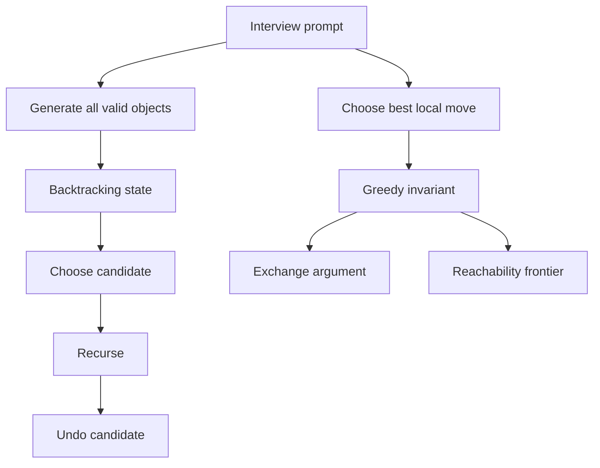

This workbook is problem-first: each full solution keeps the theory to the one decision that makes the code work. Backtracking problems focus on shaping mutable state safely in C#, while greedy problems focus on naming the invariant or exchange argument before writing the loop.

## C# mechanics for this set

Backtracking returns are usually `IList<IList<int>>`, but the working path should be a mutable `List<int>`. Always copy the path when recording a solution with `new List<int>(path)`; otherwise every answer points at the same object that later gets undone. Use `StringBuilder` for character-by-character generation, and shorten it with `sb.Length--` after recursion. For grids, mutate in place only when you restore the cell on every return path.

| Need | C# idiom | Why it matters |
|---|---|---|
| List of lists | `var ans = new List<IList<int>>();` | Matches LeetCode signatures while keeping appends cheap |
| Record path | `ans.Add(new List<int>(path));` | Copies values before the path is undone |
| Duplicate pruning | `Array.Sort(nums); if (i > start && nums[i] == nums[i - 1]) continue;` | Removes sibling branches that would create identical output |
| Greedy sorting | `Array.Sort(costs, (a, b) => a[0].CompareTo(b[0]));` | Avoids comparator overflow from subtraction |
| Max heap | `PriorityQueue<int,int>` with reversed comparer | .NET priority queues are min-heaps by default |



> [!KEY]
> In backtracking, pass the mutable path by reference and copy only when committing a result. In greedy, the code is short because the proof did the real work.

A good C# backtracking answer also says what owns each piece of state. The caller owns the input, the recursive method owns the current path, and the result list owns copied snapshots. Filtering duplicate answers after generation is usually a red flag because it wastes output-sized work and requires structural equality over lists. Pruning before recursion is cleaner: sort once, then skip the branch that would repeat an identical sibling choice. For greedy code, the state should be even smaller. A single frontier, start index, heap, or running tank should summarize all previous choices; if you need to remember many competing histories, the problem is probably not greedy.

When a prompt mixes both families, separate feasibility from optimization. Word Search is feasibility over a mutable path, so backtracking is natural. Refueling is optimization over choices already passed, so a heap-backed greedy view is natural. Naming that split in the interview prevents the common mistake of trying to force every choice problem into recursion.

The C# signatures also affect how you narrate trade-offs. Returning `IList<IList<int>>` does not mean every inner list must stay mutable after the method returns; it only means the platform expects that interface. A private helper can freely use `List<int>`, arrays, sets, or a heap. For greedy sorting, keep comparers explicit and overflow-safe. For recursive helpers, keep parameters ordered by how they define the state: index or row first, then accumulated value, then mutable containers. This makes dry-running easier because the state appears in the same order you describe it aloud.

A useful final check is to ask whether the algorithm would still work if two equal values swap positions in the input. If yes, sorting and duplicate pruning are probably valid. If no, the original index carries meaning and you should preserve it with tuples or avoid sorting. That one question prevents many subtle mistakes in permutation and greedy interval variants.

## Full worked problems

The ten full problems below were chosen because each one teaches a different move: duplicate control, reusable candidates, prefix validity, in-place grid marking, constraint sets, reachability frontiers, restart proofs, partition closure, and heap-delayed choices. The code is intentionally LeetCode-shaped, with public methods and small local helpers. If a helper captures local variables, that is for readability; in a stricter style guide you can move the helper to a private method and pass the same state explicitly.

### Subsets II

Return every subset when duplicates may appear. Sorting puts equal values next to each other, and the skip guard removes only duplicate siblings at the same recursion depth.

```csharp
public IList<IList<int>> SubsetsWithDup(int[] nums) {
    Array.Sort(nums);
    var result = new List<IList<int>>();
    Backtrack(0, new List<int>());
    return result;

    void Backtrack(int start, List<int> path) {
        result.Add(new List<int>(path));
        for (int i = start; i < nums.Length; i++) {
            if (i > start && nums[i] == nums[i - 1]) continue;
            path.Add(nums[i]);
            Backtrack(i + 1, path);
            path.RemoveAt(path.Count - 1);
        }
    }
}
```

Complexity: `O(n * 2^n)` time to copy all subsets and `O(n)` working space, excluding output.

### Permutations II

Order matters, so every unused index is eligible at each level. The duplicate rule says a value can be used only after its identical left neighbor has already been used in the current partial permutation.

```csharp
public IList<IList<int>> PermuteUnique(int[] nums) {
    Array.Sort(nums);
    var result = new List<IList<int>>();
    var used = new bool[nums.Length];
    Dfs(new List<int>());
    return result;

    void Dfs(List<int> path) {
        if (path.Count == nums.Length) {
            result.Add(new List<int>(path));
            return;
        }
        for (int i = 0; i < nums.Length; i++) {
            if (used[i]) continue;
            if (i > 0 && nums[i] == nums[i - 1] && !used[i - 1]) continue;
            used[i] = true;
            path.Add(nums[i]);
            Dfs(path);
            path.RemoveAt(path.Count - 1);
            used[i] = false;
        }
    }
}
```

Complexity: `O(n * n!)` time in the all-distinct case and `O(n)` working space.

### Combination Sum

Numbers may be reused, so the recursive call passes `i`, not `i + 1`. Sorting lets the loop break as soon as the candidate would exceed the target.

```csharp
public IList<IList<int>> CombinationSum(int[] candidates, int target) {
    Array.Sort(candidates);
    var result = new List<IList<int>>();
    Search(0, 0, new List<int>());
    return result;

    void Search(int start, int sum, List<int> path) {
        if (sum == target) {
            result.Add(new List<int>(path));
            return;
        }
        for (int i = start; i < candidates.Length; i++) {
            int next = sum + candidates[i];
            if (next > target) break;
            path.Add(candidates[i]);
            Search(i, next, path);
            path.RemoveAt(path.Count - 1);
        }
    }
}
```

Complexity: exponential in `target / minCandidate`, with `O(target / minCandidate)` recursion depth.

### Generate Parentheses

The state is just counts: how many opens and closes have been used. Append `(` while opens remain, and append `)` only when it keeps the prefix valid.

```csharp
public IList<string> GenerateParenthesis(int n) {
    var result = new List<string>();
    var sb = new StringBuilder();
    Dfs(0, 0);
    return result;

    void Dfs(int open, int close) {
        if (sb.Length == 2 * n) {
            result.Add(sb.ToString());
            return;
        }
        if (open < n) {
            sb.Append('(');
            Dfs(open + 1, close);
            sb.Length--;
        }
        if (close < open) {
            sb.Append(')');
            Dfs(open, close + 1);
            sb.Length--;
        }
    }
}
```

Complexity: Catalan output size, often written `O(4^n / sqrt(n))`, and `O(n)` working space.

### Word Search

Start a DFS from every matching cell. In-place marking avoids allocating a visited matrix, but it is safe only because the original character is restored after exploring neighbors.

```csharp
public bool Exist(char[][] board, string word) {
    for (int r = 0; r < board.Length; r++)
        for (int c = 0; c < board[0].Length; c++)
            if (Dfs(r, c, 0)) return true;
    return false;

    bool Dfs(int r, int c, int k) {
        if (k == word.Length) return true;
        if (r < 0 || r >= board.Length ||
            c < 0 || c >= board[0].Length || board[r][c] != word[k])
            return false;
        char saved = board[r][c];
        board[r][c] = '#';
        bool found = Dfs(r + 1, c, k + 1) || Dfs(r - 1, c, k + 1) ||
                     Dfs(r, c + 1, k + 1) || Dfs(r, c - 1, k + 1);
        board[r][c] = saved;
        return found;
    }
}
```

Complexity: `O(m * n * 4 * 3^(L - 1))` time in the usual worst-case bound and `O(L)` recursion space.

### N-Queens

Place one queen per row and track three attack sets: column, `row - col`, and `row + col`. Those two diagonal formulas are the whole trick.

```csharp
public IList<IList<string>> SolveNQueens(int n) {
    var result = new List<IList<string>>();
    var cols = new HashSet<int>();
    var diagDown = new HashSet<int>();
    var diagUp = new HashSet<int>();
    var board = Enumerable.Range(0, n)
        .Select(_ => new string('.', n).ToCharArray()).ToArray();
    Place(0);
    return result;

    void Place(int row) {
        if (row == n) {
            result.Add(board.Select(r => new string(r)).ToList());
            return;
        }
        for (int col = 0; col < n; col++) {
            if (cols.Contains(col) || diagDown.Contains(row - col) || diagUp.Contains(row + col)) continue;
            board[row][col] = 'Q';
            cols.Add(col); diagDown.Add(row - col); diagUp.Add(row + col);
            Place(row + 1);
            board[row][col] = '.';
            cols.Remove(col); diagDown.Remove(row - col); diagUp.Remove(row + col);
        }
    }
}
```

Complexity: `O(n!)` time in the usual bound and `O(n)` working space before output.

### Jump Game II

Think of reachable indices as BFS levels. When the scan reaches the end of the current level, one more jump is required and the next level extends to the farthest index seen.

```csharp
public int Jump(int[] nums) {
    int jumps = 0, currentEnd = 0, farthest = 0;
    for (int i = 0; i < nums.Length - 1; i++) {
        farthest = Math.Max(farthest, i + nums[i]);
        if (i == currentEnd) {
            jumps++;
            currentEnd = farthest;
        }
    }
    return jumps;
}
```

Complexity: `O(n)` time and `O(1)` space.

### Gas Station

If the tank becomes negative at station `i`, no station between the previous start and `i` can be a valid start. Restart at `i + 1`, then check the total surplus at the end.

```csharp
public int CanCompleteCircuit(int[] gas, int[] cost) {
    int total = 0, tank = 0, start = 0;
    for (int i = 0; i < gas.Length; i++) {
        int surplus = gas[i] - cost[i];
        total += surplus;
        tank += surplus;
        if (tank < 0) {
            start = i + 1;
            tank = 0;
        }
    }
    return total >= 0 ? start : -1;
}
```

Complexity: `O(n)` time and `O(1)` space.

### Partition Labels

Each partition must cover the last occurrence of every character it contains. Record last indices, scan, and close a partition exactly when the scan reaches the furthest required end.

```csharp
public IList<int> PartitionLabels(string s) {
    var last = new int[26];
    for (int i = 0; i < s.Length; i++)
        last[s[i] - 'a'] = i;

    var result = new List<int>();
    int start = 0, end = 0;
    for (int i = 0; i < s.Length; i++) {
        end = Math.Max(end, last[s[i] - 'a']);
        if (i == end) {
            result.Add(end - start + 1);
            start = i + 1;
        }
    }
    return result;
}
```

Complexity: `O(n)` time and `O(1)` space for the fixed alphabet.

### Minimum Number of Refueling Stops

Defer refueling until you are forced to. At that moment, the safest greedy choice is the largest fuel amount among stations already passed, implemented as a max-heap.

```csharp
public int MinRefuelStops(int target, int startFuel, int[][] stations) {
    var heap = new PriorityQueue<int, int>(
        Comparer<int>.Create((a, b) => b.CompareTo(a)));
    long fuel = startFuel;
    int stops = 0;
    long previous = 0;

    foreach (var station in stations) {
        fuel -= station[0] - previous;
        previous = station[0];
        while (fuel < 0 && heap.Count > 0) {
            heap.TryDequeue(out int best, out _);
            fuel += best;
            stops++;
        }
        if (fuel < 0) return -1;
        heap.Enqueue(station[1], station[1]);
    }

    fuel -= target - previous;
    while (fuel < 0 && heap.Count > 0) {
        heap.TryDequeue(out int best, out _);
        fuel += best;
        stops++;
    }
    return fuel >= 0 ? stops : -1;
}
```

Complexity: `O(n log n)` time and `O(n)` heap space.

> [!WARNING]
> A short greedy loop without a proof is not an answer. State the invariant, then explain why replacing any other choice with the greedy choice cannot make the solution worse.

## Reference table for the remaining problems

These rows keep the rest of the source set searchable without expanding every solution. Use them as quick recognition drills when a prompt looks familiar. The point is not to memorize every implementation, but to recognize the one decision that changes the template. For example, Combination Sum II differs from Combination Sum only by no reuse and duplicate skipping, while Candy differs from Partition Labels because local constraints must be satisfied from both directions.

| Problem | Identifying cue | Technique | Time | Space |
|---|---|---|---|---|
| Subsets | Unique elements, every subset valid | DFS records every node | `O(n * 2^n)` | `O(n)` |
| Permutations | Distinct elements, every order | `used[]` at each depth | `O(n * n!)` | `O(n)` |
| Combinations | Choose `k` from `1..n` | Start index plus remaining-slot pruning | `O(k * C(n,k))` | `O(k)` |
| Combination Sum II | Duplicates, no reuse | Sort, skip duplicate siblings, recurse `i + 1` | `O(n * 2^n)` including output copies | `O(n)` |
| Letter Combinations | Phone keypad digits | DFS over mapped letters | `O(4^n * n)` | `O(n)` |
| Palindrome Partitioning | Cut string into palindromes | Try end index, test palindrome | `O(n^2 * 2^n)` without palindrome precompute | `O(n)` |
| Restore IP Addresses | Four numeric parts | Segment lengths 1 to 3, reject leading zero | `O(1)` | `O(1)` |
| Best Time Stock II | Unlimited transactions | Sum positive daily deltas | `O(n)` | `O(1)` |
| Jump Game | Reach last index | Maintain farthest reachable position | `O(n)` | `O(1)` |
| Valid Parenthesis String | `*` can mean three things | Range of possible open counts | `O(n)` | `O(1)` |
| Hand of Straights | Consecutive card groups | Sorted frequency map from smallest card | `O(n log n)` | `O(n)` |
| Two City Scheduling | Split people evenly | Sort by rerouting premium | `O(n log n)` | `O(log n)` |
| Candy | Neighbor rating constraints | Left pass and right pass | `O(n)` | `O(n)` |

## Cheat sheet

- Backtracking template: choose, recurse, undo; copy only at a valid output point.
- Sort before any duplicate-skip rule, then skip only sibling duplicates.
- Use `StringBuilder` for generated strings and shrink by setting `Length`.
- For grid DFS, in-place marking is fine only if restoration is guaranteed.
- `HashSet<int>` is ideal for N-Queens columns and diagonal identifiers.
- Greedy reachability often compresses a full frontier into one farthest index.
- Heap greedy means delay the irreversible action, then choose the best available option.
- Use `CompareTo`, not subtraction, inside `Array.Sort` comparers.

## Common mistakes

| Mistake | Fix |
|---|---|
| Adding `path` directly to the answer | Add `new List<int>(path)` or another immutable copy |
| Skipping duplicates without sorting | Sort first so equal values are adjacent |
| Passing `i + 1` in Combination Sum with reuse allowed | Pass `i` so the same candidate remains eligible |
| Forgetting to undo `used[i]` or a board mark | Put the undo immediately after the recursive call |
| Explaining greedy as intuition only | Give the invariant or an exchange argument |
| Building a max-heap by negating priorities that may overflow | Prefer a reversed `Comparer<int>` |

> [!TIP]
> If a backtracking solution times out, first add pruning that proves a branch cannot finish. If a greedy solution fails, first look for the counterexample that violates the claimed invariant.

## Summary

Backtracking problems are about representing partial choices without corrupting shared state. The most reusable C# habits are copying `List<T>` at output time, undoing immediately, and sorting before duplicate pruning. Greedy problems are usually shorter in code, but they require stronger explanation: name the frontier, the restart rule, or the exchange that makes the local choice safe. The table problems are deliberately left compact so the full sections stay focused on reusable interview twists. A strong practice session alternates between coding one full problem and verbally proving one table problem. That keeps implementation speed and proof discipline improving together, which is exactly what these two pattern families test. Prefer small examples when tracing: one duplicate, one impossible branch, one boundary partition, and one forced greedy restart. Those examples expose the bugs that large samples hide. Finally, rehearse the complexity as output-sensitive whenever results are enumerated, because no pruning can make printing exponentially many valid answers polynomial. Say this explicitly when the interviewer asks for Big O, and separate auxiliary space from returned output. That distinction keeps your complexity answer precise.

## Top Interview Questions

### Q1. How do you decide whether a problem is backtracking rather than ordinary DFS?

Backtracking is DFS over a decision tree where the same mutable state is extended and then undone. The prompt usually asks for all subsets, all permutations, all partitions, or any placement satisfying constraints. A normal graph DFS visits existing edges; backtracking creates the next edges by choosing candidates. The interview answer should name the state, the candidates from that state, the validity test, and the base case. Then mention output copying: because `List<T>` and `StringBuilder` are mutable in C#, a solution must copy the current path or string when it records a result. Without that copy, every stored answer can reflect later undo operations.

### Q2. What is the difference between duplicate pruning for subsets and permutations?

Both approaches sort first, but the guard means different things. In subsets or combinations, candidates are considered left to right at one recursion level, so `if (i > start && nums[i] == nums[i - 1]) continue;` removes duplicate sibling branches. In permutations, every index is eligible at every depth, so you also need `used[]`. The guard becomes `if (i > 0 && nums[i] == nums[i - 1] && !used[i - 1]) continue;`. It says do not choose the right twin before the left twin has been used in the current partial permutation. That preserves unique orders without banning legitimate repeated values.

### Q3. How do you explain the time complexity of a backtracking solution?

Start with branching factor and depth, then multiply by the cost of copying an output. Subsets have two decisions per element and `2^n` outputs, each up to length `n`, so `O(n * 2^n)` is the honest output-sensitive bound. Permutations have `n!` leaves and copying each length-`n` permutation gives `O(n * n!)`. Constraint problems such as N-Queens are often bounded by `O(n!)` because each row uses at most one column and choices shrink. Pruning improves practical runtime but rarely changes the worst-case class unless it eliminates whole impossible state families by proof.

### Q4. When is it safe to mutate input state during recursion?

It is safe when the mutation is local to the current recursive path and every path restores it before returning. Word Search is the classic example: replace a board cell with a sentinel before exploring neighbors, then put the saved character back. The benefit is avoiding an extra `bool[,]` or `HashSet<(int,int)>`. The risk is early returns: if you return before restoring, later start cells see a corrupted board. A robust pattern is to compute a `found` boolean from recursive calls, restore the cell, and then return `found`. If restoration is hard to reason about, allocate a visited structure instead.

### Q5. How do you prove Jump Game II with a greedy scan?

Describe the scan as breadth-first search over index ranges. With `jumps` moves, all reachable indices form a contiguous interval ending at `currentEnd`. While scanning that interval, `farthest` records the end of the next interval reachable with one more jump. When `i` reaches `currentEnd`, every position reachable with the current number of jumps has been examined, so increasing `jumps` is forced and moving the boundary to `farthest` is exactly the BFS level transition. This proof matters because choosing the locally longest jump from the current index is not the invariant; the invariant is the farthest reach over the whole current level.

### Q6. What makes the Gas Station restart rule correct?

If the running tank becomes negative at station `i`, the chosen start cannot reach `i + 1`. More importantly, no station between that start and `i` can be valid either. Any such station starts after some non-negative prefix has been removed, so it reaches station `i` with no more fuel than the failed start had at the same point. Therefore all those candidates can be discarded together, and the next possible start is `i + 1`. The second condition is global: if the total gas minus total cost is negative, no start works. If total surplus is non-negative, the restart candidate works.

### Q7. How do you know a greedy choice is safe?

A safe greedy choice needs a proof shape, not just a feeling. The two common proof shapes are an exchange argument and a frontier invariant. In an exchange argument, take an optimal solution that does not use the greedy choice and swap in the greedy choice without making the result worse. In a frontier invariant, show a compact variable represents everything that matters about all choices so far, such as farthest reachable index or the current partition end. If neither proof works, suspect dynamic programming or backtracking. In an interview, say the proof before coding the one-pass loop.

### Q8. Why does the refueling problem use a heap instead of taking fuel immediately?

Taking fuel immediately commits too early. The car only needs to decide when it cannot reach the next station or target. At that forced point, all passed stations are available in hindsight, and picking the largest fuel among them minimizes the number of stops for the current deficit. A max-heap represents exactly that set of available deferred choices. Every station is pushed once when passed and popped at most once when used, giving `O(n log n)` time. The senior explanation is that the algorithm delays irreversible choices until necessary, then uses the best available past option.